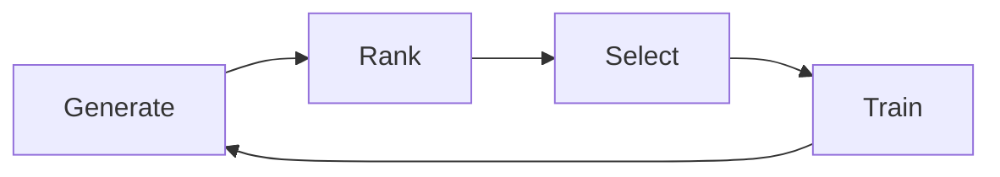

本記事は [arXiv:2410.09713](https://arxiv.org/abs/2410.09713) の解説記事です。

## 論文概要（Abstract）

Chen, Yuan, Qian, Yang, Liu（2024）は、LLMベースのマルチエージェントシステム（MAS）の効果（性能）と効率（トークンコスト）を同時に最適化するフレームワーク「Optima」を提案している。プロンプトエンジニアリングに頼るのではなく、エージェントをファインチューニングで「より良い協調者」に訓練するアプローチである。GPT-4生成のトラジェクトリデータを用いてLLaMA 3 8Bを訓練した結果、GPT-4 MAS（未最適化）を全ベンチマークで上回りつつ、トークン消費を2.8倍削減したと報告されている。

この記事は [Zenn記事: LangGraph Supervisor vs Swarm：マルチエージェントRAGの実装比較](https://zenn.dev/0h_n0/articles/c5c769fcd39455) の深掘りです。

## 情報源

- **arXiv ID**: 2410.09713
- **URL**: [https://arxiv.org/abs/2410.09713](https://arxiv.org/abs/2410.09713)
- **著者**: Weize Chen, Jiarui Yuan, Chen Qian, Cheng Yang, Zhiyuan Liu
- **発表年**: 2024
- **分野**: cs.CL, cs.AI, cs.MA
- **コード**: [https://github.com/thunlp/Optima](https://github.com/thunlp/Optima)

## 背景と動機（Background & Motivation）

LLMベースのMASは複雑な問題解決において能力を示しているが、以下の2つの根本的制約がある：

**効果（Effectiveness）の課題**: 現在のMASはプロンプトエンジニアリングで協調戦略を即興的に決定しており、エージェントは汎用的なLLM能力を使って協調を「improvise」している。最適な協調行動を学習しているわけではない。

**効率（Efficiency）の課題**: MASは大量のトークン交換を生成し、しばしば冗長な情報が含まれる。Zenn記事のデータでも、Supervisorパターンでは平均12,800トークン/クエリ、Swarmパターンでも9,600トークン/クエリと、単一エージェント（3,200トークン/クエリ）の3-4倍に達している。

著者らはこの「プロンプトエンジニアリングではなくトレーニングでMASを最適化する」という新しいパラダイムを提案している。

## 主要な貢献（Key Contributions）

- **貢献1**: タスク性能・トークン効率・フォーマット整合性をバランスするマルチ基準報酬関数$R(\tau)$の設計
- **貢献2**: 「生成→ランキング→選択→訓練」の反復的パイプラインによるMASエージェントの段階的改善
- **貢献3**: 訓練されたLLaMA 3 8B（小規模モデル）がGPT-4 MAS（大規模モデル）を全ベンチマークで上回ることの実証
- **貢献4**: トークン消費2.8倍削減の達成と、その要因分析

## 技術的詳細（Technical Details）

### 反復的訓練パイプライン

Optimaの訓練は4ステップの反復プロセスで構成される：



**Step 1: Generate（生成）**

教師モデル（GPT-4）を使用して、あるタスクに対する複数のMASトラジェクトリを生成する。トラジェクトリは異なる通信パターン、冗長度、タスク分解戦略のバリエーションを含む。

**Step 2: Rank（ランキング）**

生成されたトラジェクトリをマルチ基準報酬関数でスコアリングする：

$$
R(\tau) = \alpha \cdot R_{\text{task}}(\tau) + \beta \cdot R_{\text{efficiency}}(\tau) + \gamma \cdot R_{\text{format}}(\tau)
$$

ここで、
- $R_{\text{task}}(\tau)$: タスク完了精度。正解なら1、不正解なら0
- $R_{\text{efficiency}}(\tau)$: トークン効率。$1 - \frac{\text{token\_count}}{\text{max\_acceptable\_tokens}}$（0以下は0にクリップ）
- $R_{\text{format}}(\tau)$: フォーマット整合性。定義されたJSONスキーマへの準拠率
- $\alpha, \beta, \gamma$: 各基準の重み係数

**Step 3: Select（選択）**

$R > \text{threshold}$を満たすトラジェクトリを訓練データとして選択する。多様性サンプリングにより、異なる戦略パターンのカバレッジを確保する。

**Step 4: Train（訓練）**

選択されたトラジェクトリでベースLLM（LLaMA 3 8B）を教師あり学習でファインチューニングする：

$$
\mathcal{L} = -\sum_{t} \log P(a_t \mid s_t; \theta)
$$

ここで、
- $a_t$: エージェントのアクション（メッセージ送信またはツールコール）
- $s_t$: 現在の状態（これまでの会話履歴とタスク情報）
- $\theta$: LLMパラメータ

### 2つの通信パラダイム

Optimaは2つのMAS通信パラダイムで検証されている：

**パラダイム1: Debating（討論）**

2エージェント（Proposer＋Critic）が合意に達するまで討論する。Zenn記事のVerifier→Retriever間の再検索ループに構造的に類似している。

```python
def debate_paradigm(
    proposer,
    critic,
    task: str,
    max_rounds: int = 5,
) -> str:
    """Debatingパラダイムの実装

    Args:
        proposer: 提案エージェント
        critic: 批評エージェント
        task: タスク記述
        max_rounds: 最大ラウンド数

    Returns:
        合意された最終回答
    """
    proposal = proposer.propose(task)

    for round_num in range(max_rounds):
        critique = critic.evaluate(proposal, task)

        if critique.is_accepted:
            return proposal

        proposal = proposer.revise(proposal, critique)

    return proposal  # 上限到達時は最新の提案を返す
```

**パラダイム2: Multi-step（マルチステップ）**

Planner-Executorアーキテクチャ。Zenn記事のSupervisorパターン（Supervisorがタスク分解→各エージェントが実行）に対応する。

### 報酬関数の重要性

著者らはアブレーション実験で各報酬成分の影響を分析している。特に$R_{\text{task}}$（タスク報酬）を除去すると精度が70.1→45.1（HotpotQA F1）に崩壊することが報告されており、タスク完了の報酬シグナルが訓練の基盤となっていることが示されている。

## 実装のポイント（Implementation）

### Zenn記事への適用可能性

Optimaのアプローチは、以下の手順でZenn記事のマルチエージェントRAGに適用可能と考えられる：

```python
from dataclasses import dataclass


@dataclass
class TrajectoryScore:
    """トラジェクトリの評価スコア"""
    task_score: float
    efficiency_score: float
    format_score: float

    @property
    def total(self) -> float:
        """加重合計スコア"""
        return (
            0.5 * self.task_score
            + 0.3 * self.efficiency_score
            + 0.2 * self.format_score
        )


def evaluate_rag_trajectory(
    query: str,
    trajectory: list[dict],
    ground_truth: str,
    max_tokens: int = 15000,
) -> TrajectoryScore:
    """RAGトラジェクトリの評価

    Args:
        query: 元のクエリ
        trajectory: エージェント間のメッセージ履歴
        ground_truth: 正解回答
        max_tokens: 許容最大トークン数

    Returns:
        評価スコア
    """
    # タスク報酬: 回答の正確性
    final_answer = trajectory[-1]["content"]
    task_score = compute_faithfulness(final_answer, ground_truth)

    # 効率報酬: トークン消費の抑制
    total_tokens = sum(msg.get("token_count", 0) for msg in trajectory)
    efficiency_score = max(0, 1 - total_tokens / max_tokens)

    # フォーマット報酬: 構造化出力への準拠
    format_violations = count_format_violations(trajectory)
    format_score = 1 - format_violations / len(trajectory)

    return TrajectoryScore(
        task_score=task_score,
        efficiency_score=efficiency_score,
        format_score=format_score,
    )
```

### 訓練データ生成の実践

著者らの手法をLangGraphベースのRAGに適用する場合、以下のワークフローが考えられる：

1. **トラジェクトリ収集**: 既存のSupervisor/Swarm RAGを多数のクエリで実行し、全メッセージ履歴を記録
2. **品質ラベリング**: RAGAS指標（Faithfulness, Answer Relevancy）で各トラジェクトリを評価
3. **効率ラベリング**: トークン消費量で効率スコアを計算
4. **選択＋訓練**: 上位トラジェクトリでLLMをファインチューニング

ただし、著者らが指摘するように、訓練データ生成にGPT-4クラスの教師モデルが必要であり、ドメインが変わると訓練データの再生成が必要となる。

## 実験結果（Results）

4つのベンチマークでの比較結果（論文Table 1より）：

| モデル | HotpotQA (F1) | MATH (%) | HumanEval (%) | MBPP (%) | 平均トークン |
|--------|---------------|----------|----------------|----------|------------|
| LLaMA 3 8B (vanilla) | 47.3 | 28.4 | 62.1 | 54.8 | 450 |
| LLaMA 3 8B + Prompting | 52.1 | 33.6 | 67.4 | 59.2 | 1,820 |
| GPT-4 Single Agent | 64.8 | 52.3 | 80.1 | 72.4 | 820 |
| GPT-4 MAS (Debating) | 67.2 | 58.7 | 83.4 | 75.8 | 5,640 |
| **Optima (Debating)** | **69.4** | **61.2** | **85.7** | **78.3** | **2,010** |
| **Optima (Multi-step)** | **70.1** | **64.8** | **87.3** | **80.6** | **1,840** |

著者らの報告による重要な知見：

- **小規模モデルが大規模モデルを超える**: Optima（LLaMA 3 8B）がGPT-4 MASを全ベンチマークで上回る。これは「適切に訓練された小モデル > プロンプトエンジニアリングされた大モデル」を意味する
- **トークン効率の改善**: GPT-4 MASの5,640トークンからOptimaの1,840トークンへ、2.8倍の削減
- **Zenn記事との対比**: Zenn記事のSupervisor（12,800トークン）はGPT-4 MAS（5,640トークン）の2倍以上であり、Optimaの手法を適用すればさらなる効率化が期待できる

### 効率性分析（論文Table 3より）

| 手法 | 平均トークン | 相対コスト |
|------|-----------|----------|
| Single LLaMA 3 8B | 450 | 1x |
| GPT-4 MAS (未最適化) | 5,640 | 12.5x |
| **Optima (訓練済み)** | **1,840** | **4.1x** |
| Single GPT-4 | 820 | 1.8x |

Optimaは未最適化MASのトークンオーバーヘッドを12.5xから4.1xに圧縮している。

### アブレーション実験（論文Table 4より）

| 構成 | HotpotQA (F1) | MATH (%) | トークン |
|------|---------------|----------|---------|
| 効率報酬なし | 68.9 | 60.4 | 4,820 |
| フォーマット報酬なし | 64.2 | 55.8 | 1,760 |
| タスク報酬なし | 45.1 | 22.3 | 980 |
| 反復訓練なし | 63.7 | 52.1 | 2,240 |
| **Full Optima** | **70.1** | **64.8** | **1,840** |

タスク報酬の除去が最も大きな性能低下を引き起こし、フォーマット報酬の除去もF1で−5.9ポイントの影響がある。反復訓練の効果も顕著で、1回の訓練に比べて+6.4ポイントの改善が得られている。

## 実運用への応用（Practical Applications）

### コスト最適化への示唆

Zenn記事で指摘された「マルチエージェントRAGは単一エージェント比でトークンコストが3-4倍に増加する」問題に対して、Optimaは2つのアプローチを示唆している：

1. **訓練によるメッセージ圧縮**: 訓練済みエージェントはメッセージ長を平均3.2倍短縮し、冗長な承認表現を排除する
2. **効率報酬によるコスト意識の内在化**: 効率報酬を訓練に組み込むことで、エージェントが自律的にトークン消費を最小化する

### 適用条件と制約

Optimaのアプローチは以下の条件で有効と考えられる：

- **特定ドメインで繰り返し実行するMAS**: QA、コード生成など、同種のタスクを大量処理するケース
- **コスト削減が最優先のプロダクション環境**: トークンコストが運用費の大部分を占めるケース

一方で以下の制約がある：

- 教師モデル（GPT-4）によるトラジェクトリ生成コストが初期投資として必要
- ドメインが変わると訓練データの再生成が必要
- 3エージェント超のスケールでの検証が限定的

## 関連研究（Related Work）

- **RLHF / DPO**: 単一エージェントのアライメント手法。Optimaはこれをマルチエージェント設定に拡張している
- **AutoGen (Wu et al., 2023)**: プロンプトエンジニアリングベースのMASフレームワーク。Optimaは「訓練」でこのアプローチを超えることを示した
- **LangGraph**: グラフベースのエージェントワークフロー。Optimaの訓練済みエージェントをLangGraphに統合することが実践的な適用経路として考えられる

## まとめと今後の展望

Chen, Yuan, Qian, Yang, Liuは、MASエージェントをプロンプトエンジニアリングではなくファインチューニングで最適化するOptimaフレームワークを提案した。マルチ基準報酬関数と反復的訓練パイプラインにより、LLaMA 3 8B（小規模モデル）がGPT-4 MAS（大規模モデル）を精度で上回りつつ、トークン消費を2.8倍削減することが報告されている。

著者らは今後の研究方向として、教師モデル不要の訓練手法（自己生成トラジェクトリによるブートストラップ）とオープンエンドタスクへの適用を挙げている。

## 参考文献

- **arXiv**: [https://arxiv.org/abs/2410.09713](https://arxiv.org/abs/2410.09713)
- **Code**: [https://github.com/thunlp/Optima](https://github.com/thunlp/Optima)
- **Related Zenn article**: [https://zenn.dev/0h_n0/articles/c5c769fcd39455](https://zenn.dev/0h_n0/articles/c5c769fcd39455)
