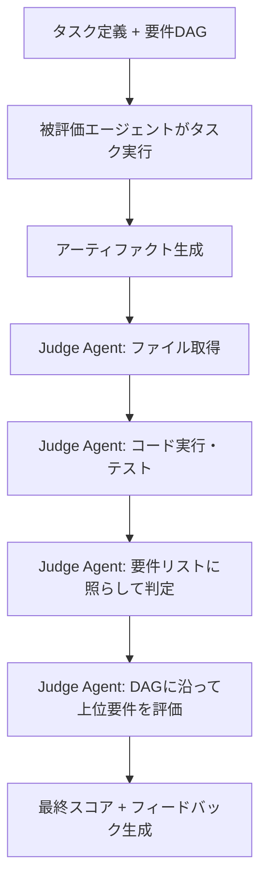

## 論文概要（Abstract）

現在のAIエージェント評価は、主に最終的なアウトカムのpass/failで判断されており、中間ステップやプロセス全体の質を評価できていない。本論文は **Agent-as-a-Judge** フレームワークを提案する。評価者自身がエージェントであり、ツール呼び出し・反復的推論・環境とのインタラクションを通じて動的な評価を行う。さらに、55のAI開発タスクと365の要件を含む **DevAI** ベンチマークを導入し、人間評価とのKendall's τ = 0.71を達成した。

この記事は [Zenn記事: マルチエージェントRAGの応答品質をLLM-as-Judgeで分解評価する実践手法](https://zenn.dev/0h_n0/articles/69bf247b252e08) の深掘りです。

## 情報源

- **arXiv ID**: 2410.10934
- **URL**: [https://arxiv.org/abs/2410.10934](https://arxiv.org/abs/2410.10934)
- **著者**: Mingchen Zhuge, Changsheng Zhao, Dylan Ashley et al.（KAUST）
- **発表年**: 2024
- **分野**: cs.AI, cs.LG

## 背景と動機（Background & Motivation）

AIエージェント評価には3つの主要なパラダイムが存在するが、著者らはそのいずれも単独では不十分であると指摘している。

| 評価手法 | 限界 |
|----------|------|
| Outcome評価（pass/fail） | 中間ステップを無視し、部分的成功を評価できない |
| Human evaluation | 高精度だが時間・コストがスケールしない |
| LLM-as-a-Judge | テキスト出力に強いが、コード実行・ファイル構造等の複雑なアーティファクトを評価できない |

LLM-as-a-Judgeは単一のフォワードパスで評価を完結するため、エージェントが生成するコードファイル、データセット、実行ログ、モデルファイルなどの複雑なアーティファクトを実際に操作して検証することができない。この制約を克服するために、評価者自身をエージェントにするアプローチが提案された。

## 主要な貢献（Key Contributions）

- **貢献1**: ツール使用・反復推論・環境インタラクションによる動的評価フレームワーク Agent-as-a-Judge を提案
- **貢献2**: 55のAI開発タスクと365の要件を含むDevAIベンチマークを構築
- **貢献3**: LLM-as-a-Judgeに対してKendall's τで61%の改善（0.38→0.71）を実証

## 技術的詳細（Technical Details）

### Agent-as-a-Judgeの設計原則

Judge Agent（評価者エージェント）は以下の4つの特性を持つ。

1. **反復的推論（Iterative Reasoning）**: 単一パスではなく、複数ステップにわたる評価プロセスを実行する
2. **ツール使用（Tool Use）**: コード実行環境、ファイルシステム読み取り、テスト実行などのツールを動的に呼び出す
3. **環境とのインタラクション**: 被評価エージェントが生成したアーティファクトを実際に操作・検証する
4. **階層的要件チェック（Hierarchical Requirements Checking）**: タスクの依存関係グラフ（DAG）に基づき、ボトムアップで要件を検証する

### 評価フロー



Judge Agentは以下のツール群を使用する。

```python
# Judge Agentが使用するツール群
tools = {
    "read_file": "ファイル内容の読み取り",
    "list_directory": "ディレクトリ構造の確認",
    "run_code": "コード実行・テスト",
    "search": "情報検索（必要に応じて）"
}
```

### 依存関係グラフ（Requirements DAG）

DevAIの各タスクは要件の有向非巡回グラフ（DAG）を持つ。Judge Agentはこのグラフをボトムアップで走査し、低レベル要件から順に検証する。

```
高レベル要件: モデルの精度がbaseline以上
    │
    └── 中レベル要件: データセットが正しく前処理される
            │
            ├── 低レベル要件: requirements.txt が正しい
            └── 低レベル要件: train.py が存在し実行可能
```

この階層的アプローチにより、「最終的にタスクは失敗したが、前処理までは正しかった」といった部分的達成を定量的に評価できる。

### LLM-as-a-Judgeとの構造比較

```
LLM-as-a-Judge:
  [タスク説明 + エージェント出力] → [単一LLM呼び出し] → [スコア]
  （静的テキスト評価、ツールなし、単一パス）

Agent-as-a-Judge:
  [タスク説明 + 環境内のアーティファクト] → [エージェントループ:
    推論 → ツール呼び出し → 観察 → 推論 → ...
  ] → [スコア + 詳細フィードバック]
  （動的評価、ツールあり、反復推論）
```

## DevAIベンチマーク

### 概要

DevAI（Developers' AI benchmark）はAI/MLコーディングタスクに特化した新規ベンチマークである。

| 特性 | 詳細 |
|------|------|
| タスク数 | 55 |
| 要件数（総計） | 365（タスクあたり平均6.6個） |
| 要件の種類 | functional, structural, performance |
| ドメイン | AI開発、機械学習、データサイエンス |
| タスク例 | "GANで画像合成"、"BERTをファインチューニング"、"RAGシステム構築" |

### タスク構造の例

```yaml
Task: "CIFAR-10でResNet-50を訓練"
Requirements:
  - [HIGH] テスト精度 > 90%
    - [MED] 訓練がエラーなく完了
      - [LOW] requirements.txt が正しい
      - [LOW] train.py が存在し実行可能
    - [MED] データ前処理が正しい
      - [LOW] データセットが正しくダウンロードされている
      - [LOW] 正規化が適用されている
```

### 評価指標

タスクレベルの評価にはKendall's τ（ケンドールの順位相関係数）を使用する。

$$
\tau = \frac{C - D}{\binom{n}{2}}
$$

ここで $C$ は一致ペア数（Judge AgentとHuman Evaluatorが同じ順序で2つのエージェントをランクする）、$D$ は不一致ペア数、$n$ は比較対象エージェント数である。$\tau = 1$ は完全一致、$\tau = -1$ は完全逆転を意味する。

## 実装のポイント（Implementation）

Judge Agentの実装において、著者らは以下の注意点を報告している。

**バックボーンモデルの選択**: Judge AgentのLLMバックボーンには被評価エージェントと同等以上の能力を持つモデルが必要である。論文ではGPT-4oを使用している。被評価エージェントより弱いモデルをJudge Agentに使用すると、評価精度が大幅に低下する。

**要件DAGの設計品質**: DAGの設計品質が評価精度に直接影響する。要件が粗すぎると部分的達成を捕捉できず、細かすぎると評価コストが増大する。タスクあたり平均6.6個の要件が適切なバランスとして報告されている。

**ツール呼び出しの制御**: Judge Agentがツールを過剰に呼び出すとコストが増大する。適切なプロンプト設計により、必要最小限のツール呼び出しで評価を完了させることが重要である。

## 実験結果（Results）

### 人間評価との一致度

DevAIにおける各評価手法とHuman Evaluationの順位相関（Kendall's τ）の比較結果を以下に示す。

| 評価手法 | Kendall's τ | 改善率（直接LLM比） |
|----------|-------------|---------------------|
| LLM-as-a-Judge（GPT-4o, 直接評価） | 0.38 | — |
| LLM-as-a-Judge（GPT-4o, CoT付き） | 0.44 | +16% |
| **Agent-as-a-Judge（提案手法）** | **0.71** | **+87%** |
| Human evaluation | 1.00 | — |

Agent-as-a-Judgeは、直接LLM評価（0.38）に対して87%、CoT付きLLM評価（0.44）に対しても61%の改善を達成した。

### 要件レベルの精度

人間評価との要件単位の一致率でも、Agent-as-a-Judgeは78〜82%の精度を達成し、LLM-as-a-Judgeの55〜60%を大幅に上回った。

### 能力別の比較

| 能力 | LLM-as-a-Judge | Agent-as-a-Judge |
|------|-----------------|-------------------|
| テキスト出力評価 | 高品質 | 高品質 |
| コード実行・テスト | 不可 | 可能 |
| ファイル構造確認 | 不可 | 可能 |
| 実行ログ解析 | 限定的 | 完全対応 |
| 要件の依存関係考慮 | 困難 | DAGで構造化 |
| 部分的達成の評価 | 粗い | 細粒度 |

### コスト・速度の比較

| 評価手法 | 評価時間 | コスト | 再現性 |
|----------|---------|--------|--------|
| Human evaluation | 数十分〜数時間 | 高 | 低 |
| LLM-as-a-Judge | 数秒〜数十秒 | 低 | 高 |
| Agent-as-a-Judge | 数十秒〜数分 | 中 | 高 |

Agent-as-a-JudgeはLLM-as-a-Judgeより高コストだが、Human Evaluationよりは大幅に低コストであり、再現性も高い。

## 実運用への応用（Practical Applications）

本論文のAgent-as-a-Judgeフレームワークは、マルチエージェントRAGの品質評価に直接応用可能である。Zenn記事で紹介した3層分解評価では、各エージェントが生成する検索結果・要約・統合応答をAgent-as-a-Judgeで動的に評価できる。

具体的な適用パターンとして以下が考えられる。

**RAG応答のFaithfulness評価**: Judge Agentが検索ソースを実際に読み取り、応答との整合性をツールで検証
**コード生成エージェントの評価**: Judge Agentが生成コードを実行し、要件DAGに基づいて機能性を検証
**マルチエージェント協調の評価**: 各エージェントの中間出力をトラジェクトリとして記録し、Agent-as-a-Judgeで部分的達成を定量化

## 関連研究（Related Work）

- **Zheng et al. (2023)**: MT-BenchとChatbot Arenaを提案し、LLM-as-a-Judgeの有効性を実証。本論文はこの手法の限界を克服するために提案された
- **Heurtel-Depeiges et al. (2025)**: Agent-as-a-Judgeサーベイとして、本論文を含む評価手法を体系的に整理。60件以上のデータセットとコスト比較を提供
- **AgentBench (Liu et al., 2024)**: 8環境でのエージェント評価ベンチマーク。DevAIはAI開発タスクに特化することで、より実践的な評価を実現

## まとめと今後の展望

本論文は「エージェントはエージェントで評価すべき」という原則を実験的に実証した。Agent-as-a-JudgeはLLM-as-a-Judgeに対してKendall's τで87%の改善を達成し、複雑なアーティファクトを生成するエージェントの評価に有効であることを示した。

著者らが認める限界として、Judge AgentのバックボーンLLMの能力への依存、DevAIがAI/MLドメインに限定されていること、要件DAGの設計品質への依存がある。今後は、マルチモーダルなアーティファクト評価、長期ホライズンタスクへの拡張、ドメイン非依存のAgent-as-a-Judgeフレームワークの構築が研究課題となるだろう。

## 参考文献

- **arXiv**: [https://arxiv.org/abs/2410.10934](https://arxiv.org/abs/2410.10934)
- **Related Zenn article**: [https://zenn.dev/0h_n0/articles/69bf247b252e08](https://zenn.dev/0h_n0/articles/69bf247b252e08)
- **Zheng et al. (2023)**: [https://arxiv.org/abs/2306.05685](https://arxiv.org/abs/2306.05685) — MT-Bench and Chatbot Arena
- **Heurtel-Depeiges et al. (2025)**: [https://arxiv.org/abs/2508.02994](https://arxiv.org/abs/2508.02994) — When AIs Judge AIs Survey
- **AgentBench**: [https://arxiv.org/abs/2406.13925](https://arxiv.org/abs/2406.13925) — Evaluating LLMs as Agents
