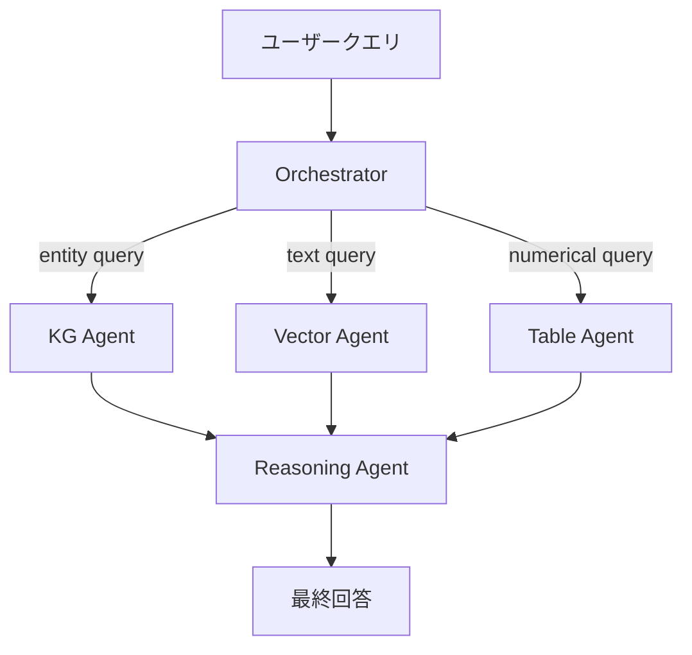

本記事は [arXiv:2411.02393](https://arxiv.org/abs/2411.02393) の解説記事です。

## 論文概要（Abstract）

Xu, Liu, Shi, Zhang（2024）は、金融質問応答（QA）のためのマルチエージェントシステム「GraphRAG-FinQA」を提案している。知識グラフ（KG）とRAGを統合し、KGエージェント・ベクトルエージェント・テーブルエージェント・推論エージェントの4エージェントチームで構成される。FinQAデータセットにおいてExact Match（EM）63.4%、Execution Accuracy（EA）71.8%を達成し、単一エージェントGPT-4（EM 43.2%）やMicrosoft GraphRAG（EM 56.8%）を上回ると報告されている。

この記事は [Zenn記事: LangGraph Supervisor vs Swarm：マルチエージェントRAGの実装比較](https://zenn.dev/0h_n0/articles/c5c769fcd39455) の深掘りです。

## 情報源

- **arXiv ID**: 2411.02393
- **URL**: [https://arxiv.org/abs/2411.02393](https://arxiv.org/abs/2411.02393)
- **著者**: Bolun Xu, Kunhao Liu, Lin Shi, Jixin Zhang
- **発表年**: 2024
- **分野**: cs.CL, cs.IR

## 背景と動機（Background & Motivation）

金融QAは通常のRAGでは対応困難な以下の4つの課題を持つ：

1. **マルチホップ推論**: 複数文書の情報を連鎖的に接続する必要がある（例：「A社の子会社B社の2024年Q3売上は？」）
2. **数値推論**: 取得した財務数値に対する正確な計算が要求される
3. **エンティティ曖昧性**: 同名の企業・製品・金融商品の区別
4. **時系列推論**: 時間軸に沿った財務データの正確な参照

これらの課題は、Zenn記事で指摘された「複雑なクエリに対して精度が頭打ちになる」という単一エージェントRAGの限界と根本的に同じ問題である。著者らはKGによる構造的関係表現とマルチエージェントによる検索戦略の分離を組み合わせることで、この課題に対処している。

## 主要な貢献（Key Contributions）

- **貢献1**: 金融エンティティ間の関係をKGで構造化し、SPARQL traversalによるエンティティ解決と関係クエリを実現
- **貢献2**: KGエージェント・ベクトルエージェント・テーブルエージェント・推論エージェントの4エージェントチームアーキテクチャで、検索戦略の専門化を達成
- **貢献3**: オーケストレーターがクエリタイプに応じて動的にエージェントを割り当てるプロトコルを設計

## 技術的詳細（Technical Details）

### システムアーキテクチャ

GraphRAG-FinQAは以下の4コンポーネントで構成される：



Zenn記事の4エージェント構成（Query Planner・Retriever・Verifier・Synthesizer）と比較すると、GraphRAG-FinQAは**検索戦略の軸でエージェントを分離**している点が特徴的である。Zenn記事は**処理フェーズの軸で分離**（計画→検索→検証→統合）しており、設計思想が異なる。

### 知識グラフの構築

KGは金融文書から以下の3層構造で構築される：

- **エンティティ**: 企業、製品、メトリクス、日付、経営者
- **関係**: owns, subsidiary_of, reports_to, acquired, has_metric
- **属性**: 時間的妥当性を持つ財務数値

KGの構築にはドメイン特化型のNERモデルとファインチューニングされたBERTによる関係抽出が使用されている。

### 4エージェントの役割

**KG Agent**: SPARQLクエリによる知識グラフ走査を担当。エンティティ関係クエリの処理と、KG構造を利用したエンティティ曖昧性の解決を行う。

**Vector Agent**: 文書埋め込みに対するセマンティック類似度検索を担当。Sentence Transformerでエンコーディングし、非構造化テキストの検索を行う。

**Table Agent**: 表形式の財務データの抽出と推論を担当。メタデータによる関連テーブルの特定と、クエリコンテキストに基づくセルの抽出を行う。

**Reasoning Agent**: マルチソース情報の統合を担当。数値計算の検証、ソース間の整合性チェック、信頼度加重による回答統合を行う。

### オーケストレーションプロトコル

オーケストレーターはクエリタイプに応じた動的プロトコルを実装している：

```python
from enum import Enum
from dataclasses import dataclass


class QueryType(Enum):
    """クエリタイプの分類"""
    ENTITY = "entity"
    NUMERICAL = "numerical"
    TEMPORAL = "temporal"
    MULTI_HOP = "multi_hop"


@dataclass
class OrchestratorResult:
    """オーケストレーション結果"""
    query_type: QueryType
    agent_results: list[dict]
    final_answer: str


def orchestrate(
    query: str,
    kg_agent,
    vector_agent,
    table_agent,
    reasoning_agent,
) -> OrchestratorResult:
    """クエリタイプに応じた動的オーケストレーション

    Args:
        query: ユーザークエリ
        kg_agent: 知識グラフ検索エージェント
        vector_agent: ベクトル検索エージェント
        table_agent: テーブル検索エージェント
        reasoning_agent: 推論エージェント

    Returns:
        オーケストレーション結果
    """
    # Step 1: クエリタイプ分類
    query_type = classify_query(query)

    # Step 2: タイプに応じたエージェント割り当て
    if query_type == QueryType.ENTITY:
        results = [kg_agent.retrieve(query)]
    elif query_type == QueryType.NUMERICAL:
        results = [
            table_agent.retrieve(query),
            vector_agent.retrieve(query),
        ]
    elif query_type == QueryType.MULTI_HOP:
        # 逐次検索: 中間結果で次のクエリを精緻化
        step1 = kg_agent.retrieve(query)
        refined_query = refine_query(query, step1)
        step2 = vector_agent.retrieve(refined_query)
        results = [step1, step2]
    else:
        results = [vector_agent.retrieve(query)]

    # Step 3: 推論エージェントによる統合
    answer = reasoning_agent.synthesize(query, results)

    return OrchestratorResult(
        query_type=query_type,
        agent_results=results,
        final_answer=answer,
    )
```

このプロトコルはZenn記事のSupervisorパターンと構造的に類似している。Supervisorが「全体の実行フローを制御」し「条件分岐（再検索の判断等）が容易」である点が共通している。

### Zenn記事のパターンとの対応

| GraphRAG-FinQA | Zenn記事 Supervisor | Zenn記事 Swarm |
|---|---|---|
| Orchestrator（中央制御） | Supervisor（中央制御） | なし（各エージェントが自律判断） |
| KG/Vector/Table Agent | Retriever（複数ソース統合） | Retriever（ハンドオフで次へ） |
| Reasoning Agent | Synthesizer | Synthesizer |
| クエリタイプ分類 | Supervisorの判断 | Query Plannerの出力 |

## 実験結果（Results）

FinQAデータセット（SEC提出書類からの8,281件の金融QAペア）での評価結果（論文Table 1より）：

| モデル | EM (%) | EA (%) |
|--------|--------|--------|
| Single-agent GPT-4 | 43.2 | 51.8 |
| Standard RAG (BM25 + GPT-3.5) | 48.7 | 56.4 |
| Dense RAG (FAISS + GPT-4) | 52.3 | 61.2 |
| GraphRAG (Microsoft) | 56.8 | 64.9 |
| FinBERT-QA | 54.1 | 63.7 |
| **GraphRAG-FinQA** | **63.4** | **71.8** |

アブレーション実験（論文Table 2より）：

| 構成 | EM (%) |
|------|--------|
| KG Agentなし | 56.1 (−7.3) |
| Vector Agentなし | 58.9 (−4.5) |
| Table Agentなし | 52.3 (−11.1) |
| Reasoning Agentなし（単純連結） | 55.7 (−7.7) |
| **Full System** | **63.4** |

著者らの報告では、Table Agentの寄与が最大（除去時−11.1ポイント）であり、これは金融QAにおける数値データの重要性を反映している。KG Agentの寄与（−7.3ポイント）はエンティティ解決の効果を示す。

### エラー分析

著者らは失敗モードを以下のように分類している（論文Section 3.5より）：

- **数値エラー**（35%）: 正しく検索したが計算が誤り
- **検索失敗**（28%）: 関連情報の取得漏れ
- **時系列エラー**（22%）: 古い数値の使用
- **統合エラー**（15%）: エージェント出力間の不整合

Zenn記事のVerifierエージェントは検索失敗（28%）の問題に対処するための設計であり、GraphRAG-FinQAにはVerifierに相当するエージェントが存在しない点が注目される。

## 実運用への応用（Practical Applications）

### Zenn記事の設計への示唆

GraphRAG-FinQAのアプローチから、Zenn記事のマルチエージェントRAGに対して以下の設計改善が示唆される：

1. **検索戦略の多様化**: Zenn記事のRetrieverは`search_vector_db`と`search_web`の2ツールだが、KGベースの構造化検索やテーブル検索を追加することで、GraphRAG-FinQAのような多軸検索が実現できる

2. **クエリタイプに応じた動的ルーティング**: Zenn記事のhybrid_router（クエリ複雑度判定）に加えて、クエリの**種類**（エンティティ・数値・時系列・マルチホップ）に基づくルーティングが有効である

3. **数値検証の専用エージェント**: GraphRAG-FinQAのReasoning Agentが行う数値計算検証は、Zenn記事のVerifierに統合可能な機能である

### ドメイン適用の条件

GraphRAG-FinQAのアプローチは、以下の条件を満たすドメインで有効と考えられる：

- エンティティ間の関係が明確で構造化可能（金融・医療・法務）
- 表形式データが重要な情報源（財務諸表・臨床データ・契約条件）
- 数値の正確性が必須（金融計算・投薬量・法定期限）

## 関連研究（Related Work）

- **Microsoft GraphRAG (Edge et al., 2024)**: グラフベースの検索とLLMの統合。GraphRAG-FinQAはこれをマルチエージェント化し、EM +6.6ポイントの改善を報告している
- **Lewis et al., 2020 (RAG)**: 検索拡張生成の原論文。GraphRAG-FinQAは単一検索戦略のRAGを複数の専門化エージェントに拡張している
- **FinBERT**: 金融ドメイン特化型BERT。ドメイン適応モデルとしてのベースラインとして使用されている

## まとめと今後の展望

Xu, Liu, Shi, Zhangは、知識グラフとマルチエージェントチームの組み合わせにより、金融QAにおいて単一エージェントGPT-4比で+20.2ポイント（EM）の改善を報告した。4エージェントの検索戦略別分離（KG・ベクトル・テーブル・推論）は、Zenn記事の処理フェーズ別分離（計画・検索・検証・統合）とは異なる設計軸であり、両アプローチは補完的に適用可能と考えられる。

今後の研究方向として、著者らはリアルタイム市場データへの拡張とマルチモーダル入力（チャート画像の解析等）への対応を挙げている。

## 参考文献

- **arXiv**: [https://arxiv.org/abs/2411.02393](https://arxiv.org/abs/2411.02393)
- **Related Zenn article**: [https://zenn.dev/0h_n0/articles/c5c769fcd39455](https://zenn.dev/0h_n0/articles/c5c769fcd39455)
