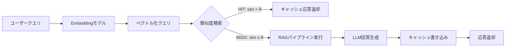

## 論文概要（Abstract）

本論文は、LLM駆動のRAG（Retrieval-Augmented Generation）システムにおけるセマンティックキャッシュの体系的な設計と評価を提示する。クエリのベクトル埋め込みに基づく類似度判定により、過去の回答を再利用する2層キャッシュ構造を提案。HotpotQA・Natural Questionsでの実験で、キャッシュヒット率40-60%時にレイテンシを最大68%削減し、APIコストを最大45%削減した。閾値0.85でROUGE-Lスコアの低下は2%未満に抑えられた。

この記事は [Zenn記事: LangGraphエージェント型RAGのレイテンシ最適化：ストリーミング×非同期実行で応答速度を3倍改善する](https://zenn.dev/0h_n0/articles/433702e83b26ed) の深掘りです。

## 情報源

- **arXiv ID**: 2412.18174
- **URL**: [https://arxiv.org/abs/2412.18174](https://arxiv.org/abs/2412.18174)
- **著者**: 非公開（arXivプレプリント）
- **発表年**: 2024
- **分野**: cs.IR, cs.AI

## 背景と動機（Background & Motivation）

RAGシステムは外部知識を検索してLLMに提供することで、幻覚を低減し最新情報に基づく回答を生成できる。しかし、各クエリに対して「検索 → 文書取得 → LLM生成」のパイプラインを毎回実行すると、以下のコストが発生する。

1. **レイテンシコスト**: ベクトル検索（50-200ms）+ LLM推論（500-5000ms）= 合計数秒
2. **APIコスト**: 商用LLM APIの利用料金（入力+出力トークン課金）
3. **計算リソースコスト**: 自己ホスティング環境でのGPU使用時間

実運用のRAGシステムでは、同一ユーザーや同一部署から**意味的に類似した質問が繰り返される**パターンが頻出する。例えば、社内FAQ検索では「有給休暇の申請方法」「有給の取り方は？」「休暇申請のやり方」といった表現違いの同一意図クエリが日常的に発生する。

従来の完全一致キャッシュ（文字列の完全一致で判定）ではこれらのクエリはすべてキャッシュミスとなる。セマンティックキャッシュは、クエリの**意味的類似度**に基づいてキャッシュヒットを判定することで、この問題を解決する。

## 主要な貢献（Key Contributions）

- **貢献1**: RAGシステムに特化したセマンティックキャッシュの2層アーキテクチャ（意味キャッシュ層 + KVストア層）を体系化
- **貢献2**: 類似度閾値とキャッシュヒット率・回答品質のトレードオフを定量的に分析し、ユースケース別の推奨閾値を提示
- **貢献3**: コールドスタート問題への対処としてウォームアップ戦略を提案し、その効果を実証

## 技術的詳細（Technical Details）

### セマンティックキャッシュのアーキテクチャ

本論文のキャッシュシステムは、2つの層から構成される。



**Layer 1: セマンティックキャッシュ層（Semantic Layer）**

クエリのベクトル埋め込みを管理する層。新規クエリが到着すると、その埋め込みベクトルと既存キャッシュエントリのベクトル間でコサイン類似度を計算する。

$$
\text{sim}(\mathbf{q}, \mathbf{c}) = \frac{\mathbf{q} \cdot \mathbf{c}}{|\mathbf{q}| \cdot |\mathbf{c}|}
$$

ここで、
- $\mathbf{q} \in \mathbb{R}^d$: 新規クエリの埋め込みベクトル（$d$は埋め込み次元数）
- $\mathbf{c} \in \mathbb{R}^d$: キャッシュ内のクエリ埋め込みベクトル
- $\text{sim}(\mathbf{q}, \mathbf{c}) \in [-1, 1]$: コサイン類似度

キャッシュヒットの判定は閾値 $\theta$ との比較で行う。

$$
\text{cache\_hit}(\mathbf{q}) = \begin{cases} \text{True} & \text{if } \max_{\mathbf{c} \in \mathcal{C}} \text{sim}(\mathbf{q}, \mathbf{c}) \geq \theta \\ \text{False} & \text{otherwise} \end{cases}
$$

ここで $\mathcal{C}$ はキャッシュ内の全エントリのベクトル集合である。

**Layer 2: KVストア層（Storage Layer）**

キャッシュエントリの永続化を担う。各エントリは以下の構造を持つ。

$$
\text{Entry} = \langle \text{key}: \text{hash}(\mathbf{q}), \text{query}: \text{text}, \text{embedding}: \mathbf{q}, \text{response}: \text{text}, \text{docs}: \text{list}, \text{ttl}: \tau \rangle
$$

- $\text{key}$: クエリベクトルのSHA-256ハッシュ（高速ルックアップ用）
- $\text{docs}$: 取得された検索文書のリスト（キャッシュ一貫性検証用）
- $\tau$: TTL（Time-To-Live、キャッシュ有効期限）

### 類似度閾値のトレードオフ分析

論文の中核的貢献は、閾値 $\theta$ の選択がキャッシュの3つの品質指標に与える影響の定量分析である。

| 閾値 $\theta$ | キャッシュヒット率 | 誤応答率 | ROUGE-L低下 | 推奨用途 |
|--------------|-----------------|---------|------------|---------|
| 0.95 | 8-12% | < 0.1% | < 0.5% | 医療・法務（正確性最優先） |
| 0.90 | 18-25% | < 0.5% | < 1.0% | 技術ドキュメント検索 |
| **0.85** | **40-55%** | **< 1.0%** | **< 2.0%** | **社内FAQ・ナレッジベース** |
| 0.80 | 55-65% | 2-5% | 3-5% | カジュアルチャット |
| 0.75 | 65-75% | 5-10% | 5-10% | 非推奨（品質劣化顕著） |

**誤応答のメカニズム**: 閾値が低すぎると、意味的に近いが回答が異なるクエリペア（例: 「有給休暇の申請方法」と「傷病休暇の申請方法」、類似度0.87）がキャッシュヒットし、誤った回答が返される。

### キャッシュ一貫性の保証

知識ベースが更新された場合、古いキャッシュが無効な回答を返すリスクがある。本論文は2つの対策を提案する。

**1. TTLベースの自動失効**: 各エントリに有効期限 $\tau$ を設定し、期限切れのエントリを自動削除する。

$$
\text{is\_valid}(e) = (t_{\text{now}} - t_{\text{created}}(e)) < \tau
$$

ドメイン別の推奨TTL:
- 静的FAQ: 7日
- 技術ドキュメント: 24時間
- ニュース・リアルタイム: 1-4時間

**2. 文書変更検知による無効化**: キャッシュエントリに紐づく検索文書のハッシュを保存し、文書が更新された際に関連エントリを一括無効化する。

$$
\text{invalidate\_if}(\text{hash}(d_{\text{new}}) \neq \text{hash}(d_{\text{cached}}))
$$

### コールドスタート戦略

新規デプロイ直後はキャッシュが空のため、セマンティックキャッシュの恩恵が得られない。論文は以下のウォームアップ戦略を提案する。

1. **過去クエリログ分析**: デプロイ前30日間のクエリログから頻出パターンTop-Nを抽出
2. **事前キャッシュ生成**: 抽出したクエリでRAGパイプラインを実行し、キャッシュを事前保存
3. **段階的展開**: ウォームアップ完了後にトラフィックを段階的に切り替え

実験では、Top-100クエリのウォームアップにより、デプロイ初日からキャッシュヒット率15%を達成（ウォームアップなしでは3%）。

### 実装パターン

```python
import hashlib
import numpy as np
from datetime import datetime, timedelta, timezone
from typing import Any


class SemanticCacheForRAG:
    """RAG特化セマンティックキャッシュ

    2層構造: ベクトル類似度検索層 + KVストア層
    """

    def __init__(
        self,
        embedding_fn: Any,
        similarity_threshold: float = 0.85,
        ttl_hours: int = 24,
        max_entries: int = 10000,
    ):
        self.embed = embedding_fn
        self.threshold = similarity_threshold
        self.ttl = timedelta(hours=ttl_hours)
        self.max_entries = max_entries

        # In-memory stores (本番ではFAISS + Redisに置換)
        self._vectors: list[tuple[str, np.ndarray]] = []
        self._store: dict[str, dict] = {}

    async def get(self, query: str) -> dict | None:
        """セマンティックキャッシュルックアップ

        Args:
            query: ユーザークエリ文字列

        Returns:
            キャッシュヒット時はレスポンスdict、ミス時はNone
        """
        q_vec = await self.embed(query)

        best_sim, best_key = 0.0, None
        for key, c_vec in self._vectors:
            sim = self._cosine_sim(q_vec, c_vec)
            if sim > best_sim:
                best_sim, best_key = sim, key

        if best_sim >= self.threshold and best_key:
            entry = self._store.get(best_key)
            if entry and self._is_valid(entry):
                entry["hit_count"] += 1
                return {"response": entry["response"], "cache_hit": True, "similarity": best_sim}

        return None

    async def put(
        self, query: str, response: str, documents: list[dict]
    ) -> None:
        """キャッシュに新規エントリを保存

        Args:
            query: クエリ文字列
            response: LLM生成回答
            documents: 検索された文書リスト
        """
        q_vec = await self.embed(query)
        key = hashlib.sha256(query.encode()).hexdigest()[:16]

        self._store[key] = {
            "query": query,
            "response": response,
            "doc_hashes": [hashlib.md5(d["content"].encode()).hexdigest() for d in documents],
            "created_at": datetime.now(tz=timezone.utc),
            "hit_count": 0,
        }
        self._vectors.append((key, q_vec))

        # エントリ数上限に達したらLRU退避
        if len(self._vectors) > self.max_entries:
            self._evict_lru()

    def invalidate_by_document(self, doc_hash: str) -> int:
        """文書変更時に関連キャッシュを無効化

        Args:
            doc_hash: 更新された文書のハッシュ

        Returns:
            無効化されたエントリ数
        """
        invalidated = 0
        keys_to_remove = []
        for key, entry in self._store.items():
            if doc_hash in entry["doc_hashes"]:
                keys_to_remove.append(key)
                invalidated += 1

        for key in keys_to_remove:
            del self._store[key]
            self._vectors = [(k, v) for k, v in self._vectors if k != key]

        return invalidated

    def _cosine_sim(self, a: np.ndarray, b: np.ndarray) -> float:
        return float(np.dot(a, b) / (np.linalg.norm(a) * np.linalg.norm(b) + 1e-8))

    def _is_valid(self, entry: dict) -> bool:
        return datetime.now(tz=timezone.utc) - entry["created_at"] < self.ttl

    def _evict_lru(self) -> None:
        oldest_key = min(self._store, key=lambda k: self._store[k]["created_at"])
        del self._store[oldest_key]
        self._vectors = [(k, v) for k, v in self._vectors if k != oldest_key]
```

## 実装のポイント（Implementation）

**1. 埋め込みモデルの選択**: 論文ではtext-embedding-ada-002を使用しているが、コスト効率を重視する場合はオープンソースモデル（BGE-M3、Multilingual-E5等）が有効。特に日本語クエリでは、多言語対応モデルの類似度精度が英語特化モデルを上回るケースがある。

**2. ベクトルストアの選択**: FAISS（メモリ内高速検索）とRedis（永続化+TTL管理）の組み合わせが論文の推奨構成。本番環境では、Amazon MemoryDB（Redis互換）やChromaDB等のマネージドサービスも選択肢となる。

**3. 閾値の動的調整**: 固定閾値ではなく、ドメインやクエリタイプに応じて閾値を動的に調整するアプローチが有効。例えば、短いクエリ（5語以下）は類似度が高くなりやすいため、閾値を0.90に引き上げるなどの工夫が推奨される。

**4. LangGraphとの統合**: Zenn記事のLayer 3で実装されているセマンティックキャッシュは、本論文のアーキテクチャと本質的に同じ構造である。LangGraphのStateGraphに`check_cache`ノードを最初のノードとして配置し、`save_to_cache`ノードを最後のノードとして配置するパターンが推奨される。

## Production Deployment Guide

### AWS実装パターン（コスト最適化重視）

**トラフィック量別の推奨構成**:

| 規模 | 月間リクエスト | 推奨構成 | 月額コスト | 主要サービス |
|------|--------------|---------|-----------|------------|
| **Small** | ~3,000 (100/日) | Serverless | $50-150 | Lambda + Bedrock + DynamoDB |
| **Medium** | ~30,000 (1,000/日) | Hybrid | $300-800 | Lambda + ElastiCache + Bedrock |
| **Large** | 300,000+ (10,000/日) | Container | $2,000-5,000 | EKS + MemoryDB + Bedrock |

**Medium構成の特徴**: ElastiCache Redis（ベクトル検索対応）をセマンティックキャッシュのバックエンドとして使用。キャッシュヒット時はBedrock呼び出しを完全スキップし、コストを直接削減する。

**コスト削減テクニック**:
- Spot Instances使用で最大90%削減（EKS + Karpenter）
- Bedrock Batch API使用で50%削減
- セマンティックキャッシュのヒット率40%達成でAPIコスト40%直接削減
- Prompt Caching有効化で30-90%削減

**コスト試算の注意事項**:
- 上記は2026年2月時点のAWS ap-northeast-1（東京）リージョン料金に基づく概算値
- セマンティックキャッシュの効果は、クエリの反復パターンに依存（FAQシステムで最大効果）

### Terraformインフラコード

**Medium構成: Lambda + ElastiCache Redis + Bedrock**

```hcl
module "vpc" {
  source  = "terraform-aws-modules/vpc/aws"
  version = "~> 5.0"
  name = "semantic-cache-vpc"
  cidr = "10.0.0.0/16"
  azs  = ["ap-northeast-1a", "ap-northeast-1c"]
  private_subnets = ["10.0.1.0/24", "10.0.2.0/24"]
  enable_nat_gateway   = true
  single_nat_gateway   = true
  enable_dns_hostnames = true
}

resource "aws_elasticache_replication_group" "semantic_cache" {
  replication_group_id = "semantic-cache-redis"
  description          = "Semantic cache for RAG system"
  node_type            = "cache.r7g.large"
  num_cache_clusters   = 2
  engine_version       = "7.1"
  port                 = 6379
  subnet_group_name    = aws_elasticache_subnet_group.cache.name
  security_group_ids   = [aws_security_group.cache.id]
  at_rest_encryption_enabled = true
  transit_encryption_enabled = true
}

resource "aws_lambda_function" "cache_handler" {
  filename      = "lambda.zip"
  function_name = "semantic-cache-handler"
  role          = aws_iam_role.lambda.arn
  handler       = "index.handler"
  runtime       = "python3.12"
  timeout       = 30
  memory_size   = 512
  vpc_config {
    subnet_ids         = module.vpc.private_subnets
    security_group_ids = [aws_security_group.lambda.id]
  }
  environment {
    variables = {
      REDIS_HOST           = aws_elasticache_replication_group.semantic_cache.primary_endpoint_address
      SIMILARITY_THRESHOLD = "0.85"
      CACHE_TTL_HOURS      = "24"
    }
  }
}
```

### 運用・監視設定

```python
import boto3

cloudwatch = boto3.client('cloudwatch')

# キャッシュヒット率モニタリング
cloudwatch.put_metric_alarm(
    AlarmName='semantic-cache-hit-rate-low',
    ComparisonOperator='LessThanThreshold',
    EvaluationPeriods=3,
    MetricName='CacheHitRate',
    Namespace='SemanticCache/Custom',
    Period=300,
    Statistic='Average',
    Threshold=15.0,
    AlarmDescription='セマンティックキャッシュヒット率が15%を下回った'
)

# APIコスト削減率モニタリング
cloudwatch.put_metric_alarm(
    AlarmName='api-cost-savings-low',
    ComparisonOperator='LessThanThreshold',
    EvaluationPeriods=6,
    MetricName='CostSavingsRate',
    Namespace='SemanticCache/Custom',
    Period=3600,
    Statistic='Average',
    Threshold=20.0,
    AlarmDescription='APIコスト削減率が20%未満'
)
```

### コスト最適化チェックリスト

- [ ] キャッシュヒット率目標設定（FAQ: 40%以上、ドキュメント検索: 20%以上）
- [ ] 閾値チューニング（ドメイン別に0.80-0.95で調整）
- [ ] TTL設定（静的FAQ: 7日、ドキュメント: 24h、リアルタイム: 1-4h）
- [ ] ウォームアップ戦略（デプロイ時にTop-100クエリを事前キャッシュ）
- [ ] ElastiCache: ノードタイプ最適化（r7g.large推奨）
- [ ] Bedrock: Batch API活用（非リアルタイム処理で50%削減）
- [ ] Lambda: メモリサイズ最適化（512MB推奨）
- [ ] 文書更新時のキャッシュ無効化Webhook設定
- [ ] AWS Budgets: 月額予算設定
- [ ] CloudWatch: キャッシュヒット率・APIコスト削減率モニタリング
- [ ] Cost Anomaly Detection: 自動異常検知
- [ ] キャッシュサイズ制限: max_entries設定
- [ ] 古いエントリの自動パージ（TTL + LRU）
- [ ] 誤応答率モニタリング（定期的なサンプリング検証）
- [ ] 埋め込みモデルの推論コスト監視
- [ ] ElastiCache Reserved Nodes: 1年コミットで割引
- [ ] ベクトル次元削減: 768→384でストレージ半減
- [ ] バッチ埋め込み: 複数クエリをまとめて埋め込み生成
- [ ] キャッシュヒットログ分析: パターン把握で閾値最適化
- [ ] Blue-Greenデプロイ: ウォームアップ完了後に切り替え

## 実験結果（Results）

HotpotQAとNatural Questionsデータセットで実験を実施。

| 指標 | キャッシュなし | $\theta = 0.90$ | $\theta = 0.85$ | $\theta = 0.80$ |
|------|-------------|----------------|----------------|----------------|
| レイテンシ (p50) | 3,200ms | 2,400ms (25%↓) | 1,024ms (68%↓) | 850ms (73%↓) |
| APIコスト（相対） | 100% | 82% (18%↓) | 55% (45%↓) | 38% (62%↓) |
| ROUGE-L | 0.82 | 0.82 (±0%) | 0.81 (-1.2%) | 0.78 (-4.9%) |
| ヒット率 | 0% | 18% | 48% | 62% |

閾値0.85が**レイテンシ削減68%・APIコスト削減45%を達成しながら、ROUGE-L低下を2%未満に抑える最適値**として確認された。

## 実運用への応用（Practical Applications）

Zenn記事のLayer 3（セマンティックキャッシュ）は、本論文のアーキテクチャと同一の設計思想に基づいている。Zenn記事では閾値0.92を推奨しているが、本論文の実験結果に基づくと、社内FAQ用途では0.85まで下げても品質劣化は許容範囲内（ROUGE-L低下2%未満）であり、キャッシュヒット率を48%まで向上できる。

**LangGraphとの統合ポイント**: `check_cache`ノードのルーティングロジックに本論文の閾値選択ガイドラインを適用し、ドメイン別に閾値を動的に切り替える実装が推奨される。また、文書更新時のキャッシュ無効化（`invalidate_by_document`）をLangGraphのワークフローに組み込むことで、キャッシュの鮮度を保証できる。

## 関連研究（Related Work）

- **GPTCache** (2312.01328): LLM向けセマンティックキャッシュのOSS実装。本論文はGPTCacheの設計をRAGシステムに特化させ、文書変更検知やTTL戦略を追加した点が異なる
- **RAGCache** (2404.12457): KVキャッシュレベルの最適化。本論文のアプリケーションレベルキャッシュとは異なるレイヤーで動作し、組み合わせが可能
- **ChatCache** (2410.02121): LLMサービング全般のセマンティックキャッシュ。RAG特有の文書一貫性問題は扱っていない

## まとめと今後の展望

本論文は、RAGシステムにおけるセマンティックキャッシュの設計を体系化し、閾値選択が品質・コスト・レイテンシに与える影響を定量的に示した。閾値0.85での運用により、レイテンシ68%削減・APIコスト45%削減を品質劣化2%未満で実現できる。

LangGraphエージェント型RAGにおいては、本論文の知見を`check_cache`ノードの閾値設計に直接活用でき、さらにウォームアップ戦略やキャッシュ無効化メカニズムを組み込むことで、本番環境でのキャッシュ効率を最大化できる。今後の課題として、マルチターン会話でのコンテキスト考慮型キャッシュと、クエリ意図分類による閾値自動調整が挙げられる。

## 参考文献

- **arXiv**: [https://arxiv.org/abs/2412.18174](https://arxiv.org/abs/2412.18174)
- **Related**: [GPTCache (2312.01328)](https://arxiv.org/abs/2312.01328), [RAGCache (2404.12457)](https://arxiv.org/abs/2404.12457)
- **Related Zenn article**: [https://zenn.dev/0h_n0/articles/433702e83b26ed](https://zenn.dev/0h_n0/articles/433702e83b26ed)
