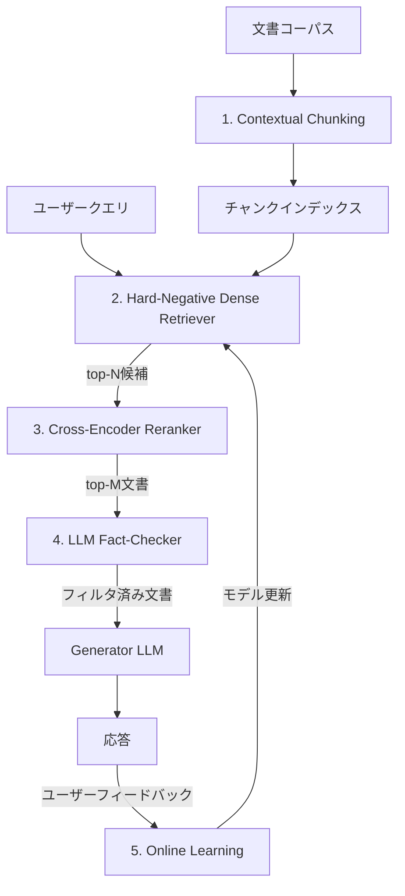

本記事は [https://arxiv.org/abs/2501.12372](https://arxiv.org/abs/2501.12372) の解説記事です。

## 論文概要（Abstract）

HAC-Retrievalは、RAGシステムが検索する「汚染されたコンテキスト」（無関係文書・敵対的文書・反事実文書）に対処するための階層的パイプラインである。Contextual Chunking、Cross-Encoderガイドによるハードネガティブ学習、Cross-Encoderリランキング、LLMベースのファクトチェック、オンライン学習の5コンポーネントを統合し、NQ・TriviaQA・HotpotQA・FEVERの4ベンチマークで既存手法を上回る性能を達成したと報告されている。

この記事は [Zenn記事: create_supervisorで実装するマルチエージェントRAGと社内検索精度2.1倍改善](https://zenn.dev/0h_n0/articles/9677305f7e25d8) の深掘りです。

## 情報源

- **arXiv ID**: 2501.12372
- **URL**: [https://arxiv.org/abs/2501.12372](https://arxiv.org/abs/2501.12372)
- **著者**: Shiwen Ni, Min Yang
- **発表年**: 2025
- **分野**: cs.IR, cs.AI, cs.CL

## 背景と動機（Background & Motivation）

RAGシステムは外部知識を検索してLLMの応答品質を向上させる技術であるが、検索された文書が常に正確であるとは限らない。著者らは、検索汚染（corrupted context）を3つのカテゴリに分類している。

1. **無関係コンテキスト（Irrelevant）**: 意味的に類似しているが、事実として無関係な文書。ベクトル検索で頻発する
2. **敵対的コンテキスト（Adversarial）**: システムを誤誘導するために意図的に作成された文書
3. **反事実コンテキスト（Counterfactual）**: 確立された事実と矛盾する情報を含む文書

従来手法（RobustRAG [Shi et al., 2024]、CRAG [Yan et al., 2024]等）はこれらのうち1種類にのみ対処しており、複数の汚染タイプを包括的に処理するフレームワークが不足していた。HAC-Retrievalは、検索から生成までの各段階で段階的にフィルタリングする階層的アプローチを採用し、この課題に取り組んでいる。

Zenn記事ではCross-Encoderリランキングによる精度改善が報告されているが、HAC-Retrievalはリランキングに加えてハードネガティブ学習とファクトチェックを組み合わせることで、より堅牢な検索パイプラインを実現している。

## 主要な貢献（Key Contributions）

- **貢献1**: トピック一貫性に基づくContextual Chunking。固定長分割ではなく、意味的境界で文書を分割し、各チャンクにコンテキストヘッダを付与する
- **貢献2**: Cross-Encoderガイドによるハードネガティブマイニング。BM25スコアが高いが意味的に無関係な文書を負例として選択し、Dense Retrieverの学習を強化する
- **貢献3**: LLMベースの4クラスファクトチェック。GPT-4o-miniを使用して検索文書をRELEVANT/IRRELEVANT/ADVERSARIAL/COUNTERFACTUALに分類する
- **貢献4**: 4ベンチマーク×4汚染シナリオでの包括的評価。NQの敵対的条件でExact Match 44.8を達成し、TrustRAGの33.7を大幅に上回ったと報告されている

## 技術的詳細（Technical Details）

### 全体アーキテクチャ

HAC-Retrievalは5つのコンポーネントを階層的に配置する。



### Component 1: Contextual Chunking

固定トークン数での分割（例: 512トークン）はトピック的に関連する内容を切断する可能性がある。著者らは、トピックセグメンテーションモデルを用いて意味的境界で分割するContextual Chunkingを提案している。

各チャンク $c_i$ は、LLMが生成したヘッダ $\text{header}_i$ と連結して表現される。

$$
\text{repr}(c_i) = \text{Encode}([\text{header}_i; c_i])
$$

ここで、$[\cdot; \cdot]$ は文字列連結を表す。ヘッダはチャンクの主題を要約した短いテキストであり、検索時のマッチング精度を向上させる。

### Component 2: Hard-Negative Dense Retrieval

#### ハードネガティブマイニング

標準的なDense Retrieverはin-batch negatives（バッチ内のランダム文書）を負例として学習するが、これらは容易に区別できるため、精度向上に限界がある。HAC-Retrievalでは、Cross-Encoderを利用してハードネガティブを選択する。

クエリ $q$ と正例文書 $d^+$ に対し、ハードネガティブ集合 $\mathcal{H}$ は以下のように定義される。

$$
\mathcal{H} = \{d_i : \text{BM25}(q, d_i) > \theta_1 \text{ and } s_{CE}(q, d_i) < \tau\}
$$

ここで、
- $\text{BM25}(q, d_i)$: BM25による語彙的類似度スコア
- $s_{CE}(q, d_i)$: Cross-Encoderによる意味的関連度スコア
- $\theta_1$: BM25スコアの閾値（語彙的に類似していることを保証）
- $\tau$: Cross-Encoderスコアの閾値（意味的に無関係であることを保証）

直感的には、「表面的には似ているが、実際には関係のない文書」をハードネガティブとして選択する。

#### 学習目的関数

Dense Retrieverの学習にはInfoNCE Lossを使用する。

$$
\mathcal{L}_{DR} = -\log \frac{\exp(s(q, d^+) / \gamma)}{\exp(s(q, d^+) / \gamma) + \sum_{d^- \in \mathcal{H}} \exp(s(q, d^-) / \gamma)}
$$

ここで、
- $s(q, d) = \text{Enc}_Q(q)^\top \text{Enc}_D(d)$: クエリエンコーダ $\text{Enc}_Q$ と文書エンコーダ $\text{Enc}_D$ によるドット積類似度
- $\gamma = 0.05$: 温度ハイパーパラメータ（論文の実験設定値）

バックボーンにはE5-base-v2が採用されている。

### Component 3: Cross-Encoder Reranking

Dense Retrieverが返すtop-$N$ 候補を、Cross-Encoderで再スコアリングする。

$$
s_{CE}(q, d) = \text{MLP}(\text{BERT}([\text{CLS}; q; [\text{SEP}]; d]))
$$

クエリと文書を連結して単一パスでエンコードするため、Bi-Encoderより高精度なスコアリングが可能である。

学習にはPairwise Ranking Lossを使用する。

$$
\mathcal{L}_{CE} = \sum_{(d^+, d^-)} \max(0, 1 - s_{CE}(q, d^+) + s_{CE}(q, d^-))
$$

バックボーンにはDeBERTa-v3-baseが採用されている。Zenn記事でも `ms-marco-MiniLM-L-12-v2` を用いたCross-Encoderリランキングが実装されており、同様のアプローチがプロダクションレベルで有効であることを示唆している。

### Component 4: LLM-based Fact-Checking

リランキング後のtop-$M$ 文書に対し、GPT-4o-miniが4クラス分類を行う。

$$
f(d_i) = \begin{cases} 1 & \text{if GPT-4o-mini classifies } d_i \text{ as RELEVANT} \\ 0 & \text{otherwise} \end{cases}
$$

Generatorに渡す最終コンテキストは以下の通りである。

$$
\mathcal{C} = \{d_i : f(d_i) = 1, i \leq M\}
$$

フィルタリング後に $K$ 件未満の文書しか残らない場合、フォールバックとして全top-$M$ 文書を使用する。

```python
from openai import OpenAI

def fact_check_document(
    client: OpenAI,
    query: str,
    document: str,
    model: str = "gpt-4o-mini"
) -> str:
    """検索文書をファクトチェックして4クラスに分類する。

    Args:
        client: OpenAI APIクライアント
        query: ユーザークエリ
        document: 検索文書
        model: 使用するモデル

    Returns:
        分類結果（RELEVANT/IRRELEVANT/ADVERSARIAL/COUNTERFACTUAL）
    """
    prompt = (
        f"Given query and document, classify the document as:\n"
        f"RELEVANT, IRRELEVANT, ADVERSARIAL, or COUNTERFACTUAL.\n\n"
        f"Query: {query}\nDocument: {document}\n\n"
        f"Classification:"
    )
    response = client.chat.completions.create(
        model=model,
        messages=[{"role": "user", "content": prompt}],
        max_tokens=50,
    )
    return response.choices[0].message.content.strip()
```

### Component 5: Online Learning

ユーザーフィードバックを活用してDense Retrieverを継続的に更新する。

$$
\mathcal{L}_{OL} = \mathcal{L}_{DR}(\text{new pairs}) + \lambda \cdot \mathcal{L}_{KD}(\text{old model, new model})
$$

ここで、
- $\mathcal{L}_{KD}$: 前回のモデルチェックポイントからの知識蒸留ロス（破滅的忘却を防止）
- $\lambda$: 可塑性と安定性のバランスを制御する係数

更新にはLoRA（Low-Rank Adaptation）を使用し、全パラメータの再学習を回避している。

## 実装のポイント（Implementation）

**ハードネガティブマイニングの閾値設定**: $\theta_1$ と $\tau$ の設定が性能に影響する。論文では、BM25のtop-100候補のうちCross-Encoderスコアが下位30%に入る文書をハードネガティブとして使用している。

**ファクトチェックのコスト管理**: GPT-4o-miniによるファクトチェックは1クエリあたり約200msのレイテンシを追加する。top-5文書に限定することでコストとレイテンシを抑制している。

**Cross-Encoderの計算量**: Cross-Encoderはクエリ-文書ペアごとに推論が必要なため、対象文書数を制限する必要がある。論文ではDense Retrieverのtop-100文書に対してリランキングを実施している。

**温度パラメータ**: InfoNCE Lossの温度 $\gamma = 0.05$ は小さい値であり、正例と負例のスコア差を拡大する効果がある。大きすぎると学習が不安定になり、小さすぎると勾配消失が発生する。

## 実験結果（Results）

### NQ（Natural Questions）でのExact Match

著者らの報告（論文Table 1より）によると、HAC-Retrievalは全汚染シナリオで既存手法を上回っている。

| 手法 | Clean | Irrelevant | Adversarial | Counterfactual |
|------|-------|------------|-------------|----------------|
| Standard RAG | 42.3 | 28.7 | 21.4 | 25.8 |
| DPR | 44.1 | 31.2 | 24.3 | 27.9 |
| CRAG | 46.2 | 37.8 | 29.1 | 31.2 |
| TrustRAG | 48.3 | 40.2 | 33.7 | 34.1 |
| **HAC-Retrieval** | **52.7** | **47.3** | **44.8** | **43.2** |

Adversarial条件において、HAC-RetrievalはTrustRAGを11.1ポイント上回っている。Clean条件でも4.4ポイントの改善が報告されている。

### TriviaQA（F1スコア）

| 手法 | Clean | Irrelevant | Adversarial | Counterfactual |
|------|-------|------------|-------------|----------------|
| Standard RAG | 61.4 | 48.2 | 39.6 | 44.1 |
| TrustRAG | 69.2 | 60.1 | 52.8 | 53.7 |
| **HAC-Retrieval** | **74.6** | **68.3** | **62.1** | **61.4** |

### アブレーションスタディ（NQ, Adversarial条件）

各コンポーネントの寄与を評価したアブレーション結果（論文Table 3より）:

| 構成 | EM | 差分 |
|------|-----|------|
| HAC-Retrieval (Full) | 44.8 | — |
| w/o Fact-Checking | 31.3 | -13.5 |
| w/o Cross-Encoder Reranking | 36.7 | -8.1 |
| w/o Hard Negative Training | 38.4 | -6.4 |
| w/o Contextual Chunking | 41.2 | -3.6 |
| w/o Online Learning | 43.1 | -1.7 |

Fact-Checkingの除去による性能低下が最大（-13.5）であり、次いでCross-Encoder Reranking（-8.1）、Hard Negative Training（-6.4）の順である。

### ハードネガティブ種別の比較

| 負例の種類 | NQ EM | TriviaQA F1 |
|-----------|-------|-------------|
| In-batch（ランダム）負例 | 44.1 | 63.7 |
| BM25ハードネガティブ | 47.3 | 66.9 |
| Cross-Encoderハードネガティブ | 52.7 | 74.6 |

Cross-Encoderによるハードネガティブ選択は、ランダム負例に対してNQで+8.6ポイント、TriviaQAで+10.9ポイントの改善を示している。

### Fact-Checking LLMの比較

| LLM | NQ Adv. EM | FEVER Adv. Acc. |
|-----|------------|-----------------|
| Llama-3-8B-Instruct | 36.4 | 57.1 |
| GPT-3.5-turbo | 38.2 | 59.3 |
| GPT-4o-mini | 44.8 | 66.4 |
| GPT-4o | 45.1 | 67.2 |

GPT-4o-miniとGPT-4oの差は0.3-0.8ポイントと小さく、著者らはコスト効率の観点からGPT-4o-miniを推奨している。

## Production Deployment Guide

### AWS実装パターン（コスト最適化重視）

HAC-Retrievalの5コンポーネントをAWS上に展開する構成を示す。

**コスト試算の注意事項**: 以下は2026年2月時点のAWS ap-northeast-1（東京）リージョン料金に基づく概算値である。実際のコストはトラフィックパターン、リージョン、バースト使用量により変動する。最新料金はAWS料金計算ツールで確認を推奨する。

| 構成 | トラフィック | 主要サービス | 月額概算 |
|------|------------|-------------|---------|
| Small | ~100 req/日 | Lambda + Bedrock + OpenSearch Serverless | $80-200 |
| Medium | ~1,000 req/日 | ECS Fargate + OpenSearch + ElastiCache | $400-900 |
| Large | 10,000+ req/日 | EKS + Spot + OpenSearch + GPU推論 | $2,500-6,000 |

**Small構成の内訳**:
- Lambda（ファクトチェック+生成）: $15-30/月
- Bedrock（Claude/GPT-4o-mini相当）: $30-80/月
- OpenSearch Serverless（ベクトル検索）: $25-60/月
- S3（チャンクストレージ）: $5-10/月

**コスト削減テクニック**:
- Spot Instances活用（EKSノード）: 最大90%削減
- Reserved Instances（OpenSearch）: 最大72%削減
- Bedrock Batch API使用（非リアルタイム処理）: 50%削減
- Prompt Caching（ファクトチェック）: 30-90%削減

### Terraformインフラコード

**Small構成（Serverless）**:

```hcl
# HAC-Retrieval Small構成: Lambda + Bedrock + OpenSearch Serverless
# 2026-02時点の構成

terraform {
  required_version = ">= 1.9"
  required_providers {
    aws = { source = "hashicorp/aws", version = "~> 5.80" }
  }
}

provider "aws" {
  region = "ap-northeast-1"
}

# IAMロール（最小権限）
resource "aws_iam_role" "hac_retrieval_lambda" {
  name = "hac-retrieval-lambda-role"
  assume_role_policy = jsonencode({
    Version = "2012-10-17"
    Statement = [{
      Action = "sts:AssumeRole"
      Effect = "Allow"
      Principal = { Service = "lambda.amazonaws.com" }
    }]
  })
}

resource "aws_iam_role_policy" "hac_retrieval_policy" {
  name = "hac-retrieval-policy"
  role = aws_iam_role.hac_retrieval_lambda.id
  policy = jsonencode({
    Version = "2012-10-17"
    Statement = [
      {
        Effect   = "Allow"
        Action   = ["bedrock:InvokeModel"]
        Resource = "arn:aws:bedrock:ap-northeast-1::foundation-model/*"
      },
      {
        Effect   = "Allow"
        Action   = ["aoss:APIAccessAll"]
        Resource = "*"
      },
      {
        Effect = "Allow"
        Action = [
          "logs:CreateLogGroup",
          "logs:CreateLogStream",
          "logs:PutLogEvents"
        ]
        Resource = "arn:aws:logs:*:*:*"
      }
    ]
  })
}

# Lambda関数（ファクトチェック + リランキング）
resource "aws_lambda_function" "hac_pipeline" {
  function_name = "hac-retrieval-pipeline"
  runtime       = "python3.12"
  handler       = "handler.lambda_handler"
  role          = aws_iam_role.hac_retrieval_lambda.arn
  timeout       = 120
  memory_size   = 1024  # Cross-Encoder推論用に十分なメモリ

  environment {
    variables = {
      OPENSEARCH_ENDPOINT = aws_opensearchserverless_collection.chunks.collection_endpoint
      BEDROCK_MODEL_ID    = "anthropic.claude-3-5-haiku-20251022-v1:0"
      FACT_CHECK_MODEL    = "anthropic.claude-3-5-haiku-20251022-v1:0"
      RERANKER_TOP_N      = "100"
      FACT_CHECK_TOP_M    = "5"
    }
  }

  filename = "lambda_package.zip"
}

# OpenSearch Serverless（ベクトル検索）
resource "aws_opensearchserverless_collection" "chunks" {
  name = "hac-retrieval-chunks"
  type = "VECTORSEARCH"
}

# CloudWatchアラーム（コスト監視）
resource "aws_cloudwatch_metric_alarm" "lambda_duration" {
  alarm_name          = "hac-retrieval-lambda-duration"
  comparison_operator = "GreaterThanThreshold"
  evaluation_periods  = 3
  metric_name         = "Duration"
  namespace           = "AWS/Lambda"
  period              = 300
  statistic           = "p95"
  threshold           = 90000  # 90秒
  alarm_actions       = []     # SNS ARNを設定

  dimensions = {
    FunctionName = aws_lambda_function.hac_pipeline.function_name
  }
}
```

**Large構成（Container）**:

```hcl
# HAC-Retrieval Large構成: EKS + Karpenter + Spot
module "eks" {
  source          = "terraform-aws-modules/eks/aws"
  version         = "~> 20.31"
  cluster_name    = "hac-retrieval-cluster"
  cluster_version = "1.31"

  vpc_id     = module.vpc.vpc_id
  subnet_ids = module.vpc.private_subnets

  eks_managed_node_groups = {
    # Cross-Encoder推論用GPUノード
    gpu_inference = {
      instance_types = ["g5.xlarge"]  # NVIDIA A10G
      capacity_type  = "SPOT"         # Spotで最大90%削減
      min_size       = 1
      max_size       = 4
      desired_size   = 2
    }
    # Dense Retriever + ファクトチェック用CPUノード
    cpu_workers = {
      instance_types = ["m7i.xlarge", "m6i.xlarge"]
      capacity_type  = "SPOT"
      min_size       = 2
      max_size       = 8
      desired_size   = 3
    }
  }
}

# AWS Budgets（予算アラート）
resource "aws_budgets_budget" "hac_monthly" {
  name         = "hac-retrieval-monthly"
  budget_type  = "COST"
  limit_amount = "5000"
  limit_unit   = "USD"
  time_unit    = "MONTHLY"

  notification {
    comparison_operator       = "GREATER_THAN"
    threshold                 = 80
    threshold_type            = "PERCENTAGE"
    notification_type         = "ACTUAL"
    subscriber_email_addresses = ["ops@example.com"]
  }
}
```

### 運用・監視設定

**CloudWatch Logs Insights クエリ**（レイテンシ分析）:

```
fields @timestamp, @message
| filter component = "cross_encoder_reranker"
| stats avg(duration_ms) as avg_ms,
        pct(duration_ms, 95) as p95_ms,
        pct(duration_ms, 99) as p99_ms
  by bin(1h)
| sort @timestamp desc
```

**X-Ray トレーシング設定**:

```python
from aws_xray_sdk.core import xray_recorder, patch_all

patch_all()  # boto3自動計装

@xray_recorder.capture("hac_pipeline")
def process_query(query: str) -> dict:
    """HAC-Retrievalパイプラインのメイン処理。"""
    subsegment = xray_recorder.begin_subsegment("dense_retrieval")
    candidates = dense_retrieve(query, top_n=100)
    subsegment.put_annotation("candidate_count", len(candidates))
    xray_recorder.end_subsegment()

    subsegment = xray_recorder.begin_subsegment("cross_encoder_rerank")
    reranked = cross_encoder_rerank(query, candidates, top_m=5)
    xray_recorder.end_subsegment()

    subsegment = xray_recorder.begin_subsegment("fact_check")
    filtered = fact_check(query, reranked)
    subsegment.put_annotation("filtered_count", len(filtered))
    xray_recorder.end_subsegment()

    return generate_response(query, filtered)
```

**Cost Explorer自動レポート**:

```python
import boto3
from datetime import datetime, timedelta

def get_daily_cost_report() -> dict:
    """日次コストレポートを取得する。"""
    ce = boto3.client("ce", region_name="ap-northeast-1")
    end = datetime.utcnow().strftime("%Y-%m-%d")
    start = (datetime.utcnow() - timedelta(days=1)).strftime("%Y-%m-%d")
    response = ce.get_cost_and_usage(
        TimePeriod={"Start": start, "End": end},
        Granularity="DAILY",
        Metrics=["UnblendedCost"],
        GroupBy=[{"Type": "DIMENSION", "Key": "SERVICE"}],
    )
    return response["ResultsByTime"][0]["Groups"]
```

### コスト最適化チェックリスト

**アーキテクチャ選択**:
- [ ] トラフィック量に応じた構成選択（Serverless/Hybrid/Container）
- [ ] Cross-Encoder推論のGPU/CPU判断

**リソース最適化**:
- [ ] EC2/EKS: Spot Instances優先（最大90%削減）
- [ ] OpenSearch: Reserved Instances検討（最大72%削減）
- [ ] Lambda: メモリサイズをPower Tuningで最適化
- [ ] EKS: Karpenterでアイドル時自動スケールダウン
- [ ] Savings Plans: 1年コミットで追加割引

**LLMコスト削減**:
- [ ] Bedrock Batch API使用（非リアルタイム処理で50%削減）
- [ ] Prompt Caching有効化（類似クエリで30-90%削減）
- [ ] ファクトチェック: GPT-4o > GPT-4o-miniで差0.3pt、コスト10倍の判断
- [ ] トークン数制限（ファクトチェックプロンプトの最適化）
- [ ] 小規模モデルでの代替検討（Llama-3-8B-Instruct等、ただし精度-8.4pt）

**監視・アラート**:
- [ ] AWS Budgets設定（月額上限）
- [ ] CloudWatchアラーム（Lambda実行時間、Bedrockトークン数）
- [ ] Cost Anomaly Detection有効化
- [ ] 日次コストレポート自動送信

**リソース管理**:
- [ ] 未使用OpenSearchインデックス削除
- [ ] コスト配分タグ（project, environment, component）
- [ ] S3ライフサイクルポリシー（古いチャンクの自動削除）
- [ ] 開発環境の夜間自動停止
- [ ] CloudTrail/Config有効化（監査ログ）

## 実運用への応用（Practical Applications）

### Zenn記事との関連

Zenn記事の4エージェントSupervisorアーキテクチャにHAC-Retrievalの手法を組み込む場合、以下の適用が考えられる。

1. **Retrieverエージェントの強化**: Zenn記事のBM25 + FAISSハイブリッド検索に、Cross-Encoderガイドのハードネガティブ学習を追加することで、検索精度を向上できる。論文のアブレーションでは、ハードネガティブ学習によりNQでEM +8.6ポイントの改善が報告されている
2. **Critic Agentとしてのファクトチェック**: Zenn記事のSupervisor構成にファクトチェックエージェントを追加し、検索結果の品質を事前フィルタリングする設計が有効である
3. **Contextual Chunkingの導入**: Zenn記事の社内ナレッジ検索では、固定長チャンキングよりもトピック一貫性に基づく分割が精度を改善する可能性がある

### レイテンシの考慮

論文で報告されている追加レイテンシは合計約300ms/クエリである（Cross-Encoder: +50ms、Fact-Checking: +200ms）。リアルタイム応答が求められるユースケースでは、Fact-Checkingを非同期化するか、閾値ベースでスキップする設計が必要になる。

## 関連研究（Related Work）

- **CRAG [Yan et al., 2024]**: Corrective RAG。検索結果の信頼度を推定し、信頼度が低い場合にWeb検索にフォールバックする。HAC-Retrievalは汚染の「種類」を分類する点で異なる
- **TrustRAG [Zhang et al., 2025]**: 信頼度ベースの文書フィルタリング。HAC-Retrievalの最も近い比較対象であり、NQの全条件でHAC-Retrievalが上回っている
- **Adaptive-RAG [Jeong et al., 2024]**: クエリの複雑度に応じてRAG戦略を切り替える。HAC-Retrievalとは直交するアプローチであり、併用可能
- **DPR [Karpukhin et al., 2020]**: Dense Passage Retrieval。HAC-Retrievalのベースラインの1つ。ハードネガティブ学習の有無が性能差の主因

## まとめと今後の展望

HAC-Retrievalは、検索汚染に対する階層的防御パイプラインとして、4ベンチマーク×4シナリオで既存手法を一貫して上回る結果を示している。アブレーションスタディにより、各コンポーネントの寄与が定量的に示されており、LLMベースのファクトチェック（-13.5）とCross-Encoderリランキング（-8.1）の効果が大きいことが確認されている。

課題として、GPT-4o-miniによるファクトチェックのAPIコスト・レイテンシ、およびドメイン特化コーパス（医療・法律等）での未評価が挙げられている。今後は、ローカルLLMによるファクトチェックの代替や、ドメイン適応への拡張が研究の方向性として示唆される。

## 参考文献

- **arXiv**: [https://arxiv.org/abs/2501.12372](https://arxiv.org/abs/2501.12372)
- **Related Zenn article**: [https://zenn.dev/0h_n0/articles/9677305f7e25d8](https://zenn.dev/0h_n0/articles/9677305f7e25d8)
- **DPR**: Karpukhin et al., EMNLP 2020
- **CRAG**: Yan et al., arXiv:2401.15884
- **TrustRAG**: Zhang et al., arXiv:2501.00353
- **Adaptive-RAG**: Jeong et al., NAACL 2024
