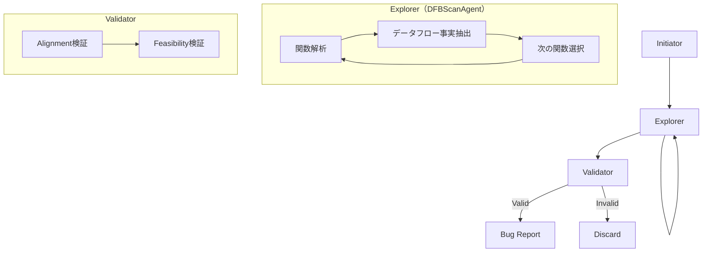

本記事は [https://arxiv.org/abs/2501.18160](https://arxiv.org/abs/2501.18160) の解説記事です。

## 論文概要（Abstract）

RepoAuditは、リポジトリ全体を対象にバグ検出を自律的に行うLLMエージェントフレームワークである。従来のLLMベースコード解析が単一関数や限定的なコンテキストに留まっていたのに対し、RepoAuditはエージェントメモリを備えたオンデマンド探索により、手続き間データフロー解析を純粋にLLMのみで実現する。バリデータモジュールがデータフロー事実の整合性とパス条件の充足可能性を検証することで、ハルシネーションに起因する偽陽性を抑制する。著者らは15個の実世界OSSプロジェクトで38個の真のバグを検出し、精度65.52%を達成したと報告している（Claude 3.5 Sonnet使用時）。さらに大規模コードベースでは185件の新規issue報告を行い、うち174件が開発者により確認または修正済みである。

この記事は [Zenn記事: Claude Sonnet 4.6の1Mコンテキストで大規模コードレビューエージェントを構築する](https://zenn.dev/0h_n0/articles/a41a3cb117cc46) の深掘りです。

## 情報源

- **会議名**: ICML 2025（International Conference on Machine Learning）
- **年**: 2025
- **URL**: [https://arxiv.org/abs/2501.18160](https://arxiv.org/abs/2501.18160)
- **著者**: Jinyao Guo, Chengpeng Wang, Xiangzhe Xu, Zian Su, Xiangyu Zhang
- **採択率**: 26.9%（12,107件中3,260件採択）
- **発表形式**: Poster
- **コード**: [https://github.com/PurCL/RepoAudit](https://github.com/PurCL/RepoAudit)

## カンファレンス情報

**ICMLについて**: ICML（International Conference on Machine Learning）は、機械学習分野における最高峰の国際会議の1つである。ICML 2025では12,107件の投稿に対して3,260件が採択され、採択率は約26.9%であった。Oral発表は120件（全投稿の約1%）と極めて競争率が高い。RepoAuditはPoster発表として採択されており、ソフトウェア工学（cs.SE）とプログラミング言語（cs.PL）の交差領域からの採択である点が注目に値する。

## 背景と動機

大規模リポジトリのバグ検出には、**静的解析ツール**（Meta Infer、CodeQL等）と**LLMベース手法**の2つのアプローチが存在する。前者は高精度だがコンパイル依存性がネックであり、論文の実験ではMeta Inferが15プロジェクト中5プロジェクトでコンパイルに失敗した。後者はコンテキストウィンドウ制限とLLMの逐次推論がグラフ構造のソフトウェア依存関係にマッチしないことによるハルシネーションが課題である。

RepoAuditはLLMの3つの能力を活用してこれらの課題を克服する。(1) プログラム抽象化による無関係コードの除外、(2) 関数スコープ内でのポインタ解析、(3) シンボリック制約ソルバに頼らない実行可能パスの直感的推論。

## 技術的詳細（Technical Details）

### アーキテクチャ全体像

RepoAuditは3つのコンポーネントで構成される。



#### Initiator（開始点特定）

Initiatorはパターンマッチングにより解析の起点となるソース（source）を特定する。バグタイプに応じて起点が異なる。

- **Null Pointer Dereference（NPD）**: `NULL`リテラル値の出現箇所
- **Memory Leak（MLK）**: メモリ割り当て関数（`malloc`, `calloc`等）の呼び出し箇所
- **Use After Free（UAF）**: メモリ解放関数（`free`等）の呼び出し箇所

#### Explorer（オンデマンド探索）

Explorerは需要駆動型（demand-driven）のリポジトリ走査を行う。全コードベースを事前にスキャンするのではなく、値の伝搬経路に沿って必要な関数のみを解析する。

解析対象のバグは2種類のデータフローパターンに分類される。

**source-must-not-reach-sink型**: ある値がソースからシンクに到達してはならないパターン。NPDがこれに該当する。`NULL`値がデリファレンス操作に到達するとバグとなる。

$$
\text{Bug}_{\text{NPD}} = \exists \text{path } p: \text{source}(\texttt{NULL}) \xrightarrow{p} \text{sink}(\texttt{*ptr}) \land \text{feasible}(p)
$$

**source-must-reach-sink型**: ある値がソースからシンクに到達しなければならないパターン。MLKがこれに該当する。`malloc`で割り当てたメモリが`free`に到達しないとバグとなる。

$$
\text{Bug}_{\text{MLK}} = \forall \text{path } p \text{ from source}(\texttt{malloc}): \neg(\text{sink}(\texttt{free}) \in p) \land \text{escapes}(p)
$$

ここで、$\text{feasible}(p)$はパス$p$上のすべての分岐条件が同時に充足可能であることを意味し、$\text{escapes}(p)$はメモリへの参照が関数スコープ外に漏れることを意味する。

#### エージェントメモリ

Explorerはエージェントメモリ$\mathcal{M}$を維持する。メモリのエントリは以下の形式で構造化される。

$$
\mathcal{M}(f, v@s) = \{(p_1, \text{DFF}_1), (p_2, \text{DFF}_2), \ldots\}
$$

ここで、
- $f$: 解析対象の関数
- $v@s$: ステートメント$s$における値$v$
- $p_i$: $i$番目のプログラムパス
- $\text{DFF}_i$: $p_i$上で発見されたデータフロー事実（Data-Flow Fact）

このメモリにより、同一の関数・値ペアに対する冗却な解析を回避する。論文のアブレーション実験では、キャッシュを無効化すると、プロンプト回数が3.55倍、コストが3.48倍、時間が3.75倍に増加したと報告されている。

#### Validator（検証）

Validatorは2段階の検証を行う。

**Alignment検証**: Explorerが出力したデータフロー事実が制御フローの順序を尊重しているかを確認する。例えば、「ステートメントAの後にステートメントBが実行される」という事実が、実際の制御フローグラフ上で矛盾しないかを検証する。

**Feasibility検証**: 手続き間パス条件の論理的整合性を検査する。関数$f_1$で「条件Cが真」というパス制約があり、関数$f_2$で「条件Cが偽」というパス制約がある場合、そのパスは実行不可能（infeasible）として棄却される。

### アルゴリズム

以下の擬似コードはRepoAuditの探索アルゴリズムのコアロジックを示す。

```python
from dataclasses import dataclass, field

@dataclass
class DataFlowFact:
    """データフロー事実を表現する"""
    path: list[str]              # 経由するステートメント列
    path_conditions: list[str]   # 各分岐のパス条件
    value_state: str             # 値の状態（NULL, freed, allocated等）

@dataclass
class AgentMemory:
    """エージェントメモリ: 解析結果のキャッシュ"""
    cache: dict[tuple[str, str], list[DataFlowFact]] = field(default_factory=dict)

    def lookup(self, func: str, value_at_stmt: str) -> list[DataFlowFact] | None:
        return self.cache.get((func, value_at_stmt))

    def store(self, func: str, value_at_stmt: str, facts: list[DataFlowFact]) -> None:
        self.cache[(func, value_at_stmt)] = facts

def explore(
    source_func: str, source_value: str,
    call_graph: dict[str, list[str]], memory: AgentMemory,
    llm_analyze: callable, max_depth: int = 4,
) -> list[DataFlowFact]:
    """需要駆動型の手続き間データフロー探索"""
    results: list[DataFlowFact] = []

    def _recurse(func: str, value: str, depth: int, ctx: list[str]) -> None:
        if depth > max_depth:
            return
        cached = memory.lookup(func, value)
        if cached is not None:
            results.extend(cached); return

        facts = llm_analyze(func, value, ctx)  # LLMによる関数内解析
        memory.store(func, value, facts)

        for fact in facts:
            if fact.value_state in ("dereferenced", "leaked", "use_after_free"):
                results.append(fact)  # バグ候補
            elif fact.value_state == "propagated":
                for callee in call_graph.get(func, []):
                    _recurse(callee, fact.path[-1], depth + 1, ctx + fact.path)

    _recurse(source_func, source_value, 0, [])
    return results
```

探索深度の上限は$K=4$に設定されている。これは著者らの実験で、検出されたバグの大半が4関数以内のコールチェーンで発生していたことに基づく設計判断である。

### MetaScanAgent

MetaScanAgentはTree-sitterベースのAST解析で、LLMを介さずに即座に検出可能なバグ（未チェックの戻り値等）を高速スキャンする。DFBScanAgentの前段として機能する。

## 査読者の評価（Peer Review Insights）

OpenReview（[TXcifVbFpG](https://openreview.net/forum?id=TXcifVbFpG)）にてICML 2025のPosterとして採択が確認できる。cs.SE/cs.PLの研究がICMLに採択された点は、LLMエージェントのソフトウェア工学応用への関心の高まりを示している。個別の査読者コメントの詳細は公開が限定されているため割愛する。

## 実装のポイント

GitHubリポジトリ（[PurCL/RepoAudit](https://github.com/PurCL/RepoAudit)）でOSS公開されており、Python 3.13 + Tree-sitter + LLM APIで動作する。コンパイル不要でTree-sitterによる構文解析のみを前提とするため、対象プロジェクトのビルド環境構築が不要である。

**主要な設計判断**:
- **並列化**: `--max-neural-workers`（LLM解析、デフォルト30）と`--max-symbolic-workers`（Tree-sitter解析）で並列度を設定可能
- **LLM選択**: DeepSeek R1がコスト効率で最良（$0.57/プロジェクト）、Claude 3.5 Sonnetがバランス型（$2.54/プロジェクト）
- **プロンプト設計**: 3ステップ推論（ポインタ解析 → 抽象化 → パス探索）をFew-shotで強制
- **キャッシュ必須**: キャッシュなしの場合、1プロジェクトで72時間超過するケースが報告されている

## Production Deployment Guide

RepoAuditのアーキテクチャは、CI/CDパイプラインに統合して継続的なコード監査を実現するのに適している。ここでは、AWS上でRepoAuditを運用するための構成を示す。

### AWS実装パターン（コスト最適化重視）

**トラフィック量別の推奨構成**:

| 構成 | 想定利用 | AWSサービス | 月額コスト概算 |
|------|---------|------------|-------------|
| Small | ~10 repo/日 | Lambda + Step Functions + Bedrock | $100-250 |
| Medium | ~50 repo/日 | ECS Fargate + SQS + Bedrock | $500-1,200 |
| Large | 200+ repo/日 | EKS + Karpenter + Spot | $2,500-6,000 |

**Small**: Lambda（3GB、15分タイムアウト）+ Step FunctionsでExplorer/Validatorを管理、Bedrock経由でLLM呼び出し。**Medium**: ECS Fargate（2 vCPU、8GB）でコンテナ常駐、SQSキュー + DynamoDBでエージェントメモリ永続化。**Large**: EKS + Karpenter Spot自動スケーリング。

**コスト削減テクニック**:
- Spot Instances活用で計算リソースを最大90%削減
- Bedrock Batch API使用でLLM呼び出しコストを50%削減
- Prompt Caching有効化で繰り返し解析のLLMコストを30-90%削減
- Reserved Instances（1年コミット）でEKSノードコストを最大72%削減

**コスト試算の注意事項**: 上記は2026年2月時点のAWS ap-northeast-1（東京）リージョン料金に基づく概算値である。実際のコストはリポジトリサイズ、解析対象バグタイプ数、LLMモデル選択により大きく変動する。論文によると1プロジェクトあたりの平均LLMコストは$2.54（Claude 3.5 Sonnet）であり、これが全体コストの主要部分を占める。

### Terraformインフラコード

**Small構成（Serverless）のコア部分**:

```hcl
# main.tf - RepoAudit Serverless構成
terraform {
  required_version = ">= 1.9"
  required_providers {
    aws = { source = "hashicorp/aws", version = "~> 5.80" }
  }
}

provider "aws" { region = "ap-northeast-1" }

# DynamoDB: エージェントメモリの永続化（On-Demandでコスト最適化）
resource "aws_dynamodb_table" "agent_memory" {
  name         = "repoaudit-agent-memory"
  billing_mode = "PAY_PER_REQUEST"
  hash_key     = "func_value_key"
  range_key    = "project_id"

  attribute { name = "func_value_key"; type = "S" }
  attribute { name = "project_id"; type = "S" }

  ttl { attribute_name = "expires_at"; enabled = true }
  server_side_encryption { enabled = true }  # KMS暗号化

  tags = { Project = "repoaudit" }
}

# IAMロール: Lambda実行用（最小権限）
resource "aws_iam_role" "lambda_exec" {
  name = "repoaudit-lambda-exec"
  assume_role_policy = jsonencode({
    Version = "2012-10-17"
    Statement = [{
      Action = "sts:AssumeRole", Effect = "Allow"
      Principal = { Service = "lambda.amazonaws.com" }
    }]
  })
}

# Lambda: 関数単位の解析を実行
resource "aws_lambda_function" "analyzer" {
  function_name = "repoaudit-analyzer"
  runtime       = "python3.13"
  handler       = "handler.lambda_handler"
  role          = aws_iam_role.lambda_exec.arn
  timeout       = 900   # 15分（関数単位の解析に十分）
  memory_size   = 3072  # 3GB（Tree-sitter解析用）
  filename      = "lambda_package.zip"

  environment {
    variables = {
      DYNAMODB_TABLE = aws_dynamodb_table.agent_memory.name
      MAX_DEPTH      = "4"
      LLM_MODEL      = "anthropic.claude-3-5-sonnet-v2"
    }
  }
}
```

**Large構成（Container）**: EKS（`terraform-aws-modules/eks/aws` v20.31、Kubernetes 1.31）+ Karpenter NodePool（Spot優先、m7i.xlarge/m6i.xlarge）+ AWS Budgets（月額$5,000の80%でアラート）。Karpenterの`consolidationPolicy: WhenEmptyOrUnderutilized`により、アイドル時のノードを30秒で自動回収する。

### 運用・監視設定

**CloudWatch Logs Insights クエリ**:

```
# LLM呼び出しコスト異常検知
fields @timestamp, @message
| filter @message like /bedrock_invoke/
| stats sum(input_tokens) as total_input by bin(1h)
| filter total_input > 500000
```

**Bedrockトークンスパイク検知 + 日次コストレポート（Python）**:

```python
import boto3
from datetime import datetime, timedelta

cloudwatch = boto3.client("cloudwatch", region_name="ap-northeast-1")
ce = boto3.client("ce", region_name="us-east-1")

def create_bedrock_token_alarm() -> None:
    """1M tokens/hourでアラート発報"""
    cloudwatch.put_metric_alarm(
        AlarmName="repoaudit-bedrock-token-spike",
        MetricName="InputTokenCount", Namespace="AWS/Bedrock",
        Statistic="Sum", Period=3600, EvaluationPeriods=1,
        Threshold=1000000, ComparisonOperator="GreaterThanThreshold",
        AlarmActions=["arn:aws:sns:ap-northeast-1:ACCOUNT_ID:repoaudit-alerts"],
    )

def daily_cost_report() -> float:
    """日次コストを取得し、$100超過でSNS通知"""
    end = datetime.utcnow().strftime("%Y-%m-%d")
    start = (datetime.utcnow() - timedelta(days=1)).strftime("%Y-%m-%d")
    resp = ce.get_cost_and_usage(
        TimePeriod={"Start": start, "End": end}, Granularity="DAILY",
        Metrics=["UnblendedCost"],
        Filter={"Tags": {"Key": "Project", "Values": ["repoaudit"]}},
    )
    return sum(
        float(g["Metrics"]["UnblendedCost"]["Amount"])
        for r in resp["ResultsByTime"] for g in r["Groups"]
    )
```

### コスト最適化チェックリスト

**アーキテクチャ選択**: 解析頻度で判断（10 repo/日以下: Lambda、50+: ECS Fargate、200+: EKS）

**リソース最適化**: Spot Instances優先（バッチ性質で中断耐性あり）、Reserved Instances 1年コミットで72%削減、Lambda メモリ3GB最適化、夜間スケールダウン、Savings Plans検討

**LLMコスト削減**: Bedrock Batch API（50%減）、Prompt Caching有効化、DeepSeek R1検討（$0.57 vs $2.54）、トークン数制限、不要バグタイプ除外

**監視・アラート**: AWS Budgets月額アラート、CloudWatch Bedrockトークンスパイク検知、Cost Anomaly Detection、日次コストレポート

**リソース管理**: ECRライフサイクルポリシー、`Project=repoaudit`タグ戦略、DynamoDB TTL設定、開発環境夜間停止、CloudWatch Logs保持30日

## 実験結果

### ベンチマーク評価

著者らは15の実世界OSSプロジェクトでRepoAuditを評価している。対象プロジェクトの平均サイズは251,259行（LoC）であり、NPD、MLK、UAFの3種類のバグを検出対象としている。

**LLMモデル別の検出性能**（論文Table 2相当）:

| LLMモデル | 真陽性（TP） | 偽陽性（FP） | 精度 | コスト/プロジェクト | 時間/プロジェクト |
|----------|------------|------------|------|----------------|---------------|
| Claude 3.5 Sonnet | 38 | 20 | 65.52% | $2.54 | 0.44h |
| DeepSeek R1 | 44 | 14 | 75.86% | $0.57 | 未報告 |
| GPT-4 Turbo | 14 | 25 | 35.90% | $3.47 | 未報告 |

Claude 3.5 Sonnet使用時の38個の真陽性のうち、21個は以前に報告されていた既知のバグであり、17個が新規に発見されたバグである。新規発見バグのうち4個は最新コミットで既に修正済みであった。注目すべきは、38個中20個（52.6%）が手続き間解析を必要とするバグであり、単一関数スコープの解析では検出不可能であった点である。

### ベースライン比較

**産業ツール・LLM手法との比較**:

| 手法 | TP | FP | 精度 | 備考 |
|------|----|----|------|------|
| RepoAudit（Claude 3.5 Sonnet） | 38 | 20 | 65.52% | コンパイル不要 |
| Meta Infer | 7 | 2 | 77.78% | 5/15プロジェクトでコンパイル失敗 |
| Amazon CodeGuru | 0 | 18 | 0% | 真陽性ゼロ |
| 単一関数LLM検出器 | 1 | - | - | 手続き内のみ |
| LLMDFA | - | - | - | 165倍のプロンプト回数 |

Meta Inferは高精度だがコンパイル依存性により適用範囲が限定される。単一関数検出器が1件のみという結果は手続き間解析の重要性を示す。

### アブレーション実験

| 構成 | TP変化 | FP変化 | 備考 |
|------|--------|--------|------|
| 完全版 | 38 | 20 | ベースライン |
| 抽象化なし | -44.74% | +105% | 無関係コードがノイズに |
| バリデータなし | 変化なし | +105%（41件） | 偽陽性が倍増 |
| キャッシュなし | 変化なし | 変化なし | コスト3.48倍、時間3.75倍 |

バリデータの除去でFPが倍増する点は、ハルシネーション抑制の有効性を示している。さらに大規模な実運用評価では、185件の新規issue報告のうち174件（94%）が開発者により確認または修正済みである。

## 実運用への応用

関連Zenn記事「[Claude Sonnet 4.6の1Mコンテキストで大規模コードレビューエージェントを構築する](https://zenn.dev/0h_n0/articles/a41a3cb117cc46)」の1Mコンテキスト全投入型とRepoAuditの需要駆動型は相互補完的である。設計レベルのクロスファイル整合性チェックには前者、データフローバグの精密検出には後者が適する。

論文で報告されている解析コスト（$2.54/プロジェクト、0.44時間）はCI/CD統合を現実的にする水準だが、ソース値の数に比例してスケールするため、大規模モノレポではバグタイプやモジュールの限定が必要である。制約として、探索深度$K=4$の制限、C/C++中心で動的型付け言語は未評価、外部LLM APIへのコード送信によるプライバシー懸念がある。

## 関連研究

- **LLMDFA**（Wang et al., NeurIPS 2024, [arXiv:2402.10754](https://arxiv.org/abs/2402.10754)）: RepoAuditの前身。関数単位のデータフロー解析にLLMを適用。RepoAuditは手続き間解析への拡張であり、プロンプト効率を165倍改善
- **LongCodeBench**（arXiv:2505.07897）: 1Mコンテキストでのコード理解・修復ベンチマーク。RepoAuditの需要駆動型探索は長文コンテキストの修復精度低下を回避する設計
- **Meta Infer**: Facebook開発の静的解析ツール。高精度だがコンパイル依存で5/15プロジェクトが実行不可

## まとめと今後の展望

RepoAuditは、純粋にLLMのみでリポジトリレベルのコード監査を実現した研究であり、需要駆動型探索、エージェントメモリ、バリデータの3つの機構により、従来のLLMベース手法が抱えていたスケーラビリティとハルシネーションの課題に対処している。ICML 2025への採択は、LLMエージェントのソフトウェア工学応用が機械学習コミュニティでも評価されていることを示している。

著者らは今後の方向性として、並列探索戦略の導入と専用LLMプランナーの訓練を挙げている。また、現在の$K=4$という探索深度制限の緩和や、動的型付け言語への対応拡張も課題として残されている。実務者にとっては、CI/CDパイプラインへの統合により、コンパイル不要かつ低コストの継続的セキュリティ監査を実現する手段として活用可能である。

## 参考文献

- **Conference URL**: [https://icml.cc/virtual/2025/poster/45170](https://icml.cc/virtual/2025/poster/45170)
- **arXiv**: [https://arxiv.org/abs/2501.18160](https://arxiv.org/abs/2501.18160)
- **Code**: [https://github.com/PurCL/RepoAudit](https://github.com/PurCL/RepoAudit)
- **Project Page**: [https://repoaudit-home.github.io/](https://repoaudit-home.github.io/)
- **LLMDFA (NeurIPS 2024)**: [https://arxiv.org/abs/2402.10754](https://arxiv.org/abs/2402.10754)
- **OpenReview**: [https://openreview.net/forum?id=TXcifVbFpG](https://openreview.net/forum?id=TXcifVbFpG)
- **Related Zenn article**: [https://zenn.dev/0h_n0/articles/a41a3cb117cc46](https://zenn.dev/0h_n0/articles/a41a3cb117cc46)

---

*本記事はAI（Claude Code）により自動生成されました。内容の正確性については複数の情報源で検証していますが、実際の利用時は論文原文および公式ドキュメントもご確認ください。*
