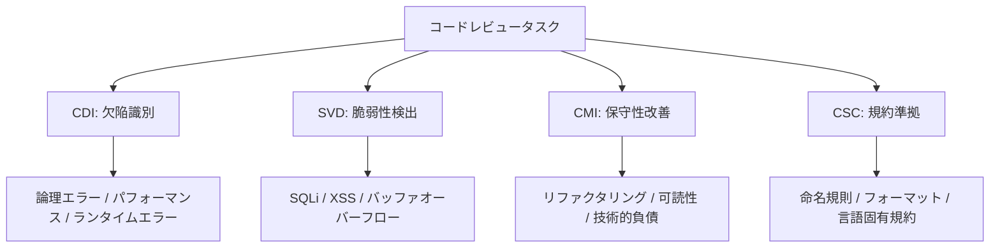

本記事は [https://arxiv.org/abs/2502.12648](https://arxiv.org/abs/2502.12648) の解説記事です。

## 論文概要（Abstract）

CodeReviewBenchは、LLMによる自動コードレビュー能力を**4つの独立した評価軸**で包括的に測定するベンチマークである。従来のベンチマークが単一タスクに偏っていた問題を指摘し、5言語・1,019例のデータセットに対し16モデルを評価、各モデルの得意領域と限界を定量的に明らかにしている。

この記事は [Zenn記事: Claude Sonnet 4.6の1Mコンテキストで大規模コードレビューエージェントを構築する](https://zenn.dev/0h_n0/articles/a41a3cb117cc46) の深掘りです。

## 情報源

- **arXiv ID**: 2502.12648
- **URL**: [arXiv:2502.12648](https://arxiv.org/abs/2502.12648)
- **発表年**: 2025年（2025年2月18日公開）
- **分野**: Software Engineering (cs.SE), Artificial Intelligence (cs.AI)

## 背景と動機（Background & Motivation）

コードレビューはソフトウェア品質保証の中核プロセスであるが、大規模プロジェクトでは1日に数百件のPull Requestが作成され、人間のレビュアーだけでは対応が困難な状況にある。

LLMをコードレビューに活用する研究は増加しているが、著者らは従来のベンチマークに以下の問題があると指摘している。(1) **単一タスク偏重**: 「コメント生成」や「欠陥検出」など単一の評価軸に限定、(2) **言語カバレッジの不足**: Python/Javaのみを対象とするものが多い、(3) **評価基準の曖昧さ**: 文字列一致に依存し意味的な正確性を測定できない。

## 主要な貢献（Key Contributions）

- **貢献1**: コードレビューを4つの独立した評価軸（CDI, SVD, CMI, CSC）に分解し多面的に測定可能にした
- **貢献2**: 5言語1,019例のデータセットを構築し、Cohen's Kappa $\kappa = 0.78$ の高い一致度を達成
- **貢献3**: 16モデルの比較でCoTとFew-Shotがコードレビュー性能に与える影響を定量化
- **貢献4**: コンテキスト長とレビュー品質の関係を分析し長コンテキストの限界的な改善を実証

## 技術的詳細（Technical Details）

### 4つの評価軸

CodeReviewBenchは、コードレビューのプロセスを以下の4軸に分解する。



**1. Code Defect Identification (CDI)** -- 312例: 論理エラー、パフォーマンス問題、ランタイムエラー（off-by-one、無限ループ、null参照等）の識別。欠陥箇所の特定と修正方針の提示を求める。

**2. Security Vulnerability Detection (SVD)** -- 247例: SQLインジェクション、XSS、バッファオーバーフロー等の検出。OWASP Top 10に基づく分類で、CVEデータベースから抽出された事例を含む。

**3. Code Maintainability Improvement (CMI)** -- 281例: 重複コードの統合、関数分割、命名改善、複雑度低減等のリファクタリング提案。具体的な改善案の提示が求められる。

**4. Coding Standards Compliance (CSC)** -- 179例: PEP 8、Google Java Style Guide、Airbnb JavaScript Style Guide等の言語固有コーディング規約への準拠を評価する。

### データセット構成

5言語（Python: 255例、Java: 224例、JavaScript: 199例、C++: 182例、Go: 159例）にまたがる合計1,019例で構成される。Pythonが最多だが、C++やGoといった静的型付け言語も十分な事例数を確保している。

### 評価指標

著者らは各タスクに対してF1スコアを主要指標として採用している。F1スコアは適合率（Precision）と再現率（Recall）の調和平均である。

$$
F_1 = 2 \cdot \frac{\text{Precision} \times \text{Recall}}{\text{Precision} + \text{Recall}}
$$

ここで、$\text{Precision} = TP/(TP+FP)$、$\text{Recall} = TP/(TP+FN)$ である。Precisionが低いとノイズに埋もれ、Recallが低いと問題を見逃すため、F1が適切な指標となる。アノテーションの一致度はCohen's Kappa $\kappa = 0.78$（Landis & Koch, 1977基準で「substantial agreement」）。

### アルゴリズム: 評価パイプライン

論文で述べられている評価フローの擬似コードを以下に示す。

```python
from dataclasses import dataclass
from enum import Enum
from typing import Protocol


class ReviewAxis(Enum):
    CDI = "code_defect_identification"
    SVD = "security_vulnerability_detection"
    CMI = "code_maintainability_improvement"
    CSC = "coding_standards_compliance"


@dataclass
class ReviewSample:
    code: str
    language: str
    axis: ReviewAxis
    ground_truth: list[str]  # エキスパートの指摘事項


class CodeReviewModel(Protocol):
    def review(self, code: str, axis: ReviewAxis) -> list[str]: ...


def evaluate_model(
    model: CodeReviewModel,
    dataset: list[ReviewSample],
    axis: ReviewAxis,
) -> dict[str, float]:
    """特定の評価軸でモデルを評価しF1スコアを算出する"""
    tp, fp, fn = 0, 0, 0
    for sample in [s for s in dataset if s.axis == axis]:
        findings = model.review(sample.code, axis)
        matched = set()
        for finding in findings:
            if any(is_semantically_equivalent(finding, gt)
                   for gt in sample.ground_truth):
                tp += 1
                matched.add(finding)
            else:
                fp += 1
        fn += len(sample.ground_truth) - len(matched)

    precision = tp / (tp + fp) if (tp + fp) > 0 else 0.0
    recall = tp / (tp + fn) if (tp + fn) > 0 else 0.0
    f1 = 2 * precision * recall / (precision + recall) if (precision + recall) > 0 else 0.0
    return {"precision": precision, "recall": recall, "f1": f1}
```

`is_semantically_equivalent`は単純な文字列マッチングではなく、指摘内容の意味的な一致を判定する関数である。著者らはBERTベースの類似度判定と人間評価のハイブリッド手法を採用し、表面的な表現の違いによる誤判定を抑えている。

## 実装のポイント（Implementation）

CodeReviewBenchの評価を再現・活用する際の要点を整理する。

**プロンプト設計**: 各評価軸に特化したテンプレートを用意する。CDIでは論理エラー・パフォーマンス問題に焦点を明示し、SVDではOWASP Top 10のカテゴリを列挙してモデルの注意を誘導する。

**出力パース**: JSON出力モードを持つモデル（GPT-4o、Claude-3.5-Sonnet等）では構造化出力を強制し、「問題箇所」「種類」「修正提案」を確実に抽出する。

**意味的マッチング**: 「変数名`x`が不適切」と「変数`x`はより説明的な名前にすべき」は同一指摘だが文字列一致では検出できない。著者らはBERTベースの類似度判定と人間評価を併用している。

## 実験結果（Results）

### モデル別F1スコア

著者らが報告した16モデルの主要結果を以下に示す（上位5モデルを抜粋）。

| Model | CDI | SVD | CMI | CSC | Avg |
|-------|-----|-----|-----|-----|-----|
| GPT-4o | 0.72 | 0.68 | 0.74 | 0.81 | 0.74 |
| Claude-3.5-Sonnet | 0.71 | 0.66 | 0.73 | 0.80 | 0.73 |
| DeepSeek-R1 | 0.70 | 0.67 | 0.71 | 0.78 | 0.72 |
| GPT-4-Turbo | 0.68 | 0.63 | 0.70 | 0.77 | 0.70 |
| Gemini-1.5-Pro | 0.65 | 0.61 | 0.68 | 0.75 | 0.67 |

著者らの分析から以下の傾向が読み取れる。全モデルでCSC（規約準拠）が最高スコア、SVD（脆弱性検出）が最低スコアとなっている。規約準拠はパターンマッチングで対応しやすい一方、脆弱性検出には実行フロー追跡とセキュリティドメイン知識の統合が必要なためである。GPT-4oとClaude-3.5-Sonnetの平均F1差は0.01ポイントのみで、著者らは「統計的に有意ではない」と報告している。DeepSeek-R1はSVD軸で0.67とGPT-4o（0.68）に肉薄し、推論特化モデルのセキュリティ分析能力の高さが示唆されている。

### コンテキスト長の影響

著者らはコンテキスト長がレビュー品質に与える影響を系統的に分析している。

| コンテキスト長 | 性能変化 |
|---------------|---------|
| 4K → 8K | +2.3% |
| 8K → 16K | +1.8% |
| 16K → 32K | +1.2% |

著者らは「コンテキスト長の増加は限界的な改善しかもたらさない」と結論づけている。単一ファイルレビューでは局所的なコード理解が支配的であることを示唆する結果である。ただし、Zenn記事で扱うリポジトリ横断レビュー（クロスファイル依存検出）とは条件が異なり、長コンテキストの価値はタスクの性質に強く依存する。

### Chain-of-Thought (CoT) の影響

著者らはCoTプロンプティングの効果を評価軸ごとに測定している。

| 評価軸 | CoTなし | CoTあり | 改善幅 |
|--------|--------|--------|--------|
| CDI | 0.72 | 0.79 | +9.7% |
| SVD | 0.68 | 0.78 | +14.7% |
| CMI | 0.74 | 0.79 | +6.8% |
| CSC | 0.81 | 0.83 | +2.5% |

複雑なタスク（SVD, CDI）ではCoTによる改善が顕著（8-15%向上）で、シンプルなタスク（CSC）では影響が最小（2.5%）であったと報告されている。o1スタイルの推論モードではさらに3-5%の追加向上が見られた。脆弱性検出には「入力未サニタイズ → SQLクエリに直接埋込 → SQLインジェクション」という多段推論が必要であり、CoTがこの推論チェーンを明示化する。

### Few-Shot学習の効果

| Shot数 | 平均F1改善 |
|--------|-----------|
| 0-shot（ベースライン） | -- |
| 1-shot | +4.2% |
| 3-shot | +6.8% |
| 5-shot | +7.1% |

著者らは3-shot以降で収穫逓減が起こると報告している。1→3-shotの改善が+2.6ポイントに対し3→5-shotは+0.3ポイントであり、**3-shot**が費用対効果の最適点である。

## Production Deployment Guide

CodeReviewBenchの知見を活かし、LLMベースのコードレビューシステムをAWS上で構築する際の実装パターンを示す。

### AWS実装パターン（コスト最適化重視）

**トラフィック量別の推奨構成**:

| 構成 | トラフィック | アーキテクチャ | 月額コスト |
|------|-------------|---------------|-----------|
| Small | ~100 PR/日 | Lambda + Bedrock | $80-200 |
| Medium | ~500 PR/日 | ECS Fargate + Bedrock | $400-900 |
| Large | 2000+ PR/日 | EKS + Spot + Bedrock | $2,500-6,000 |

**Small構成の内訳**: Lambda ~$15 + Bedrock(Claude-3.5-Sonnet, 4K入力トークン/PR) ~$50-120 + DynamoDB ~$5 + CloudWatch ~$10/月

**コスト削減テクニック**: Bedrock Batch APIで50%削減、Prompt Cachingで30-90%削減、軸別モデル使い分け（CSC: Haiku、SVD: Sonnet）。

注意: 2026年2月時点のAWS ap-northeast-1リージョン料金に基づく概算値。最新料金はAWS料金計算ツールで確認を推奨する。

### Terraformインフラコード

**Small構成（Serverless）**: Lambda + Bedrock + DynamoDB

```hcl
# === IAMロール（最小権限: Bedrock + DynamoDB のみ）===
resource "aws_iam_role" "lambda_reviewer" {
  name = "code-review-lambda-role"
  assume_role_policy = jsonencode({
    Version = "2012-10-17"
    Statement = [{
      Action = "sts:AssumeRole", Effect = "Allow"
      Principal = { Service = "lambda.amazonaws.com" }
    }]
  })
}

resource "aws_iam_role_policy" "bedrock_invoke" {
  name = "bedrock-invoke-policy"
  role = aws_iam_role.lambda_reviewer.id
  policy = jsonencode({
    Version = "2012-10-17"
    Statement = [{
      Effect   = "Allow"
      Action   = ["bedrock:InvokeModel"]
      Resource = "arn:aws:bedrock:*::foundation-model/anthropic.claude-3-5-sonnet*"
    }]
  })
}

# === Lambda関数（SVDタスクの推論時間を考慮し300秒タイムアウト）===
resource "aws_lambda_function" "code_reviewer" {
  function_name = "code-reviewer"
  runtime       = "python3.12"
  handler       = "handler.lambda_handler"
  role          = aws_iam_role.lambda_reviewer.arn
  timeout       = 300
  memory_size   = 1024
  environment {
    variables = {
      REVIEW_TABLE   = aws_dynamodb_table.review_cache.name
      BEDROCK_REGION = "ap-northeast-1"
    }
  }
  tags = { Project = "code-review", CostCenter = "engineering" }
}

# === DynamoDB（オンデマンドモード + KMS暗号化）===
resource "aws_dynamodb_table" "review_cache" {
  name         = "code-review-cache"
  billing_mode = "PAY_PER_REQUEST"
  hash_key     = "pr_id"
  range_key    = "review_axis"
  attribute { name = "pr_id"; type = "S" }
  attribute { name = "review_axis"; type = "S" }
  server_side_encryption { enabled = true }
  tags = { Project = "code-review" }
}
```

**Large構成（Container）**: EKS + Karpenter + Spot Instances

```hcl
# === EKSクラスタ（プライベートアクセスのみ）===
module "eks" {
  source          = "terraform-aws-modules/eks/aws"
  version         = "~> 20.0"
  cluster_name    = "code-review-cluster"
  cluster_version = "1.31"
  vpc_id          = aws_vpc.review.id
  subnet_ids      = aws_subnet.private[*].id
  cluster_endpoint_public_access = false
  tags = { Project = "code-review" }
}

# === Karpenter NodePool（Spot優先で最大90%削減）===
resource "kubectl_manifest" "karpenter_provisioner" {
  yaml_body = yamlencode({
    apiVersion = "karpenter.sh/v1"
    kind       = "NodePool"
    metadata   = { name = "code-review-pool" }
    spec = {
      template = { spec = { requirements = [
        { key = "karpenter.sh/capacity-type", operator = "In", values = ["spot", "on-demand"] },
        { key = "node.kubernetes.io/instance-type", operator = "In",
          values = ["m6i.xlarge", "m6i.2xlarge", "m7i.xlarge"] }
      ]}}
      disruption = { consolidationPolicy = "WhenEmptyOrUnderutilized", consolidateAfter = "30s" }
      limits = { cpu = "64", memory = "256Gi" }
    }
  })
}

# === AWS Budgets（月額$6,000でアラート）===
resource "aws_budgets_budget" "monthly" {
  name = "code-review-monthly"
  budget_type = "COST"
  limit_amount = "6000"
  limit_unit = "USD"
  time_unit = "MONTHLY"
  notification {
    comparison_operator = "GREATER_THAN"
    threshold = 80
    threshold_type = "PERCENTAGE"
    notification_type = "ACTUAL"
    subscriber_email_addresses = ["platform-team@example.com"]
  }
}
```

### 運用・監視設定

**CloudWatch Logs Insights クエリ**（コスト異常検知）:

```
fields @timestamp, @message
| filter @message like /bedrock_tokens/
| stats sum(input_tokens) as total_input, sum(output_tokens) as total_output by bin(1h)
| filter total_input > 500000
| sort @timestamp desc
```

**CloudWatch アラーム + X-Ray トレーシング（Python）**:

```python
import boto3
from aws_xray_sdk.core import xray_recorder, patch_all

patch_all()  # boto3自動計装
cloudwatch = boto3.client("cloudwatch")

def create_token_usage_alarm(function_name: str, threshold: int = 100000) -> None:
    """Bedrockトークン使用量のスパイク検知アラームを作成する"""
    cloudwatch.put_metric_alarm(
        AlarmName=f"{function_name}-token-spike",
        Namespace="CodeReview/Custom",
        MetricName="BedrockInputTokens",
        Dimensions=[{"Name": "FunctionName", "Value": function_name}],
        Statistic="Sum", Period=3600, EvaluationPeriods=2,
        Threshold=threshold, ComparisonOperator="GreaterThanThreshold",
        AlarmActions=["arn:aws:sns:ap-northeast-1:123456789012:code-review-alerts"],
    )

@xray_recorder.capture("review_pr")
def review_pr(pr_id: str, axis: str) -> dict:
    """PRレビューをX-Rayでトレースする"""
    subsegment = xray_recorder.current_subsegment()
    subsegment.put_annotation("pr_id", pr_id)
    subsegment.put_annotation("review_axis", axis)
    # ... レビュー処理 ...
    subsegment.put_metadata("token_count", token_count)
    return result
```

**Cost Explorer日次レポート（Python）**:

```python
import boto3
from datetime import datetime, timedelta

ce, sns_client = boto3.client("ce"), boto3.client("sns")

def daily_cost_report() -> None:
    """日次コストレポートを生成し、$100/日超過時にSNS通知を送信する"""
    end = datetime.utcnow().strftime("%Y-%m-%d")
    start = (datetime.utcnow() - timedelta(days=1)).strftime("%Y-%m-%d")
    response = ce.get_cost_and_usage(
        TimePeriod={"Start": start, "End": end}, Granularity="DAILY",
        Metrics=["UnblendedCost"],
        Filter={"Tags": {"Key": "Project", "Values": ["code-review"]}},
        GroupBy=[{"Type": "DIMENSION", "Key": "SERVICE"}],
    )
    total = sum(
        float(g["Metrics"]["UnblendedCost"]["Amount"])
        for r in response["ResultsByTime"] for g in r["Groups"]
    )
    if total > 100:
        sns_client.publish(
            TopicArn="arn:aws:sns:ap-northeast-1:123456789012:cost-alerts",
            Subject=f"Code Review Cost Alert: ${total:.2f}/day",
            Message=f"Daily cost exceeded threshold: ${total:.2f}",
        )
```

### コスト最適化チェックリスト

**アーキテクチャ選択** (2項目):
- [ ] トラフィック量に応じた構成選択（~100 PR/日: Serverless、~500: Hybrid、2000+: Container）
- [ ] 評価軸ごとのモデル使い分け設計

**リソース最適化** (5項目):
- [ ] Spot Instances優先（最大90%削減）、Reserved Instances 1年コミット（最大72%削減）
- [ ] Savings Plans検討、Lambda Power Tuning、夜間・休日スケールダウン

**LLMコスト削減** (5項目):
- [ ] Bedrock Batch API（50%削減）、Prompt Caching（30-90%削減）
- [ ] 軸別モデル選択（CSC: Haiku / SVD: Sonnet）、トークン上限設定、DynamoDBキャッシュ

**監視・アラート** (4項目):
- [ ] AWS Budgets（80%/100%閾値）、CloudWatch アラーム、Cost Anomaly Detection、日次SNSレポート

**リソース管理** (5項目):
- [ ] 未使用リソース削除、タグ戦略徹底、DynamoDB TTL、ログ保持期間設定、開発環境夜間停止

## 実運用への応用（Practical Applications）

Zenn記事「Claude Sonnet 4.6の1Mコンテキストで大規模コードレビューエージェントを構築する」の知見と組み合わせると、以下の実装指針が導かれる。

**評価軸ごとの戦略分離**: CSC（規約準拠）にはlintツールやHaikuクラスの軽量モデルを、SVD（脆弱性検出）にはCoTプロンプティング付きのSonnet/Opusクラスのモデルを使い分けることで、コストと品質のバランスを取れる。

**コンテキスト長の使い分け**: 単一ファイルレビューでは長コンテキストの寄与は限定的だが、Zenn記事で扱うクロスファイル依存検出では長コンテキストが本質的に必要である。

**Few-Shot例の蓄積**: 3-shotが費用対効果の最適点であるため、プロジェクト固有のレビュー例をデータベースに蓄積しFew-Shotプロンプトとして活用する仕組みが有効である。

## 関連研究（Related Work）

- **CodeReviewQA** (arXiv:2503.16167): コードレビューの「理解能力」を多肢選択問題で評価。CodeReviewBenchの「指摘能力」と相補的
- **ContextCRBench** (arXiv:2511.07017): 67,910例のコンテキスト付きベンチマーク。データセット規模でCodeReviewBenchを大幅に上回る
- **SWR-Bench** (arXiv:2509.01494): 1,000件の実PRに基づくエンドツーエンド評価。LLM評価と人間判定の90%一致を達成

## まとめと今後の展望

CodeReviewBenchは、LLMの自動コードレビュー能力を4軸で体系的に評価するベンチマークである。主要な発見は、(1) CSCが最も解きやすくSVDが最も困難、(2) CoTが複雑タスクで8-15%改善、(3) コンテキスト長増加は限界的、(4) Few-Shotは3-shotが最適点の4点である。実務では評価軸ごとにモデルやプロンプト戦略を使い分ける「軸特化型」設計が有効である。今後はリポジトリレベルの文脈活用と自動修正能力の評価が研究の方向性として期待される。

## 参考文献

- **arXiv**: [https://arxiv.org/abs/2502.12648](https://arxiv.org/abs/2502.12648)
- **Related Zenn article**: [https://zenn.dev/0h_n0/articles/a41a3cb117cc46](https://zenn.dev/0h_n0/articles/a41a3cb117cc46)
- **CodeReviewQA**: [https://arxiv.org/abs/2503.16167](https://arxiv.org/abs/2503.16167)
- **ContextCRBench**: [https://arxiv.org/abs/2511.07017](https://arxiv.org/abs/2511.07017)
- **SWR-Bench**: [https://arxiv.org/abs/2509.01494](https://arxiv.org/abs/2509.01494)
