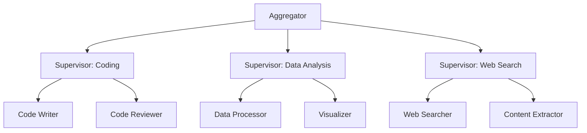

本記事は [arXiv:2503.08175](https://arxiv.org/abs/2503.08175) の解説記事です。

## 論文概要（Abstract）

Weng, Zhang, Cheng, Liu, Shi（2025）は、LLMベースのマルチエージェントシステム（MAS）において、モノリシックな単一スーパーバイザーをドメイン特化スーパーバイザー群に分解し、それらを階層的に集約するフレームワーク「Nexus」を提案している。従来のMASが抱える「不明確なエージェント仕様」と「過度な中央集権制御」の2つの課題に対処し、GAIA・HotpotQA・AgentBenchの3ベンチマークで単一スーパーバイザーを上回る性能を報告している。

この記事は [Zenn記事: LangGraph Supervisor vs Swarm：マルチエージェントRAGの実装比較](https://zenn.dev/0h_n0/articles/c5c769fcd39455) の深掘りです。

## 情報源

- **arXiv ID**: 2503.08175
- **URL**: [https://arxiv.org/abs/2503.08175](https://arxiv.org/abs/2503.08175)
- **著者**: Yixuan Weng, Zhuosheng Zhang, Peng Cheng, et al.
- **発表年**: 2025
- **分野**: cs.AI, cs.MA, cs.CL

## 背景と動機（Background & Motivation）

LLMベースのMASは、AutoGen、CrewAI、LangGraphなどのフレームワークにより実用段階に達している。しかし著者らは、既存のMAS設計に2つの構造的課題を指摘している。

**課題1: 不明確なエージェント仕様**。多くのシステムではエージェントの役割が広範に定義され、曖昧なタスク記述を受け取ったエージェントがハルシネーションを起こしたり、ツールを不適切に使用したりする問題が発生する。

**課題2: 過度な中央集権制御**。単一のスーパーバイザーLLMが全エージェントを統括する設計では、スーパーバイザーがグローバルなコンテキストを維持しつつ多様なドメイン固有タスクを同時管理する必要があり、エージェント数のスケーリングに伴って協調効率が低下する。

Zenn記事のSupervisorパターンでも同様の課題が観察されている。4エージェント構成ではSupervisorが毎回介在するため1クエリあたり最低8回のLLMコールが発生し、レイテンシ4.2秒・トークン消費12,800という結果となっていた。

## 主要な貢献（Key Contributions）

- **貢献1**: スーパーバイザーの**専門化（Specialization）**。各スーパーバイザーLLMをcoding、data_analysis、web_searchなどの特定ドメインに特化させ、ドメイン固有の精密な指示を発行可能にする
- **貢献2**: スーパーバイザーの**集約（Aggregation）**。特化スーパーバイザーを階層的に構成し、複数ドメインにまたがる複雑タスクをスーパーバイザー間の委譲で処理する
- **貢献3**: 特化スーパーバイザーの訓練データを自動生成するパイプライン。GPT-4で最適な協調トラジェクトリを生成し、品質フィルタリング後にファインチューニングに使用する

## 技術的詳細（Technical Details）

### Nexusフレームワークのアーキテクチャ

著者らはMASを有向グラフ$G = (V, E)$としてモデル化している。$V$はエージェント集合（スーパーバイザーとワーカーエージェントを含む）、$E$は通信チャネルを表す。



### スーパーバイザー専門化

各スーパーバイザー$s_i$はドメイン$d_i \in D$に対して以下のように定義される：

$$
s_i = \text{LLM}(\theta, \pi_i)
$$

ここで、
- $\theta$: ベースLLMのパラメータ
- $\pi_i$: ドメイン固有のシステムプロンプト

$\pi_i$は以下の4要素をエンコードする：
1. **ドメイン専門知識の記述**: スーパーバイザーの専門領域の定義
2. **利用可能ツールとその使用法**: ドメイン固有のツールセット
3. **下位エージェントとの通信プロトコル**: メッセージ形式・応答規約
4. **クロスドメインタスクのエスカレーション基準**: 自ドメインで処理できないタスクの判定条件

### スーパーバイザー集約（Aggregation）

複数ドメインを要するタスクに対し、Aggregatorコンポーネントがサブタスクを適切な特化スーパーバイザーにルーティングする：

$$
A: T \to \{(s_i, t_i)\}_{i=1}^{k}
$$

ここで、
- $T$: 入力タスク
- $s_i$: ドメイン特化スーパーバイザー
- $t_i$: サブタスク
- $k$: 分解されたサブタスク数

集約プロセスは3ステップで構成される：

```python
def aggregate(task: str, supervisors: list) -> str:
    """Nexusのタスク集約プロセス

    Args:
        task: 入力タスク
        supervisors: ドメイン特化スーパーバイザーのレジストリ

    Returns:
        統合された最終結果
    """
    # Step 1: タスク分析 - ドメインラベル付きサブタスクに分解
    subtasks = analyze_and_decompose(task)

    # Step 2: ルーティング - 各サブタスクを適切なスーパーバイザーに割り当て
    assignments = []
    for subtask in subtasks:
        supervisor = match_domain(subtask.domain_label, supervisors)
        assignments.append((supervisor, subtask))

    # Step 3: 統合 - 各スーパーバイザーの結果を収集・統合
    results = [supervisor.execute(subtask) for supervisor, subtask in assignments]
    return synthesize(results)
```

### データ合成パイプライン

著者らは特化スーパーバイザーの訓練に以下のパイプラインを使用している：

1. **シードタスク収集**: 既存ベンチマークからドメイン固有タスクを収集
2. **トラジェクトリ生成**: GPT-4を使用して最適な協調トラジェクトリを生成
3. **品質フィルタリング**: タスク完了率と効率メトリクスでフィルタリング
4. **ファインチューニング**: フィルタ済みトラジェクトリで特化スーパーバイザーLLMを訓練

## 実装のポイント（Implementation）

### Zenn記事のSupervisorパターンとの比較

Zenn記事の`create_supervisor`は単一のLLMがすべてのエージェントを統括する設計であり、Nexusの「過度な中央集権制御」の課題に該当する。Nexusのアプローチを適用する場合、以下のような設計変更が考えられる：

```python
from langgraph_supervisor import create_supervisor
from langchain_anthropic import ChatAnthropic

# Nexusスタイル: ドメイン特化スーパーバイザー
retrieval_supervisor = create_supervisor(
    agents=[retriever_agent, verifier_agent],
    model=ChatAnthropic(
        model="claude-sonnet-4-5-20250929",
        temperature=0,
    ),
    prompt="あなたは検索ドメインのスーパーバイザーです。"
           "検索と検証のみを担当します。",
)

synthesis_supervisor = create_supervisor(
    agents=[query_planner, synthesizer_agent],
    model=ChatAnthropic(
        model="claude-sonnet-4-5-20250929",
        temperature=0,
    ),
    prompt="あなたは回答生成ドメインのスーパーバイザーです。"
           "クエリ分析と回答統合のみを担当します。",
)
```

### スケーラビリティの注意点

論文のスケーラビリティ分析によると、特化スーパーバイザーは8台まで性能がほぼ線形にスケールするが、それ以降はリターンが逓減すると報告されている。Zenn記事の4エージェント構成では、2つの特化スーパーバイザー（検索ドメイン＋回答生成ドメイン）が適切なスケールと考えられる。

## 実験結果（Results）

著者らは3つのベンチマークで評価を行っている（論文Table 1より）：

| モデル | GAIA (%) | HotpotQA (F1) | AgentBench (Score) |
|--------|----------|----------------|---------------------|
| ReAct | 18.3 | 52.1 | 4.2 |
| AutoGen | 24.7 | 58.3 | 5.1 |
| MetaGPT | 22.1 | 55.6 | 4.8 |
| Single Supervisor | 26.2 | 60.4 | 5.4 |
| **Nexus** | **31.8** | **64.9** | **6.1** |

アブレーション実験の結果（論文Table 2より）：

| 構成 | GAIA (%) |
|------|----------|
| 専門化なし（単一スーパーバイザー） | 26.2 |
| 専門化のみ | 28.9 |
| 集約のみ | 27.4 |
| **Full Nexus（専門化＋集約）** | **31.8** |

著者らは、専門化と集約がそれぞれ独立して性能に貢献し、両者の組み合わせが最良の結果をもたらすと報告している。効率面では、平均トークン消費が単一スーパーバイザー比で23%削減されたとのことである。

### エラー分析

著者らは失敗要因を以下のように分類している（論文Section 5.1より）：

- **ルーティングエラー**（12%）: アグリゲーターによるドメイン誤分類
- **実行エラー**（31%）: ワーカーエージェントのツール使用失敗
- **統合エラー**（57%）: 複数スーパーバイザーの結果統合の困難さ

統合エラーが最大の失敗要因であり、これはZenn記事のSwarmパターンにおける「意図しないルーティング」問題と根本的に類似している。

## 実運用への応用（Practical Applications）

Nexusのアプローチは、以下の条件を満たすRAGシステムで有効と考えられる：

1. **明確なドメイン境界がある場合**: 例えば社内RAGで「技術文書」「法務文書」「営業資料」など情報源が明確に分類できるケース
2. **スケーリングが必要な場合**: エージェント数が4を超え、単一スーパーバイザーがボトルネックになるケース
3. **ドメイン固有ツールが存在する場合**: 各ドメインに専用の検索エンジンやデータベースがあるケース

一方、Zenn記事のようなドメイン境界が曖昧な汎用RAGでは、Nexusの恩恵は限定的であり、Supervisorパターン（単一スーパーバイザー）やSwarmパターンの方が適切である。

## 関連研究（Related Work）

- **AutoGen (Wu et al., 2023)**: Microsoftのマルチエージェント会話フレームワーク。単一コーディネーターの設計であり、Nexusが解決しようとする「過度な中央集権制御」の典型例として引用されている
- **MetaGPT (Hong et al., 2023)**: ソフトウェア開発チームのシミュレーション。ロールベースの専門化は実装しているが、スーパーバイザーの階層集約は行っていない
- **AgentSquare**: モジュラーなエージェント設計。コンポーザブルなエージェント構成を提案しているが、スーパーバイザーの動的専門化は含まれていない

## まとめと今後の展望

Wengらは、モノリシックな単一スーパーバイザーの2つの構造的課題（不明確なエージェント仕様・過度な中央集権制御）に対して、ドメイン特化と階層集約という2軸のアプローチで対処するNexusフレームワークを提案した。3ベンチマークで単一スーパーバイザーを一貫して上回る結果が報告されており、特にGAIAでの+5.6ポイントの改善が顕著である。

今後の研究方向として、著者らは自動ドメイン発見（事前にドメインを定義せずデータからドメインを推論する手法）と動的スーパーバイザー生成（タスクに応じてスーパーバイザーをオンデマンドで作成する手法）を挙げている。

## 参考文献

- **arXiv**: [https://arxiv.org/abs/2503.08175](https://arxiv.org/abs/2503.08175)
- **Related Zenn article**: [https://zenn.dev/0h_n0/articles/c5c769fcd39455](https://zenn.dev/0h_n0/articles/c5c769fcd39455)
