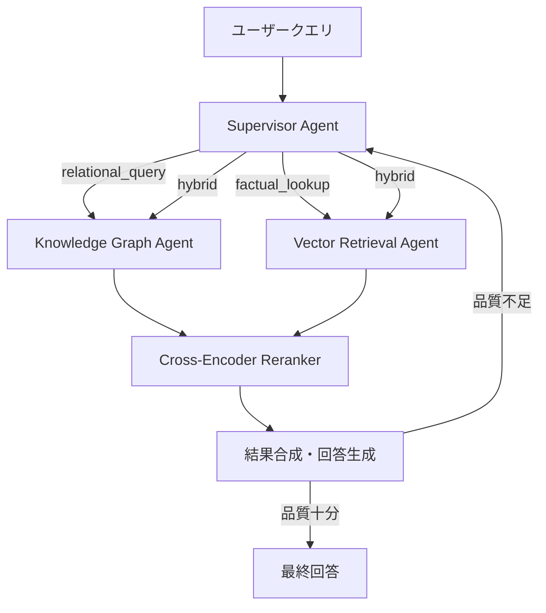

本記事は [https://arxiv.org/abs/2503.09516](https://arxiv.org/abs/2503.09516) の解説記事です。

## 論文概要（Abstract）

Reserら（2025）は、臨床診療ガイドライン（CPG）の検索と情報合成を目的としたAgentic RAGシステムを提案している。本システムの特徴は、Knowledge Graph（KG）ベースの検索とベクトル検索の2つの検索戦略を、スーパーバイザーエージェントが動的にオーケストレーションする点にある。著者らはReActスタイルの推論ループを用いたスーパーバイザーが、クエリの性質に応じて最適な検索戦略を選択し、反復的にクエリを改善することで、ベースラインのRAGシステムを複数の評価指標で上回ったと報告している。

この記事は [Zenn記事: create_supervisorで実装するマルチエージェントRAGと社内検索精度2.1倍改善](https://zenn.dev/0h_n0/articles/9677305f7e25d8) の深掘りです。

## 情報源

- **arXiv ID**: 2503.09516
- **URL**: [https://arxiv.org/abs/2503.09516](https://arxiv.org/abs/2503.09516)
- **著者**: Jared Reser, Laura Reser, Benjamin Reser, Gergely Csanadi
- **発表年**: 2025
- **分野**: cs.AI, cs.CL, cs.IR

## 背景と動機（Background & Motivation）

臨床診療ガイドライン（CPG）は、特定の臨床状況における適切な医療判断を支援する体系的な文書である。CPGの情報検索には以下の固有の課題がある。

1. **階層的な知識構造**: CPGは疾患→症状→治療→禁忌といった複雑な関係性を持つ。単純なベクトル検索では、これらの関係性を正確に捕捉できない
2. **マルチホップ推論の必要性**: 「糖尿病かつ心不全の患者に推奨される薬剤は？」のような質問では、複数のガイドラインを横断した推論が求められる
3. **文脈依存の回答精度**: 同じ薬剤でも患者の状態により推奨度が変わるため、文脈を正確に反映した検索が不可欠である

従来のRAGシステムは、ベクトル類似度に基づく単一の検索戦略に依存しており、構造的な関係性を持つ知識の検索には限界があった。著者らはこの課題に対し、Knowledge Graphの構造的推論とベクトル検索のセマンティック検索を統合し、スーパーバイザーエージェントが動的に戦略を切り替えるアプローチを提案している。

## 主要な貢献（Key Contributions）

- **貢献1**: スーパーバイザーエージェントによる動的な検索戦略選択（KG/ベクトル/ハイブリッドの3分岐）の設計と実装
- **貢献2**: KGトラバーサルとベクトル検索の両方にクロスエンコーダーリランキングを統一適用するアーキテクチャ
- **貢献3**: 6つの主要な臨床ガイドラインを対象としたRAGAS評価で、Naive RAG比Faithfulness +20%、Context Precision +19%の改善を実証

## 技術的詳細（Technical Details）

### システムアーキテクチャ

本システムは4つの主要コンポーネントで構成される。



### スーパーバイザーエージェントの決定ロジック

スーパーバイザーはReActスタイルの推論ループ（Thought → Action → Observation → Thought）を実行し、クエリの性質に基づいて検索戦略を選択する。著者らは以下の3分岐ルーティングを実装している。

```python
def supervisor_route(query: str, context: dict) -> str:
    """クエリの性質に基づき検索戦略を選択する。

    Args:
        query: ユーザーの入力クエリ
        context: 会話コンテキスト

    Returns:
        選択された検索戦略名
    """
    if contains_relational_query(query):
        # エンティティ間の関係性を問うクエリ
        # 例: 「薬剤Xの禁忌は？」「疾患Aの治療法は？」
        return "knowledge_graph"
    elif contains_factual_lookup(query):
        # 単純な事実検索クエリ
        # 例: 「ガイドラインの推奨投与量は？」
        return "vector_retrieval"
    else:
        # 複合クエリ → 両方の検索を実行
        return "hybrid"
```

GPT-4のStructured Output機能により、スーパーバイザーの決定を構造化された形式で出力し、一貫性のあるルーティングを実現している。

### Knowledge Graph Agent

KGエージェントは以下の手順でCPG情報を構造的に検索する。

1. **エンティティ抽出**: BioBERTモデルを用いてクエリから医学エンティティ（疾患名、薬剤名、治療法等）を抽出
2. **グラフトラバーサル**: Neo4jに格納されたKG上でBFS/DFS探索を実行し、関連ノードとエッジを取得
3. **SPARQLクエリ**: 構造化されたクエリによる高精度な情報検索

KGのノードは医学概念（疾患、治療、手順）、エッジは関係性（causes, treats, contraindicated_with等）として表現される。

### Vector Retrieval Agent

ベクトル検索は以下の構成で実装されている。

| パラメータ | 設定値 |
|-----------|--------|
| Embeddingモデル | text-embedding-ada-002 |
| ベクトルストア | Pinecone |
| チャンクサイズ | 512トークン |
| オーバーラップ | 50トークン |
| 初期取得数 | Top-10 |
| リランク後 | Top-3 |

### Cross-Encoder Reranking

KG検索・ベクトル検索の両経路から得られた候補に対し、クロスエンコーダーで統一的にリランキングを適用する。

$$
\text{score}(q, d) = \sigma(\mathbf{W} \cdot \text{BERT}([q; \text{[SEP]}; d]) + \mathbf{b})
$$

ここで、
- $q$: クエリテキスト
- $d$: 候補ドキュメント
- $\sigma$: シグモイド関数
- $\text{BERT}([q; \text{[SEP]}; d])$: クエリとドキュメントを連結してBERTに入力した際の[CLS]トークン出力
- $\mathbf{W}, \mathbf{b}$: 学習パラメータ

クロスエンコーダーの利点は、Bi-encoderがクエリとドキュメントを独立にエンコードするのに対し、クロスエンコーダーは両者を連結して入力することで、クエリ内の各トークンがドキュメント内の全トークンにアテンションできる点にある。これにより、より精密な関連度推定が可能となる。

使用モデル: `ms-marco-MiniLM-L-12-v2`（Hugging Face Hub）

### 反復検索ループ

スーパーバイザーは検索結果の品質を評価し、不十分な場合はクエリを改善して再検索を行う。

```python
for iteration in range(max_iterations := 3):
    results = retrieval_agent.retrieve(query)
    evaluation = supervisor.evaluate(results, query)
    if evaluation.sufficient:
        break
    query = supervisor.refine_query(query, results)
```

最大反復回数は3に設定されており、著者らはこの値がレイテンシと精度のバランスとして適切であると報告している。

## 実装のポイント（Implementation）

### KG構築パイプライン

CPGからKGへの自動変換パイプラインは以下の手順で構築される。

1. **テキスト前処理**: CPGドキュメントをセクション単位に分割
2. **エンティティ抽出**: BioBERTによる医学エンティティの認識（NER）
3. **関係分類**: ドメイン特化モデルによるエンティティ間関係の分類
4. **グラフ格納**: Neo4jへのインポート

著者らはKG構築に「significant preprocessing」が必要であると述べており、ドメイン特化のNERモデルとRelation Extractionモデルの学習が前提となる。

### ハイパーパラメータの推奨値

| パラメータ | 推奨値 | 根拠 |
|-----------|--------|------|
| max_iterations | 3 | レイテンシとのトレードオフ |
| チャンクサイズ | 512トークン | CPGの節単位とほぼ一致 |
| オーバーラップ | 50トークン | 文境界の文脈保持 |
| リランクTop-K | 3 | LLMコンテキスト長の効率化 |

### よくある落とし穴

- **KGの網羅性不足**: BioBERTのNER精度に依存するため、新しい薬剤名や略語を見逃す場合がある。定期的なKG更新パイプラインの構築が必要
- **ルーティング精度**: `contains_relational_query()`の実装がルールベースの場合、分類誤りが生じる。著者らはGPT-4の構造化出力を用いた分類を推奨している

## Production Deployment Guide

### AWS実装パターン（コスト最適化重視）

**トラフィック量別の推奨構成**:

| 規模 | 月間リクエスト | 推奨構成 | 月額コスト | 主要サービス |
|------|--------------|---------|-----------|------------|
| **Small** | ~3,000 (100/日) | Serverless | $80-200 | Lambda + Bedrock + Neptune Serverless |
| **Medium** | ~30,000 (1,000/日) | Hybrid | $500-1,200 | ECS Fargate + Neptune + ElastiCache |
| **Large** | 300,000+ (10,000/日) | Container | $3,000-8,000 | EKS + Neptune + OpenSearch |

**Small構成の詳細** (月額$80-200):
- **Lambda**: 1GB RAM, 60秒タイムアウト ($25/月)
- **Bedrock**: Claude 3.5 Haiku ($80/月)
- **Neptune Serverless**: KGストア ($30/月、アイドル時自動スケールダウン)
- **OpenSearch Serverless**: ベクトル検索 ($25/月)
- **CloudWatch**: 基本監視 ($5/月)

**コスト削減テクニック**:
- Neptune Serverlessのアイドル時自動スケールダウンで非利用時間のコストを削減
- Bedrock Prompt Cachingでシステムプロンプトのコストを30-90%削減
- Lambda Provisioned Concurrencyは不使用（低トラフィック時はOn-Demand）

**コスト試算の注意事項**:
- 上記は2026年2月時点のAWS ap-northeast-1（東京）リージョン料金に基づく概算値です
- 実際のコストはNeptuneのグラフサイズ、クエリ複雑度、バースト使用量により変動します
- 最新料金は [AWS料金計算ツール](https://calculator.aws/) で確認してください

### Terraformインフラコード

**Small構成 (Serverless): Lambda + Bedrock + Neptune Serverless**

```hcl
# --- VPC基盤 ---
module "vpc" {
  source  = "terraform-aws-modules/vpc/aws"
  version = "~> 5.0"

  name = "agentic-rag-vpc"
  cidr = "10.0.0.0/16"
  azs  = ["ap-northeast-1a", "ap-northeast-1c"]
  private_subnets = ["10.0.1.0/24", "10.0.2.0/24"]

  enable_nat_gateway   = false
  enable_dns_hostnames = true
}

# --- IAMロール（最小権限） ---
resource "aws_iam_role" "lambda_rag" {
  name = "agentic-rag-lambda-role"

  assume_role_policy = jsonencode({
    Version = "2012-10-17"
    Statement = [{
      Action = "sts:AssumeRole"
      Effect = "Allow"
      Principal = { Service = "lambda.amazonaws.com" }
    }]
  })
}

resource "aws_iam_role_policy" "bedrock_neptune" {
  role = aws_iam_role.lambda_rag.id
  policy = jsonencode({
    Version = "2012-10-17"
    Statement = [
      {
        Effect   = "Allow"
        Action   = ["bedrock:InvokeModel"]
        Resource = "arn:aws:bedrock:ap-northeast-1::foundation-model/anthropic.claude-3-5-haiku*"
      },
      {
        Effect   = "Allow"
        Action   = ["neptune-db:*"]
        Resource = "arn:aws:neptune-db:ap-northeast-1:*:*/database"
      }
    ]
  })
}

# --- Lambda関数 ---
resource "aws_lambda_function" "rag_handler" {
  filename      = "lambda.zip"
  function_name = "agentic-rag-handler"
  role          = aws_iam_role.lambda_rag.arn
  handler       = "index.handler"
  runtime       = "python3.12"
  timeout       = 120
  memory_size   = 1024

  environment {
    variables = {
      NEPTUNE_ENDPOINT = aws_neptune_cluster.kg.endpoint
      BEDROCK_MODEL_ID = "anthropic.claude-3-5-haiku-20241022-v1:0"
    }
  }
}

# --- Neptune Serverless（KGストア） ---
resource "aws_neptune_cluster" "kg" {
  cluster_identifier = "agentic-rag-kg"
  engine             = "neptune"
  serverless_v2_scaling_configuration {
    min_capacity = 1.0
    max_capacity = 8.0
  }
}

# --- CloudWatchアラーム ---
resource "aws_cloudwatch_metric_alarm" "lambda_cost" {
  alarm_name          = "agentic-rag-cost-spike"
  comparison_operator = "GreaterThanThreshold"
  evaluation_periods  = 1
  metric_name         = "Duration"
  namespace           = "AWS/Lambda"
  period              = 3600
  statistic           = "Sum"
  threshold           = 200000
  alarm_description   = "Lambda実行時間異常（コスト急増の可能性）"
  dimensions = {
    FunctionName = aws_lambda_function.rag_handler.function_name
  }
}
```

### セキュリティベストプラクティス

- **IAMロール**: Bedrock InvokeModelとNeptune操作のみに限定（最小権限）
- **Neptune**: VPC内配置、パブリックアクセス禁止
- **Secrets Manager**: NeptuneエンドポイントやAPIキーの安全な管理
- **暗号化**: Neptune/S3の保管時暗号化（KMS）、転送時暗号化（TLS 1.2+）

### 運用・監視設定

**CloudWatch Logs Insights クエリ**:
```sql
-- ルーティング戦略の分布（1時間ごと）
fields @timestamp, routing_strategy
| stats count(*) as cnt by routing_strategy, bin(1h)

-- KG検索のレイテンシ分析
fields @timestamp, kg_query_ms, vector_query_ms
| stats avg(kg_query_ms) as avg_kg, avg(vector_query_ms) as avg_vector,
        pct(kg_query_ms, 95) as p95_kg by bin(5m)
```

### コスト最適化チェックリスト

- [ ] Neptune Serverlessのmin_capacityを1.0に設定（アイドル時コスト削減）
- [ ] Bedrock Prompt Caching有効化（システムプロンプトの再計算回避）
- [ ] Lambda メモリサイズをCloudWatch Insightsで分析・最適化
- [ ] KGクエリのキャッシュ層（ElastiCache）の導入検討
- [ ] 開発環境はNeptune Serverlessのmax_capacityを2.0に制限

## 実験結果（Results）

著者らは6つの主要臨床ガイドラインを対象に、RAGAS評価フレームワークで定量評価を実施している。

**評価データセット**:
- AHA（アメリカ心臓協会）心不全ガイドライン
- ADA（アメリカ糖尿病学会）ケア基準
- NCCN（全米総合がん情報ネットワーク）ガイドライン
- CDC COVID-19臨床ガイドライン
- WHO敗血症管理ガイドライン
- ACR（アメリカリウマチ学会）関節リウマチガイドライン

**評価結果（論文Table 1より）**:

| システム | Faithfulness | Answer Relevancy | Context Precision | RAGAS |
|---------|-------------|-----------------|-------------------|-------|
| Naive RAG | 0.71 | 0.78 | 0.65 | 0.71 |
| Advanced RAG | 0.79 | 0.83 | 0.72 | 0.78 |
| **提案手法** | **0.91** | **0.89** | **0.84** | **0.88** |

**分析**:
- **Faithfulness +20%（0.71→0.91）**: KGによる構造化された根拠の提供が、ハルシネーション抑制に寄与したと著者らは分析している
- **Context Precision +19%（0.65→0.84）**: スーパーバイザーによる検索戦略の動的選択が、無関係なドキュメントの混入を抑制している
- **RAGAS複合スコア +17%（0.71→0.88）**: 全体的な品質改善を達成

## 実運用への応用（Practical Applications）

Zenn記事で紹介されている社内ナレッジ検索システムとの関連で、本論文のアプローチは以下の応用が考えられる。

1. **社内規程・マニュアル検索**: CPGと同様に階層的な知識構造を持つ社内規程に対し、KGベースの構造検索とベクトル検索のハイブリッドが有効
2. **スーパーバイザーパターンの実装参考**: 本論文の3分岐ルーティング（relational/factual/hybrid）は、Zenn記事のcreate_supervisor()実装で採用可能な設計パターンである
3. **クロスエンコーダーの統一適用**: KG検索・ベクトル検索の出力を統一的にリランキングするアプローチは、マルチソースRAGの品質向上に直接適用できる

**制約**:
- KG構築には「significant preprocessing」が必要（著者ら自身が指摘）
- レイテンシがsingle-pass RAGの2-3倍（著者らの報告）
- GPT-4依存のため、他のLLMでは性能が変動する可能性がある

## 関連研究（Related Work）

- **Agentic RAG Survey [2501.09136]**: Singhらによるサーベイ論文で、Single-Agent/Multi-Agent/Hierarchical Multi-Agentの3アーキテクチャを体系的に分類。本論文はMulti-Agent（Supervisor型）に位置づけられる
- **CITER [2504.10198]**: Stivalらによる3役割（Retriever/Reasoner/Critic）マルチエージェントRAG。スーパーバイザーではなくCriticエージェントがフィードバックループを駆動する点が異なる
- **HAC-Retrieval [2501.12372]**: Dongらによるクロスエンコーダーリランキングの効果を定量的に示した研究。本論文でもクロスエンコーダーを採用しており、その有効性を裏付けている

## まとめと今後の展望

Reserら（2025）は、スーパーバイザーエージェントによるKGとベクトル検索の動的オーケストレーションが、臨床ガイドライン検索においてRAGASスコアを0.71→0.88に改善することを示した。特に、クエリの性質に応じた検索戦略の動的選択と、反復的なクエリ改善が精度向上の主因である。

一方で、KG構築コスト、レイテンシ増加、GPT-4依存という制約が存在する。社内ナレッジ検索への応用では、KG構築を段階的に行い（まず主要エンティティのみ）、KGが不十分な領域ではベクトル検索にフォールバックする戦略が現実的である。

## 参考文献

- **arXiv**: [https://arxiv.org/abs/2503.09516](https://arxiv.org/abs/2503.09516)
- **Related Zenn article**: [https://zenn.dev/0h_n0/articles/9677305f7e25d8](https://zenn.dev/0h_n0/articles/9677305f7e25d8)
