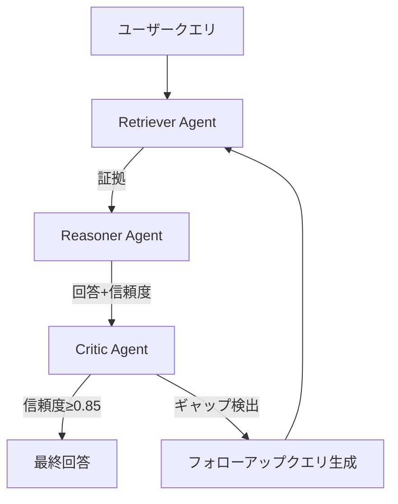

本記事は [https://arxiv.org/abs/2504.10198](https://arxiv.org/abs/2504.10198) の解説記事です。

## 論文概要（Abstract）

Stivalら（2025）は、知識集約型タスク（マルチホップQA、ファクト検証等）において、Retriever・Reasoner・Criticの3役割を持つマルチエージェントRAGシステム「CITER（Collaborative Iterative Refinement）」を提案している。著者らは、CriticエージェントがReasonerの回答の不完全性を検出し、ターゲットを絞ったフォローアップクエリを生成することで、IRCoT（Interleaving Retrieval with Chain-of-Thought）と比較して30%少ない検索ラウンドで同等以上の性能を達成したと報告している。

この記事は [Zenn記事: create_supervisorで実装するマルチエージェントRAGと社内検索精度2.1倍改善](https://zenn.dev/0h_n0/articles/9677305f7e25d8) の深掘りです。

## 情報源

- **arXiv ID**: 2504.10198
- **URL**: [https://arxiv.org/abs/2504.10198](https://arxiv.org/abs/2504.10198)
- **著者**: Leandro Stival, Alessandro Suglia, Arash Eshghi
- **発表年**: 2025
- **分野**: cs.CL, cs.IR, cs.AI

## 背景と動機（Background & Motivation）

RAGベースのシステムは単純なファクトイドQAでは高い性能を示す一方、知識集約型タスクでは依然として課題がある。具体的には以下の問題が指摘されている。

1. **マルチホップ推論**: 複数のドキュメントにまたがる事実を組み合わせて推論する必要がある
2. **情報の矛盾**: 異なるソースからの情報が矛盾する場合の調停が困難
3. **検索の非効率性**: 既存手法（IRCoT等）は必要以上に多くの検索ラウンドを実行し、コストとレイテンシが増大する

Zenn記事で紹介されている4エージェント構成（Query Analyzer, Retriever, Reranker, Synthesizer）に対し、CITERは3役割（Retriever, Reasoner, Critic）という異なるエージェント分割を提案している。特にCriticエージェントの導入が本研究の核心的な貢献である。

## 主要な貢献（Key Contributions）

- **貢献1**: Retriever-Reasoner-Criticの3役割マルチエージェントアーキテクチャの提案。Criticエージェントが回答の不完全性を検出し、ターゲットを絞ったフォローアップクエリを生成する
- **貢献2**: MuSiQue、HotpotQA、FEVERの3ベンチマークでIRCoTを上回り、かつ30%少ない検索ラウンド（1.96 vs 2.8）で達成
- **貢献3**: コスト分析の明示。1クエリあたり$0.004（IRCoT $0.006比-33%）

## 技術的詳細（Technical Details）

### CITERアーキテクチャ

CITERは3つの専門エージェントで構成される。



### 各エージェントの詳細

**1. Retriever Agent（証拠選択）**

検索戦略の決定と証拠の取得を担当する。

- **Dense検索**: DPR（Dense Passage Retrieval）によるセマンティック検索
- **Sparse検索**: BM25Okapiによるキーワードマッチング
- **ハイブリッド**: 上記2つの結果をRRFで統合

Zenn記事のRetrieverエージェントと同等の役割だが、CITERではCriticからのフォローアップクエリに基づくターゲット検索も実行する点が異なる。

**2. Reasoner Agent（回答合成）**

検索された証拠に基づきChain-of-Thought推論を行い、回答を生成する。

```python
def reason(evidence: list[str], query: str) -> dict:
    """証拠に基づきCoT推論で回答を生成する。

    Returns:
        answer: 生成された回答
        confidence: 信頼度スコア (0.0-1.0)
        reasoning_chain: 推論過程の記録
    """
    # Chain-of-Thought推論
    # GPT-4o-miniを使用（コスト効率重視）
    ...
```

重要な点として、Reasonerは回答だけでなく**信頼度スコア**も出力する。この信頼度がCriticの判定に利用される。

**3. Critic Agent（ギャップ検出・クエリ改善）**

CITERの中核コンポーネント。Reasonerの出力を評価し、以下の判定を行う。

- **論理的整合性**: 推論チェーンに矛盾がないか
- **完全性**: 質問に対する回答が十分か（部分的回答ではないか）
- **根拠の充足**: 各主張に十分な証拠があるか

ギャップが検出された場合、Criticは**ターゲットを絞ったフォローアップクエリ**を生成する。

### エージェント間通信プロトコル

CITERでは構造化されたJSONメッセージパッシングプロトコルを用いる。

```json
{
  "sender": "critic",
  "receiver": "retriever",
  "message_type": "refinement_request",
  "content": {
    "original_query": "AとBの違いは何か？",
    "current_answer": "Aは...である",
    "identified_gaps": ["Bに関する情報が欠落", "比較軸が不明確"],
    "refined_queries": ["Bの特徴と定義", "AとBの比較基準"]
  }
}
```

このプロトコルにより、Criticは単に「情報不足」と判定するだけでなく、**何が不足しているかを具体的に指定**し、それに基づいたクエリを生成する。これが「ターゲットを絞った」フォローアップ検索の基盤となっている。

### 終了条件

反復ループは以下の条件で終了する。

$$
\text{terminate} = (\text{confidence}_{\text{Critic}} \geq 0.85) \lor (\text{round} \geq 3) \lor (\text{no\_new\_evidence})
$$

ここで、
- $\text{confidence}_{\text{Critic}}$: Criticエージェントの回答品質に対する信頼度スコア
- $\text{round}$: 現在の反復回数
- $\text{no\_new\_evidence}$: 新しい証拠が検索されなかったかどうかのフラグ

### Supervisorパターンとの比較

Zenn記事のcreate_supervisor()はスーパーバイザーが全エージェントを中央集権的に制御するのに対し、CITERはスーパーバイザーを持たない。代わりに、**Criticエージェントがフィードバックループの制御を担当**する。

| 特性 | Supervisor（Zenn記事） | CITER |
|------|---------------------|-------|
| 制御構造 | 中央集権（Supervisor） | 分散（Criticがフィードバック） |
| エージェント数 | 4（QA, Retriever, Reranker, Synthesizer） | 3（Retriever, Reasoner, Critic） |
| ルーティング | Supervisorが動的選択 | 固定順序（Retriever→Reasoner→Critic） |
| 反復条件 | Supervisorの判断 | Criticの信頼度スコア |

CITERの設計はSupervisorパターンより単純であり、デバッグが容易である反面、動的なエージェント選択（例: Rerankerをスキップ）の柔軟性は低い。

## 実装のポイント（Implementation）

### 技術スタック

| コンポーネント | 技術 |
|-------------|------|
| オーケストレーション | LangGraph |
| Retriever | DPR + BM25Okapi（ハイブリッド） |
| Reasoner/Critic | GPT-4o-mini |
| Embedding | text-embedding-3-small |
| ベクトルストア | FAISS |

著者らはReasonerとCriticにGPT-4o-miniを選択した理由として「コスト効率」を挙げている。全エージェントにGPT-4oを使用した場合と比較して、クエリあたりのコストが約60%削減される。

### ハイパーパラメータ

| パラメータ | 値 | 根拠 |
|-----------|-----|------|
| max_rounds | 3 | 5ホップ以上は対象外。著者らは「3で十分」と報告 |
| critic_threshold | 0.85 | 低すぎると過剰反復、高すぎると早期終了 |
| retrieval_top_k | 10 | コスト・品質のバランス |

### 実装上の注意点

- **CriticのLLM品質依存**: 著者らは小規模モデルではCriticのギャップ検出精度が低下すると報告している。GPT-4o-miniが最低ラインとされる
- **並列化**: RetrieverとCriticは理論上並列実行可能だが、著者らの実装では逐次実行。並列化によりレイテンシを短縮できる余地がある
- **コールドスタートレイテンシ**: 最初の検索ラウンドのインデックスロードに時間がかかる場合がある

## Production Deployment Guide

### AWS実装パターン（コスト最適化重視）

**トラフィック量別の推奨構成**:

| 規模 | 月間リクエスト | 推奨構成 | 月額コスト | 主要サービス |
|------|--------------|---------|-----------|------------|
| **Small** | ~3,000 (100/日) | Serverless | $60-150 | Lambda + Bedrock + OpenSearch Serverless |
| **Medium** | ~30,000 (1,000/日) | Hybrid | $400-900 | ECS Fargate + OpenSearch + ElastiCache |
| **Large** | 300,000+ (10,000/日) | Container | $2,500-6,000 | EKS + OpenSearch + Spot Instances |

**Small構成の詳細** (月額$60-150):
- **Lambda**: 1GB RAM, 90秒タイムアウト ($20/月)
- **Bedrock**: Claude 3.5 Haiku（Reasoner/Critic） ($80/月)
- **OpenSearch Serverless**: ハイブリッド検索 ($25/月)
- **DynamoDB**: 中間状態の永続化 ($10/月)

**コスト試算の注意事項**:
- 上記は2026年2月時点のAWS ap-northeast-1料金に基づく概算値です
- CITERの反復ループ（最大3ラウンド）分のBedrock呼び出しコストを含みます
- 最新料金は [AWS料金計算ツール](https://calculator.aws/) で確認してください

### Terraformインフラコード

```hcl
module "vpc" {
  source  = "terraform-aws-modules/vpc/aws"
  version = "~> 5.0"

  name = "citer-rag-vpc"
  cidr = "10.0.0.0/16"
  azs  = ["ap-northeast-1a", "ap-northeast-1c"]
  private_subnets = ["10.0.1.0/24", "10.0.2.0/24"]
  enable_nat_gateway   = false
  enable_dns_hostnames = true
}

resource "aws_iam_role" "lambda_citer" {
  name = "citer-rag-lambda-role"
  assume_role_policy = jsonencode({
    Version = "2012-10-17"
    Statement = [{
      Action    = "sts:AssumeRole"
      Effect    = "Allow"
      Principal = { Service = "lambda.amazonaws.com" }
    }]
  })
}

resource "aws_lambda_function" "citer_handler" {
  filename      = "lambda.zip"
  function_name = "citer-rag-handler"
  role          = aws_iam_role.lambda_citer.arn
  handler       = "index.handler"
  runtime       = "python3.12"
  timeout       = 120
  memory_size   = 1024

  environment {
    variables = {
      BEDROCK_MODEL_ID    = "anthropic.claude-3-5-haiku-20241022-v1:0"
      MAX_ROUNDS          = "3"
      CRITIC_THRESHOLD    = "0.85"
      OPENSEARCH_ENDPOINT = "https://xxx.aoss.ap-northeast-1.amazonaws.com"
    }
  }
}

resource "aws_dynamodb_table" "citer_state" {
  name         = "citer-iteration-state"
  billing_mode = "PAY_PER_REQUEST"
  hash_key     = "session_id"

  attribute {
    name = "session_id"
    type = "S"
  }

  ttl {
    attribute_name = "expire_at"
    enabled        = true
  }
}
```

### コスト最適化チェックリスト

- [ ] max_roundsを3に制限（無限ループ防止）
- [ ] Reasoner/CriticにHaikuモデルを使用（Sonnet比コスト1/10）
- [ ] critic_thresholdを0.85に設定（過剰反復回避）
- [ ] FAISS→OpenSearch Serverlessへ移行（管理コスト削減）
- [ ] DynamoDB TTLで中間状態を自動削除（ストレージコスト削減）

## 実験結果（Results）

著者らは3つの標準ベンチマークで評価を実施している。

**評価結果（論文Table 1より）**:

| システム | MuSiQue F1 | HotpotQA F1 | FEVER Acc | 平均検索ラウンド |
|---------|-----------|-------------|-----------|----------------|
| Single-pass RAG | 38.2 | 56.4 | 79.3 | 1.0 |
| CoT（検索なし） | 31.7 | 48.9 | 71.2 | 0 |
| IRCoT | 44.1 | 61.8 | 82.7 | 2.8 |
| Self-Ask | 41.3 | 58.6 | 80.1 | 2.3 |
| **CITER** | **51.6** | **67.3** | **86.4** | **1.96** |

**コスト比較（論文Table 3より）**:

| システム | 平均API呼出/クエリ | 平均コスト/クエリ |
|---------|-------------------|-----------------|
| Single-pass RAG | 1 | $0.001 |
| IRCoT | 5.6 | $0.006 |
| **CITER** | **3.9** | **$0.004** |

**アブレーション結果（論文Table 2より）**:

| 構成 | MuSiQue F1 | HotpotQA F1 |
|------|-----------|-------------|
| Full CITER | 51.6 | 67.3 |
| w/o Critic Agent | 44.8 (-6.8) | 62.1 (-5.2) |
| w/o 反復改善 | 39.7 (-11.9) | 57.6 (-9.7) |
| 単一エージェント | 42.3 (-9.3) | 60.4 (-6.9) |

著者らのアブレーション分析から、Criticエージェントの除去はMuSiQue F1で-6.8の低下をもたらし、反復改善メカニズム全体の除去は-11.9の低下をもたらすと報告されている。Criticは反復改善の中核コンポーネントであることが定量的に確認されている。

## 実運用への応用（Practical Applications）

Zenn記事の4エージェント構成との関連で、CITERの設計思想を社内ナレッジ検索に適用する場合の考慮点を示す。

1. **Criticエージェントの導入**: Zenn記事のSynthesizerエージェントの後段にCriticを追加し、回答品質の自動評価と不足情報の追加検索を実現できる
2. **コスト効率の改善**: 全エージェントにSonnet 4.6を使用する代わりに、Retriever/CriticにHaiku 4.5を使用するCITERのモデル選択戦略を採用可能
3. **検索ラウンドの削減**: Criticのターゲットクエリにより、「何度も同じドキュメントを検索する」非効率を解消

**制約**:
- 平均レスポンスタイム8.3秒はインタラクティブ用途のギリギリ（著者らの報告）
- max_rounds=3は5ホップ以上の超複雑クエリには不足する可能性がある
- CriticのLLM品質依存が運用コストの制約となる

## 関連研究（Related Work）

- **IRCoT [Trivedi et al., 2023]**: 検索とChain-of-Thoughtを交互に実行するアプローチ。CITERはIRCoTの検索ラウンド非効率を、Criticによるターゲット検索で解消している
- **Self-Ask [Press et al., 2023]**: 質問を再帰的にサブ質問に分解する手法。平均検索ラウンド2.3で、CITERの1.96より多い
- **Agentic RAG with KG [Reser et al., 2025]**: スーパーバイザーパターンによるKG+ベクトル検索のオーケストレーション。CITERはKGを使わない代わりに、Criticエージェントでフィードバックループを実現

## まとめと今後の展望

Stivalら（2025）は、Retriever-Reasoner-Criticの3役割マルチエージェントRAG「CITER」が、知識集約型タスクにおいてIRCoTを上回る性能を30%少ない検索ラウンドで達成することを示した。Criticエージェントによるギャップ検出とターゲットクエリ生成が、検索効率と回答品質の両方を改善する鍵となっている。

コード（[GitHub](https://github.com/stival-l/CITER)）が公開されており、LangGraphベースの実装をそのまま参考にできる。社内ナレッジ検索への応用では、Zenn記事のSupervisorパターンにCriticエージェントを追加する形での統合が現実的なアプローチである。

## 参考文献

- **arXiv**: [https://arxiv.org/abs/2504.10198](https://arxiv.org/abs/2504.10198)
- **Code**: [https://github.com/stival-l/CITER](https://github.com/stival-l/CITER)
- **Related Zenn article**: [https://zenn.dev/0h_n0/articles/9677305f7e25d8](https://zenn.dev/0h_n0/articles/9677305f7e25d8)
