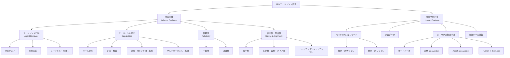

## 論文概要（Abstract）

本論文は、LLM（大規模言語モデル）ベースのエージェントの評価とベンチマークに関する包括的なサーベイである。著者らは、急速に拡大するLLMエージェント評価の研究領域を2次元の分類体系で整理している。第1の次元は「何を評価するか」（評価目標）であり、エージェントの行動・能力・信頼性・安全性の4カテゴリに分類される。第2の次元は「どう評価するか」（評価プロセス）であり、インタラクションモード・データセット・メトリクス算出手法・ツール基盤を体系化している。さらに、既存研究で見落とされがちなエンタープライズ固有の課題（ロールベースアクセス制御、信頼性保証、長期インタラクション、コンプライアンス）を明確に指摘している。

この記事は [Zenn記事: LangGraphマルチエージェントRAGの評価フレームワーク設計と協調品質の定量化](https://zenn.dev/0h_n0/articles/88cd951a1ec060) の深掘りです。

## 情報源

- **arXiv ID**: 2507.21504
- **URL**: [https://arxiv.org/abs/2507.21504](https://arxiv.org/abs/2507.21504)
- **著者**: Mahmoud Mohammadi, Yipeng Li, Jane Lo, Wendy Yip（SAP Labs）
- **発表**: ACM SIGKDD Conference on Knowledge Discovery and Data Mining (KDD 2025), 2025年8月3-7日, トロント
- **分野**: cs.LG, cs.AI

## 背景と動機（Background & Motivation）

LLMエージェントは、単純なテキスト生成を超えて、ツール呼び出し・計画立案・マルチエージェント協調などの複雑なタスクを遂行するシステムへと進化している。しかし、その評価手法は断片化が進んでおり、研究者や実務者がどのベンチマークを用いてどの側面を測定すべきか判断することが困難になっている。

著者らは、LLMエージェントの評価が従来のLLM評価やソフトウェアテストとは本質的に異なると主張している。論文中の比喩を引用すると、「LLM評価がエンジン性能を測るのに対し、エージェント評価はさまざまな走行条件下での自動車全体の性能を評価する」ものである。LLMエージェントは確率的に動作し、動的に振る舞うため、決定論的なソフトウェアテストの手法だけでは不十分であり、NLP・HCI・ソフトウェアエンジニアリングを横断する評価アプローチが求められる。

加えて、既存のサーベイの多くはLLM評価全般か、特定のエージェント能力にのみ焦点を当てており、エンタープライズ環境での要件（ロールベースのデータアクセス制御、コンプライアンス義務、長期運用時の信頼性）がほぼ議論されていないという問題がある。本サーベイはこのギャップを埋めることを目的としている。

## 主要な貢献（Key Contributions）

- **2次元分類体系の提案**: 評価目標（What）と評価プロセス（How）の2軸でLLMエージェント評価の全体像を構造化
- **エンタープライズ課題の体系化**: ロールベースアクセス制御（RBAC）、信頼性保証、長期インタラクション、ドメイン固有のコンプライアンスという4つの実運用課題を明示的に定義
- **150以上のベンチマークの整理**: SWE-bench、WebArena、GAIA等の主要ベンチマークを分類体系に沿って体系的にマッピング
- **評価駆動開発（EDD）の提唱**: 評価を開発サイクルに組み込む方法論を提案し、今後の研究方向として包括的・現実的・スケーラブル・コスト効率的な評価フレームワークの必要性を示唆

## 技術的詳細（Technical Details）

### 2次元分類体系

本サーベイの中核は、LLMエージェント評価を「評価目標」と「評価プロセス」の2つの次元で整理する分類体系である。

#### 評価目標の4カテゴリ

**1. エージェント行動（Agent Behavior）**: ブラックボックスとしてのエージェントを、ユーザ視点で評価する。タスク完了率（Success Rate, pass@k）、出力品質（一貫性、関連性、事実正確性）、レイテンシとコスト（Time To First Token、エンドツーエンドレイテンシ、トークン使用量）の3つのサブカテゴリがある。

**2. エージェント能力（Capabilities）**: プロセス指向の評価であり、エージェントの内部能力を個別に測定する。ツール使用（呼び出し精度、選択精度、MRR、NDCG）、計画・推論（Node F1、Edge F1、正規化編集距離）、記憶・コンテキスト保持（事実再現精度、一貫性スコア）、マルチエージェント協調（情報共有、役割切替）の4つを含む。

**3. 信頼性（Reliability）**: 繰り返し実行時の安定性を測定する。一貫性の指標として $\text{pass}^k$（$k$回全てで成功する割合）が重要であり、これはタスク成功率 $\text{pass}@k$（$k$回中1回以上成功）とは明確に区別される。

$$
\text{pass}^k = P(\text{全}k\text{回で成功})
$$

$$
\text{pass}@k = 1 - P(\text{全}k\text{回で失敗})
$$

ここで、$k$は試行回数である。$\text{pass}@k$が高くても$\text{pass}^k$が低いエージェントは、実運用では信頼性に問題がある。頑健性は入力摂動や環境変化に対する性能劣化の度合いで測定される。

**4. 安全性・整合性（Safety & Alignment）**: 公平性（バイアス検出率）、有害性・毒性（RealToxicityPromptsによるスコアリング、プロンプトインジェクション耐性率）、コンプライアンス・プライバシー（GDPR、HIPAA等への準拠）を評価する。

#### 評価プロセスの4要素

**インタラクションモード**: 静的・オフライン評価（事前生成されたテストケースで実行、低コストだが限定的）と動的・オンライン評価（リアクティブシミュレーションやライブデプロイメントでのモニタリング、ドメインコンテキストを捉えられる）に分かれる。

**メトリクス算出手法**: コードベース評価（ルールベース、決定論的、最も再現性が高い）、LLM-as-a-Judge（LLMの推論能力を活用した定性評価）、Agent-as-a-Judge（複数エージェントが相互評価し精度を向上）、Human-in-the-Loop（専門家監査やクラウドソーシング、主観タスクのゴールドスタンダード）の4手法がある。

**評価ツール基盤**: 開発フレームワーク（OpenAI Evals、LangGraph、Azure AI Foundry）、評価プラットフォーム（DeepEval、InspectAI、Phoenix、GALILEO）、モニタリング（AgentOps）、リーダーボード（Berkeley Function-Calling Leaderboard、Holistic Agent Leaderboard）が分類されている。

### 主要メトリクスの数学的定義

ツール使用評価では、以下のランキング指標が用いられる。

$$
\text{MRR} = \frac{1}{|Q|} \sum_{i=1}^{|Q|} \frac{1}{\text{rank}_i}
$$

ここで、$Q$はクエリ集合、$\text{rank}_i$はクエリ$i$に対して正しいツールが出現する順位である。

$$
\text{NDCG}@k = \frac{\text{DCG}@k}{\text{IDCG}@k}, \quad \text{DCG}@k = \sum_{i=1}^{k} \frac{2^{\text{rel}_i} - 1}{\log_2(i+1)}
$$

ここで、$\text{rel}_i$は順位$i$のアイテムの関連度スコアである。

計画・推論の評価では、正解ワークフローとの構造的一致度をグラフ指標で測定する。

$$
\text{Node F1} = \frac{2 \cdot \text{Precision}_{\text{node}} \cdot \text{Recall}_{\text{node}}}{\text{Precision}_{\text{node}} + \text{Recall}_{\text{node}}}
$$

Node F1はツール選択の正確性を、Edge F1はツール間の実行順序の正確性を反映する。

## 実装のポイント（Implementation）

本サーベイは直接的な実装を提案する論文ではないが、実務者がベンチマーク選択と評価パイプラインを構築する際に参考となるガイドラインが多数含まれている。

**ベンチマーク選択の判断基準**: 評価したいエージェント能力に応じてベンチマークを選定すべきである。例えば、コード生成エージェントにはSWE-bench、Web操作エージェントにはWebArenaやBrowserGym、マルチエージェントシステムにはAgentBoardやτ-Benchが適している。安全性評価にはAgentHarmやAgentDojoを併用することが推奨される。

**メトリクス算出手法の使い分け**: コードベース評価は再現性が最も高いが、オープンエンドなタスクには不向きである。LLM-as-a-Judgeはスケーラブルだが、LLM自体のバイアスに注意が必要である。Agent-as-a-Judgeは品質向上に寄与するが計算コストが高い。最終的な判断にはHuman-in-the-Loopが不可欠である。

**信頼性評価の重要性**: $\text{pass}@k$だけでなく$\text{pass}^k$を測定すべきである。1回の成功ではなく、複数回の一貫した成功がプロダクション品質の指標となる。τ-Benchが提供するこの指標は、マルチエージェントRAGシステムの協調品質を定量化する際にも有用である。

**動的評価の必要性**: 静的ベンチマークのみでは、実運用での長期的な性能劣化やコンテキストドリフトを捉えられない。LongEval（40ターン以上）やLoCoMo（600ターン以上）のような長期インタラクション向けベンチマークを組み合わせて、記憶保持能力の劣化を継続的に監視することが推奨される。

## 実験結果 / ベンチマーク分析（Benchmark Analysis）

著者らは150以上のベンチマークを体系的に調査し、以下の傾向を報告している。

### 主要ベンチマークの分類

| ベンチマーク | 評価対象 | インタラクション | 主要メトリクス |
|:---|:---|:---|:---|
| SWE-bench | コード生成・修正 | 静的 | Resolve Rate |
| WebArena | Web操作 | 動的（シミュレーション） | Task Success Rate |
| BrowserGym | Web操作（マルチターン） | 動的 | Step/Task Success |
| AgentBoard | 多次元エージェント | 動的 | Progress Rate, SR |
| τ-Bench | ツール・ユーザ対話 | 動的 | pass^k |
| ToolBench | API呼び出し | 静的 | Invocation Accuracy |
| LongEval | 長期記憶 | 動的（40+ターン） | Factual Recall |
| TheAgentCompany | エンタープライズ | 動的 | Task Completion |
| AgentHarm | 安全性 | 静的/動的 | Harm Detection Rate |
| AgentDojo | 頑健性 | 動的 | Injection Resistance |
| CORE-Bench | 研究再現性 | 静的 | Reproducibility Rate |
| IntellAgent | RBAC対応 | 動的 | Policy Compliance |

### ベンチマーク傾向分析

著者らの分析によると、以下の傾向が確認されている。

**ドメイン特化の加速**: 近年のベンチマークは汎用的なものから、ソフトウェアエンジニアリング（SWE-bench）、科学研究（ScienceAgentBench）、金融（FinCon）、法律（SimuCourt）といった特定ドメインへ特化する傾向が強まっている。

**インタラクションの長期化**: 初期のベンチマーク（MiniWoB等）は単発タスクを対象としていたが、最近ではLoCoMo（600ターン以上）やTheAgentCompany（実業務シミュレーション）のように、より長期的かつ現実的なインタラクションを扱うものが増えている。

**安全性評価の台頭**: AgentHarm、AgentDojo、SafeAgentBench、CoSafeといった安全性特化型ベンチマークが急増しており、プロンプトインジェクション耐性や有害行動の検出が重要な評価軸として確立されつつある。

**エンタープライズギャップ**: ロールベースアクセス制御を組み込んだベンチマーク（IntellAgent）やコンプライアンス検証を扱うベンチマーク（FinCon）はまだ少数であり、実運用環境を想定した評価基盤は発展途上である。

## 実運用への応用（Practical Applications）

本サーベイの知見は、マルチエージェントRAGシステムの評価フレームワーク設計に直接的に適用可能である。関連するZenn記事で議論されている「協調品質の定量化」に対して、本サーベイは以下の示唆を与える。

**多次元評価の必要性**: エージェントの評価は単一指標では不十分であり、タスク完了率・ツール使用精度・計画品質・記憶保持・安全性の複数次元を組み合わせる必要がある。AgentBoardが提供するProgress Rateのように、タスク完了に至る過程も評価に含めるべきである。

**一貫性指標の採用**: $\text{pass}^k$指標をマルチエージェントRAGの評価に導入することで、検索・生成パイプライン全体の信頼性を定量化できる。特に、エージェント間の協調が破綻するエッジケースの発見に有効である。

**LLM-as-a-JudgeとAgent-as-a-Judgeの組み合わせ**: RAGの回答品質を自動評価する際に、単一LLMによる評価（LLM-as-a-Judge）に加え、複数エージェントが相互検証するAgent-as-a-Judgeを導入することで、評価のバイアスを低減できる。

**動的評価環境の構築**: 静的テストセットに加えて、ユーザインタラクションをシミュレートする動的評価環境を構築することが、プロダクション品質の保証に不可欠である。

## 関連研究（Related Work）

- **AgentBench（Liu et al., 2023）**: LLMをエージェントとして評価する最初の体系的ベンチマークの一つであり、8つの異なる環境でLLMのエージェント能力を測定した。本サーベイはAgentBenchの枠組みを拡張し、より広範な評価次元をカバーしている。
- **LLM-as-a-Judge（Zheng et al., 2023）**: LLMを評価者として利用する手法を提案した先駆的研究であり、本サーベイでは評価プロセスの一手法として位置付けている。
- **Zhang et al. (2024a)**: LLM評価に関する既存サーベイだが、エージェント固有の評価課題（ツール使用、計画立案、マルチエージェント協調）を十分に扱っていないと本サーベイでは指摘されている。
- **Yehudai et al. (2025)**: エンタープライズ環境でのLLMエージェント要件に関する研究であり、本サーベイが指摘するエンタープライズギャップの問題認識と一致している。

## まとめと今後の展望

本サーベイは、LLMエージェント評価の断片化した研究領域を2次元分類体系で初めて体系的に整理し、150以上のベンチマークをマッピングした。特に、エンタープライズ環境での課題を明示的に定義した点は、実務者にとって価値が高い。

著者らは今後の研究方向として、(1) 複数の評価次元を統合的に測定できるホリスティックなフレームワーク、(2) ロールベースアクセス制御やコンプライアンスを含む現実的な評価設定、(3) 合成データやシミュレーションによるスケーラブルな自動評価手法、(4) 時間・コスト制約を考慮した効率的な評価プロトコルの4点を挙げている。

マルチエージェントRAGシステムの開発者にとって、本サーベイの分類体系は評価戦略を設計する際の羅針盤となるものである。

## 参考文献

- **arXiv**: [https://arxiv.org/abs/2507.21504](https://arxiv.org/abs/2507.21504)
- **ACM DL**: [https://dl.acm.org/doi/10.1145/3711896.3736570](https://dl.acm.org/doi/10.1145/3711896.3736570)
- **Related Zenn article**: [https://zenn.dev/0h_n0/articles/88cd951a1ec060](https://zenn.dev/0h_n0/articles/88cd951a1ec060)
