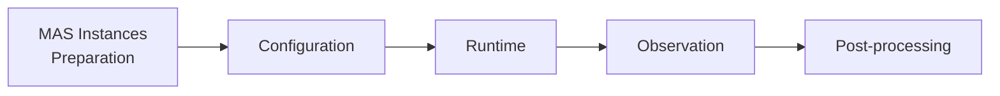

## 論文概要（Abstract）

MAESTROは、LLMベースのマルチエージェントシステム（MAS）のテスト・信頼性・観測可能性を評価するためのスイートである。統一インタフェースを通じてMAS構成と実行を標準化し、MCP-Agent、ADK、AutoGen、LangGraphなど主要フレームワークを横断的にサポートする。著者らは12の代表的MASインスタンスを用いた制御実験により、MAS実行が構造的には安定しつつも時間的には変動し得ること、アーキテクチャ選択がバックエンドモデルやツール設定よりもリソースプロファイル・再現性・コスト-レイテンシ-精度トレードオフの支配的要因であることを報告している。

この記事は [Zenn記事: LangGraphマルチエージェントRAGの評価フレームワーク設計と協調品質の定量化](https://zenn.dev/0h_n0/articles/88cd951a1ec060) の深掘りです。

## 情報源

- **arXiv ID**: 2601.00481
- **URL**: [https://arxiv.org/abs/2601.00481](https://arxiv.org/abs/2601.00481)
- **著者**: Tie Ma, Yixi Chen, Vaastav Anand, Alessandro Cornacchia et al.
- **発表年**: 2026
- **分野**: cs.NI, cs.AI
- **コード**: [https://github.com/sands-lab/maestro](https://github.com/sands-lab/maestro)

## 背景と動機（Background & Motivation）

LLMベースのマルチエージェントシステムは、複数のエージェントが協調してタスクを遂行する仕組みとして急速に普及している。しかし、著者らはこの分野に以下の根本的な課題が残されていると指摘している。

第一に、**評価の標準化が欠如**している。AutoGen、LangGraph、ADKなどフレームワークごとにインタフェースや実行モデルが異なり、公平な比較が困難である。第二に、**実行の再現性が不透明**である。同一構成でも実行ごとに結果が変動するが、その変動の原因や程度を定量化する手段がなかった。第三に、**観測可能性（Observability）が不十分**であり、レイテンシ・コスト・トークン使用量・障害モードなどシステムレベルの指標をフレームワーク横断で取得する統一的な方法が存在しなかった。

これらの課題に対し、MAESTROはフレームワーク非依存の評価スイートとして設計されている。

## 主要な貢献（Key Contributions）

- **統一評価インタフェース**: MCP-Agent、ADK、AutoGen、LangGraphの4フレームワークを共通仕様で統合し、軽量アダプタを介した第三者フレームワークの追加も可能にした
- **フレームワーク非依存のテレメトリ**: OpenTelemetryとpsutilを基盤に、レイテンシ・トークン使用量・コスト・障害カテゴリなど30以上の属性を自動記録する実行トレースシステム
- **12のMASインスタンスによる実証分析**: 4つのインタラクションパターン（Planning、Coordination、Debate、Correction）を網羅する代表的構成で制御実験を実施
- **9つの実証的知見**: 構造安定性と時間的変動の共存、アーキテクチャの支配的影響、サイレントグレーエラーの存在など、実運用に直結する発見を報告

## 技術的詳細（Technical Details）

### MAESTROアーキテクチャ

MAESTROは5つのコアコンポーネントから構成される線形制御フローを採用している。



1. **MAS Instances Preparation**: ネイティブ仕様または第三者フレームワーク統合を通じてMASインスタンスを準備
2. **Configuration**: 入力ソース、エージェント数、ツールアクセスなどの評価設定を指定
3. **Runtime**: タスク入力を供給しエージェント間インタラクションを実行
4. **Observation**: 関数呼び出しフックとサンプリングによる実行時監視（OpenTelemetry + psutil）
5. **Post-processing**: 実行トレースをCPU使用率・コールグラフ・遅延などの検査可能なサマリに集約

### コールグラフ類似度メトリクス

著者らはMAS実行の構造的安定性を定量化するため、2つの類似度指標を定義している。

**Jaccard類似度**（エッジ集合の重複度）:

$$
J(E_i, E_j) = \frac{|E_i \cap E_j|}{|E_i \cup E_j|}
$$

ここで、
- $E_i$: 実行 $i$ の有向コールグラフ $G_i$ における非重み付きエッジ集合
- $J(E_i, E_j)$: 2つの実行間のエッジ集合重複度（0: 完全不一致、1: 完全一致）

**LCS類似度**（順序一貫性）:

$$
\text{LCS}(S_i, S_j) = \frac{\text{LCS}_{\text{len}}(S_i, S_j)}{\max(|S_i|, |S_j|)}
$$

ここで、
- $S_i$: 実行 $i$ の線形化されたエッジ系列
- $\text{LCS}_{\text{len}}$: 最長共通部分列の長さ

Jaccard類似度が高く（平均0.86）LCS類似度が中程度（平均0.65）という結果は、エージェント間の呼び出し構造は安定しているが、実行順序は変動することを意味する。

### 4つのインタラクションパターン

| パターン | 説明 | 代表例 |
|----------|------|--------|
| **Planning** | タスクを分解し計画的に実行 | Plan&Execute, LATS, Content Creation |
| **Coordination** | エージェント間で情報を共有・統合 | CRAG, Stock Research, Brand SEO |
| **Debate** | 複数エージェントが議論で解を洗練 | Tree-of-Thoughts, Image Scraper |
| **Correction** | 出力を検証・修正するフィードバックループ | Financial Analyzer |

### テレメトリフィールド

OpenTelemetryベースの計装では、以下の主要属性を記録する。

```python
from dataclasses import dataclass
from typing import Optional

@dataclass(frozen=True)
class MAESTROTelemetrySpan:
    """MAESTRO実行トレースの1スパンを表す不変データクラス

    OpenTelemetry準拠のスパン属性を保持し、
    フレームワーク非依存のMAS実行分析に使用する。

    Attributes:
        operation_name: 実行された操作の識別子
        agent_name: 操作を実行したエージェント名
        duration_ms: 操作の実行時間（ミリ秒）
        input_tokens: 消費した入力トークン数
        output_tokens: 生成した出力トークン数
        attempt_number: リトライ回数（初回=1）
        failure_category: 障害カテゴリ（正常終了時はNone）
    """
    operation_name: str
    agent_name: str
    duration_ms: float
    input_tokens: int
    output_tokens: int
    attempt_number: int = 1
    failure_category: Optional[str] = None
```

## 実装のポイント（Implementation）

MAESTROを自身のMAS評価に適用する際の主要な実装上の注意点を以下に示す。

**フレームワーク統合**: 第三者フレームワークの追加は軽量アダプタパターンで実現される。各フレームワーク固有のエージェント定義・ツール呼び出し・メッセージパッシングをMAESTROの統一インタフェースにマッピングする必要がある。

**テレメトリオーバーヘッド**: 著者らは、細粒度の計装がプロファイリングオーバーヘッドを導入する点を制約事項として挙げている。本番環境ではサンプリング率の調整が必要となる。

**再現性確保**: 各MASインスタンスに対して最低20回の独立実行を推奨している。実行時間上限は1回あたり10分に設定されている。

**判定モデル**: 正答判定にはGPT-4o-miniをジャッジモデルとして使用しており、LLM-as-a-Judgeの信頼性にも留意が必要である。

## Production Deployment Guide

### AWS実装パターン（コスト最適化重視）

MAESTROのようなMAS評価基盤をAWS上に構築する場合、トラフィック量に応じて以下の3構成を推奨する。

**コスト試算の注意事項**: 以下は2026年2月時点のAWS ap-northeast-1（東京）リージョン料金に基づく概算値である。実際のコストはトラフィックパターン、リージョン、バースト使用量により変動する。最新料金はAWS料金計算ツールで確認を推奨する。

| 構成 | トラフィック | 主要サービス | 月額概算 |
|------|-------------|-------------|----------|
| **Small** | ~100 eval/日 | Lambda + Bedrock + DynamoDB | $80-180 |
| **Medium** | ~1,000 eval/日 | ECS Fargate + Bedrock + ElastiCache | $400-900 |
| **Large** | 10,000+ eval/日 | EKS + Spot + Bedrock Batch API | $2,500-5,500 |

**Small構成（~100 eval/日）**: Lambda関数でMASインスタンスの実行をトリガーし、Bedrock経由でLLM推論を行う。テレメトリデータはDynamoDB（On-Demand）に保存し、CloudWatch Logs Insightsで分析する。Lambda実行時間上限（15分）はMAESTROの10分/回制限に収まる。月額内訳: Lambda $5、Bedrock $50-120、DynamoDB $10-30、CloudWatch $15-25。

**Medium構成（~1,000 eval/日）**: ECS Fargate上で評価ワーカーをコンテナ実行する。ElastiCacheでテレメトリの中間集約を行い、S3に永続化する。Bedrockのプロンプトキャッシュを活用し30-90%のコスト削減を図る。月額内訳: ECS Fargate $150-300、Bedrock $150-400、ElastiCache $50-100、S3+その他 $50-100。

**Large構成（10,000+ eval/日）**: EKS上でKarpenterによるSpot Instances優先の自動スケーリングを行う。Bedrock Batch APIで50%のコスト削減、Spot Instancesで最大90%のコンピュートコスト削減が可能。X-Rayによる分散トレーシングでボトルネックを可視化する。月額内訳: EKS+Spot $800-2,000、Bedrock Batch $1,000-2,500、監視+ストレージ $200-500、ネットワーク $200-500。

### Terraformインフラコード

**Small構成（Serverless）**:

```hcl
# MAESTRO評価基盤 - Small構成 (Serverless)
# Lambda + Bedrock + DynamoDB

terraform {
  required_version = ">= 1.9"
  required_providers {
    aws = { source = "hashicorp/aws", version = "~> 5.80" }
  }
}

provider "aws" {
  region = "ap-northeast-1"
}

# DynamoDB: テレメトリデータ保存（On-Demandでコスト最適化）
resource "aws_dynamodb_table" "maestro_telemetry" {
  name         = "maestro-telemetry"
  billing_mode = "PAY_PER_REQUEST"  # On-Demand: 低トラフィック時のコスト最適化
  hash_key     = "run_id"
  range_key    = "span_id"

  attribute {
    name = "run_id"
    type = "S"
  }
  attribute {
    name = "span_id"
    type = "S"
  }

  server_side_encryption {
    enabled = true  # KMS暗号化
  }

  point_in_time_recovery {
    enabled = true
  }

  tags = { Project = "maestro", Environment = "production" }
}

# IAMロール: Lambda用（最小権限）
resource "aws_iam_role" "maestro_lambda" {
  name = "maestro-lambda-role"
  assume_role_policy = jsonencode({
    Version = "2012-10-17"
    Statement = [{
      Action = "sts:AssumeRole"
      Effect = "Allow"
      Principal = { Service = "lambda.amazonaws.com" }
    }]
  })
}

resource "aws_iam_role_policy" "maestro_lambda_policy" {
  name = "maestro-lambda-policy"
  role = aws_iam_role.maestro_lambda.id
  policy = jsonencode({
    Version = "2012-10-17"
    Statement = [
      {
        Effect   = "Allow"
        Action   = ["bedrock:InvokeModel", "bedrock:InvokeModelWithResponseStream"]
        Resource = "arn:aws:bedrock:ap-northeast-1::foundation-model/*"
      },
      {
        Effect   = "Allow"
        Action   = ["dynamodb:PutItem", "dynamodb:Query", "dynamodb:GetItem"]
        Resource = aws_dynamodb_table.maestro_telemetry.arn
      },
      {
        Effect   = "Allow"
        Action   = ["logs:CreateLogGroup", "logs:CreateLogStream", "logs:PutLogEvents"]
        Resource = "arn:aws:logs:ap-northeast-1:*:*"
      }
    ]
  })
}

# Lambda関数: MAS評価実行（10分タイムアウト = MAESTROの制限に対応）
resource "aws_lambda_function" "maestro_evaluator" {
  function_name = "maestro-evaluator"
  runtime       = "python3.12"
  handler       = "handler.evaluate"
  role          = aws_iam_role.maestro_lambda.arn
  timeout       = 600  # 10分 = MAESTROの実行上限
  memory_size   = 1024 # MAS実行に十分なメモリ

  environment {
    variables = {
      TELEMETRY_TABLE = aws_dynamodb_table.maestro_telemetry.name
      MIN_RUNS        = "20"  # MAESTROの推奨最低実行回数
    }
  }

  tracing_config {
    mode = "Active"  # X-Ray有効化
  }

  tags = { Project = "maestro" }
}

# CloudWatchアラーム: コスト異常検知
resource "aws_cloudwatch_metric_alarm" "bedrock_cost_spike" {
  alarm_name          = "maestro-bedrock-cost-spike"
  comparison_operator = "GreaterThanThreshold"
  evaluation_periods  = 1
  metric_name         = "InvocationCount"
  namespace           = "AWS/Bedrock"
  period              = 3600
  statistic           = "Sum"
  threshold           = 500  # 1時間500回超過でアラート
  alarm_actions       = []   # SNSトピックARNを設定
  tags                = { Project = "maestro" }
}
```

**Large構成（Container）**:

```hcl
# MAESTRO評価基盤 - Large構成 (EKS + Karpenter + Spot)

module "eks" {
  source          = "terraform-aws-modules/eks/aws"
  version         = "~> 20.31"
  cluster_name    = "maestro-cluster"
  cluster_version = "1.31"

  vpc_id     = module.vpc.vpc_id
  subnet_ids = module.vpc.private_subnets

  # コントロールプレーンのみ（ワーカーはKarpenter管理）
  cluster_endpoint_public_access = false  # セキュリティ: パブリックアクセス無効化
}

# Karpenter Provisioner: Spot優先で最大90%コスト削減
resource "kubectl_manifest" "karpenter_nodepool" {
  yaml_body = yamlencode({
    apiVersion = "karpenter.sh/v1"
    kind       = "NodePool"
    metadata   = { name = "maestro-eval-pool" }
    spec = {
      template = {
        spec = {
          requirements = [
            { key = "karpenter.sh/capacity-type", operator = "In", values = ["spot", "on-demand"] },
            { key = "node.kubernetes.io/instance-type", operator = "In",
              values = ["m6i.xlarge", "m6a.xlarge", "m5.xlarge"] }
          ]
        }
      }
      disruption = {
        consolidationPolicy = "WhenEmpty"
        consolidateAfter    = "30s"
      }
      limits = { cpu = "128", memory = "512Gi" }
    }
  })
}

# Secrets Manager: Bedrock設定の安全な管理
resource "aws_secretsmanager_secret" "bedrock_config" {
  name       = "maestro/bedrock-config"
  kms_key_id = aws_kms_key.maestro.arn
}

# AWS Budgets: 月次予算アラート
resource "aws_budgets_budget" "maestro_monthly" {
  name         = "maestro-monthly-budget"
  budget_type  = "COST"
  limit_amount = "5000"
  limit_unit   = "USD"
  time_unit    = "MONTHLY"

  notification {
    comparison_operator       = "GREATER_THAN"
    threshold                 = 80
    threshold_type            = "PERCENTAGE"
    notification_type         = "ACTUAL"
    subscriber_email_addresses = ["ops@example.com"]
  }
}
```

### 運用・監視設定

**CloudWatch Logs Insights クエリ**:

```
# コスト異常検知: 1時間あたりのトークン使用量スパイク
fields @timestamp, agent_name, input_tokens, output_tokens
| stats sum(input_tokens) as total_input, sum(output_tokens) as total_output by bin(1h)
| filter total_input > 100000
| sort @timestamp desc

# レイテンシ分析: P95/P99
fields @timestamp, duration_ms, operation_name
| stats percentile(duration_ms, 95) as p95, percentile(duration_ms, 99) as p99 by operation_name
| sort p99 desc
```

**CloudWatchアラーム設定**:

```python
import boto3

def create_maestro_alarms(sns_topic_arn: str) -> None:
    """MAESTROのコスト・レイテンシ監視アラームを作成する

    Args:
        sns_topic_arn: アラート通知先のSNSトピックARN
    """
    cw = boto3.client("cloudwatch", region_name="ap-northeast-1")

    # Bedrockトークン使用量スパイク検知
    cw.put_metric_alarm(
        AlarmName="maestro-bedrock-token-spike",
        MetricName="InputTokenCount",
        Namespace="AWS/Bedrock",
        Statistic="Sum",
        Period=3600,
        EvaluationPeriods=1,
        Threshold=500000,
        ComparisonOperator="GreaterThanThreshold",
        AlarmActions=[sns_topic_arn],
    )
```

**X-Rayトレーシング設定**:

```python
from aws_xray_sdk.core import xray_recorder, patch_all

def configure_maestro_tracing() -> None:
    """MAESTRO評価実行のX-Rayトレーシングを設定する

    boto3のBedrock/DynamoDB呼び出しを自動計装し、
    エージェント名・実行IDをアノテーションとして記録する。
    """
    xray_recorder.configure(service="maestro-evaluator")
    patch_all()  # boto3自動計装

@xray_recorder.capture("mas_evaluation")
def run_evaluation(run_id: str, agent_name: str) -> dict:
    """MAS評価の1実行をトレーシング付きで実行する

    Args:
        run_id: 実行ID
        agent_name: 評価対象エージェント名

    Returns:
        評価結果を含む辞書
    """
    subsegment = xray_recorder.current_subsegment()
    subsegment.put_annotation("run_id", run_id)
    subsegment.put_annotation("agent_name", agent_name)
    subsegment.put_metadata("config", {"min_runs": 20, "timeout_s": 600})
    return {"status": "completed"}
```

**Cost Explorer自動レポート**:

```python
import boto3
from datetime import datetime, timedelta

def daily_cost_report(sns_topic_arn: str) -> dict:
    """日次コストレポートを取得しSNS通知する

    Args:
        sns_topic_arn: 通知先SNSトピックARN

    Returns:
        コストレポート辞書
    """
    ce = boto3.client("ce", region_name="us-east-1")
    today = datetime.utcnow().strftime("%Y-%m-%d")
    yesterday = (datetime.utcnow() - timedelta(days=1)).strftime("%Y-%m-%d")

    response = ce.get_cost_and_usage(
        TimePeriod={"Start": yesterday, "End": today},
        Granularity="DAILY",
        Metrics=["UnblendedCost"],
        Filter={
            "Tags": {"Key": "Project", "Values": ["maestro"]}
        },
        GroupBy=[{"Type": "DIMENSION", "Key": "SERVICE"}],
    )

    total = sum(
        float(g["Metrics"]["UnblendedCost"]["Amount"])
        for r in response["ResultsByTime"]
        for g in r["Groups"]
    )

    if total > 100:
        sns = boto3.client("sns", region_name="ap-northeast-1")
        sns.publish(
            TopicArn=sns_topic_arn,
            Subject=f"MAESTRO Cost Alert: ${total:.2f}/day",
            Message=f"Daily cost exceeded $100: ${total:.2f}",
        )

    return {"date": yesterday, "total_cost_usd": total}
```

### コスト最適化チェックリスト

**アーキテクチャ選択**:
- [ ] トラフィック ~100 eval/日 → Serverless（Lambda + Bedrock）
- [ ] トラフィック ~1,000 eval/日 → Hybrid（ECS Fargate + Bedrock）
- [ ] トラフィック 10,000+ eval/日 → Container（EKS + Spot + Bedrock Batch）

**リソース最適化**:
- [ ] EC2/EKSワーカー: Spot Instances優先（最大90%削減）
- [ ] Reserved Instances: 1年コミットで最大72%削減
- [ ] Savings Plans: コンピュート使用量に応じた割引
- [ ] Lambda: メモリサイズ最適化（1024MB推奨、Power Tuningで検証）
- [ ] EKS: Karpenterで未使用ノード30秒後に自動回収
- [ ] NAT Gateway: VPCエンドポイント活用で通信コスト削減

**LLMコスト削減**:
- [ ] Bedrock Batch API: 非同期評価で50%削減
- [ ] Prompt Caching: 繰り返し評価プロンプトで30-90%削減
- [ ] モデル選択ロジック: 精度要求が低いタスクは軽量モデル（GPT-4o-mini: $0.0034/task）
- [ ] トークン数制限: 入力/出力の上限設定
- [ ] 評価バッチング: 複数タスクをまとめて実行

**監視・アラート**:
- [ ] AWS Budgets: 月次予算上限設定（80%到達で通知）
- [ ] CloudWatchアラーム: トークン使用量スパイク検知
- [ ] Cost Anomaly Detection: 異常コスト自動検出
- [ ] 日次コストレポート: Cost Explorer APIで自動取得
- [ ] X-Ray: レイテンシボトルネック可視化

**リソース管理**:
- [ ] 未使用リソース削除: 孤立EBSボリューム・古いスナップショット
- [ ] タグ戦略: Project/Environment/Ownerタグ必須
- [ ] S3ライフサイクルポリシー: テレメトリデータ90日後にGlacier移行
- [ ] 開発環境夜間停止: EventBridgeスケジュールで自動停止/起動
- [ ] CloudTrail/Config: 監査証跡の有効化

## 実験結果（Results）

著者らは2つの評価スイートを設計している。**Full Suite（F）**: 12のMASインスタンス全体でシステム挙動を分析。**Architecture Suite（A）**: CRAG、Plan&Execute、LATSの3実装が同一タスクを解く構成で、アーキテクチャの影響を分離比較する。各インスタンスに対して最低20回の独立実行を行い、統計的に有意な結果を得ている。

リソース消費について、著者らは大半のMAS実行がサブGBメモリに収まり、CPU使用率は最大61.9%であると報告している。平均メモリ使用量は200.2MB（外れ値除外）で、通信量はMBスケールに留まる。

精度・コストのトレードオフでは、CRAGが70.6%の精度をタスクあたり中央値$0.0010で達成する一方、Plan&Executeは48.3%の精度でタスクあたり$0.0126と12倍以上のコストを要する。LATSはPlan&Execute以上のコスト（$0.0101）を投じつつも精度向上は不安定であった。

障害モードの分析では、全障害の75.17%が「サイレントグレーエラー」（もっともらしいが不正確な出力）として観測された。内訳は出力欠落47.61%、事実誤り27.66%、空予測15.96%、例外6.38%、タイムアウト1.86%である。

モデルスケーリングについて、GPT-4o-miniの中央値コストは$0.0034/taskであるのに対し、GPT-5系列は$0.033-0.043/taskと約10倍のコストとなるが、精度の向上は非単調（monotonic）でないと著者らは報告している。

## 実運用への応用（Practical Applications）

MAESTROの知見は、マルチエージェントRAGシステムの設計・運用に直接応用可能である。

**アーキテクチャ選択の重要性**: バックエンドモデルの変更よりもMASアーキテクチャの選択がコスト・レイテンシ・精度に支配的な影響を与えるという知見は、LangGraphでの設計判断において重要な指針となる。Coordinationパターン（CRAGに相当）がコスト効率に優れるという結果は、RAGワークフローにおけるエージェント間協調の設計に直結する。

**サイレントグレーエラー対策**: 障害の75%以上が検出困難なグレーエラーであるという発見は、出力検証レイヤーの必須性を示唆している。マルチエージェントRAGでは、検索結果の事実整合性チェックを専用エージェントに委任する設計が有効と考えられる。

**テレメトリによるコスト管理**: OpenTelemetryベースの統一的なテレメトリ収集は、プロダクション環境でのコスト予測と異常検知に不可欠である。特にトークン使用量の実行間変動が大きいことから、予算設計には十分なマージンが必要である。

**ツール統合の効果**: CRAGでは外部ツール統合により中央値で35.7%の精度向上が観測されており、RAGにおける外部検索ツールの重要性が実証されている。

## 関連研究（Related Work）

MAESTROは以下の研究領域と関連する。**エージェントベンチマーク**: AgentBench（Liu et al.）やStableToolBench、REALMなどの既存ベンチマークはタスク完遂能力に焦点を当てるが、MAESTROはシステムレベルの信頼性・再現性を評価対象とする点で差別化される。**MASフレームワーク**: Magentic-One（AutoGen）、LangGraphなどの実行フレームワーク自体ではなく、それらを横断的に評価する基盤である。**LLMサービング**: BurstGPT等のLLM推論最適化研究とは、MAS全体のコスト-レイテンシ最適化という上位レイヤーで接続する。

## まとめと今後の展望

MAESTROは、LLMベースのマルチエージェントシステムの評価における再現性・観測可能性・比較可能性の課題に対し、フレームワーク非依存の統一的なアプローチを提供した。特にアーキテクチャ選択の支配的影響とサイレントグレーエラーの普遍性は、実運用設計において重要な知見である。今後の研究方向として、著者らはテレメトリオーバーヘッドの最適化、観測可能性契約の標準化、急速に進化するMAS設計空間への対応を課題として挙げている。

## 参考文献

- **arXiv**: [https://arxiv.org/abs/2601.00481](https://arxiv.org/abs/2601.00481)
- **Code**: [https://github.com/sands-lab/maestro](https://github.com/sands-lab/maestro)
- **Related Zenn article**: [https://zenn.dev/0h_n0/articles/88cd951a1ec060](https://zenn.dev/0h_n0/articles/88cd951a1ec060)
