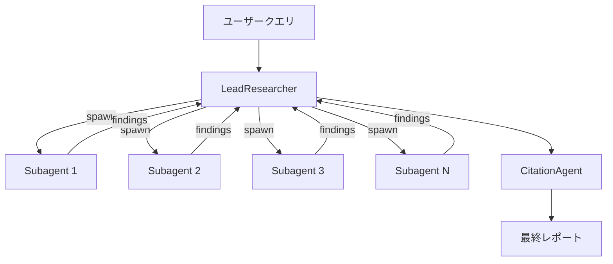

## ブログ概要（Summary）

Hadfield, Zhang, Lien, Scholz, Fox, Ford（2025）は、Anthropicの製品に組み込まれたマルチエージェント研究システムの設計と運用について報告している。オーケストレータ・ワーカーパターンを採用し、LeadResearcherエージェントが専門サブエージェントを並列に生成・協調させる構成である。社内評価において、単一エージェント（Claude Opus 4）に対してマルチエージェント構成が90.2%の性能改善を示したと報告されている。

この記事は [Zenn記事: LangGraph Supervisor vs Swarm：マルチエージェントRAGの実装比較](https://zenn.dev/0h_n0/articles/c5c769fcd39455) の深掘りです。

## 情報源

- **種別**: 企業テックブログ
- **URL**: [https://www.anthropic.com/engineering/built-multi-agent-research-system](https://www.anthropic.com/engineering/built-multi-agent-research-system)
- **組織**: Anthropic Engineering
- **著者**: Jeremy Hadfield, Barry Zhang, Kenneth Lien, Florian Scholz, Jeremy Fox, Daniel Ford
- **発表日**: 2025年6月13日

## 技術的背景（Technical Background）

従来のRAG（Retrieval Augmented Generation）は、事前に取得した類似チャンクを用いる「静的検索」に依存していた。Anthropicのエンジニアリングチームは、この静的検索を「動的に関連情報を発見し、新しい発見に適応し、結果を分析するマルチステップ検索」に置き換えるアプローチを採用している。

この設計思想は、Zenn記事のSupervisorパターンにおけるRetriever→Verifier→Synthesizerのフェーズ分離と根本的に同じ課題を解決しようとしている。単一のLLMコールでは対応できない複雑な調査クエリに対して、複数の専門エージェントによるイテレーティブな情報収集が有効であるという前提に基づく。

Anthropicのチームは、「知性が閾値に達すると、マルチエージェントシステムがパフォーマンスをスケールさせるための重要な手段になる」と述べている。

## 実装アーキテクチャ（Architecture）

### オーケストレータ・ワーカーパターン

システムはオーケストレータ・ワーカーパターンで構成され、3種類のエージェントが階層的に連携する：



**LeadResearcherエージェント**: ユーザークエリを分析し、研究戦略を策定する。コンテキストウィンドウが200,000トークンの上限に近づく前に研究計画をメモリに保存し、コンテキスト消失を防止する。専門サブエージェントを生成してタスクを委譲し、それらの成果を統合する。追加の調査イテレーションが必要かどうかも判断する。

**サブエージェント**: 独立したコンテキストウィンドウで動作し、イテレーティブなWeb検索を実行する。Interleaved thinking（ツール結果を評価するための中間推論）を使用して検索品質を動的に判断する。

**CitationAgent**: 文書と研究レポートを処理し、各主張に対する引用元を特定して帰属を確保する。

### Zenn記事のパターンとの対応

| Anthropic Multi-Agent | Zenn記事 Supervisor | Zenn記事 Swarm |
|---|---|---|
| LeadResearcher（中央制御） | Supervisor（中央制御） | なし（自律判断） |
| Subagent（並列検索） | Retriever（逐次検索） | Retriever（ハンドオフ） |
| CitationAgent（引用検証） | Verifier（検索品質検証） | Verifier（ハンドオフ） |
| LeadResearcherの統合 | Synthesizer | Synthesizer |

Zenn記事のSupervisorパターンとの主要な差異は**並列実行**にある。Zenn記事のSupervisorは各エージェントを逐次呼び出すが、Anthropicのシステムはサブエージェントを並列に生成する。ただしAnthropicのブログでは、LeadResearcherはサブエージェントの完了を**同期的に待機**すると報告されており、非同期実行は将来の拡張として位置づけられている。

### スケーリング戦略

サブエージェントの数はクエリ複雑度に応じて動的にスケールする：

```python
from dataclasses import dataclass


@dataclass
class SubagentConfig:
    """サブエージェントの構成パラメータ"""
    count: int
    tools_per_agent: int
    description: str


def determine_subagent_config(query_complexity: str) -> SubagentConfig:
    """クエリ複雑度に応じたサブエージェント構成を決定する

    Args:
        query_complexity: クエリの複雑度 ("simple", "comparison", "complex")

    Returns:
        サブエージェント構成パラメータ
    """
    configs = {
        "simple": SubagentConfig(
            count=1, tools_per_agent=10, description="単一事実確認"
        ),
        "comparison": SubagentConfig(
            count=4, tools_per_agent=15, description="直接比較"
        ),
        "complex": SubagentConfig(
            count=10, tools_per_agent=20, description="分割責任型"
        ),
    }
    return configs.get(query_complexity, configs["simple"])
```

Anthropicのブログによれば、LeadResearcherは通常3-5のサブエージェントを並列生成し、各サブエージェントは3以上のツールを並列に呼び出すと報告されている。

### MCP（Model Context Protocol）サーバー

エージェントの外部ツールアクセスにはMCPサーバーが使用されている。ブログでは、MCPツールの記述品質が「極めてばらつきが大きい（wildly varying quality）」ことが課題として挙げられている。この問題に対し、以下のツール選択ヒューリスティクスが実装されている：

1. 利用可能な全ツールを最初に調査する
2. ユーザーの意図にツール使用をマッチさせる
3. 広範な外部探索にはWeb検索を使用する
4. 汎用ツールよりも専門ツールを優先する

ツールテストプロセスでは、Claude 4モデル自体がプロンプトエンジニアとして機能する。ツールテスト用エージェントが不完全なツールの使用を試行し、失敗パターンに基づいてツール記述を書き換えるプロセスが、ツールごとに数十回実行されると報告されている。

## パフォーマンス最適化（Performance）

### 性能指標

Anthropicは以下の性能指標を報告している：

| 指標 | 値 |
|------|-----|
| マルチエージェント vs 単一エージェント改善 | +90.2%（社内評価） |
| エージェントのトークン消費 | チャット比約4倍 |
| マルチエージェントのトークン消費 | チャット比約15倍 |
| 並列ツール呼び出しによるレイテンシ削減 | 最大90%（複雑クエリ） |
| ツール改善によるタスク完了時間短縮 | 40% |

### BrowseComp評価での分散分析

ブログでは、BrowseComp評価において性能分散の95%を3つの要因で説明できると報告されている：

$$
\text{Performance} \approx f(\text{TokenUsage}, \text{ToolCalls}, \text{ModelChoice})
$$

- **トークン使用量**: 性能分散の80%を説明
- **ツール呼び出し回数**: 追加の説明変数
- **モデル選択**: 残りの分散を説明

注目すべき知見として、「Claude Sonnet 4へのアップグレードは、Claude Sonnet 3.7でのトークン予算倍増よりも大きな性能改善をもたらす」と報告されている。これは、モデルの知性レベルがスケーリングの前提条件であることを示唆している。

### メモリ管理

コンテキストウィンドウ制約への対処として、以下の戦略が実装されている：

```python
def manage_context(
    lead_agent,
    context_tokens: int,
    max_tokens: int = 200_000,
) -> None:
    """コンテキスト管理戦略

    Args:
        lead_agent: LeadResearcherエージェント
        context_tokens: 現在のコンテキストトークン数
        max_tokens: コンテキストウィンドウ上限
    """
    if context_tokens > max_tokens * 0.8:
        # 研究計画をメモリに永続化
        lead_agent.save_plan_to_memory()
        # 新しいコンテキストでサブエージェントを生成
        fresh_subagent = lead_agent.spawn_subagent(
            context="clean",
            memory_ref=lead_agent.memory_id,
        )
        # メモリから計画を復元して作業を継続
        fresh_subagent.restore_from_memory()
```

## 運用での学び（Production Lessons）

### デバッグの困難さ

Anthropicのチームは、マルチエージェントシステムのデバッグにおける最大の課題として**非決定性**を挙げている。同一プロンプトでも実行間で異なる振る舞いが発生するため、本番環境での完全なトレーシングが不可欠であると報告されている。

具体的には以下の対策が実装されている：

- エージェントの判断パターンとインタラクション構造のモニタリング
- プライバシー保護のため会話内容自体はモニタリング対象外
- エラー発生時の再開ポイントからのレジューム機能
- リトライロジックと定期チェックポイントの組み合わせ

### Rainbow Deployments

長時間実行されるエージェントプロセスの更新に対して、従来のBlue-Greenデプロイメントではなく**Rainbow Deployments**が採用されている。これは、旧バージョンと新バージョンを同時に維持しながらトラフィックを段階的に移行する手法であり、ステートフルなエージェントの実行中断を防止する。

Zenn記事の4エージェント構成（Supervisorパターンでレイテンシ4.2秒、Swarmパターンでレイテンシ3.1秒）と比較すると、Anthropicのシステムは「最大で数日分の作業を節約する」複雑な調査タスクを対象としており、レイテンシよりもスループットと品質を優先する設計思想が異なる。

### 評価方法論

Anthropicのチームは以下の3段階の評価アプローチを報告している：

1. **初期テスト**: 約20件の実使用パターンクエリで大規模な変更のインパクトを確認（30%→80%の成功率改善が初期段階で確認された）
2. **LLM-as-Judge**: 事実正確性・引用正確性・網羅性・情報源品質・ツール効率の5基準で0.0-1.0スコアを算出
3. **ヒューマン評価**: 自動評価では検出できないエッジケース（SEO最適化されたコンテンツファームの優先選択、希少クエリでのハルシネーション等）を発見

評価は**エンドステート評価**（最終状態のみを評価し、中間ステップの妥当性は問わない）を基本としている。これは複数の有効なパスが存在するエージェントタスクにおいて、ターンバイターンの分析よりも効果的であると報告されている。

### プロンプトエンジニアリングの原則

ブログでは8つのプロンプトエンジニアリング原則が報告されている。Zenn記事の実装に直接関連する3つを以下に取り上げる：

1. **「エージェントのように考える」**: シミュレーションを通じてエージェントのメンタルモデルを構築する。これはZenn記事でSupervisor/Swarmの設計前にエージェントのロールを詳細に定義するプロセスに対応する
2. **「オーケストレーターに委譲方法を教える」**: 詳細なタスク記述により重複作業を防止する。Zenn記事のSupervisorプロンプトにおけるエージェント指示の精度に直結する
3. **「広く始めて絞り込む」**: 短く広範なクエリから開始し、情報を評価した上で焦点を段階的に絞り込む。Zenn記事のQuery Plannerエージェントの検索戦略設計に適用可能

## 学術研究との関連（Academic Connection）

Anthropicのオーケストレータ・ワーカーパターンは、Nexus（Weng et al., 2025）のスーパーバイザー専門化・階層集約と構造的に類似している。ただしNexusがスーパーバイザー自体をファインチューニングするのに対し、Anthropicのアプローチはプロンプトエンジニアリングとツール設計のみで専門化を実現している点が異なる。

Yang, Wei, Liang（2025）のMAW理論フレームワークにおけるエラー相関の議論も関連が深い。Anthropicのシステムではサブエージェントが独立したコンテキストウィンドウで動作し、異なる検索パスを探索するため、エラー相関が低減されていると考えられる。これは論文のTheorem 1（独立エラー下でのMAW優位性）の実践的な実装例と位置づけられる。

## まとめと実践への示唆

Anthropicのエンジニアリングチームは、オーケストレータ・ワーカーパターンによるマルチエージェント研究システムの構築において、単一エージェント比で90.2%の性能改善を報告している。性能分散の95%がトークン使用量・ツール呼び出し回数・モデル選択の3要因で説明されるという知見は、Zenn記事のSupervisorパターン（12,800トークン/クエリ）の設計判断に定量的な裏付けを与える。

実務への示唆として、(1) サブエージェントの並列生成によるレイテンシ削減、(2) MCPサーバーのツール記述品質管理、(3) エンドステート評価によるエージェント品質保証の3点が、Zenn記事のマルチエージェントRAG実装に直接適用可能な知見である。

## 参考文献

- **Blog URL**: [https://www.anthropic.com/engineering/built-multi-agent-research-system](https://www.anthropic.com/engineering/built-multi-agent-research-system)
- **Related Zenn article**: [https://zenn.dev/0h_n0/articles/c5c769fcd39455](https://zenn.dev/0h_n0/articles/c5c769fcd39455)
