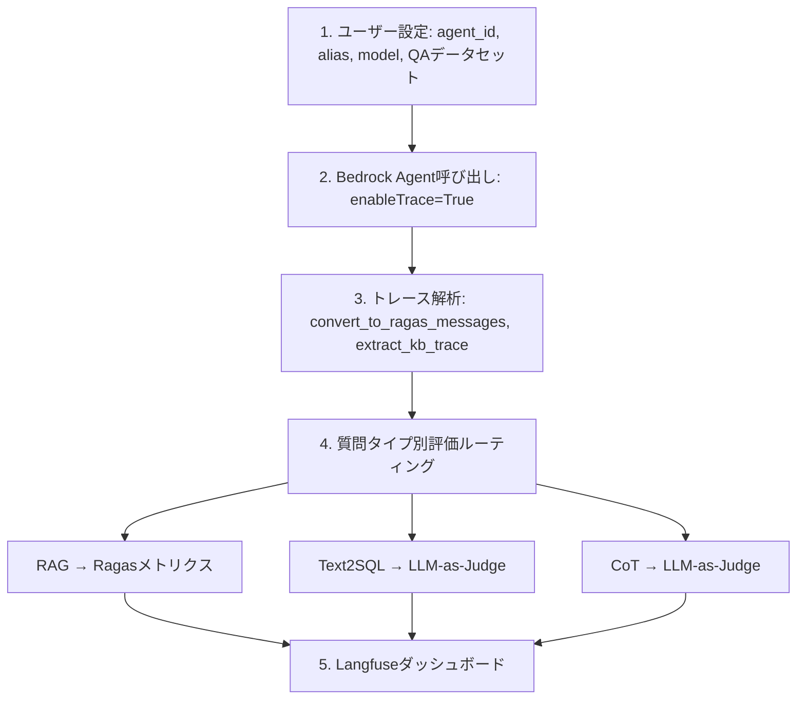

## ブログ概要（Summary）

AWSが公開したこのブログは、Amazon Bedrock Agentsの評価パイプラインをオープンソースのRagasライブラリとLLM-as-a-Judgeを組み合わせて構築する実践ガイドである。RAG評価（Faithfulness、Context Recall等）、Text-to-SQL評価（Answer Correctness、SQL Semantic Equivalence）、エージェント目標達成度評価（Helpfulness、Faithfulness、Instruction Following）の3カテゴリにわたる評価メトリクスを、Langfuseによるオブザーバビリティと統合した包括的な評価フレームワークを提供している。

この記事は [Zenn記事: マルチエージェントRAGの応答品質をLLM-as-Judgeで分解評価する実践手法](https://zenn.dev/0h_n0/articles/69bf247b252e08) の深掘りです。

## 情報源

- **種別**: 企業テックブログ
- **URL**: [https://aws.amazon.com/blogs/machine-learning/evaluate-amazon-bedrock-agents-with-ragas-and-llm-as-a-judge/](https://aws.amazon.com/blogs/machine-learning/evaluate-amazon-bedrock-agents-with-ragas-and-llm-as-a-judge/)
- **組織**: AWS Machine Learning Blog
- **著者**: Hasan Poonawala, Blake Shin, Rishiraj Chandra
- **発表日**: 2025年4月
- **GitHub**: [https://github.com/aws-samples/open-source-bedrock-agent-evaluation](https://github.com/aws-samples/open-source-bedrock-agent-evaluation)

## 技術的背景（Technical Background）

Amazon Bedrock Agentsは、LLMにツール呼び出し・Knowledge Base検索・コード実行などの能力を付与するマネージドサービスである。しかし、エージェントの応答品質を体系的に評価するための標準的なパイプラインは整備されていなかった。

著者らは、エージェント評価を2つのカテゴリに分割するアプローチを採用している。(1) すべての質問に対して実行される**エージェント目標達成度評価**（Chain-of-Thought評価）、(2) 特定のツールが使用された場合にのみ実行される**タスク精度評価**（RAG評価・Text-to-SQL評価）である。この2層構造により、エージェント全体の振る舞いと個別ツールの精度を同時に評価できる。

Ragasは、RAGパイプラインの品質を定量化するためのオープンソースライブラリであり、Faithfulness・Answer Relevancy・Context Recallなどのメトリクスを提供する。LangChainとの統合により、Bedrock上のモデルをエバリュエーターLLMとして直接使用できる。

## 実装アーキテクチャ（Architecture）

### 5ステップの評価パイプライン

著者らが提案する評価パイプラインは以下の5ステップで構成される。



### Bedrock Agent呼び出しとトレース取得

評価の起点は `enableTrace=True` によるBedrock Agentの呼び出しである。トレースにはエージェントの推論過程、ツール呼び出し、Knowledge Base検索結果がすべて記録される。

```python
import boto3

def invokeAgent(query, session_id, session_state=dict()):
    agentResponse = bedrock_agent_runtime_client.invoke_agent(
        inputText=query,
        agentId=agent_id,
        agentAliasId=alias_id,
        sessionId=session_id,
        enableTrace=True,  # トレース有効化
        endSession=False,
        sessionState=session_state,
    )

    event_stream = agentResponse["completion"]
    traces = []
    for event in event_stream:
        if "chunk" in event:
            data = event["chunk"]["bytes"]
            agent_answer = data.decode("utf8")
            return agent_answer, traces
        elif "trace" in event:
            traces.append(event["trace"])
    return agent_answer, traces
```

### トレースのRagasフォーマット変換

取得したトレースは `convert_to_ragas_messages` と `extract_kb_trace` でRagasが処理可能な形式に変換される。

```python
from ragas.integrations.amazon_bedrock import (
    convert_to_ragas_messages, extract_kb_trace
)

# マルチターンサンプル（エージェント目標評価用）
ragas_messages = convert_to_ragas_messages(traces)
sample = MultiTurnSample(user_input=ragas_messages)

# シングルターンサンプル（RAG評価用）
kb_trace = extract_kb_trace(traces)
single_turn_sample = SingleTurnSample(
    user_input=kb_trace[0].get("user_input"),
    retrieved_contexts=kb_trace[0].get("retrieved_contexts"),
    response=kb_trace[0].get("response"),
    reference="期待されるKB応答"
)
```

## 評価メトリクス詳細

### カテゴリA: エージェント目標達成度（全質問に対して実行）

Chain-of-Thought評価として以下の3メトリクスが定義されている。

| メトリクス | 説明 | 評価スコア例 |
|-----------|------|-------------|
| Helpfulness | 明示的・暗黙的な期待に対する充足度 | 0.77 |
| Faithfulness | 利用可能な情報への忠実性（ハルシネーション回避） | 0.87 |
| Instruction Following | 明示的な指示・制約への遵守度 | 0.69 |

### カテゴリB: タスク精度（ツール使用時のみ実行）

**RAG評価メトリクス**（Ragasライブラリ）:

```python
from ragas.metrics import (
    Faithfulness, ContextRelevance, ResponseGroundedness
)

rag_metrics = [
    ContextRelevance(llm=evaluator_llm),   # 検索コンテキストの適合性
    Faithfulness(llm=evaluator_llm),        # コンテキストとの事実整合性
    ResponseGroundedness(llm=evaluator_llm)  # 応答の根拠付け度
]

kb_results = evaluate(
    dataset=EvaluationDataset(samples=[single_turn_sample]),
    metrics=rag_metrics
)
```

**Text-to-SQL評価メトリクス**（LLM-as-Judge）:

| メトリクス | 説明 | 評価スコア例 |
|-----------|------|-------------|
| Answer Correctness | SQLクエリが正しい回答を返すか | 0.83 |
| SQL Semantic Equivalence | 生成SQLがGround TruthのSQLと意味的に等価か | 0.81 |

### エージェント固有のRagasメトリクス

**AgentGoalAccuracy**: エージェントの目標達成度を測定する。参照ありと参照なしの2バリアントがある。

```python
from ragas.metrics import (
    AgentGoalAccuracyWithReference,
    AgentGoalAccuracyWithoutReference,
    ToolCallAccuracy
)

# 参照あり（より決定的）
scorer = AgentGoalAccuracyWithReference(llm=judge_llm)
result = await scorer.multi_turn_ascore(sample_with_ref)
# 返り値: 0.0 or 1.0（バイナリ）

# 参照なし（会話のみから推測）
scorer = AgentGoalAccuracyWithoutReference(llm=judge_llm)
result = await scorer.multi_turn_ascore(sample)
```

**ToolCallAccuracy**: LLMが必要なツールを正しく特定・呼び出したかを評価する。引数の比較にはLLMベースではなく文字列距離（Levenshtein, Hamming, Jaro）を使用することで、高速かつ決定的な評価を実現する。

```python
from ragas.metrics._string import NonLLMStringSimilarity

scorer = ToolCallAccuracy()
scorer.arg_comparison_metric = NonLLMStringSimilarity()
result = await scorer.multi_turn_ascore(sample_with_tools)
# 返り値: 0.0 ～ 1.0
```

### カスタムメトリクスの定義

著者らは、ビジネス固有の評価基準をAspectCriticとRubricsScoreで定義する方法を紹介している。

```python
from ragas.metrics import AspectCritic, RubricsScore

# バイナリ評価（0 or 1）
request_completeness = AspectCritic(
    name="Request Completeness",
    llm=evaluator_llm,
    definition="すべてのリクエストを完全に満たしている場合は1、そうでなければ0を返す"
)

# ルーブリック評価（離散スコア）
rubrics = {
    "score-1_description": "メニューにない項目で、推薦もなし",
    "score0_description": "項目が利用可能、または非食品の問い合わせ",
    "score1_description": "項目が利用不可だが、代替品を推薦"
}
recommendations = RubricsScore(
    rubrics=rubrics, llm=evaluator_llm, name="Recommendations"
)
```

## 実践的なベンチマーク結果

著者らは製薬マルチエージェントシステム（がんバイオマーカー研究）のユースケースでフレームワークを実証している。Supervisorエージェントが4つの専門サブエージェント（バイオマーカーDB分析、臨床エビデンス研究、統計学者、医用画像専門家）を指揮する構成で、21トラジェクトリ・56質問のテストセットを使用した。

| メトリクス | カテゴリ | 対象質問数 | 平均スコア |
|-----------|----------|-----------|-----------|
| Helpfulness | Agent Goal | 50 | **0.77** |
| Faithfulness | Agent Goal | 50 | **0.87** |
| Instruction Following | Agent Goal | 50 | **0.69** |
| Answer Correctness | Text-to-SQL | 26 | **0.83** |
| SQL Semantic Equivalence | Text-to-SQL | 26 | **0.81** |
| Semantic Similarity | RAG | 20 | **0.66** |
| Context Recall | RAG | 20 | **0.53** |

Context Recall（0.53）の低さは、Knowledge Baseの検索精度に改善の余地があることを示唆している。一方、Faithfulness（0.87）は応答のハルシネーション率が低いことを示している。

## Langfuseによるオブザーバビリティ

Langfuseは評価結果と実行トレースの可視化・分析プラットフォームとして統合されている。

提供する機能:
- **ダッシュボード**: エージェントパフォーマンスの集約可視化
- **トレースパネル**: 複数会話のフィルタリング分析
- **個別トレース**: ツール呼び出し・推論ステップの詳細分解
- **メトリクス**: レイテンシ測定、モデルコスト（トークン数）の追跡
- **評価スコア**: ジャッジLLMのChain-of-Thought説明付きスコア

エンタープライズ環境では、LangfuseをAWS ECS/Fargate上にセルフホストすることでデータ主権を確保できる。

## 学術研究との関連

本ブログのフレームワークは、以下の学術研究を実務に適用している。

- **RAGAS (Shahul et al., 2023)**: RAG品質メトリクスの基盤。Faithfulness、Context Relevanceなどの概念を直接実装
- **LLM-as-a-Judge (Zheng et al., 2023)**: モデルベース評価の基本フレームワーク。Text-to-SQL評価やAgent Goal評価に応用
- **Agent-as-a-Judge (Zhuge et al., 2024)**: エージェントによるエージェント評価。本ブログのトレースベース評価アプローチはこの概念の実践的実装

## Production Deployment Guide

### AWS実装パターン（コスト最適化重視）

**トラフィック量別の推奨構成**:

**Small（~100 req/日）**: Lambda + Bedrock構成
- Lambda（評価パイプライン実行）: $0.20/100万リクエスト
- Bedrock Claude 3 Haiku（Judge LLM）: 入力$0.00025/1K tokens, 出力$0.00125/1K tokens
- DynamoDB（評価結果保存）: オンデマンド$1.25/100万書き込み
- 月額概算: $30-80

**Medium（~1000 req/日）**: ECS Fargate + Bedrock構成
- Fargate（0.25 vCPU, 0.5 GB）: 約$9/月
- Bedrock Claude 3.5 Sonnet（Judge LLM）: 入力$0.003/1K tokens, 出力$0.015/1K tokens
- Langfuse（セルフホスト、ECS）: 約$30/月
- 月額概算: $200-500

**Large（10000+ req/日）**: EKS + Spot + Bedrock Batch構成
- EKS + Spot Instances: 約$150/月（Spot活用で60%削減）
- Bedrock Batch API: 通常の50%のコスト
- ElastiCache（結果キャッシュ）: 約$50/月
- 月額概算: $800-2,000

**コスト削減テクニック**:
- Bedrock Batch APIで50%削減（非同期評価ジョブに最適）
- Prompt Caching有効化で30-90%削減
- ToolCallAccuracyにNonLLMStringSimilarityを使用してLLM呼び出しを削減
- 参照ありメトリクスを優先し、不確実な推論による再試行を削減

### Terraformインフラコード

**Small構成（Serverless）**:

```hcl
# Lambda + Bedrock評価パイプライン
resource "aws_lambda_function" "eval_pipeline" {
  function_name = "bedrock-agent-eval"
  runtime       = "python3.12"
  handler       = "driver.handler"
  timeout       = 900
  memory_size   = 1024

  environment {
    variables = {
      BEDROCK_AGENT_ID    = var.agent_id
      BEDROCK_AGENT_ALIAS = var.agent_alias
      EVAL_MODEL_ID       = "anthropic.claude-3-haiku-20240307-v1:0"
      LANGFUSE_PUBLIC_KEY = var.langfuse_public_key
      LANGFUSE_HOST       = var.langfuse_host
    }
  }
}

resource "aws_iam_role_policy" "bedrock_access" {
  name = "bedrock-agent-eval-policy"
  role = aws_iam_role.lambda_role.id
  policy = jsonencode({
    Version = "2012-10-17"
    Statement = [
      {
        Effect = "Allow"
        Action = [
          "bedrock:InvokeAgent",
          "bedrock:InvokeModel"
        ]
        Resource = "*"
      }
    ]
  })
}

resource "aws_dynamodb_table" "eval_results" {
  name         = "bedrock-eval-results"
  billing_mode = "PAY_PER_REQUEST"
  hash_key     = "eval_id"
  range_key    = "timestamp"

  attribute {
    name = "eval_id"
    type = "S"
  }
  attribute {
    name = "timestamp"
    type = "N"
  }
}

resource "aws_cloudwatch_event_rule" "eval_schedule" {
  name                = "daily-eval-run"
  schedule_expression = "cron(0 14 * * ? *)"
}
```

**Large構成（Container）**:

```hcl
# EKS + Spot構成
module "eks" {
  source          = "terraform-aws-modules/eks/aws"
  cluster_name    = "bedrock-eval-cluster"
  cluster_version = "1.29"

  vpc_id     = module.vpc.vpc_id
  subnet_ids = module.vpc.private_subnets

  eks_managed_node_groups = {
    eval_workers = {
      instance_types = ["m6i.large", "m5.large"]
      capacity_type  = "SPOT"
      min_size       = 1
      max_size       = 10
      desired_size   = 2
    }
  }
}

resource "aws_budgets_budget" "eval_budget" {
  name         = "bedrock-eval-monthly"
  budget_type  = "COST"
  limit_amount = "2000"
  limit_unit   = "USD"
  time_unit    = "MONTHLY"

  notification {
    comparison_operator       = "GREATER_THAN"
    threshold                 = 80
    threshold_type            = "PERCENTAGE"
    notification_type         = "ACTUAL"
    subscriber_sns_topic_arns = [aws_sns_topic.budget_alerts.arn]
  }
}
```

### 運用・監視設定

**CloudWatch Logs Insightsクエリ（コスト異常検知）**:

```
fields @timestamp, @message
| filter @message like /bedrock/
| stats sum(input_tokens) as total_input, sum(output_tokens) as total_output by bin(1h)
| sort @timestamp desc
```

**CloudWatchアラーム（Bedrock使用量）**:

```hcl
resource "aws_cloudwatch_metric_alarm" "bedrock_throttle" {
  alarm_name          = "bedrock-eval-throttle"
  comparison_operator = "GreaterThanThreshold"
  evaluation_periods  = 2
  metric_name         = "ThrottledCount"
  namespace           = "AWS/Bedrock"
  period              = 300
  statistic           = "Sum"
  threshold           = 10
  alarm_actions       = [aws_sns_topic.alerts.arn]
}
```

### コスト最適化チェックリスト

- **アーキテクチャ選択**: 日次評価ジョブならServerless（Lambda）、常時評価ならContainer（EKS）
- **LLMコスト削減**: Judge LLMにはHaiku（低コスト）を使用し、高精度が必要な場面のみSonnetに切り替え
- **Batch API活用**: 非同期で良い評価ジョブはBedrock Batch APIで50%削減
- **キャッシュ戦略**: 同一クエリの再評価をElastiCacheでキャッシュし、LLM呼び出しを削減
- **監視**: AWS Budgets + Cost Anomaly Detection + CloudWatchアラームの3層監視

## まとめ

本ブログは、Amazon Bedrock AgentsをRagasとLLM-as-a-Judgeで評価するための実践的なフレームワークを提供している。2層評価構造（Agent Goal + Task Accuracy）、トレースベースの自動メトリクス計算、Langfuseによる可視化の組み合わせは、マルチエージェントRAGの品質評価パイプラインの構築に直接応用できる。特に、ToolCallAccuracyでの文字列距離活用やAspectCriticによるカスタムメトリクスは、ビジネス固有の評価基準を効率的に定義する方法として実用的である。

## 参考文献

- **Blog**: [https://aws.amazon.com/blogs/machine-learning/evaluate-amazon-bedrock-agents-with-ragas-and-llm-as-a-judge/](https://aws.amazon.com/blogs/machine-learning/evaluate-amazon-bedrock-agents-with-ragas-and-llm-as-a-judge/)
- **GitHub**: [https://github.com/aws-samples/open-source-bedrock-agent-evaluation](https://github.com/aws-samples/open-source-bedrock-agent-evaluation)
- **Ragas Docs**: [https://docs.ragas.io/](https://docs.ragas.io/)
- **Langfuse**: [https://langfuse.com/](https://langfuse.com/)
- **Related Zenn article**: [https://zenn.dev/0h_n0/articles/69bf247b252e08](https://zenn.dev/0h_n0/articles/69bf247b252e08)
