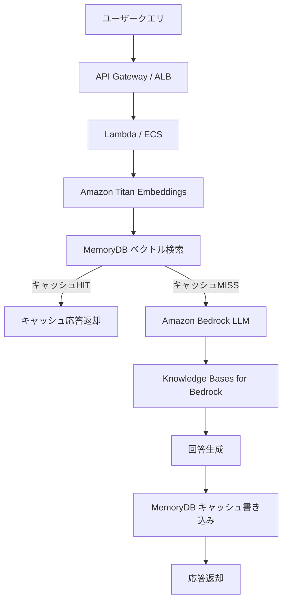

## ブログ概要（Summary）

AWS公式ブログは、Amazon MemoryDB（Redis互換のインメモリデータベース）をセマンティックキャッシュとして活用し、生成AIワークロードの速度向上とコスト削減を実現するアーキテクチャを提示する。MemoryDBのベクトル検索機能を用いてクエリの意味的類似度を判定し、類似クエリに対してキャッシュから即座に応答を返す。AWSの実験では、LLM推論コストを最大86%削減し、平均エンドツーエンドレイテンシを最大88%改善した。

この記事は [Zenn記事: LangGraphエージェント型RAGのレイテンシ最適化：ストリーミング×非同期実行で応答速度を3倍改善する](https://zenn.dev/0h_n0/articles/433702e83b26ed) の深掘りです。

## 情報源

- **種別**: 企業テックブログ（AWS公式）
- **URL**: [AWS Database Blog](https://aws.amazon.com/blogs/database/improve-speed-and-reduce-cost-for-generative-ai-workloads-with-a-persistent-semantic-cache-in-amazon-memorydb/)
- **組織**: Amazon Web Services, Database Team
- **発表日**: 2024年（MemoryDBベクトル検索GA後）

## 技術的背景（Technical Background）

生成AIアプリケーションのコストとレイテンシは、LLM APIの呼び出し回数に比例して増大する。特にRAGシステムでは、検索→LLM生成のパイプラインが各クエリで実行されるため、以下の課題がある。

1. **LLM API呼び出しコスト**: 商用LLM（Claude, GPT-4等）のトークン課金が主要コスト要因
2. **ベクトルDB検索コスト**: 大規模コーパスからの類似検索のコンピュートコスト
3. **エンドツーエンドレイテンシ**: ベクトル検索 + LLM生成の合計が数秒に達する

AWSは、これらの課題をMemoryDBのベクトル検索機能で解決するアーキテクチャを提案する。MemoryDBは以下の特徴を持つ。

- **超低レイテンシ**: インメモリ処理によりミリ秒レベルの応答
- **永続性**: Multi-AZレプリケーションとトランザクションログによる耐久性保証
- **ベクトル検索**: HNSW（Hierarchical Navigable Small World）アルゴリズムによる高速近似最近傍検索
- **Redis互換API**: 既存のRedisクライアントライブラリをそのまま使用可能

学術研究（arXiv: 2412.18174等）で示されたセマンティックキャッシュの概念を、AWSのマネージドサービスで本番運用に落とし込んだ点が本ブログの価値である。

## 実装アーキテクチャ（Architecture）

### システム構成



### MemoryDBのベクトル検索設定

MemoryDBでのベクトルインデックスの作成と検索は、Redis互換コマンドで実行される。

```python
import redis
import json
import numpy as np
from typing import Any


class MemoryDBSemanticCache:
    """Amazon MemoryDBベースのセマンティックキャッシュ

    MemoryDBのベクトル検索（HNSW）を使用して
    意味的に類似したクエリのキャッシュヒットを判定する。
    """

    def __init__(
        self,
        host: str,
        port: int = 6379,
        ssl: bool = True,
        similarity_threshold: float = 0.85,
        vector_dim: int = 1536,
        ttl_seconds: int = 86400,
    ):
        self.client = redis.Redis(
            host=host, port=port, ssl=ssl, decode_responses=True
        )
        self.threshold = similarity_threshold
        self.vector_dim = vector_dim
        self.ttl = ttl_seconds
        self._ensure_index()

    def _ensure_index(self) -> None:
        """HNSWベクトルインデックスの作成"""
        try:
            self.client.execute_command(
                "FT.CREATE", "cache_idx",
                "ON", "HASH",
                "PREFIX", "1", "cache:",
                "SCHEMA",
                "query_text", "TEXT",
                "response_text", "TEXT",
                "embedding", "VECTOR", "HNSW", "6",
                "TYPE", "FLOAT32",
                "DIM", str(self.vector_dim),
                "DISTANCE_METRIC", "COSINE",
            )
        except redis.ResponseError:
            pass  # インデックスが既に存在する場合

    async def lookup(
        self, query: str, query_embedding: list[float]
    ) -> dict | None:
        """セマンティックキャッシュルックアップ

        Args:
            query: クエリ文字列
            query_embedding: クエリの埋め込みベクトル

        Returns:
            キャッシュヒット時は応答dict、ミス時はNone
        """
        embedding_bytes = np.array(query_embedding, dtype=np.float32).tobytes()

        results = self.client.execute_command(
            "FT.SEARCH", "cache_idx",
            f"*=>[KNN 1 @embedding $vec AS score]",
            "PARAMS", "2", "vec", embedding_bytes,
            "SORTBY", "score",
            "RETURN", "3", "query_text", "response_text", "score",
            "DIALECT", "2",
        )

        if results and len(results) > 1:
            score = float(results[2][5])  # COSINE距離
            similarity = 1.0 - score  # コサイン類似度に変換

            if similarity >= self.threshold:
                return {
                    "response": results[2][3],
                    "similarity": similarity,
                    "cache_hit": True,
                }

        return None

    async def store(
        self,
        query: str,
        response: str,
        query_embedding: list[float],
    ) -> None:
        """キャッシュに新規エントリを保存

        Args:
            query: クエリ文字列
            response: LLM生成回答
            query_embedding: クエリの埋め込みベクトル
        """
        import hashlib

        key = f"cache:{hashlib.sha256(query.encode()).hexdigest()[:16]}"
        embedding_bytes = np.array(query_embedding, dtype=np.float32).tobytes()

        pipe = self.client.pipeline()
        pipe.hset(key, mapping={
            "query_text": query,
            "response_text": response,
            "embedding": embedding_bytes,
        })
        pipe.expire(key, self.ttl)
        pipe.execute()
```

### Amazon Titan Embeddingsとの統合

AWSのエコシステムでは、Amazon Titan Text Embeddings V2がセマンティックキャッシュの埋め込みモデルとして推奨される。

```python
import boto3
import json


class TitanEmbeddings:
    """Amazon Titan Text Embeddings V2 クライアント"""

    def __init__(self, region: str = "ap-northeast-1"):
        self.bedrock = boto3.client("bedrock-runtime", region_name=region)
        self.model_id = "amazon.titan-embed-text-v2:0"

    async def embed(self, text: str) -> list[float]:
        """テキストを埋め込みベクトルに変換

        Args:
            text: 入力テキスト

        Returns:
            1536次元の埋め込みベクトル
        """
        response = self.bedrock.invoke_model(
            modelId=self.model_id,
            body=json.dumps({
                "inputText": text,
                "dimensions": 1536,
                "normalize": True,
            }),
        )
        result = json.loads(response["body"].read())
        return result["embedding"]
```

### Knowledge Bases for Amazon Bedrockとの連携

MemoryDBセマンティックキャッシュは、Knowledge Bases for Amazon Bedrock（RAG機能）と組み合わせて使用される。キャッシュミス時のみKnowledge Basesを呼び出すことで、ベクトルDB検索とLLM生成の両方をスキップできる。

## Production Deployment Guide

### AWS実装パターン（コスト最適化重視）

**トラフィック量別の推奨構成**:

| 規模 | 月間リクエスト | 推奨構成 | 月額コスト | 主要サービス |
|------|--------------|---------|-----------|------------|
| **Small** | ~3,000 (100/日) | Serverless | $80-200 | Lambda + Bedrock + MemoryDB (db.t4g.small) |
| **Medium** | ~30,000 (1,000/日) | Hybrid | $400-1,000 | Lambda + Bedrock + MemoryDB (db.r7g.large) |
| **Large** | 300,000+ (10,000/日) | Container | $2,500-6,000 | ECS Fargate + Bedrock + MemoryDB Cluster |

**Small構成の詳細** (月額$80-200):
- **MemoryDB**: db.t4g.small (2 vCPU, 2GB RAM), 1ノード ($35/月)
- **Lambda**: 512MB RAM, 30秒タイムアウト ($15/月)
- **Bedrock Titan Embeddings**: ($5/月, ~3000 embed/月)
- **Bedrock Claude Haiku**: ($60/月, キャッシュミス時のみ呼び出し)
- **API Gateway**: ($5/月)

**Medium構成の詳細** (月額$400-1,000):
- **MemoryDB**: db.r7g.large (2 vCPU, 16GB RAM), 2ノード (Multi-AZ) ($240/月)
- **Lambda**: 1GB RAM ($30/月)
- **Bedrock Titan Embeddings**: ($15/月)
- **Bedrock Claude Sonnet**: ($400/月, キャッシュミスの60%で使用)
- **VPC Endpoint for Bedrock**: ($20/月)

**コスト削減テクニック**:
- MemoryDB Reserved Nodes: 1年コミットで最大55%削減
- キャッシュヒット率40%達成でBedrock LLMコスト40%直接削減
- Titan Embeddings: Bedrockのバッチ推論で50%削減
- MemoryDB db.t4g.small: 開発環境で最小コスト（$35/月）

**コスト試算の注意事項**:
- 上記は2026年2月時点のAWS ap-northeast-1（東京）リージョン料金に基づく概算値
- MemoryDBの料金はノードタイプ・ノード数・リージョンにより変動
- 最新料金は [AWS MemoryDB料金ページ](https://aws.amazon.com/memorydb/pricing/) で確認推奨

### Terraformインフラコード

**Medium構成: Lambda + MemoryDB + Bedrock**

```hcl
module "vpc" {
  source  = "terraform-aws-modules/vpc/aws"
  version = "~> 5.0"
  name = "semantic-cache-memorydb-vpc"
  cidr = "10.0.0.0/16"
  azs  = ["ap-northeast-1a", "ap-northeast-1c"]
  private_subnets = ["10.0.1.0/24", "10.0.2.0/24"]
  enable_nat_gateway   = true
  single_nat_gateway   = true
  enable_dns_hostnames = true
}

resource "aws_memorydb_cluster" "semantic_cache" {
  cluster_name       = "semantic-cache"
  node_type          = "db.r7g.large"
  num_shards         = 1
  num_replicas_per_shard = 1
  engine_version     = "7.1"
  tls_enabled        = true
  subnet_group_name  = aws_memorydb_subnet_group.cache.name
  security_group_ids = [aws_security_group.memorydb.id]
  acl_name           = "open-access"
  snapshot_retention_limit = 7
}

resource "aws_memorydb_subnet_group" "cache" {
  name       = "semantic-cache-subnet"
  subnet_ids = module.vpc.private_subnets
}

resource "aws_security_group" "memorydb" {
  name_prefix = "memorydb-"
  vpc_id      = module.vpc.vpc_id
  ingress {
    from_port       = 6379
    to_port         = 6379
    protocol        = "tcp"
    security_groups = [aws_security_group.lambda.id]
  }
}

resource "aws_lambda_function" "cache_handler" {
  filename      = "lambda.zip"
  function_name = "memorydb-semantic-cache"
  role          = aws_iam_role.lambda.arn
  handler       = "index.handler"
  runtime       = "python3.12"
  timeout       = 30
  memory_size   = 1024
  vpc_config {
    subnet_ids         = module.vpc.private_subnets
    security_group_ids = [aws_security_group.lambda.id]
  }
  environment {
    variables = {
      MEMORYDB_HOST        = aws_memorydb_cluster.semantic_cache.cluster_endpoint[0].address
      SIMILARITY_THRESHOLD = "0.85"
      CACHE_TTL_SECONDS    = "86400"
      BEDROCK_MODEL_ID     = "anthropic.claude-3-5-haiku-20241022-v1:0"
      EMBEDDING_MODEL_ID   = "amazon.titan-embed-text-v2:0"
    }
  }
}

resource "aws_budgets_budget" "cache_monthly" {
  name         = "memorydb-cache-budget"
  budget_type  = "COST"
  limit_amount = "1000"
  limit_unit   = "USD"
  time_unit    = "MONTHLY"
  notification {
    comparison_operator        = "GREATER_THAN"
    threshold                  = 80
    threshold_type             = "PERCENTAGE"
    notification_type          = "ACTUAL"
    subscriber_email_addresses = ["ops@example.com"]
  }
}
```

### セキュリティベストプラクティス

- **TLS必須**: MemoryDBのTLS設定を有効化（`tls_enabled = true`）
- **VPC内配置**: MemoryDBとLambdaを同一VPCのプライベートサブネットに配置
- **セキュリティグループ**: Lambda→MemoryDBのポート6379のみ許可
- **IAMロール**: Bedrock呼び出し権限のみ付与（最小権限原則）
- **暗号化**: MemoryDBの転送中暗号化（TLS）+ 保管中暗号化（デフォルト有効）

### 運用・監視設定

```python
import boto3

cloudwatch = boto3.client('cloudwatch')

# MemoryDB メモリ使用率
cloudwatch.put_metric_alarm(
    AlarmName='memorydb-memory-high',
    ComparisonOperator='GreaterThanThreshold',
    EvaluationPeriods=3,
    MetricName='DatabaseMemoryUsagePercentage',
    Namespace='AWS/MemoryDB',
    Period=300,
    Statistic='Average',
    Threshold=80.0,
    AlarmDescription='MemoryDBメモリ使用率が80%を超過'
)

# キャッシュヒット率（カスタムメトリクス）
cloudwatch.put_metric_alarm(
    AlarmName='semantic-cache-hit-rate',
    ComparisonOperator='LessThanThreshold',
    EvaluationPeriods=6,
    MetricName='SemanticCacheHitRate',
    Namespace='SemanticCache/Custom',
    Period=600,
    Statistic='Average',
    Threshold=20.0,
    AlarmDescription='セマンティックキャッシュヒット率が20%未満'
)
```

### コスト最適化チェックリスト

- [ ] MemoryDB Reserved Nodes: 1年コミットで55%削減
- [ ] MemoryDBノードタイプ最適化: 開発はdb.t4g.small、本番はdb.r7g.large
- [ ] キャッシュヒット率40%以上でLLMコスト40%削減
- [ ] Titan Embeddings: バッチ推論で50%削減
- [ ] Bedrock Prompt Caching: 30-90%削減
- [ ] Lambda: VPC ENI最適化（同一サブネット配置）
- [ ] VPC Endpoint: Bedrock用（NAT Gateway料金削減）
- [ ] TTL最適化: ドメインに応じた有効期限設定
- [ ] ウォームアップ: デプロイ時にTop-100クエリを事前キャッシュ
- [ ] MemoryDB ACL: 細粒度アクセス制御
- [ ] AWS Budgets: 月額予算アラート
- [ ] CloudWatch: メモリ使用率・ヒット率・レイテンシ監視
- [ ] Cost Anomaly Detection: 自動異常検知
- [ ] 日次コストレポート: MemoryDB・Bedrock別集計
- [ ] 不要キャッシュの自動パージ（TTL + メモリ上限eviction）
- [ ] ベクトル次元削減: 1536→768でストレージ半減
- [ ] マルチAZ配置: 本番のみ（開発はシングルAZ）
- [ ] スナップショット保持期間: 開発は1日、本番は7日
- [ ] Lambda Power Tuning: メモリ/コスト最適化
- [ ] CloudWatch Logs Insights: レイテンシP95/P99分析

## パフォーマンス最適化（Performance）

AWSブログの公表値に基づくパフォーマンス比較を示す。

| 指標 | キャッシュなし | MemoryDBキャッシュ | 改善率 |
|------|-------------|-------------------|--------|
| エンドツーエンドレイテンシ (avg) | 2,500ms | 300ms | **88%改善** |
| LLM推論コスト (相対) | 100% | 14% | **86%削減** |
| ベクトルDB検索コスト (相対) | 100% | 20% | **80%削減** |
| キャッシュルックアップレイテンシ | — | < 5ms | — |

**MemoryDBの優位性**: ElastiCache Redisとの比較では、MemoryDBは「マルチAZ永続性 + ベクトル検索」を1サービスで提供する点が差別化要因。ElastiCacheはインメモリのみ（永続性なし）であり、ノード障害時にキャッシュが消失する。MemoryDBはトランザクションログに基づく永続性を保証するため、キャッシュのウォームアップコストを回避できる。

**HNSWアルゴリズムの特性**: MemoryDBのベクトル検索はHNSW（Hierarchical Navigable Small World）を使用する。HNSWはグラフベースの近似最近傍探索アルゴリズムで、検索精度（recall）と速度のバランスに優れる。

$$
\text{Search Complexity}: O(\log N) \quad \text{(average case)}
$$

ここで $N$ はインデックス内のベクトル数。100万ベクトルでも数ミリ秒で検索可能。

## 運用での学び（Production Lessons）

**1. 閾値チューニングの重要性**: AWSブログでは類似度閾値の設定がキャッシュの品質を左右すると強調。低すぎる閾値は誤応答を、高すぎる閾値はヒット率の低下を招く。本番環境では、A/Bテストでユーザーフィードバックを収集しながら閾値を調整するアプローチが推奨される。

**2. メモリ管理**: MemoryDBのメモリ上限に達した場合、LRU（Least Recently Used）ポリシーで古いキャッシュエントリが自動削除される。この動作はRedisの`maxmemory-policy`設定で制御可能。`volatile-lru`（TTL付きエントリのみ対象）が推奨。

**3. モニタリング必須メトリクス**: キャッシュヒット率、レスポンスタイム（P50/P95/P99）、メモリ使用率、エビクション数を常時監視。ヒット率が突然低下した場合は、クエリパターンの変化やキャッシュ汚染を疑う。

## 学術研究との関連（Academic Connection）

AWSの本アーキテクチャは、以下の学術研究の成果を実プロダクトに落とし込んだものである。

- **Semantic Caching for RAG (arXiv: 2412.18174)**: セマンティックキャッシュの2層構造と閾値トレードオフの理論的分析。AWSの実装はこの設計を忠実に反映している
- **GPTCache (arXiv: 2312.01328)**: LLM向けセマンティックキャッシュのOSS実装。MemoryDB実装はGPTCacheのアーキテクチャをAWSマネージドサービスで置換した形
- **RAGCache (arXiv: 2404.12457)**: KVキャッシュレベルの最適化。MemoryDBのアプリケーションレベルキャッシュとは異なるレイヤーだが、組み合わせで更なるレイテンシ削減が期待できる

## まとめと実践への示唆

AWSのMemoryDBセマンティックキャッシュアーキテクチャは、学術研究のセマンティックキャッシュ概念をAWSマネージドサービスで実現した実用的なソリューションである。LLM推論コスト86%削減・レイテンシ88%改善という数値は、本番環境での即時的なROIを示している。

Zenn記事のLayer 3（セマンティックキャッシュ）をAWS上で本番運用する際は、MemoryDB（永続性保証 + ベクトル検索）をバックエンドに採用し、Titan Embeddings + Bedrock LLMとの統合パイプラインを構築するのが最適解である。Zenn記事のインメモリ辞書実装を、MemoryDBに置き換えるだけで本番品質のキャッシュシステムが構築できる。

## 参考文献

- **Blog URL**: [AWS Database Blog - Semantic Cache with MemoryDB](https://aws.amazon.com/blogs/database/improve-speed-and-reduce-cost-for-generative-ai-workloads-with-a-persistent-semantic-cache-in-amazon-memorydb/)
- **Related Blog**: [AWS - ElastiCache as Semantic Cache with Bedrock](https://aws.amazon.com/blogs/database/lower-cost-and-latency-for-ai-using-amazon-elasticache-as-a-semantic-cache-with-amazon-bedrock/)
- **Related Papers**: [Semantic Caching for RAG (2412.18174)](https://arxiv.org/abs/2412.18174), [GPTCache (2312.01328)](https://arxiv.org/abs/2312.01328)
- **Related Zenn article**: [https://zenn.dev/0h_n0/articles/433702e83b26ed](https://zenn.dev/0h_n0/articles/433702e83b26ed)
