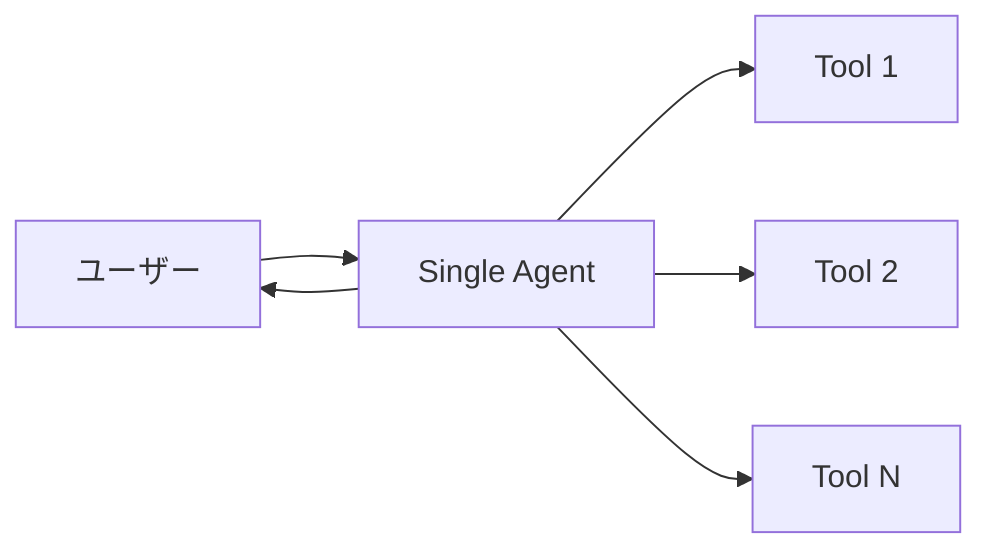
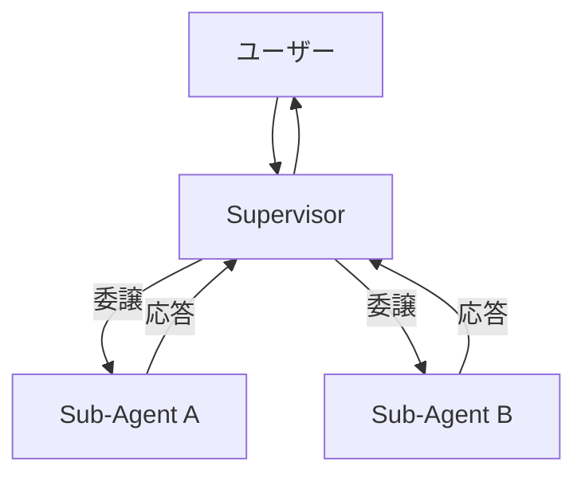
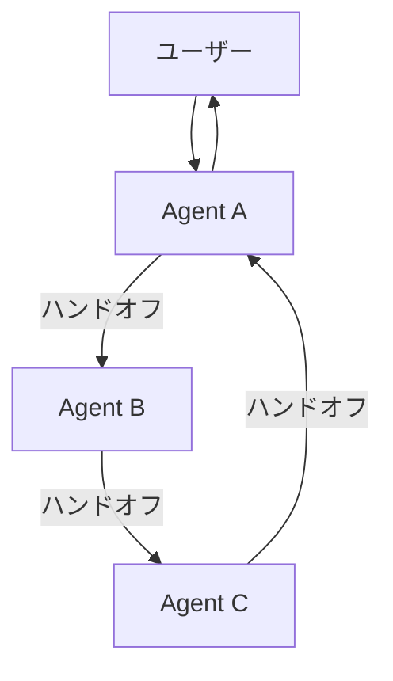

本記事は [https://blog.langchain.com/benchmarking-multi-agent-architectures/](https://blog.langchain.com/benchmarking-multi-agent-architectures/) の解説記事です。

## ブログ概要（Summary）

LangChainチームがτ-bench（ツール利用ベンチマーク）を拡張し、3つの汎用マルチエージェントアーキテクチャ（単一エージェント、Supervisor、Swarm）を定量的に比較評価した結果が報告されている。Swarmが精度面でSupervisorをわずかに上回る一方、Supervisorは最小限の結合度で実装可能であり、スケーラビリティの面で優位であると結論づけている。さらに、Supervisor実装の改善により性能を約50%向上させた具体的手法が公開されている。

この記事は [Zenn記事: create_supervisorで実装するマルチエージェントRAGと社内検索精度2.1倍改善](https://zenn.dev/0h_n0/articles/9677305f7e25d8) の深掘りです。

## 情報源

- **種別**: 企業テックブログ
- **URL**: [LangChain Blog](https://blog.langchain.com/benchmarking-multi-agent-architectures/)
- **組織**: LangChain
- **公開日**: 2025年

## 技術的背景（Technical Background）

マルチエージェントアーキテクチャの選択は、RAGシステムの設計における重要な決定事項である。LangGraph 1.0は`create_supervisor()`と`create_swarm()`の2つのAPIを提供しているが、どちらを選択すべきかの定量的な指針は不足していた。

Zenn記事でも「SupervisorとSwarmの比較」が議論されており、「デバッグ容易性と監査ログの確保が重要」という理由でSupervisorパターンが選択されている。LangChainのこのベンチマークは、その選択の妥当性を定量的に検証する材料を提供している。

## 実装アーキテクチャ（Architecture）

### 評価対象の3アーキテクチャ

**1. 単一エージェント（Single Agent）**

全てのツールと指示を1つのエージェントプロンプトに統合する構成。LangGraphの`create_react_agent`で実装する。



**2. Supervisorアーキテクチャ**

中央のSupervisorが専門サブエージェントにタスクを委譲し、サブエージェントからの応答を受けて制御を戻す構成。`langgraph-supervisor`パッケージで実装する。



**3. Swarmアーキテクチャ**

複数のサブエージェントが相互に認識し合い、直接ハンドオフを行う構成。任意の時点でアクティブなエージェントは1つのみ。`langgraph-swarm`パッケージで実装する。



### ベンチマーク設計

**データセット**: τ-bench（ツール利用ベンチマーク）のretailドメインから最初の100例を使用。著者らは6つの合成ドメイン（ホーム改善、テックサポート、薬局、自動車、レストラン、Spotify管理）を追加し、各19ツールのディストラクタとして配置している。

**評価軸**:
- タスク完了スコア（精度）
- トークン消費量（コスト効率）

**モデル**: GPT-4o（全実験で統一）

**ディストラクタの効果**: ディストラクタドメインを増やすことで、エージェントが無関係なコンテキストをどの程度適切に無視できるかを評価する。

## パフォーマンス最適化（Performance）

### 精度の比較

ブログの報告によると、以下の傾向が観察されている。

1. **単一エージェント**: ディストラクタドメインが2つ以上になると性能が急激に低下する。コンテキスト内のノイズが増えるためである
2. **Swarm**: Supervisorを全シナリオでわずかに上回る
3. **Supervisor**: Swarmに次ぐ性能。ただし改善後は差が縮小

性能差の原因について、LangChainチームは「情報の翻訳（translation）ロス」を指摘している。Supervisorがサブエージェントの応答を受け取り、ユーザーに再伝達する際に情報が劣化する問題である。

### トークン効率の比較

ブログの記述によると、「single agent uses consistently more tokens as the number of distractor domains grows, while supervisor and swarm remain flat」とされている。

| アーキテクチャ | トークン消費の傾向 |
|-------------|-----------------|
| 単一エージェント | ディストラクタ増加に比例して増加 |
| Supervisor | ほぼ一定（ただしSwarmより多い） |
| Swarm | ほぼ一定（最も効率的） |

Supervisorがswarmより多くトークンを消費する理由は、Supervisorがサブエージェントの応答を「翻訳」して再生成するオーバーヘッドにある。

### Supervisor実装の改善（性能50%向上）

LangChainチームは、初期のSupervisor実装が大幅に性能不足であったことを報告し、以下の3つの改善で「nearly 50% increase in performance」を達成したと述べている。

**改善1: ハンドオフメッセージの除去**

Supervisorのルーティングロジックをサブエージェントのコンテキストから除去する。サブエージェントは自身のタスクに集中でき、不要な情報によるプロンプト汚染を防止する。

**改善2: Forward Messageメカニズムの追加**

`forward_message`ツールを追加し、サブエージェントの応答をSupervisorが再生成せずにユーザーに直接転送可能にする。これにより「翻訳ロス」を解消する。

```python
@tool
def forward_message(message: str) -> str:
    """サブエージェントの応答をユーザーに直接転送する。

    Supervisorが再生成するのではなく、原文をそのまま渡す。
    """
    return message
```

**改善3: ツール命名の最適化**

ハンドオフツールの名前（`delegate_to_<agent>`等）を変更し、LLMがより正確にルーティングを判断できるようにする。

### Zenn記事への適用

これらの改善は、Zenn記事のcreate_supervisor()実装に直接適用可能である。

1. **改善1の適用**: Supervisorプロンプトの「以下の手順でエージェントを指揮してください」をサブエージェントのプロンプトから除去する
2. **改善2の適用**: Synthesizerの回答をSupervisorが再生成せず、そのままユーザーに転送する`output_mode="last_message"`設定（Zenn記事では既に採用済み）
3. **改善3の適用**: エージェント名を`query_analyzer`ではなく、より説明的な名前（例: `analyze_user_query`）にすることで、Supervisorのルーティング精度が向上する可能性がある

## 運用での学び（Production Lessons）

### アーキテクチャ選択のトレードオフ

ブログでは以下のトレードオフが整理されている。

| 観点 | 単一エージェント | Supervisor | Swarm |
|------|--------------|-----------|-------|
| **実装容易性** | 最も簡単 | 中程度 | 最も複雑 |
| **結合度** | N/A | **最低**（サブエージェント間の依存なし） | 高い（全エージェントが全ピアを認識） |
| **モジュラリティ** | 低い | **高い**（独立した更新・並列処理） | 中程度 |
| **スケーラビリティ** | 低い（コンテキスト劣化） | **高い** | 中程度 |
| **精度** | 低い（多コンテキスト時） | 中程度 | **最も高い** |

**結論**: LangChainチームは、Supervisorパターンが「最も少ない仮定で実装可能」であり、サードパーティエージェントとの統合に最も適していると位置づけている。Swarmは精度面でわずかに優位だが、全エージェントが全ピアを知っている必要がある結合度の高さが、大規模システムでのスケーラビリティを制限する。

### 将来の展望

ブログでは「generic architectures will gain adoption as models improve」と述べられており、LLMの能力向上に伴い、汎用的なマルチエージェントアーキテクチャの採用が進むと予測している。特にSupervisorパターンは、モデルの推論能力が向上するにつれ、ルーティング精度の改善が期待される。

## 学術研究との関連（Academic Connection）

- **τ-bench [Yao et al., 2024]**: ツール利用タスクのベンチマーク。LangChainチームはこれを拡張し、ディストラクタドメインを追加して評価の難度を向上
- **Agentic RAG Survey [Singh et al., 2025]**: Multi-Agent RAGの3アーキテクチャ分類（Single/Multi/Hierarchical）と整合する評価
- **CITER [Stival et al., 2025]**: 3役割マルチエージェントRAGの実装。CITERはSupervisorを持たないが、本ベンチマークのSwarmとSupervisorの中間的な設計

## まとめと実践への示唆

LangChainのベンチマークから得られる実践的な示唆は以下の通りである。

1. **Supervisorパターンの選択は妥当**: Zenn記事の選択は、デバッグ容易性・監査ログ・モジュラリティの観点で合理的。精度面のわずかな劣位は、Forward Messageメカニズム等の改善で縮小可能
2. **ディストラクタへの耐性が重要**: 社内ナレッジ検索では検索対象が多岐にわたるため、ディストラクタドメインに対するロバスト性が求められる。マルチエージェント構成は単一エージェントより優位
3. **実装の改善が性能差に直結**: アーキテクチャの選択以上に、具体的な実装（ハンドオフメッセージの処理、Forward Message、ツール命名）が性能に大きく影響する

## 参考文献

- **Blog URL**: [https://blog.langchain.com/benchmarking-multi-agent-architectures/](https://blog.langchain.com/benchmarking-multi-agent-architectures/)
- **langgraph-supervisor**: [https://github.com/langchain-ai/langgraph-supervisor-py](https://github.com/langchain-ai/langgraph-supervisor-py)
- **langgraph-swarm**: [https://github.com/langchain-ai/langgraph-swarm-py](https://github.com/langchain-ai/langgraph-swarm-py)
- **Related Zenn article**: [https://zenn.dev/0h_n0/articles/9677305f7e25d8](https://zenn.dev/0h_n0/articles/9677305f7e25d8)
