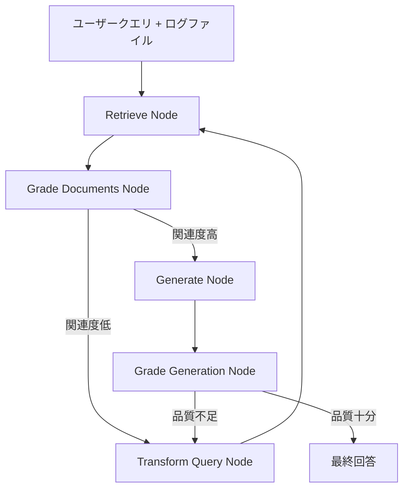

本記事は [https://developer.nvidia.com/blog/build-a-log-analysis-multi-agent-self-corrective-rag-system-with-nvidia-nemotron/](https://developer.nvidia.com/blog/build-a-log-analysis-multi-agent-self-corrective-rag-system-with-nvidia-nemotron/) の解説記事です。

## ブログ概要（Summary）

NVIDIAが公開したこの技術ブログでは、LangGraphの有向グラフベースのワークフローを用いて、ログ解析に特化したマルチエージェント自己修正型RAGシステムの設計と実装が紹介されている。本システムはBM25とFAISSベクトル検索のハイブリッド検索、NVIDIAのNemotronモデル群（Embedding/Reranking/生成）を組み合わせ、検索結果の品質が不十分な場合にクエリを自動変換して再検索する自己修正ループを備えている。

この記事は [Zenn記事: create_supervisorで実装するマルチエージェントRAGと社内検索精度2.1倍改善](https://zenn.dev/0h_n0/articles/9677305f7e25d8) の深掘りです。

## 情報源

- **種別**: 企業テックブログ
- **URL**: [NVIDIA Developer Blog](https://developer.nvidia.com/blog/build-a-log-analysis-multi-agent-self-corrective-rag-system-with-nvidia-nemotron/)
- **組織**: NVIDIA
- **公開日**: 2025年

## 技術的背景（Technical Background）

大規模分散システムのログ解析は、DevOps・SREチームにとって最も時間を消費するタスクの一つである。従来のログ解析ツール（Splunk、Datadog等）はキーワード検索とパターンマッチングに依存しており、「なぜこのタイムアウトが発生したか」といった因果関係の推論には対応できない。

NVIDIAはこの課題に対し、LLMベースのRAGシステムをログ解析に適用するアプローチを採用している。単純なRAGではログの構造的特性（タイムスタンプ、ログレベル、サービス名の混在）に対応しきれないため、マルチエージェント構成と自己修正ループを導入し、検索精度と回答品質の両方を担保する設計となっている。

Zenn記事で紹介されているcreate_supervisorによるマルチエージェントRAGと共通する課題（ハイブリッド検索、リランキング、品質評価）に対し、NVIDIAの実装は自社モデル群を活用した具体的なアーキテクチャを提示している。

## 実装アーキテクチャ（Architecture）

### システム全体構成

ブログで紹介されているシステムは、LangGraphの有向グラフで以下の5つのノードを接続する構造を取る。



### コンポーネント構成

NVIDIAは各コンポーネントを独立したファイルに分離し、責務を明確化している。

| コンポーネント | ファイル | 機能 |
|-------------|---------|------|
| ワークフローグラフ | `bat_ai.py` | LangGraphによる状態遷移の定義 |
| エージェントノード | `graphnodes.py` | 検索、リランキング、評価、生成、クエリ変換 |
| エッジロジック | `graphedges.py` | 条件分岐のルーティング判定 |
| ハイブリッド検索 | `multiagent.py` | BM25 + FAISSの二重検索 |
| 出力スキーマ | `binary_score_models.py` | 評価結果の構造化 |

### ハイブリッド検索の実装

ブログで紹介されているハイブリッド検索は、BM25（語彙マッチング）とFAISSベクトルストア（セマンティック検索）の2つの検索戦略を並列実行する。

**BM25 Retriever**: ログに頻出するエラーコード、サービス名、IPアドレスなどの正確なキーワードマッチングに対応する。ログ解析では `ERROR 502`、`connection_timeout`、`service_name=auth-api` のような具体的なトークンの一致が重要であり、BM25はこの要件に適している。

**FAISS Vector Store**: NVIDIA NeMo Retriever Embeddings（`llama-3.2-nv-embedqa-1b-v2`）を用いたセマンティック検索で、「タイムアウトの原因」のような概念的な質問に対応する。

ブログでは「balances precision and recall, ensuring both keyword matches and semantically related log snippets are captured」と述べられており、語彙的精度とセマンティック網羅性の両立がハイブリッド検索の設計意図である。

### 3つのNVIDIA AIモデルの役割

| モデル | パラメータ | 役割 |
|-------|-----------|------|
| `llama-3.2-nv-embedqa-1b-v2` | 1B | ログチャンクのEmbedding生成 |
| `llama-3.2-nv-rerankqa-1b-v2` | 1B | 検索結果のリランキング |
| `nvidia/llama-3.3-nemotron-super-49b-v1.5` | 49B | 回答生成（推論・要約） |

Embedding/Rerankingに小規模モデル（各1B）を使用し、回答生成にのみ大規模モデル（49B）を使用する構成は、コスト効率とレイテンシの最適化を意識した設計である。Zenn記事ではClaude Sonnet 4.6を全エージェントに使用しているが、NVIDIAのアプローチではタスクの複雑度に応じたモデルサイズの使い分けが実践されている。

### 自己修正ループ

本システムの特徴的な機能として、検索結果と生成結果の品質を自動評価し、不十分な場合にクエリを変換して再検索する自己修正ループがある。

**Grade Documents Node**: 検索結果の各ドキュメントについて、クエリとの関連度を二値スコア（relevant/not_relevant）で評価する。`binary_score_models.py`で定義された構造化出力を用いる。

**Grade Generation Node**: 生成された回答について、(1)検索ドキュメントとの整合性（Faithfulness）と(2)クエリへの回答性（Answer Relevancy）を評価する。

**Transform Query Node**: 品質が不十分と判定された場合、`prompt.json`に定義されたプロンプトテンプレートに基づき、ユーザーの元のクエリを言い換え・拡張して再検索を実行する。

この自己修正パターンは、Zenn記事のRerankerエージェントが「スコアが0.3未満のドキュメントを除外」する品質フィルタリングと同様の設計思想に基づいている。ただし、NVIDIAの実装ではフィルタリングだけでなく、クエリ自体の変換による積極的な検索改善を行っている点が異なる。

## パフォーマンス最適化（Performance）

### レイテンシ構成

ブログでは具体的な数値は公開されていないが、アーキテクチャから推定されるレイテンシ構成は以下の通りである。

| 処理 | 推定レイテンシ |
|------|-------------|
| BM25検索 | ~50ms |
| FAISS検索 | ~100ms |
| Rerankingモデル推論 | ~200ms |
| Nemotron 49B生成 | ~2-5秒 |
| **合計（1ラウンド）** | **~3-6秒** |

自己修正ループが発動した場合は、追加の検索ラウンド分のレイテンシが加算される。

### スケーリング戦略

- **Embedding/Reranking**: 1Bモデルのため、T4/L4 GPUで高スループットが期待できる
- **生成モデル（49B）**: A100/H100 GPUが推奨される。NVIDIA NIM Microservicesを利用すれば、推論最適化（TensorRT-LLM）が自動適用される
- **ベクトルストア**: FAISSのHNSWインデックスは、100万ログチャンク規模でもミリ秒単位の検索が可能

## 運用での学び（Production Lessons）

### ログ解析特有の課題

1. **構造化データと非構造化データの混在**: ログにはJSON形式の構造化データと自由テキストのエラーメッセージが混在する。チャンキング戦略はログエントリ単位（タイムスタンプ区切り）を基本とし、マルチラインスタックトレースは連結して1チャンクとして扱うことが推奨される

2. **時系列の文脈依存性**: ログは時系列データであるため、前後のイベントの文脈が重要となる。オーバーラップありのチャンキング（前後のログエントリを含める）が有効である

3. **ドメイン固有語彙**: サービス名、エラーコード、環境変数名などのドメイン固有語彙が多いため、BM25のTermFrequencyが高い効果を発揮する。Dense検索のみではこれらの正確なマッチングが困難であり、ハイブリッド検索の必要性が裏付けられる

### 対象ユースケース

ブログでは以下のチームを主要ユーザーとして想定している。

- **QAチーム**: テスト結果のログ要約、テストフレイキネス（不安定テスト）の検出
- **DevOpsエンジニア**: クロスサービスのログ相関分析
- **CloudOpsチーム**: 分散システムのログ集約分析
- **Observabilityリード**: 生ログダンプに替わるアクション可能な要約の生成

## 学術研究との関連（Academic Connection）

NVIDIAの実装は、以下の学術研究の成果を実用化したものと位置づけられる。

- **Self-RAG [2310.11511]**: Asaiらが提案した反省トークンによる自己批評型RAGの概念を、LangGraphのCondition Edgeによる品質ゲーティングとして実装している
- **CRAG [2401.15884]**: Yanらが提案した修正型RAG（Corrective RAG）のクエリ変換パターンを、`transform_query`ノードとして実装している
- **Hybrid Search [RRF]**: Cormackら（2009）のReciprocal Rank Fusionアルゴリズムに基づくBM25+Dense検索の統合

Zenn記事で紹介されているcreate_supervisorパターンとの主な違いは、NVIDIAの実装が明示的なスーパーバイザーエージェントを持たず、LangGraphのCondition Edgeによる状態遷移ベースの制御を採用している点である。これはデバッグ容易性とパイプラインの予測可能性を重視した設計判断である。

## Production Deployment Guide

### AWS実装パターン（コスト最適化重視）

**トラフィック量別の推奨構成**:

| 規模 | 月間リクエスト | 推奨構成 | 月額コスト | 主要サービス |
|------|--------------|---------|-----------|------------|
| **Small** | ~3,000 (100/日) | Serverless | $100-250 | Lambda + Bedrock + OpenSearch Serverless |
| **Medium** | ~30,000 (1,000/日) | Hybrid | $600-1,500 | ECS Fargate + OpenSearch + ElastiCache |
| **Large** | 300,000+ (10,000/日) | Container | $3,000-7,000 | EKS + g5.xlarge + OpenSearch |

**Small構成の詳細** (月額$100-250):
- **Lambda**: 2GB RAM, 120秒タイムアウト ($30/月)
- **Bedrock**: Claude 3.5 Haiku ($100/月)
- **OpenSearch Serverless**: ハイブリッド検索用 ($30/月)
- **S3**: ログファイルストレージ ($5/月)
- **CloudWatch**: 監視 ($5/月)

**コスト試算の注意事項**:
- 上記は2026年2月時点のAWS ap-northeast-1（東京）リージョン料金に基づく概算値です
- NVIDIAモデルの代わりにBedrock/SageMakerを使用する場合のコストです
- NVIDIA NIMを使用する場合は、EC2 GPU Instancesのコストが追加されます
- 最新料金は [AWS料金計算ツール](https://calculator.aws/) で確認してください

### Terraformインフラコード

**Small構成 (Serverless)**:

```hcl
module "vpc" {
  source  = "terraform-aws-modules/vpc/aws"
  version = "~> 5.0"

  name = "log-rag-vpc"
  cidr = "10.0.0.0/16"
  azs  = ["ap-northeast-1a", "ap-northeast-1c"]
  private_subnets = ["10.0.1.0/24", "10.0.2.0/24"]

  enable_nat_gateway   = false
  enable_dns_hostnames = true
}

resource "aws_iam_role" "lambda_log_rag" {
  name = "log-rag-lambda-role"
  assume_role_policy = jsonencode({
    Version = "2012-10-17"
    Statement = [{
      Action    = "sts:AssumeRole"
      Effect    = "Allow"
      Principal = { Service = "lambda.amazonaws.com" }
    }]
  })
}

resource "aws_iam_role_policy" "bedrock_opensearch" {
  role = aws_iam_role.lambda_log_rag.id
  policy = jsonencode({
    Version = "2012-10-17"
    Statement = [
      {
        Effect   = "Allow"
        Action   = ["bedrock:InvokeModel"]
        Resource = "arn:aws:bedrock:ap-northeast-1::foundation-model/anthropic.claude-3-5-haiku*"
      },
      {
        Effect   = "Allow"
        Action   = ["aoss:APIAccessAll"]
        Resource = "*"
      }
    ]
  })
}

resource "aws_lambda_function" "log_rag" {
  filename      = "lambda.zip"
  function_name = "log-rag-handler"
  role          = aws_iam_role.lambda_log_rag.arn
  handler       = "index.handler"
  runtime       = "python3.12"
  timeout       = 120
  memory_size   = 2048

  environment {
    variables = {
      OPENSEARCH_ENDPOINT = "https://xxx.aoss.ap-northeast-1.amazonaws.com"
      BEDROCK_MODEL_ID    = "anthropic.claude-3-5-haiku-20241022-v1:0"
    }
  }
}

resource "aws_cloudwatch_metric_alarm" "log_rag_errors" {
  alarm_name          = "log-rag-error-rate"
  comparison_operator = "GreaterThanThreshold"
  evaluation_periods  = 2
  metric_name         = "Errors"
  namespace           = "AWS/Lambda"
  period              = 300
  statistic           = "Sum"
  threshold           = 5
  alarm_description   = "Lambda エラー率異常"
  dimensions = {
    FunctionName = aws_lambda_function.log_rag.function_name
  }
}
```

### セキュリティベストプラクティス

- **ログデータの暗号化**: S3保管時はKMS暗号化、転送時はTLS 1.2+
- **IAM最小権限**: Bedrock InvokeModelとOpenSearch APIアクセスのみ許可
- **ログ内のPII検出**: Amazon Comprehendによる個人情報の自動マスキングを推奨
- **VPCエンドポイント**: Bedrock/OpenSearchへのアクセスはVPCエンドポイント経由

### コスト最適化チェックリスト

- [ ] OpenSearch Serverlessのコレクション数を最小化（1コレクション/$25/月）
- [ ] Bedrock Prompt Cachingでシステムプロンプトのコスト削減
- [ ] 自己修正ループの最大ラウンド数を2-3に制限（コスト制御）
- [ ] ログの前処理（不要行の除外）でインデックスサイズを削減
- [ ] 開発環境ではBedrock Haiku、本番ではSonnetのモデルルーティング

## まとめと実践への示唆

NVIDIAのログ解析マルチエージェントRAGシステムは、BM25+Dense検索のハイブリッド構成、タスク別のモデルサイズ最適化、自己修正ループによる品質保証という3つの設計原則を示している。特に、Embedding/Rerankingに小規模モデル（1B）を使用し、生成にのみ大規模モデル（49B）を適用するコスト最適化パターンは、Zenn記事のCreate Supervisor実装にも直接応用可能な知見である。

GitHubリポジトリ（`NVIDIA/GenerativeAIExamples`）でソースコードが完全公開されており、`python example.py --log-file /path/to/your.log --question "What caused the timeout errors?"` で即座に実行可能である。

## 参考文献

- **Blog URL**: [https://developer.nvidia.com/blog/build-a-log-analysis-multi-agent-self-corrective-rag-system-with-nvidia-nemotron/](https://developer.nvidia.com/blog/build-a-log-analysis-multi-agent-self-corrective-rag-system-with-nvidia-nemotron/)
- **GitHub**: [https://github.com/NVIDIA/GenerativeAIExamples/tree/main/community/log_analysis_multi_agent_rag](https://github.com/NVIDIA/GenerativeAIExamples/tree/main/community/log_analysis_multi_agent_rag)
- **Related Zenn article**: [https://zenn.dev/0h_n0/articles/9677305f7e25d8](https://zenn.dev/0h_n0/articles/9677305f7e25d8)
