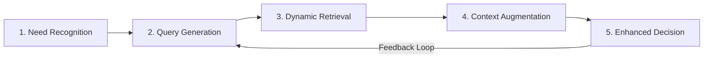
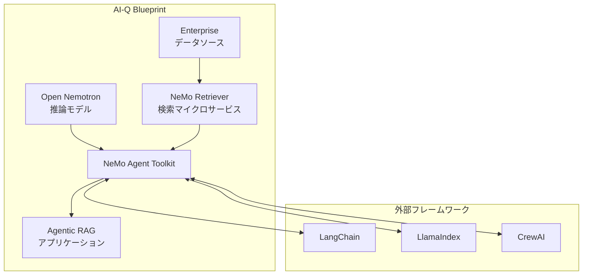

## ブログ概要（Summary）

NVIDIAが公開したテックブログ「Traditional RAG vs. Agentic RAG」（Sessions, 2025）は、従来のRAGが抱える「1回検索→1回生成」の限界を明確にし、AIエージェントがRAGを動的なツールとして活用する**Agentic RAG**の5段階ワークフローを体系化しています。さらに、NVIDIA AI-Q Blueprintというオープンソース参照アーキテクチャと、NeMo Retrieverマイクロサービスの性能指標（検索速度15倍、精度50%向上、ストレージ効率35倍）を提示し、エンタープライズRAGの実装ガイドラインを示しています。

この記事は [Zenn記事: LangGraph×Claude Sonnet 4.6で実装する階層的Agentic RAG検索パイプライン](https://zenn.dev/0h_n0/articles/a4cd3a7f1cf4ce) の深掘りです。

## 情報源

- **種別**: 企業テックブログ
- **URL**: [https://developer.nvidia.com/blog/traditional-rag-vs-agentic-rag-why-ai-agents-need-dynamic-knowledge-to-get-smarter/](https://developer.nvidia.com/blog/traditional-rag-vs-agentic-rag-why-ai-agents-need-dynamic-knowledge-to-get-smarter/)
- **組織**: NVIDIA（Product Marketing, Agentic AI Software）
- **著者**: Nicola Sessions
- **発表日**: 2025年7月21日（最終更新: 2025年12月27日）

## 技術的背景（Technical Background）

LLMは事前学習データに基づいて応答を生成するため、学習後に発生した情報（最新のAPI仕様、企業固有のドキュメント、リアルタイムのマーケットデータ等）にアクセスできません。この問題に対してRAG（Retrieval-Augmented Generation）が広く採用されていますが、NVIDIAは従来のRAGが以下の4つの構造的限界を持つと指摘します。

1. **ハルシネーション**: 学習データに存在しない情報を「もっともらしく」生成
2. **陳腐化（Stale Information）**: 知識カットオフ以降の情報を取得できない
3. **知識ギャップ**: 特定ドメイン（企業内文書、最新論文）の情報が欠落
4. **セキュリティ脆弱性**: 外部データソースへのアクセス制御が不十分

従来のRAG（Traditional RAG）は「クエリ→検索→生成」の単一パスで動作し、検索結果の品質評価や再検索の仕組みを持ちません。Zenn記事で実装した階層的検索パイプラインが解決しようとしている課題と完全に一致します。

$$
a_{\text{traditional}} = \text{LLM}(q \oplus \text{Retrieve}(q, \mathcal{D}))
$$

この単純な構成では、検索クエリ$q$が曖昧な場合やドキュメントコーパス$\mathcal{D}$が大規模な場合に、検索精度が著しく低下します。

## 実装アーキテクチャ（Architecture）

### Agentic RAGの5段階ワークフロー

NVIDIAが定義するAgentic RAGワークフローは、以下の5段階で構成されます。



**Stage 1: Agent Need Recognition（情報必要性の認識）**

AIエージェントがタスク遂行に「現在の知識では不十分」と判断するステップです。Zenn記事の`should_continue`関数（iteration_countによる制御）がこのステップに対応します。エージェントは検索結果の充足度を評価し、追加検索が必要かを自律的に判断します。

**Stage 2: Query Generation（クエリ生成）**

エージェントが具体的な検索クエリを生成します。単純なキーワード抽出ではなく、タスクのコンテキストを考慮した**意図ベースのクエリ生成**が特徴です。Zenn記事のClaude Sonnet 4.6による検索ツール選択（`keyword_search` / `semantic_search` / `chunk_read`）は、まさにこのステップの実装です。

**Stage 3: Dynamic Knowledge Retrieval（動的知識検索）**

AIクエリエンジンが、テキスト・画像・音声・構造化データを横断して検索します。NVIDIAはこのステップに4つの能力を要求します。

| 能力 | 説明 | Zenn記事での対応 |
|-----|------|----------------|
| **大規模データ処理** | 膨大な公開/非公開データの取り込み | FAISS + BM25のハイブリッド検索 |
| **高精度検索** | マルチモーダル埋め込み、ベクトル検索、リランキング | `semantic_search` + `keyword_search` |
| **継続学習** | フィードバックループによる改善 | `search_history`による重複排除 |
| **曖昧クエリ解釈** | 自然言語クエリの意図解釈 | Claude Sonnet 4.6のadaptive thinking |

**Stage 4: Context Augmentation（コンテキスト拡張）**

検索結果をエージェントの現在のプロンプトに統合し、拡張されたコンテキストを生成します。

$$
\text{Context}_{\text{augmented}} = \text{Prompt}_{\text{original}} \oplus \text{Rerank}(\text{Retrieve}(q, \mathcal{D}_1, \mathcal{D}_2, \ldots, \mathcal{D}_n))
$$

ここで$\mathcal{D}_1, \ldots, \mathcal{D}_n$は複数のデータソース（ベクトルDB、構造化DB、Web等）を表します。

**Stage 5: Enhanced Decision-Making（強化された意思決定）**

LLMが拡張コンテキストに基づいて応答を生成し、必要に応じてフィードバックループでStage 2に戻ります。この反復プロセスが、Agentic RAGと従来RAGの決定的な違いです。

### Traditional RAG vs Agentic RAG: 構造的比較

| 特性 | Traditional RAG | Agentic RAG |
|-----|----------------|------------|
| **処理フロー** | 単一パス（検索→生成） | 反復ループ（計画→検索→評価→精錬） |
| **検索戦略** | 固定（1回の検索） | 動的（複数回、複数ソース） |
| **クエリ生成** | ユーザークエリをそのまま使用 | エージェントが意図ベースで生成 |
| **品質制御** | なし | 自己批評と再検索 |
| **レイテンシ** | 低（1回のAPI呼び出し） | 高（複数回の反復） |
| **適用場面** | 単純なFAQ、キーワード検索 | 研究、要約、コード修正、マルチホップ推論 |

### NVIDIA AI-Q Blueprint

NVIDIAが提供するAI-Q Blueprintは、Agentic RAGを実装するためのオープンソース参照アーキテクチャです。



**コンポーネント構成**:

- **Open Nemotron**: Llama、Mistral、Qwenベースのマルチモーダル推論モデル群
- **NeMo Retriever**: GPU最適化された検索マイクロサービス（埋め込み、リランキング、データ抽出）
- **NeMo Agent Toolkit**: エージェント構築のためのオープンソースライブラリ
- **ChatNVIDIA**: LangChain連携コネクタ

### NeMo Retrieverの性能指標

NVIDIAが公表するNeMo Retrieverのベンチマーク結果は以下の通りです。

| 指標 | 改善率 | 意味 |
|-----|--------|------|
| **検索速度** | 最大15倍高速化 | GPU最適化による埋め込み・リランキングの高速化 |
| **検索精度** | 50%向上 | マルチモーダル埋め込みとリランキングの組み合わせ |
| **ストレージ効率** | 35倍改善 | ベクトル量子化とインデックス最適化 |

これらの数値は、NVIDIAアクセラレータ上でのベンチマークに基づく公称値であり、ワークロードやデータ特性により変動します。

## Agentic RAGの8つの利点

NVIDIAブログは、Agentic RAGの利点を8つに整理しています。

1. **精度向上（Improved Accuracy）**: 検証済みの最新データと推論ベースのクエリ精錬
2. **リアルタイム性（Real-time Relevance）**: 最新情報への動的アクセス
3. **文脈理解の強化（Enhanced Contextual Understanding）**: マルチステップ推論による深い理解
4. **適応性（Greater Adaptability）**: タスクに応じた検索戦略の動的切り替え
5. **ハルシネーション低減（Reduced Hallucinations）**: 外部の検証可能なデータソースの活用
6. **スケーラブルな知識（Scalable Knowledge）**: 継続的に拡張可能な知識ベース
7. **マルチモーダル対応（Multimodality）**: テキスト、画像、音声、グラフの横断検索
8. **セキュリティ強化（Enhanced Security）**: 一元化された権限管理とキュレーションされたデータソース

Zenn記事の階層的検索パイプラインは、特に1（精度向上）・4（適応性）・5（ハルシネーション低減）に直接対応します。Claude Sonnet 4.6のadaptive thinkingによる検索ツール選択は、NVIDIAが「Greater Adaptability」と呼ぶ特性の実装例です。

## LangGraphでの実装パターン

NVIDIAブログの5段階ワークフローをLangGraphで実装する場合の設計パターンを示します。

```python
from langgraph.graph import StateGraph, END
from typing import TypedDict, Annotated, Literal

class AgenticRAGState(TypedDict):
    """Agentic RAGの状態管理"""
    query: str
    search_history: list[str]         # Stage 2: 生成済みクエリ
    retrieved_docs: list[dict]        # Stage 3: 検索結果
    augmented_context: str            # Stage 4: 拡張コンテキスト
    answer: str                       # Stage 5: 最終回答
    iteration_count: int              # フィードバックループ制御
    need_more_info: bool              # Stage 1: 情報必要性フラグ

def need_recognition(state: AgenticRAGState) -> AgenticRAGState:
    """Stage 1: 情報必要性の判断"""
    # エージェントが現在のコンテキストで回答可能かを評価
    # Claude Sonnet 4.6のadaptive thinkingで判断
    ...

def query_generation(state: AgenticRAGState) -> AgenticRAGState:
    """Stage 2: 意図ベースのクエリ生成"""
    # search_historyを参照して重複を排除
    # サブクエリ分解（Smart RAGパターン）
    ...

def dynamic_retrieval(state: AgenticRAGState) -> AgenticRAGState:
    """Stage 3: 動的知識検索"""
    # keyword_search / semantic_search / chunk_read を適応的に選択
    ...

def context_augmentation(state: AgenticRAGState) -> AgenticRAGState:
    """Stage 4: コンテキスト拡張"""
    # 検索結果をリランキングしてプロンプトに統合
    ...

def enhanced_decision(state: AgenticRAGState) -> AgenticRAGState:
    """Stage 5: 強化された意思決定"""
    # 拡張コンテキストに基づいて回答生成
    # 回答品質を自己評価し、need_more_infoを設定
    ...

MAX_ITERATIONS = 5

def should_continue(state: AgenticRAGState) -> Literal["query_generation", "end"]:
    """フィードバックループの制御"""
    if state["iteration_count"] >= MAX_ITERATIONS:
        return "end"
    if state["need_more_info"]:
        return "query_generation"
    return "end"

# StateGraph構築
graph = StateGraph(AgenticRAGState)
graph.add_node("need_recognition", need_recognition)
graph.add_node("query_generation", query_generation)
graph.add_node("dynamic_retrieval", dynamic_retrieval)
graph.add_node("context_augmentation", context_augmentation)
graph.add_node("enhanced_decision", enhanced_decision)

graph.set_entry_point("need_recognition")
graph.add_edge("need_recognition", "query_generation")
graph.add_edge("query_generation", "dynamic_retrieval")
graph.add_edge("dynamic_retrieval", "context_augmentation")
graph.add_edge("context_augmentation", "enhanced_decision")
graph.add_conditional_edges("enhanced_decision", should_continue)

app = graph.compile()
```

このパターンは、Zenn記事のLangGraph実装を拡張する形でNVIDIAの5段階ワークフローを忠実に再現しています。`search_history`による重複排除と`iteration_count`による安全弁は、NVIDIAが推奨する「継続学習」と「フィードバックループ」の実装です。

## Production Deployment Guide

### AWS実装パターン（コスト最適化重視）

NVIDIAのAI-Q Blueprintをベースに、AWSでAgentic RAGパイプラインをデプロイする構成を示します。

**Small構成（〜100 req/日）: Serverless**

| サービス | 用途 | 月額概算 |
|---------|------|---------|
| Lambda | エージェントロジック | $5-15 |
| Bedrock (Claude) | LLM推論 | $30-80 |
| OpenSearch Serverless | ベクトル検索 | $30-50 |
| DynamoDB | 状態管理 | $5-10 |
| **合計** | | **$70-155** |

**Medium構成（〜1,000 req/日）: ECS Fargate**

| サービス | 用途 | 月額概算 |
|---------|------|---------|
| ECS Fargate | エージェント + 検索サービス | $150-300 |
| Bedrock (Claude) | LLM推論 | $200-500 |
| OpenSearch | ベクトル検索 + BM25 | $100-200 |
| ElastiCache Redis | セッション + キャッシュ | $50-100 |
| **合計** | | **$500-1,100** |

**Large構成（10,000+ req/日）: EKS + GPU**

| サービス | 用途 | 月額概算 |
|---------|------|---------|
| EKS + Karpenter | オーケストレーション | $300-500 |
| g5.xlarge Spot | 埋め込み + リランキング | $400-800 |
| Bedrock (Claude) | LLM推論 | $2,000-4,000 |
| OpenSearch (3ノード) | 分散ベクトル検索 | $500-1,000 |
| **合計** | | **$3,200-6,300** |

※ 記事執筆時点のAWS ap-northeast-1（東京）リージョン料金に基づく概算値。実際のコストはトラフィックパターン、リージョン、バースト使用量により変動します。最新料金はAWS料金計算ツールで確認を推奨。

### Terraformインフラコード

**Small構成（Serverless）**:

```hcl
# Agentic RAG - Serverless構成
terraform {
  required_providers {
    aws = { source = "hashicorp/aws", version = "~> 5.0" }
  }
}

provider "aws" { region = "ap-northeast-1" }

# VPC基盤
module "vpc" {
  source  = "terraform-aws-modules/vpc/aws"
  version = "~> 5.0"
  name    = "agentic-rag-vpc"
  cidr    = "10.0.0.0/16"
  azs             = ["ap-northeast-1a", "ap-northeast-1c"]
  private_subnets = ["10.0.1.0/24", "10.0.2.0/24"]
  public_subnets  = ["10.0.101.0/24", "10.0.102.0/24"]
  enable_nat_gateway = true
  single_nat_gateway = true
}

# IAMロール（最小権限）
resource "aws_iam_role" "agent_lambda" {
  name = "agentic-rag-lambda-role"
  assume_role_policy = jsonencode({
    Version = "2012-10-17"
    Statement = [{
      Action = "sts:AssumeRole"
      Effect = "Allow"
      Principal = { Service = "lambda.amazonaws.com" }
    }]
  })
}

resource "aws_iam_role_policy" "bedrock_access" {
  name = "bedrock-access"
  role = aws_iam_role.agent_lambda.id
  policy = jsonencode({
    Version = "2012-10-17"
    Statement = [
      {
        Effect   = "Allow"
        Action   = ["bedrock:InvokeModel", "bedrock:InvokeModelWithResponseStream"]
        Resource = "arn:aws:bedrock:ap-northeast-1::foundation-model/anthropic.claude-*"
      },
      {
        Effect   = "Allow"
        Action   = ["aoss:APIAccessAll"]
        Resource = aws_opensearchserverless_collection.rag.arn
      }
    ]
  })
}

# OpenSearch Serverless（ベクトル検索）
resource "aws_opensearchserverless_collection" "rag" {
  name = "agentic-rag-vectors"
  type = "VECTORSEARCH"
}

# DynamoDB（エージェント状態管理）
resource "aws_dynamodb_table" "agent_state" {
  name         = "agentic-rag-state"
  billing_mode = "PAY_PER_REQUEST"
  hash_key     = "session_id"
  range_key    = "iteration"

  attribute {
    name = "session_id"
    type = "S"
  }
  attribute {
    name = "iteration"
    type = "N"
  }

  ttl {
    attribute_name = "expires_at"
    enabled        = true
  }
}

# Lambda関数（エージェントロジック）
resource "aws_lambda_function" "agent" {
  function_name = "agentic-rag-agent"
  runtime       = "python3.12"
  handler       = "agent.handler"
  role          = aws_iam_role.agent_lambda.arn
  timeout       = 300
  memory_size   = 1024
  filename      = "lambda_package.zip"

  environment {
    variables = {
      OPENSEARCH_ENDPOINT = aws_opensearchserverless_collection.rag.collection_endpoint
      DYNAMODB_TABLE      = aws_dynamodb_table.agent_state.name
      MAX_ITERATIONS      = "5"
      MODEL_ID            = "anthropic.claude-sonnet-4-6-20250514"
    }
  }

  vpc_config {
    subnet_ids         = module.vpc.private_subnets
    security_group_ids = [aws_security_group.lambda.id]
  }
}

resource "aws_security_group" "lambda" {
  name_prefix = "agentic-rag-lambda-"
  vpc_id      = module.vpc.vpc_id
  egress {
    from_port   = 0
    to_port     = 0
    protocol    = "-1"
    cidr_blocks = ["0.0.0.0/0"]
  }
}

# CloudWatchアラーム
resource "aws_cloudwatch_metric_alarm" "lambda_errors" {
  alarm_name          = "agentic-rag-lambda-errors"
  comparison_operator = "GreaterThanThreshold"
  evaluation_periods  = 2
  metric_name         = "Errors"
  namespace           = "AWS/Lambda"
  period              = 300
  statistic           = "Sum"
  threshold           = 5
  alarm_actions       = [aws_sns_topic.alerts.arn]
  dimensions = {
    FunctionName = aws_lambda_function.agent.function_name
  }
}

resource "aws_sns_topic" "alerts" {
  name = "agentic-rag-alerts"
}
```

**Large構成（Container）**:

```hcl
# Agentic RAG - EKS + GPU構成
module "eks" {
  source  = "terraform-aws-modules/eks/aws"
  version = "~> 20.0"
  cluster_name    = "agentic-rag-cluster"
  cluster_version = "1.31"
  vpc_id          = module.vpc.vpc_id
  subnet_ids      = module.vpc.private_subnets

  eks_managed_node_groups = {
    cpu = {
      instance_types = ["m6i.xlarge"]
      min_size       = 2
      max_size       = 10
      desired_size   = 2
      capacity_type  = "ON_DEMAND"
    }
  }
}

# Karpenter（Spot優先スケーリング）
resource "helm_release" "karpenter" {
  name       = "karpenter"
  repository = "oci://public.ecr.aws/karpenter"
  chart      = "karpenter"
  version    = "1.1.0"
  namespace  = "kube-system"
}

# GPU NodePool（埋め込み・リランキング用）
resource "kubectl_manifest" "gpu_nodepool" {
  yaml_body = yamlencode({
    apiVersion = "karpenter.sh/v1"
    kind       = "NodePool"
    metadata   = { name = "gpu-embedding" }
    spec = {
      template = {
        spec = {
          requirements = [
            { key = "karpenter.sh/capacity-type", operator = "In", values = ["spot", "on-demand"] },
            { key = "node.kubernetes.io/instance-type", operator = "In", values = ["g5.xlarge", "g5.2xlarge"] }
          ]
        }
      }
      limits   = { cpu = "100", memory = "400Gi" }
      disruption = { consolidationPolicy = "WhenEmptyOrUnderutilized" }
    }
  })
}

# Secrets Manager（APIキー管理）
resource "aws_secretsmanager_secret" "api_keys" {
  name = "agentic-rag/api-keys"
}

# Cost Explorerアラート
resource "aws_ce_anomaly_monitor" "rag_cost" {
  name              = "agentic-rag-cost-monitor"
  monitor_type      = "DIMENSIONAL"
  monitor_dimension = "SERVICE"
}

resource "aws_ce_anomaly_subscription" "rag_alert" {
  name      = "agentic-rag-cost-alert"
  frequency = "DAILY"
  monitor_arn_list = [aws_ce_anomaly_monitor.rag_cost.arn]
  subscriber {
    type    = "SNS"
    address = aws_sns_topic.alerts.arn
  }
  threshold_expression {
    dimension {
      key           = "ANOMALY_TOTAL_IMPACT_ABSOLUTE"
      match_options = ["GREATER_THAN_OR_EQUAL"]
      values        = ["100"]
    }
  }
}
```

### 運用・監視設定

**CloudWatch Logs Insightsクエリ（コスト異常検知）**:

```
fields @timestamp, @message
| filter @message like /bedrock/
| stats sum(input_tokens) as total_input,
        sum(output_tokens) as total_output,
        count(*) as request_count
  by bin(1h)
| sort @timestamp desc
```

**CloudWatch Logs Insightsクエリ（レイテンシ分析）**:

```
fields @timestamp, iteration_count, duration_ms, retrieval_source
| filter event = "agentic_rag_complete"
| stats avg(duration_ms) as avg_latency,
        max(duration_ms) as p100_latency,
        avg(iteration_count) as avg_iterations,
        count(*) as total_requests
  by bin(1h)
```

**X-Rayトレーシング設定**:

```python
from aws_xray_sdk.core import xray_recorder, patch_all

patch_all()  # boto3自動計装

@xray_recorder.capture("agentic_rag_pipeline")
def run_pipeline(query: str) -> str:
    subsegment = xray_recorder.begin_subsegment("retrieval")
    subsegment.put_annotation("query_type", classify_query(query))
    subsegment.put_metadata("iteration_count", state["iteration_count"])
    # ... 検索ロジック
    xray_recorder.end_subsegment()
```

**Cost Explorer自動レポート**:

```python
import boto3
from datetime import datetime, timedelta

def daily_cost_report():
    """日次コストレポートをSNSに送信"""
    ce = boto3.client("ce")
    end = datetime.now().strftime("%Y-%m-%d")
    start = (datetime.now() - timedelta(days=1)).strftime("%Y-%m-%d")

    response = ce.get_cost_and_usage(
        TimePeriod={"Start": start, "End": end},
        Granularity="DAILY",
        Metrics=["UnblendedCost"],
        Filter={
            "Tags": {
                "Key": "Project",
                "Values": ["agentic-rag"]
            }
        },
        GroupBy=[{"Type": "DIMENSION", "Key": "SERVICE"}]
    )
    # SNS送信ロジック
```

### コスト最適化チェックリスト

**アーキテクチャ選択**:
- [ ] トラフィック量でServerless/Hybrid/Containerを判断
- [ ] 埋め込み計算をGPUインスタンスにオフロード（Large構成のみ）

**リソース最適化**:
- [ ] Spot Instances優先（g5.xlarge: 最大70%削減）
- [ ] Reserved Instances購入（1年コミットで最大40%削減）
- [ ] Savings Plans適用（Compute Savings Plans）
- [ ] Lambda メモリ最適化（Power Tuning実行）

**LLMコスト削減**:
- [ ] Bedrock Batch API使用（非リアルタイムタスクで50%削減）
- [ ] Prompt Caching有効化（Anthropic: 最大90%削減）
- [ ] クエリ複雑度に応じたモデル選択（Haiku 4.5→Sonnet 4.6の段階的ルーティング）
- [ ] MAX_ITERATIONS制限による不要な反復抑制

**監視・アラート**:
- [ ] AWS Budgets設定（月額上限アラート）
- [ ] CloudWatch Anomaly Detection有効化
- [ ] Cost Explorer日次レポート自動送信
- [ ] Bedrockトークン使用量のダッシュボード作成

## 学術研究との関連（Academic Connections）

NVIDIAブログの5段階ワークフローは、学術研究の知見と密接に関連しています。

| NVIDIAの概念 | 対応する学術研究 | 関連 |
|-------------|----------------|------|
| Need Recognition | Self-RAG (Asai et al., 2023) | 検索必要性の自己判断メカニズム |
| Query Generation | Smart RAG (Guan et al., 2025) | クエリ複雑度分類とサブクエリ分解 |
| Dynamic Retrieval | CoRAG (Shi et al., 2025) | 段階的検索チェーンの動的生成 |
| Feedback Loop | MCTS-RAG (Hu et al., 2025) | UCBポリシーによる最適検索パス探索 |
| Context Augmentation | Agentic RAG Survey (Singh et al., 2025) | 3種メモリ（短期/長期/作業記憶）の統合 |

Zenn記事で実装した3層検索パイプラインは、NVIDIAの「Dynamic Retrieval」段階をLangGraphのサブグラフとして具体化したものです。`keyword_search`（Sparse）→ `semantic_search`（Dense）→ `chunk_read`（精読）の段階的検索は、NeMo Retrieverが提供する「マルチモーダル埋め込み、ベクトル検索、リランキング」の構成と同じ設計思想に基づいています。

## まとめと今後の展望

NVIDIAのブログは、Agentic RAGを「エージェントがRAGをツールとして動的に活用するパラダイム」として明確に位置づけ、5段階ワークフローという実用的なフレームワークを提示しました。AI-Q BlueprintとNeMo Retrieverの組み合わせにより、エンタープライズ環境でのAgentic RAG実装が現実的になっています。

Zenn記事のLangGraph実装は、NVIDIAの5段階ワークフローのうちStage 2-5を忠実に実装しており、Claude Sonnet 4.6のadaptive thinkingがStage 1（Need Recognition）の役割を担っています。今後の発展方向として、NeMo Retrieverとの統合によるGPU最適化検索、マルチモーダルRAG（画像・音声を含む検索）への拡張、およびフィードバックループの強化学習による最適化が挙げられます。

## 参考文献

- **NVIDIA Blog**: [Traditional RAG vs. Agentic RAG](https://developer.nvidia.com/blog/traditional-rag-vs-agentic-rag-why-ai-agents-need-dynamic-knowledge-to-get-smarter/)
- **Related Zenn article**: [https://zenn.dev/0h_n0/articles/a4cd3a7f1cf4ce](https://zenn.dev/0h_n0/articles/a4cd3a7f1cf4ce)
- **NVIDIA AI-Q Blueprint**: [https://build.nvidia.com/nvidia/agentic-rag](https://build.nvidia.com/nvidia/agentic-rag)
- **Asai et al. (2023)**: Self-RAG: Learning to Retrieve, Generate, and Critique Through Self-Reflection
- **Singh et al. (2025)**: Agentic Retrieval-Augmented Generation: A Survey on Agentic RAG
