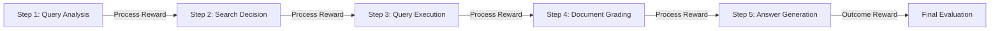

本記事は [arXiv: 2510.05691 — DecEx-RAG: Boosting Agentic Retrieval-Augmented Generation with Decision and Execution Optimization via Process Supervision](https://arxiv.org/abs/2510.05691) の解説記事です。EMNLP 2025 Industry Trackで採択されています。

この記事は [Zenn記事: LangGraph×Claude Sonnet 4.6のtool_useで出典付きAgentic RAGを構築する](https://zenn.dev/0h_n0/articles/11cb2066e667ed) の深掘りです。

## 論文概要（Abstract）

Agentic RAG（エージェント型検索拡張生成）は、自律的なAIエージェントをRAGパイプラインに組み込むことで、動的な検索戦略管理を実現するアプローチである。しかし、Lengらは既存のOutcome-supervised強化学習（Search-R1等）には「非効率な探索」「疎な報酬信号」「曖昧なグローバル報酬フィードバック」という3つの課題があると指摘している。DecEx-RAGは、Agentic RAGをマルコフ決定過程（MDP）としてモデル化し、Decision（意思決定）とExecution（実行）の2フェーズに分離したプロセスレベルの方策最適化を行う。著者らの報告によると、6つのデータセットで平均6.2%の精度改善を達成し、データ構築効率を約6倍に改善している。

## 情報源

- **会議名**: EMNLP 2025（Empirical Methods in Natural Language Processing）Industry Track
- **年**: 2025
- **URL**: [https://arxiv.org/abs/2510.05691](https://arxiv.org/abs/2510.05691)
- **著者**: Yongqi Leng, Yikun Lei, Xikai Liu, Meizhi Zhong, Bojian Xiong, Yurong Zhang, Yan Gao, Yi Wu, Yao Hu, Deyi Xiong
- **コード**: [https://github.com/sdsxdxl/DecEx-RAG](https://github.com/sdsxdxl/DecEx-RAG)

## カンファレンス情報

**EMNLPについて**: EMNLP（Empirical Methods in Natural Language Processing）はNLP分野の主要カンファレンスの1つであり、ACLと並んでトップティアに位置する。Industry Trackは産業応用に焦点を当てた発表トラックであり、実用性の高い研究が採択される。

## 技術的詳細（Technical Details）

### Agentic RAGの課題

従来のAgentic RAGでは、エージェントが自律的に「いつ検索するか」「何を検索するか」「検索結果をどう使うか」を判断する。しかし、この意思決定プロセスの学習には以下の課題がある。

1. **非効率な探索**: エージェントが多くの無駄な検索ステップを実行する
2. **疎な報酬信号**: 最終回答の正誤のみをフィードバックとするため、途中ステップの品質が学習に反映されにくい
3. **曖昧なグローバル報酬**: 最終報酬が「意思決定の良さ」と「実行の良さ」のどちらに起因するか区別できない

### MDPによるモデル化

DecEx-RAGは、Agentic RAGの各ステップをMDP（Markov Decision Process）としてモデル化する。

$$
\mathcal{M} = (S, A, T, R, \gamma)
$$

ここで、
- $S$: 状態空間（現在のクエリ、検索履歴、生成中の回答）
- $A$: 行動空間（検索実行、クエリ書き換え、回答生成、停止）
- $T$: 状態遷移関数
- $R$: 報酬関数
- $\gamma$: 割引率

### Decision-Execution分離

DecEx-RAGの核心は、エージェントの行動を**Decision（意思決定）**と**Execution（実行）**の2フェーズに分離する点にある。

- **Decision Phase**: 「次に何をするか」の判断。検索するか、クエリを書き換えるか、回答を生成するか
- **Execution Phase**: 決定された行動の実際の実行。検索クエリの生成、回答テキストの生成

この分離により、各フェーズに対して独立したプロセスレベルの報酬を設計できる。

$$
R_{\text{total}}(s, a) = \alpha \cdot R_{\text{decision}}(s, a) + \beta \cdot R_{\text{execution}}(s, a)
$$

ここで、
- $R_{\text{decision}}$: 意思決定の品質に対する報酬（適切なタイミングでの検索判断等）
- $R_{\text{execution}}$: 実行品質に対する報酬（検索クエリの適切さ、回答の正確さ等）
- $\alpha, \beta$: 重み係数

### プロセス監視（Process Supervision）

Outcome Supervision（最終結果のみで評価）とは異なり、Process Supervision（プロセス監視）は各中間ステップの品質を評価する。



各ステップでプロセス報酬を得ることで、どのステップが最終結果に寄与しているかを明確にし、より効率的な方策学習を可能にする。

### 効率的なプルーニング戦略

DecEx-RAGは、学習データの構築効率を改善するためのプルーニング戦略も提案している。著者らによると、この戦略によりデータ構築効率を約6倍に改善したとされている。具体的には、探索木から低品質なトラジェクトリを早期に刈り込むことで、有効な学習データの比率を高めている。

## 実験結果（Results）

### 主要結果

著者らの報告によると、DecEx-RAGは6つのデータセットで以下の結果を達成している。

| 評価項目 | 結果 |
|---------|------|
| 平均精度改善 | +6.2%（6データセット平均、既存ベースライン比） |
| データ構築効率 | 約6倍改善（プルーニング戦略適用時） |

**分析ポイント**:
- Outcome Supervision（最終結果のみ）と比較して、Process Supervision（各ステップ評価）が一貫して性能を改善
- Decision-Execution分離により、どのフェーズが性能ボトルネックかの診断が可能
- プルーニング戦略は性能を落とさずにデータ構築コストを削減

### Zenn記事のアーキテクチャとの関連

DecEx-RAGのDecision-Execution分離は、Zenn記事のLangGraph実装と以下のように対応する。

| DecEx-RAGの概念 | Zenn記事のLangGraph実装 |
|---------------|----------------------|
| Decision Phase | `analyze_query` → `route_query` ノード |
| Execution Phase | ベクトル検索 / キーワード検索 / Web検索の実行 |
| Process Reward (Decision) | `grade_documents` の関連度判定 |
| Process Reward (Execution) | 生成結果のハルシネーション/有用度チェック |

## 実装のポイント（Implementation）

### プロセス報酬の設計

DecEx-RAGの実装で最も重要なのは、各ステップに対するプロセス報酬の設計である。

```python
from dataclasses import dataclass
from typing import Literal

@dataclass
class ProcessReward:
    """各ステップのプロセス報酬"""
    step_type: Literal["decision", "execution"]
    reward: float  # -1.0 ~ 1.0
    reason: str

def compute_decision_reward(
    state: dict,
    action: str,
    ground_truth: dict,
) -> ProcessReward:
    """意思決定フェーズの報酬を計算

    Args:
        state: 現在の状態（クエリ、検索履歴等）
        action: 選択された行動（search, rewrite, generate, stop）
        ground_truth: 正解情報

    Returns:
        ProcessReward: 意思決定の品質評価
    """
    # 例: 検索が必要な状況で検索を選択した場合は正の報酬
    if action == "search" and needs_retrieval(state, ground_truth):
        return ProcessReward(
            step_type="decision",
            reward=1.0,
            reason="Correct decision to search"
        )
    elif action == "generate" and has_sufficient_context(state):
        return ProcessReward(
            step_type="decision",
            reward=1.0,
            reason="Correct decision to generate"
        )
    else:
        return ProcessReward(
            step_type="decision",
            reward=-0.5,
            reason="Suboptimal decision"
        )
```

### LangGraphへの適用

DecEx-RAGの知見をLangGraph実装に適用する場合、以下のアプローチが考えられる。

1. **Decision-Execution分離**: StateGraphのノードを意思決定ノード（route_query）と実行ノード（search, generate）に明確に分離
2. **ステップ品質のログ記録**: 各ノードの出力品質をLangSmithでトレースし、プロセスレベルの評価データを蓄積
3. **適応的リトライ**: プロセス報酬に基づいて、リトライの必要性を判断（固定回数ではなく品質ベース）

## 実運用への応用（Practical Applications）

DecEx-RAGのフレームワークは、以下のような実運用シナリオに適用できる。

1. **社内検索エージェント**: Decision Phaseでクエリの複雑度を判定し、単純なクエリはキーワード検索、複雑なクエリはベクトル検索+Web検索と動的にルーティング
2. **カスタマーサポート**: 回答品質のプロセス監視により、不正確な回答の早期検出と修正が可能
3. **技術文書生成**: 検索ステップごとの品質評価により、出典の信頼性が高い回答のみを提示

### 制約と注意点

- DecEx-RAGはLLMのfine-tuningを前提としたフレームワークであり、API-onlyの環境（Claude API等）では直接適用が困難
- プロセス報酬の設計にはドメイン知識が必要であり、汎用的な報酬関数の設計は未解決の課題
- 学習データ構築のコスト（6倍改善後でも一定のコスト）が障壁になる場合がある

## 関連研究（Related Work）

- **Search-R1**: Outcome Supervisedな強化学習でRAGエージェントを学習。DecEx-RAGはこれをProcess Supervisedに拡張
- **Self-RAG (Asai et al., 2023)**: 自己反省トークンによるRAGの自己修正。DecEx-RAGのProcess Supervision概念と共通する設計思想
- **CRAG (Yan et al., 2023)**: 検索結果の3段階評価。DecEx-RAGのDecision Phaseに相当する機能を持つ

## まとめと今後の展望

DecEx-RAGは、Agentic RAGをMDPとしてモデル化し、Decision-Execution分離とProcess Supervisionにより性能を改善するフレームワークである。著者らの報告では6つのデータセットで平均6.2%の精度改善とデータ構築効率6倍の改善が報告されている。

Zenn記事のLangGraph実装との関連では、DecEx-RAGのDecision-Execution分離の概念が`analyze_query`→`route_query`→検索実行→`grade_documents`というグラフ構造に対応しており、将来的にプロセスレベルの報酬を導入することで自己修正ループの品質をさらに改善できる可能性がある。

## 参考文献

- **arXiv**: [https://arxiv.org/abs/2510.05691](https://arxiv.org/abs/2510.05691)
- **Code**: [https://github.com/sdsxdxl/DecEx-RAG](https://github.com/sdsxdxl/DecEx-RAG)
- **Conference**: EMNLP 2025 Industry Track
- **Related Zenn article**: [https://zenn.dev/0h_n0/articles/11cb2066e667ed](https://zenn.dev/0h_n0/articles/11cb2066e667ed)

---

:::message
この記事はAI（Claude Code）により自動生成されました。内容の正確性については情報源の原論文もご確認ください。
:::
