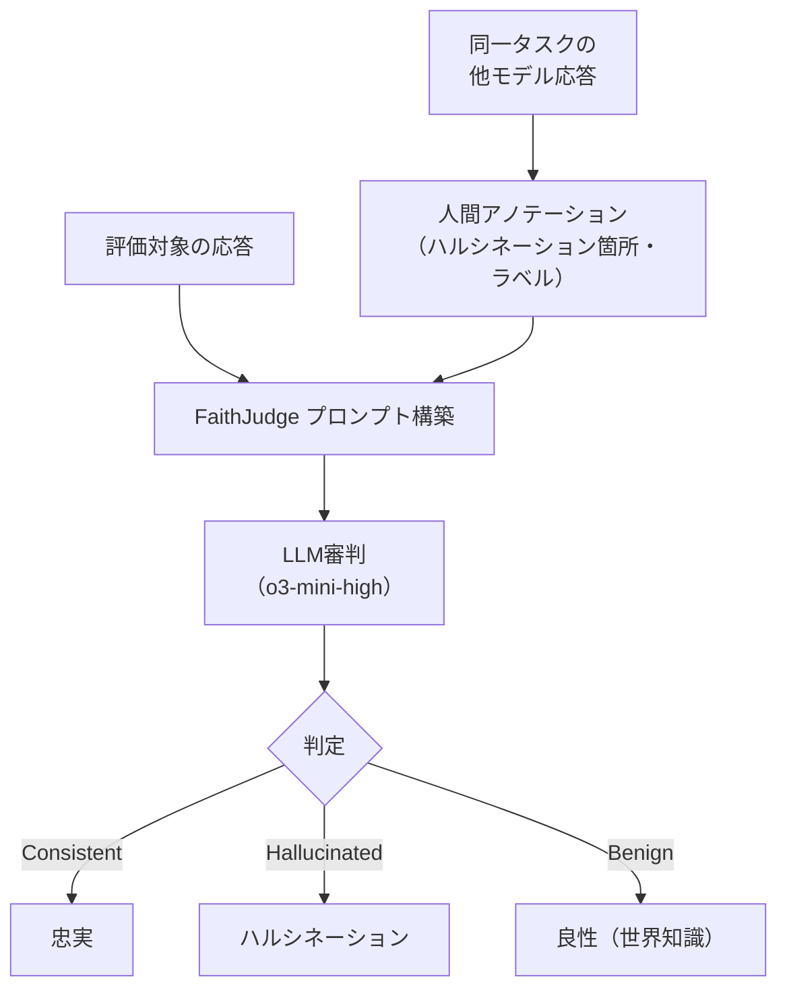

本記事は [EMNLP 2025 Industry Track](https://aclanthology.org/2025.emnlp-industry.54/) の解説記事です。

関連するZenn記事: [LangGraph×Claude Sonnet 4.6でインラインLLM-as-Judge品質ゲートを組み込むRAG実装](https://zenn.dev/0h_n0/articles/478dd4ba7d4be8)

## 論文概要

「Benchmarking LLM Faithfulness in RAG with Evolving Leaderboards」は、Vectaraの研究チームがRAG（Retrieval-Augmented Generation）におけるLLMのハルシネーション（幻覚）を体系的に評価するフレームワーク**FaithJudge**を提案した論文である。

著者らは、既存のハルシネーション検出手法（自社のHHEMモデルを含む）の限界を指摘し、**人間がアノテーションしたハルシネーション事例をfew-shotプロンプトとしてLLM審判に提供する**アプローチにより、追加訓練なしで評価精度を大幅に改善できると報告している。評価対象は要約・質問応答・データからテキスト生成の3タスクで、46モデルのハルシネーション率をランキング化している。

## 情報源

- **論文タイトル**: Benchmarking LLM Faithfulness in RAG with Evolving Leaderboards
- **著者**: Manveer Singh Tamber, Forrest Sheng Bao, Chenyu Xu, Ge Luo, Suleman Kazi, Minseok Bae, Miaoran Li, Ofer Mendelevitch, Renyi Qu, Jimmy Lin
- **会議名**: EMNLP 2025 Industry Track（Conference on Empirical Methods in Natural Language Processing）
- **開催地**: 中国・蘇州（2025年11月）
- **ページ**: 799-811
- **DOI**: [10.18653/v1/2025.emnlp-industry.54](https://aclanthology.org/2025.emnlp-industry.54/)
- **コード**: [https://github.com/vectara/FaithJudge](https://github.com/vectara/FaithJudge)

## カンファレンス情報

EMNLP（Empirical Methods in Natural Language Processing）は、ACL（Association for Computational Linguistics）傘下の自然言語処理分野トップカンファレンスの1つである。実証的手法に基づく研究を重視し、Industry Trackでは産業応用に焦点を当てた論文が採択される。2024年のメイントラックの採択率は約22%であった。

## 技術的詳細

### 課題: 既存手法の限界

著者らはまずVectaraの**HHEM（Hughes Hallucination Evaluation Model）**の性能を分析している。HHEMは3バージョンが開発されたが、最新のHHEM-2.1-open（110Mパラメータ）でも平均精度67.1%にとどまると報告している。

### FaithJudgeフレームワーク

FaithJudgeの核心は、**ゼロショットのLLM審判ではなく、人間アノテーション付き事例をfew-shotで提供する**点にある。



具体的な手順は以下の通りである。

1. **アノテーション事例の収集**: FaithBenchでは1記事あたり10モデルの要約が存在する。評価対象の1件を除く9件の要約について、人間がハルシネーション箇所・参照元・ラベル（Unwanted / Benign / Questionable / Consistent）をアノテーション済み
2. **プロンプト構築**: アノテーション済み事例をコンテキストとしてLLM審判に提供
3. **判定**: LLM審判が評価対象の応答を分類

### ハルシネーション率の算出

モデル $m$ のハルシネーション率 $H(m)$ は以下で定義される。

$$
H(m) = \frac{\text{ハルシネーションと判定された応答数}}{\text{総応答数}} \times 100\%
$$

### データセット

著者らは2つのデータセットを組み合わせている。

- **FaithBench**: 75記事 x 10モデル = 750要約。モデル間で判定が分かれる「困難な」記事を意図的に選択（HHEM-2.1、GPT-4o、GPT-3.5の判定が不一致の記事）
- **RagTruth**: 要約・質問応答・データからテキスト生成の3タスク。GPT-3.5、GPT-4、Llama-2（7B/13B/70B）、Mistral-7Bの出力に対する人間アノテーション

## 実装のポイント

[FaithJudge リポジトリ](https://github.com/vectara/FaithJudge)では、応答生成と評価の2段階パイプラインが提供されている。

```python
# 応答生成（各モデルでRAGタスクを実行）
# python3 generate_responses.py --model openai/gpt-4o-2024-11-20

# FaithJudge評価（o3-mini-highを審判として使用）
# python3 eval.py --model openai/gpt-4o-2024-11-20 --judge_model o3-mini

def faithjudge_evaluate(
    candidate_response: str,
    source_document: str,
    annotated_examples: list[dict],
    judge_model: str = "o3-mini-high",
) -> dict:
    """FaithJudge方式のハルシネーション評価

    Args:
        candidate_response: 評価対象の応答テキスト
        source_document: 参照元ドキュメント
        annotated_examples: 人間アノテーション付き事例リスト
        judge_model: 審判に使用するLLMモデル名

    Returns:
        {"label": str, "hallucination_spans": list[str]}
    """
    # few-shotプロンプト構築
    examples_text = format_annotated_examples(annotated_examples)

    prompt = f"""以下は同一ソースに対する他モデルの応答と、
人間によるハルシネーションアノテーションです:

{examples_text}

ソースドキュメント:
{source_document}

評価対象の応答:
{candidate_response}

上記のアノテーション事例を参考に、評価対象の応答に
ハルシネーションが含まれるか判定してください。"""

    result = call_llm(judge_model, prompt)
    return parse_judgment(result)
```

## 実験結果

### 審判モデルの精度

FaithBenchにおける各審判モデルの性能を著者らは以下の通り報告している。

| 審判モデル | Balanced Accuracy | F1-Macro |
|-----------|:-:|:-:|
| **o3-mini-high** | **84.0%** | **82.1%** |
| GPT-4o | 79.5% | 81.1% |
| 多数決アンサンブル | 80.7% | 81.3% |

### FaithJudge vs ゼロショット（RagTruth）

| タスク | FaithJudge | ゼロショット | 改善幅 |
|--------|:-:|:-:|:-:|
| データ→テキスト | 85.1% | 75.1% | +10.0pt |
| 質問応答 | 85.4% | 81.6% | +3.8pt |
| 要約 | 84.9% | 80.3% | +4.6pt |

全タスクでfew-shot方式がゼロショットを上回り、特にデータからテキスト生成タスクで10ポイントの大幅改善が確認された。

### モデル別ハルシネーション率（上位5件）

| モデル | ハルシネーション率 |
|--------|:-:|
| gemini-2.5-pro | 6.65% |
| gemini-2.0-flash | 10.18% |
| gpt-4.5-preview | 11.94% |
| o3-mini-high | 12.52% |
| grok-3 | 15.26% |

著者らは、大規模モデルほどハルシネーション率が低い傾向を確認している。Llama-3.1-8Bは28.38%と最も高いハルシネーション率を示した。

## 実運用への応用

本論文の知見はRAGシステムの品質管理に直接応用できる。

1. **インラインLLM-as-Judge**: Zenn記事で解説されているLangGraphの品質ゲートパターンにおいて、FaithJudgeのfew-shot戦略を適用することで、ゼロショット審判より高精度な忠実度チェックが実現できる
2. **ベンチマーク選定**: FaithBenchとRagTruthの組み合わせにより、要約・QA・データ変換の3軸でモデル選定の判断材料を得られる
3. **審判モデルの選択**: o3-mini-highが単体で最高性能を示しており、アンサンブルより単一モデルが有効な場合があることは実装コスト削減の観点で重要である

## まとめ

FaithJudgeは、人間アノテーション付きハルシネーション事例をfew-shotプロンプトとして活用することで、追加訓練なしにRAG忠実度評価を改善するフレームワークである。著者らは、既存のHHEMモデル（67.1%精度）やゼロショットLLM審判を大幅に上回る84.0%のBalanced Accuracyを達成し、46モデルにわたるハルシネーション率ランキングを公開している。RAGシステムにおけるLLM-as-Judge品質ゲートの設計に、本論文のfew-shot戦略は実践的な指針を提供する。

## 参考文献

- Tamber, M.S. et al. (2025). "Benchmarking LLM Faithfulness in RAG with Evolving Leaderboards." *Proceedings of EMNLP 2025 Industry Track*, pp. 799-811. [https://aclanthology.org/2025.emnlp-industry.54/](https://aclanthology.org/2025.emnlp-industry.54/)
- GitHub リポジトリ: [https://github.com/vectara/FaithJudge](https://github.com/vectara/FaithJudge)
- Vectara Hallucination Leaderboard: [https://www.vectara.com/blog/introducing-the-next-generation-of-vectaras-hallucination-leaderboard](https://www.vectara.com/blog/introducing-the-next-generation-of-vectaras-hallucination-leaderboard)
- 関連Zenn記事: [https://zenn.dev/0h_n0/articles/478dd4ba7d4be8](https://zenn.dev/0h_n0/articles/478dd4ba7d4be8)
