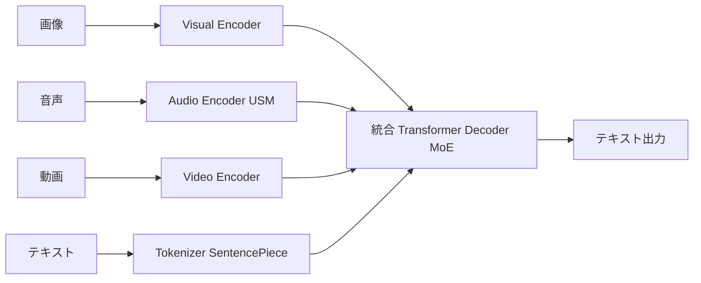

本記事は [Gemini: A Family of Highly Capable Multimodal Models (arXiv:2312.11805)](https://arxiv.org/abs/2312.11805) の解説記事です。

## 論文概要（Abstract）

Gemini は Google DeepMind が2023年12月に発表したマルチモーダル基盤モデルファミリーである。テキスト・画像・音声・動画を**単一の Transformer アーキテクチャ**で統合的に処理する「ネイティブマルチモーダル」設計を採用し、Ultra / Pro / Nano の3サイズで展開されている。著者らは、MMLU で90.0%（5-shot、当時の SOTA）、32のベンチマーク中30で最高性能を達成したと報告している。

この記事は [Zenn記事: Gemini 3.1 Pro マルチモーダルAPI実践ガイド：画像・音声・動画をPythonで統合処理する](https://zenn.dev/0h_n0/articles/df5295d69a456f) の深掘りです。

## 情報源

- **arXiv ID**: 2312.11805
- **URL**: [https://arxiv.org/abs/2312.11805](https://arxiv.org/abs/2312.11805)
- **著者**: Gemini Team, Google DeepMind（Rohan Anil, Sebastian Borgeaud, Jean-Baptiste Alayrac et al.）
- **発表年**: 2023
- **分野**: cs.CL, cs.AI

## 背景と動機（Background & Motivation）

2023年時点で、マルチモーダル AI の主流アプローチは「後付け融合（late fusion）」だった。GPT-4V に代表されるように、テキスト LLM に対して視覚エンコーダ（CLIP等）を接続し、画像理解能力を追加する方式である。この方式には以下の課題があった。

- **モダリティ間の情報損失**: 視覚エンコーダが画像を固定長のベクトルに圧縮するため、微細な視覚情報が失われる
- **新モダリティ追加の困難さ**: 音声・動画など新しいモダリティを追加するたびに、専用のエンコーダとアライメント学習が必要になる
- **クロスモーダル推論の限界**: テキストと画像の関係性を深く理解するには、低レベルの特徴量から統合的に学習する必要がある

Google DeepMind はこれらの課題に対し、**学習初期段階から複数のモダリティを統合的に扱う「ネイティブマルチモーダル」設計**を提案した。Gemini はテキスト・画像・音声・動画のデータを混合した事前学習を行い、モダリティ間の相互関係を自然に獲得するアプローチを採用している。

## 主要な貢献（Key Contributions）

- **ネイティブマルチモーダル Transformer**: 画像・音声・動画・テキストを同一のシーケンスとして処理する統合アーキテクチャの提案
- **Mixture-of-Experts (MoE) による効率的なスケーリング**: 3サイズ（Ultra/Pro/Nano）展開で、エッジデバイスからデータセンターまで対応
- **32K コンテキストでのマルチモーダル処理**: 動画フレーム・音声セグメント・テキストを混在させた長文脈処理
- **広範なベンチマーク評価**: 32ベンチマーク中30で SOTA を達成（論文 Table 1-8 より）

## 技術的詳細（Technical Details）

### アーキテクチャ概要

Gemini のアーキテクチャは、以下の3つのコンポーネントで構成される。

1. **モダリティ固有のエンコーダ**: 各入力モダリティをトークン列に変換
2. **統合 Transformer デコーダ**: すべてのモダリティのトークンを統一的に処理
3. **出力ヘッド**: テキストトークンを生成（画像・音声生成は対象外）



### 画像エンコーディング

著者らは、画像入力に対して可変解像度のパッチ分割を採用したと報告している。従来の ViT (Vision Transformer) が固定サイズ（例: 224×224）にリサイズするのに対し、Gemini は入力画像の解像度に応じてパッチ数を動的に調整する。

$$
N_{\text{patches}} = \left\lceil \frac{H}{P} \right\rceil \times \left\lceil \frac{W}{P} \right\rceil
$$

ここで、
- $H$, $W$: 入力画像の高さ・幅
- $P$: パッチサイズ（ピクセル単位）
- $N_{\text{patches}}$: 生成されるビジュアルトークン数

各パッチは線形射影によって Transformer の隠れ次元 $d_{\text{model}}$ に変換される。

### 音声エンコーディング

音声入力には USM（Universal Speech Model）ベースのエンコーダが使用されている。16kHz でサンプリングされた音声波形を、約25ms のフレーム単位で特徴量に変換する。論文の記述によれば、1秒あたり約40トークンが生成される。

$$
N_{\text{audio\_tokens}} = \left\lfloor \frac{T_{\text{seconds}} \times f_s}{L_{\text{frame}}} \right\rfloor
$$

ここで、
- $T_{\text{seconds}}$: 音声の長さ（秒）
- $f_s$: サンプリングレート（16,000 Hz）
- $L_{\text{frame}}$: フレーム長（400サンプル = 25ms）

### Mixture-of-Experts (MoE)

Gemini は効率的なスケーリングのために MoE アーキテクチャを採用している。各 Transformer 層の Feed-Forward Network (FFN) を複数の「エキスパート」に分割し、入力トークンに応じて一部のエキスパートのみを活性化する。

$$
\text{MoE}(\mathbf{x}) = \sum_{i=1}^{E} g_i(\mathbf{x}) \cdot \text{FFN}_i(\mathbf{x})
$$

ここで、
- $\mathbf{x}$: 入力トークンの隠れ表現
- $E$: エキスパート総数
- $g_i(\mathbf{x})$: ゲーティング関数（上位 $k$ 個のエキスパートのみ非ゼロ）
- $\text{FFN}_i$: $i$ 番目のエキスパートの FFN

ゲーティング関数は softmax ベースの Top-k ルーティングを使用する。

$$
g_i(\mathbf{x}) = \begin{cases}
\frac{\exp(w_i^T \mathbf{x})}{\sum_{j \in \text{Top-k}} \exp(w_j^T \mathbf{x})} & \text{if } i \in \text{Top-k} \\
0 & \text{otherwise}
\end{cases}
$$

この設計により、パラメータ総数は大きくても、推論時のFLOPsは Dense モデルの $k/E$ 倍程度に抑えられる。

### インターリーブ入力処理

Gemini の特徴は、異なるモダリティのトークンを**単一のシーケンスとしてインターリーブ**して処理する点にある。例えば、動画入力の場合：

```
[画像フレーム1のトークン列] [音声セグメント1のトークン列] [画像フレーム2のトークン列] [音声セグメント2のトークン列] ... [テキストプロンプト]
```

このインターリーブにより、Self-Attention 機構がモダリティ間の時間的・意味的な対応関係を直接学習できる。32Kトークンのコンテキスト長で、約30分の動画を1パスで処理可能と報告されている。

### アルゴリズム: マルチモーダル推論パイプライン

```python
import torch
import torch.nn as nn


class GeminiStyleEncoder(nn.Module):
    """Geminiのマルチモーダルエンコーディングの概念的実装

    実際のGeminiは非公開だが、論文の記述に基づく概念モデル。
    """

    def __init__(self, d_model: int = 2048, patch_size: int = 14):
        super().__init__()
        self.d_model = d_model
        self.patch_size = patch_size

        # 画像: パッチ→線形射影
        self.image_proj = nn.Linear(patch_size * patch_size * 3, d_model)

        # 音声: フレーム特徴量→射影
        self.audio_proj = nn.Linear(80, d_model)  # 80-dim mel features

        # テキスト: embedding
        self.text_embed = nn.Embedding(32000, d_model)

    def encode_image(self, image: torch.Tensor) -> torch.Tensor:
        """画像をパッチトークンに変換

        Args:
            image: (B, C, H, W) の画像テンソル

        Returns:
            (B, N_patches, d_model) のトークン列
        """
        B, C, H, W = image.shape
        P = self.patch_size
        patches = image.unfold(2, P, P).unfold(3, P, P)
        patches = patches.contiguous().view(B, -1, C * P * P)
        return self.image_proj(patches)

    def encode_audio(self, mel_frames: torch.Tensor) -> torch.Tensor:
        """音声メル特徴量をトークンに変換

        Args:
            mel_frames: (B, T, 80) のメルスペクトログラム

        Returns:
            (B, T, d_model) のトークン列
        """
        return self.audio_proj(mel_frames)

    def interleave(
        self,
        image_tokens: torch.Tensor,
        audio_tokens: torch.Tensor,
        text_tokens: torch.Tensor,
    ) -> torch.Tensor:
        """異なるモダリティのトークンをインターリーブ

        Returns:
            (B, total_seq_len, d_model) の統合トークン列
        """
        return torch.cat([image_tokens, audio_tokens, text_tokens], dim=1)
```

## 実装のポイント（Implementation）

Gemini は Google API 経由でのみ利用可能なクローズドモデルであるが、論文から読み取れる実装上の注意点は以下の通り。

**1. 動的パッチサイズの選択**: 低解像度画像に対して過剰なパッチ分割を行うとノイズが増加する。入力解像度に応じたパッチ数の上限設定が推奨される。

**2. MoE のロードバランシング**: エキスパート間の負荷が偏ると一部のエキスパートが過学習する。著者らは補助損失（auxiliary loss）を用いてバランスを維持したと報告している。

$$
\mathcal{L}_{\text{aux}} = \alpha \cdot \sum_{i=1}^{E} f_i \cdot P_i
$$

ここで $f_i$ はエキスパート $i$ に割り当てられたトークンの割合、$P_i$ はゲーティング確率の平均値、$\alpha$ はバランス係数である。

**3. 温度設定**: 論文では推論時の温度パラメータについて詳細は述べられていないが、後続のGemini 3.xではデフォルト温度1.0で最適化されていることがZenn記事で紹介されている。

**4. コンテキスト長の制約**: 32Kトークンは動画処理には十分だが、長時間の動画には不十分。後続のGemini 1.5で10Mトークンに拡張された。

## 実験結果（Results）

著者らは32のベンチマークで評価を実施し、30で当時のSOTAを達成したと報告している（論文 Table 1-8 より）。

### テキスト理解

| ベンチマーク | Gemini Ultra | GPT-4 | 差分 |
|-------------|-------------|-------|------|
| MMLU (5-shot) | 90.0% | 86.4% | +3.6% |
| HellaSwag (10-shot) | 87.8% | 95.3% | -7.5% |
| Big-Bench Hard (CoT) | 83.6% | 83.1% | +0.5% |
| HumanEval (コード生成) | 74.4% | 67.0% | +7.4% |

論文 Table 2 より。Gemini Ultra は MMLU と HumanEval で GPT-4 を上回っている一方、HellaSwag では劣っている。

### マルチモーダル理解

| ベンチマーク | Gemini Ultra | GPT-4V | 差分 |
|-------------|-------------|--------|------|
| MMMU (5-shot) | 59.4% | 56.8% | +2.6% |
| VQAv2 | 77.8% | - | - |
| TextVQA | 82.3% | 78.0% | +4.3% |
| EgoSchema (動画) | 85.0% | - | - |

論文 Table 5-7 より。マルチモーダルタスクで一貫して高い性能を示している。特に動画理解（EgoSchema）では85.0%という高いスコアを記録している。

### 音声理解

| タスク | Gemini Pro | Whisper Large v2 | 差分 |
|--------|-----------|------------------|------|
| FLEURS ASR (平均WER) | 7.6% | 11.6% | -4.0% |
| CoVoST 翻訳 (平均BLEU) | 40.1 | 29.1 | +11.0 |

論文 Table 8 より。音声認識と翻訳の両方で Whisper を上回っている。

**注意点**: これらのベンチマーク結果は論文著者ら（Google DeepMind）による自己評価であり、独立した第三者による再現検証は限定的である。また、評価プロトコル（few-shot の設定、プロンプトの最適化等）が他のモデルと完全に統一されているかは論文だけでは判断できない。

## 実運用への応用（Practical Applications）

Zenn記事で解説されている Gemini 3.1 Pro API の背景にある設計思想が、この論文で明らかになる。

**1. モデル選定の指針**: Ultra/Pro/Nano の3サイズ展開は、ユースケースに応じた最適なコスト・性能バランスを実現する。Zenn記事の `route_request` 関数のようなモデルルーティングは、この設計思想の直接的な応用である。

**2. インターリーブ入力の活用**: Zenn記事のマルチモーダル統合コード（動画+参照画像の同時分析）は、Gemini のインターリーブ処理能力を直接活用している。

**3. コンテキスト長の活用**: 32Kトークン（Gemini 1.0）から100万トークン（Gemini 3.x）への拡張により、長時間動画の一括処理が実用的になった。

**4. エッジデプロイ**: Nano サイズのモデルはモバイルデバイス（Google Pixel 8 Pro等）で動作するよう最適化されており、オフライン環境でのマルチモーダル処理を可能にしている。

## 関連研究（Related Work）

- **GPT-4V (OpenAI, 2023)**: テキスト LLM に CLIP ベースの視覚エンコーダを後付けする「late fusion」方式。Gemini の「native multimodal」とは対照的なアプローチ。
- **PaLM-E (Google, 2023, arXiv:2303.03378)**: ロボティクス向けのマルチモーダルモデル。Gemini の前身的位置づけで、視覚・言語・センサーデータの統合を先行して研究していた。
- **LLaVA (Liu et al., 2023, arXiv:2304.08485)**: オープンソースの VLM。CLIP + LLaMA の組み合わせで、少ないデータで画像理解能力を獲得する手法を提案。Gemini のような大規模事前学習とは対照的に、効率的なファインチューニングアプローチを採用している。
- **Flamingo (Alayrac et al., 2022, arXiv:2204.14198)**: DeepMind の先行研究。視覚エンコーダの出力を Cross-Attention で LLM に注入する設計。Gemini はこれをさらに発展させ、学習初期段階からの融合を実現した。

## まとめと今後の展望

Gemini 論文は、マルチモーダル AI のアーキテクチャ設計において「ネイティブマルチモーダル」アプローチの有効性を実証した。テキスト・画像・音声・動画を単一の Transformer で統合処理する設計は、後続の Gemini 1.5（10Mトークンコンテキスト）、Gemini 3.x（thinking_level パラメータ）へと発展しており、Zenn記事で紹介されている API 体系の基盤となっている。

一方で、クローズドモデルであるためアーキテクチャの詳細が非公開であること、ベンチマーク結果が自己評価中心であること、音声・画像の**生成**能力は限定的であることは、採用判断時の考慮事項である。

今後は、MoE の効率化、コンテキスト長のさらなる拡張、出力モダリティの拡充（画像・音声生成の統合）が研究の焦点となると考えられる。

## 参考文献

- **arXiv**: [https://arxiv.org/abs/2312.11805](https://arxiv.org/abs/2312.11805)
- **Google Blog**: [https://blog.google/technology/ai/google-gemini-ai/](https://blog.google/technology/ai/google-gemini-ai/)
- **Related Zenn article**: [https://zenn.dev/0h_n0/articles/df5295d69a456f](https://zenn.dev/0h_n0/articles/df5295d69a456f)
