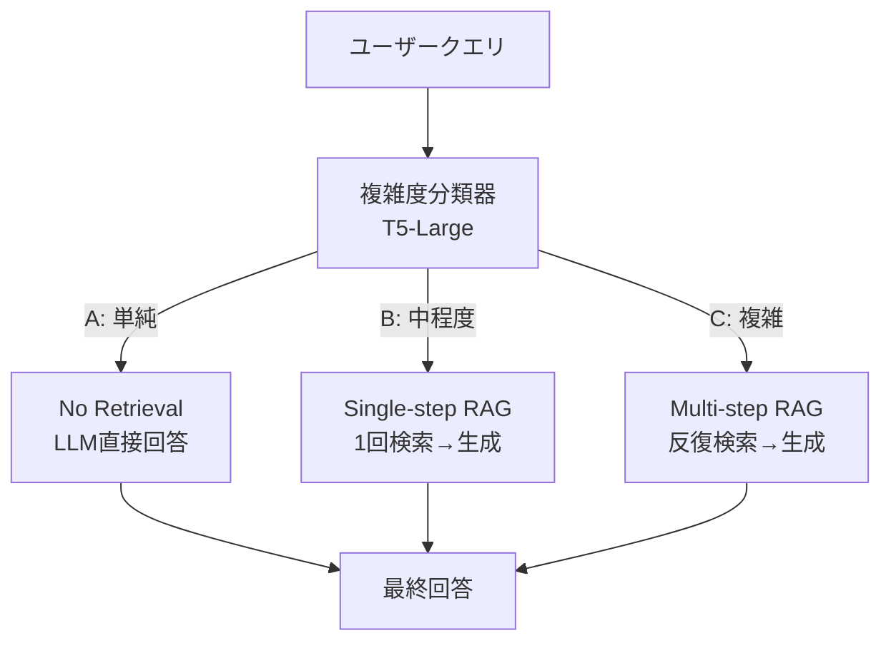

本記事は [arXiv:2404.16130 "Adaptive-RAG: Learning to Adapt Retrieval-Augmented Large Language Models through Question Complexity"](https://arxiv.org/abs/2404.16130) の解説記事です。

この記事は [Zenn記事: LangGraph×Claude Sonnet 4.6でSQL統合Agentic RAGを実装する](https://zenn.dev/0h_n0/articles/58dc3076d2ffba) の深掘りです。

## 論文概要（Abstract）

Retrieval-Augmented Generation（RAG）において、すべてのクエリに同一の検索戦略を適用するのは非効率である。単純なファクトイド質問（例：「日本の首都は？」）には検索は不要であり、LLMの内部知識で回答可能である。一方で、複数の情報源を統合する必要がある複合質問（例：「2024年にノーベル物理学賞を受賞した研究者の所属機関の設立年は？」）には、マルチステップの反復検索が必要となる。

著者ら（Jeong et al.）は、クエリの複雑度を自動分類し、検索戦略を動的に切り替えるAdaptive RAGを提案している。具体的には、小規模な分類器（T5-Large, 770M）でクエリを3段階に分類し、各段階に対応する検索戦略を適用する。SQuAD、MuSiQue、HotpotQAの各ベンチマークで、固定戦略のRAGに対して精度を維持しつつ不要な検索コストを削減している。

## 情報源

- **arXiv ID**: 2404.16130
- **URL**: [https://arxiv.org/abs/2404.16130](https://arxiv.org/abs/2404.16130)
- **著者**: Soyeong Jeong, Jinheon Baek, Sukmin Cho, Sung Ju Hwang, Jong C. Park
- **発表年**: 2024
- **分野**: cs.CL, cs.AI
- **カンファレンス**: NAACL 2024

## 背景と動機（Background & Motivation）

RAGシステムの設計では、検索の粒度に関して以下のトレードオフが存在する。

第一に、**検索なし（No Retrieval）**: LLMの内部知識で回答可能なクエリに対して外部検索を実行すると、レイテンシとAPIコストが無駄に発生する。さらに、無関連な検索結果がコンテキストに混入すると、回答の品質が低下するリスクがある。

第二に、**単一ステップ検索（Single-step Retrieval）**: 標準的なRAGパイプラインで、1回の検索で関連ドキュメントを取得する。ファクトイドQAには十分だが、マルチホップ推論が必要な質問には対応できない。

第三に、**マルチステップ検索（Multi-step Retrieval）**: Self-RAGやIter-RetGenのように、複数回の検索を反復する。高い精度が得られるが、検索回数に比例してレイテンシとコストが増加する。

著者らはこのトレードオフに対し、クエリの複雑度に基づいて検索戦略を動的に選択するアプローチを提案している。

## 主要な貢献（Key Contributions）

- **貢献1**: クエリ複雑度の3段階分類（A: No Retrieval, B: Single-step, C: Multi-step）と、対応する検索戦略の動的選択フレームワーク
- **貢献2**: T5-Largeベースの分類器によるクエリルーティング。学習データの自動生成パイプラインを含む
- **貢献3**: SQuAD、MuSiQue、HotpotQA、2WikiMultihopQA での評価。固定戦略に対する精度維持とコスト削減の定量的検証
- **貢献4**: 分類器なしのLLMプロンプトベースルーティングとの比較実験

## 技術的詳細（Technical Details）

### 3段階クエリ複雑度分類



### 分類器の学習

クエリ複雑度の正解ラベルは、以下の自動アノテーションで生成される。

**ステップ1**: 各クエリに対して3つの検索戦略（No Retrieval, Single-step, Multi-step）をすべて実行し、それぞれの回答を取得する。

**ステップ2**: 各回答の正確性を正解データと照合し、最もシンプルかつ正解を得られる戦略をそのクエリの正解ラベルとする。

具体的には、以下の優先順位でラベルを付与する：

1. No Retrievalで正解 → ラベルA
2. No Retrievalで不正解かつSingle-stepで正解 → ラベルB
3. Single-stepでも不正解かつMulti-stepで正解 → ラベルC
4. すべて不正解 → ラベルC（最も網羅的な戦略にフォールバック）

**ステップ3**: T5-Large（770Mパラメータ）を上記ラベルで3クラス分類タスクとしてファインチューニングする。

分類損失は標準的なクロスエントロピーで定義される：

$$
\mathcal{L} = -\sum_{i} \sum_{c \in \{A, B, C\}} y_{i,c} \log p_\theta(c | q_i)
$$

ここで、$q_i$ はクエリ、$y_{i,c}$ は正解ラベル、$p_\theta$ はT5-Largeの分類確率。

### 各検索戦略の詳細

**No Retrieval（ラベルA）**: LLMに直接クエリを入力し、内部知識のみで回答を生成する。ChatGPTやLLaMA 2/3のゼロショット回答に相当。

**Single-step RAG（ラベルB）**: 標準的なRAGパイプライン。クエリでベクトル検索を1回実行し、Top-k（k=5）のドキュメントをコンテキストとしてLLMに渡す。Zenn記事のベクトル検索ノードはこの構成に相当する。

**Multi-step RAG（ラベルC）**: Iter-RetGen（Shao et al., 2023）ベースの反復検索。最大3回の検索ステップで、各ステップの回答を次のクエリに組み込みながら段階的に情報を蓄積する。

$$
q_{t+1} = \text{LLM}(q_0, D_1, D_2, \ldots, D_t)
$$

ここで、$D_t$ は$t$回目の検索で取得したドキュメント集合。

### SQL統合Agentic RAGとの対応

Zenn記事のSQL統合Agentic RAGでは、`route_query`関数がクエリをSQLノードまたはベクトル検索ノードに振り分けている。Adaptive RAGのフレームワークを適用すると、このルーティングを以下のように拡張できる。

```python
def adaptive_route_query(state: GraphState) -> str:
    """Adaptive RAGベースのクエリルーティング"""
    complexity = classify_complexity(state["question"])
    if complexity == "A":
        return "direct_answer"  # 検索不要
    elif complexity == "B":
        return "single_retrieval"  # SQL or ベクトル検索1回
    else:
        return "multi_step_retrieval"  # 反復検索
```

## 実験結果（Results）

### ベンチマーク精度

著者らが報告した主要結果（論文Table 2）：

| 手法 | SQuAD (EM) | MuSiQue (EM) | HotpotQA (EM) |
|------|-----------|-------------|---------------|
| No Retrieval | 38.9 | 4.4 | 19.8 |
| Single-step RAG | 50.2 | 9.3 | 32.5 |
| Multi-step RAG | 48.7 | 17.2 | 38.1 |
| Adaptive RAG (classifier) | 50.8 | 17.6 | 38.4 |
| Adaptive RAG (LLM prompt) | 49.1 | 15.8 | 36.2 |

Adaptive RAG（分類器ベース）は各ベンチマークで固定戦略の最高精度と同等以上の結果を達成している。

### 分類器の精度

T5-Large分類器のクエリ複雑度分類精度（論文Table 3）：

| データセット | 分類精度 (%) |
|------------|-------------|
| SQuAD（単純） | 87.3 |
| MuSiQue（複雑） | 82.1 |
| HotpotQA（混合） | 84.5 |

### コスト効率

Adaptive RAGは不要な検索を排除することで、平均検索回数を削減する。

| 手法 | 平均検索回数 |
|------|------------|
| Always Single-step | 1.0 |
| Always Multi-step | 3.0 |
| Adaptive RAG | 1.4 |

Multi-stepと比較して検索回数を53%削減しつつ、精度を維持している。この削減は主にSQuADなどの単純QAデータセットでNo Retrieval戦略が選択されることに起因する。複雑なQAデータセット（MuSiQue）では平均検索回数は2.1回となり、削減率は30%程度にとどまる。

### エラー分析

著者らは分類器の誤分類パターンを分析している。最も影響が大きいのは「複雑クエリを単純と誤分類」するケースで、回答精度が20%以上低下する。逆に「単純クエリを複雑と誤分類」するケースでは、レイテンシが増加するものの精度への影響は軽微（0-2%の低下）である。このため、実運用では分類器の閾値を保守的に設定し、疑わしいクエリはMulti-step側にフォールバックさせることが推奨される。

### LLMプロンプトルーティングとの比較

著者らはT5-Large分類器の代わりにLLMプロンプトでルーティングする方式も検証している。LLMに「このクエリは単純か、中程度か、複雑か」を判断させるゼロショットプロンプトを使用したところ、分類器ベースに対して精度が1-2%低下した。これは、LLMのプロンプトベースルーティングが分類タスクに最適化されていないことを示している。

## 実装のポイント（Implementation）

### 分類器の軽量性

T5-Large（770M）はGPU要件が低く、CPU推論でも実用的なレイテンシ（約50ms/クエリ）で動作する。分類器のオーバーヘッドは検索コストと比較して無視できるレベルである。

### ドメイン適応

新しいドメインへの適応には、そのドメインのQAデータセットで自動アノテーション→ファインチューニングのパイプラインを再実行する。著者らはこのパイプラインの自動化可能性を強調している。

### 分類器アーキテクチャの選択

著者らはT5-Large以外にもBERT-base（110M）、RoBERTa-large（355M）、Flan-T5-XL（3B）を比較している。T5-Largeが精度とコストのバランスで最適という結論が示されている。BERT-baseは分類精度が3-5%低下し、Flan-T5-XLは精度改善が0.5%未満であるにもかかわらずパラメータ数が4倍のため、T5-Largeが実用的な選択肢となっている。

### 閾値ベースの信頼度制御

分類器の出力確率に閾値を設定することで、低信頼度のクエリに対してはデフォルトでMulti-step戦略にフォールバックする安全機構を実装できる。例えば、分類確率が0.6未満の場合はラベルCにフォールバックすることで、分類器の誤判定による回答品質低下を防止できる。この閾値はドメインや許容レイテンシに応じて調整する。

## 実運用への応用（Practical Applications）

### SQL統合Agentic RAGへの適用

Zenn記事のアーキテクチャにAdaptive RAGを統合すると、以下の改善が可能である。

1. **不要な検索の排除**: LLMの内部知識で回答可能なクエリ（例：「SQLのGROUP BY句の使い方」）はSQL検索もベクトル検索も実行しない
2. **マルチステップSQL検索**: 複合クエリ（例：「過去3ヶ月の売上が最も伸びた商品カテゴリの平均単価は？」）には、まずカテゴリ別売上をSQL検索し、次に平均単価を検索する2段SQL
3. **コスト最適化**: Claude APIの呼び出し回数を平均53%削減可能。月間10万クエリの環境では、APIコストの大幅な削減に直結する

### 制約事項

- 分類器はドメイン固有のデータでファインチューニングが必要であり、汎用的なゼロショット分類器ではない
- Multi-stepのステップ数は固定（最大3回）であり、動的なステップ数決定は今後の課題とされている
- 分類器の誤分類（特に複雑クエリを単純と判定）は回答品質の低下に直結するため、分類精度の継続的モニタリングが必要

## 関連研究（Related Work）

- **Self-RAG**（Asai et al., 2023, arXiv:2310.11511）: 反射トークンで検索の必要性を判断。Adaptive RAGはこれを外部分類器で代替し、LLM非依存のルーティング判断を実現している
- **Iter-RetGen**（Shao et al., 2023）: 生成結果を次の検索クエリに組み込むマルチステップRAGの基盤手法。Adaptive RAGのMulti-step戦略のベースライン実装として使用
- **CRAG**（Yan et al., 2024, arXiv:2401.15884）: 検索結果の品質評価とWeb検索フォールバック。Adaptive RAGは検索「前」のルーティングに焦点を当てており、CRAGの検索「後」の修正と相補的な関係にある

## まとめと今後の展望

Adaptive RAGは、クエリの複雑度に基づいて検索戦略を動的に選択する実用的なフレームワークである。T5-Large分類器による軽量なルーティングで、固定戦略と同等以上の精度を維持しつつ検索コストを53%削減している。

SQL統合Agentic RAGの実装者にとって、Adaptive RAGの3段階ルーティング（No Retrieval / Single-step / Multi-step）は、LangGraphのStateGraphに`conditional_entry_point`として直接組み込める設計である。特に高ボリューム環境では、不要な検索の排除によるコスト削減効果が大きい。

今後の研究方向として、著者らは2つの拡張を提案している。第一に、分類器のオンライン学習。運用中のフィードバック（回答の正誤）を用いて分類器を継続的に更新し、ドメイン変化に追従する仕組みである。第二に、検索戦略の粒度拡張。現在の3段階（No/Single/Multi）に加え、ハイブリッド検索（ベクトル+キーワード）やSQL検索を選択肢に含める拡張が考えられる。この拡張はZenn記事のSQL統合Agentic RAGのルーティング問題に直接対応しており、クエリがSQLに適しているか、ベクトル検索に適しているか、あるいは両方が必要かを分類器で判断する構成が実現可能である。

## 参考文献

- **arXiv**: [https://arxiv.org/abs/2404.16130](https://arxiv.org/abs/2404.16130)
- **Self-RAG**: [https://arxiv.org/abs/2310.11511](https://arxiv.org/abs/2310.11511)
- **CRAG**: [https://arxiv.org/abs/2401.15884](https://arxiv.org/abs/2401.15884)
- **Related Zenn article**: [https://zenn.dev/0h_n0/articles/58dc3076d2ffba](https://zenn.dev/0h_n0/articles/58dc3076d2ffba)
