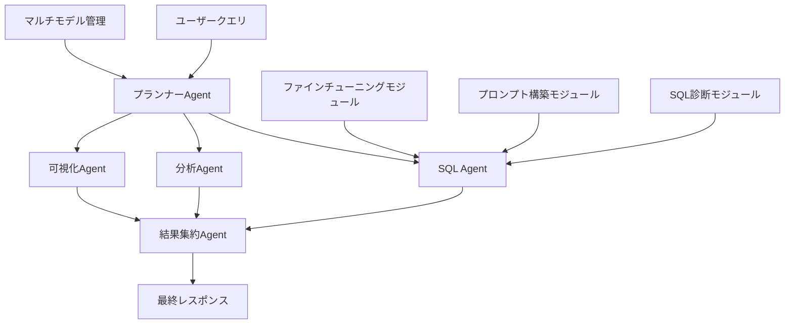

本記事は [arXiv:2407.11717 "DB-GPT: Empowering Database Interactions with Private Large Language Models"](https://arxiv.org/abs/2407.11717) の解説記事です。

この記事は [Zenn記事: LangGraph×Claude Sonnet 4.6でSQL統合Agentic RAGを実装する](https://zenn.dev/0h_n0/articles/58dc3076d2ffba) の深掘りです。

## 論文概要（Abstract）

LLMベースのデータベース操作システムは、(1)高コストなプロプライエタリLLMへの依存、(2)クラウドAPI利用時の機密データ漏洩リスク、(3)Text-to-SQL以外の複雑なDB操作への対応不足、という3つの課題を抱えている。著者ら（Xue, Jiang, Shi et al.）はこれらに対してDB-GPTを提案している。DB-GPTはオープンソースフレームワークであり、プライベートLLMのファインチューニングアルゴリズム、ハルシネーション抑制プロンプト戦略、エージェントベースの複雑タスク実行をパッケージとして提供する。著者らはBIRDベンチマークにおいて、プライベートLLM（LLaMA3-70B, SFT+RLHF）で57.32%、GPT-4oフルパイプラインで65.12%のDev EXを報告している。

## 情報源

- **arXiv ID**: 2407.11717
- **URL**: [https://arxiv.org/abs/2407.11717](https://arxiv.org/abs/2407.11717)
- **著者**: Siqiao Xue, Caigao Jiang, Wenhui Shi et al.
- **発表年**: 2024
- **分野**: cs.AI, cs.DB
- **Code**: [https://github.com/eosphoros-ai/DB-GPT](https://github.com/eosphoros-ai/DB-GPT)（Apache 2.0ライセンス）

## 背景と動機（Background & Motivation）

SQL統合Agentic RAGの実運用では、GPT-4oなどのクラウドAPIを利用するとデータベーススキーマやクエリデータが外部に送信される。医療・金融・法務ドメインではこれがプライバシー要件（HIPAA、GDPR等）に抵触する可能性がある。著者らはDB-GPTの開発動機として、以下の3つの課題を挙げている。

第一に、GPT-4oのAPIコストは出力1Kトークンあたり$0.06であり、高ボリューム環境では予算上の懸念がある。第二に、データベーススキーマや検索クエリをクラウドAPIに送信することはデータ漏洩リスクを伴う。第三に、既存システムの多くはText-to-SQLのみに特化しており、SQL診断・データ分析・レポート生成といった広範なDB操作には対応していない。

## 主要な貢献（Key Contributions）

- **貢献1**: LoRA/QLoRA/DPO/RLHF対応のText-to-SQLファインチューニングモジュール
- **貢献2**: カラム値アンカリング・外部キー強調・型認識を含むハルシネーション抑制プロンプト戦略
- **貢献3**: SQL Agent・分析Agent・可視化Agent・レポートAgentによるマルチエージェントDB操作
- **貢献4**: プライベートLLMとGPT-4oのコスト・精度・プライバシーのトレードオフ分析

## 技術的詳細（Technical Details）

### 5モジュールアーキテクチャ

DB-GPTは5つのコアモジュールで構成される。



### ファインチューニングモジュール

DB-GPTはオープンソースLLMのドメイン適応に複数のアルゴリズムを提供する。

**LoRAによるパラメータ効率的ファインチューニング**:

重み更新量を低ランク行列の積で近似する：

$$
\Delta W = BA, \quad B \in \mathbb{R}^{d \times r}, \quad A \in \mathbb{R}^{r \times k}, \quad r \ll \min(d, k)
$$

ここで、$d$ はモデル次元、$k$ は出力次元、$r$ はランク（典型的には16-64）。これにより訓練可能パラメータは全パラメータの0.1%未満に削減される。

**DPO（Direct Preference Optimization）損失関数**:

正解SQLと不正解SQLのペアから直接最適化する：

$$
\mathcal{L}_{\text{DPO}} = -\log \sigma \left( \beta \log \frac{\pi_\theta(y_w | x)}{\pi_{\text{ref}}(y_w | x)} - \beta \log \frac{\pi_\theta(y_l | x)}{\pi_{\text{ref}}(y_l | x)} \right)
$$

ここで、$y_w$ は正解SQL、$y_l$ は不正解SQL、$\pi_\theta$ は学習対象モデル、$\pi_{\text{ref}}$ は参照モデル（SFT後の初期モデル）、$\beta$ は温度パラメータ。

**対応モデル一覧**: LLaMA 2/3（7B-70B）、Mistral（7B）、CodeLlama（7B-34B）、DeepSeek-Coder（6.7B-33B）、Qwen2（7B-72B）、GLM-4（9B）。

### ハルシネーション抑制プロンプト構築

DB-GPT独自のプロンプト構築戦略（DB-GPT Prompt）は、Text-to-SQLにおけるLLMのハルシネーションを低減する目的で設計されている。

**3つのハルシネーション抑制テクニック**:

1. **カラム値アンカリング**: クエリで言及される具体的な値（例：「カリフォルニアからの注文」）について、DB内の正確な表現を事前に確認してからプロンプトに含める
2. **外部キー強調**: テーブル間のJOINパスを自然言語で明示的にリストし、誤ったJOIN生成を防止
3. **型認識**: カラムのデータ型と有効値範囲を含め、型ミスマッチを防止

著者らのアブレーション実験（論文Section 4.3）によると、各テクニックの累積効果は以下の通り：

| 構成 | Dev EX (%) | 増分 |
|------|-----------|------|
| 標準スキーマプロンプト | 48.7 | — |
| + カラムコメント | 52.3 | +3.6 |
| + サンプル行 | 55.1 | +2.8 |
| + 外部キー強調 | 57.8 | +2.7 |
| + 外部知識 | 58.4 | +0.6 |

### マルチエージェントDB操作

DB-GPTは4種のエージェントでText-to-SQL以外のDB操作もカバーする。

- **SQL Agent**: SQLの生成・実行・自己修正。最大3回のリトライで構文エラーやセマンティックエラーを修正
- **分析Agent**: クエリ結果の統計要約、トレンド検出、異常値特定
- **可視化Agent**: 適切なチャート種別（棒グラフ、折れ線、円グラフ）の選択とmatplotlib/plotlyコード生成
- **レポートAgent**: 上記エージェントの出力を統合し、Markdownフォーマットのレポートを生成

エージェント間は共有コンテキストオブジェクト（`AgentContext`）で通信する。

```python
class AgentContext:
    """エージェント間通信用の共有コンテキスト"""
    query: str              # ユーザークエリ
    schema: "DBSchema"      # データベーススキーマ
    sub_tasks: list         # 分解されたサブタスク
    results: dict           # 中間結果
    final_report: str       # 蓄積レポート
```

## 実験結果（Results）

### BIRD / Spider ベンチマーク

著者らが報告した主要結果（論文Section 4.2）：

| 手法 | モデル | BIRD Dev EX (%) |
|------|--------|-----------------|
| DIN-SQL | GPT-4 | 55.90 |
| DAIL-SQL | GPT-4 | 57.41 |
| DB-GPT (SFT) | LLaMA3-70B | 55.48 |
| DB-GPT (SFT) | DeepSeek-33B | 56.13 |
| DB-GPT (SFT+DPO) | DeepSeek-33B | 58.44 |
| DB-GPT (Full) | GPT-4o | 65.12 |

### コスト比較

著者らは1000クエリあたりのコスト比較を報告している（論文Section 4.4）：

| 運用方式 | コスト |
|---------|--------|
| GPT-4o API | 約$120 |
| 70B自己ホスト（A100） | 約$15（電気代） |
| 33B自己ホスト（A100） | 約$8（電気代） |

プライベートLLMとGPT-4oの精度差は2023年に15-20%あったが、2024年時点では5-8%に縮小しているとの分析も示されている。

### ファインチューニングアルゴリズムの比較

| アルゴリズム | ベースモデル | BIRD Dev EX (%) |
|------------|------------|-----------------|
| ファインチューニングなし | LLaMA3-70B | 42.1 |
| SFT (LoRA) | LLaMA3-70B | 55.48 |
| SFT + DPO | LLaMA3-70B | 57.32 |
| SFT + RLHF | LLaMA3-70B | 58.44 |

SFTだけで+13.4%の改善、さらにDPO/RLHFで+1.8%〜+3.0%の追加改善が報告されている。

## 実装のポイント（Implementation）

### pip installでの導入

DB-GPTは`pip install dbgpt`でインストール可能。GitHubリポジトリ（[eosphoros-ai/DB-GPT](https://github.com/eosphoros-ai/DB-GPT)）はApache 2.0ライセンスでアクティブにメンテナンスされている。

### デプロイオプション

DB-GPTは3つのデプロイ構成をサポートする。

1. **単一GPU**: bitsandbytesによる4bit/8bit量子化モデル（QLoRA）。A100 40GBで70Bモデルの推論が可能
2. **マルチGPU**: vLLM + PagedAttentionによるテンソル並列。2-4枚のGPUでスループットを線形にスケール
3. **分散デプロイ**: 複数マシンでのモデルシャーディング。Ray Serveベースのオーケストレーション

### SQL診断モジュール

DB-GPTはSQL生成だけでなく、既存SQLの診断・最適化にも対応している。SQL診断モジュールは以下の3ステップで動作する。

1. **SQLパース**: 入力SQLをAST（Abstract Syntax Tree）に変換し、テーブル参照・JOIN条件・WHERE句を抽出
2. **実行プラン分析**: `EXPLAIN ANALYZE`の結果をLLMが解析し、フルテーブルスキャン・インデックス未使用・不要なサブクエリを検出
3. **最適化提案**: 検出された問題に対してインデックス作成・クエリリライト・パーティショニングなどの改善案を自然言語で生成

この診断機能は、Zenn記事で扱ったSQL統合Agentic RAGの運用フェーズにおいて、パフォーマンスボトルネックの自動検出に活用できる。

## 実運用への応用（Practical Applications）

### SQL統合Agentic RAGとの関連

Zenn記事ではClaude Sonnet 4.6のAPIを使用してSQL検索ノードを実装しているが、DB-GPTのアプローチを適用すると以下の変更が可能：

1. **プライバシー保護**: LLaMA3-70BやDeepSeek-33Bをオンプレミスで運用し、DB スキーマとクエリデータの外部送信を排除
2. **コスト削減**: API課金から自己ホスティングへの移行で、1000クエリあたり$120→$8-15に削減可能
3. **DB-GPT Promptの適用**: Zenn記事のSQL検索ノードのプロンプトに、カラム値アンカリング・外部キー強調を追加することで、SQL生成精度を改善可能

### 制約事項

- プライベートLLM（DeepSeek-33B）のBIRD精度はGPT-4oフルパイプラインより約7%低い（58.44% vs 65.12%）
- 70Bモデルの運用にはA100 GPU（80GB VRAM）が必要であり、初期投資コストが高い
- マルチエージェントオーケストレーションの複雑性が増すため、デバッグやモニタリングの仕組みが別途必要

## 関連研究（Related Work）

- **CHESS**（Talaei et al., 2024, arXiv:2405.16755）: Entity-Schema Linking → Column Filtering → Cell Value Search → SQL Generationの4段パイプラインでBIRD 73%を達成。DB-GPTはCHESSの手法をスキーマリンキング部分で参照している
- **DAIL-SQL**（Gao et al., 2023）: ICL（In-Context Learning）の例選択戦略を体系化。DB-GPTのDAIL-SQL統合モジュールでこの選択アルゴリズムを活用
- **MAC-SQL**（Wang et al., 2023）: マルチエージェント協調によるSQL生成。Decomposer・Selector・Refinerの役割分担はDB-GPTのエージェントアーキテクチャと設計思想が類似

## まとめと今後の展望

DB-GPTは、Text-to-SQLにとどまらないDB操作の全領域（SQL診断、データ分析、レポート生成）を、プライベートLLMで実現するOSSフレームワークである。LoRA/DPOによるファインチューニングとDB-GPT Promptの組み合わせにより、プロプライエタリLLMとの精度差を5-8%まで縮小している。

SQL統合Agentic RAGの実務者にとって、DB-GPTの設計パターン（特にハルシネーション抑制プロンプト戦略とマルチエージェントアーキテクチャ）は、LangGraphベースのシステムへの直接的な適用が可能である。データプライバシー要件がある環境では、DB-GPTベースの自己ホスティング構成が現実的な選択肢となる。

今後の研究方向として、著者らは以下の3点を挙げている。第一に、より小規模なモデル（7B-13B）でのText-to-SQL精度改善。蒸留やMoE（Mixture of Experts）アーキテクチャの適用が検討されている。第二に、マルチデータベース対応。現在はMySQL/PostgreSQL/SQLiteが主要対象だが、NoSQL（MongoDB）やグラフDB（Neo4j）への拡張が計画されている。第三に、RAGとの統合強化。ベクトル検索によるスキーマ補完とSQL生成の統合パイプライン（本Zenn記事のAgentic RAGアプローチに相当）が、DB-GPTの次期ロードマップに含まれている。

## 参考文献

- **arXiv**: [https://arxiv.org/abs/2407.11717](https://arxiv.org/abs/2407.11717)
- **Code**: [https://github.com/eosphoros-ai/DB-GPT](https://github.com/eosphoros-ai/DB-GPT)
- **Related Zenn article**: [https://zenn.dev/0h_n0/articles/58dc3076d2ffba](https://zenn.dev/0h_n0/articles/58dc3076d2ffba)
