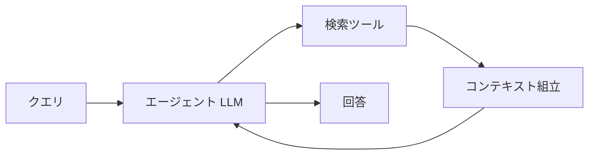
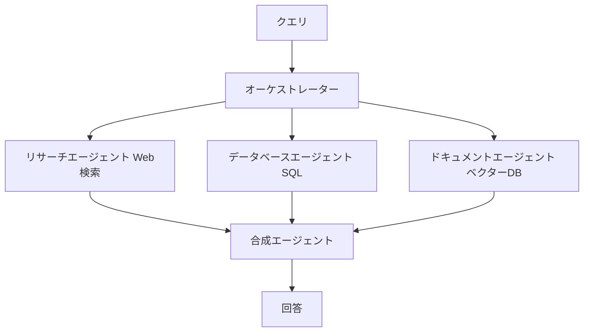

本記事は [arXiv:2501.09516 "Agentic Retrieval-Augmented Generation: A Survey on Agentic RAG"](https://arxiv.org/abs/2501.09516) の解説記事です。

この記事は [Zenn記事: LangGraph×Claude Sonnet 4.6でSQL統合Agentic RAGを実装する](https://zenn.dev/0h_n0/articles/58dc3076d2ffba) の深掘りです。

## 論文概要（Abstract）

LLMの静的知識・コンテキスト制約・リアルタイム情報アクセス不能といった限界に対して、RAGは動的な情報取得で一部を解消してきた。しかし、従来のRAGは複雑なマルチステップタスクに必要な推論能力が不足している。著者ら（Singh, Ehtesham, Kumar, Talaei Khoei）は、自律AIエージェントをRAGパイプラインに統合するAgentic RAGを体系的にサーベイし、4つのアーキテクチャパターン（単一エージェント、マルチエージェント、階層型、適応型）に分類している。医療・法律・金融・教育・自律コーディングの5ドメインへの応用可能性も整理されている。

## 情報源

- **arXiv ID**: 2501.09516
- **URL**: [https://arxiv.org/abs/2501.09516](https://arxiv.org/abs/2501.09516)
- **著者**: Aditi Singh, Abul Ehtesham, Saket Kumar, Tala Talaei Khoei
- **発表年**: 2025
- **分野**: cs.AI, cs.IR, cs.LG

## 背景と動機（Background & Motivation）

RAGはLewis et al. (2020, NeurIPS) により導入され、推論時に外部文書を動的に取得することでLLMの知識をグラウンディングする手法として広く普及した。しかし、著者らは標準的なRAGの3つの限界を指摘している。第一に、固定的な検索戦略（異なるクエリ種別に適応できない）。第二に、単一ラウンドの検索（中間結果に基づくクエリ改善ができない）。第三に、計画能力の欠如（複雑なタスクをサブタスクに分解できない）。

Agentic RAGはこれらの限界を、自律エージェントの計画・ツール使用・適応能力をRAGパイプラインに統合することで解消するパラダイムとして位置づけられている。

## 主要な貢献（Key Contributions）

- **貢献1**: RAGの4世代進化（Naive → Advanced → Modular → Agentic）の体系的整理
- **貢献2**: Agentic RAGの4アーキテクチャパターンの分類と比較
- **貢献3**: 5つのドメイン応用（医療・法律・金融・教育・コーディング）のケーススタディ
- **貢献4**: Standard RAG vs Agentic RAGの定量的比較（レイテンシ・コスト・精度のトレードオフ）

## 技術的詳細（Technical Details）

### RAGの4世代進化

著者らはRAGの進化を4世代に分類している（論文Section 2.1）。

**RAG 1.0（Naive RAG）**: 単純なretrieve-then-generateパイプライン。固定のk-NN検索でベクターDBから文書取得 → LLMで回答生成。フィードバックループなし。

**RAG 2.0（Advanced RAG）**: クエリリライティング、検索結果のリランキング、反復的改善が導入された世代。

**RAG 3.0（Modular RAG）**: プラグアンドプレイの検索コンポーネント、複数の検索戦略、異なるナレッジソース間のルーティングが可能。

**Agentic RAG**: 自律エージェントが検索プロセスを制御。動的計画、ツール使用、マルチエージェント協調が特徴。

### 4つのアーキテクチャパターン

#### パターン1: 単一エージェントRAG

単一のLLMエージェントが検索と生成の全パイプラインを管理する。



代表的な手法として以下が挙げられている：
- **Self-RAG**（Asai et al., 2023, ICLR 2024）: 特殊トークン（`[Retrieve]`, `[IsRel]`, `[IsSup]`, `[IsUse]`）で検索の要否・関連性・支持度を判定
- **FLARE**（Jiang et al., 2023, EMNLP）: 前方参照型のアクティブ検索。モデルが情報不足を予測した時点で検索を発動

#### パターン2: マルチエージェントRAG

複数の専門エージェントが協調して複雑なクエリに対応する。



Zenn記事のSQL統合Agentic RAGアーキテクチャは、このマルチエージェントパターンの変形として位置づけることができる。SQL検索ノードとベクトル検索ノードがそれぞれ専門エージェントの役割を担い、ルーターノードがオーケストレーターとして機能する。

著者らはエージェント間の通信プロトコルとして以下の3種を挙げている：
- **共有メモリ**（ブラックボードアーキテクチャ）: 共通の状態オブジェクトを全エージェントが参照・更新
- **メッセージパッシング**（アクターモデル）: エージェント間で非同期メッセージ交換
- **リクエスト・レスポンス**（コーディネーターパターン）: 中央コーディネーターが各エージェントに指示を出す

#### パターン3: 階層型Agentic RAG

オーケストレーターエージェントが複数の専門エージェントを管理する階層構造。各専門エージェントは独自のツールセットを持つ。

オーケストレーション戦略として、逐次実行（predefined order）、並列実行（simultaneous）、動的実行（クエリに応じてエージェントを選択）の3種が記述されている。

#### パターン4: 適応型RAGシステム

クエリの複雑度に応じて検索戦略を動的に調整するシステム。著者らは4段階の複雑度レベルを定義している：

- **Level 1（Simple）**: LLMの内蔵知識で直接回答
- **Level 2（Moderate）**: 1ホップの検索
- **Level 3（Complex）**: マルチホップ検索
- **Level 4（Very Complex）**: マルチエージェント協調

### エージェントのコアコンポーネント

著者らは、Agentic RAGエージェントが持つべきコンポーネントを4層に分類している（論文Section 3）。

**メモリシステム**:
- 感覚記憶（In-Context）: 現在のクエリと会話履歴。コンテキストウィンドウにより制約
- 作業記憶: 中間推論ステップと部分結果
- 長期記憶: ベクターDB（Pinecone, Weaviate, Chroma, FAISS）、知識グラフ（Neo4j）、RDB
- エピソード記憶: 過去のインタラクションログ

**検索ツール統合**:
- 密検索（Dense）: DPR, ColBERT, BGE
- 疎検索（Sparse）: BM25, TF-IDF
- ハイブリッド検索: 密検索と疎検索の重み付き統合

$$
\text{score}_{\text{hybrid}} = \alpha \times \text{score}_{\text{dense}} + (1 - \alpha) \times \text{score}_{\text{sparse}}
$$

ここで $\alpha$ はハイパーパラメータ（デフォルト0.5）。

**計画と推論**:
- ReAct（Yao et al., 2023, ICLR）: Thought → Action → Observation のループ
- Tree of Thoughts（Yao et al., 2023b）: 複数の推論パスを並行探索
- FLARE: 不確実性に基づくプロアクティブ検索

### 評価フレームワーク

著者らはRAGシステムの評価にRAGAS（Es et al., 2023）を参照し、以下の指標を整理している。

**Faithfulness（忠実度）**:

$$
\text{Faithfulness} = \frac{|\text{コンテキストで支持される主張}|}{|\text{回答中の主張総数}|}
$$

**Context Recall（文脈想起率）**:

$$
\text{Context Recall} = \frac{|\text{コンテキストに含まれる正解主張}|}{|\text{正解主張の総数}|}
$$

## 実装のポイント（Implementation）

サーベイ論文であるため独自の実装はないが、著者らが紹介する設計パターンはSQL統合Agentic RAGの構築に直接応用可能である。

### Multi-Query Retrieveパターン

著者らはMulti-Query検索の設計パターンを示している（論文Section 6.1）。1つのクエリからN個のバリエーションを生成し、各バリエーションで検索を実行した後、重複排除とリランキングを行う。

```python
def multi_query_retrieve(
    query: str,
    llm,
    retriever,
    n: int = 5,
) -> list:
    """Multi-Query検索パターンの実装例

    Args:
        query: ユーザーの自然言語クエリ
        llm: バリエーション生成用のLLM
        retriever: 検索実行用のリトリーバー
        n: 生成するクエリバリエーション数

    Returns:
        リランク済みの文書リスト
    """
    # N個のクエリバリエーション生成
    variations = llm.generate_variations(query, n=n)

    # 各バリエーションで検索
    all_docs = []
    for var in variations:
        docs = retriever.retrieve(var)
        all_docs.extend(docs)

    # 重複排除とリランキング
    return rerank(deduplicate(all_docs), query)
```

### HyDE（Hypothetical Document Embedding）

Gao et al. (2023, ACL) のHyDEパターンも紹介されている。クエリに回答する仮想的な文書をLLMで生成し、その埋め込みで検索を行うことで、クエリと文書の語彙ギャップを解消する。

## Standard RAG vs Agentic RAG の比較

著者らはサーベイの総括として以下の比較表を提示している（論文Section 8）。

| 特徴 | Standard RAG | Agentic RAG |
|------|-------------|-------------|
| 検索 | 固定、単一ステップ | 動的、マルチステップ |
| 計画能力 | なし | 完全な計画能力 |
| ツール使用 | 限定的 | 広範 |
| 適応性 | 低い | 高い |
| レイテンシ | 低（1-3秒） | 高（5-60秒） |
| コスト | 低 | 高（5-20倍） |
| 精度 | 中程度 | 高 |
| 複雑タスク | 不得意 | 得意 |

## 実運用への応用（Practical Applications）

### SQL統合Agentic RAGとの関連

Zenn記事のアーキテクチャ（ルーター → SQL検索 / ベクトル検索 → 回答生成）は、このサーベイの分類ではマルチエージェントRAGの変形、かつ適応型RAGの要素（クエリルーティング）を持つハイブリッドパターンとして位置づけられる。

著者らの分類に基づくと、以下の設計改善が考えられる：

1. **Self-RAGの検索判定統合**: ルーターノードにSelf-RAGの`[Retrieve]`トークン的な検索要否判定を追加。簡単なクエリ（「営業部のメンバー数」）にはキャッシュから回答し、検索を省略

2. **エピソード記憶の活用**: 過去のSQL検索パターン（どのクエリがどのテーブルにルーティングされたか）をエピソード記憶として蓄積し、ルーティング精度を継続改善

3. **FLAREの段階的検索**: ベクトル検索結果が不十分な場合に追加検索を発動するFLAREパターンの導入

### 課題と制約

著者らは主要な課題として以下を挙げている：

- **レイテンシ**: Agentic RAGは単純RAGの5-20倍のレイテンシを伴う。Zenn記事のSQL検索パス（約800ms）にCHESSのような多段パイプラインを追加すると数秒に増加する可能性がある
- **コスト**: 複数エージェント・複数LLMコールによりAPIコストが5-20倍に増大。クエリボリュームに応じたコスト管理が必要
- **評価の標準化不足**: Agentic RAG固有のベンチマークが未確立。RAGASは一部の指標をカバーするが、エージェント間協調の品質を測定する指標は未整備

## 関連研究（Related Work）

- **Self-RAG**（Asai et al., 2023, ICLR 2024）: 自己反省型の検索要否判定。Agentic RAGの単一エージェントパターンの代表例
- **GraphRAG**（Edge et al., 2024, Microsoft）: ドキュメントからエンティティグラフを構築し、コミュニティ検出によるマルチホップ検索を実現
- **ReAct**（Yao et al., 2023, ICLR 2023）: Reasoning + Acting フレームワーク。Agentic RAGの推論基盤として広く採用

## まとめと今後の展望

本サーベイは、Agentic RAGの設計空間を4つのアーキテクチャパターンに体系化し、Standard RAGからの進化の道筋を明確にした。SQL統合Agentic RAGを構築する実務者にとって、サーベイの分類フレームワークは自システムの設計位置を把握し、改善方向を特定するための地図として機能する。

一方、著者らが指摘する通り、レイテンシ（5-60秒）とコスト（5-20倍）のトレードオフはAgentic RAGの本番投入における主要な障壁であり、クエリ複雑度に応じた適応的なアーキテクチャ選択（Adaptive RAG的アプローチ）が現実的な解決策として推奨される。

### 今後の研究方向

著者らは新興の研究方向として以下を挙げている：

- **長コンテキストLLM**: 100万トークン超のコンテキストウィンドウはRAGの必要性を減少させる可能性があるが、情報鮮度とコスト効率の観点から検索は依然として必要
- **マルチモーダルAgentic RAG**: テキストに加えて画像・音声・動画を横断的に検索する能力の統合
- **Neuroplastic RAG**: インタラクションからオンライン学習し、知識ベースを動的に更新するシステム

これらの方向性は、SQL統合Agentic RAGにおいても、構造化データ（SQL）と非構造化データ（ベクトル検索）に加えて、マルチモーダルデータ（画像・音声）を統合するアーキテクチャへの拡張を示唆している。

## 参考文献

- **arXiv**: [https://arxiv.org/abs/2501.09516](https://arxiv.org/abs/2501.09516)
- **Lewis, P., et al.** (2020). Retrieval-Augmented Generation for Knowledge-Intensive NLP Tasks. NeurIPS 2020.
- **Asai, A., et al.** (2023). Self-RAG. ICLR 2024.
- **Yao, S., et al.** (2023). ReAct. ICLR 2023.
- **Related Zenn article**: [https://zenn.dev/0h_n0/articles/58dc3076d2ffba](https://zenn.dev/0h_n0/articles/58dc3076d2ffba)
