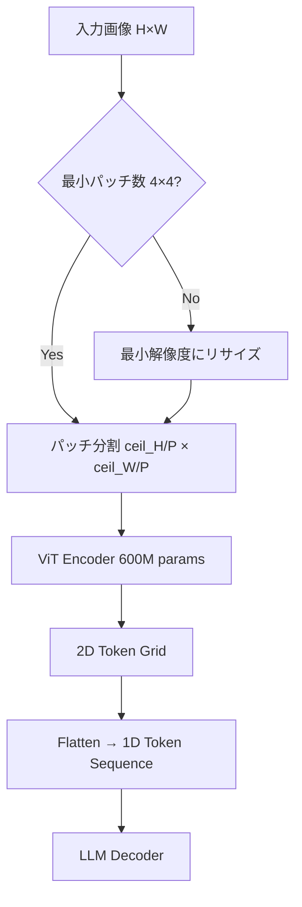

本記事は [Qwen2.5-VL Technical Report (arXiv:2501.12387)](https://arxiv.org/abs/2501.12387) の解説記事です。

## 論文概要（Abstract）

Qwen2.5-VL は Alibaba Cloud が2025年1月に発表したオープンソースの Vision-Language Model（VLM）である。3B / 7B / 72B の3サイズで展開され、72B モデルは MMMU ベンチマークで70.2%を達成し、GPT-4o（69.1%）を上回ったと著者らは報告している。技術的な革新点として、**Naive Dynamic Resolution**（任意解像度の画像をパディングなしで処理）、**MRoPE**（Multimodal Rotary Position Embedding、テキスト・画像・動画に統一された位置エンコーディング）が挙げられる。Apache 2.0ライセンス（3B/7B）で公開されており、consumer GPU でも動作する点が実用上の大きな利点である。

この記事は [Zenn記事: Gemini 3.1 Pro マルチモーダルAPI実践ガイド：画像・音声・動画をPythonで統合処理する](https://zenn.dev/0h_n0/articles/df5295d69a456f) の深掘りです。

## 情報源

- **arXiv ID**: 2501.12387
- **URL**: [https://arxiv.org/abs/2501.12387](https://arxiv.org/abs/2501.12387)
- **著者**: Qwen Team, Alibaba Cloud（Shuai Bai, Keqin Chen, Xuejing Liu et al.）
- **発表年**: 2025
- **分野**: cs.CV, cs.CL

## 背景と動機（Background & Motivation）

Gemini 3.1 Pro のようなクローズドモデルは高いマルチモーダル性能を示す一方で、以下の制約がある。

- **コスト**: API 呼び出しごとに課金され、大量処理ではコストが急増する
- **カスタマイズ不可**: ファインチューニングができないため、特定ドメインへの最適化が困難
- **データプライバシー**: 機密データを外部 API に送信するリスクがある
- **レイテンシ**: ネットワーク経由のため、エッジデバイスでのリアルタイム処理に不向き

Qwen2.5-VL は、これらの課題に対するオープンソースの代替として開発された。Gemini 等のクローズドモデルと同等の性能を、ローカル環境で実現することを目指している。

## 主要な貢献（Key Contributions）

- **Naive Dynamic Resolution**: 任意の解像度・アスペクト比の画像をパディングなしで処理。画像ごとにパッチ数を動的に決定する
- **MRoPE（Multimodal Rotary Position Embedding）**: テキスト・画像・動画のトークンに対して統一された位置エンコーディングを適用。動画フレームの時間情報をトークンレベルで埋め込む
- **3段階学習パイプライン**: 事前学習 → SFT（Supervised Fine-tuning）→ RLHF で段階的に性能を向上
- **MMMU 70.2%（72B）**: GPT-4o (69.1%) を超えるオープンソースモデルとして初の成果

## 技術的詳細（Technical Details）

### Naive Dynamic Resolution

従来の VLM は入力画像を固定解像度（例: 448×448）にリサイズする必要があった。この方式では、アスペクト比の異なる画像に対してパディング（余白の追加）や不均一なリサイズが発生し、情報損失を引き起こす。

Qwen2.5-VL は**パディングを一切使用しない**動的解像度処理を導入した。

$$
N_{\text{patches}}(H, W) = \left\lceil \frac{H}{P} \right\rceil \times \left\lceil \frac{W}{P} \right\rceil
$$

ここで、$H$, $W$ は入力画像のピクセル解像度、$P$ はパッチサイズ（14ピクセル）である。

**処理フロー**:



**パッチ数の上限**: 解像度が高い画像ではパッチ数が爆発するため、最大パッチ数の制約が設けられている。

$$
N_{\max} = \left(\frac{280}{P}\right)^2 = 20^2 = 400 \text{ パッチ}
$$

上限を超える場合は、アスペクト比を保持したままリサイズされる。

### MRoPE（Multimodal Rotary Position Embedding）

標準の RoPE は1次元の位置情報のみを扱うが、MRoPE は**3つの独立した位置軸**を導入する。

$$
\text{MRoPE}(\mathbf{x}, t, h, w) = \mathbf{x} \cdot e^{i(t \cdot \theta_t + h \cdot \theta_h + w \cdot \theta_w)}
$$

ここで、
- $\mathbf{x}$: トークンの隠れ表現
- $t$: 時間位置（テキストのトークン位置 or 動画のフレーム番号）
- $h$: 空間位置（画像パッチの行インデックス）
- $w$: 空間位置（画像パッチの列インデックス）
- $\theta_t, \theta_h, \theta_w$: 各軸の基底周波数

**テキストトークンの場合**: $h = w = 0$ となり、標準の RoPE と等価になる。

$$
\text{MRoPE}_{\text{text}}(\mathbf{x}, t) = \mathbf{x} \cdot e^{i \cdot t \cdot \theta_t}
$$

**画像トークンの場合**: $t$ は固定値、$h$ と $w$ はパッチの2D位置を表す。

$$
\text{MRoPE}_{\text{image}}(\mathbf{x}, h, w) = \mathbf{x} \cdot e^{i(h \cdot \theta_h + w \cdot \theta_w)}
$$

**動画トークンの場合**: $t$ はフレーム番号、$h$ と $w$ はフレーム内のパッチ位置を表す。

$$
\text{MRoPE}_{\text{video}}(\mathbf{x}, t, h, w) = \mathbf{x} \cdot e^{i(t \cdot \theta_t + h \cdot \theta_h + w \cdot \theta_w)}
$$

この設計により、動画フレーム間の時間的順序関係がトークンレベルで自然にエンコードされる。

### アルゴリズム: MRoPE の実装

```python
import torch
import torch.nn as nn
import math


class MRoPE(nn.Module):
    """Multimodal Rotary Position Embedding

    テキスト・画像・動画のトークンに対して
    統一された位置エンコーディングを適用する。

    Args:
        d_model: モデルの隠れ次元数
        base: RoPE基底周波数
    """

    def __init__(self, d_model: int, base: float = 10000.0):
        super().__init__()
        self.d_model = d_model
        self.d_per_axis = d_model // 3  # 3軸に均等分割

        # 各軸の周波数
        inv_freq = 1.0 / (
            base ** (torch.arange(0, self.d_per_axis, 2).float() / self.d_per_axis)
        )
        self.register_buffer("inv_freq", inv_freq)

    def forward(
        self,
        x: torch.Tensor,
        t_pos: torch.Tensor,
        h_pos: torch.Tensor,
        w_pos: torch.Tensor,
    ) -> torch.Tensor:
        """MRoPEを適用

        Args:
            x: (B, L, D) の入力テンソル
            t_pos: (B, L) 時間位置
            h_pos: (B, L) 高さ位置
            w_pos: (B, L) 幅位置

        Returns:
            (B, L, D) のRoPE適用済みテンソル
        """
        # 各軸の回転角度を計算
        t_angles = torch.einsum("bl,d->bld", t_pos.float(), self.inv_freq)
        h_angles = torch.einsum("bl,d->bld", h_pos.float(), self.inv_freq)
        w_angles = torch.einsum("bl,d->bld", w_pos.float(), self.inv_freq)

        # cos/sin を計算
        cos_t, sin_t = t_angles.cos(), t_angles.sin()
        cos_h, sin_h = h_angles.cos(), h_angles.sin()
        cos_w, sin_w = w_angles.cos(), w_angles.sin()

        # 3軸を結合
        cos_all = torch.cat([cos_t, cos_h, cos_w], dim=-1)
        sin_all = torch.cat([sin_t, sin_h, sin_w], dim=-1)

        # RoPE回転を適用
        x_rot = x[..., : self.d_model]
        x_pass = x[..., self.d_model :]

        x1 = x_rot[..., ::2]
        x2 = x_rot[..., 1::2]

        cos_all = cos_all[..., : x1.shape[-1]]
        sin_all = sin_all[..., : x1.shape[-1]]

        out1 = x1 * cos_all - x2 * sin_all
        out2 = x1 * sin_all + x2 * cos_all

        x_rot = torch.stack([out1, out2], dim=-1).flatten(-2)
        return torch.cat([x_rot, x_pass], dim=-1)
```

### 3段階学習パイプライン

Qwen2.5-VL の学習は3段階で構成される。

**Stage 1: 事前学習（Pre-training）**
- データ: テキスト-画像ペア（数十億規模）
- 目的: 視覚エンコーダとLLMの初期アライメント
- 視覚エンコーダ（ViT-bigG, 600M params）のみ更新、LLMは凍結

**Stage 2: SFT（Supervised Fine-tuning）**
- データ: 指示-応答ペア（画像QA、動画QA、文書理解等）
- 目的: 指示追従能力の獲得
- 全パラメータを更新

**Stage 3: RLHF（Reinforcement Learning from Human Feedback）**
- データ: 人間の選好データ
- 目的: 出力品質・安全性の向上
- DPO（Direct Preference Optimization）を使用

## 実装のポイント（Implementation）

**1. 量子化によるメモリ削減**: AWQ 4bit 量子化モデルが公開されており、7B モデルが約4GB VRAM で動作する。

```bash
# HuggingFaceからの量子化モデル取得
pip install transformers accelerate
# Qwen/Qwen2.5-VL-7B-Instruct-AWQ を使用
```

**2. vLLM / SGLang での高速推論**: HuggingFace Transformers の他、vLLM と SGLang での推論がサポートされている。バッチ処理時のスループットは vLLM が優位。

**3. 動画処理のフレーム数制限**: 最大768フレームまで処理可能。長尺動画の場合はサンプリングレートの調整が必要。

**4. ファインチューニング**: LoRA による効率的なファインチューニングが可能。医療画像診断やリモートセンシングなど、特定ドメインへの適応に有用。

## 実験結果（Results）

### 総合評価

著者らが報告したベンチマーク結果（論文 Table 1-3 より）。

| ベンチマーク | Qwen2.5-VL 72B | Qwen2.5-VL 7B | GPT-4o | Gemini 1.5 Pro |
|-------------|---------------|---------------|--------|----------------|
| MMMU | 70.2% | 58.6% | 69.1% | 60.6% |
| MathVista | 74.8% | 68.2% | 63.8% | 58.5% |
| DocVQA | 96.4% | 94.5% | 92.8% | 93.1% |
| VideoMME | 73.3% | 65.1% | 71.9% | 75.0% |
| OCRBench | 877 | 864 | 736 | - |

論文 Table 1 より。72B はMMMU・MathVista・DocVQA・OCRBenchで GPT-4o を上回っている。VideoMME では Gemini 1.5 Pro が依然として優位。

### サイズ別の性能特性

| モデル | パラメータ数 | VRAM（量子化なし） | VRAM（AWQ 4bit） | ライセンス |
|-------|------------|-------------------|------------------|----------|
| Qwen2.5-VL 3B | 3B | 約8GB | 約3GB | Apache 2.0 |
| Qwen2.5-VL 7B | 7B | 約16GB | 約4GB | Apache 2.0 |
| Qwen2.5-VL 72B | 72B | 約150GB | 約40GB | Qwen Commercial |

7B モデルは consumer GPU（RTX 4090, 24GB）で量子化なしでも動作し、多くのベンチマークで同サイズの OSS モデルの中で最高性能を示している。

**注意点**: ベンチマーク結果は著者ら（Alibaba Cloud）による自己評価であり、評価プロトコルの詳細は論文に記載されているが、第三者による独立検証は限定的である。

## 実運用への応用（Practical Applications）

Zenn記事では Gemini 3.1 Pro（クローズドモデル）を使用した実装を紹介しているが、Qwen2.5-VL は以下のシナリオでの代替として検討に値する。

**1. コスト削減**: 大量の画像・動画を処理する場合、API コストが課題になる。Qwen2.5-VL 7B をローカルで運用すれば、GPU のランニングコスト（例: A100 のクラウド時間単価 $1-3/h）のみで済む。

**2. オフライン処理**: 機密データ（医療画像、社内文書等）を外部 API に送信できない場合に有効。

**3. カスタマイズ**: LoRA ファインチューニングにより、特定ドメインの性能を向上させることが可能。Gemini API ではファインチューニングは提供されていない。

**4. エッジデプロイ**: 3B モデルは Jetson Orin 等のエッジデバイスでも動作可能。工場の品質検査やドローン映像のリアルタイム解析などに応用できる。

## 関連研究（Related Work）

- **InternVL3 (Shanghai AI Lab, 2025, arXiv:2501.09755)**: OSS VLM のもう一つの有力候補。Qwen2.5-VL と同規模のモデルで、一部ベンチマークでは Qwen を上回る。
- **NVLM 1.0 (NVIDIA, 2024, arXiv:2408.15980)**: NVIDIA が開発したフロンティア級 VLM。テキスト性能を劣化させない VLM 学習手法を提案。
- **LLaVA-1.6 (Microsoft, 2024, arXiv:2401.13601)**: 効率的な視覚指示チューニングの先駆的研究。Qwen2.5-VL の SFT パイプラインに影響を与えた。
- **Gemini 1.0/1.5 (Google DeepMind, 2023-2024)**: クローズドモデルのベースライン。Qwen2.5-VL はこれらと同等以上の性能をOSSで実現することを目標としている。

## まとめと今後の展望

Qwen2.5-VL は、クローズドモデル（Gemini, GPT-4o）と同等の性能をオープンソースで実現した VLM である。特に MRoPE による統一的な位置エンコーディングと Naive Dynamic Resolution は、マルチモーダルモデルの設計における重要な技術的貢献である。

Zenn記事で紹介されている Gemini 3.1 Pro API の代替として、コスト・プライバシー・カスタマイズの観点から Qwen2.5-VL は有力な選択肢となる。ただし、API のシンプルさ（`genai.Client()` 1行で開始できる Gemini）とローカル運用の運用負荷はトレードオフであり、ユースケースに応じた選択が求められる。

今後は、より小さなモデル（1B以下）でのエッジ最適化、音声モダリティの追加、推論能力のさらなる強化が期待される。

## 参考文献

- **arXiv**: [https://arxiv.org/abs/2501.12387](https://arxiv.org/abs/2501.12387)
- **Code**: [https://github.com/QwenLM/Qwen2-VL](https://github.com/QwenLM/Qwen2-VL)
- **HuggingFace**: [https://huggingface.co/Qwen/Qwen2.5-VL-7B-Instruct](https://huggingface.co/Qwen/Qwen2.5-VL-7B-Instruct)
- **Related Zenn article**: [https://zenn.dev/0h_n0/articles/df5295d69a456f](https://zenn.dev/0h_n0/articles/df5295d69a456f)
