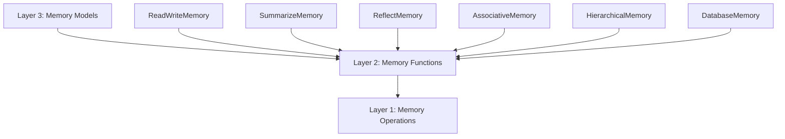

本記事は [arXiv:2501.17893](https://arxiv.org/abs/2501.17893) の解説記事です。

## 論文概要（Abstract）

MemEngineは、LLMエージェントのメモリシステムを統一的かつモジュラーに構築するためのライブラリである。著者らは、既存のLLMエージェントがメモリを断片的かつアドホックに実装している問題を指摘し、Memory Operations（21種のアトミックプリミティブ）→ Memory Functions（11種の構成機能）→ Memory Models（6種のタスク特化型メモリシステム）の3層アーキテクチャを提案している。5つの多様なタスク（対話型QA、知識集約型QA、創作、推薦、AIコンパニオン）における実験から、タスク特性に応じた最適なメモリ設計パターンと、ハイブリッド検索がシングルモダリティ検索を一貫して上回るという知見が報告されている。

この記事は [Zenn記事: LangGraph×Bedrock AgentCore Memoryで社内検索エージェントのメモリを本番運用する](https://zenn.dev/0h_n0/articles/b622546d617231) の深掘りです。

## 情報源

- **arXiv ID**: 2501.17893
- **URL**: [https://arxiv.org/abs/2501.17893](https://arxiv.org/abs/2501.17893)
- **著者**: Zeyu Zhang, Quanyu Dai, Xiao-Ming Wu, Xu Chen, Rui Li, Zhenhua Dong, Zheng Zhang, Ji-Rong Wen
- **所属**: Renmin University of China / Huawei Noah's Ark Lab / Hong Kong Polytechnic University
- **発表年**: 2025
- **分野**: cs.AI, cs.CL
- **コード**: [https://github.com/nuster1128/MemEngine](https://github.com/nuster1128/MemEngine)（Apache 2.0）

## 背景と動機（Background & Motivation）

LLMエージェントのメモリ実装には以下の3つの構造的問題がある。

1. **断片化**: メモリ実装がプロジェクトごとに分散しており、インターフェースに一貫性がない
2. **アドホック設計**: 特定ユースケース向けに設計され、再利用性が考慮されていない
3. **ベンチマーク不在**: 異なるメモリアプローチを体系的に比較する評価フレームワークが存在しない

Zenn記事で扱っているBedrock AgentCore Memoryは「セマンティック」「サマリー」「ユーザー嗜好」の3つのビルトイン戦略を提供しているが、これらがどのようなタスクで有効なのか、他のメモリ設計と比較してどう位置付けられるのかという体系的な知見は不足している。MemEngineはまさにこの問題に対し、メモリ設計の探索を容易にするフレームワークを提供する。

## 主要な貢献（Key Contributions）

著者らは以下の5点を貢献として挙げている。

- **統一インターフェース**: `memorize`, `recall`, `reflect`, `summarize`, `forget`, `consolidate` の6メソッドで全モデル共通のAPIを実現
- **モジュラー設計**: コンポーネントの組み合わせによるカスタムメモリシステムの構築
- **包括的カバレッジ**: 21操作・11機能・6モデルで主要なメモリパラダイムを網羅
- **体系的ベンチマーク**: 5つの多様なタスクでの比較実験を提供
- **実践的ガイダンス**: タスクタイプ別の推奨メモリ設計を明示

## 技術的詳細（Technical Details）

### 3層メモリアーキテクチャ

MemEngineの中核設計は3層の抽象化にある。



#### Layer 1: Memory Operations（21種のアトミックプリミティブ）

最低レベルの操作レイヤーは3カテゴリに分類される。

**Write Operations（書き込み4種）**:

| 操作名 | 機能 |
|--------|------|
| `WriteOperation` | 情報単位の基本保存 |
| `SummarizeWrite` | 要約を生成して書き込み |
| `ReflectWrite` | 反省・洞察を生成して保存 |
| `DatabaseWrite` | 構造化DBへの書き込み |

**Read Operations（読み出し7種）**:

| 操作名 | 機能 |
|--------|------|
| `RecencyRead` | 時間的新しさに基づく取得 |
| `ImportanceRead` | 重要度スコアに基づく取得 |
| `SemanticRead` | ベクトル類似度による取得 |
| `KeywordRead` | BM25/キーワードによる取得 |
| `HybridRead` | 複数戦略の組み合わせ |
| `DatabaseRead` | 構造化DBクエリ |
| `ReflectionRead` | リフレクションストアからの取得 |

**Management Operations（管理10種）**:

`ForgetOperation`, `CompressOperation`, `UpdateOperation`, `ConsolidateOperation`, `IndexOperation`, `FilterOperation`, `RankOperation`, `ReflectOperation`, `SummarizeOperation` 等、メモリライフサイクル管理の操作群。

#### Layer 2: Memory Functions（11種の構成機能）

Operations を組み合わせた高レベル機能: Memorize, Recall, Reflect, Summarize, Forget, Search, Update, Consolidate, Manage, Index, Query。

#### Layer 3: Memory Models（6種の完全なメモリシステム）

| モデル | 特徴 | 最適タスク |
|--------|------|-----------|
| ReadWriteMemory | 設定可能な検索戦略を持つ基本メモリ | 対話型QA、知識QA |
| SummarizeMemory | 自動要約機能付き | 長い対話の圧縮 |
| ReflectMemory | リフレクション機能（Generative Agents着想） | 創作 |
| AssociativeMemory | 関連概念をリンクする連想メモリ | 推薦 |
| HierarchicalMemory | 多段階階層組織 | AIコンパニオン |
| DatabaseMemory | 構造化DBバック | 構造化データ |

### ストレージバックエンドの選択

MemEngineは以下のバックエンドをサポートしている。

| バックエンド | 種別 | 用途 |
|-------------|------|------|
| Python dict/list | インメモリ | 短期セッション（非永続） |
| FAISS / ChromaDB | ベクトルストア | セマンティック類似検索 |
| BM25 Index | スパース | キーワード検索 |
| SQLite | RDB | 構造化クエリ |
| ハイブリッド | 複合 | 上記の組み合わせ |

### 統一API設計

MemEngineの全モデルは以下の共通APIを提供する。

```python
from memengine import MemoryFactory, MemoryConfig

# 設定からメモリを初期化
config = MemoryConfig.from_dict({
    "type": "ReadWriteMemory",
    "read": {"strategy": "hybrid", "top_k": 5},
    "write": {"strategy": "direct"},
    "storage": {"backend": "faiss"}
})
memory = MemoryFactory.create(config)

# コア統一API
memory.memorize("ユーザーはベジタリアン食を好む")
results = memory.recall("ユーザーの食事の好みは？")
insights = memory.reflect("このユーザーについて観察されるパターンは？")
summary = memory.summarize()
memory.forget(older_than_days=30)
memory.consolidate()
```

この設計はZenn記事で解説しているLangGraphの`AgentCoreMemoryStore`のインターフェースと概念的に類似している。AgentCore Memoryが`CreateEvent`/`RetrieveMemoryRecords` APIで操作するのに対し、MemEngineは`memorize`/`recall`の統一メソッドで抽象化している。

### LangChain/LangGraph統合

MemEngineはLangChainアダプターも提供している。

```python
from memengine.integrations import LangChainMemoryAdapter

lc_memory = LangChainMemoryAdapter(
    memory_type="ReadWriteMemory",
    config={"read": {"strategy": "hybrid"}}
)
# LangChainのチェーンで使用
chain = ConversationChain(llm=llm, memory=lc_memory)
```

## 実験結果（Results）

著者らは5つの多様なタスクで各メモリモデルの性能を比較している。

### Task 1: Conversational QA（LoCoMo, F1スコア）

| メモリモデル | F1 |
|-------------|-----|
| No Memory（ベースライン） | 28.3 |
| ReadWriteMemory (Recency) | 41.7 |
| ReadWriteMemory (Semantic) | 44.2 |
| SummarizeMemory | 43.5 |
| ReflectMemory | 45.1 |
| **ReadWriteMemory (Hybrid)** | **46.8** |

対話型QAではHybridRead戦略が最も高い性能を示した。セマンティック検索単独と比較して+2.6ポイントの改善が報告されている。

### Task 2: Knowledge QA（MuSiQue, EM/F1）

| メモリモデル | EM | F1 |
|-------------|-----|-----|
| No Memory | 12.4 | 18.7 |
| ReadWriteMemory (Keyword) | 28.9 | 37.1 |
| ReadWriteMemory (Semantic) | 31.2 | 39.8 |
| **ReadWriteMemory (Hybrid)** | **33.6** | **42.4** |

知識集約型QAでも、ハイブリッド検索がEM +2.4ポイント（セマンティック比）の改善を達成した。

### Task 3-5: Creative Writing / Recommendation / AI Companion

| タスク | 最適モデル | 最高スコア |
|--------|-----------|-----------|
| Creative Writing | ReflectMemory | Quality 7.4/10 |
| Recommendation | AssociativeMemory | NDCG@10 0.257 |
| AI Companion | HierarchicalMemory | Satisfaction 7.6/10 |

タスク特性に応じて最適なメモリモデルが異なるという知見は、エージェント設計において重要な示唆を与える。

### ハイブリッド検索の分析

著者らが報告したハイブリッド検索の主要知見は以下の通りである。

1. セマンティック検索は「概念的類似性」マッチングで優位
2. キーワード検索は「固有名詞・日付・技術用語」の完全一致で優位
3. ハイブリッドは両者の強みを重大なオーバーヘッドなしに結合
4. `alpha`パラメータ（デフォルト0.5）で重み調整可能。高い値でセマンティック優先、低い値でキーワード優先

この知見は、Zenn記事で解説しているBedrock AgentCore Memoryのセマンティックメモリ戦略にも直接適用できる。AgentCore Memoryのセマンティック検索にBM25ベースのキーワードマッチングを補完的に組み合わせることで、検索精度の向上が期待される。

## 実装のポイント（Implementation）

### タスクタイプ別の推奨設定

著者らが実験に基づいて推奨するタスク別設定を以下にまとめる。

| タスク | 推奨モデル | ストレージ | 設定 |
|--------|-----------|-----------|------|
| 対話型QA | ReadWriteMemory + HybridRead | FAISS + BM25 | `alpha=0.5, top_k=5-10` |
| 知識QA | ReadWriteMemory + HybridRead | FAISS + BM25 | `alpha=0.4, top_k=10` |
| 創作 | ReflectMemory | FAISS | `reflection_threshold=5, depth=2` |
| 推薦 | AssociativeMemory | SQLite + FAISS | 構造化スキーマ |
| AIコンパニオン | HierarchicalMemory | マルチレベル | `levels=3, working=10, episodic=100` |

社内ナレッジ検索エージェントは「対話型QA」と「知識QA」の複合タスクであるため、ReadWriteMemory + HybridReadの設定が推奨される。これはZenn記事で解説しているAgentCore Memoryのセマンティック戦略と整合的であり、キーワード検索の補完が追加で有効となることを示唆している。

### インストールと環境構築

```bash
pip install memengine
# 主要依存: openai/anthropic, faiss-cpu, rank-bm25
# オプション: langchain, chromadb
```

### HierarchicalMemoryの設定例

3層階層メモリ（ワーキング→エピソード→セマンティック）の設定は以下の通りである。

```python
from memengine import HierarchicalMemory

hier_memory = HierarchicalMemory(config={
    "levels": 3,
    "level_configs": [
        {"type": "working", "capacity": 10},
        {"type": "episodic", "capacity": 100},
        {"type": "semantic", "capacity": 1000}
    ]
})
```

この3層構造はAgentCore Memoryの「短期メモリ（チェックポイント）」と「長期メモリ（セマンティック/サマリー/嗜好）」の2層構造を、ワーキングメモリ層の追加によりさらに細分化した設計と対応付けることができる。

## 実運用への応用（Practical Applications）

MemEngineの3層アーキテクチャはBedrock AgentCore Memoryの設計と以下のように対応する。

| MemEngine層 | AgentCore Memory対応 |
|-------------|---------------------|
| WriteOperation → SummarizeWrite | サマリー戦略（SessionSummarizer） |
| ReadOperation → SemanticRead | セマンティック戦略（KnowledgeExtractor） |
| ReadOperation → HybridRead | セマンティック + キーワード（カスタム実装） |
| ManageOperation → ForgetOperation | TTL設定によるメモリ失効 |
| AssociativeMemory | ユーザー嗜好戦略（UserPreferenceLearner） |

MemEngineの実験から得られた「タスク別最適メモリモデル」の知見は、AgentCore Memoryのメモリ戦略選択の指針として活用できる。

## 関連研究（Related Work）

著者らは以下のシステムとの比較を行っている。

| システム | 統一API | モジュラー | 評価 | モデル数 |
|---------|---------|----------|------|---------|
| LangChain Memory | 部分的 | No | No | 3 |
| MemGPT | No | No | No | 1 |
| Generative Agents | No | No | 限定的 | 1 |
| A-MEM | No | No | No | 1 |
| **MemEngine** | **Yes** | **Yes** | **Yes (5タスク)** | **6** |

MemEngineは統一APIとモジュラー設計の両方を兼ね備えた最初のメモリフレームワークであると著者らは主張している。

## まとめと今後の展望

MemEngineは「メモリ操作→メモリ機能→メモリモデル」の3層抽象化により、LLMエージェントのメモリ設計を体系化したフレームワークである。5タスクでの実験から「ハイブリッド検索が事実関係タスクで一貫して優位」「タスク特性により最適メモリモデルが異なる」という実践的な知見が得られている。

Zenn記事で解説しているAgentCore Memoryの設計判断（セマンティック/サマリー/嗜好の3戦略選択）を客観的に評価する枠組みとして、MemEngineのタスク別ベンチマーク結果は有用な参考指標となる。

## 参考文献

- **arXiv**: [https://arxiv.org/abs/2501.17893](https://arxiv.org/abs/2501.17893)
- **Code**: [https://github.com/nuster1128/MemEngine](https://github.com/nuster1128/MemEngine)
- **Related Zenn article**: [https://zenn.dev/0h_n0/articles/b622546d617231](https://zenn.dev/0h_n0/articles/b622546d617231)

---

:::message
この記事はAI（Claude Code）により自動生成されました。内容の正確性については原論文・公式リポジトリでご確認ください。
:::
