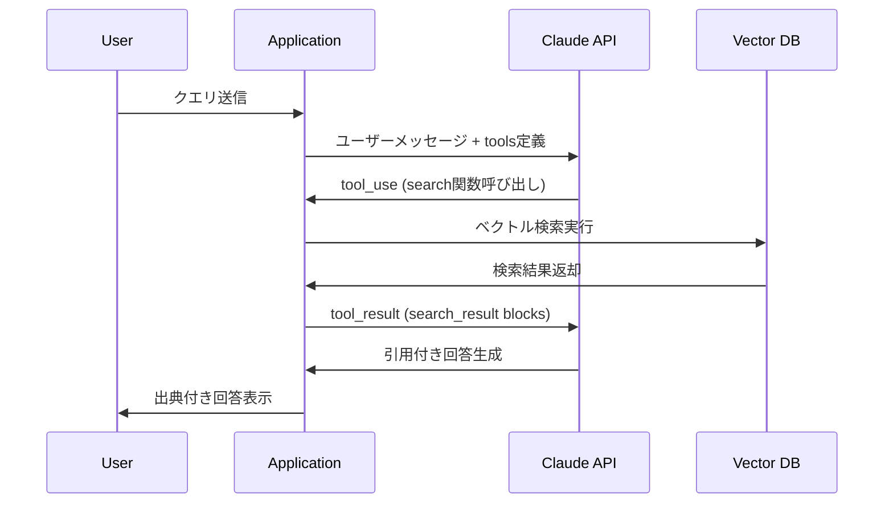

本記事は [Anthropic: Introducing Citations on the Anthropic API](https://www.anthropic.com/news/introducing-citations-api) および [Claude API: Citations ドキュメント](https://docs.anthropic.com/en/docs/build-with-claude/citations) の解説記事です。

この記事は [Zenn記事: LangGraph×Claude Sonnet 4.6のtool_useで出典付きAgentic RAGを構築する](https://zenn.dev/0h_n0/articles/11cb2066e667ed) の深掘りです。

## ブログ概要（Summary）

AnthropicはCitations APIを公開し、Claude APIにおいてRAGシステムの回答に自動で出典情報を付与する機能を提供している。この機能はsearch_result content blocksと呼ばれるAPIメッセージ形式を通じて、tool_resultに検索結果を構造化して渡すことで、Claudeが回答生成時に文レベルの引用を自動的に付与する仕組みである。Anthropicの公式発表によると、このビルトイン引用機能はカスタム実装と比較してリコール精度を最大15%向上させると報告されている。

## 情報源

- **種別**: 企業テックブログ / APIドキュメント
- **URL**: [https://www.anthropic.com/news/introducing-citations-api](https://www.anthropic.com/news/introducing-citations-api)
- **組織**: Anthropic
- **関連ドキュメント**: [https://docs.anthropic.com/en/docs/build-with-claude/citations](https://docs.anthropic.com/en/docs/build-with-claude/citations)
- **発表日**: 2025年1月（GA: 2025年6月30日、Anthropic API / Google Cloud Vertex AI / Amazon Bedrock）

## 技術的背景（Technical Background）

### RAGにおける出典管理の課題

RAG（Retrieval-Augmented Generation）システムでは、検索したドキュメントを元にLLMが回答を生成するが、「どの情報源からその主張が導かれたのか」を明示する出典管理が長年の課題であった。従来のアプローチでは以下の問題が存在する。

1. **プロンプトベースの引用指示**: 「出典を明記してください」とプロンプトで指示する方法。LLMが引用を忘れる、存在しないURLを生成する（ハルシネーション）といった問題が頻発する
2. **Post-hoc引用生成**: 回答生成後にNLIモデルで最も支持するドキュメントを特定して引用を付与する方法。追加の推論コストが発生し、引用の粒度が粗くなりやすい
3. **手動引用管理**: 開発者がルールベースで引用を管理する方法。メンテナンスコストが高く、スケーラビリティに欠ける

これらの問題に対し、Anthropicはモデルレベルで引用機能をネイティブに組み込むアプローチを採用した。

### 学術研究との関連

Citations APIの設計思想は、Princeton大学のGaoらが提案したALCEベンチマーク（arXiv: 2305.14627）における知見と共通する部分が多い。ALCEでは、LLMの引用品質をCitation Precision / Citation Recall / Citation F1の3指標で評価し、in-context demonstrationsやpost-hoc citation生成が引用品質を向上させることを実証している。Citations APIは、これらの知見を商用APIレベルで実現したものと位置づけられる。

## search_result content blocksのアーキテクチャ

### 基本的な動作原理

search_result content blocksは、Claude APIのtool_use機能と統合された引用機構である。具体的には、ツール呼び出しの結果（`tool_result`）として検索結果を構造化されたフォーマットで返すと、Claudeが回答生成時に該当する情報源を自動的に引用する。



### API実装の詳細

search_result content blocksの構造は以下のようになる。

```python
from anthropic import Anthropic
from anthropic.types import (
    SearchResultBlockParam,
    TextBlockParam,
    ToolResultBlockParam,
)

client = Anthropic()

# 検索結果をsearch_result blocksとして構造化
search_results: list[SearchResultBlockParam] = []
for doc in retrieved_documents:
    search_results.append(
        SearchResultBlockParam(
            type="search_result",
            source=doc["url"],        # 情報源URL
            title=doc["title"],        # ドキュメントタイトル
            content=[
                TextBlockParam(
                    type="text",
                    text=doc["content"]  # ドキュメント本文
                )
            ],
            citations={"enabled": True},  # 引用機能を有効化
        )
    )

# tool_resultとして渡す
tool_result = ToolResultBlockParam(
    type="tool_result",
    tool_use_id=tool_use_id,
    content=search_results,
)
```

ここで重要なのは、`citations={"enabled": True}` の設定である。Anthropicのドキュメントによると、citationsは「全有効」か「全無効」のどちらかであり、一部のドキュメントのみ引用を有効にすることはできない。機密ドキュメントを検索結果に含める場合は、search_result blocksに渡す前に事前フィルタリングが必要となる。

### ドキュメントチャンキングの選択肢

Citations APIは2つのチャンキング方式を提供している。

1. **自動チャンキング（推奨）**: ソースドキュメントをプレーンテキストとして渡すと、Claude側で文レベルのチャンキングを自動実行する。Anthropicの報告によると、このビルトインチャンキングはカスタム実装と比較してリコール精度を最大15%向上させるとされている
2. **カスタムチャンキング**: 開発者が独自のチャンク分割を行い、各チャンクをcustom content documentsとして渡す。RAGパイプラインで既にチャンク分割を行っている場合に有用

```python
# 方式1: 自動チャンキング（プレーンテキストを渡す）
content = [TextBlockParam(type="text", text=full_document_text)]

# 方式2: カスタムチャンキング（事前分割したチャンクを渡す）
content = [
    TextBlockParam(type="text", text=chunk_1),
    TextBlockParam(type="text", text=chunk_2),
    TextBlockParam(type="text", text=chunk_3),
]
```

### 引用の出力フォーマット

Claudeが引用付きで回答を生成すると、レスポンスには各文に対応する引用情報が構造化されて返される。引用はドキュメントID、開始位置、終了位置（文レベル）の情報を含み、フロントエンド側で適切にレンダリングできる。

## Agentic RAGとの統合パターン

### tool_useフローにおける引用生成

Zenn記事で解説されているAgentic RAGパイプラインでは、LangGraphのStateGraphでクエリ分析→ルーティング→検索→評価→生成のループを構築する。このパイプラインにCitations APIを統合する場合、生成ステップでsearch_result content blocksを使用する。

```python
def generate_with_citations(state: dict) -> dict:
    """検索結果からsearch_result blocksを構成し、引用付き回答を生成"""
    client = Anthropic()

    # GradeDocumentsで関連ありと判定されたドキュメントのみ使用
    relevant_docs = state["documents"]

    # search_result blocksに変換
    search_results = [
        SearchResultBlockParam(
            type="search_result",
            source=doc.get("source", ""),
            title=doc.get("title", ""),
            content=[TextBlockParam(type="text", text=doc["content"])],
            citations={"enabled": True},
        )
        for doc in relevant_docs
    ]

    # Claudeに引用付き生成を依頼
    response = client.messages.create(
        model="claude-sonnet-4-6-20260217",
        max_tokens=4096,
        messages=[
            {"role": "user", "content": state["query"]},
            # tool_use → tool_result のフローを構成
        ],
    )

    return {"messages": response.content}
```

### 引用品質の自動検証

生成された引用の品質を検証するために、以下のパターンが考えられる。

1. **NLIベース検証**: 引用されたドキュメントが主張を含意するかNLIモデルで自動検証
2. **Citation Recall/Precision計測**: ALCEベンチマークの評価指標を適用
3. **LLM-as-Judge**: 別のLLMインスタンスで引用の妥当性を判定

## パフォーマンスと制約

### パフォーマンス特性

Anthropicの公式発表に基づく特性は以下の通りである。

| 項目 | 仕様 |
|------|------|
| 引用リコール改善 | カスタム実装比で最大15%向上（Anthropic発表） |
| 対応モデル | Claude 3.5 Sonnet, Claude 3.5 Haiku, Claude Sonnet 4.6 |
| 対応プラットフォーム | Anthropic API, Google Cloud Vertex AI, Amazon Bedrock |
| GA日 | 2025年6月30日 |
| 追加コスト | 引用テキスト自体の出力トークンは課金対象外 |

### 制約と注意点

1. **全有効/全無効の制約**: citationsは全search_resultブロックで有効か無効のどちらかのみ。部分的な有効化は不可
2. **ドキュメント数の上限**: 1リクエストあたりのsearch_resultブロック数には実質的な上限がある（コンテキストウィンドウサイズに依存）
3. **レイテンシ**: 引用解析のための追加処理により、引用なしの生成と比較してレイテンシが増加する可能性がある
4. **言語依存性**: 文レベルのチャンキング精度は言語によって異なる可能性がある（英語が最も高精度）

## 運用での学び（Production Lessons）

### RAG引用の実装パターン比較

| パターン | 引用精度 | 実装コスト | レイテンシ |
|---------|----------|-----------|-----------|
| プロンプト指示のみ | 低（ハルシネーションリスク大） | 低 | 低 |
| Post-hoc NLI検証 | 中 | 中〜高 | 高（追加推論必要） |
| Citations API (search_result) | 高（最大15%改善） | 低 | 中 |
| Fine-tuned引用モデル | 高 | 高（学習データ必要） | 低〜中 |

Anthropicの報告によると、Citations APIはカスタム実装と比較してリコール精度を最大15%向上させるとされている。ただし、この数値は特定のベンチマーク条件下での結果であり、実際のドメインや質問特性によって変動する点に注意が必要である。

### 実装時のベストプラクティス

1. **チャンクサイズの最適化**: 自動チャンキングを基本とし、引用粒度が粗い場合にカスタムチャンキングに切り替える
2. **機密情報のフィルタリング**: search_result blocksに渡す前に、機密ドキュメントを除外するフィルタリングレイヤーを追加する
3. **引用品質のモニタリング**: Citation Precision/Recallをログに記録し、引用品質の経時変化を監視する
4. **フォールバック戦略**: Citations APIが利用できない場合（API障害等）に備えて、プロンプトベースの引用生成をフォールバックとして用意する

## Production Deployment Guide

### AWS実装パターン（コスト最適化重視）

**トラフィック量別の推奨構成**:

| 規模 | 月間リクエスト | 推奨構成 | 月額コスト | 主要サービス |
|------|--------------|---------|-----------|------------|
| **Small** | ~3,000 (100/日) | Serverless | $50-150 | Lambda + Bedrock + DynamoDB |
| **Medium** | ~30,000 (1,000/日) | Hybrid | $300-800 | Lambda + ECS Fargate + ElastiCache |
| **Large** | 300,000+ (10,000/日) | Container | $2,000-5,000 | EKS + Karpenter + EC2 Spot |

**Small構成の詳細** (月額$50-150):
- **Lambda**: 1GB RAM, 60秒タイムアウト ($20/月)
- **Bedrock**: Claude 3.5 Haiku (Citations API対応), Prompt Caching有効 ($80/月)
- **DynamoDB**: On-Demand, 引用キャッシュ用 ($10/月)
- **CloudWatch**: 基本監視 ($5/月)

**コスト試算の注意事項**: 上記は2026年2月時点のAWS ap-northeast-1（東京）リージョン料金に基づく概算値です。実際のコストはトラフィックパターンやバースト使用量により変動します。最新料金は [AWS料金計算ツール](https://calculator.aws/) で確認してください。

### Terraformインフラコード

**Small構成 (Serverless): Lambda + Bedrock + DynamoDB**

```hcl
resource "aws_iam_role" "lambda_bedrock_citations" {
  name = "lambda-bedrock-citations-role"

  assume_role_policy = jsonencode({
    Version = "2012-10-17"
    Statement = [{
      Action = "sts:AssumeRole"
      Effect = "Allow"
      Principal = { Service = "lambda.amazonaws.com" }
    }]
  })
}

resource "aws_iam_role_policy" "bedrock_invoke" {
  role = aws_iam_role.lambda_bedrock_citations.id
  policy = jsonencode({
    Version = "2012-10-17"
    Statement = [{
      Effect   = "Allow"
      Action   = ["bedrock:InvokeModel", "bedrock:InvokeModelWithResponseStream"]
      Resource = "arn:aws:bedrock:ap-northeast-1::foundation-model/anthropic.claude-3-5-haiku*"
    }]
  })
}

resource "aws_lambda_function" "rag_citations" {
  filename      = "lambda.zip"
  function_name = "rag-citations-handler"
  role          = aws_iam_role.lambda_bedrock_citations.arn
  handler       = "index.handler"
  runtime       = "python3.12"
  timeout       = 60
  memory_size   = 1024

  environment {
    variables = {
      BEDROCK_MODEL_ID    = "anthropic.claude-3-5-haiku-20241022-v1:0"
      CITATIONS_ENABLED   = "true"
      DYNAMODB_TABLE      = aws_dynamodb_table.citation_cache.name
    }
  }
}

resource "aws_dynamodb_table" "citation_cache" {
  name         = "rag-citation-cache"
  billing_mode = "PAY_PER_REQUEST"
  hash_key     = "query_hash"

  attribute {
    name = "query_hash"
    type = "S"
  }

  ttl {
    attribute_name = "expire_at"
    enabled        = true
  }
}
```

### 運用・監視設定

```python
import boto3

cloudwatch = boto3.client('cloudwatch')

# Citations APIレスポンスのレイテンシ監視
cloudwatch.put_metric_alarm(
    AlarmName='citations-latency-spike',
    ComparisonOperator='GreaterThanThreshold',
    EvaluationPeriods=2,
    MetricName='Duration',
    Namespace='AWS/Lambda',
    Period=300,
    Statistic='p99',
    Threshold=30000,
    AlarmDescription='Citations APIレイテンシP99が30秒超過'
)
```

### コスト最適化チェックリスト

- [ ] ~100 req/日 → Lambda + Bedrock (Serverless) - $50-150/月
- [ ] ~1000 req/日 → ECS Fargate + Bedrock (Hybrid) - $300-800/月
- [ ] Bedrock Batch API: 50%割引（非リアルタイム処理）
- [ ] Prompt Caching: 30-90%削減（システムプロンプト固定）
- [ ] DynamoDB TTL: 古い引用キャッシュの自動削除
- [ ] CloudWatch アラーム: レイテンシスパイク検知
- [ ] AWS Budgets: 月額予算設定（80%で警告）

## まとめと実践への示唆

AnthropicのCitations APIとsearch_result content blocksは、RAGシステムにおける出典管理の複雑さを大幅に軽減する。従来のプロンプトベースやpost-hocベースの引用手法と比較して、モデルネイティブの引用機能により実装コストを下げつつ引用品質を向上させることが可能である。

Zenn記事で解説されているLangGraph × Claude Sonnet 4.6のAgentic RAGパイプラインにおいては、生成ステップでsearch_result content blocksを活用することで、自己修正ループの結果得られた関連ドキュメントに対する正確な引用付き回答を自動生成できる。

ただし、「全有効/全無効」の引用制約、言語依存性、レイテンシ増加などの制約は、本番環境での導入時に考慮すべき点である。

## 参考文献

- **Blog URL**: [https://www.anthropic.com/news/introducing-citations-api](https://www.anthropic.com/news/introducing-citations-api)
- **API Docs**: [https://docs.anthropic.com/en/docs/build-with-claude/citations](https://docs.anthropic.com/en/docs/build-with-claude/citations)
- **Related Paper**: Gao et al., "Enabling Large Language Models to Generate Text with Citations" (arXiv: 2305.14627)
- **Related Zenn article**: [https://zenn.dev/0h_n0/articles/11cb2066e667ed](https://zenn.dev/0h_n0/articles/11cb2066e667ed)

---

:::message
この記事はAI（Claude Code）により自動生成されました。内容の正確性については情報源の公式ドキュメントもご確認ください。
:::
