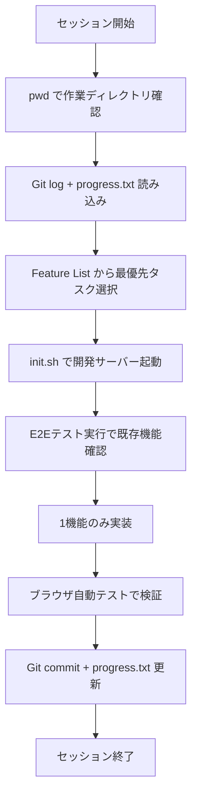

## ブログ概要（Summary）

Anthropicのエンジニア Justin Young氏が2025年11月に公開したブログ記事「Effective Harnesses for Long-Running Agents」は、AIエージェントが複数のコンテキストウィンドウにまたがって長時間動作する際の状態管理・永続化パターンを解説したものである。**Initializer Agent**（初期セットアップ担当）と**Coding Agent**（逐次実装担当）の2段構成を提案し、Git履歴と進捗ファイルによる状態橋渡し手法を具体的に示している。

この記事は [Zenn記事: LangGraph×Bedrock AgentCore Memoryで社内検索エージェントのメモリを本番運用する](https://zenn.dev/0h_n0/articles/b622546d617231) の深掘りです。

## 情報源

- **種別**: 企業テックブログ
- **URL**: [https://www.anthropic.com/engineering/effective-harnesses-for-long-running-agents](https://www.anthropic.com/engineering/effective-harnesses-for-long-running-agents)
- **組織**: Anthropic（Claude開発元）
- **著者**: Justin Young
- **発表日**: 2025年11月26日

## 技術的背景（Technical Background）

長時間稼働するAIエージェントには根本的な課題がある。各セッションは「前のセッションの記憶を一切持たない状態」で開始されるため、交代制で働くエンジニアが申し送りなしにシフトに入るのと同様の情報断絶が生じる。

LLMのコンテキストウィンドウには物理的な上限があり、大規模なタスク（Webアプリケーションの構築など）は1セッションで完了しない。Young氏はこの問題を「コーディングセッション間の橋渡し」として定式化し、エージェント自身に状態の記録と復元を行わせるアプローチを提案している。

この課題はZenn記事で解説しているBedrock AgentCore Memoryのshort-term memory（チェックポイント）と本質的に同じ問題を扱っている。LangGraphの`AgentCoreMemorySaver`がフレームワークレベルでチェックポイントを自動保存するのに対し、Young氏のアプローチはエージェント自身にファイルベースの状態管理を行わせる点が異なる。

## 実装アーキテクチャ（Architecture）

### 2段構成のエージェントハーネス

Young氏は長時間タスクを**Initializer Agent**と**Coding Agent**の2段階に分割する設計を提案している。

#### Phase 1: Initializer Agent（初期セットアップ）

最初のセッションで実行される特殊なエージェントで、以下の4つのタスクを担当する:

1. **`init.sh`の作成**: 開発サーバーの起動スクリプト
2. **`claude-progress.txt`の生成**: エージェントのアクションログ
3. **初回Gitコミット**: 追加ファイルを記録した初期コミット
4. **機能リスト（Feature List）の構築**: 実装すべき全機能の構造化リスト

```python
from dataclasses import dataclass, field
from enum import Enum

class FeatureStatus(Enum):
    """機能の実装状態"""
    NOT_STARTED = "not_started"
    IN_PROGRESS = "in_progress"
    FAILING = "failing"  # 初期値: テスト未通過
    PASSING = "passing"

@dataclass
class Feature:
    """Initializer Agentが生成する機能定義"""
    id: str
    name: str
    description: str
    priority: int  # 1が最高優先度
    status: FeatureStatus = FeatureStatus.FAILING
    dependencies: list[str] = field(default_factory=list)

@dataclass
class FeatureList:
    """JSON形式の構造化機能リスト"""
    features: list[Feature]
    total_count: int
    completed_count: int = 0

    def next_task(self) -> Feature | None:
        """最も優先度が高い未完了タスクを返す"""
        candidates = [
            f for f in self.features
            if f.status != FeatureStatus.PASSING
        ]
        if not candidates:
            return None
        return min(candidates, key=lambda f: f.priority)
```

Young氏は機能リストにJSON形式を強く推奨している。Markdown形式ではエージェントがタスクの完了状態を誤認し、プロジェクトを早期に「完了」と判断する傾向があったと報告している。JSON形式で`status: "failing"`を初期値にすることで、テストが実際に通過するまでタスクを完了扱いにしない仕組みを実現している。

#### Phase 2: Coding Agent（逐次実装）

後続セッションで繰り返し実行されるエージェントで、各セッションは以下の手順で開始される:



**セッション起動シーケンスの詳細**:

```python
class CodingAgentSession:
    """Coding Agentの1セッションを管理"""

    def __init__(self, workspace_dir: str):
        self.workspace_dir = workspace_dir

    def startup(self) -> dict:
        """セッション起動シーケンス"""
        # Step 1: 作業ディレクトリ確認
        cwd = self._run("pwd")

        # Step 2: 前回セッションの状態復元
        git_log = self._run("git log --oneline -20")
        progress = self._read_file("claude-progress.txt")

        # Step 3: 機能リストから次のタスク選択
        feature_list = self._load_json("feature-list.json")
        next_task = self._select_highest_priority(feature_list)

        # Step 4: 開発サーバー起動
        self._run("bash init.sh")

        # Step 5: 既存機能のE2Eテスト（回帰確認）
        test_results = self._run_e2e_tests()

        return {
            "context": {"git_log": git_log, "progress": progress},
            "next_task": next_task,
            "regression_ok": test_results["passed"],
        }

    def teardown(self, completed_feature: str) -> None:
        """セッション終了処理"""
        # 進捗記録
        self._append_file("claude-progress.txt", f"Completed: {completed_feature}")

        # 記述的コミット
        self._run(f'git add -A && git commit -m "feat: {completed_feature}"')
```

### 状態永続化の3つのアーティファクト

Young氏のアプローチでは、セッション間の状態橋渡しに以下の3つのファイルを使用する:

| アーティファクト | 役割 | 更新タイミング |
|----------------|------|-------------|
| `claude-progress.txt` | 実行アクションのログ | 各セッション終了時 |
| Git履歴 | コード変更の記録 + ロールバック手段 | 各機能完了時 |
| `feature-list.json` | 構造化された要件追跡 | テスト通過時にstatus更新 |

**Git履歴の重要性**: Young氏は、Git履歴が単なる変更記録だけでなく、失敗時のロールバック手段として機能する点を強調している。エージェントが不正なコードを生成した場合、`git revert`で直前の正常状態に復帰できる。

### テスト戦略

Young氏は、ブラウザ自動化（Puppeteer MCP）を明示的にプロンプトに含めることで、エージェントの性能が劇的に向上したと報告している。エージェントは「人間ユーザーと同じように」機能を検証すべきであり、単体テストやcurlコマンドだけに依存すべきではないと主張している。

```python
# Puppeteer MCPによるE2Eテストの概念コード
async def verify_feature_as_user(page, feature_name: str) -> bool:
    """ブラウザを操作して機能を人間と同様に検証"""
    await page.goto("http://localhost:3000")

    if feature_name == "login":
        await page.fill("#email", "test@example.com")
        await page.fill("#password", "password123")
        await page.click("#login-button")
        # 人間が確認するのと同じ要素を検証
        return await page.is_visible("#dashboard")

    return False
```

## Production Deployment Guide

### AWS実装パターン（コスト最適化重視）

Young氏のハーネスパターンをAWS上で実装する構成例を示す。

**トラフィック量別の推奨構成**:

| 構成 | ユースケース | サービス構成 | 月額概算 |
|------|------------|-------------|---------|
| Small | 個人/小チーム | Lambda + Step Functions + S3 | $50-100 |
| Medium | チーム利用 | ECS Fargate + CodeBuild + DynamoDB | $300-600 |
| Large | 組織全体 | EKS + Batch + DynamoDB + S3 | $1,500-4,000 |

**注意**: 上記は2026年2月時点のAWS ap-northeast-1（東京）リージョン料金に基づく概算値であり、実際のコストはエージェント実行頻度・セッション長により変動する。

**Small構成の詳細**:
- Step Functions（状態管理）: ~$1/月
- Lambda（エージェント実行、最大15分/回）: ~$5/月
- S3（状態ファイル保存）: ~$1/月
- Bedrock Claude API: ~$30-80/月（セッション数による）
- 合計: ~$37-87/月

**コスト削減テクニック**:
- Step Functions Express Workflows（短時間セッション向け、最大80%削減）
- Bedrock Prompt Caching（セッション起動時の共通プレフィックスキャッシュ、30-90%削減）
- S3 Intelligent-Tiering（古い進捗ファイルの自動階層化）

### Terraformインフラコード

**Small構成（Step Functions + Lambda）**:

```hcl
# エージェント状態管理用S3バケット
resource "aws_s3_bucket" "agent_state" {
  bucket = "agent-harness-state"
}

resource "aws_s3_bucket_server_side_encryption_configuration" "agent_state" {
  bucket = aws_s3_bucket.agent_state.id
  rule {
    apply_server_side_encryption_by_default {
      sse_algorithm = "aws:kms"
    }
  }
}

# 進捗追跡用DynamoDB
resource "aws_dynamodb_table" "agent_progress" {
  name         = "agent-harness-progress"
  billing_mode = "PAY_PER_REQUEST"
  hash_key     = "project_id"
  range_key    = "session_id"

  attribute {
    name = "project_id"
    type = "S"
  }
  attribute {
    name = "session_id"
    type = "S"
  }

  ttl {
    attribute_name = "expires_at"
    enabled        = true
  }
}

# Step Functions: Initializer → Coding Agent ループ
resource "aws_sfn_state_machine" "agent_harness" {
  name     = "agent-harness-orchestrator"
  role_arn = aws_iam_role.sfn_role.arn

  definition = jsonencode({
    StartAt = "InitializerAgent"
    States = {
      InitializerAgent = {
        Type     = "Task"
        Resource = aws_lambda_function.initializer.arn
        Next     = "CodingAgentLoop"
      }
      CodingAgentLoop = {
        Type = "Map"
        ItemsPath = "$.features"
        Iterator = {
          StartAt = "RunCodingAgent"
          States = {
            RunCodingAgent = {
              Type     = "Task"
              Resource = aws_lambda_function.coding_agent.arn
              End      = true
              Retry    = [{ ErrorEquals = ["States.ALL"], MaxAttempts = 2 }]
            }
          }
        }
        End = true
      }
    }
  })
}

# Lambda: Initializer Agent
resource "aws_lambda_function" "initializer" {
  function_name = "agent-initializer"
  runtime       = "python3.12"
  handler       = "initializer.handler"
  timeout       = 900  # 15分（Lambda最大値）
  memory_size   = 512

  environment {
    variables = {
      STATE_BUCKET = aws_s3_bucket.agent_state.id
      PROGRESS_TABLE = aws_dynamodb_table.agent_progress.name
    }
  }
}

# Lambda: Coding Agent
resource "aws_lambda_function" "coding_agent" {
  function_name = "agent-coding"
  runtime       = "python3.12"
  handler       = "coding_agent.handler"
  timeout       = 900
  memory_size   = 1024

  environment {
    variables = {
      STATE_BUCKET = aws_s3_bucket.agent_state.id
      PROGRESS_TABLE = aws_dynamodb_table.agent_progress.name
    }
  }
}
```

**Large構成（EKS + Batch）**:

```hcl
# EKS + AWS Batch（長時間ジョブ対応）
module "eks" {
  source  = "terraform-aws-modules/eks/aws"
  version = "~> 20.0"

  cluster_name    = "agent-harness-cluster"
  cluster_version = "1.31"

  vpc_id     = module.vpc.vpc_id
  subnet_ids = module.vpc.private_subnets

  cluster_endpoint_public_access = false
}

# Karpenter NodePool（Spot優先）
resource "kubectl_manifest" "karpenter_nodepool" {
  yaml_body = yamlencode({
    apiVersion = "karpenter.sh/v1"
    kind       = "NodePool"
    metadata   = { name = "agent-harness" }
    spec = {
      template = {
        spec = {
          requirements = [
            { key = "karpenter.sh/capacity-type", operator = "In", values = ["spot", "on-demand"] },
            { key = "node.kubernetes.io/instance-type", operator = "In", values = ["c7i.xlarge", "c6i.xlarge"] }
          ]
        }
      }
      limits     = { cpu = "50", memory = "200Gi" }
      disruption = { consolidationPolicy = "WhenEmptyOrUnderutilized" }
    }
  })
}

# AWS Budgets
resource "aws_budgets_budget" "monthly" {
  name         = "agent-harness-monthly"
  budget_type  = "COST"
  limit_amount = "4000"
  limit_unit   = "USD"
  time_unit    = "MONTHLY"

  notification {
    comparison_operator       = "GREATER_THAN"
    threshold                 = 80
    threshold_type            = "PERCENTAGE"
    notification_type         = "ACTUAL"
    subscriber_sns_topic_arns = [aws_sns_topic.cost_alert.arn]
  }
}
```

### 運用・監視設定

**CloudWatch Logs Insights — セッション分析**:

```
# セッション完了率の分析
fields @timestamp, project_id, session_id, features_completed
| filter event_type = "session_complete"
| stats count(*) as sessions, avg(features_completed) as avg_features by bin(1d)
```

**CloudWatch アラーム設定**:

```python
import boto3

cloudwatch = boto3.client("cloudwatch")

# エージェントセッション時間異常検知
cloudwatch.put_metric_alarm(
    AlarmName="agent-session-timeout",
    MetricName="Duration",
    Namespace="AWS/Lambda",
    Dimensions=[{"Name": "FunctionName", "Value": "agent-coding"}],
    Statistic="Average",
    Period=3600,
    EvaluationPeriods=1,
    Threshold=840000,  # 14分（15分タイムアウトの93%）
    ComparisonOperator="GreaterThanThreshold",
    AlarmActions=["arn:aws:sns:ap-northeast-1:ACCOUNT:agent-alert"],
)
```

**X-Ray トレーシング**:

```python
from aws_xray_sdk.core import xray_recorder, patch_all

patch_all()

@xray_recorder.capture("coding_agent_session")
def run_coding_session(project_id: str, session_id: str) -> dict:
    """Coding Agentセッションの実行（X-Rayトレース付き）"""
    subseg = xray_recorder.current_subsegment()
    subseg.put_annotation("project_id", project_id)
    subseg.put_annotation("session_id", session_id)
    # ... セッション実行
```

### コスト最適化チェックリスト

**アーキテクチャ選択**:
- [ ] セッション長に応じた構成選択（Lambda 15分以内 / ECS/EKS 長時間）
- [ ] Step Functions Express vs Standard の選択（実行時間5分未満はExpress）

**リソース最適化**:
- [ ] EC2/EKS: Spot Instances優先（最大90%削減）
- [ ] Reserved Instances: 1年コミット（常時稼働ワーカー向け）
- [ ] Lambda: メモリサイズ最適化（Power Tuning）
- [ ] ECS/EKS: アイドル時スケールダウン
- [ ] S3: Intelligent-Tiering（古い状態ファイル自動階層化）

**LLMコスト削減**:
- [ ] Bedrock Prompt Caching（セッション起動プレフィックス共通化、30-90%削減）
- [ ] 1セッション1機能の原則（コンテキスト消費を最小化）
- [ ] モデル選択ロジック（状態読み込み→Haiku、コード生成→Sonnet）
- [ ] トークン数制限（Git log要約でコンテキスト節約）

**監視・アラート**:
- [ ] AWS Budgets設定（月次予算）
- [ ] CloudWatch アラーム（セッションタイムアウト検知）
- [ ] Cost Anomaly Detection有効化
- [ ] 日次コストレポート（SNS通知）

**リソース管理**:
- [ ] 古い状態ファイルの自動削除（S3ライフサイクル）
- [ ] DynamoDB TTLで完了プロジェクトの自動削除
- [ ] タグ戦略（Project, Environment, CostCenter）
- [ ] 開発環境夜間停止（EventBridge Scheduler）
- [ ] 未使用EBSボリュームの定期削除

## パフォーマンス最適化（Performance）

Young氏のブログでは具体的なベンチマーク数値は示されていないが、設計上の性能特性について重要な知見が報告されている。

**1セッション1機能の原則**: Young氏は、エージェントに1セッションで複数機能を実装させると「アプリケーション全体をワンショットで構築しようとする」失敗モードに陥ると報告している。1機能に限定することでコンテキストウィンドウの消費を抑え、実装の成功率が向上するとしている。

**テストファーストの効果**: 各セッション開始時にE2Eテストを実行して既存機能の回帰を確認する手法は、新機能の実装が既存機能を破壊するリスクを低減する。Young氏はPuppeteer MCPによるブラウザ自動化テストの導入で品質が劇的に改善したと述べている。

## 運用での学び（Production Lessons）

Young氏は実装過程で得られた以下の運用知見を共有している。

**機能リストのJSON形式が必須**: Markdown形式の機能リストでは、エージェントがタスクの完了状態を誤判定し、プロジェクトを早期に「完了」と宣言する傾向があった。JSON形式で各機能の`status`を明示的に管理し、初期値を`"failing"`にすることで、テストが実際に通過するまでタスクを完了扱いにしない仕組みを実現している。

**クリーンステート要件**: エージェントに「作業完了前にプロダクションレディなコードにすること」を明示的に指示することで、セッション終了時に中途半端な状態が残るリスクを低減している。

**既知の制限**: ブラウザネイティブのalertモーダルをPuppeteer経由で検出できないなど、ブラウザ自動化の制約がエージェントの検証能力に影響する場合がある。

## 学術研究との関連（Academic Connection）

Young氏のアプローチは、エージェントの長期記憶に関する学術研究と密接に関連している。

**CoALA（Dohan et al., 2022）との関連**: Young氏の`claude-progress.txt`はCoALAフレームワークにおけるEpisodic Memoryに、`feature-list.json`はSemantic Memoryに対応する。Git履歴はProcedural Memoryの一部（エージェントの行動履歴）として機能している。

**Zenn記事のBedrock AgentCore Memoryとの対応**:

| Young氏のアプローチ | Bedrock AgentCore Memory |
|-------------------|------------------------|
| `claude-progress.txt` | Short-term Memory（チェックポイント） |
| `feature-list.json` | Long-term Memory（semantic/preference） |
| Git commit + revert | `AgentCoreMemorySaver`のthread管理 |

Young氏のファイルベースアプローチは、LangGraphのチェックポイント機構をより軽量かつ透明な形で実現したものと位置づけられる。マネージドサービスの抽象化レイヤーなしにエージェントが直接状態を管理する点が特徴的である。

## まとめと実践への示唆

Young氏のブログは、長時間稼働エージェントの状態管理を「Initializer + Coding Agent」の2段構成と3つの永続化アーティファクト（progress.txt、Git履歴、feature-list.json）で解決するパターンを示したものである。

実務への主な示唆:
- セッション間の状態橋渡しには構造化された進捗ファイル（JSON形式）が有効
- 1セッション1機能の原則でコンテキスト消費とエラー率を低減
- Git履歴はロールバック手段としてエージェントの安全性を担保する
- ブラウザ自動テストの明示的な指示が品質を劇的に改善する

Zenn記事のBedrock AgentCore MemoryとLangGraphの組み合わせは、Young氏のファイルベースアプローチをマネージドサービスで抽象化した実装パターンと理解できる。

## 参考文献

- **Blog URL**: [https://www.anthropic.com/engineering/effective-harnesses-for-long-running-agents](https://www.anthropic.com/engineering/effective-harnesses-for-long-running-agents)
- **CoALA Paper**: [https://arxiv.org/abs/2309.02427](https://arxiv.org/abs/2309.02427)
- **Related Zenn article**: [https://zenn.dev/0h_n0/articles/b622546d617231](https://zenn.dev/0h_n0/articles/b622546d617231)
