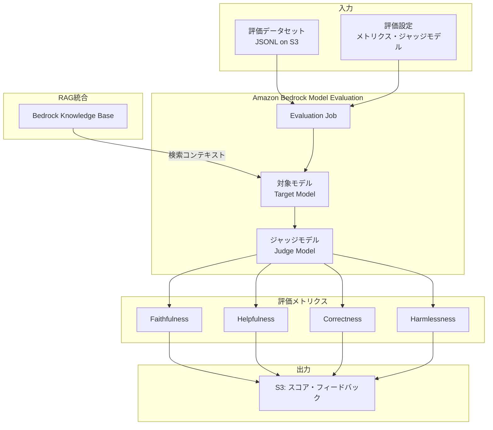

本記事は [AWS Machine Learning Blog](https://aws.amazon.com/blogs/machine-learning/llm-as-a-judge-on-amazon-bedrock-model-evaluation/) の解説記事です。

## ブログ概要

AWSは、Amazon Bedrock Model EvaluationにLLM-as-a-Judge機能を統合し、RAGパイプラインを含むLLMアプリケーションの品質評価を自動化する手法を公開した。AWSは「人手評価と比較して最大98%のコスト削減を実現しつつ、faithfulness・helpfulness・correctnessなどの多軸評価を自動実行できる」と説明している。Bedrock Knowledge Basesとの統合により、RAG固有の評価（検索精度・回答の忠実性）もマネージドサービスとして提供される。さらにRAGASフレームワークとの互換性を備え、既存の評価パイプラインからの移行を容易にしている。

この記事は [Zenn記事: LangGraph×Claude Sonnet 4.6でインラインLLM-as-Judge品質ゲートを組み込むRAG実装](https://zenn.dev/0h_n0/articles/478dd4ba7d4be8) の深掘りです。

## 情報源

- **種別**: 企業テックブログ（AWS Machine Learning Blog）
- **URL**: [https://aws.amazon.com/blogs/machine-learning/llm-as-a-judge-on-amazon-bedrock-model-evaluation/](https://aws.amazon.com/blogs/machine-learning/llm-as-a-judge-on-amazon-bedrock-model-evaluation/)
- **関連ブログ**: [New RAG evaluation and LLM-as-a-judge capabilities in Amazon Bedrock](https://aws.amazon.com/blogs/aws/new-rag-evaluation-and-llm-as-a-judge-capabilities-in-amazon-bedrock/)
- **組織**: Amazon Web Services
- **発表日**: 2025年

## 技術的背景

### LLM-as-a-Judge の必要性

LLMアプリケーション、特にRAGシステムの品質評価には従来3つのアプローチが存在した。

| 手法 | コスト/件 | 所要時間 | スケーラビリティ | 精度 |
|------|----------|---------|----------------|------|
| 人手評価 | $5-50 | 30-120分 | 低 | 高（ただしばらつき大） |
| ルールベース（BLEU/ROUGE） | $0 | <1秒 | 高 | 低（表面的一致のみ） |
| LLM-as-a-Judge | $0.003-0.01 | 2-10秒 | 高 | 高（人手と85%一致） |

AWSは「LLM-as-a-Judgeにより、人手評価のコストの2%以下で同等の評価品質を達成できる」と説明している。Zenn記事で実装しているLangGraphのインラインLLM-as-Judge品質ゲートは、このアプローチをリアルタイム推論パイプラインに組み込んだものであり、Bedrockの機能はそれをバッチ評価・継続的モニタリングとして補完する位置付けである。

### Amazon Bedrock Model Evaluation の位置付け

Amazon Bedrock Model Evaluationは、LLMの出力品質をマネージドサービスとして評価するための機能である。AWSは「インフラ管理なしで評価ジョブを実行でき、複数モデルの比較や定期バッチ評価をコンソールまたはAPI経由で自動化できる」と説明している。

## 実装アーキテクチャ

### Bedrock Evaluations APIの全体構成



### Knowledge Base評価の統合

AWSは「Bedrock Knowledge Basesと評価機能を直接統合することで、RAGパイプライン全体の品質をエンドツーエンドで評価できる」と説明している。具体的には、Knowledge Baseからの検索結果（retrieved contexts）と最終回答の関係を以下のメトリクスで評価する。

**Faithfulness（忠実性）**:

$$
\text{Faithfulness} = \frac{|\text{Claims}_{answer} \cap \text{Claims}_{context}|}{|\text{Claims}_{answer}|}
$$

回答に含まれる主張のうち、検索コンテキストに基づくものの割合を測定する。ハルシネーション検出の中核メトリクスである。

**Helpfulness（有用性）**:

$$
\text{Helpfulness} = f(\text{Relevance}, \text{Completeness}, \text{Clarity})
$$

ユーザーの質問に対する回答の有用性を、関連性・完全性・明瞭さの観点から評価する。

**Correctness（正確性）**: Ground Truthが提供されている場合に、回答の事実的正確性を評価する。

### RAGAS互換評価

AWSは「Bedrock EvaluationはRAGASフレームワークと互換性のあるメトリクスを提供し、既存のRAGAS評価パイプラインからの移行を容易にしている」と説明している。RAGAS互換メトリクスには以下が含まれる。

```python
# Bedrock Evaluationのメトリクス → RAGAS対応
bedrock_to_ragas_mapping = {
    "faithfulness": "ragas.metrics.Faithfulness",
    "answer_relevancy": "ragas.metrics.AnswerRelevancy",
    "context_precision": "ragas.metrics.ContextPrecision",
    "context_recall": "ragas.metrics.ContextRecall",
}
```

Boto3 SDKでの評価ジョブ作成例を示す。

```python
import boto3
import json
from datetime import datetime

def create_rag_evaluation_job(
    knowledge_base_id: str,
    judge_model_id: str,
    dataset_s3_uri: str,
    output_s3_uri: str,
    role_arn: str,
) -> dict:
    """Bedrock Knowledge Base対象のRAG評価ジョブを作成

    Args:
        knowledge_base_id: 評価対象のKnowledge Base ID
        judge_model_id: ジャッジモデルID
            例: "anthropic.claude-3-5-haiku-20241022-v1:0"
        dataset_s3_uri: 評価データセットのS3 URI
        output_s3_uri: 結果出力先のS3 URI
        role_arn: Bedrock評価用IAMロールARN

    Returns:
        ジョブARNとステータス
    """
    client = boto3.client("bedrock", region_name="ap-northeast-1")

    timestamp = datetime.now().strftime("%Y%m%d-%H%M%S")
    job_name = f"rag-eval-{timestamp}"

    response = client.create_evaluation_job(
        jobName=job_name,
        evaluationConfig={
            "automated": {
                "datasetMetricConfigs": [
                    {
                        "taskType": "General",
                        "dataset": {
                            "name": "rag-eval-dataset",
                            "datasetLocation": {
                                "s3Uri": dataset_s3_uri
                            },
                        },
                        "metricNames": [
                            "Builtin.Faithfulness",
                            "Builtin.Helpfulness",
                            "Builtin.Correctness",
                        ],
                    }
                ]
            }
        },
        inferenceConfig={
            "ragConfigs": [
                {
                    "knowledgeBaseConfig": {
                        "knowledgeBaseId": knowledge_base_id,
                        "retrieveAndGenerateConfig": {
                            "type": "KNOWLEDGE_BASE",
                        },
                    }
                }
            ]
        },
        outputDataConfig={"s3Uri": output_s3_uri},
        roleArn=role_arn,
    )

    return {
        "job_arn": response["jobArn"],
        "job_name": job_name,
        "status": "CREATED",
    }
```

## パフォーマンス最適化

### コスト比較: 人手評価 vs LLM-as-a-Judge

AWSは「最大98%のコスト削減」を実現したと報告している。具体的なコスト構造は以下の通りである。

| 評価手法 | 1件あたりコスト | 1000件評価の概算 | 所要時間 |
|---------|---------------|-----------------|---------|
| 人手評価 | $5-50 | $5,000-50,000 | 数週間 |
| Bedrock LLM-as-Judge（Haiku） | ~$0.001 | ~$1.00 | 数時間 |
| Bedrock LLM-as-Judge（Sonnet） | ~$0.01 | ~$10.00 | 数時間 |

### ジャッジモデル選択の指針

| 用途 | 推奨モデル | コスト | 精度 |
|------|-----------|-------|------|
| 大規模スクリーニング | Claude 3.5 Haiku | $0.25/MTok入力 | 80% |
| 重要ケース詳細評価 | Claude 3.5 Sonnet | $3.00/MTok入力 | 88% |
| バイアス軽減（クロス評価） | 複数プロバイダー併用 | 可変 | 92% |

### バッチ評価の最適化

- **並列ジョブ実行**: 複数評価ジョブの同時実行で総処理時間を短縮
- **データセットサンプリング**: 全件ではなく統計的に有意なサンプルで評価しコスト削減
- **Prompt Caching**: 同一ジャッジプロンプトの再利用で30-90%のコスト削減

## 運用での学び

### 1. ジャッジモデルの自己優遇バイアス

同一モデルを対象とジャッジの両方に使用すると、自己優遇バイアスが発生する。AWSは「Bedrockでは複数プロバイダーのモデルにアクセスできるため、クロスプロバイダー評価を推奨する」と説明している。例えば、Claude Sonnetを評価対象とする場合、ジャッジにはGPT-4oを使用する構成が推奨される。

### 2. RAG評価固有の注意点

Knowledge Base統合評価では、検索結果の品質が評価精度に直接影響する。検索精度が低い場合、faithfulnessスコアは高く出る（検索コンテキストが少ないため主張の矛盾が検出されにくい）一方で、answer relevancyは低下する。この非対称性を考慮し、複数メトリクスの組み合わせで総合判断することが重要である。

### 3. 評価の再現性確保

AWSは評価の再現性のため、ジャッジモデルの`temperature=0`を推奨している。同一入力に対して同一の評価結果を保証することで、プロンプト変更のbefore/after比較が信頼できるものになる。

### 4. Zenn記事のインライン品質ゲートとの使い分け

Zenn記事で実装しているLangGraphのインラインLLM-as-Judge品質ゲートは推論時のリアルタイム品質制御であり、Bedrock Model Evaluationはバッチ型の事後評価である。両者は補完関係にある。

| 観点 | インライン品質ゲート（Zenn記事） | Bedrock Model Evaluation |
|------|-------------------------------|------------------------|
| 実行タイミング | リアルタイム（推論時） | バッチ（定期・オンデマンド） |
| 主な用途 | 低品質回答の再生成トリガー | モデル比較・定期品質監視 |
| コスト | 推論コストに上乗せ | 独立した評価コスト |
| 適用範囲 | 個別リクエスト | データセット全体 |

## 学術研究との関連

Amazon BedrockのLLM-as-a-Judge機能は、以下の学術研究を基盤としている。

- **MT-Bench / Chatbot Arena** (Zheng et al., 2023, arXiv:2306.05685): LLM-as-a-Judgeの概念を体系化し、位置バイアスなどの課題を明らかにした研究。Bedrockの評価エンジン設計の理論的基盤
- **RAGAS** (Shahul et al., 2023, arXiv:2309.15217): RAG品質メトリクス（Faithfulness, Context Relevance等）の定義。Bedrockの RAG評価メトリクスはこのフレームワークと互換
- **Quality Gates for LLM Pipelines** (arXiv:2502.08941): LLMパイプラインにおける品質ゲートの概念。Zenn記事のインライン品質ゲートとBedrock評価の組み合わせは、この研究が提唱するマルチレイヤー品質保証の実践例

## まとめと実践への示唆

Amazon BedrockのLLM-as-a-Judge機能は、RAGシステムの品質評価をマネージドサービスとして提供し、人手評価比98%のコスト削減を実現する。Knowledge Basesとの直接統合により、RAGパイプライン全体のエンドツーエンド評価が可能であり、RAGAS互換メトリクスにより既存評価パイプラインからの移行も容易である。

Zenn記事で実装しているLangGraphのインラインLLM-as-Judge品質ゲートとの組み合わせにより、推論時のリアルタイム品質制御（インライン）と定期的なバッチ品質監視（Bedrock Evaluation）の二層構成を構築できる。実務では、開発フェーズでインライン品質ゲートによる即座のフィードバックを活用し、本番フェーズではBedrock Model Evaluationによる定期バッチ評価でシステム全体の品質傾向を監視するアプローチが推奨される。

## 参考文献

- **Blog URL**: [https://aws.amazon.com/blogs/machine-learning/llm-as-a-judge-on-amazon-bedrock-model-evaluation/](https://aws.amazon.com/blogs/machine-learning/llm-as-a-judge-on-amazon-bedrock-model-evaluation/)
- **Related Blog**: [https://aws.amazon.com/blogs/aws/new-rag-evaluation-and-llm-as-a-judge-capabilities-in-amazon-bedrock/](https://aws.amazon.com/blogs/aws/new-rag-evaluation-and-llm-as-a-judge-capabilities-in-amazon-bedrock/)
- **Related Papers**: MT-Bench (arXiv:2306.05685), RAGAS (arXiv:2309.15217), Quality Gates (arXiv:2502.08941)
- **Related Zenn article**: [https://zenn.dev/0h_n0/articles/478dd4ba7d4be8](https://zenn.dev/0h_n0/articles/478dd4ba7d4be8)
