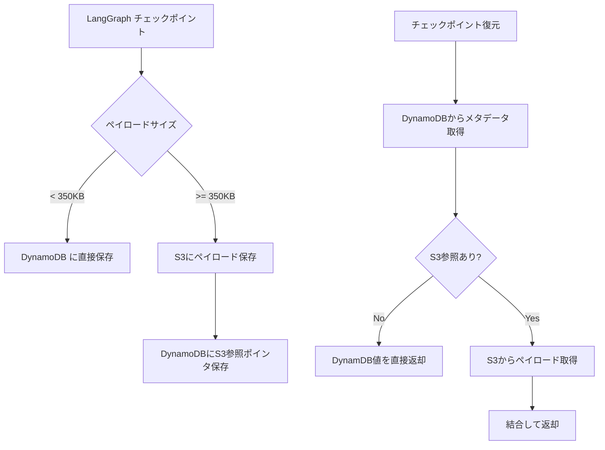

## ブログ概要（Summary）

AWS Database Blogが2026年1月に公開した「Build Durable AI Agents with LangGraph and Amazon DynamoDB」は、LangGraphのチェックポイント機構をAmazon DynamoDBで永続化する**DynamoDBSaver**ライブラリの設計と実装を解説したものである。小さなチェックポイント（< 350KB）はDynamoDBに直接保存し、大きなペイロード（≥ 350KB）はAmazon S3にオフロードする**階層型ストレージアーキテクチャ**を採用している。TTLによる自動データライフサイクル管理も組み込まれており、プロダクション環境での運用を前提とした設計となっている。

この記事は [Zenn記事: LangGraph×Bedrock AgentCore Memoryで社内検索エージェントのメモリを本番運用する](https://zenn.dev/0h_n0/articles/b622546d617231) の深掘りです。

## 情報源

- **種別**: 企業テックブログ
- **URL**: [https://aws.amazon.com/blogs/database/build-durable-ai-agents-with-langgraph-and-amazon-dynamodb/](https://aws.amazon.com/blogs/database/build-durable-ai-agents-with-langgraph-and-amazon-dynamodb/)
- **組織**: AWS Database Blog
- **発表日**: 2026年1月13日

## 技術的背景（Technical Background）

LangGraphではエージェントの状態を「スーパーステップ」（super-step）ごとに保存するチェックポイント機構がある。スーパーステップとは、グラフ内のノード実行1単位を指す。このチェックポイントにより、エージェントの中断・再開、エラーリカバリ、Human-in-the-Loopパターンが実現できる。

しかし、チェックポイントデータにはチャット履歴、検索結果、ツール実行結果などが含まれるため、サイズが大きくなる傾向がある。DynamoDBの項目サイズ上限は400KBであるため、大規模なチェックポイントを直接保存できない場合がある。DynamoDBSaverはこの制約をS3との階層型ストレージで解決している。

Zenn記事で紹介している`AgentCoreMemorySaver`は、Bedrock AgentCore Memoryのマネージドサービスとしてチェックポイント保存を実現しているが、内部的にはDynamoDBSaverと同様のストレージ戦略（DynamoDB + S3の組み合わせ）を採用していると推測される。本ブログ記事は、そのストレージ層の詳細設計を理解する上で重要な1次情報である。

## 実装アーキテクチャ（Architecture）

### 階層型ストレージ設計

DynamoDBSaverの中核は、ペイロードサイズに基づく動的なストレージ選択である。



**DynamoDBテーブル設計**:

| 属性 | 型 | 説明 |
|------|-----|------|
| `thread_id` (PK) | String | セッション/ユーザーの一意識別子 |
| `checkpoint_id` (SK) | String | チェックポイントの一意ID |
| `state` | Binary/Map | シリアライズされたエージェント状態（< 350KB時） |
| `s3_ref` | String | S3オブジェクトキー（≥ 350KB時） |
| `created_at` | Number | 作成タイムスタンプ |
| `ttl` | Number | TTL用エポック秒 |

**350KBの閾値の根拠**: DynamoDBの項目サイズ上限は400KBだが、メタデータ（`thread_id`、`checkpoint_id`、タイムスタンプなど）のオーバーヘッドを考慮して安全マージンを確保した値と考えられる。

### DynamoDBSaverの実装パターン

DynamoDBSaverはLangGraphの`BaseCheckpointSaver`インターフェースを実装する。以下はブログの内容に基づく概念実装である。

```python
from typing import Any
import json
import boto3
from langgraph.checkpoint.base import BaseCheckpointSaver

class DynamoDBSaver(BaseCheckpointSaver):
    """DynamoDB + S3による階層型チェックポイント保存"""

    THRESHOLD_BYTES = 350 * 1024  # 350KB

    def __init__(
        self,
        table_name: str,
        s3_bucket: str,
        ttl_seconds: int | None = None,
        region_name: str = "ap-northeast-1",
    ):
        self.dynamodb = boto3.resource("dynamodb", region_name=region_name)
        self.table = self.dynamodb.Table(table_name)
        self.s3 = boto3.client("s3", region_name=region_name)
        self.s3_bucket = s3_bucket
        self.ttl_seconds = ttl_seconds

    def put(
        self,
        config: dict[str, Any],
        checkpoint: dict[str, Any],
        metadata: dict[str, Any],
    ) -> dict[str, Any]:
        """チェックポイントの保存（階層型ストレージ）"""
        thread_id = config["configurable"]["thread_id"]
        checkpoint_id = checkpoint["id"]
        serialized = json.dumps(checkpoint).encode("utf-8")

        item = {
            "thread_id": thread_id,
            "checkpoint_id": checkpoint_id,
            "metadata": metadata,
            "created_at": int(time.time()),
        }

        if self.ttl_seconds:
            item["ttl"] = int(time.time()) + self.ttl_seconds

        if len(serialized) < self.THRESHOLD_BYTES:
            # 小さなチェックポイント: DynamoDBに直接保存
            item["state"] = serialized.decode("utf-8")
        else:
            # 大きなチェックポイント: S3にオフロード
            s3_key = f"checkpoints/{thread_id}/{checkpoint_id}.json"
            self.s3.put_object(
                Bucket=self.s3_bucket,
                Key=s3_key,
                Body=serialized,
                ServerSideEncryption="aws:kms",
            )
            item["s3_ref"] = s3_key

        self.table.put_item(Item=item)
        return config

    def get(self, config: dict[str, Any]) -> dict[str, Any] | None:
        """チェックポイントの復元（透過的なS3取得）"""
        thread_id = config["configurable"]["thread_id"]

        response = self.table.query(
            KeyConditionExpression="thread_id = :tid",
            ExpressionAttributeValues={":tid": thread_id},
            ScanIndexForward=False,  # 最新順
            Limit=1,
        )

        if not response["Items"]:
            return None

        item = response["Items"][0]

        if "s3_ref" in item:
            # S3からペイロード取得
            obj = self.s3.get_object(
                Bucket=self.s3_bucket,
                Key=item["s3_ref"],
            )
            state = json.loads(obj["Body"].read())
        else:
            state = json.loads(item["state"])

        return state
```

### Thread ID設計

ブログでは「信頼性の高いThread IDスキームを設計すべき」と強調されている。Thread IDはセッション/ユーザー/ワークアイテムを決定論的に識別するIDであり、リトライ時の状態復元を確実にする。

```python
def generate_thread_id(
    user_id: str,
    session_id: str,
    workflow_name: str,
) -> str:
    """決定論的なThread ID生成

    Args:
        user_id: ユーザー識別子
        session_id: セッション識別子
        workflow_name: ワークフロー名

    Returns:
        一意のThread ID
    """
    import hashlib
    raw = f"{user_id}:{session_id}:{workflow_name}"
    return hashlib.sha256(raw.encode()).hexdigest()[:32]
```

Zenn記事で紹介している`AgentCoreMemorySaver`の`session_id`パラメータは、この`thread_id`に対応する概念である。Bedrock AgentCore Memoryでは`session_id`と`agent_id`の組み合わせでチェックポイントを一意に識別する。

### TTLによるデータライフサイクル管理

DynamoDBSaverにはTTLオプション（`ttl_seconds`）が組み込まれている。これにより、指定期間経過後にチェックポイントが自動的に削除される。

```python
# TTLの使用例
saver = DynamoDBSaver(
    table_name="agent-checkpoints",
    s3_bucket="agent-checkpoint-payloads",
    ttl_seconds=86400 * 7,  # 7日後に自動削除
)
```

TTL設計の考慮事項:
- **短期セッション（チャットボット）**: 24-48時間のTTL
- **長期プロジェクト（コーディングエージェント）**: 7-30日のTTL
- **コンプライアンス要件**: 監査ログ目的で90日以上保持

## Production Deployment Guide

### AWS実装パターン（コスト最適化重視）

DynamoDBSaverのプロダクション構成例を示す。

**トラフィック量別の推奨構成**:

| 構成 | トラフィック | サービス構成 | 月額概算 |
|------|-------------|-------------|---------|
| Small | ~100 req/日 | DynamoDB On-Demand + S3 Standard | $5-20 |
| Medium | ~1,000 req/日 | DynamoDB On-Demand + S3 + DAX | $100-300 |
| Large | 10,000+ req/日 | DynamoDB Provisioned + S3 + DAX + ElastiCache | $500-2,000 |

**注意**: 上記は2026年2月時点のAWS ap-northeast-1（東京）リージョン料金に基づく概算値であり、チェックポイントサイズとS3オフロード率により変動する。

**Small構成の詳細**:
- DynamoDB On-Demand: ~$2/月（100 req/日 × 30日 × 4KB平均 WCU/RCU）
- S3 Standard: ~$1/月（大きなチェックポイントの保存）
- S3 PUT/GET: ~$0.5/月
- 合計: ~$3.5/月（CloudWatch込みで$5-20）

**コスト削減テクニック**:
- DynamoDB On-Demand→Provisioned切替（安定トラフィック時、最大75%削減）
- S3 Intelligent-Tiering（アクセス頻度低下時の自動階層化）
- DynamoDB TTLで不要チェックポイントを自動削除（ストレージコスト直結）
- BatchWriteItem/BatchGetItem APIの活用（API呼び出し回数削減）

### Terraformインフラコード

**Small構成（DynamoDB On-Demand + S3）**:

```hcl
# チェックポイント保存用DynamoDB
resource "aws_dynamodb_table" "checkpoints" {
  name         = "langgraph-checkpoints"
  billing_mode = "PAY_PER_REQUEST"
  hash_key     = "thread_id"
  range_key    = "checkpoint_id"

  attribute {
    name = "thread_id"
    type = "S"
  }
  attribute {
    name = "checkpoint_id"
    type = "S"
  }

  ttl {
    attribute_name = "ttl"
    enabled        = true
  }

  server_side_encryption {
    enabled = true  # AWS managed KMS
  }

  point_in_time_recovery {
    enabled = true  # PITRでデータ復旧可能
  }

  tags = {
    Service     = "langgraph-agent"
    Environment = "production"
    CostCenter  = "ai-platform"
  }
}

# 大規模チェックポイント用S3バケット
resource "aws_s3_bucket" "checkpoint_payloads" {
  bucket = "langgraph-checkpoint-payloads"
}

resource "aws_s3_bucket_server_side_encryption_configuration" "checkpoint_payloads" {
  bucket = aws_s3_bucket.checkpoint_payloads.id
  rule {
    apply_server_side_encryption_by_default {
      sse_algorithm = "aws:kms"
    }
  }
}

resource "aws_s3_bucket_lifecycle_configuration" "checkpoint_payloads" {
  bucket = aws_s3_bucket.checkpoint_payloads.id

  rule {
    id     = "archive-old-checkpoints"
    status = "Enabled"

    transition {
      days          = 30
      storage_class = "STANDARD_IA"
    }

    transition {
      days          = 90
      storage_class = "GLACIER"
    }

    expiration {
      days = 365  # 1年後に自動削除
    }
  }
}

# IAMロール（最小権限）
resource "aws_iam_policy" "dynamodb_saver" {
  name = "langgraph-dynamodb-saver"

  policy = jsonencode({
    Version = "2012-10-17"
    Statement = [
      {
        Effect = "Allow"
        Action = [
          "dynamodb:GetItem", "dynamodb:PutItem",
          "dynamodb:Query", "dynamodb:BatchGetItem",
          "dynamodb:BatchWriteItem"
        ]
        Resource = [aws_dynamodb_table.checkpoints.arn]
      },
      {
        Effect = "Allow"
        Action = [
          "s3:GetObject", "s3:PutObject"
        ]
        Resource = ["${aws_s3_bucket.checkpoint_payloads.arn}/*"]
      }
    ]
  })
}
```

**Large構成（DAX + Provisioned + S3）**:

```hcl
# DynamoDB Provisioned（安定トラフィック向け）
resource "aws_dynamodb_table" "checkpoints_large" {
  name         = "langgraph-checkpoints"
  billing_mode = "PROVISIONED"
  hash_key     = "thread_id"
  range_key    = "checkpoint_id"

  read_capacity  = 100  # 自動スケーリングで調整
  write_capacity = 50

  attribute {
    name = "thread_id"
    type = "S"
  }
  attribute {
    name = "checkpoint_id"
    type = "S"
  }

  ttl {
    attribute_name = "ttl"
    enabled        = true
  }

  server_side_encryption {
    enabled     = true
    kms_key_arn = aws_kms_key.checkpoint.arn  # CMK
  }

  point_in_time_recovery {
    enabled = true
  }
}

# DAXクラスタ（読み取りキャッシュ）
resource "aws_dax_cluster" "checkpoints" {
  cluster_name       = "langgraph-checkpoint-cache"
  node_type          = "dax.t3.small"
  replication_factor = 2  # 2ノードでHA

  server_side_encryption {
    enabled = true
  }
}

# Auto Scaling（DynamoDB Provisioned用）
resource "aws_appautoscaling_target" "read" {
  max_capacity       = 1000
  min_capacity       = 50
  resource_id        = "table/${aws_dynamodb_table.checkpoints_large.name}"
  scalable_dimension = "dynamodb:table:ReadCapacityUnits"
  service_namespace  = "dynamodb"
}

resource "aws_appautoscaling_policy" "read" {
  name               = "DynamoDBReadAutoScaling"
  policy_type        = "TargetTrackingScaling"
  resource_id        = aws_appautoscaling_target.read.resource_id
  scalable_dimension = aws_appautoscaling_target.read.scalable_dimension
  service_namespace  = aws_appautoscaling_target.read.service_namespace

  target_tracking_scaling_policy_configuration {
    predefined_metric_specification {
      predefined_metric_type = "DynamoDBReadCapacityUtilization"
    }
    target_value = 70.0
  }
}
```

### 運用・監視設定

**CloudWatch Logs Insights — チェックポイント分析**:

```
# S3オフロード率の分析（350KB超過率）
fields @timestamp, thread_id, checkpoint_size_bytes, storage_type
| filter event_type = "checkpoint_saved"
| stats count(*) as total,
    count_if(storage_type = "s3") as s3_count,
    avg(checkpoint_size_bytes) as avg_size
  by bin(1h)
| sort @timestamp desc
```

**CloudWatch アラーム設定**:

```python
import boto3

cloudwatch = boto3.client("cloudwatch")

# DynamoDB WCU消費量アラーム
cloudwatch.put_metric_alarm(
    AlarmName="dynamodb-checkpoint-wcu-spike",
    MetricName="ConsumedWriteCapacityUnits",
    Namespace="AWS/DynamoDB",
    Dimensions=[{"Name": "TableName", "Value": "langgraph-checkpoints"}],
    Statistic="Sum",
    Period=300,
    EvaluationPeriods=2,
    Threshold=500,
    ComparisonOperator="GreaterThanThreshold",
    AlarmActions=["arn:aws:sns:ap-northeast-1:ACCOUNT:cost-alert"],
)

# S3オフロードレイテンシアラーム
cloudwatch.put_metric_alarm(
    AlarmName="s3-checkpoint-latency",
    MetricName="FirstByteLatency",
    Namespace="AWS/S3",
    Dimensions=[
        {"Name": "BucketName", "Value": "langgraph-checkpoint-payloads"},
        {"Name": "FilterId", "Value": "EntireBucket"},
    ],
    Statistic="p99",
    Period=300,
    EvaluationPeriods=1,
    Threshold=500,  # 500ms
    ComparisonOperator="GreaterThanThreshold",
    AlarmActions=["arn:aws:sns:ap-northeast-1:ACCOUNT:perf-alert"],
)
```

**X-Ray トレーシング設定**:

```python
from aws_xray_sdk.core import xray_recorder, patch_all

patch_all()  # DynamoDB, S3自動計装

@xray_recorder.capture("checkpoint_put")
def save_checkpoint(thread_id: str, state: dict) -> None:
    """チェックポイント保存（X-Rayトレース付き）"""
    subseg = xray_recorder.current_subsegment()
    subseg.put_annotation("thread_id", thread_id)
    subseg.put_metadata("state_size", len(json.dumps(state)))
    # ... 保存処理
```

### コスト最適化チェックリスト

**アーキテクチャ選択**:
- [ ] トラフィックパターンに応じたDynamoDBモード選択（On-Demand vs Provisioned）
- [ ] チェックポイントサイズ分析（S3オフロード率の事前見積もり）
- [ ] DAX必要性の判断（読み取り集中型ワークロードのみ）

**リソース最適化**:
- [ ] DynamoDB Provisioned + Auto Scaling（安定トラフィック時、On-Demand比最大75%削減）
- [ ] DynamoDB Reserved Capacity（1年コミット）
- [ ] S3 Intelligent-Tiering（アクセス頻度低下時自動階層化）
- [ ] S3 Lifecycle Policy（古いチェックポイントの自動アーカイブ/削除）
- [ ] DAX: t3.small（Small/Medium）→ r6g.large（Large）

**LLMコスト削減**:
- [ ] チェックポイントサイズの最適化（不要な中間状態を省略）
- [ ] 圧縮の有効化（DynamoDBSaverのcompression オプション）
- [ ] Batch API活用（BatchGetItem/BatchWriteItem）
- [ ] 復元時の遅延読み込み（S3チェックポイントの必要部分のみ取得）

**監視・アラート**:
- [ ] AWS Budgets設定（DynamoDB + S3の月次予算）
- [ ] CloudWatch アラーム（WCU/RCUスパイク、S3レイテンシ）
- [ ] Cost Anomaly Detection有効化
- [ ] 日次コストレポート（サービス別内訳）

**リソース管理**:
- [ ] DynamoDB TTLで自動チェックポイント削除
- [ ] S3 Lifecycle Policyで自動アーカイブ（30日→STANDARD_IA→90日→Glacier）
- [ ] タグ戦略（Service, Environment, CostCenter）
- [ ] 未使用DAXクラスタの停止
- [ ] Point-in-Time Recovery有効化（誤削除対策）

## パフォーマンス最適化（Performance）

ブログでは具体的なベンチマーク数値は報告されていないが、DynamoDBとS3の特性から以下の性能特性が推定される。

**DynamoDB直接保存（< 350KB）**:
- 書き込みレイテンシ: 1桁ms（single-digit ms）
- 読み取りレイテンシ: 1桁ms
- DAX使用時: マイクロ秒オーダー

**S3オフロード（≥ 350KB）**:
- 書き込みレイテンシ: 50-200ms（S3 PUT + DynamoDB PUT）
- 読み取りレイテンシ: 50-200ms（DynamoDB GET + S3 GET）
- S3 Express One Zone使用時: 10ms以下

ブログでは、Batch APIの使用を推奨しており、`BatchGetItem`と`BatchWriteItem`によって複数チェックポイントの一括操作でAPI呼び出しコストを削減できると述べている。

## 運用での学び（Production Lessons）

ブログから読み取れる運用上の知見を以下にまとめる。

**Thread ID設計の重要性**: ブログでは「信頼性の高いThread IDスキーム」の設計を推奨しており、各ユーザー/セッション/ワークアイテムを決定論的に識別するIDを使用することで、リトライ時の状態復元を確実にすることが強調されている。これはZenn記事の`session_id`設計と直接対応する。

**TTLの適切な設定**: チェックポイントの保持期間はユースケースに依存する。短すぎると進行中のワークフローが失われ、長すぎるとストレージコストが増加する。ブログではTTLオプションの存在を紹介しつつ、適切な値はアプリケーションの特性に応じて決定すべきとしている。

**IAM権限の最小化**: ブログでは必要な権限として`GetItem`、`PutItem`、`Query`、`BatchGetItem`、`BatchWriteItem`のみを挙げており、`Scan`や`DeleteItem`は含まれていない。これは最小権限の原則に基づく設計である。

## 学術研究との関連（Academic Connection）

DynamoDBSaverの階層型ストレージ設計は、分散システムにおけるチェックポイント研究と関連がある。

**チェックポイント/リスタート手法**: 分散コンピューティングでは、ジョブの中間状態を定期的に保存し、障害発生時にその状態から再開する手法が長年研究されてきた。DynamoDBSaverのアプローチは、このチェックポイント/リスタートパターンをLLMエージェントに適用したものである。

**LangGraphのメモリ設計との関係**: LangChainのChase氏が提唱するEpisodic Memory（過去のアクション系列の保存）は、DynamoDBSaverのチェックポイント機構と密接に関連する。チェックポイントはエージェントの状態スナップショットであり、Episodic Memoryのストレージ層として機能する。

Zenn記事の`AgentCoreMemorySaver`は、DynamoDBSaverのAWSマネージドサービス版と位置づけられる。Bedrock AgentCore Memoryがストレージ層の管理を完全にマネージドにしている点が主な違いである。

## まとめと実践への示唆

AWS Database Blogの記事は、LangGraphチェックポイントのDynamoDB永続化ライブラリDynamoDBSaverの設計を解説し、階層型ストレージ（DynamoDB + S3）、TTLによるライフサイクル管理、Batch APIの活用という3つの実践的パターンを示したものである。

実務への主な示唆:
- 350KBの閾値で自動的にDynamoDB/S3を使い分ける設計が堅牢性とコスト効率を両立する
- Thread ID設計はリトライ耐性の基盤であり、決定論的な生成ルールが必要
- TTLの適切な設定でストレージコストを管理しつつデータ保持要件を満たす
- DynamoDBのOn-Demand vs Provisionedの選択はトラフィックパターンに依存する

Zenn記事のBedrock AgentCore Memoryは、DynamoDBSaverが提供するストレージ層の管理をAWSマネージドサービスとして抽象化したものであり、本ブログ記事を読むことでその内部メカニズムの理解が深まる。

## 参考文献

- **Blog URL**: [https://aws.amazon.com/blogs/database/build-durable-ai-agents-with-langgraph-and-amazon-dynamodb/](https://aws.amazon.com/blogs/database/build-durable-ai-agents-with-langgraph-and-amazon-dynamodb/)
- **langgraph-checkpoint-dynamodb PyPI**: [https://pypi.org/project/langgraph-checkpoint-dynamodb/](https://pypi.org/project/langgraph-checkpoint-dynamodb/)
- **LangGraph Documentation**: [https://langchain-ai.github.io/langgraph/](https://langchain-ai.github.io/langgraph/)
- **Related Zenn article**: [https://zenn.dev/0h_n0/articles/b622546d617231](https://zenn.dev/0h_n0/articles/b622546d617231)
