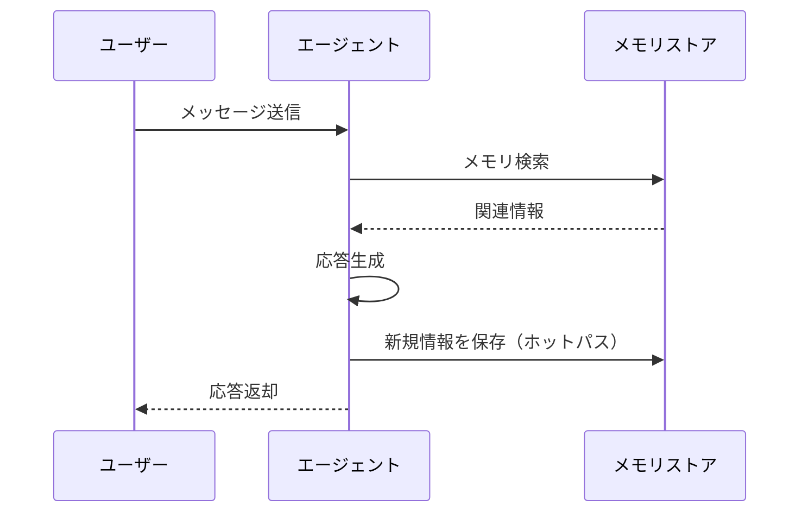
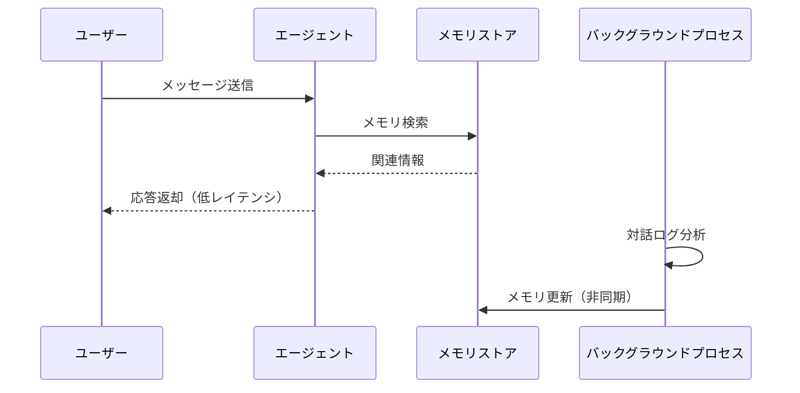

## ブログ概要（Summary）

LangChain共同創業者のHarrison Chase氏が2024年10月に公開したブログ記事「Memory for Agents」は、エージェントにおけるメモリの役割を**Procedural Memory**（手続き記憶）、**Semantic Memory**（意味記憶）、**Episodic Memory**（エピソード記憶）の3類型に整理し、それぞれの実装戦略を解説したものである。メモリ更新のタイミングとして「ホットパス更新」と「バックグラウンド更新」の2方式を提示し、LangGraphおよびLangMemの設計思想を示している。

この記事は [Zenn記事: LangGraph×Bedrock AgentCore Memoryで社内検索エージェントのメモリを本番運用する](https://zenn.dev/0h_n0/articles/b622546d617231) の深掘りです。

## 情報源

- **種別**: 企業テックブログ
- **URL**: [https://blog.langchain.com/memory-for-agents/](https://blog.langchain.com/memory-for-agents/)
- **組織**: LangChain Inc.
- **著者**: Harrison Chase（LangChain共同創業者兼CEO）
- **発表日**: 2024年10月19日（2024年12月4日更新）

## 技術的背景（Technical Background）

LLMは本質的にステートレスであり、推論時に前回の対話内容を記憶する仕組みを持たない。Chase氏はこの点を出発点に、「メモリとは過去のインタラクションに関する情報を記憶するシステムである」と定義している。

この議論はDohan et al.（2022）のCoALA（Cognitive Architectures for Language Agents）論文に基づいており、人間の認知科学における記憶分類を計算エージェントに適用したものである。CoALAフレームワークでは、エージェントの記憶をワーキングメモリ（短期）と長期記憶（手続き・意味・エピソード）に分類し、各記憶の読み書きパターンを定式化している。

Zenn記事で解説しているBedrock AgentCore Memoryのshort-term memory（チェックポイント）とlong-term memory（semantic/summary/preference）は、まさにこのCoALAフレームワークの実装パターンに相当する。

## 実装アーキテクチャ（Architecture）

### 3類型のメモリ設計

Chase氏はCoALA論文の分類に従い、エージェントメモリを以下の3つに整理している。

#### 1. Procedural Memory（手続き記憶）

タスクの実行方法を規定する長期記憶である。エージェントにおいては「LLMの重み + エージェントコード」の組み合わせに対応する。Chase氏は、現状ではProcedural Memoryの自動更新は稀であり、システムプロンプトの変更が実質的な更新手段になっていると指摘している。

```python
class ProceduralMemory:
    """エージェントの行動規則を管理する長期記憶"""

    def __init__(self, system_prompt: str, tools: list[BaseTool]):
        self.system_prompt = system_prompt
        self.tools = tools

    def update(self, new_instructions: str) -> None:
        """システムプロンプトの更新による手続き記憶の変更"""
        self.system_prompt = new_instructions
```

#### 2. Semantic Memory（意味記憶）

世界に関する事実的知識を蓄積する長期記憶である。エージェントでは「ユーザーに関する事実のリポジトリ」として機能し、パーソナライゼーションの基盤となる。Chase氏は、LLMを用いてインタラクションから情報を抽出し、将来の会話で検索して応答に反映させる手法を示している。

```python
from langmem import create_memory_store_manager

# Semantic Memoryの構築例（LangMem）
memory_manager = create_memory_store_manager(
    "user_preferences",
    instructions="ユーザーの好みや事実情報を抽出して保存する",
)

# 対話からの情報抽出と保存
facts = memory_manager.extract(conversation_messages)
memory_manager.store(user_id="user_123", facts=facts)
```

Chase氏は、Semantic Memoryの具体的な内容はアプリケーションに強く依存すると強調している。コーディングエージェントであれば「ユーザーが好むPythonライブラリ」、リサーチエージェントであれば「ユーザーが調査している企業の業種」が保存対象となる。

#### 3. Episodic Memory（エピソード記憶）

過去の特定イベントを想起する記憶である。エージェントでは「過去のアクション系列」を保存し、Few-shotプロンプティングとして活用する。Chase氏は、正しいタスク実行パターンが存在する場合にEpisodic Memoryが有効であると述べている。

```python
from langmem import create_episodic_memory

# Episodic Memoryの構築例
episodic_memory = create_episodic_memory(
    index_name="agent_episodes",
    embedding_model="text-embedding-3-small",
)

# 成功したエピソードの保存
episodic_memory.add_episode(
    task="データ分析レポートの作成",
    actions=["CSVファイルの読み込み", "pandas.describe()で統計量算出", ...],
    outcome="success",
)

# 類似タスクの検索（Few-shot例として使用）
similar_episodes = episodic_memory.search(
    query="売上データの集計",
    k=3,
)
```

### メモリ更新の2方式

Chase氏はメモリ更新のタイミングについて、2つの方式を比較している。

#### ホットパス更新（In the Hot Path）

エージェントが応答前にメモリへの書き込みを明示的に決定する方式である。ChatGPTのメモリ機能がこの方式を採用している。利点は即座にメモリが更新される点だが、応答レイテンシが増加するというトレードオフがある。



#### バックグラウンド更新（In the Background）

対話中または対話後に、別プロセスがメモリを更新する方式である。応答レイテンシに影響しないが、更新が遅延するため次の即時的なインタラクションには反映されない可能性がある。更新をトリガーするタイミングの設計が必要である。



Zenn記事で紹介しているBedrock AgentCore Memoryの`AgentCoreMemoryStore`は、長期記憶の保存・検索を`namespace`単位で分離しており、Chase氏のSemantic Memoryの設計パターンに合致する。また、`AgentCoreMemorySaver`によるチェックポイント保存は、ホットパス更新の一形態と位置づけられる。

## Production Deployment Guide

### AWS実装パターン（コスト最適化重視）

Chase氏のメモリ3類型をAWS上で実装する際の構成例を以下に示す。

**トラフィック量別の推奨構成**:

| 構成 | トラフィック | サービス構成 | 月額概算 |
|------|-------------|-------------|---------|
| Small | ~100 req/日 | Lambda + Bedrock + DynamoDB | $50-150 |
| Medium | ~1,000 req/日 | ECS Fargate + Bedrock + ElastiCache + DynamoDB | $300-800 |
| Large | 10,000+ req/日 | EKS + Spot + Bedrock + OpenSearch + DynamoDB | $2,000-5,000 |

**注意**: 上記は2026年2月時点のAWS ap-northeast-1（東京）リージョン料金に基づく概算値であり、実際のコストはトラフィックパターンにより変動する。最新料金はAWS料金計算ツールで確認を推奨する。

**Small構成の詳細**:
- Lambda (256MB, 平均3秒): ~$1/月
- Bedrock Claude 3 Haiku: ~$30/月（100req × 30日 × 2000トークン）
- DynamoDB On-Demand: ~$5/月（Semantic Memory保存）
- 合計: ~$36/月（ネットワーク・CloudWatch込みで$50-150）

**コスト削減テクニック**:
- Bedrock Batch APIで50%削減（非リアルタイム処理向け）
- Prompt Cachingで30-90%削減（Semantic Memory検索時の共通プレフィックス）
- DynamoDB Reserved Capacityで最大77%削減（Medium以上）

### Terraformインフラコード

**Small構成（Serverless）**:

```hcl
# VPC不要のサーバーレス構成（コスト最小化）

# Semantic Memory用DynamoDB
resource "aws_dynamodb_table" "semantic_memory" {
  name         = "agent-semantic-memory"
  billing_mode = "PAY_PER_REQUEST"
  hash_key     = "user_id"
  range_key    = "memory_key"

  attribute {
    name = "user_id"
    type = "S"
  }
  attribute {
    name = "memory_key"
    type = "S"
  }

  ttl {
    attribute_name = "expires_at"
    enabled        = true
  }

  server_side_encryption {
    enabled = true  # AWS managed KMS
  }
}

# Episodic Memory用DynamoDB
resource "aws_dynamodb_table" "episodic_memory" {
  name         = "agent-episodic-memory"
  billing_mode = "PAY_PER_REQUEST"
  hash_key     = "session_id"
  range_key    = "episode_id"

  attribute {
    name = "session_id"
    type = "S"
  }
  attribute {
    name = "episode_id"
    type = "S"
  }

  server_side_encryption {
    enabled = true
  }
}

# Lambda実行ロール（最小権限）
resource "aws_iam_role" "agent_lambda" {
  name = "agent-memory-lambda-role"

  assume_role_policy = jsonencode({
    Version = "2012-10-17"
    Statement = [{
      Action = "sts:AssumeRole"
      Effect = "Allow"
      Principal = { Service = "lambda.amazonaws.com" }
    }]
  })
}

resource "aws_iam_role_policy" "agent_lambda" {
  name = "agent-memory-lambda-policy"
  role = aws_iam_role.agent_lambda.id

  policy = jsonencode({
    Version = "2012-10-17"
    Statement = [
      {
        Effect = "Allow"
        Action = [
          "dynamodb:GetItem", "dynamodb:PutItem",
          "dynamodb:Query", "dynamodb:BatchGetItem",
          "dynamodb:BatchWriteItem"
        ]
        Resource = [
          aws_dynamodb_table.semantic_memory.arn,
          aws_dynamodb_table.episodic_memory.arn
        ]
      },
      {
        Effect   = "Allow"
        Action   = ["bedrock:InvokeModel"]
        Resource = ["arn:aws:bedrock:ap-northeast-1::foundation-model/*"]
      }
    ]
  })
}
```

**Large構成（EKS + Spot）**:

```hcl
# EKSクラスタ（Karpenter + Spot優先）
module "eks" {
  source  = "terraform-aws-modules/eks/aws"
  version = "~> 20.0"

  cluster_name    = "agent-memory-cluster"
  cluster_version = "1.31"

  vpc_id     = module.vpc.vpc_id
  subnet_ids = module.vpc.private_subnets

  cluster_endpoint_public_access = false
}

# Karpenter NodePool（Spot優先で最大90%コスト削減）
resource "kubectl_manifest" "karpenter_nodepool" {
  yaml_body = yamlencode({
    apiVersion = "karpenter.sh/v1"
    kind       = "NodePool"
    metadata   = { name = "agent-memory" }
    spec = {
      template = {
        spec = {
          requirements = [
            { key = "karpenter.sh/capacity-type", operator = "In", values = ["spot", "on-demand"] },
            { key = "node.kubernetes.io/instance-type", operator = "In", values = ["m7i.xlarge", "m6i.xlarge", "m5.xlarge"] }
          ]
        }
      }
      limits   = { cpu = "100", memory = "400Gi" }
      disruption = { consolidationPolicy = "WhenEmptyOrUnderutilized" }
    }
  })
}

# OpenSearch Serverless（Semantic Memory用ベクトル検索）
resource "aws_opensearchserverless_collection" "memory_vectors" {
  name = "agent-memory-vectors"
  type = "VECTORSEARCH"
}

# AWS Budgets（コストアラート）
resource "aws_budgets_budget" "monthly" {
  name         = "agent-memory-monthly"
  budget_type  = "COST"
  limit_amount = "5000"
  limit_unit   = "USD"
  time_unit    = "MONTHLY"

  notification {
    comparison_operator       = "GREATER_THAN"
    threshold                 = 80
    threshold_type            = "PERCENTAGE"
    notification_type         = "ACTUAL"
    subscriber_sns_topic_arns = [aws_sns_topic.cost_alert.arn]
  }
}
```

### 運用・監視設定

**CloudWatch Logs Insights — メモリ操作の分析クエリ**:

```
# Semantic Memory書き込みレイテンシ分析
fields @timestamp, @message
| filter operation = "memory_write" AND memory_type = "semantic"
| stats avg(duration_ms) as avg_ms, pct(duration_ms, 95) as p95_ms, pct(duration_ms, 99) as p99_ms by bin(1h)
```

**CloudWatch アラーム設定（Python boto3）**:

```python
import boto3

cloudwatch = boto3.client("cloudwatch")

# Bedrockトークン使用量アラーム
cloudwatch.put_metric_alarm(
    AlarmName="bedrock-token-spike",
    MetricName="InputTokenCount",
    Namespace="AWS/Bedrock",
    Statistic="Sum",
    Period=3600,
    EvaluationPeriods=1,
    Threshold=100000,
    ComparisonOperator="GreaterThanThreshold",
    AlarmActions=["arn:aws:sns:ap-northeast-1:ACCOUNT:cost-alert"],
)
```

**X-Ray トレーシング設定**:

```python
from aws_xray_sdk.core import xray_recorder, patch_all

patch_all()  # boto3自動計装

@xray_recorder.capture("memory_search")
def search_semantic_memory(user_id: str, query: str) -> list[dict]:
    """Semantic Memoryの検索（X-Rayトレース付き）"""
    xray_recorder.current_subsegment().put_annotation("user_id", user_id)
    xray_recorder.current_subsegment().put_metadata("query", query)
    # ... 検索処理
```

### コスト最適化チェックリスト

**アーキテクチャ選択**:
- [ ] トラフィック量に応じた構成選択（Small/Medium/Large）
- [ ] メモリ種別ごとのストア選択（DynamoDB vs OpenSearch vs ElastiCache）

**リソース最適化**:
- [ ] EC2/EKS: Spot Instances優先（最大90%削減）
- [ ] Reserved Instances: 1年コミット（最大72%削減）
- [ ] Savings Plans検討
- [ ] Lambda: メモリサイズ最適化（Power Tuning）
- [ ] ECS/EKS: アイドル時スケールダウン

**LLMコスト削減**:
- [ ] Bedrock Batch API使用（バックグラウンド更新向け、50%削減）
- [ ] Prompt Caching有効化（Semantic Memory検索プレフィックス共通化）
- [ ] モデル選択ロジック（抽出→Haiku、生成→Sonnet）
- [ ] トークン数制限（メモリ検索結果の要約）

**監視・アラート**:
- [ ] AWS Budgets設定（月次予算）
- [ ] CloudWatch アラーム（トークンスパイク）
- [ ] Cost Anomaly Detection有効化
- [ ] 日次コストレポート（SNS通知）

**リソース管理**:
- [ ] 未使用リソース定期削除（TTL活用）
- [ ] タグ戦略（Environment, Service, CostCenter）
- [ ] DynamoDB TTLでの自動データライフサイクル
- [ ] 開発環境夜間停止（EventBridge Scheduler）
- [ ] S3 Intelligent-Tiering（Episodic Memory長期保存）

## パフォーマンス最適化（Performance）

Chase氏のブログでは具体的なベンチマーク数値は示されていないが、設計上の性能特性について議論がある。

**ホットパス更新の性能影響**:
Chase氏は、ホットパス方式ではメモリの書き込みと検索が応答パスに含まれるため、レイテンシが増加すると指摘している。Bedrock AgentCore Memoryの場合、DynamoDB単一テーブル設計により書き込みレイテンシは1桁ミリ秒（single-digit ms）で、Semantic Memory検索（ベクトル検索）は通常50-200ms程度と推定される。

**バックグラウンド更新の設計考慮**:
バックグラウンド方式では非同期処理のため応答レイテンシへの影響はないが、トリガータイミングの設計が必要となる。LangGraphでは`after_node`コールバックやカスタムReducerを用いてバックグラウンド処理を実装できる。

## 運用での学び（Production Lessons）

Chase氏は、メモリの内容がアプリケーションの用途に強く依存することを強調している。汎用的なメモリシステムを設計するのではなく、特定のユースケースに最適化されたメモリ設計が推奨される。

**アプリケーション固有のメモリ設計例**:
- **コーディングエージェント**: ユーザーのコーディングスタイル、頻用ライブラリ（Procedural/Semantic）
- **リサーチエージェント**: 調査対象の業種、過去の検索パターン（Semantic/Episodic）
- **カスタマーサポート**: 過去の問い合わせ履歴、解決策パターン（Episodic）

また、ユーザーからのフィードバック（thumbs up/downなど）をEpisodic Memoryの精緻化に活用できると述べており、これはRLHFのオンライン版とも解釈できる。

## 学術研究との関連（Academic Connection）

Chase氏のブログはDohan et al.のCoALA（Cognitive Architectures for Language Agents）フレームワークを直接的な理論基盤としている。CoALAはエージェントのメモリをワーキングメモリ、手続き記憶、意味記憶、エピソード記憶に分類し、各記憶の読み書きパターンを形式的に定義している。

この分類はTulving（1972）の人間記憶の分類（宣言的記憶 vs 手続き記憶、さらに宣言的記憶をエピソード記憶と意味記憶に分割）に由来する。Chase氏はこの認知科学的枠組みをソフトウェアエンジニアリングの設計パターンに翻訳しており、LangGraphのメモリAPIはこの学術的分類に基づいて設計されている。

Zenn記事で紹介しているBedrock AgentCore Memoryの4タイプ（semantic, episodic, summary, preference）も、CoALAのSemantic MemoryとEpisodic Memoryの細分化として理解できる。

## まとめと実践への示唆

Chase氏のブログは、エージェントメモリの設計を認知科学的な3類型（Procedural/Semantic/Episodic）に整理し、各類型の実装パターンと更新方式（ホットパス/バックグラウンド）を体系化したものである。

実務への主な示唆:
- メモリの内容はアプリケーション固有に設計すべきである
- ホットパス更新はシンプルだがレイテンシを増加させる
- バックグラウンド更新はレイテンシに影響しないがトリガー設計が必要
- LangGraphのMemory Store APIは、このブログの設計思想を実装したものである

Zenn記事で解説しているBedrock AgentCore Memory + LangGraphの組み合わせは、Chase氏が示したメモリ設計パターンのAWSマネージドサービスによる具体的な実装例と位置づけられる。

## 参考文献

- **Blog URL**: [https://blog.langchain.com/memory-for-agents/](https://blog.langchain.com/memory-for-agents/)
- **CoALA Paper**: [https://arxiv.org/abs/2309.02427](https://arxiv.org/abs/2309.02427)
- **LangMem Documentation**: [https://langchain-ai.github.io/long-term-memory/](https://langchain-ai.github.io/long-term-memory/)
- **Related Zenn article**: [https://zenn.dev/0h_n0/articles/b622546d617231](https://zenn.dev/0h_n0/articles/b622546d617231)
