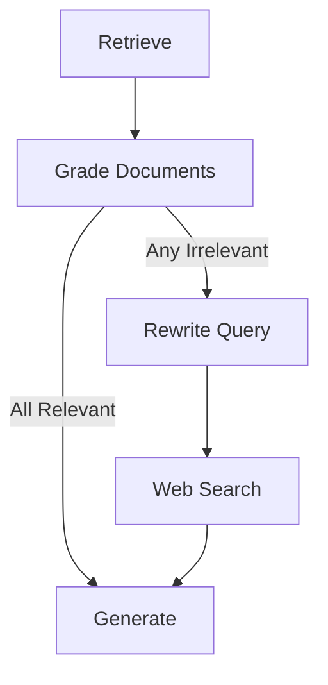
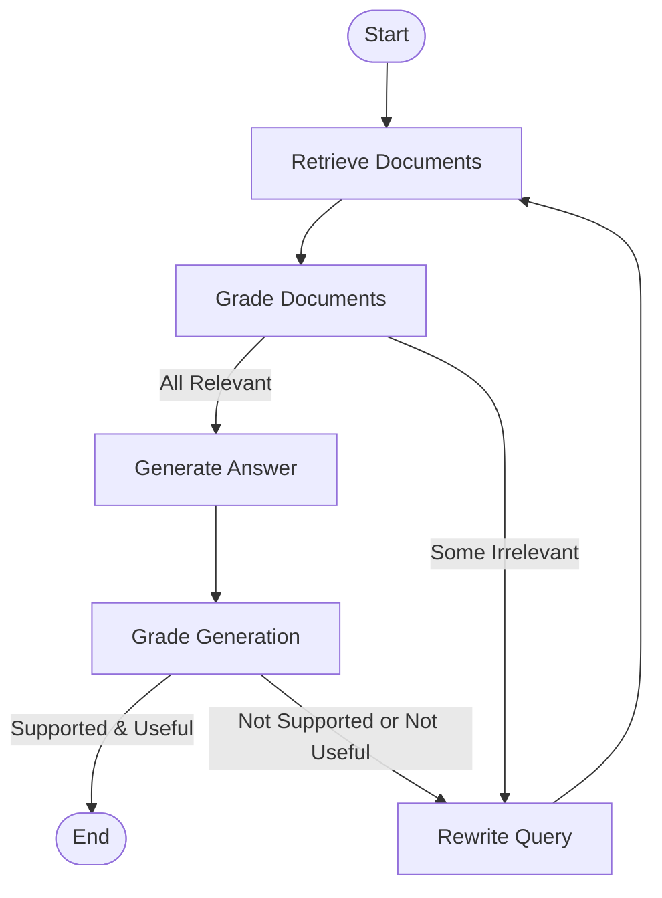

本記事は [LangChain Blog: Self-Reflective RAG with LangGraph](https://blog.langchain.com/agentic-rag-with-langgraph/) の解説記事です。

この記事は [Zenn記事: LangGraph×Claude Sonnet 4.6のtool_useで出典付きAgentic RAGを構築する](https://zenn.dev/0h_n0/articles/11cb2066e667ed) の深掘りです。

## ブログ概要（Summary）

LangChainの公式ブログでは、LangGraphのStateGraphを用いてSelf-Reflective RAG（自己反省型RAG）を実装する方法を解説している。具体的には、CRAG（Corrective RAG）とSelf-RAGの2つのパターンを取り上げ、検索結果の品質評価→クエリ書き換え→再検索という自己修正ループをグラフベースで構築する手法を紹介している。この記事はZenn記事で解説されているAgentic RAGアーキテクチャの直接的な設計基盤となっている。

## 情報源

- **種別**: 企業テックブログ
- **URL**: [https://blog.langchain.com/agentic-rag-with-langgraph/](https://blog.langchain.com/agentic-rag-with-langgraph/)
- **組織**: LangChain
- **発表日**: 2024年2月

## 技術的背景（Technical Background）

### RAGの認知アーキテクチャ分類

LangChainのブログでは、RAGのアーキテクチャを認知アーキテクチャの観点から3つのレベルに分類している。

1. **Chain（チェーン）**: 検索→生成の単純なパイプライン。条件分岐やループを持たない
2. **Routing（ルーティング）**: LLMが検索戦略を動的に選択する。クエリの意図に応じてベクトル検索・キーワード検索・Web検索を切り替える
3. **State Machine（状態機械）**: 条件付き遷移とループを持つ複雑なグラフ構造。Self-Reflective RAGはこのレベルに位置する

従来のChainアーキテクチャでは、検索結果の品質が低い場合でもそのまま回答生成に進んでしまう。State Machine（LangGraphのStateGraph）を採用することで、検索結果の評価→リトライという自己修正ループが可能になる。

### 学術研究との関連

このブログで紹介されているパターンは、以下の学術研究に基づいている。

- **CRAG (Yan et al., 2023)**: Corrective Retrieval Augmented Generation。検索結果を「正確」「曖昧」「不正確」の3段階で評価し、不正確な場合はWeb検索にフォールバック
- **Self-RAG (Asai et al., 2023)**: 自己反省トークン（reflection tokens）を用いてLLM自身が検索・生成・批評を行う

## 実装アーキテクチャ（Architecture）

### CRAGパターンの実装

CRAGは検索結果の品質を評価し、不十分な場合にWeb検索で補完する自己修正型RAGである。LangChainブログでは、以下の簡略化されたLangGraph実装を紹介している。



ブログによると、原論文のCRAGでは「知識ストリップ」に分割してフィルタリングするpost-processing工程があるが、LangGraph実装では以下の簡略化を行っている。

1. 知識精製のpost-processing工程をスキップ
2. **いずれかのドキュメントが無関係**であればWeb検索をトリガー
3. クエリ書き換えによりWeb検索を最適化
4. Pydanticモデルによる構造化出力でバイナリ判定を実装

```python
from pydantic import BaseModel, Field
from langchain_anthropic import ChatAnthropic

class GradeResult(BaseModel):
    """ドキュメント関連度のバイナリ判定"""
    binary_score: str = Field(description="'yes' or 'no'")

def grade_documents(state: dict) -> dict:
    """検索ドキュメントの関連度を評価"""
    llm = ChatAnthropic(model="claude-sonnet-4-6-20260217")
    grader = llm.with_structured_output(GradeResult)
    query = state["query"]
    relevant_docs = []
    web_search_needed = False

    for doc in state["documents"]:
        result = grader.invoke(
            f"クエリ: {query}\n"
            f"ドキュメント: {doc['content'][:500]}\n"
            f"このドキュメントはクエリに関連していますか？"
        )
        if result.binary_score == "yes":
            relevant_docs.append(doc)
        else:
            web_search_needed = True

    return {
        "documents": relevant_docs,
        "web_search_needed": web_search_needed,
    }
```

### Self-RAGパターンの実装

Self-RAGは、LLM自身が自己反省トークンを生成して検索・生成・批評の各段階を制御する手法である。ブログでは以下の4つの反省トークンを紹介している。

| トークン | 機能 | 入力 | 出力 |
|---------|------|------|------|
| **Retrieve** | 検索の必要性判定 | 質問 or 質問+生成結果 | yes / no / continue |
| **ISREL** | passage関連度評価 | 質問, チャンク | relevant / irrelevant |
| **ISSUP** | 生成結果の支持度 | 質問, チャンク, 生成結果 | fully / partially / unsupported |
| **ISUSE** | 応答の有用度 | 質問, 生成結果 | 1-5点スケール |

LangGraph実装では、以下の簡略化が行われている。

1. 全ドキュメントをまとめて評価（原論文のチャンクごとの評価ではなく）
2. 生成は1回の統合生成（チャンクごとの複数生成ではなく）
3. ドキュメントが無関係 or 生成がグレーディングに失敗した場合にクエリを書き換えて再検索

### StateGraphによる自己修正ループ

LangGraphのStateGraphで自己修正ループを構築する全体フローは以下の通りである。



ブログでは、この自己修正ループの実例として以下のケースを紹介している。初回のクエリ「agent memory」に対する生成が低い有用度スコアを受け、クエリが「How do the various types of agent memory function?」に書き換えられ、再検索・再生成により合格する回答が得られたとされている。

### Zenn記事との対応関係

Zenn記事のAgentic RAGアーキテクチャは、このブログのSelf-RAGパターンを基盤として以下の拡張を行っている。

| LangChainブログ | Zenn記事の実装 |
|----------------|---------------|
| Retrieve → Grade → Rewrite ループ | analyze_query → route_query → 検索 → grade_documents → generate or rewrite_query |
| GradeResult (binary) | GradeResult with binary_score |
| Web Search fallback | search_strategy: vector / keyword / web の動的切り替え |
| — | Claude search_result content blocksによる自動引用 |
| — | retry_count によるループ回数制限（最大2回） |

## パフォーマンス最適化（Performance）

### レイテンシの考慮事項

自己修正ループはレイテンシを増加させる。ブログの実装パターンに基づく典型的なレイテンシ見積もりは以下の通りである。

| 処理ステップ | 推定レイテンシ | 備考 |
|------------|-------------|------|
| Retrieve（ベクトル検索） | 50-200ms | ベクトルDB依存 |
| Grade Documents（LLM判定） | 500-2000ms | ドキュメント数 × LLM推論時間 |
| Rewrite Query | 500-1000ms | LLM 1回呼び出し |
| Web Search | 1000-3000ms | 外部API依存 |
| Generate Answer | 1000-3000ms | LLM 1回呼び出し |
| Grade Generation | 500-1000ms | LLM 1回呼び出し |

1ループの合計: 約2-5秒。最大2回リトライで4-10秒。

### 最適化手法

1. **並列グレーディング**: `asyncio.gather`で複数ドキュメントのグレーディングを並列実行
2. **Early termination**: 関連ドキュメントが十分見つかった時点でグレーディングを打ち切る
3. **キャッシュ**: 同一クエリに対する検索結果・グレーディング結果をキャッシュ
4. **ループ回数制限**: Zenn記事の実装のように`retry_count`を設けて最大リトライ回数を制限

## 運用での学び（Production Lessons）

### 自己修正ループの設計指針

ブログの内容に基づく運用上の教訓は以下の通りである。

1. **ループ回数の制限**: 曖昧なクエリでは延々とリトライが続く可能性がある。Zenn記事でも指摘されている通り、最大2回程度に制限すべき
2. **フォールバック戦略**: 全てのドキュメントが無関係と判定された場合、Web検索にフォールバックする戦略が有効
3. **LangSmithによるトレーシング**: 自己修正ループの各ステップをLangSmithでトレースすることで、ボトルネックの特定とデバッグが容易になる
4. **グレーディング閾値の調整**: バイナリ判定（yes/no）ではなくスコアベースの判定にすることで、より柔軟なルーティングが可能

### Pydantic構造化出力の活用

ブログではPydanticモデルによる構造化出力を推奨している。これはClaude APIのtool_useを内部的に利用しており、Zenn記事のGradeDocumentsパターンと直接対応する。

```python
from langchain_anthropic import ChatAnthropic
from pydantic import BaseModel, Field

class RouteDecision(BaseModel):
    """クエリルーティングの判定結果"""
    datasource: str = Field(
        description="'vectorstore' or 'web_search'"
    )

llm = ChatAnthropic(model="claude-sonnet-4-6-20260217")
router = llm.with_structured_output(RouteDecision)

result = router.invoke(
    "ユーザーのクエリを分析し、適切なデータソースを選択してください。"
    f"\nクエリ: {query}"
)
```

## Production Deployment Guide

### AWS実装パターン（コスト最適化重視）

| 規模 | 月間リクエスト | 推奨構成 | 月額コスト |
|------|--------------|---------|-----------|
| **Small** | ~3,000 | Lambda + Bedrock | $50-150 |
| **Medium** | ~30,000 | ECS Fargate + Bedrock | $300-800 |
| **Large** | 300,000+ | EKS + Karpenter | $2,000-5,000 |

**コスト試算の注意事項**: 上記は2026年2月時点のAWS ap-northeast-1料金に基づく概算値です。最新料金は [AWS料金計算ツール](https://calculator.aws/) で確認してください。

### Terraformインフラコード

```hcl
resource "aws_lambda_function" "self_reflective_rag" {
  filename      = "lambda.zip"
  function_name = "self-reflective-rag"
  role          = aws_iam_role.lambda_bedrock.arn
  handler       = "index.handler"
  runtime       = "python3.12"
  timeout       = 120  # 自己修正ループ考慮で120秒
  memory_size   = 1024

  environment {
    variables = {
      BEDROCK_MODEL_ID = "anthropic.claude-sonnet-4-6-20260217-v1:0"
      MAX_RETRIES      = "2"
      VECTOR_DB_HOST   = var.opensearch_endpoint
    }
  }
}
```

### コスト最適化チェックリスト

- [ ] ループ回数制限（MAX_RETRIES=2）でLLM呼び出し回数を抑制
- [ ] Prompt Caching有効化（システムプロンプト固定部分の再利用）
- [ ] グレーディングにはHaikuモデル、生成にはSonnetモデルを使い分け
- [ ] asyncio.gatherで並列グレーディング（レイテンシ削減）
- [ ] DynamoDBキャッシュで同一クエリの重複処理を回避
- [ ] Lambda Insights: メモリサイズ最適化
- [ ] CloudWatch: ループ回数・レイテンシの監視
- [ ] AWS Budgets: 月額予算設定

## まとめと実践への示唆

LangChainのSelf-Reflective RAGブログは、Agentic RAGの実装パターンを体系的に解説した実践的なリソースである。CRAGとSelf-RAGの2つのパターンをLangGraphのStateGraphで実装することで、検索結果の品質評価→クエリ書き換え→再検索という自己修正ループを構築できる。

Zenn記事のAgentic RAGアーキテクチャは、このブログのパターンを基盤としてClaude Sonnet 4.6のsearch_result content blocksによる自動引用と、retry_countによるループ制限を追加した拡張版と位置づけられる。

## 参考文献

- **Blog URL**: [https://blog.langchain.com/agentic-rag-with-langgraph/](https://blog.langchain.com/agentic-rag-with-langgraph/)
- **CRAG原論文**: Yan et al., "Corrective Retrieval Augmented Generation" (arXiv: 2401.15884)
- **Self-RAG原論文**: Asai et al., "Self-RAG: Learning to Retrieve, Generate, and Critique through Self-Reflection" (arXiv: 2310.11511)
- **Related Zenn article**: [https://zenn.dev/0h_n0/articles/11cb2066e667ed](https://zenn.dev/0h_n0/articles/11cb2066e667ed)

---

:::message
この記事はAI（Claude Code）により自動生成されました。内容の正確性については情報源の公式ブログもご確認ください。
:::
