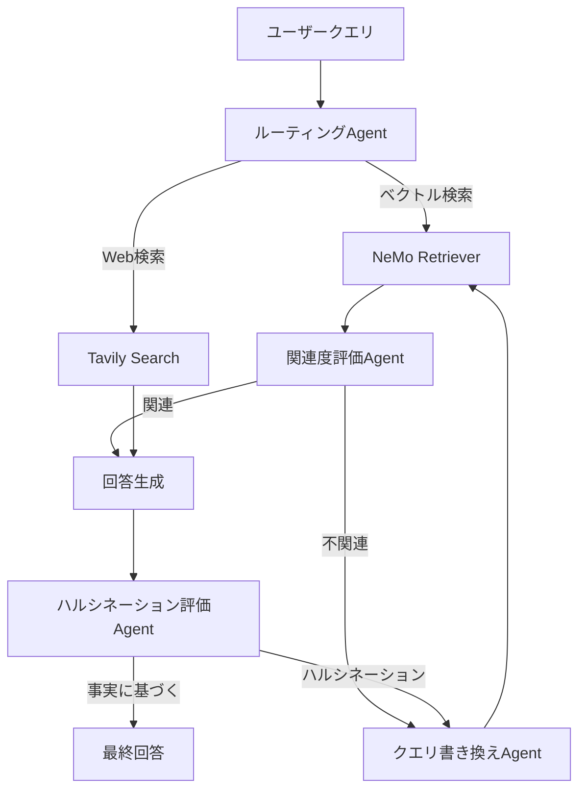

本記事は [NVIDIA Developer Blog: "Build an Agentic RAG Pipeline with Llama 3.1 and NVIDIA NeMo Retriever NIMs"](https://developer.nvidia.com/blog/build-an-agentic-rag-pipeline-with-llama-3-1-and-nvidia-nemo-retriever-nims/) の解説記事です。

この記事は [Zenn記事: LangGraph×Claude Sonnet 4.6でSQL統合Agentic RAGを実装する](https://zenn.dev/0h_n0/articles/58dc3076d2ffba) の深掘りです。

## ブログ概要

NVIDIAの技術ブログでは、LLaMA 3.1（70B/8B）とNeMo Retriever NIMsを組み合わせた「Adaptive Agentic RAG」パイプラインの設計・実装を解説している。従来のナイーブRAG（Retrieve→Generate の1パス処理）に対して、エージェントが検索品質を自律的に評価し、不十分な場合はWeb検索やクエリ書き換えで補完するアーキテクチャを提案している。実装はLangGraphのStateGraphを使用しており、本Zenn記事のSQL統合Agentic RAGと共通のフレームワーク基盤を持つ。

## 情報源

- **URL**: [https://developer.nvidia.com/blog/build-an-agentic-rag-pipeline-with-llama-3-1-and-nvidia-nemo-retriever-nims/](https://developer.nvidia.com/blog/build-an-agentic-rag-pipeline-with-llama-3-1-and-nvidia-nemo-retriever-nims/)
- **著者**: NVIDIA Developer Relations
- **公開年**: 2024
- **分野**: Retrieval-Augmented Generation, LLM Inference
- **関連リポジトリ**: [NVIDIA/GenerativeAIExamples](https://github.com/NVIDIA/GenerativeAIExamples)（GitHub、Apache 2.0ライセンス）

## 技術的背景（Technical Background）

### ナイーブRAGの限界

従来のRAGパイプラインは「Retrieve → Generate」の単一パスで動作する。この構成では以下の問題が生じる。

第一に、検索結果の品質評価がないため、無関連なドキュメントが取得されてもそのまま生成に使用される。第二に、クエリが曖昧な場合に検索精度が低下しても、リカバリー手段がない。第三に、ドキュメントストアに回答が存在しない場合でも、ハルシネーションを含む回答を生成してしまう。

NVIDIAのブログでは、これらの問題に対してSelf-RAG（Asai et al., 2023）とCRAG（Corrective RAG, Yan et al., 2024）の概念を組み合わせた「Adaptive Agentic RAG」を提案している。

### NeMo Retriever NIMsとは

NeMo Retriever NIMsは、NVIDIAが提供するマイクロサービスとして最適化された検索コンポーネント群である。以下の3つのNIMで構成される。

1. **Embedding NIM**: テキストをベクトルに変換するエンコーダ。NV-Embed-v2モデルを使用し、MTEB（Massive Text Embedding Benchmark）でトップクラスの性能を達成
2. **Reranking NIM**: 検索結果の関連度を再スコアリング。Cross-Encoderベースでクエリ-ドキュメントペアの類似度を精密に計算
3. **Retrieval NIM**: Milvusベクトルデータベースとの統合インターフェース。ANN（Approximate Nearest Neighbor）検索をGPUアクセラレーション

各NIMはDockerコンテナとしてデプロイされ、NVIDIA API Catalogから取得可能である。

## 実装アーキテクチャ（Implementation Architecture）

### Adaptive Agentic RAGのフロー

ブログで提示されたパイプラインは、LangGraphのStateGraphで実装されている。



### 4つのエージェントノード

パイプラインは4種のエージェントノードで構成される。

**1. ルーティングAgent**: ユーザークエリをベクトル検索またはWeb検索に振り分ける。クエリの種類（事実確認、最新情報、ドメイン固有）に応じてルーティングを決定する。LLMが`vectorstore`または`web_search`のラベルを返す構造化出力を使用。

**2. 関連度評価Agent**: 取得されたドキュメントがクエリに対して関連性があるかを2値分類する。各ドキュメントに対して`yes`（関連）または`no`（不関連）のスコアを付与。全ドキュメントが`no`の場合、クエリ書き換えにフォールバックする。

**3. クエリ書き換えAgent**: 検索品質が不十分な場合にクエリを再構成する。元のクエリをLLMに渡し、より検索に適した表現に変換する。例えば「RAGの精度を上げるには？」を「retrieval augmented generation accuracy improvement techniques embedding reranking」に書き換える。

**4. ハルシネーション評価Agent**: 生成された回答が検索結果に基づいているかを検証する。回答中の各主張について、ソースドキュメントに根拠があるかを確認し、根拠のない主張が含まれる場合は再生成をトリガーする。

### LangGraph StateGraph実装

ブログではLangGraphのStateGraphで状態遷移を定義している。

```python
from langgraph.graph import StateGraph, END

class GraphState(TypedDict):
    question: str
    generation: str
    documents: list[str]

workflow = StateGraph(GraphState)

# ノード追加
workflow.add_node("retrieve", retrieve)
workflow.add_node("grade_documents", grade_documents)
workflow.add_node("generate", generate)
workflow.add_node("transform_query", transform_query)
workflow.add_node("web_search", web_search_node)

# エッジ定義
workflow.set_conditional_entry_point(
    route_question,
    {"vectorstore": "retrieve", "web_search": "web_search"}
)
workflow.add_edge("retrieve", "grade_documents")
workflow.add_conditional_edges(
    "grade_documents",
    decide_to_generate,
    {"transform_query": "transform_query", "generate": "generate"}
)
workflow.add_edge("transform_query", "retrieve")
workflow.add_conditional_edges(
    "generate",
    grade_generation,
    {"useful": END, "not useful": "transform_query"}
)
```

この実装パターンは、Zenn記事のSQL統合Agentic RAGと共通のStateGraph構造を使用している。Zenn記事ではSQL検索ノードとベクトル検索ノードの分岐を`route_query`関数で行っているが、NVIDIAのブログではベクトル検索とWeb検索の分岐、さらに検索結果の品質評価ループを追加している。

## パフォーマンス最適化

### NIM推論最適化

NeMo Retriever NIMsはTensorRT-LLMバックエンドを使用し、以下の最適化が適用されている。

1. **連続バッチング**: リクエストを動的にバッチ化し、GPUの利用率を最大化
2. **KVキャッシュ管理**: PagedAttentionベースのKVキャッシュで、長いコンテキストウィンドウを効率的に管理
3. **量子化推論**: FP8/INT8量子化により、精度を維持しつつスループットを向上

### GPU推論のスケーリング

LLaMA 3.1 70Bモデルの推論には、NVIDIA A100またはH100 GPUが推奨されている。8B版はA10G（24GB）でも動作可能であり、コスト最適化が可能。ブログではNVIDIA API Catalogのホスティッドエンドポイントを使用する方法と、オンプレミスでNIMコンテナをデプロイする方法の両方が紹介されている。

### Embedding NIMの精度

NV-Embed-v2はMTEBベンチマークで以下の特徴を持つ。

- **次元数**: 4096次元（デフォルト）。Matryoshka Representation Learningにより256-4096次元で動的に切り替え可能
- **最大入力長**: 32,768トークン。長文ドキュメントのチャンク分割回数を削減
- **マルチタスク対応**: 検索（retrieval）、分類（classification）、クラスタリング（clustering）の各タスクで高精度

Reranking NIMではCross-Encoderアーキテクチャを採用しており、Bi-Encoderによる初期検索（高速だが粗い）の後にCross-Encoder（低速だが精密）で再スコアリングする2段構成が推奨されている。この2段構成は、大規模ドキュメントストア（100万件以上）での検索精度とレイテンシのトレードオフを最適化する。

## 運用での学び（Operational Lessons）

### Self-RAGとCRAGの統合

ブログの設計は、Self-RAG（Asai et al., 2023）の「検索結果の自己評価」とCRAG（Yan et al., 2024）の「検索結果の修正」を組み合わせている。Self-RAGは生成時に検索が必要かを判断する反射トークンを導入し、CRAGは検索結果の信頼度に基づいてWeb検索へのフォールバックを行う。NVIDIAの実装ではこれらをLangGraphの条件付きエッジで統合し、検索品質と生成品質の両方を評価するループを形成している。

### SQL統合Agentic RAGへの適用

Zenn記事のアーキテクチャにNVIDIAのAdaptive Agentic RAGパターンを適用すると、以下の改善が可能である。

1. **SQL結果の関連度評価**: SQL検索ノードの結果に対して、関連度評価Agentを追加。空のResultSetやクエリ意図と乖離した結果を検出し、SQLの書き換えをトリガー
2. **ハルシネーション検証**: 最終回答の生成後に、SQL結果とベクトル検索結果の両方に対する根拠チェックを追加
3. **クエリ書き換えループ**: ベクトル検索の結果が不十分な場合、NVIDIAのクエリ書き換えAgentと同等の機能でクエリを再構成
4. **NIMベースの推論移行**: Claude APIからNeMo Retriever NIMsへの移行により、オンプレミス環境でのデータプライバシー要件に対応可能。特にEmbedding NIMとReranking NIMの2段構成は、SQLメタデータの検索精度向上に直接的に寄与する

## 学術研究との関連（Academic Context）

ブログの設計は以下の学術研究に基づいている。

- **Self-RAG**（Asai et al., 2023, arXiv:2310.11511）: 反射トークンによる検索必要性判断と品質自己評価。NVIDIAの関連度評価Agentの理論的基盤
- **CRAG**（Yan et al., 2024, arXiv:2401.15884）: 検索結果の信頼度スコアリングとWeb検索フォールバック。NVIDIAのルーティングAgentの設計に反映
- **Adaptive RAG**（Jeong et al., 2024, arXiv:2404.16130）: クエリ複雑度に基づく検索戦略の動的選択。NVIDIAのルーティングロジックと共通する設計思想

## ナイーブRAGとの定量的比較

ブログでは、Adaptive Agentic RAGとナイーブRAGの定性的比較が示されている。

| 特性 | ナイーブRAG | Adaptive Agentic RAG |
|------|-----------|---------------------|
| 検索結果評価 | なし | 関連度評価Agent |
| ハルシネーション検出 | なし | 生成後検証Agent |
| クエリ書き換え | なし | 自動書き換えAgent |
| フォールバック | なし | Web検索 |
| レイテンシ | 低（1パス） | 中〜高（最大3パス） |
| 実装複雑度 | 低 | 中（LangGraph使用） |

エージェントによる評価ループを追加することで、レイテンシは増加するが、回答の正確性と信頼性が向上する。ブログではレイテンシ増加を抑えるために、NIMのGPUアクセラレーションとバッチ処理の最適化が推奨されている。

## まとめ

NVIDIAのAgentic RAGパイプラインは、LangGraphベースの検索品質評価ループとNeMo Retriever NIMsによるGPU最適化推論を組み合わせた実践的なアーキテクチャである。Self-RAGとCRAGの学術的知見を産業レベルの実装に落とし込んでいる。

SQL統合Agentic RAGの実装者にとって、NVIDIAの設計パターン（特にルーティングAgent・関連度評価Agent・クエリ書き換えAgent・ハルシネーション評価Agentの4段構成）は、LangGraphのStateGraphに直接組み込むことが可能である。NeMo Retriever NIMsのGPUアクセラレーションは、大規模なドキュメントストアを持つ環境でのスループット改善に有効である。

## 参考文献

- **NVIDIA Blog**: [https://developer.nvidia.com/blog/build-an-agentic-rag-pipeline-with-llama-3-1-and-nvidia-nemo-retriever-nims/](https://developer.nvidia.com/blog/build-an-agentic-rag-pipeline-with-llama-3-1-and-nvidia-nemo-retriever-nims/)
- **Self-RAG**: [https://arxiv.org/abs/2310.11511](https://arxiv.org/abs/2310.11511)
- **CRAG**: [https://arxiv.org/abs/2401.15884](https://arxiv.org/abs/2401.15884)
- **Related Zenn article**: [https://zenn.dev/0h_n0/articles/58dc3076d2ffba](https://zenn.dev/0h_n0/articles/58dc3076d2ffba)
