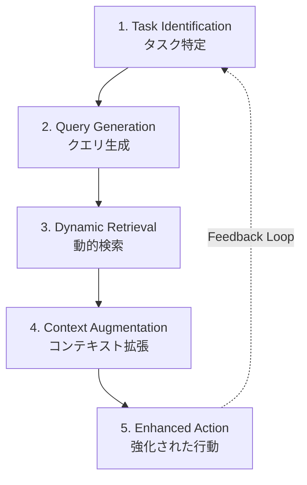
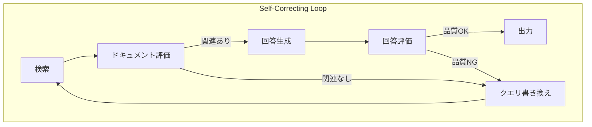

本記事は [NVIDIA Developer Blog: Traditional RAG vs. Agentic RAG—Why AI Agents Need Dynamic Knowledge to Get Smarter](https://developer.nvidia.com/blog/traditional-rag-vs-agentic-rag-why-ai-agents-need-dynamic-knowledge-to-get-smarter/) の解説記事です。

この記事は [Zenn記事: LangGraph×Claude Sonnet 4.6のtool_useで出典付きAgentic RAGを構築する](https://zenn.dev/0h_n0/articles/11cb2066e667ed) の深掘りです。

## ブログ概要（Summary）

NVIDIAのテックブログでは、Traditional RAG（従来型RAG）とAgentic RAG（エージェント型RAG）の根本的な違いを解説し、AIエージェントが動的な知識検索を行うために必要な設計原則を提示している。Traditional RAGが「クエリ→検索→生成」の単一ルックアップであるのに対し、Agentic RAGは「クエリ→精緻化→RAGをツールとして使用→コンテキスト管理→意思決定」という動的なワークフローを持つ。ブログでは5ステップのAgentic RAGワークフローと、フィードバックループによる継続的改善メカニズムを紹介している。

## 情報源

- **種別**: 企業テックブログ
- **URL**: [https://developer.nvidia.com/blog/traditional-rag-vs-agentic-rag-why-ai-agents-need-dynamic-knowledge-to-get-smarter/](https://developer.nvidia.com/blog/traditional-rag-vs-agentic-rag-why-ai-agents-need-dynamic-knowledge-to-get-smarter/)
- **組織**: NVIDIA
- **発表日**: 2025年

## 技術的背景（Technical Background）

### RAGの進化の必然性

NVIDIAのブログによると、Traditional RAGは「高速なQA、シンプルな検索」に適しているが、複雑なタスク（リサーチ、要約、コード分析等）では限界がある。この限界は以下の構造的問題に起因する。

1. **単一ショット検索**: クエリに対して1回だけ検索を実行するため、検索結果の品質が低い場合にリカバリーできない
2. **静的クエリ処理**: ユーザーのクエリをそのまま検索に使用するため、曖昧なクエリや複合的な質問に対応できない
3. **コンテキストの欠如**: 過去の対話履歴やユーザーの意図を考慮せずに検索する

### 学術研究との接続

これらの課題は、CRAG（Yan et al., 2023）やSelf-RAG（Asai et al., 2023）といった学術研究でも指摘されている。NVIDIAのブログは、これらの学術知見を実務的な設計原則としてまとめ直したものと位置づけられる。

## 実装アーキテクチャ（Architecture）

### Traditional RAG vs. Agentic RAG の比較

NVIDIAのブログで提示されている比較表を以下に示す。

| 観点 | Traditional RAG | Agentic RAG |
|------|----------------|-------------|
| **クエリパターン** | 単一の静的ルックアップ | 反復的な精緻化と推論 |
| **ツール統合** | パッシブな情報検索 | アクティブなツール管理 |
| **コンテキスト管理** | 単発のコンテキスト拡張 | 継続的なコンテキスト構築 |
| **ユースケース** | 高速QA、単純な検索 | リサーチ、要約、コード分析 |
| **意思決定** | 応答生成のみ | 計画、推論、行動選択 |

### 5ステップのAgentic RAGワークフロー

ブログでは、Agentic RAGの動作を5つの連続ステップとして説明している。



**Step 1: Task Identification（タスク特定）**
エージェントが現在の目的に対して必要な情報を特定する。これはZenn記事の`analyze_query`ノードに対応する。

**Step 2: Query Generation（クエリ生成）**
特定された情報ニーズに基づいて、検索エンジンに最適なクエリを生成する。単純なキーワード抽出ではなく、意図を反映した構造化クエリを生成する。

**Step 3: Dynamic Retrieval（動的検索）**
常に更新されるナレッジベースを検索し、関連情報を抽出・優先順位付けする。Zenn記事の`search_strategy`（vector / keyword / web）の動的切り替えに対応する。

**Step 4: Context Augmentation（コンテキスト拡張）**
検索されたデータでエージェントのプロンプトコンテキストを拡張する。これはRAGの本質的な機能であるが、Agentic RAGでは過去の検索結果と統合する点が異なる。

**Step 5: Enhanced Action（強化された行動）**
拡張されたコンテキストに基づいてLLMがより正確な応答と意思決定を行う。

### フィードバックループの設計

NVIDIAのブログでは、フィードバックループの重要性を強調している。ブログによると「エージェントの行動や洞察がナレッジベースを更新するフィードバックループにより、継続的な改善サイクルが生まれる」とされている。

この概念は、Zenn記事の自己修正ループ（grade_documents → rewrite_query → 再検索）と直接対応する。



### 推論統合（Reasoning Integration）

ブログによると、Agentic RAGでは推論モデルを使用して回答の関連性を検証し、クエリを反復的に書き換えることが重要であるとされている。この自己修正メカニズムがTraditional RAGとの最大の違いであり、LangGraphのStateGraphでconditional edgesとして実装される。

## Zenn記事のアーキテクチャとの対応

NVIDIAブログの5ステップワークフローとZenn記事のLangGraph実装は以下のように対応する。

| NVIDIAブログ | Zenn記事のLangGraph実装 |
|-------------|----------------------|
| Task Identification | `analyze_query` ノード: クエリの意図分析 |
| Query Generation | `rewrite_query`: search_strategy に基づくクエリ最適化 |
| Dynamic Retrieval | vector / keyword / web の動的切り替え |
| Context Augmentation | `AgenticRAGState.documents` にコンテキスト蓄積 |
| Enhanced Action | `generate_with_citations`: search_result blocksで引用付き生成 |
| Feedback Loop | `grade_documents` → `rewrite_query` → 再検索ループ |

### 重要な拡張点

Zenn記事の実装は、NVIDIAブログのアーキテクチャに以下の拡張を加えている。

1. **出典自動付与**: Claude Sonnet 4.6のsearch_result content blocksにより、フィードバックループの結果得られた高品質なドキュメントに対する出典を自動付与
2. **ループ回数制限**: `retry_count`による最大2回のリトライ制限で、無限ループを防止
3. **構造化出力**: Pydanticモデル（`GradeResult`）による型安全なドキュメント評価

## パフォーマンス最適化（Performance）

### Traditional RAG vs. Agentic RAGのトレードオフ

| 指標 | Traditional RAG | Agentic RAG |
|------|----------------|-------------|
| レイテンシ | 1-2秒 | 3-10秒（ループ回数依存） |
| LLM呼び出し回数 | 1回 | 3-7回（評価+書き換え+生成） |
| コスト/クエリ | $0.001-0.01 | $0.01-0.10 |
| 回答品質 | 中（検索品質依存） | 高（自己修正あり） |
| ハルシネーション率 | 中〜高 | 低（評価フィルタあり） |

### 最適化手法

NVIDIAのブログに基づく実践的な最適化手法は以下の通りである。

1. **段階的導入**: まずTraditional RAGで基盤を構築し、品質が不十分なクエリタイプに対してAgentic RAGを段階的に導入
2. **モデル階層化**: グレーディング（軽量モデル: Haiku相当）と生成（高性能モデル: Sonnet相当）でモデルを使い分け
3. **キャッシュ戦略**: 同一クエリパターンに対する検索結果とグレーディング結果をキャッシュし、不要なLLM呼び出しを削減
4. **並列評価**: 複数ドキュメントのグレーディングを非同期で並列実行

## 運用での学び（Production Lessons）

### Agentic RAG導入の判断基準

NVIDIAのブログに基づく導入判断基準は以下の通りである。

**Traditional RAGが適切なケース**:
- 安定したナレッジソースからの高速応答が必要
- カスタマーサポート、FAQ回答、単純な事実検索
- レイテンシ要件が厳しい（2秒以内）

**Agentic RAGが適切なケース**:
- 非同期で複雑なタスクが対象
- リサーチ、ドキュメント分析、コード修正
- 情報の精緻化が必要なマルチステップ問題解決
- 品質がレイテンシより重要

### モニタリング設計

Agentic RAGでは以下のメトリクスを監視すべきである。

1. **ループ回数分布**: クエリごとのリトライ回数。平均2回以上であればクエリ解析の改善が必要
2. **ドキュメント関連度**: grade_documentsでrelevantと判定される割合。低い場合は検索品質の問題
3. **回答有用度**: 最終回答の品質スコア。ループ後も改善されない場合はナレッジベースの品質問題
4. **エンドツーエンドレイテンシ**: ユーザー体感のレイテンシ。SLA違反の監視

## Production Deployment Guide

### AWS実装パターン（コスト最適化重視）

| 規模 | 月間リクエスト | 推奨構成 | 月額コスト |
|------|--------------|---------|-----------|
| **Small** | ~3,000 | Lambda + Bedrock | $50-150 |
| **Medium** | ~30,000 | ECS Fargate + Bedrock + ElastiCache | $300-800 |
| **Large** | 300,000+ | EKS + Karpenter + EC2 Spot | $2,000-5,000 |

**コスト試算の注意事項**: 上記は2026年2月時点のAWS ap-northeast-1料金に基づく概算値です。最新料金は [AWS料金計算ツール](https://calculator.aws/) で確認してください。

### Terraformインフラコード

```hcl
resource "aws_lambda_function" "agentic_rag" {
  filename      = "lambda.zip"
  function_name = "agentic-rag-handler"
  role          = aws_iam_role.lambda_bedrock.arn
  handler       = "index.handler"
  runtime       = "python3.12"
  timeout       = 120  # 自己修正ループ考慮
  memory_size   = 1024

  environment {
    variables = {
      BEDROCK_MODEL_GRADE = "anthropic.claude-3-5-haiku-20241022-v1:0"
      BEDROCK_MODEL_GEN   = "anthropic.claude-sonnet-4-6-20260217-v1:0"
      MAX_LOOP_COUNT      = "2"
      OPENSEARCH_ENDPOINT = var.opensearch_endpoint
    }
  }
}

resource "aws_cloudwatch_metric_alarm" "loop_count_alarm" {
  alarm_name          = "agentic-rag-excessive-loops"
  comparison_operator = "GreaterThanThreshold"
  evaluation_periods  = 1
  metric_name         = "LoopCount"
  namespace           = "AgenticRAG"
  period              = 3600
  statistic           = "Average"
  threshold           = 1.5
  alarm_description   = "平均ループ回数が1.5回を超過（検索品質劣化の可能性）"
}
```

### コスト最適化チェックリスト

- [ ] グレーディングにはHaikuモデル使用（$0.25/MTok vs Sonnetの$3/MTok）
- [ ] ループ回数を最大2回に制限（LLM呼び出し上限管理）
- [ ] 検索結果キャッシュ（ElastiCache Redis）で重複検索を回避
- [ ] Prompt Caching: システムプロンプト固定部分のキャッシュ有効化
- [ ] Bedrock Batch API: 非リアルタイム処理に50%割引適用
- [ ] asyncio.gather: ドキュメントグレーディングの並列化でレイテンシ削減
- [ ] Lambda Insights: メモリサイズとタイムアウトの最適化
- [ ] CloudWatch: ループ回数・レイテンシ・コストの監視
- [ ] AWS Budgets: 月額予算アラート（80%/100%）

## まとめと実践への示唆

NVIDIAのブログは、Traditional RAGとAgentic RAGの根本的な違いを明確に整理し、実務者がどちらのアプローチを採用すべきかの判断基準を提示している。5ステップワークフローとフィードバックループの概念は、Zenn記事のLangGraph実装と直接対応しており、設計の理論的背景を理解する上で有用である。

特に、Agentic RAGが「RAGをツールとして使用する」という視点は、Claude Sonnet 4.6のtool_use機能と自然に接続する。RAGを単なる検索パイプラインではなく、エージェントが必要に応じて呼び出すツールとして設計することが、Agentic RAGの本質であるとブログは主張している。

## 参考文献

- **Blog URL**: [https://developer.nvidia.com/blog/traditional-rag-vs-agentic-rag-why-ai-agents-need-dynamic-knowledge-to-get-smarter/](https://developer.nvidia.com/blog/traditional-rag-vs-agentic-rag-why-ai-agents-need-dynamic-knowledge-to-get-smarter/)
- **Related NVIDIA Blogs**: [Build an Agentic RAG Pipeline with Llama 3.1 and NVIDIA NeMo Retriever NIMs](https://developer.nvidia.com/blog/build-an-agentic-rag-pipeline-with-llama-3-1-and-nvidia-nemo-retriever-nims/)
- **Related Zenn article**: [https://zenn.dev/0h_n0/articles/11cb2066e667ed](https://zenn.dev/0h_n0/articles/11cb2066e667ed)

---

:::message
この記事はAI（Claude Code）により自動生成されました。内容の正確性については情報源の公式ブログもご確認ください。
:::
