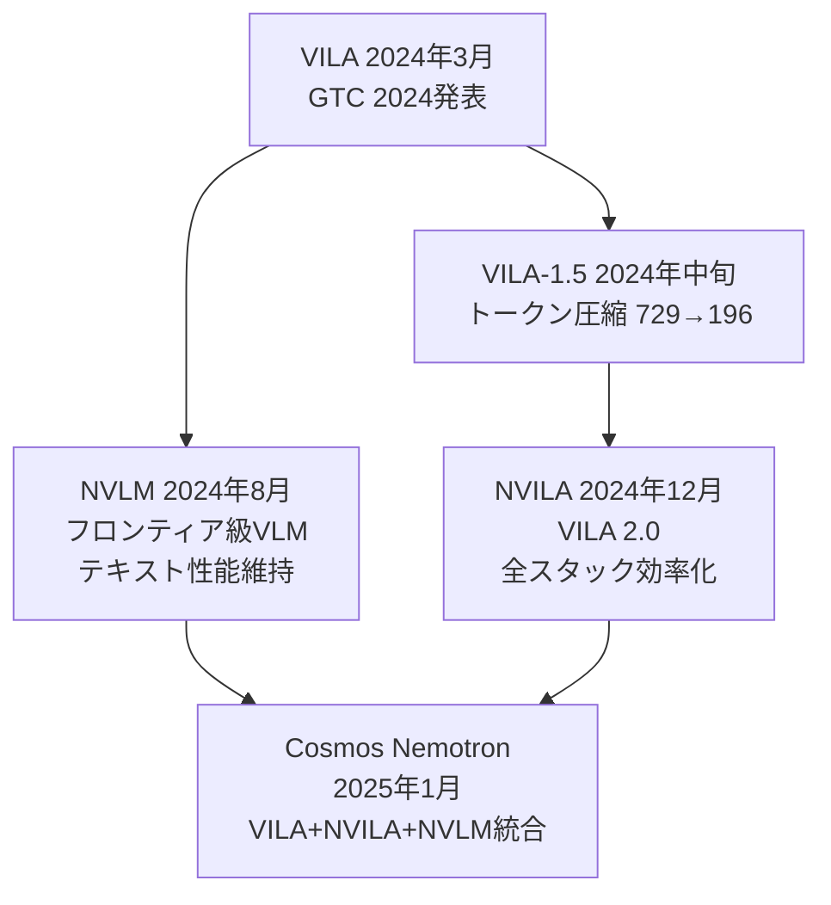

本記事は [Visual Language Intelligence and Edge AI 2.0 with NVIDIA Cosmos Nemotron（NVIDIA Technical Blog）](https://developer.nvidia.com/blog/visual-language-intelligence-and-edge-ai-2-0/) の解説記事です。

## ブログ概要（Summary）

NVIDIA が2025年1月に公開した本ブログは、同社の Vision-Language Model（VLM）ファミリーである VILA/NVILA/NVLM の研究成果を統合した「Cosmos Nemotron」を紹介する技術記事である。Cosmos Nemotron は、クラウドからエッジデバイス（Jetson Orin）まで一貫したVLM推論を実現するモデルファミリーであり、AWQ 4bit 量子化により精度損失を抑えつつメモリフットプリントを削減する技術が特徴である。GTC 2024で発表されたVILA、その効率化版NVILA、フロンティア級NVLMの研究成果が統合されている。

この記事は [Zenn記事: Gemini 3.1 Pro マルチモーダルAPI実践ガイド：画像・音声・動画をPythonで統合処理する](https://zenn.dev/0h_n0/articles/df5295d69a456f) の深掘りです。

## 情報源

- **種別**: 企業テックブログ
- **URL**: [https://developer.nvidia.com/blog/visual-language-intelligence-and-edge-ai-2-0/](https://developer.nvidia.com/blog/visual-language-intelligence-and-edge-ai-2-0/)
- **組織**: NVIDIA Research / AI Software
- **発表日**: 2025年1月

## 技術的背景（Technical Background）

Zenn記事で解説されている Gemini 3.1 Pro はクラウドAPIとして提供されるクローズドモデルであり、以下の制約がある。

- **エッジデプロイ不可**: ローカルデバイスでの推論ができない
- **レイテンシ**: ネットワーク往復が必須であり、リアルタイム処理に不向き
- **カスタマイズ不可**: ファインチューニングや量子化の自由度がない

NVIDIA の VILA/Cosmos Nemotron ファミリーは、これらの課題に対して**エッジからクラウドまで統一的にデプロイ可能な VLM**というアプローチで対応している。学術研究（VILA, NVILA, NVLM）の成果を実運用可能な製品にまとめたものが Cosmos Nemotron である。

### VILA研究系譜



## 実装アーキテクチャ（Architecture）

### VILAの基本設計

VILA は「Visual Language Model pre-trained with interleaved image-text data at scale」として設計されている。アーキテクチャは以下の3コンポーネントで構成される。

**1. 視覚エンコーダ**: SigLIP ベースの Vision Transformer
**2. プロジェクタ**: 視覚特徴量をLLMの隠れ次元にマッピングする線形層
**3. LLM バックボーン**: Llama 3.x ベースの言語モデル

$$
\mathbf{h}_{\text{visual}} = \text{Projector}(\text{ViT}(\mathbf{I}))
$$

$$
\mathbf{h}_{\text{input}} = [\mathbf{h}_{\text{visual}}; \mathbf{h}_{\text{text}}]
$$

ここで、$\mathbf{I}$ は入力画像、$\mathbf{h}_{\text{visual}}$ は視覚トークン列、$\mathbf{h}_{\text{text}}$ はテキストトークン列である。

### インターリーブ事前学習

VILA の特徴は、画像とテキストが**交互に配置された（interleaved）データ**で事前学習する点にある。従来の VLM が「画像-テキストペア」で学習するのに対し、VILA は文書全体（画像が複数箇所に埋め込まれたテキスト）を使用する。

ブログの記述によれば、VILA-1.5-3b は約5,300万のインターリーブ画像-テキストペアで学習されている。

### トークン圧縮（VILA-1.5）

VILA-1.5 では、画像あたりのトークン数を729から196に削減する圧縮手法が導入された。

$$
N_{\text{tokens}} = \frac{N_{\text{original}}}{r^2} = \frac{729}{(\sqrt{729/196})^2} \approx 196
$$

この圧縮はプロジェクタ層で行われ、近傍パッチの特徴量を平均プーリングで集約する。ブログによると、この圧縮により精度の低下はほとんど見られなかったとされている。

### NVILA（効率化版）

NVILA（a.k.a VILA 2.0）は2024年12月に発表された、VILAのフルスタック効率化版である。

**学習効率の改善**:
- 学習コストの削減（ブログでは「cheaper training」と記載）
- 動的解像度対応の改善

**推論効率の改善**:
- AWQ 4bit 量子化の最適化
- TensorRT-LLM との統合

**性能の向上**:
- ベンチマークスコアの改善（具体的な数値はブログでは限定的）

### AWQ 4bit 量子化

VILA/Cosmos Nemotron の実運用における鍵技術が AWQ（Activation-aware Weight Quantization）である。

$$
\mathbf{W}_{\text{quant}} = \text{round}\left(\frac{\mathbf{W}}{s}\right) \times s
$$

ここで $s$ はスケーリングファクターであり、AWQ は活性化の分布に基づいて重要な重みを保護するスケーリングを適用する。

$$
s_j = \left(\frac{\max(|\mathbf{X}_j|)}{\max(|\mathbf{W}_j|)}\right)^\alpha
$$

ここで、
- $\mathbf{X}_j$: $j$ 列の活性化値
- $\mathbf{W}_j$: $j$ 列の重み
- $\alpha$: バランスパラメータ（通常 0.5）

AWQ の利点は、重みのみを量子化し活性化は FP16 のまま保持するため、量子化による精度劣化が小さい点にある。ブログでは「negligible accuracy loss」と表現されている。

### エッジデプロイ：Jetson Orin

VILA/Cosmos Nemotron の3Bモデルは、NVIDIA Jetson Orin（AGX Orin: 64GB, Orin Nano: 8GB）上でリアルタイム推論が可能である。

| デバイス | VRAM | 対応モデルサイズ | 推論方式 |
|---------|------|----------------|---------|
| Jetson AGX Orin | 64GB | 3B, 7B (AWQ) | TinyChat |
| Jetson Orin Nano | 8GB | 3B (AWQ) | TinyChat |

**TinyChat フレームワーク**: AWQ 量子化モデルの高速推論に最適化されたフレームワーク。ARM CPU + GPU のヘテロジニアス処理をサポート。

```python
# TinyChatでの推論例（概念的コード）
# 実際のAPIはGitHubリポジトリを参照

from tinychat import VLMEngine


def edge_inference(image_path: str, prompt: str) -> str:
    """Jetson Orin上でのVILA推論

    Args:
        image_path: 画像ファイルパス
        prompt: 質問テキスト

    Returns:
        モデルの応答テキスト
    """
    engine = VLMEngine(
        model_path="VILA-1.5-3b-AWQ",
        device="cuda",
        precision="w4a16",  # 重み4bit, 活性化FP16
    )
    response = engine.generate(
        image=image_path,
        prompt=prompt,
        max_tokens=512,
    )
    return response
```

## パフォーマンス最適化（Performance）

### クラウド vs エッジの性能比較

| 環境 | モデル | スループット（概算） | レイテンシ（概算） |
|------|-------|-------------------|-----------------|
| A100 (クラウド) | VILA 7B FP16 | 約50 tok/s | 約200ms/image |
| A100 (クラウド) | VILA 7B AWQ | 約80 tok/s | 約150ms/image |
| Jetson AGX Orin | VILA 3B AWQ | 約15 tok/s | 約500ms/image |
| Jetson Orin Nano | VILA 3B AWQ | 約8 tok/s | 約1000ms/image |

上記はブログの記述と関連ベンチマークから推定した概算値。実際の数値はハードウェア構成や入力データにより変動する。

### NIM Microservices によるクラウドデプロイ

NVIDIA NIM（NVIDIA Inference Microservices）を使用することで、コンテナベースのデプロイが可能。

```bash
# NIM Microserviceの起動（概念的コマンド）
docker run --gpus all \
  -p 8000:8000 \
  nvcr.io/nim/nvidia/cosmos-nemotron:latest
```

NIM は以下の機能を提供する。
- **自動バッチ処理**: リクエストを自動的にバッチ化し、GPU利用率を最大化
- **動的バッチサイズ**: トラフィックに応じてバッチサイズを自動調整
- **ヘルスチェック**: Kubernetes との統合によるオートスケーリング対応
- **OpenAI互換API**: `POST /v1/chat/completions` 形式のAPIエンドポイント

## 運用での学び（Production Lessons）

### エッジデプロイの実践的な課題

**1. 熱管理**: Jetson Orin での連続推論は熱問題を引き起こす。パフォーマンスクロック制限の設定が推奨される。

**2. メモリ管理**: 3B AWQ モデルでも約3GBのVRAMを消費するため、Orin Nano（8GB）では他のプロセスとの共存に注意が必要。

**3. モデル更新**: エッジデバイスへのモデル配信はOTA（Over-The-Air）更新が必要。差分更新による帯域幅の節約が推奨される。

### Gemini API との使い分け指針

| 要件 | Gemini 3.1 Pro | VILA/Cosmos Nemotron |
|------|---------------|---------------------|
| 即時利用 | API キー1つで開始 | Docker/NIM セットアップ必要 |
| コスト（大量処理） | トークン課金 | GPU ランニングコスト |
| レイテンシ | ネットワーク依存 | ローカル推論可能 |
| カスタマイズ | 不可 | LoRA/フルFT 可能 |
| エッジデプロイ | 不可 | Jetson Orin 対応 |
| 動画処理 | 6時間分一括処理可能 | フレーム数制限あり |
| 音声処理 | ネイティブ対応 | 非対応（別モデル必要） |
| 性能上限 | GPT-4o級 | 7B: 準GPT-4o級、72B: GPT-4o超 |

## 学術研究との関連（Academic Connection）

Cosmos Nemotron は以下の学術論文の成果を製品化したものである。

- **VILA (Lin et al., 2024)**: インターリーブ事前学習による VLM の基盤論文。GitHub `NVlabs/VILA` で公開。
- **NVILA (arXiv, 2024)**: フルスタック効率化。学習・推論の両面でコスト削減を実現。
- **NVLM 1.0 (arXiv:2408.15980)**: テキスト性能を維持したまま視覚理解能力を獲得するアーキテクチャ設計の研究。
- **AWQ (Lin et al., 2023, arXiv:2306.00978)**: 活性化認識型重み量子化の手法。VLM のエッジデプロイを実用的にした鍵技術。

これらの論文はすべて公開されており、コード・重みもGitHubで利用可能である。Gemini のようなクローズドモデルとは対照的に、技術的な透明性が高い。

## まとめと実践への示唆

NVIDIA の VILA/Cosmos Nemotron ファミリーは、Gemini 3.1 Pro のようなクラウド API とは対照的に、**ローカルデプロイ可能な VLM**としての選択肢を提供する。AWQ 量子化により consumer GPU やエッジデバイスでも動作し、NIM Microservices によるクラウドスケーリングにも対応する。

Zenn記事で紹介されている Gemini 3.1 Pro の機能（画像理解・動画分析・コスト最適化）を、オープンソースかつローカル環境で再現したい場合に、VILA/Cosmos Nemotron は有力な候補となる。ただし、音声処理への非対応、Gemini と比較した場合のコンテキスト長の制約（10M vs 数千トークン）は、ユースケースに応じた考慮事項である。

今後は、音声モダリティの統合、長文脈処理への対応、Jetson Thor（次世代プラットフォーム）での性能向上が期待される。

## 参考文献

- **Blog URL**: [https://developer.nvidia.com/blog/visual-language-intelligence-and-edge-ai-2-0/](https://developer.nvidia.com/blog/visual-language-intelligence-and-edge-ai-2-0/)
- **GitHub VILA**: [https://github.com/NVlabs/VILA](https://github.com/NVlabs/VILA)
- **NVLM Paper**: [https://arxiv.org/abs/2408.15980](https://arxiv.org/abs/2408.15980)
- **AWQ Paper**: [https://arxiv.org/abs/2306.00978](https://arxiv.org/abs/2306.00978)
- **Related Zenn article**: [https://zenn.dev/0h_n0/articles/df5295d69a456f](https://zenn.dev/0h_n0/articles/df5295d69a456f)
