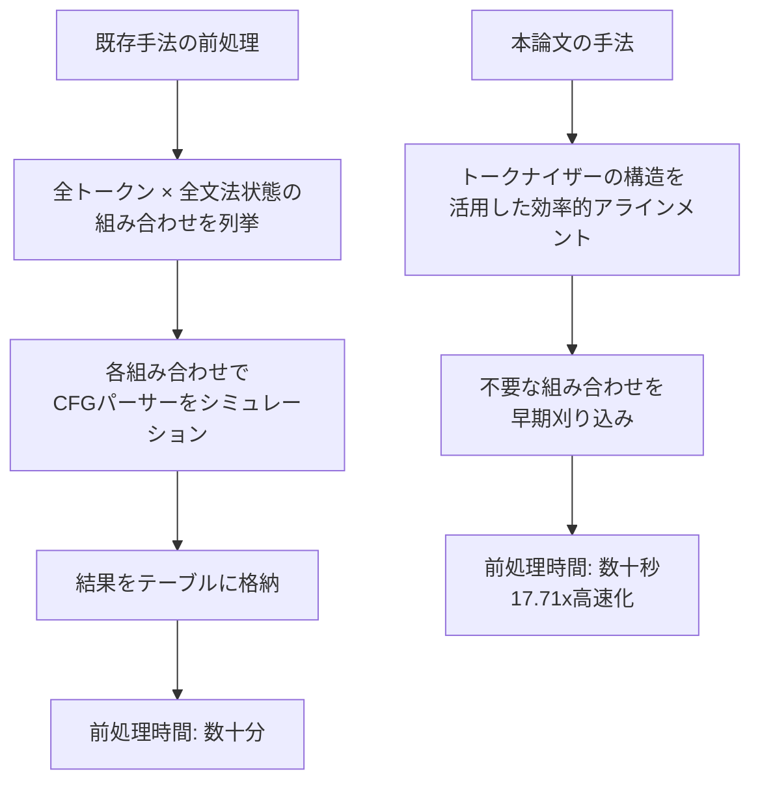

本記事は [Flexible and Efficient Grammar-Constrained Decoding (arXiv:2502.05111)](https://arxiv.org/abs/2502.05111) の解説記事です。

## 論文概要（Abstract）

LLMの構造化出力を文脈自由文法（CFG）で保証する**文法制約付きデコーディング（GCD: Grammar-Constrained Decoding）**は、デコードの各ステップで「CFGに従わないトークンをマスクする」ことで文法準拠を保証する。しかし、既存のGCDアルゴリズムはLLMのサブワードトークナイザーとCFG文法のトークンを「アラインメント（対応付け）」する前処理に数十分を要することがあった。著者らは、このアラインメントを**17.71倍高速化**しつつ、オンラインのマスク計算効率も維持する新しいGCDアルゴリズムを提案している。

この記事は [Zenn記事: Guidance 0.3×llguidance実践ガイド：vLLM/SGLang連携で本番運用](https://zenn.dev/0h_n0/articles/98fc937127592e) の深掘りです。

## 情報源

- **会議名**: ICML 2025（International Conference on Machine Learning）
- **年**: 2025
- **URL**: [https://arxiv.org/abs/2502.05111](https://arxiv.org/abs/2502.05111)
- **著者**: Kanghee Park, Timothy Zhou, Loris D'Antoni
- **発表形式**: Poster

## カンファレンス情報

**ICMLについて**:
ICML（International Conference on Machine Learning）は機械学習分野のトップカンファレンスの1つであり、NeurIPSおよびICLRと並ぶ「ML三大会議」に数えられる。採択率は通常25-30%程度であり、本論文はGCD（Grammar-Constrained Decoding）という比較的ニッチなテーマながらICML 2025に採択されたことは、構造化出力技術の重要性が学術コミュニティで高まっていることを示している。

## 技術的詳細（Technical Details）

### 問題設定: トークナイザー・文法アラインメント

GCDの中核的な課題は、LLMのサブワードトークナイザーとCFGの文法トークンの間にギャップがあることにある。

LLMのトークナイザー（例: BPE）は文を「サブワード」に分割する。一方、CFGの文法規則は「文字」や「文法トークン」の列として定義される。この2つの粒度の違いを解消し、「CFGの現在の状態で有効なサブワードトークンの集合（トークンマスク）」を効率的に計算する必要がある。

$$
\text{TokenMask}(q, G, T) = \{ t \in T \mid \exists w \in \Sigma^* : t \cdot w \in L_q(G) \}
$$

ここで、
- $q$: CFGパーサーの現在の状態
- $G$: 文脈自由文法
- $T$: トークナイザーの語彙（例: 128Kトークン）
- $\Sigma^*$: 文字アルファベット上のすべての文字列
- $L_q(G)$: 状態 $q$ から受理可能な言語
- $t \cdot w$: トークン $t$ に文字列 $w$ を連結したもの

直観的には「トークン $t$ を選択した後に、何らかの文字列 $w$ を続けることでCFG準拠の文字列が完成できるかどうか」を判定する。

### 既存手法の課題



既存のGCDアルゴリズム（Outlines、Llamacpp等で使用）は、トークナイザーの全語彙（128Kトークン）と文法の全状態の直積をナイーブに列挙していた。JSON文法のような複雑な文法では状態数が数千に達するため、前処理に数分〜数十分を要する。

### 提案手法: 効率的なアラインメントアルゴリズム

著者らの提案手法は以下の2つの最適化から構成される。

**1. トークナイザー構造の活用**

BPEトークナイザーの語彙はプレフィックスツリー（Trie）として表現できる。著者らはこのTrie構造を文法状態遷移と同時に走査し、「ある文法状態でマッチしないプレフィックスを持つトークンをまとめて刈り込む」最適化を導入した。

**2. 文法状態の等価性判定**

異なるパーサー状態が同一のトークンマスクを生成する場合（等価状態）、一方の計算結果を再利用する。著者らはCFGの状態間の等価性を効率的に判定するアルゴリズムを設計し、冗長な計算を排除した。

### アルゴリズムの計算量

前処理のアラインメント計算量は以下の通りである。

$$
O(|V| \cdot |S| \cdot L_{\max})
$$

ここで、
- $|V|$: 語彙サイズ（例: 128K）
- $|S|$: 文法の状態数
- $L_{\max}$: トークンの最大文字長

提案手法では、Trie走査による刈り込みにより実効的な $|V|$ が大幅に削減され、等価状態の再利用により実効的な $|S|$ も削減される。

### オンラインマスク計算

前処理が完了した後のオンラインフェーズ（推論中の各デコードステップ）では、前処理で構築したルックアップテーブルからO(1)でトークンマスクを取得する。この点は既存手法と同等であり、推論時のレイテンシへの影響は最小限である。

## 実験結果（Results）

### 前処理速度の比較（論文より）

著者らが報告した前処理（アラインメント）速度の比較:

| 手法 | JSON文法の前処理時間 | 高速化率 |
|------|-------------------|---------|
| 既存手法（ベースライン） | 数十分 | 1x |
| 提案手法 | 数十秒〜数分 | **17.71x** |

**17.71倍の高速化**は、Trie刈り込みと等価状態再利用の組み合わせによって達成されたと報告されている。

### オンラインマスク計算

オンラインフェーズのマスク計算速度については、著者らは「既存手法と同等の効率を維持する」と報告しており、前処理高速化によってランタイム性能が犠牲にならないことが確認されている。

### 適用可能な文法の範囲

本手法はCFGで表現可能なすべての制約に適用でき、以下を含む:
- JSON Schema（`$ref`、`anyOf`、`oneOf`含む）
- 正規表現
- プログラミング言語の構文（Python、SQL等）
- カスタムDSL（ドメイン固有言語）

## 実装のポイント（Implementation）

本論文の手法は、Guidance/llguidanceやXGrammarの内部で使われている前処理アルゴリズムの改善に関するものである。実務への影響を整理する。

**本番環境への影響**:
- **初回コンパイル時間の短縮**: 新規スキーマを初めて使用する際の前処理が17.71倍高速化。動的スキーマ環境で特に有効
- **ランタイム性能は変化なし**: 推論中のトークンマスク計算速度は既存手法と同等
- **キャッシュ戦略との相乗効果**: XGrammarのキャッシュと組み合わせると、初回コンパイル（本手法で高速化）+ 2回目以降キャッシュ（XGrammar）という最適な構成が実現可能

```python
# 概念的な実装パターン
from typing import Set

def preprocess_alignment(
    grammar: "CFG",
    tokenizer: "BPETokenizer",
) -> dict[int, Set[int]]:
    """文法状態とトークンのアラインメントを前処理

    Args:
        grammar: 文脈自由文法
        tokenizer: BPEトークナイザー

    Returns:
        state_id -> 有効トークンIDの集合 のマッピング
    """
    trie = tokenizer.build_prefix_trie()
    alignment = {}

    for state in grammar.states:
        # 等価状態チェック
        equiv = find_equivalent_state(state, alignment)
        if equiv is not None:
            alignment[state.id] = alignment[equiv.id]
            continue

        # Trie走査による効率的マスク計算
        valid_tokens: Set[int] = set()
        _trie_walk(trie.root, state, valid_tokens, grammar)
        alignment[state.id] = valid_tokens

    return alignment


def _trie_walk(
    node: "TrieNode",
    state: "GrammarState",
    valid: Set[int],
    grammar: "CFG",
) -> None:
    """Trie走査で有効トークンを収集（無効プレフィックスを早期刈り込み）"""
    if not grammar.can_continue(state, node.prefix):
        return  # このプレフィックスで始まるトークンはすべて無効

    if node.is_token:
        valid.add(node.token_id)

    for child in node.children:
        _trie_walk(child, state, valid, grammar)
```

**Zenn記事との関連**:
Zenn記事では「大きなスキーマで初回レイテンシーが高い」問題がトラブルシューティングとして挙げられている。本論文の手法は、この初回レイテンシー問題を前処理レベルで解決するアプローチと位置づけられる。

## 実運用への応用（Practical Applications）

本論文の前処理高速化は、以下のシナリオで特に効果を発揮する。

**動的スキーマ環境**: SqueezeBitsのベンチマークで示されたように、リクエストごとにスキーマが異なるマルチテナント環境では、新規スキーマのコンパイルが頻発する。17.71倍の高速化は、初回リクエストのレイテンシーを大幅に改善する。

**サーバー起動時のウォームアップ**: 複数のスキーマを事前コンパイルするウォームアップフェーズが短縮される。推論サーバーの起動時間短縮に直結する。

**エッジ/モバイルデバイス**: 計算リソースが限られた環境では、前処理の高速化がユーザー体験に直接影響する。

## まとめ

本論文は、GCDの前処理ボトルネックに対して、トークナイザーのTrie構造活用と等価状態再利用という2つの最適化を組み合わせ、17.71倍の高速化を達成した。ランタイム性能を犠牲にすることなく前処理を高速化した点は実用上重要であり、llguidanceやXGrammar等の既存フレームワークの内部アルゴリズムとして統合可能な成果である。ICML 2025への採択は、GCD/構造化出力がML研究コミュニティの関心領域として定着したことを示している。

## 参考文献

- **Conference URL**: [https://arxiv.org/abs/2502.05111](https://arxiv.org/abs/2502.05111)
- **ICML 2025 Poster**: [https://icml.cc/virtual/2025/poster/45613](https://icml.cc/virtual/2025/poster/45613)
- **Related Zenn article**: [https://zenn.dev/0h_n0/articles/98fc937127592e](https://zenn.dev/0h_n0/articles/98fc937127592e)

---

:::message
この記事はAI（Claude Code）により自動生成されました。内容の正確性については論文の記載に基づいていますが、最新の情報はarXiv論文およびICML 2025のプロシーディングスをご確認ください。
:::
