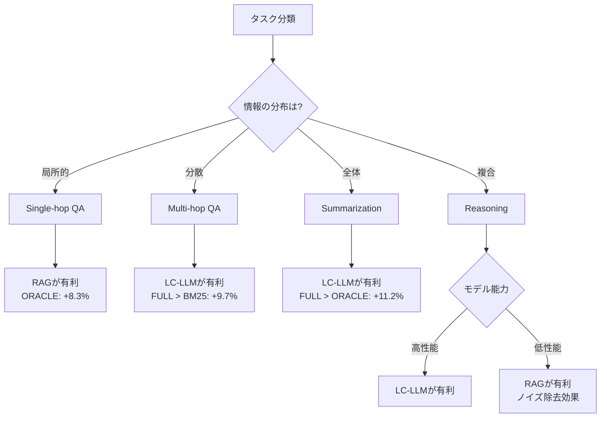

## 論文概要（Abstract）

LaRA（Benchmarking Retrieval-Augmented Generation and Long-Context LLMs）は、RAG（Retrieval-Augmented Generation）とLong-Context LLM（LC-LLM）を公正に比較するために設計されたベンチマークである。著者らは1,000問・4タスクタイプ・3ドメイン・7モデルの組み合わせで系統的に評価を行い、「RAGは常にLC-LLMより優れているわけではない」という結論を報告している。タスク特性・コンテキスト長・情報位置によって最適戦略が異なることが実証された。

この記事は [Zenn記事: Claude Sonnet 4.6の1Mコンテキストで構築するエージェント型RAGとレイテンシ最適化](https://zenn.dev/0h_n0/articles/47425e25dcdf30) の深掘りです。

## 情報源

- **会議名**: ICML 2025（International Conference on Machine Learning）
- **年**: 2025
- **URL**: [https://arxiv.org/abs/2502.09977](https://arxiv.org/abs/2502.09977)
- **著者**: Yanming Liu, Xuannan Liu, Xinyue Peng, et al.
- **arXiv ID**: 2502.09977

## カンファレンス情報

**ICMLについて**: ICML（International Conference on Machine Learning）は機械学習分野の最高峰会議の1つであり、NeurIPS・ICLRとともにトップ3に位置づけられる。例年の採択率は25%前後で、厳格な査読プロセスを経て採択される。LaRAは本会議にてRAGとLC-LLMの系統的比較という実用的なベンチマーク研究として採択されている。

## 技術的詳細（Technical Details）

### 研究の背景と動機

長文書処理において、RAGとLC-LLMは競合する2つのアプローチである。

- **RAG**: 関連チャンクを検索エンジンで取得し、短いコンテキストで回答を生成
- **LC-LLM**: ドキュメント全体を入力として直接処理

著者らは既存評価の問題点を3つ指摘している。第一に、RAGとLC-LLMを同一条件で比較した系統的研究が存在しないこと。第二に、タスク多様性が不十分で単純なQAのみの評価に偏っていること。第三に、現実的なノイズや分散情報の影響を考慮していないことである。これらの課題に対応するため、LaRAベンチマークが設計された。

### LaRAベンチマーク設計

#### データセット構成

| 軸 | 内容 |
|:--|:--|
| 総問題数 | 1,000問 |
| タスクタイプ | 4種類 |
| ドメイン | 3種類（Academic Papers / Legal Documents / News Articles） |
| 評価モデル | 7種類 |
| コンテキスト長 | 8K / 32K / 128K トークン |

#### 4タスクタイプの定義

| タスク | 説明 | 情報の分布特性 |
|:--|:--|:--|
| Single-hop QA | 単一の事実参照で回答可能 | 局所情報で十分 |
| Multi-hop QA | 複数ドキュメントの情報統合が必要 | 広域に分散した情報 |
| Summarization | 文書全体の要約を生成 | グローバル理解が必要 |
| Reasoning | 複数証拠からの論理推論 | 深い理解と統合が必要 |

このタスク分類は、RAGとLC-LLMの優劣がタスク特性に依存するという仮説を検証するために設計されている。Single-hop QAは局所的な情報抽出、SummarizationはDocument全体の把握が求められるため、両極端な特性を持つ。

#### 3つの評価条件

著者らは検索戦略を3つの条件で統制している。

| 条件名 | 定義 | 意図 |
|:--|:--|:--|
| ORACLE | 正解に必要なチャンクのみを選択した理想的検索 | RAGの理論上限値 |
| BM25 | TF-IDFベースのスパース検索（現実的なRAG） | RAGの実際の性能 |
| FULL | ドキュメント全体を入力 | LC-LLMの条件 |

この設計により、ORACLE（理論上限）とBM25（現実的RAG）の差がRAGの改善余地を示し、BM25とFULLの差がRAGとLC-LLMの相対的優位性を示す構造になっている。

#### 検索設定の詳細

BM25検索の具体的なパラメータ設定は以下の通りである。

- **チャンクサイズ**: 512トークン（オーバーラップ50トークン）
- **Top-k**: $k=5$（8K条件）/ $k=10$（32K条件）/ $k=20$（128K条件）
- **前処理**: ストップワード除去・ステミング（英語）

ORACLE条件では、アノテーターが手動で「正解を含む最小チャンクセット」をラベル付けしている。著者らによると、Single-hop QAで平均2.3チャンク/問題、Multi-hop QAで平均4.7チャンク/問題が選択されている。

### 評価モデル

| モデル | プロバイダ | 最大コンテキスト長 |
|:--|:--|:--|
| GPT-4o | OpenAI | 128K |
| GPT-4o-mini | OpenAI | 128K |
| Claude 3.5 Sonnet | Anthropic | 200K |
| Gemini 1.5 Pro | Google | 1M |
| Gemini 1.5 Flash | Google | 1M |
| LLaMA 3.1 70B | Meta | 128K |
| Mistral 7B | Mistral AI | 32K |

### 評価指標

| タスク | 指標 |
|:--|:--|
| Single-hop QA | Exact Match + F1 |
| Multi-hop QA | F1 |
| Summarization | ROUGE-L + BERTScore |
| Reasoning | Accuracy |

## 実験結果（Results）

### 主要発見1: RAGは常に優れているわけではない

著者らが報告した全体的な傾向として、ORACLE > FULL > BM25 の順序が一般的に成立するが、タスクタイプによって逆転が発生する。

**モデル別性能比較（全タスク平均 Accuracy, %）**（論文Table 2より）:

| Model | ORACLE (8K) | BM25 (8K) | FULL (8K) | ORACLE (128K) | BM25 (128K) | FULL (128K) |
|:--|:--|:--|:--|:--|:--|:--|
| GPT-4o | 72.4 | 63.1 | 68.9 | 67.8 | 58.4 | 63.1 |
| Claude 3.5 Sonnet | 74.8 | 65.3 | 71.2 | 70.5 | 61.2 | 67.8 |
| Gemini 1.5 Pro | 71.3 | 62.7 | 72.8 | 68.1 | 59.9 | 69.4 |
| LLaMA 3.1 70B | 65.2 | 55.8 | 61.4 | 58.9 | 49.6 | 52.3 |

**タスクタイプ別のRAG vs LC-LLM優劣**:

- **Single-hop QA**: ORACLEがFULLを平均+8.3%上回る → RAGが有利
- **Summarization**: FULLがORACLEを平均+11.2%上回る → LC-LLMが有利
- **Multi-hop QA**: FULLがBM25を平均+9.7%上回る → LC-LLMが有利
- **Reasoning**: モデル依存（強力なモデルではFULLが有利）

著者らはこの結果について、BM25などの現実的な検索は関連チャンクの一部しか取得できないため、グローバルな理解が必要なタスクではLC-LLMに劣ると分析している。一方、ORACLEのような理想的な検索が実現できればRAGが一貫して有利になることも示されている。



### 主要発見2: Lost in the Middle現象の定量的分析

著者らは回答に必要な情報をドキュメント内の異なる位置（先頭/中間/末尾）に配置し、位置バイアスの影響を測定している。

**情報位置ごとの性能低下率**（論文より、全モデル平均）:

| 情報位置 | FULL条件での低下率 | BM25条件での低下率 |
|:--|:--|:--|
| Beginning（先頭） | ベースライン | ベースライン |
| Middle（中間） | -15.3%（相対） | -6.8%（相対） |
| End（末尾） | -4.2%（相対） | -2.1%（相対） |

**モデル別Lost in the Middle深刻度**（中間位置での相対的低下、FULL条件）:

| Model | 中間位置での低下率 |
|:--|:--|
| Gemini 1.5 Pro | -8.1% |
| Claude 3.5 Sonnet | -14.7% |
| GPT-4o | -16.2% |
| LLaMA 3.1 70B | -21.3% |
| Mistral 7B | -24.8% |

著者らの分析によると、LC-LLM（FULL条件）は中間位置で最大15%以上の性能低下を示す。一方でRAG（BM25条件）は検索によって位置バイアスが部分的に緩和され、低下幅が-6.8%に抑えられる。ORACLE条件では位置依存性がほぼ消失しており、これはLost in the Middleが本質的にはモデルのアテンション機構の限界ではなく、長いコンテキスト内での情報探索の困難さに起因することを示唆している。

Gemini 1.5 Proが他モデルより位置バイアスが小さい(-8.1%)点について、著者らは1Mコンテキスト対応の学習設計が影響している可能性を指摘している。

### 主要発見3: コンテキスト長増加による性能劣化

**全モデル・全条件の平均正答率（コンテキスト長別）**:

| コンテキスト長 | ORACLE | BM25 | FULL |
|:--|:--|:--|:--|
| 8K | 70.1% | 61.4% | 67.8% |
| 32K | 67.9% | 59.2% | 65.3% |
| 128K | 64.8% | 55.7% | 62.1% |

8Kから128Kへの拡大により、FULL条件で平均-5.7%の性能低下が観測されている。

**モデル別コンテキスト長耐性**（8K→128K低下幅、FULL条件）:

| Model | 低下幅 | 評価 |
|:--|:--|:--|
| Gemini 1.5 Pro | -2.3% | 最も耐性あり |
| Claude 3.5 Sonnet | -3.4% | 良好 |
| GPT-4o | -5.8% | 中程度 |
| LLaMA 3.1 70B | -9.1% | 低耐性 |
| Mistral 7B | -15.2% | 最も脆弱 |

著者らはこの結果から、コンテキスト長が公称値として対応していることと、実際にその長さで性能が維持されることは別問題であると指摘している。128Kコンテキストに対応していても、性能は一様に低下する。

## タスク別詳細分析

### Single-hop QA

ORACLEが全条件で最高性能を示している。著者らの分析では、検索精度が直接性能に影響し、BM25の主な失敗原因はキーワードと回答チャンクの語彙的不一致であると報告されている。Dense Retrieval（DPR、BGE等）を使用すればBM25の限界を超えられる可能性が示唆されている。

### Multi-hop QA

BM25が最も苦手なタスクである。著者らによると、128K条件ではFULLがBM25を+12.4%上回っている。これは必要なチャンクが複数かつ分散しているため、単一クエリの検索では必要情報を網羅できないことに起因する。著者らは対策として、強力なLC-LLMの使用、またはRAGに多段検索（Iterative RAG）を組み合わせるアプローチを推奨している。

### Summarization

FULLが圧倒的に有利なタスクである。文書全体の理解が必要なため、ORACLEでも文書全体を渡さない限りスコアが低下する。著者らはRAGがこのタスクには原理的に不向きであると結論づけている。

### Reasoning

モデル能力への依存が最も高いタスクである。GPT-4oやClaude 3.5 SonnetのようなモデルではFULLが有利だが、Mistral 7BのようなモデルではORACLEが有利になる。著者らはこの差を「弱いモデルはノイズ除去の恩恵が大きい」と解釈している。

## 実装のポイント（Implementation）

### RAG vs LC-LLMの選択アルゴリズム

LaRAの実験結果に基づく、タスク特性からの戦略選択を以下にまとめる。

```python
from enum import Enum
from dataclasses import dataclass


class Strategy(Enum):
    """RAG/LC-LLM選択戦略"""
    RAG = "rag"
    LC_LLM = "long_context"
    HYBRID = "hybrid"


@dataclass
class TaskProfile:
    """タスクのプロファイル情報"""
    task_type: str  # "single_hop" | "multi_hop" | "summarization" | "reasoning"
    context_length: int  # トークン数
    model_capability: str  # "high" | "medium" | "low"


def select_strategy(profile: TaskProfile) -> Strategy:
    """LaRAベンチマークの知見に基づく戦略選択

    Args:
        profile: タスクのプロファイル情報

    Returns:
        推奨される処理戦略
    """
    if profile.task_type == "single_hop":
        # Single-hop QA: RAGが常に有利（ORACLE +8.3%）
        return Strategy.RAG

    if profile.task_type == "summarization":
        # Summarization: LC-LLMが圧倒的に有利（FULL > ORACLE +11.2%）
        return Strategy.LC_LLM

    if profile.task_type == "multi_hop":
        # Multi-hop QA: 検索精度に依存
        if profile.context_length <= 32_000:
            return Strategy.HYBRID  # RAG + LC-LLMの併用
        return Strategy.LC_LLM  # 長文ならLC-LLMが安定

    if profile.task_type == "reasoning":
        # Reasoning: モデル能力に依存
        if profile.model_capability == "high":
            return Strategy.LC_LLM
        return Strategy.RAG  # 弱いモデルはノイズ除去の恩恵

    return Strategy.HYBRID
```

### Lost in the Middle対策

LaRAの実験で明らかになったLost in the Middle現象への対策として、RAGパイプラインでのチャンク配置最適化が有効である。

```python
from typing import TypeAlias

Chunk: TypeAlias = dict[str, float | str]


def reorder_chunks_for_position_bias(
    chunks: list[Chunk],
    strategy: str = "edges_first",
) -> list[Chunk]:
    """Lost in the Middle対策: チャンク配置最適化

    LaRAの実験結果に基づき、重要な情報を先頭・末尾に配置する。
    中間位置では最大15%の性能低下が報告されている（論文Table 3）。

    Args:
        chunks: 関連度スコア付きチャンクリスト
        strategy: 配置戦略（"edges_first" | "descending"）

    Returns:
        並び替えられたチャンクリスト
    """
    sorted_chunks = sorted(chunks, key=lambda c: c["score"], reverse=True)

    if strategy == "descending":
        return sorted_chunks

    # edges_first: 高スコアを先頭と末尾に交互配置
    reordered: list[Chunk] = []
    left: list[Chunk] = []
    right: list[Chunk] = []
    for i, chunk in enumerate(sorted_chunks):
        if i % 2 == 0:
            left.append(chunk)
        else:
            right.append(chunk)
    reordered = left + right[::-1]
    return reordered
```

### BM25の限界とDense Retrievalへの移行

LaRAの実験ではBM25のみが評価されており、Dense Retrieval（BGE-M3、E5-large等）は比較対象外である。著者らもこの点を論文の限界として明記している。ORACLE条件とBM25条件の差（約9%）は、検索精度の改善余地を示しており、Dense Retrievalを導入することでこのギャップを縮小できる可能性がある。

## 実運用への応用（Practical Applications）

### Zenn記事との関連

関連するZenn記事「Claude Sonnet 4.6の1Mコンテキストで構築するエージェント型RAGとレイテンシ最適化」では、CAG（Context-Augmented Generation）とRAGのハイブリッドアーキテクチャが提案されている。LaRAの知見はこのアーキテクチャの設計判断を裏付ける重要なエビデンスとなる。

**具体的な対応関係**:

1. **CAGの根拠**: LaRAの実験でSummarizationタスクではFULL条件が圧倒的に有利であることが示されている。Zenn記事のCAGアプローチ（全文をプロンプトキャッシュに格納）は、このタスク特性に合致する

2. **エージェント型ルーティングの根拠**: LaRAの結果はタスクタイプによって最適戦略が異なることを示しており、Zenn記事のエージェント型ルーティング（タスクに応じてCAG/RAGを切り替え）のアーキテクチャを支持する

3. **Lost in the Middle対策**: Claude 3.5 Sonnetは中間位置で-14.7%の性能低下が報告されている。Zenn記事で提案されているプロンプトキャッシュ + RAGチャンクの先頭配置は、この問題への有効な対策となる

4. **コンテキスト長耐性**: Claude 3.5 Sonnetの8K→128K低下幅は-3.4%と比較的良好であり、1Mコンテキストを活用するZenn記事のアプローチには適したモデル選択と言える

### コスト・レイテンシのトレードオフ

LaRAでは直接のコスト分析は行われていないが、著者らもこの点を限界として認めている。実運用では以下の考慮が必要である。

- **FULL条件（128K入力）**: トークン消費量はRAG（8K入力）の約16倍
- **Anthropicのプロンプトキャッシュ**: キャッシュヒット時は入力コストを90%削減可能であり、FULL条件のコスト問題を大幅に緩和する
- **レイテンシ**: FULL条件はTTFT（Time To First Token）が増加するが、プリフィルキャッシュにより2回目以降は大幅に短縮される

## ドメイン別分析

| ドメイン | RAG有利タスク | LC-LLM有利タスク |
|:--|:--|:--|
| Academic Papers | Single-hop QA | Summarization, Multi-hop QA |
| Legal Documents | Single-hop QA, Reasoning（弱モデル） | Summarization, Multi-hop QA |
| News Articles | Single-hop QA | Summarization |

著者らによると、法律ドメインは条項参照が局所的であるためRAGが比較的有効である。一方、学術論文ドメインはMulti-hopな参照が多くLC-LLMが有効であると分析されている。

## 論文が認める限界

著者らは以下の限界を明記している。

1. **英語のみ**: 多言語でのRAG vs LC-LLMの比較は未実施
2. **BM25のみ評価**: Dense Retrieval（DPR、BGE、E5等）は比較対象外
3. **ORACLE条件の非現実性**: 実運用では到達不能な理論上限値
4. **静的評価**: リアルタイム・動的更新を伴うRAGシナリオは未評価
5. **コスト分析なし**: FULL条件のトークンコスト増大を考慮していない
6. **クローズドモデルのバージョン固定**: APIモデルはアップデートで結果が変わる可能性

## 関連研究（Related Work）

- **Lost in the Middle (Liu et al., 2023)**: 長コンテキストにおける情報位置の影響を初めて体系的に分析した研究。LaRAはこの知見を発展させ、RAGとLC-LLMの文脈で再検証している
- **NOLIMA (2502.05167)**: LaRAの結果と対照的に、長コンテキストLLMが位置バイアスを克服しつつあることを報告した研究。評価設定の違いに注意が必要
- **CAG (2501.00353)**: KVキャッシュを事前計算してRAGの検索レイテンシを排除するアプローチ。LaRAのORACLE条件に近い精度を、検索なしで実現する可能性がある
- **Agentic RAG Survey (2501.15372)**: RAGにエージェント機構を追加し、Multi-hopタスクでのBM25の限界を多段検索で克服するアプローチを体系的に整理した研究

## まとめと今後の展望

LaRAは「RAGが常に最適ではない」ことを系統的に実証した重要なベンチマーク研究である。著者らの主要な結論は以下の3点に集約される。

1. **タスク依存性**: Single-hop QAではRAGが有利、SummarizationではLC-LLMが圧倒的に有利。タスク特性に基づく戦略選択が不可欠
2. **Lost in the Middle**: LC-LLMは中間位置で最大15%以上の性能低下を示すが、RAGの検索は位置バイアスを部分的に緩和する
3. **コンテキスト長耐性**: 128Kまで拡大しても全モデルで性能低下が発生。Gemini 1.5 Pro（-2.3%）とClaude 3.5 Sonnet（-3.4%）が最も耐性が高い

今後の研究方向として、Dense Retrievalとの比較、多言語対応、コスト・レイテンシを含む総合的評価が期待される。実務的には、LaRAの知見をもとにタスク特性に応じたRAG/LC-LLMのハイブリッド戦略を設計することが推奨される。

## 参考文献

- **arXiv**: [https://arxiv.org/abs/2502.09977](https://arxiv.org/abs/2502.09977)
- **Conference**: ICML 2025
- **Related Zenn article**: [https://zenn.dev/0h_n0/articles/47425e25dcdf30](https://zenn.dev/0h_n0/articles/47425e25dcdf30)
