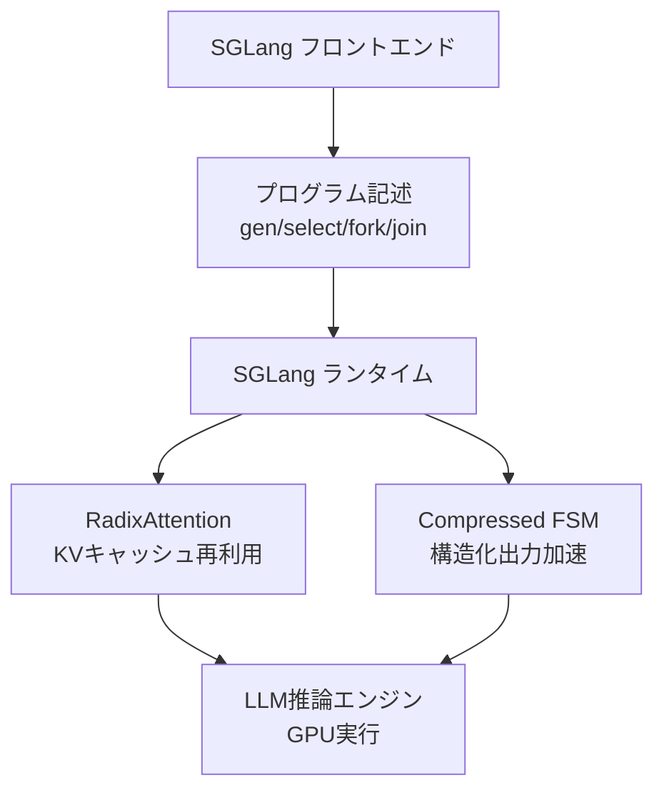
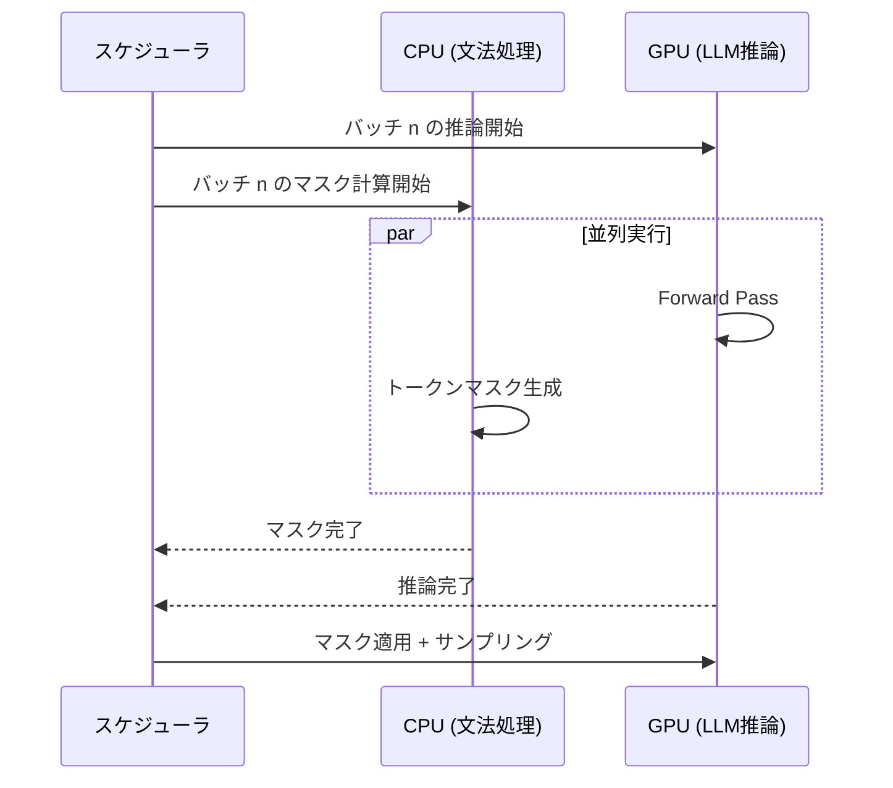

本記事は [SGLang: Efficient Execution of Structured Language Model Programs (arXiv:2312.07104)](https://arxiv.org/abs/2312.07104) の解説記事です。

## 論文概要（Abstract）

LLMを複数回呼び出して複雑なタスクを遂行する「構造化LLMプログラム」は、Few-shotプロンプティング、エージェント制御、JSON生成、RAGパイプライン等の基盤となっている。しかし、これらのプログラムは推論エンジンとの間に最適化の余地が多く残されていた。著者らは、フロントエンド言語とランタイム最適化を統合した**SGLang**を提案し、**RadixAttention**（KVキャッシュの効率的再利用）と**Compressed Finite State Machines**（構造化出力のデコード加速）により、既存推論システム比で最大**6.4倍のスループット向上**を達成したと報告している。

この記事は [Zenn記事: Guidance 0.3×llguidance実践ガイド：vLLM/SGLang連携で本番運用](https://zenn.dev/0h_n0/articles/98fc937127592e) の深掘りです。

## 情報源

- **会議名**: NeurIPS 2024（Annual Conference on Neural Information Processing Systems）
- **年**: 2024
- **URL**: [https://arxiv.org/abs/2312.07104](https://arxiv.org/abs/2312.07104)
- **著者**: Lianmin Zheng, Liangsheng Yin, Zhiqiang Xie, Chuyue Sun, Jeff Huang, Cody Hao Yu, Shiyi Cao, Christos Kozyrakis, Ion Stoica, Joseph E. Gonzalez, Clark Barrett, Ying Sheng
- **発表形式**: Conference Paper

## カンファレンス情報

**NeurIPSについて**:
NeurIPS（Conference on Neural Information Processing Systems）はAI/ML分野の最高峰カンファレンスの1つであり、ICML・ICLRと並ぶ「ML三大会議」に数えられる。採択率は通常25-30%程度。SGLangはNeurIPS 2024に採択され、LLM推論システムの研究が同会議で注目される分野となっていることを示している。

## 技術的詳細（Technical Details）

### SGLangのアーキテクチャ

SGLangは「フロントエンド言語」と「ランタイム」の2層で構成される。



### RadixAttention: KVキャッシュの効率的再利用

LLMの推論では、入力テキストのプレフィックス処理（Prefill）がボトルネックとなる。複数のリクエストが共通のプレフィックス（システムプロンプト、Few-shot例等）を持つ場合、そのKVキャッシュを再利用できれば大幅に高速化できる。

著者らは、KVキャッシュを**Radix Tree（基数木）**で管理する**RadixAttention**を提案している。

$$
\text{CacheHit}(p, R) = \max_{k \in R} |k \cap p|
$$

ここで、
- $p$: 新規リクエストのプレフィックストークン列
- $R$: Radix Treeに格納されたキャッシュエントリの集合
- $|k \cap p|$: キャッシュエントリ $k$ とプレフィックス $p$ の共通プレフィックス長

Radix Treeの特性により、最長共通プレフィックスの検索がO(L)（Lはプレフィックス長）で完了する。LRU（Least Recently Used）ポリシーでキャッシュエビクションを管理し、GPUメモリの使用効率を最大化する。

**RadixAttentionが効果を発揮するシナリオ**:
- Few-shot学習: 同一のFew-shot例を共有する複数リクエスト
- マルチターン会話: 会話履歴の共通部分
- 構造化出力の繰り返しスキーマ: 同一JSON Schemaを使うリクエスト群

### Compressed Finite State Machines: 構造化出力のデコード加速

JSON等の構造化出力を制約付きで生成する際、従来手法は1トークンずつ生成・検証していた。著者らは、文法の構造を分析し「確定的なトークン列」（例: JSON構文の`{`, `"`, `:`, `}`等）をまとめてスキップする**Compressed FSM**を提案している。

```mermaid
graph LR
    A["入力: JSON生成要求"] --> B["通常FSM<br/>1トークンずつ生成"]
    A --> C["Compressed FSM<br/>確定部分をスキップ"]
    B --> D["{ → \" → n → a → m → e → \" → : → ..."]
    C --> E["{\"name\":" → gen → ..."]
    E --> F["確定的構文をスキップ<br/>自由生成部分のみLLM呼び出し"]
```

JSON出力の場合、キー名やカンマ・コロン等の構文トークンは文法から一意に決定できる。これらのトークンに対してLLMの推論（GPU計算）を省略し、直接トークンを挿入することで、生成速度を向上させる。

$$
\text{Speedup}_{\text{CFSM}} = \frac{N_{\text{total}}}{N_{\text{total}} - N_{\text{deterministic}}}
$$

ここで、
- $N_{\text{total}}$: 出力トークン総数
- $N_{\text{deterministic}}$: 確定的に決まるトークン数（LLM推論不要）

JSON出力ではトークンの30-50%が構文トークン（確定的）であるため、理論的には1.4-2.0倍の加速が得られる。

### CPU-GPU並列実行

SGLangランタイムのもう1つの重要な設計は、CPU上の文法処理（トークンマスク計算）とGPU上のLLM推論を並列に実行するアーキテクチャである。



この並列実行により、文法処理のCPU時間がGPU推論時間の裏に隠れる。SqueezeBitsのベンチマーク（別記事参照）では、この設計がvLLMの逐次実行に対して構造的な優位性を持つことが実証されている。

## 実験結果（Results）

### ベンチマーク結果（論文Figure/Tableより）

著者らが報告したスループット比較（既存推論システムをベースラインとして）:

| アプリケーション | 高速化率 |
|---------------|---------|
| エージェント制御 | 最大5.0x |
| 論理推論（Few-shot） | 最大4.2x |
| JSON生成 | 最大3.1x |
| RAGパイプライン | 最大2.8x |
| マルチターン会話 | 最大6.4x |

マルチターン会話で6.4倍の高速化が達成されたのは、RadixAttentionによる会話履歴のKVキャッシュ再利用が効果的に機能するためである。

### 構造化出力の性能

JSON生成タスクでの3.1倍の高速化は、Compressed FSMとRadixAttentionの相乗効果によるものと著者らは分析している。

- Compressed FSMによる確定的トークンのスキップ: 約1.5-2.0倍
- RadixAttentionによるスキーマプレフィックスのキャッシュ: 約1.5-2.0倍

## 実装のポイント（Implementation）

SGLangのセットアップとJSON生成の実装例を示す。

```bash
# SGLangのインストール
pip install "sglang[all]>=0.4.4" llguidance

# llguidanceバックエンドでサーバー起動
python -m sglang.launch_server \
    --model-path meta-llama/Llama-3.1-8B-Instruct \
    --grammar-backend llguidance \
    --port 30000 \
    --mem-fraction-static 0.85
```

```python
# SGLang Engine APIでのJSON生成
import json
import sglang as sgl
from pydantic import BaseModel, Field

class AnalysisResult(BaseModel):
    """分析結果スキーマ"""
    topic: str = Field(description="分析トピック")
    score: float = Field(ge=0.0, le=1.0)
    findings: list[str] = Field(min_length=1, max_length=5)

# Engine初期化（RadixAttentionが自動有効化）
llm = sgl.Engine(
    model_path="meta-llama/Llama-3.1-8B-Instruct",
    grammar_backend="llguidance",
)

# JSON Schema制約付き生成
output = llm.generate(
    prompt="技術トピック「Rust」について分析してJSON形式で回答: ",
    sampling_params={
        "temperature": 0.1,
        "max_new_tokens": 256,
        "json_schema": json.dumps(
            AnalysisResult.model_json_schema()
        ),
    },
)

result = AnalysisResult(**json.loads(output["text"]))
print(f"トピック: {result.topic}")
print(f"スコア: {result.score}")

llm.shutdown()
```

**RadixAttentionの効果を最大化するTips**:
- 同一のシステムプロンプトを使うリクエストをバッチ化する
- Few-shot例を固定し、プレフィックスキャッシュの再利用率を高める
- マルチターン会話では会話履歴を維持してKVキャッシュを活用する

**チューニングパラメータ**:
- `--mem-fraction-static`: GPUメモリのうちKVキャッシュに使用する割合（デフォルト0.88）。RadixAttentionのキャッシュ容量に直結する
- `--max-running-requests`: 同時処理リクエスト数。大きくするとスループット向上するが、KVキャッシュのエビクション頻度が増加する

## Production Deployment Guide

### AWS実装パターン（コスト最適化重視）

SGLangの性能特性を活かしたAWS構成を示す。

**トラフィック量別の推奨構成**:

| 規模 | 月間リクエスト | 推奨構成 | 月額コスト | 主要サービス |
|------|--------------|---------|-----------|------------|
| **Small** | ~3,000 (100/日) | Serverless | $50-150 | Lambda + Bedrock |
| **Medium** | ~30,000 (1,000/日) | Hybrid | $300-800 | ECS Fargate + SGLang |
| **Large** | 300,000+ (10,000/日) | Container | $2,000-5,000 | EKS + SGLang + GPU Spot |

**Large構成の詳細** (月額$2,000-5,000):
- **EKS**: コントロールプレーン ($72/月)
- **EC2 GPU Spot**: g5.xlarge × 2-4台 (平均$800/月)
- **Karpenter**: Spot自動スケーリング
- **S3**: モデルアーティファクト ($20/月)
- **CloudWatch + X-Ray**: 監視 ($100/月)

**SGLang固有のコスト最適化**:
- RadixAttentionのキャッシュ効率を最大化するため、同一スキーマのリクエストを同一ポッドにルーティング
- Compressed FSMにより確定的トークンのGPU計算をスキップし、GPU使用効率を向上
- `--mem-fraction-static 0.85`で十分なKVキャッシュ容量を確保

**コスト試算の注意事項**:
上記は2026年2月時点のAWS ap-northeast-1（東京）リージョン料金に基づく概算値です。最新料金は[AWS料金計算ツール](https://calculator.aws/)で確認してください。

### Terraformインフラコード

**Large構成: EKS + SGLang + Karpenter**

```hcl
module "eks" {
  source  = "terraform-aws-modules/eks/aws"
  version = "~> 20.0"

  cluster_name    = "sglang-cluster"
  cluster_version = "1.31"
  vpc_id          = module.vpc.vpc_id
  subnet_ids      = module.vpc.private_subnets

  cluster_endpoint_public_access = true
  enable_cluster_creator_admin_permissions = true
}

resource "kubectl_manifest" "karpenter_gpu_provisioner" {
  yaml_body = <<-YAML
    apiVersion: karpenter.sh/v1alpha5
    kind: Provisioner
    metadata:
      name: sglang-gpu-spot
    spec:
      requirements:
        - key: karpenter.sh/capacity-type
          operator: In
          values: ["spot"]
        - key: node.kubernetes.io/instance-type
          operator: In
          values: ["g5.xlarge", "g5.2xlarge"]
      limits:
        resources:
          cpu: "32"
          nvidia.com/gpu: "4"
      ttlSecondsAfterEmpty: 120
  YAML
}

resource "aws_budgets_budget" "sglang_monthly" {
  name         = "sglang-monthly"
  budget_type  = "COST"
  limit_amount = "5000"
  limit_unit   = "USD"
  time_unit    = "MONTHLY"

  notification {
    comparison_operator        = "GREATER_THAN"
    threshold                  = 80
    threshold_type             = "PERCENTAGE"
    notification_type          = "ACTUAL"
    subscriber_email_addresses = ["ops@example.com"]
  }
}
```

### 運用・監視設定

```python
import boto3

cloudwatch = boto3.client('cloudwatch')

# RadixAttention キャッシュヒット率監視
cloudwatch.put_metric_alarm(
    AlarmName='radix-cache-hit-rate',
    ComparisonOperator='LessThanThreshold',
    EvaluationPeriods=3,
    MetricName='CacheHitRate',
    Namespace='SGLang/Inference',
    Period=300,
    Statistic='Average',
    Threshold=0.5,
    AlarmDescription='KVキャッシュヒット率50%未満（リクエストパターン変化の可能性）'
)

# GPU使用率監視
cloudwatch.put_metric_alarm(
    AlarmName='gpu-utilization-low',
    ComparisonOperator='LessThanThreshold',
    EvaluationPeriods=5,
    MetricName='GPUUtilization',
    Namespace='AWS/EKS',
    Period=60,
    Statistic='Average',
    Threshold=30,
    AlarmDescription='GPU使用率30%未満（スケールダウン検討）'
)
```

### コスト最適化チェックリスト

- [ ] SGLang + llguidance: 構造化出力の本番推奨構成
- [ ] RadixAttention活用: 同一プレフィックスのリクエストを同一ポッドにルーティング
- [ ] Compressed FSM: 確定的トークンスキップでGPU効率向上
- [ ] GPU Spot: Karpenterで自動管理（最大90%削減）
- [ ] メモリ最適化: `--mem-fraction-static` でKVキャッシュ容量調整
- [ ] AWS Budgets: 月額上限$5,000設定
- [ ] CloudWatch: キャッシュヒット率・GPU使用率・スループット監視

## 実運用への応用（Practical Applications）

Zenn記事でSGLangが推奨されている理由を、本論文の知見から補足する。

**高スループット構造化出力**: Compressed FSMによる確定的トークンのスキップとRadixAttentionの相乗効果により、JSON生成で3.1倍の高速化が報告されている。これはvLLMのバッチサイズ増加時のスループット低下（SqueezeBitsベンチマーク）と対照的である。

**マルチターン会話**: チャットボット等の会話型アプリケーションでは、RadixAttentionが会話履歴のKVキャッシュを効率的に再利用し、6.4倍の高速化を達成。構造化出力と組み合わせることで、JSON形式の会話レスポンスを高速に生成できる。

**エージェントワークフロー**: Guidanceの`gen(tools=[...])`パターン（Zenn記事参照）とSGLangの組み合わせにより、ツール呼び出しの構造化引数をCompressed FSMで高速生成しつつ、RadixAttentionでツール定義のキャッシュを再利用できる。

## まとめ

SGLangは、RadixAttention（KVキャッシュ再利用）とCompressed FSM（構造化出力加速）という2つの最適化を統合し、LLM推論のスループットを最大6.4倍向上させた。NeurIPS 2024への採択は、LLM推論システムの最適化が学術的に重要なテーマとして認められていることを示している。Zenn記事で推奨されているSGLang + llguidanceの組み合わせは、本論文のCPU-GPU並列アーキテクチャとCompressed FSMの知見に裏付けられた構成であり、構造化出力の本番運用で高いスループットが期待できる。

## 参考文献

- **Conference URL**: [https://proceedings.neurips.cc/paper_files/paper/2024/file/724be4472168f31ba1c9ac630f15dec8-Paper-Conference.pdf](https://proceedings.neurips.cc/paper_files/paper/2024/file/724be4472168f31ba1c9ac630f15dec8-Paper-Conference.pdf)
- **arXiv**: [https://arxiv.org/abs/2312.07104](https://arxiv.org/abs/2312.07104)
- **Code**: [https://github.com/sgl-project/sglang](https://github.com/sgl-project/sglang)
- **Related Zenn article**: [https://zenn.dev/0h_n0/articles/98fc937127592e](https://zenn.dev/0h_n0/articles/98fc937127592e)

---

:::message
この記事はAI（Claude Code）により自動生成されました。内容の正確性については論文の記載に基づいていますが、最新の情報は公式リポジトリおよびNeurIPS 2024のプロシーディングスをご確認ください。
:::
