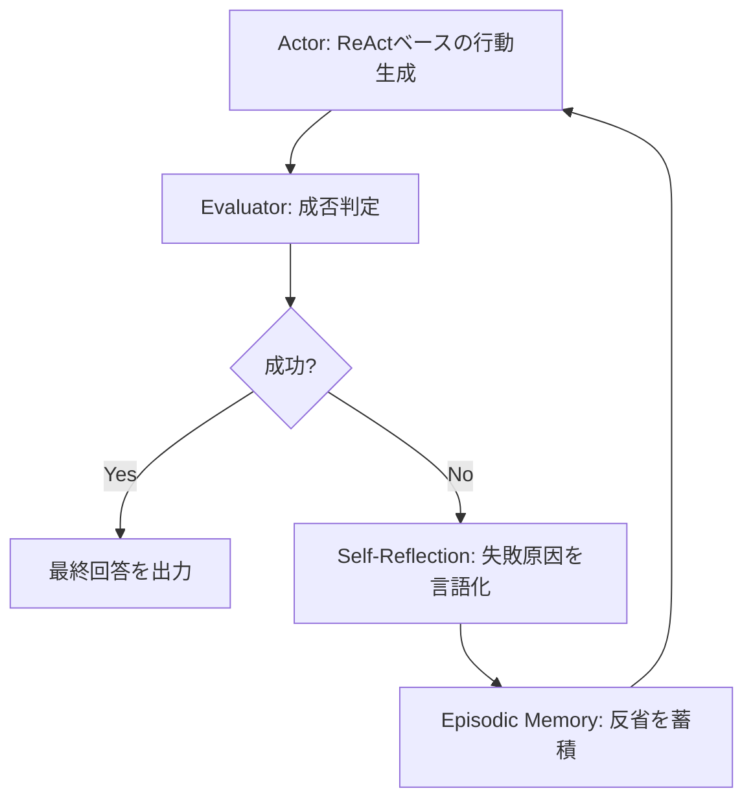

本記事は [Reflexion: Language Agents with Verbal Reinforcement Learning](https://arxiv.org/abs/2303.11366)（Shinn et al., NeurIPS 2023）の解説記事です。

## 論文概要（Abstract）

Reflexionは、LLMエージェントが自身の実行結果を言語的に反省し、その反省をエピソードメモリに蓄積することで、重みの更新なしに試行ごとの性能を向上させるフレームワークである。従来の強化学習がスカラー報酬に依存するのに対し、Reflexionは自然言語による「Verbal Reinforcement（言語的強化）」を用いる点が特徴である。著者らは、HumanEvalでpass@1精度91%、HotpotQAでReAct単体比+20%の精度向上を報告している。

この記事は [Zenn記事: ReAct+CoT推論の5大実装パターン：Reflexion・LATS・ReWOOをLangGraphで構築する](https://zenn.dev/0h_n0/articles/7a4b0b4ff37caa) の深掘りです。

## 情報源

- **会議名**: NeurIPS 2023（Thirty-seventh Conference on Neural Information Processing Systems）
- **arXiv ID**: 2303.11366
- **URL**: [https://arxiv.org/abs/2303.11366](https://arxiv.org/abs/2303.11366)
- **著者**: Noah Shinn, Federico Cassano, Ashwin Gopinath, Karthik Narasimhan, Shunyu Yao（Northeastern University, Princeton University, MIT）
- **発表年**: 2023
- **コードリポジトリ**: [https://github.com/noahshinn/reflexion](https://github.com/noahshinn/reflexion)

## カンファレンス情報

NeurIPS（Conference on Neural Information Processing Systems）は機械学習分野の最高峰会議の1つであり、2023年の採択率は約26.1%であった。Reflexionは口頭発表（Oral）として採択された。

## 背景と動機（Background & Motivation）

従来のLLMエージェント（ReActなど）は、タスク実行結果が不十分であっても同じ戦略で次のステップに進んでしまう問題がある。強化学習（RL）は試行錯誤から学習する枠組みを提供するが、スカラー報酬から有用なフィードバックを得るにはトレーニングサンプルとの勾配更新コストが大きい。

著者らは「人間が失敗から学ぶとき、数値的なスコアではなく言語的な反省（"次はこの手順を先にやるべきだった"など）を用いている」という観察に基づき、LLMの自然言語生成能力を活用して反省テキストを生成・蓄積する手法を提案している。重みの更新が不要であるため、APIベースのLLM（GPT-4など）でもそのまま適用可能である点が実用上の利点である。

## 主要な貢献（Key Contributions）

- **Verbal Reinforcement Learning**: スカラー報酬の代わりに自然言語による反省テキストを強化シグナルとして使用する新しいパラダイムを提示
- **3コンポーネントアーキテクチャ**: Actor（行動生成）、Evaluator（結果評価）、Self-Reflection（自己反省）の分離設計により、各モジュールを独立に改善・差し替え可能
- **エピソードメモリ**: 反省テキストをスライディングウィンドウ（直近3〜5件）で管理し、コンテキスト長の爆発を抑制
- **広範なベンチマーク評価**: コード生成（HumanEval）、QA（HotpotQA）、テキストゲーム（AlfWorld）、Web操作（WebShop）の4タスクで有効性を実証

## 技術的詳細（Technical Details）

### アーキテクチャ

Reflexionは3つのコンポーネントから構成される。



**Actor**: ReActパターン（Thought → Action → Observation）に基づいてタスクを実行する。過去の反省テキストがプロンプトに追加されることで、同じ失敗の繰り返しを回避する。

**Evaluator**: 実行結果の成否を判定する。タスクによって以下の2種類が使い分けられる。
- **環境シグナルベース**: テストケースの合否（HumanEval）、正解との一致（HotpotQA）など外部の成否判定を使用
- **LLM自己評価ベース**: LLMが出力品質をスコアリング（AlfWorldなど環境フィードバックが不明確な場合）

**Self-Reflection**: 失敗したエピソードについて、LLMが「何が間違っていたか」「次にどうすべきか」を自然言語で分析し、エピソードメモリに保存する。

### 言語的強化の形式化

著者らは反省プロセスを以下のように形式化している。論文Section 3より、試行 $t$ における反省テキスト $r_t$ は以下の条件付き生成で得られる。

$$
r_t = \text{LLM}_{\text{reflect}}(\tau_t, e_t, \text{mem}_{t-1})
$$

ここで、
- $\tau_t$: 試行 $t$ の行動軌跡（Thought/Action/Observationの系列）
- $e_t$: Evaluatorからの評価結果（成功/失敗/スコア）
- $\text{mem}_{t-1}$: 直近の反省メモリ（スライディングウィンドウ）

次の試行では、蓄積された反省メモリ $\text{mem}_t = \text{mem}_{t-1} \cup \{r_t\}$ がActorのコンテキストに追加される。

$$
a_{t+1} = \text{LLM}_{\text{actor}}(\text{task}, \text{mem}_t)
$$

### メモリ管理

反省テキストは無制限に蓄積するとコンテキストウィンドウを圧迫するため、スライディングウィンドウで管理される。著者らの実験では直近3件のメモリ保持が精度とコストのバランスが良いと報告されている（論文Section 4.1）。

```python
class ReflexionMemory:
    """反省テキストのスライディングウィンドウ管理

    Args:
        max_reflections: 保持する反省の最大件数
    """
    def __init__(self, max_reflections: int = 3):
        self.reflections: list[str] = []
        self.max_reflections = max_reflections

    def add(self, reflection: str) -> None:
        """反省を追加し、ウィンドウを超えた場合は古いものを削除"""
        self.reflections.append(reflection)
        if len(self.reflections) > self.max_reflections:
            self.reflections = self.reflections[-self.max_reflections:]

    def get_context(self) -> str:
        """Actorに渡すコンテキスト文字列を生成"""
        if not self.reflections:
            return ""
        ctx = "過去の反省:\n"
        for i, r in enumerate(self.reflections, 1):
            ctx += f"試行{i}: {r}\n"
        return ctx
```

### アルゴリズム全体の擬似コード

```python
def reflexion_loop(
    task: str,
    actor: LLM,
    evaluator: Callable,
    reflector: LLM,
    max_trials: int = 5,
    memory_window: int = 3,
) -> str:
    """Reflexionの反復改善ループ

    Args:
        task: 解くべきタスクの説明
        actor: 行動生成用LLM
        evaluator: 成否判定関数
        reflector: 反省生成用LLM
        max_trials: 最大試行回数
        memory_window: 保持する反省の最大件数

    Returns:
        最終的な出力
    """
    memory = ReflexionMemory(max_reflections=memory_window)

    for trial in range(max_trials):
        # Actor: 反省を踏まえて行動
        trajectory = actor.execute(task, memory.get_context())

        # Evaluator: 成否判定
        is_success, feedback = evaluator(trajectory)

        if is_success:
            return trajectory.final_answer

        # Self-Reflection: 失敗原因を分析
        reflection = reflector.reflect(task, trajectory, feedback)
        memory.add(reflection)

    return trajectory.final_answer  # 最大試行後の最善回答
```

## 実験結果（Results）

著者らは4つのベンチマークでReflexionの有効性を検証している。

### コード生成（HumanEval）

論文Table 1より、HumanEvalベンチマークにおけるpass@1精度を以下に示す。

| 手法 | pass@1 (%) |
|------|-----------|
| GPT-4 (直接生成) | 67.0 |
| GPT-4 + CoT | 71.0 |
| GPT-4 + ReAct | 74.0 |
| **GPT-4 + Reflexion** | **91.0** |

著者らは、Reflexionが最大5回の試行で91%のpass@1を達成したと報告している。テストケースの合否という明確なフィードバックが得られるため、反省の品質が高くなりやすいタスク特性が寄与していると分析されている。

### 質問応答（HotpotQA）

論文Table 2より、HotpotQAにおけるExact Match精度を以下に示す。

| 手法 | EM (%) |
|------|--------|
| CoT (6-shot) | 29.4 |
| ReAct (6-shot) | 30.6 |
| CoT + Reflexion | 43.4 |
| **ReAct + Reflexion** | **50.2** |

ReActにReflexionを追加することで、Exact Matchが30.6%から50.2%へ+19.6ポイント向上したと報告されている。

### テキストゲーム（AlfWorld）

論文Figure 3より、AlfWorldにおけるタスク成功率の推移を以下に示す。

| 試行回数 | ReAct | Reflexion |
|---------|-------|-----------|
| 1回目 | 63% | 63% |
| 3回目 | 63% | 88% |
| 5回目 | 63% | 97% |

ReActは試行を重ねても改善しないが、Reflexionは5回の反復で97%に到達したと報告されている。反省メモリにより「冷蔵庫を開ける前にカウンターを確認する」などの環境固有の知識が蓄積される効果が確認されている。

### 失敗分析

著者らは、Reflexionが改善に失敗するケースとして以下を報告している（論文Section 5）。

- **反省の誤り**: 弱いモデルが誤った原因分析を行い、次の試行でさらに悪化するケース
- **Evaluator精度不足**: LLMベースの評価が成否を正しく判定できない場合、反省の方向性が定まらない
- **長期依存タスク**: 多数のステップにまたがるタスクでは、どのステップが失敗原因かの特定が困難

## 実装のポイント（Implementation）

### Evaluatorの設計が品質を左右する

Reflexionの性能はEvaluatorの判定精度に強く依存する。著者らの実験では、環境からの客観的フィードバック（テスト合否）が利用可能なHumanEvalで最も大きな改善が見られた。LLM自己評価をEvaluatorに使用する場合は、具体的な評価ルーブリック（採点基準）を定義することが推奨される。

### コンテキスト長の管理

反省テキストは1件あたり200〜500トークンになることが多く、5件蓄積すると1000〜2500トークンを消費する。コンテキスト長が限られるモデルでは、反省の要約や圧縮が必要になる場合がある。著者らのデフォルト設計では直近3件に制限している。

### API呼び出しコスト

Reflexionは試行回数分のAPI呼び出しが発生する。最大5試行の場合、ReActの約5倍のコストが見込まれる。コスト制約がある環境では、Evaluatorに軽量モデル（GPT-3.5やHaikuクラス）を使用し、Actorに高性能モデル（GPT-4やSonnetクラス）を使用する分担が有効である。

### LangGraphでの実装パターン

```python
from typing import Annotated, TypedDict
from langgraph.graph import StateGraph, END
from langgraph.graph.message import add_messages

class ReflexionState(TypedDict):
    """Reflexionの状態定義"""
    messages: Annotated[list, add_messages]
    task: str
    current_answer: str
    reflections: list[str]
    trial_count: int
    max_trials: int
    is_satisfactory: bool

def build_reflexion_graph() -> StateGraph:
    """Reflexionのグラフ構築

    Returns:
        コンパイル済みのLangGraphグラフ
    """
    graph = StateGraph(ReflexionState)
    graph.add_node("generate", generate_answer)
    graph.add_node("evaluate", evaluate_answer)
    graph.add_node("reflect", self_reflect)
    graph.add_node("output", output_result)
    graph.set_entry_point("generate")
    graph.add_edge("generate", "evaluate")
    graph.add_conditional_edges(
        "evaluate",
        should_retry,
        {"reflect": "reflect", "output": "output"},
    )
    graph.add_edge("reflect", "generate")
    graph.add_edge("output", END)
    return graph.compile()
```

## Production Deployment Guide

### AWS実装パターン（コスト最適化重視）

Reflexionの本番デプロイでは、反復試行によるAPI呼び出しコストが最大の関心事となる。以下にトラフィック量別の推奨構成を示す。

| 規模 | 月間リクエスト | 推奨構成 | 月額コスト | 主要サービス |
|------|--------------|---------|-----------|------------|
| **Small** | ~3,000 (100/日) | Serverless | $100-300 | Lambda + Bedrock + DynamoDB |
| **Medium** | ~30,000 (1,000/日) | Hybrid | $800-2,000 | Lambda + ECS Fargate + ElastiCache |
| **Large** | 300,000+ (10,000/日) | Container | $5,000-15,000 | EKS + Karpenter + EC2 Spot |

**Small構成の詳細**（月額$100-300）:
- **Lambda**: 1GB RAM, 120秒タイムアウト（反復最大5回分）（$40/月）
- **Bedrock**: Claude 3.5 Haiku（Evaluator用）+ Sonnet（Actor/Reflector用）、Prompt Caching有効（$200/月）
- **DynamoDB**: On-Demand、反省メモリ・セッション状態を保持（$10/月）
- **Step Functions**: 試行ループのオーケストレーション（$5/月）

**コスト削減テクニック**:
- Evaluatorに軽量モデル（Haiku: $0.25/MTok）を使用し、Actor/Reflectorのみ高性能モデル（Sonnet: $3/MTok）を使用
- Prompt Caching有効化でシステムプロンプトのコストを30-90%削減
- DynamoDBに反省メモリをキャッシュし、同一タスクの再実行時にメモリを再利用
- 最大試行回数をタスク難易度に応じて動的調整（簡易タスク: 2回、複雑タスク: 5回）

**コスト試算の注意事項**: 上記は2026年2月時点のAWS ap-northeast-1（東京）リージョン料金に基づく概算値です。Reflexionは試行回数に比例してLLM呼び出しコストが増加するため、実際のコストはタスクの難易度分布に大きく依存します。最新料金は [AWS料金計算ツール](https://calculator.aws/) で確認してください。

### Terraformインフラコード

**Small構成（Serverless）: Lambda + Step Functions + Bedrock**

```hcl
# --- IAMロール（最小権限） ---
resource "aws_iam_role" "reflexion_lambda" {
  name = "reflexion-lambda-role"

  assume_role_policy = jsonencode({
    Version = "2012-10-17"
    Statement = [{
      Action = "sts:AssumeRole"
      Effect = "Allow"
      Principal = { Service = "lambda.amazonaws.com" }
    }]
  })
}

resource "aws_iam_role_policy" "bedrock_invoke" {
  role = aws_iam_role.reflexion_lambda.id
  policy = jsonencode({
    Version = "2012-10-17"
    Statement = [{
      Effect   = "Allow"
      Action   = ["bedrock:InvokeModel", "bedrock:InvokeModelWithResponseStream"]
      Resource = [
        "arn:aws:bedrock:ap-northeast-1::foundation-model/anthropic.claude-3-5-haiku*",
        "arn:aws:bedrock:ap-northeast-1::foundation-model/anthropic.claude-3-5-sonnet*"
      ]
    }]
  })
}

# --- Lambda関数（Actor/Evaluator/Reflector） ---
resource "aws_lambda_function" "reflexion_actor" {
  filename      = "reflexion_actor.zip"
  function_name = "reflexion-actor"
  role          = aws_iam_role.reflexion_lambda.arn
  handler       = "index.handler"
  runtime       = "python3.12"
  timeout       = 120
  memory_size   = 1024

  environment {
    variables = {
      ACTOR_MODEL_ID     = "anthropic.claude-3-5-sonnet-20241022-v2:0"
      EVALUATOR_MODEL_ID = "anthropic.claude-3-5-haiku-20241022-v1:0"
      DYNAMODB_TABLE     = aws_dynamodb_table.reflexion_memory.name
      MAX_TRIALS         = "5"
    }
  }
}

# --- DynamoDB（反省メモリ） ---
resource "aws_dynamodb_table" "reflexion_memory" {
  name         = "reflexion-episodic-memory"
  billing_mode = "PAY_PER_REQUEST"
  hash_key     = "session_id"
  range_key    = "trial_number"

  attribute {
    name = "session_id"
    type = "S"
  }
  attribute {
    name = "trial_number"
    type = "N"
  }

  ttl {
    attribute_name = "expire_at"
    enabled        = true
  }
}

# --- CloudWatch アラーム ---
resource "aws_cloudwatch_metric_alarm" "reflexion_cost" {
  alarm_name          = "reflexion-trial-count-spike"
  comparison_operator = "GreaterThanThreshold"
  evaluation_periods  = 1
  metric_name         = "Invocations"
  namespace           = "AWS/Lambda"
  period              = 3600
  statistic           = "Sum"
  threshold           = 500
  alarm_description   = "Reflexion試行回数異常（コスト急増の可能性）"
  dimensions = {
    FunctionName = aws_lambda_function.reflexion_actor.function_name
  }
}
```

### セキュリティベストプラクティス

- **IAMロール**: Bedrockモデル指定でリソースを限定（ワイルドカード最小化）
- **DynamoDB**: 暗号化はAWS管理キーをデフォルト使用、PIIを含む場合はCMK暗号化を推奨
- **Lambda**: VPC内配置によりパブリックアクセスを遮断
- **反省メモリ**: TTL設定でセッション終了後のデータを自動削除（個人情報保護）

### 運用・監視設定

**CloudWatch Logs Insights — 試行回数分析**:
```sql
fields @timestamp, session_id, trial_count, is_success
| stats avg(trial_count) as avg_trials, max(trial_count) as max_trials by bin(1h)
| filter trial_count > 3
```

**コスト監視 — Bedrockトークン使用量**:
```python
import boto3

cloudwatch = boto3.client('cloudwatch')
cloudwatch.put_metric_alarm(
    AlarmName='reflexion-bedrock-token-spike',
    ComparisonOperator='GreaterThanThreshold',
    EvaluationPeriods=1,
    MetricName='TokenUsage',
    Namespace='AWS/Bedrock',
    Period=3600,
    Statistic='Sum',
    Threshold=200000,
    AlarmDescription='Reflexion Bedrockトークン使用量異常'
)
```

### コスト最適化チェックリスト

- [ ] Evaluatorに軽量モデル（Haiku）を使用しているか
- [ ] Prompt Cachingを有効化しているか
- [ ] 最大試行回数をタスク難易度に応じて動的調整しているか
- [ ] DynamoDBのTTL設定でメモリの自動クリーンアップを設定しているか
- [ ] CloudWatchで試行回数のスパイクを監視しているか
- [ ] AWS Budgetsで月額予算アラートを設定しているか

## 実運用への応用（Practical Applications）

Reflexionは以下のユースケースで特に有効である。

- **コード生成エージェント**: テストケースの合否という明確なフィードバックが得られるため、反省の精度が高い。CI/CDパイプラインでのコード自動修正に応用可能
- **文書レビューエージェント**: レビュー基準を明示的に定義すれば、Evaluatorが品質判定を行い、Reflectorが改善方針を提示する構成が可能
- **カスタマーサポート**: 顧客満足度スコアをEvaluatorに用い、回答品質を反復的に改善

ただし、リアルタイム応答が求められるチャットボットなどでは、反復試行のレイテンシ（5回試行で30秒以上）が許容できない場合があることに注意が必要である。

## 関連研究（Related Work）

- **ReAct**（Yao et al., 2022, [arXiv:2210.03629](https://arxiv.org/abs/2210.03629)）: Reflexionの基盤となるReasoningとActingの統合フレームワーク。ReflexionはReActのActorを拡張して反省機構を追加した位置づけ
- **Self-Refine**（Madaan et al., 2023, [arXiv:2303.17651](https://arxiv.org/abs/2303.17651)）: 同時期に提案された自己改善手法。Self-Refineは単一出力の改善に焦点を当てるが、Reflexionはエージェントの行動系列全体を反省対象とする点が異なる
- **LATS**（Zhou et al., ICML 2024, [arXiv:2310.04406](https://arxiv.org/abs/2310.04406)）: ReflexionのVerbal Reinforcementを木探索（MCTS）に統合し、複数の行動候補を並列探索するアプローチ。Reflexionが単線的な反復であるのに対し、LATSは探索空間をツリー構造で管理する
- **CRITIC**（Gou et al., 2023, [arXiv:2309.02427](https://arxiv.org/abs/2309.02427)）: ツールとのインタラクションを通じた自己修正フレームワーク。Reflexionとの違いは、CRITICが各ステップでツールフィードバックを即座に活用するのに対し、Reflexionはエピソード全体の事後反省を行う点

## まとめと今後の展望

Reflexionは「言語的強化学習」という新しいパラダイムにより、重み更新なしでLLMエージェントの反復改善を実現した。テストケースの合否など明確な成否判定が得られるタスクで特に有効であり、HumanEvalのpass@1で91%を達成したと著者らは報告している。一方で、反省の品質がベースモデルの能力に依存すること、試行回数分のAPIコストが増加することが制約として認識されている。

今後の研究方向として、著者らはProcess Reward Model（PRM）との統合による反省の自動化、マルチエージェント間での反省の共有、長期記憶との組み合わせによる持続的学習などを示唆している。

## 参考文献

- **arXiv**: [https://arxiv.org/abs/2303.11366](https://arxiv.org/abs/2303.11366)
- **Code**: [https://github.com/noahshinn/reflexion](https://github.com/noahshinn/reflexion)
- **Related Zenn article**: [https://zenn.dev/0h_n0/articles/7a4b0b4ff37caa](https://zenn.dev/0h_n0/articles/7a4b0b4ff37caa)
