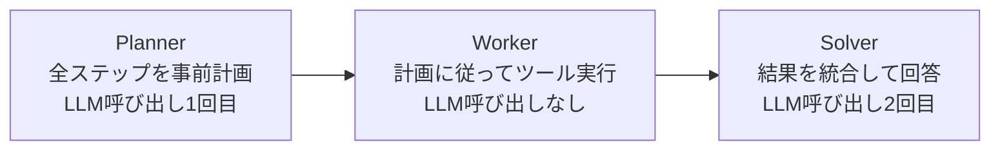

本記事は [ReWOO: Decoupling Reasoning from Observations for Efficient Augmented Language Models](https://arxiv.org/abs/2305.18323)（Xu et al., 2023）の解説記事です。

## 論文概要（Abstract）

ReWOO（Reasoning WithOut Observation）は、Augmented Language Model（ALM）における推論プロセスからツール呼び出しの観察結果を分離することで、トークン消費量を大幅に削減するフレームワークである。従来のReActパターンでは各ステップごとにLLM推論を行うため観察テキストが累積的にコンテキストを圧迫するが、ReWOOはPlanner-Worker-Solverの3段階設計により、LLM呼び出しをPlanner（1回）とSolver（1回）の計2回に抑えている。著者らは、HotpotQAでReActと同等の精度を維持しながらトークン消費を64%削減したと報告している。

この記事は [Zenn記事: ReAct+CoT推論の5大実装パターン：Reflexion・LATS・ReWOOをLangGraphで構築する](https://zenn.dev/0h_n0/articles/7a4b0b4ff37caa) の深掘りです。

## 情報源

- **arXiv ID**: 2305.18323
- **URL**: [https://arxiv.org/abs/2305.18323](https://arxiv.org/abs/2305.18323)
- **著者**: Binfeng Xu, Zhiyuan Peng, Bowen Lei, Subhabrata Mukherjee, Yuqi Liu, Dongkuan Xu
- **発表年**: 2023
- **分野**: cs.CL, cs.AI

## 背景と動機（Background & Motivation）

ReActパターンでは、エージェントが「Thought → Action → Observation → Thought → ...」のループを繰り返す。この設計の問題は、各ステップで過去のすべてのObservation（ツール実行結果）がコンテキストに蓄積されることである。

著者らは以下の定量的分析に基づいて問題を指摘している（論文Section 1）。

- ReActのHotpotQA実行では、平均して**67%のトークンがObservation（ツール実行結果）**に消費されている
- タスクが複雑になりステップ数が増えるほど、Observationの割合が増大する
- 高価なLLM（GPT-4など）の場合、トークン消費の増大は直接的なコスト増に繋がる

この観察から「推論（Reasoning）はツールの実行結果（Observation）を逐次見なくても、事前に計画を立てられるのではないか」という仮説が提案されている。

## 主要な貢献（Key Contributions）

- **推論と観察の分離**: LLMの推論プロセスをツール実行結果の観察から分離し、推論はPlanner段階でのみ行う設計を提案
- **Planner-Worker-Solver**: 3段階アーキテクチャによりLLM呼び出しを2回（Planner + Solver）に固定
- **トークン効率**: ReActと同等の精度を維持しながら、トークン消費を平均64%削減
- **並列実行可能性**: Worker間の依存関係がない場合、ツール実行を並列化してレイテンシを削減可能

## 技術的詳細（Technical Details）

### アーキテクチャ



### ReActとの構造的比較

論文Section 2より、ReActとReWOOのトークン消費パターンを比較する。

**ReAct**（5ステップの場合）:
$$
\text{Tokens}_{\text{ReAct}} = 5 \times T_{\text{prompt}} + \sum_{i=1}^{5} \sum_{j=1}^{i} O_j
$$

各ステップ $i$ で過去のすべてのObservation $O_1, ..., O_i$ がコンテキストに含まれるため、合計トークン数は $O(n^2)$ で増加する。

**ReWOO**:
$$
\text{Tokens}_{\text{ReWOO}} = T_{\text{planner}} + T_{\text{solver}} + \sum_{i=1}^{5} O_i
$$

PlannerとSolverの2回のLLM呼び出しのみであり、Observationは線形 $O(n)$ で増加する。

ここで、
- $T_{\text{prompt}}$: 各ステップのプロンプトトークン数
- $O_i$: 第 $i$ ステップのObservationトークン数
- $T_{\text{planner}}$: Plannerのプロンプト+応答トークン数
- $T_{\text{solver}}$: Solverのプロンプト+応答トークン数

### Plannerの出力形式

Plannerは以下の形式で実行計画を出力する。変数 `#E{n}` はWorkerの実行結果を表すプレースホルダーである。

```
Plan: まずクエリの主要エンティティを検索する
#E1 = Search["Albert Einstein"]
Plan: 出生地の詳細情報を取得する
#E2 = Search[#E1.birthplace]
Plan: 出生地の現在の人口を確認する
#E3 = LookUp[#E2, "population"]
```

この計画では `#E2` が `#E1` の結果に依存するため、`#E1` → `#E2` → `#E3` は順次実行される。依存関係がない場合は並列実行が可能である。

### 依存関係グラフの構築

著者らは計画内の変数参照を解析して依存関係グラフを構築する（論文Section 3.2）。

```python
import re
from collections import defaultdict

def build_dependency_graph(
    plan_steps: list[dict[str, str]],
) -> dict[str, list[str]]:
    """計画ステップから依存関係グラフを構築

    Args:
        plan_steps: [{"id": "#E1", "action": "Search[...]"}, ...]

    Returns:
        依存関係の隣接リスト（キー: ステップID, 値: 依存先リスト）
    """
    graph: dict[str, list[str]] = defaultdict(list)

    for step in plan_steps:
        step_id = step["id"]
        action = step["action"]
        # #E{n} パターンを検出
        refs = re.findall(r"#E\d+", action)
        for ref in refs:
            if ref != step_id:
                graph[step_id].append(ref)

    return dict(graph)


def get_execution_order(
    graph: dict[str, list[str]],
    all_steps: list[str],
) -> list[list[str]]:
    """トポロジカルソートで並列実行可能なバッチを生成

    Args:
        graph: 依存関係グラフ
        all_steps: 全ステップIDリスト

    Returns:
        並列実行可能なバッチのリスト
    """
    in_degree = {s: 0 for s in all_steps}
    for deps in graph.values():
        for dep in deps:
            in_degree[dep] = in_degree.get(dep, 0)

    for step, deps in graph.items():
        in_degree[step] = len(deps)

    batches = []
    remaining = set(all_steps)

    while remaining:
        # 依存なしのステップを抽出（並列実行可能）
        batch = [s for s in remaining if in_degree.get(s, 0) == 0]
        if not batch:
            break
        batches.append(batch)
        for s in batch:
            remaining.remove(s)
            # 依存関係を解消
            for step, deps in graph.items():
                if s in deps:
                    in_degree[step] -= 1

    return batches
```

### Solverの動作

Solverは、Plannerの計画と全Workerの実行結果を受け取り、最終回答を生成する。

$$
\text{answer} = \text{LLM}_{\text{solver}}(\text{task}, \text{plan}, \{(E_i, O_i)\}_{i=1}^{n})
$$

ここで $E_i$ は第 $i$ ステップの計画、$O_i$ はWorkerの実行結果である。Solverは1回のLLM呼び出しで全結果を統合するため、追加の推論ループは発生しない。

### LangGraphによる実装パターン

```python
from typing import TypedDict
from langgraph.graph import StateGraph, END

class ReWOOState(TypedDict):
    """ReWOOの状態定義"""
    task: str
    plan: list[dict[str, str]]
    worker_results: dict[str, str]
    final_answer: str

def planner(state: ReWOOState) -> ReWOOState:
    """Planner: 全ステップを事前計画（LLM呼び出し1回目）"""
    # LLMに計画生成を依頼
    # 出力パース: #E1 = Search[...] 形式
    ...

def workers(state: ReWOOState) -> ReWOOState:
    """Worker: 計画に従ってツール実行（LLM呼び出しなし）"""
    results = {}
    for step in state["plan"]:
        action = resolve_references(step["action"], results)
        results[step["id"]] = execute_tool(action)
    return {"worker_results": results}

def solver(state: ReWOOState) -> ReWOOState:
    """Solver: 全結果を統合して回答（LLM呼び出し2回目）"""
    # LLMに計画+結果を渡して最終回答を生成
    ...

def build_rewoo_graph() -> StateGraph:
    """ReWOOのLangGraphグラフ構築"""
    graph = StateGraph(ReWOOState)
    graph.add_node("planner", planner)
    graph.add_node("workers", workers)
    graph.add_node("solver", solver)
    graph.set_entry_point("planner")
    graph.add_edge("planner", "workers")
    graph.add_edge("workers", "solver")
    graph.add_edge("solver", END)
    return graph.compile()
```

## 実験結果（Results）

### トークン効率

論文Table 1より、HotpotQAにおけるトークン消費量の比較を以下に示す。

| 手法 | 平均トークン数 | 精度 (EM) | トークン削減率 |
|------|--------------|----------|--------------|
| ReAct | 4,352 | 30.6% | - |
| **ReWOO** | **1,572** | **30.2%** | **63.9%** |

著者らは、ReWOOがReActと同等の精度（EM差0.4ポイント）を維持しながら、トークン消費を63.9%削減したと報告している。

### 複数ベンチマークでの比較

論文Table 2より、3つのベンチマークにおける精度比較を以下に示す。

| 手法 | HotpotQA (EM) | TriviaQA (EM) | GSM8K (Acc) |
|------|---------------|---------------|-------------|
| CoT | 29.4% | 54.2% | 55.4% |
| ReAct | 30.6% | 49.8% | 51.2% |
| **ReWOO** | **30.2%** | **52.1%** | **53.8%** |

HotpotQAでは微減、TriviaQAとGSM8KではReActを上回る精度が報告されている。著者らは、これはReActのObservation蓄積によるコンテキスト汚染がReWOOでは発生しないためと分析している。

### スケーリング特性

論文Figure 4より、ステップ数に対するトークン消費のスケーリングを以下に示す。

| ステップ数 | ReActトークン | ReWOOトークン | ReWOO削減率 |
|-----------|-------------|-------------|------------|
| 3 | 2,100 | 1,200 | 43% |
| 5 | 4,350 | 1,570 | 64% |
| 7 | 7,800 | 1,950 | 75% |
| 10 | 14,200 | 2,400 | 83% |

ステップ数が増えるほどReWOOのトークン削減効果が顕著になる。これはReActのトークン消費が $O(n^2)$、ReWOOが $O(n)$ でスケーリングすることに起因する。

### 失敗パターン

著者らは、ReWOOが失敗するケースについても分析している（論文Section 5.3）。

- **計画の不適切さ**: Plannerが初期段階で誤った検索クエリを生成した場合、途中修正ができない。ReActではObservationを見て方針転換できるが、ReWOOでは計画通りに最後まで実行される
- **動的タスク**: ユーザーとの対話や環境の状態変化に応じて方針を変える必要があるタスクには不向き
- **依存関係の推定失敗**: Plannerが `#E2` で `#E1` の結果を参照すべきところを見落とした場合、不正確な情報でWorkerが実行される

## 実装のポイント（Implementation）

### Plannerのプロンプト設計

Plannerの出力品質がReWOOの性能を左右する。著者らはFew-shot例を3〜5件含めることで計画の品質が安定すると報告している。特に以下の点が重要である。

- `#E{n}` の変数参照を正しく生成させるため、出力形式の例を明示する
- ツールの使い方（`Search[query]`, `LookUp[text, key]` など）を明確に定義する
- 依存関係のあるステップは変数参照で表現するよう指示する

### Worker実行の並列化

依存関係のないステップは `asyncio` や `concurrent.futures` を使って並列実行できる。上記の `get_execution_order` 関数でバッチを生成し、各バッチ内のステップを並列実行する。

### エラーハンドリング

ReWOOではWorker実行中にLLMの介入がないため、ツール実行エラーへの対処が重要である。

- **リトライ戦略**: 各Workerに指数バックオフリトライ（最大3回）を設定
- **デフォルト値**: ツール実行失敗時は空文字列を返し、Solverが不足情報を補完する設計が推奨
- **ハイブリッドアプローチ**: 初回をReWOOで実行し、Solverの回答品質が低い場合にReActにフォールバックする二段構成

## Production Deployment Guide

### AWS実装パターン（コスト最適化重視）

ReWOOはLLM呼び出しが2回に固定されるため、他のパターンと比較してコスト効率が高い。

| 規模 | 月間リクエスト | 推奨構成 | 月額コスト | 主要サービス |
|------|--------------|---------|-----------|------------|
| **Small** | ~3,000 (100/日) | Serverless | $30-80 | Lambda + Bedrock + SQS |
| **Medium** | ~30,000 (1,000/日) | Hybrid | $150-400 | Lambda + ECS Fargate + ElastiCache |
| **Large** | 300,000+ (10,000/日) | Container | $800-2,000 | EKS + Karpenter + Spot |

**Small構成の詳細**（月額$30-80）:
- **Lambda**: Planner（1回）+ Solver（1回）+ Workers（$15/月）
- **Bedrock**: Claude Sonnet（Planner/Solver）、Prompt Caching有効（$50/月）
- **SQS**: Worker間の非同期メッセージング（$5/月）
- **DynamoDB**: 計画キャッシュ（$5/月）

ReWOOはLLM呼び出しが2回固定のため、ReAct（5回以上）やReflexion（最大15回）と比較して大幅にコストが低い。

**コスト削減テクニック**:
- Planner出力の計画テンプレートをDynamoDBにキャッシュし、類似タスクで再利用
- Worker実行はLLM不要のため、最小限のLambdaリソース（256MB）で十分
- Prompt Cachingでシステムプロンプト部分のコストを削減
- SQSによるWorkerの非同期並列実行でレイテンシ最適化

**コスト試算の注意事項**: 上記は2026年2月時点のAWS ap-northeast-1（東京）リージョン料金に基づく概算値です。ReWOOのコストはほぼLLM呼び出し2回分に収束するため、モデル選択が最大のコスト要因です。最新料金は [AWS料金計算ツール](https://calculator.aws/) で確認してください。

### Terraformインフラコード

**Small構成: Lambda + SQS + Bedrock**

```hcl
# --- Lambda関数（Planner + Solver） ---
resource "aws_lambda_function" "rewoo_planner" {
  filename      = "rewoo_planner.zip"
  function_name = "rewoo-planner"
  role          = aws_iam_role.rewoo_lambda.arn
  handler       = "index.handler"
  runtime       = "python3.12"
  timeout       = 60
  memory_size   = 512

  environment {
    variables = {
      MODEL_ID       = "anthropic.claude-3-5-sonnet-20241022-v2:0"
      WORKER_QUEUE   = aws_sqs_queue.worker_tasks.url
      DYNAMODB_TABLE = aws_dynamodb_table.plan_cache.name
    }
  }
}

# --- SQS（Worker非同期実行） ---
resource "aws_sqs_queue" "worker_tasks" {
  name                       = "rewoo-worker-tasks"
  visibility_timeout_seconds = 120
  message_retention_seconds  = 3600
}

# --- Lambda関数（Worker） ---
resource "aws_lambda_function" "rewoo_worker" {
  filename      = "rewoo_worker.zip"
  function_name = "rewoo-worker"
  role          = aws_iam_role.rewoo_lambda.arn
  handler       = "index.handler"
  runtime       = "python3.12"
  timeout       = 30
  memory_size   = 256

  environment {
    variables = {
      RESULT_TABLE = aws_dynamodb_table.worker_results.name
    }
  }
}

resource "aws_lambda_event_source_mapping" "worker_sqs" {
  event_source_arn = aws_sqs_queue.worker_tasks.arn
  function_name    = aws_lambda_function.rewoo_worker.arn
  batch_size       = 5
}

# --- DynamoDB（計画キャッシュ + Worker結果） ---
resource "aws_dynamodb_table" "plan_cache" {
  name         = "rewoo-plan-cache"
  billing_mode = "PAY_PER_REQUEST"
  hash_key     = "task_hash"

  attribute {
    name = "task_hash"
    type = "S"
  }

  ttl {
    attribute_name = "expire_at"
    enabled        = true
  }
}
```

### 運用・監視設定

**CloudWatch Logs Insights — 計画品質分析**:
```sql
fields @timestamp, task_hash, plan_step_count, solver_confidence
| stats avg(plan_step_count) as avg_steps, avg(solver_confidence) as avg_conf by bin(1h)
| filter solver_confidence < 0.5
```

### コスト最適化チェックリスト

- [ ] LLM呼び出しがPlanner + Solverの2回のみか確認
- [ ] 計画キャッシュをDynamoDBで有効化しているか
- [ ] Worker用Lambdaのメモリサイズを256MBに制限しているか
- [ ] 類似タスクの計画テンプレート再利用を設定しているか
- [ ] SQSでWorker並列実行を有効化しているか
- [ ] Prompt Cachingでシステムプロンプトのコストを削減しているか

## 実運用への応用（Practical Applications）

ReWOOは以下のユースケースで特に有効である。

- **バッチ処理・定型レポート生成**: データ取得→集計→レポート作成のような定型的なパイプラインで、各ステップが予測可能な場合に最適
- **コスト最優先のエージェント**: API呼び出しコストを最小化したい場合、ReWOOの2回固定は大きな利点
- **高スループット処理**: Worker並列化により、多数のタスクを効率的に処理可能

ただし、以下のケースでは不向きである。
- 対話的な問題解決（ユーザーの追加入力に応じて方針変更が必要）
- ツール実行結果に基づく動的判断が必要なタスク
- 失敗時の自動修正が必要な場合（ReflexionやReActの方が適切）

## 関連研究（Related Work）

- **ReAct**（Yao et al., 2022, [arXiv:2210.03629](https://arxiv.org/abs/2210.03629)）: ReWOOの比較対象となる逐次推論型フレームワーク。ReWOOはReActの「推論と観察の結合」を分離することで効率化した
- **Toolformer**（Schick et al., 2023, [arXiv:2302.04761](https://arxiv.org/abs/2302.04761)）: LLMが自律的にツール使用を学習する手法。ReWOOとは異なりファインチューニングが必要
- **HuggingGPT**（Shen et al., 2023, [arXiv:2303.17580](https://arxiv.org/abs/2303.17580)）: LLMをコントローラーとして複数のAIモデルを連携させるフレームワーク。ReWOOのPlanner-Worker-Solver構造と類似するが、WorkerがAIモデルである点が異なる

## まとめと今後の展望

ReWOOは推論と観察を分離するという設計により、LLM呼び出しを2回に固定し、トークン消費をReAct比で最大83%削減することに成功した。特にステップ数が多いタスクでの効率化効果が顕著である。一方で、計画の修正ができないという構造的制約があり、動的なタスクには不向きである。

今後の研究方向として、Plannerの計画を段階的に改訂する「Adaptive ReWOO」、失敗時にReActにフォールバックするハイブリッド設計などが考えられる。

## 参考文献

- **arXiv**: [https://arxiv.org/abs/2305.18323](https://arxiv.org/abs/2305.18323)
- **Related Zenn article**: [https://zenn.dev/0h_n0/articles/7a4b0b4ff37caa](https://zenn.dev/0h_n0/articles/7a4b0b4ff37caa)
