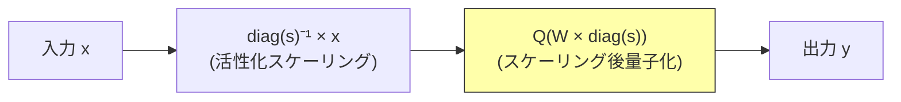

本記事は [arXiv:2306.00978](https://arxiv.org/abs/2306.00978) の解説記事です。

## 論文概要（Abstract）

著者らは、LLMの低ビット重み量子化手法**AWQ（Activation-aware Weight Quantization）**を提案している。中核的な観察として、全ての重みが等しく重要ではなく、活性化の大きさに基づいて重みの**約1%**が「重要（salient）」であることを発見した。これらの重要チャネルを等価変換スケーリングで保護することで、バックプロパゲーション不要かつハードウェア効率を維持しながら、GTPQを上回る量子化精度を達成している。LLaMA-7BのW4量子化でperplexity 5.78（FP16: 5.68）と、FP16との差は**0.10**に留まる。MLSys 2024にて**Best Paper Award**を受賞した。

この記事は [Zenn記事: Ollama 0.17でオンプレLLM推論環境を構築する実践ガイド](https://zenn.dev/0h_n0/articles/96b758789bcc95) の深掘りです。Zenn記事ではQ4_K_Mなどの量子化形式によるVRAM要件が紹介されていますが、本記事ではLLM重み量子化の学術的基盤となるAWQの仕組みを解説します。

## 情報源

- **会議名**: MLSys 2024（Best Paper Award）
- **年**: 2024
- **URL**: [https://arxiv.org/abs/2306.00978](https://arxiv.org/abs/2306.00978)
- **著者**: Ji Lin, Jiaming Tang, Haotian Tang, Shang Yang, Wei-Ming Chen, Wei-Chun Wang, Guangxuan Xiao, Xingyu Dang, Chuang Gan, Song Han（MIT, MIT-IBM Watson AI Lab）
- **コード**: [https://github.com/mit-han-lab/llm-awq](https://github.com/mit-han-lab/llm-awq)

## カンファレンス情報

**MLSysについて**: MLSysは機械学習とシステムの交差領域に焦点を当てた会議であり、モデルの効率化とデプロイメントに関する研究が中心である。AWQがBest Paper Awardを受賞した点は、LLM量子化が実用面で高い関心を集めていることを示している。

## 背景と動機（Background & Motivation）

### 重み量子化の必要性

LLMのデプロイメントにおいて、モデル重みのメモリ消費は最大のコスト要因の1つである。Zenn記事のVRAM要件表の通り、LLaMA-7BのFP16重みだけで約14GBを消費する。4bit量子化（W4）により重みサイズを約3.5GBに削減でき、GPUメモリの大部分をKVキャッシュやバッチ処理に割り当てられる。

既存の重み量子化手法の課題：

- **RTN（Round-to-Nearest）**: 最もシンプルだがモデルサイズが大きい場合を除き精度劣化が大きい
- **GPTQ**: 逆ヘッセ行列に基づく重み再構成で精度を改善するが、キャリブレーションデータへの過適合リスクがある
- **SmoothQuant**: 活性化と重みの量子化を同時に行うが、重み専用量子化（W4A16）には非対応

## 主要な貢献（Key Contributions）

- **貢献1**: 活性化の大きさに基づく重要重み（約1%）の特定手法
- **貢献2**: 等価変換スケーリングによるハードウェア効率を維持した重要重み保護
- **貢献3**: バックプロパゲーション不要の量子化によるInstruction Tunedモデルへの優れた汎化性
- **貢献4**: TinyChatによるエッジデバイス向け高速推論エンジンの実装

## 技術的詳細（Technical Details）

### 核心的観察: 1%の重要重み

著者らの実験により、LLMの各線形層において活性化のチャネル間の大きさが非常に不均一であることが観察された。大きな活性化を持つチャネルに対応する重みは、量子化誤差が出力に与える影響が不釣り合いに大きい。

各チャネル$i$の重要度スコア：

$$
s_i = \mathbb{E}_{x \sim \mathcal{D}}\left[|x_i|\right]
$$

ここで$x_i$は入力活性化のチャネル$i$の値、$\mathcal{D}$はキャリブレーションデータ分布である。上位約1%のチャネルが量子化誤差の大部分を支配していると著者らは報告している。

### ナイーブな解決策とその問題

直感的には、重要な1%の重みをFP16で保持し残りを4bitに量子化する「混合精度」が考えられる。しかし、これはハードウェア効率が悪い：

- GPU GEMM（行列積）は均一なデータ型を前提とする
- 混合精度の行列積は専用カーネルが必要で、汎用GPUでの効率が低下する
- メモリレイアウトが不連続になり、帯域利用効率が低下する

### 等価変換スケーリング

著者らはこの問題を、数学的に等価な変換で解決する。線形層$y = Wx$に対して、チャネルごとのスケールファクタ$\mathbf{s}$を導入する：

$$
y = Wx = \left(W \cdot \text{diag}(\mathbf{s})\right) \cdot \left(\text{diag}(\mathbf{s})^{-1} x\right)
$$

重要チャネル$i$のスケール$s_i > 1$を設定すると：

- 重み側: $w_i \rightarrow s_i \cdot w_i$（大きくなり、量子化グリッドの中でより多くのビットが割り当てられる）
- 活性化側: $x_i \rightarrow x_i / s_i$（小さくなる）
- 量子化誤差の出力への影響: $\Delta w_i \cdot x_i \rightarrow (\Delta w_i / s_i) \cdot (s_i \cdot x_i)$

重要チャネルの量子化誤差が出力に与える影響を実効的に$1/s_i$に削減できる。



### 最適スケールの探索

スケールファクタ$\mathbf{s}^*$は以下の最適化問題で求められる：

$$
\mathbf{s}^* = \arg\min_{\mathbf{s}} \left\| Q\left(W \cdot \text{diag}(\mathbf{s})\right) \cdot \text{diag}(\mathbf{s})^{-1} x - W x \right\|
$$

ここで$Q(\cdot)$はround-to-nearest量子化関数である。

著者らはこの最適化をバックプロパゲーションではなく、**グリッドサーチ**で解いている。活性化の大きさに基づく範囲内でスケール値を探索するため、処理は高速である（LLaMA-70Bで30分以下、対してGPTQは数時間）。

### 実装上のポイント

スケールファクタはTransformerの構造を利用して前段のLayerNorm / RMSNormの重みに吸収できる：

```python
# 概念的な実装
def apply_awq_scaling(
    linear_weight: torch.Tensor,  # [out_features, in_features]
    prev_norm_weight: torch.Tensor,  # [in_features]
    activation_scales: torch.Tensor,  # [in_features]
    alpha: float = 0.5,  # スケーリング強度
) -> tuple[torch.Tensor, torch.Tensor]:
    """AWQスケーリングを適用する。

    Args:
        linear_weight: 量子化対象の線形層重み
        prev_norm_weight: 前段のRMSNorm重み
        activation_scales: 活性化チャネルごとの重要度スコア
        alpha: スケーリング強度（0-1、大きいほど重要チャネルを強く保護）

    Returns:
        スケーリング済み重みとNorm重みのペア
    """
    # 活性化スケールからスケーリングファクタを計算
    s = activation_scales.pow(alpha)

    # 重みをスケーリング（量子化前に適用）
    scaled_weight = linear_weight * s.unsqueeze(0)

    # RMSNorm重みにスケールを吸収（推論時のオーバーヘッドなし）
    scaled_norm = prev_norm_weight / s

    return scaled_weight, scaled_norm
```

## 実験結果（Results）

### WikiText-2 Perplexity

著者らの実験結果（論文Table 1-2より）：

**OPTモデル（W4量子化）**:

| モデル | FP16 | RTN | GPTQ | AWQ |
|--------|------|-----|------|-----|
| OPT-6.7B | 10.86 | 11.56 | 10.94 | **10.91** |
| OPT-13B | 10.13 | 10.61 | 10.17 | **10.18** |
| OPT-66B | 9.34 | 9.65 | 9.36 | **9.38** |

**LLaMAモデル（W4量子化）**:

| モデル | FP16 | RTN | GPTQ | AWQ |
|--------|------|-----|------|-----|
| LLaMA-7B | 5.68 | 6.29 | 5.85 | **5.78** |
| LLaMA-13B | 5.09 | 5.53 | 5.19 | **5.14** |
| LLaMA-65B | 3.53 | 3.73 | 3.57 | **3.55** |

**W3量子化（より難しい設定）**:

| モデル | FP16 | RTN | GPTQ | AWQ |
|--------|------|-----|------|-----|
| LLaMA-7B | 5.68 | 25.54 | 8.07 | **7.04** |
| LLaMA-13B | 5.09 | 11.93 | 6.17 | **5.88** |

W3ではRTNが大幅に劣化（LLaMA-7B: 5.68→25.54）するのに対し、AWQは7.04と大幅に抑制している。

### Instruction Tunedモデルへの汎化性

著者らはInstruction Tunedモデル（Vicuna, LLaMA-Chat等）での比較も報告している。AWQはGPTQに比べて汎化性が高い：

**Vicuna-7B v1.3（MT-Benchスコア）**:
- FP16: 6.74
- GPTQ W4: 6.44（-0.30）
- AWQ W4: **6.61**（-0.13）

この差はGPTQがキャリブレーションデータ（C4等の汎用コーパス）への過適合を起こすのに対し、AWQはスケール探索のみで勾配を使わないため過適合リスクが低いことに起因すると著者らは分析している。

### TinyChatによる推論速度

論文のTinyChat実装による各デバイスでのスループット：

| デバイス | モデル | AWQ W4 (tok/s) | FP16 (tok/s) | 速度向上 |
|----------|--------|---------------|-------------|---------|
| A100 | LLaMA-7B | ~151 | ~64 | **2.4x** |
| RTX 4090 | LLaMA-7B | ~173 | ~55 | **3.1x** |
| RTX 3090 | LLaMA-7B | ~100 | ~36 | **2.8x** |
| M2 Max | LLaMA-7B | ~32 | ~11 | **2.9x** |

重みメモリの削減（14GB → 4.4GB）により、メモリ帯域がボトルネックとなるデコードフェーズで大幅な高速化を達成している。

### GTPQとの総合比較

| 観点 | GPTQ | AWQ |
|------|------|-----|
| 量子化手法 | 逆ヘッセ行列ベース重み再構成 | 活性化ベーススケーリング |
| バックプロパゲーション | 必要 | 不要 |
| 処理時間（70B） | 数時間 | 30分以下 |
| W4 精度（LLaMA-7B） | ppl 5.85 | **ppl 5.78** |
| W3 精度（LLaMA-7B） | ppl 8.07 | **ppl 7.04** |
| Instruction model適用 | 精度低下大 | **精度低下小** |

## 実装のポイント（Implementation）

### Ollamaとの関連

Zenn記事で使用されている`Q4_K_M`はGGML/GGUF形式の量子化であり、AWQとは異なる方式だが目標は同じである：

| 項目 | GGML Q4_K_M | AWQ W4 | GPTQ W4 |
|------|------------|--------|---------|
| 形式 | GGUF（llama.cpp独自） | PyTorch/CUDA | PyTorch/CUDA |
| ツール | Ollama, llama.cpp | TinyChat, vLLM, HF | vLLM, HF, AutoGPTQ |
| 精度（7B ppl） | ~5.8-6.0 | **5.78** | 5.85 |
| 推論エンジン | llama.cpp | TinyChat | 汎用 |
| エッジ対応 | CPU/Metal/CUDA | CUDA/Metal | CUDA |

Ollamaの`ollama pull llama3.1:8b-instruct-q4_K_M`で取得するモデルは、GGML形式で量子化されたものである。AWQ量子化モデルはvLLMやHugging Face Transformersで利用可能であり、`mit-han-lab/llama-2-7b-chat-awq`などがHugging Faceで公開されている。

### 量子化の適用範囲

AWQが量子化するのはTransformerの線形層の重みのみ（W4A16: Weight 4bit, Activation 16bit）：

- Self-Attention: Q, K, V, O projection
- FFN: gate/up/down projection（LLaMAのSwiGLU構成）
- **量子化しない**: LayerNorm/RMSNormパラメータ、Embeddingテーブル、Activation

## 関連研究（Related Work）

- **GPTQ (2210.17323)**: 逆ヘッセ行列ベースの重み量子化。AWQの主要比較対象
- **SmoothQuant (2211.10438)**: 活性化-重み同時量子化（W8A8）。W4A16には非対応
- **QuIP (2023)**: 非一様重み量子化。より低ビットでの精度改善に焦点
- **KVQuant**: KVキャッシュ量子化。AWQは重み量子化であり、KVキャッシュとは直交する最適化

## 実運用への応用（Practical Applications）

### Ollamaユーザーへの示唆

Zenn記事のVRAM要件表において、Q4_K_M量子化でのVRAM消費が記載されている。AWQの知見は以下の実運用判断に役立つ：

1. **4bit量子化は実用的**: AWQの実験によりW4量子化でFP16比0.10のperplexity劣化に抑えられることが示されており、多くのユースケースで十分な精度が得られる
2. **3bit以下は慎重に**: W3ではperplexityが1.36悪化（5.68→7.04）し、精度への影響が無視できない
3. **Instruction Tunedモデルにも有効**: AWQはInstruction Tuningへの汎化性が高く、Ollamaで使う対話型モデルにも適している

### VRAM節約の定量効果

| モデル | FP16 | Q4（AWQ相当） | 節約量 |
|--------|------|-------------|--------|
| LLaMA-7B | 14 GB | 4.4 GB | **9.6 GB** |
| LLaMA-13B | 26 GB | 8.2 GB | **17.8 GB** |
| LLaMA-70B | 140 GB | 44 GB | **96 GB** |

節約したVRAMはKVキャッシュ（コンテキスト長の拡大）やバッチサイズ（スループットの向上）に活用できる。

## まとめと今後の展望

AWQは「全ての重みが等しく重要ではない」という観察から、活性化ベースの等価変換スケーリングという手法を導出し、バックプロパゲーション不要の高精度4bit量子化を実現した。MLSys 2024 Best Paper Awardの受賞が示す通り、この手法はLLMの効率的なデプロイメントに大きく貢献している。

Ollamaで使われるGGML量子化（Q4_K_Mなど）とAWQは異なる実装だが、「活性化分布を考慮した重み量子化」という共通の設計思想を持つ。

## 参考文献

- **Conference**: [MLSys 2024](https://proceedings.mlsys.org/paper_files/paper/2024/hash/42a452cbafa9dd64e9ba4aa95cc1ef21-Abstract-Conference.html)
- **arXiv**: [https://arxiv.org/abs/2306.00978](https://arxiv.org/abs/2306.00978)
- **Code**: [https://github.com/mit-han-lab/llm-awq](https://github.com/mit-han-lab/llm-awq)
- **Related Zenn article**: [https://zenn.dev/0h_n0/articles/96b758789bcc95](https://zenn.dev/0h_n0/articles/96b758789bcc95)
- GPTQ: Frantar et al., "GPTQ: Accurate Post-Training Quantization for Generative Pre-Trained Transformers," ICLR 2023
- SmoothQuant: Xiao et al., "SmoothQuant: Accurate and Efficient Post-Training Quantization for Large Language Models," ICML 2023

---

:::message
本記事は [arXiv:2306.00978](https://arxiv.org/abs/2306.00978) の引用・解説記事であり、筆者自身が実験を行ったものではありません。数値・ベンチマーク結果はすべて原論文からの引用です。
:::
