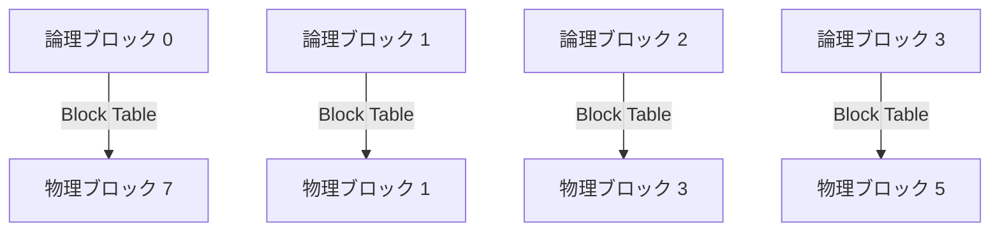
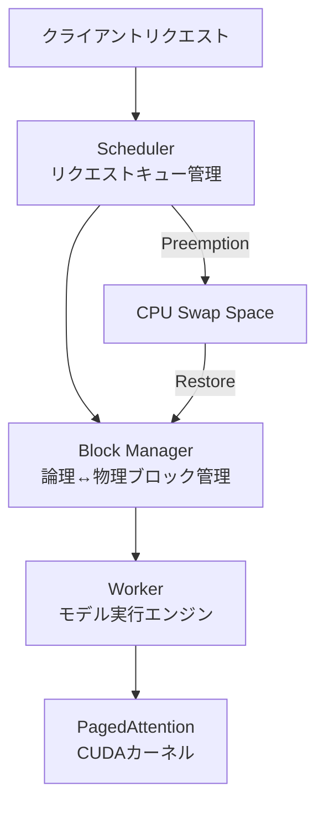

本記事は [arXiv:2309.06180](https://arxiv.org/abs/2309.06180) の解説記事です。

## 論文概要（Abstract）

高スループットなLLMサービングにはリクエストのバッチ処理が不可欠であるが、各リクエストのKey-Value（KV）キャッシュは巨大かつ動的に増減するため、既存システムではメモリの断片化と過剰予約により60-80%が無駄になっていた。著者らはOS仮想メモリのページング技術に着想を得た**PagedAttention**アルゴリズムを提案し、これを基盤としたLLMサービングシステム**vLLM**を構築した。vLLMはKVキャッシュメモリの利用率を約95%まで引き上げ、FasterTransformerやOrcaに対して**2-4倍**のスループット向上を達成している。

この記事は [Zenn記事: Ollama 0.17でオンプレLLM推論環境を構築する実践ガイド](https://zenn.dev/0h_n0/articles/96b758789bcc95) の深掘りです。Zenn記事ではOllamaとvLLMのスループット比較（シングルユーザーでは同等、マルチユーザーではvLLMが約19倍）が紹介されていますが、本記事ではvLLMの中核技術であるPagedAttentionの仕組みを数式・アルゴリズムレベルで解説します。

## 情報源

- **会議名**: SOSP 2023（29th ACM Symposium on Operating Systems Principles）
- **年**: 2023
- **URL**: [https://arxiv.org/abs/2309.06180](https://arxiv.org/abs/2309.06180)
- **著者**: Woosuk Kwon, Zhuohan Li, Siyuan Zhuang, Ying Sheng, Lianmin Zheng, Cody Hao Yu, Joseph E. Gonzalez, Hao Zhang, Ion Stoica（UC Berkeley, Stanford University）
- **発表形式**: Full paper

## カンファレンス情報

**SOSPについて**: SOSPはオペレーティングシステム分野の最高峰会議の1つであり、採択率は通常15-20%程度である。LLM推論システムの論文がOS分野の会議に採択された点は、この問題がシステムレベルのメモリ管理課題であることを示している。

## 背景と動機（Background & Motivation）

### KVキャッシュのメモリ問題

Transformerベースの自己回帰生成では、各トークン生成時に過去全トークンのKey・Valueベクトルを参照する。これらを再計算せずメモリに保持したものがKVキャッシュである。

1トークンあたりのKVキャッシュサイズは以下の式で求められる：

$$
\text{KV\_per\_token} = 2 \times L \times H \times d \times \text{sizeof}(\text{dtype})
$$

ここで、
- $L$: Transformerレイヤー数
- $H$: Attentionヘッド数
- $d$: ヘッド次元数
- $\text{sizeof}(\text{dtype})$: データ型のバイト数（FP16なら2）

例えばOPT-13B（$L=40, H=40, d=128$）の場合、1トークンのKVキャッシュは$2 \times 40 \times 40 \times 128 \times 2 = 819,200$バイト（約800KB）となる。2048トークンのシーケンスでは約1.7GBに達する。

### 既存システムの3つの非効率性

著者らは既存LLMサービングシステムのメモリ管理における3種類の非効率性を特定している：

1. **内部断片化（Internal Fragmentation）**: 最大シーケンス長分のメモリを事前予約するが、実際の生成長は不明なため未使用領域が発生する
2. **外部断片化（External Fragmentation）**: 連続メモリ領域の確保要件により、空きメモリが分散して利用不能になる
3. **重複コピー（Redundant Duplication）**: Beam SearchやParallel Samplingで同一プレフィックスのKVキャッシュが複製される

論文の実測によると、これらの非効率性により既存システムではGPUメモリの**60-80%が無駄**になっていた。

## 主要な貢献（Key Contributions）

- **貢献1**: OS仮想メモリのページング概念をKVキャッシュ管理に応用した**PagedAttention**アルゴリズムの提案
- **貢献2**: PagedAttentionを基盤とした高スループットLLMサービングシステム**vLLM**の設計・実装
- **貢献3**: Copy-on-Write（CoW）機構によるBeam Search・Parallel SamplingでのKVキャッシュ共有

## 技術的詳細（Technical Details）

### PagedAttentionアルゴリズム

PagedAttentionの核心は、KVキャッシュを固定サイズの**ブロック**に分割し、非連続メモリに格納する点にある。



各KVブロックはデフォルトで16トークン分のKey・Valueベクトルを格納する。シーケンスが伸びるにつれて新しいブロックが動的に割り当てられ、ブロックテーブル（論理ブロック番号→物理ブロック番号のマッピング）で管理される。

この設計により、内部断片化は最後のブロックの未使用分（最大15トークン分）に限定され、外部断片化はブロック単位の管理で解消される。

### Attentionの計算方法

標準的なAttention計算は以下の通りである：

$$
\text{Attention}(Q, K, V) = \text{softmax}\left(\frac{QK^T}{\sqrt{d_k}}\right)V
$$

PagedAttentionでは、KVキャッシュが複数の非連続ブロックに分散しているため、ブロック単位でAttentionを計算し、Online Softmaxアルゴリズムで集約する：

$$
\text{PagedAttention}(q, \{K_j, V_j\}_{j=1}^{B}) = \bigoplus_{j=1}^{B} \text{softmax}\left(\frac{q K_j^T}{\sqrt{d_k}}\right) V_j
$$

ここで$B$はブロック数、$\bigoplus$はOnline Softmaxによる集約操作を表す。各ブロックの部分Attention結果を、数値的に安定な方法で統合する。

### Copy-on-Write（CoW）によるメモリ共有

Beam SearchやParallel Samplingでは、複数の候補シーケンスが同一のプレフィックスを共有する。vLLMはOS由来のCoW技術でこの共有を実現する：

```python
# CoWの概念的な動作
# Parent sequence: [Block0, Block1, Block2] refcount=[3,3,1]
# Child A diverges at Block2:
#   Child A: [Block0, Block1, Block3]  # Block2をコピーしてBlock3に
#   refcount of Block0,1: 3→2 for parent, remains shared
# Child B diverges at Block2:
#   Child B: [Block0, Block1, Block4]
```

新しいトークン生成でブロックの内容が変わる場合のみコピーが発生し、共有部分は参照カウントで管理される。著者らの実験によると、Beam Search（beam_width=4）でCoWにより約60%のKVキャッシュメモリを削減できる。

### vLLMシステムアーキテクチャ



**主要コンポーネント**:

1. **Scheduler**: FCFS（First-Come-First-Served）でリクエストを管理。GPU物理ブロックが不足するとプリエンプション（一時退避）を実行
2. **Block Manager**: 論理ブロック↔物理ブロックのマッピング管理、参照カウントによるCoW制御
3. **Worker**: GPUでモデルを実行しPagedAttentionカーネルを呼び出す

**プリエンプション戦略**:
- **Swapping**: KVブロックをGPUからCPUメモリに退避し、後で復元する
- **Recomputation**: KVブロックを破棄し、必要時にプロンプトから再計算する（短いシーケンスに有効）

### 実装の要点

vLLMの実装は約8,500行のPython + CUDAコードで構成されている。カスタムCUDAカーネルは、非連続メモリブロックへのアクセスをFlashAttentionのタイリング戦略と組み合わせて実現している。

```python
# vLLMの使用例（概念的コード）
from vllm import LLM, SamplingParams

# モデルロード
llm = LLM(
    model="meta-llama/Llama-2-7b-hf",
    gpu_memory_utilization=0.95,  # KVキャッシュにGPUメモリの95%を使用
    block_size=16,  # ブロックサイズ（トークン数）
)

# サンプリングパラメータ
sampling_params = SamplingParams(
    temperature=0.7,
    max_tokens=256,
)

# 推論実行（内部でPagedAttentionが動作）
outputs = llm.generate(["質問: KVキャッシュとは？"], sampling_params)
```

## 実験結果（Results）

### メインベンチマーク（OPT-13B, ShareGPTデータセット）

著者らはA100 40GB GPUでOPT-13BモデルをShareGPTデータセット（実ユーザー会話トレース、平均入力長206トークン、平均出力長187トークン）で評価している。

| システム | スループット（vs vLLM） | メモリ利用率 |
|---------|----------------------|------------|
| **vLLM** | 1.0x（ベースライン） | 約95% |
| FasterTransformer | 約0.3x | 低い（断片化大） |
| Orca (OSDI'22) | 約0.5x | 中程度 |
| Hugging Face TGI | 約0.3x | 低い |

（論文Table 1, Figure 11より）

**定量的な改善**:
- FasterTransformerに対して: **2.2-3.5倍**のスループット向上
- Orcaに対して: **1.7-2.5倍**のスループット向上
- テキスト生成品質（BLEU/ROUGEスコア）: 変化なし（数値出力は同一）

### KVキャッシュメモリ効率

著者らのアブレーション実験（論文Figure 12）によると：

- vLLM: KVキャッシュメモリ利用率**約95%**
- 静的割り当てベースライン: 約40-60%
- FasterTransformer: 約20-40%

### Beam SearchでのCoW効果

Beam width=4の設定での実験結果（論文Section 6.2）：

- CoWなし: 4倍のKVキャッシュメモリ消費
- CoWあり（vLLM）: 約1.6倍（プレフィックス共有で約60%削減）

### ブロックサイズの影響（アブレーション）

論文Table 2より：

| ブロックサイズ | スループット | メモリ効率 |
|--------------|------------|-----------|
| 1 | 低い（管理オーバーヘッド大） | 最高（断片化なし） |
| **16** | **最高（推奨値）** | 高い |
| 32 | やや低下 | やや低下 |
| 64 | 低下 | 低下（内部断片化増） |

ブロックサイズ16がスループットとメモリ効率のスイートスポットであると著者らは報告している。

### マルチGPU（OPT-66B, 4 GPU）

Tensor Parallelismで4つのA100 GPUに分散配置した場合、FasterTransformerに対して**2.4倍**のスループット向上を達成している（論文Figure 13）。

## 実装のポイント（Implementation）

### カスタムCUDAカーネルの設計

PagedAttentionのCUDAカーネルは以下の課題を解決している：

1. **非連続メモリアクセス**: ブロックテーブルを参照して物理アドレスを解決する間接参照を、GPUの定数メモリに配置して高速化
2. **FlashAttentionとの統合**: タイリング戦略（SRAM上の小ブロック単位でAttention計算）を非連続ブロックに拡張
3. **ワープレベルの並列化**: 各ワープが1つのKVブロックを担当し、ブロック間でOnline Softmaxを実行

### FlashAttentionとの関係

著者らは論文中でFlashAttentionとPagedAttentionの関係を明確にしている：

- **FlashAttention**: カーネルレベルのIO最適化（HBM↔SRAM転送の最小化）
- **PagedAttention**: システムレベルのメモリ管理最適化（容量効率の最大化）
- 両者は**相補的**であり、vLLMはFlashAttentionのアイデアを取り込みつつPagedAttentionを実装している

### Ollamaとの関連

Zenn記事で紹介されているOllamaはllama.cppをバックエンドとして使用しており、vLLMとは異なるアーキテクチャを採用している。

- **Ollama/llama.cpp**: シングルユーザーに最適化された推論エンジン。連続バッチ処理の機能は限定的
- **vLLM**: マルチユーザー高スループットに最適化。PagedAttentionとContinuous Batchingの組み合わせ

Red Hatの検証記事で報告されているように、シングルユーザーではllama.cpp（Ollamaのバックエンド）との速度差は6%以内だが、マルチユーザー環境ではvLLMが約19倍のスループットを達成する。この差はPagedAttentionによる効率的なバッチ処理に起因する。

## 関連研究（Related Work）

- **Orca (OSDI'22)**: Continuous Batching（動的バッチ処理）を提案。vLLMも同技術を採用しているが、メモリ管理はPagedAttentionで独自に解決
- **FlashAttention (NeurIPS'22)**: IO-Aware Attentionアルゴリズム。vLLMのカーネル設計に影響を与えた相補的技術
- **FasterTransformer (NVIDIA)**: GPU最適化された推論ライブラリ。vLLMの主要比較対象
- **Megatron-LM**: Tensor Parallelism技術。vLLMの分散実行基盤として採用

## 実運用への応用（Practical Applications）

### Ollamaユーザーへの示唆

Zenn記事ではOllamaを「10名程度までのチーム」に推奨しているが、この推奨はPagedAttentionの不在に起因する。具体的な使い分けの判断基準は以下の通りである：

| 条件 | 推奨ツール | 根拠 |
|------|----------|------|
| 同時ユーザー数 ≤ 10 | Ollama | セットアップ容易、シングルユーザー性能は同等 |
| 同時ユーザー数 > 10 | vLLM | PagedAttentionによるバッチ効率 |
| Beam Search/Parallel Sampling多用 | vLLM | CoWによるメモリ共有 |
| エッジ/組み込み | llama.cpp直接 | 最小フットプリント |

### KVキャッシュ最適化との組み合わせ

Zenn記事で紹介されているOllama 0.17のKVキャッシュ8bit量子化（`OLLAMA_KV_CACHE_TYPE=q8_0`）は、PagedAttentionと直交する最適化である。理論的にはPagedAttention + KVキャッシュ量子化の組み合わせにより、さらなるメモリ効率の改善が期待できる。vLLMはすでにFP8 KVキャッシュをサポートしている。

## まとめと今後の展望

PagedAttentionは、OS仮想メモリの概念をLLMのKVキャッシュ管理に応用した技術であり、メモリ利用率を20-40%から約95%に引き上げることでスループットを2-4倍向上させた。この技術はvLLMとして実装・公開され、2026年現在、最も広く使われているLLMサービングフレームワークの1つとなっている。

Ollamaのようなシングルユーザー向けツールとvLLMのようなマルチテナント向けシステムの使い分けを理解する上で、PagedAttentionの仕組みを把握することは重要である。

## 参考文献

- **Conference URL**: [https://arxiv.org/abs/2309.06180](https://arxiv.org/abs/2309.06180)
- **Code**: [https://github.com/vllm-project/vllm](https://github.com/vllm-project/vllm)
- **Related Zenn article**: [https://zenn.dev/0h_n0/articles/96b758789bcc95](https://zenn.dev/0h_n0/articles/96b758789bcc95)
- Orca: Yu et al., "Orca: A Distributed Serving System for Transformer-Based Generative Models," OSDI 2022
- FlashAttention: Dao et al., "FlashAttention: Fast and Memory-Efficient Exact Attention with IO-Awareness," NeurIPS 2022

---

:::message
本記事は [arXiv:2309.06180](https://arxiv.org/abs/2309.06180) の引用・解説記事であり、筆者自身が実験を行ったものではありません。数値・ベンチマーク結果はすべて原論文からの引用です。
:::
