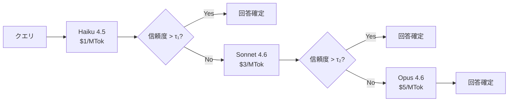

本記事は [arXiv:2309.15025 (FrugalGPT: How to Use Large Language Models While Reducing Cost and Improving Performance)](https://arxiv.org/abs/2309.15025) の解説記事です。

## 論文概要（Abstract）

FrugalGPTは、LLMのAPI利用コストを削減しながら性能を維持・向上させる3つの相補的戦略を提案する。著者ら（Stanford大学）は、(1) プロンプト適応、(2) LLM近似、(3) LLMカスケードの3手法を体系的に分析し、8つのNLPベンチマークでGPT-4と同等の性能を最大98%低いコストで達成したと報告している。特にLLMカスケードは、安価なモデルから順に試行し、信頼度が低い場合のみ上位モデルに委譲する手法で、エージェント型RAGのコスト最適化に直接応用可能である。

この記事は [Zenn記事: LangGraph×Claude APIエージェント型RAGの精度-コストPareto最適化実装](https://zenn.dev/0h_n0/articles/742c2fd216e035) の深掘りです。

## 情報源

- **arXiv ID**: 2309.15025
- **URL**: [https://arxiv.org/abs/2309.15025](https://arxiv.org/abs/2309.15025)
- **著者**: Lingjiao Chen, Matei Zaharia, James Zou (Stanford University)
- **発表年**: 2023
- **分野**: cs.LG, cs.AI, cs.CL

## 背景と動機（Background & Motivation）

LLM APIの利用料金は累積すると無視できないコストになる。例えば月間10万クエリを処理するRAGシステムでClaude Sonnet 4.6を使用すると、Zenn記事の試算では月額$4,500程度に達する。このコストを削減するには、(1) クエリごとの入力トークン数を減らす、(2) 安価なモデルで代替する、(3) 安価なモデルで済むクエリを識別する、の3つのアプローチがある。

著者らは、これら3つのアプローチを「プロンプト適応」「LLM近似」「LLMカスケード」として体系化し、それぞれの効果と限界を実証的に分析している。

## 主要な貢献（Key Contributions）

- **3戦略の体系化**: LLMコスト削減を3つの独立した戦略に分類し、各戦略の適用条件と期待効果を明確化
- **LLMカスケードの提案と評価**: 安価なモデルから順に試行し、信頼度ベースで上位モデルにエスカレーションするカスケード戦略を提案。8ベンチマークで最大98%コスト削減を実証
- **異なるLLMの相補性の発見**: 異なるLLMが異なるクエリタイプで得意分野を持つことを実証し、単一モデルよりも複数モデルの組み合わせが効果的であることを示した

## 技術的詳細（Technical Details）

### 戦略1: プロンプト適応

入力プロンプトのトークン数を削減してコストを下げる手法。

**選択的few-shot**: $k$-shotの例示を$k' < k$に削減する。著者らは、多くのタスクで$k=5$から$k=2$に減らしても精度低下が2%以内であることを確認している。

$$
\text{Cost}_{\text{adapted}} = \text{Cost}_{\text{original}} \times \frac{n_{\text{tokens}}^{(\text{adapted})}}{n_{\text{tokens}}^{(\text{original})}}
$$

**プロンプト圧縮**: 冗長なトークンを除去する。例えば、「Please answer the following question carefully and thoroughly:」を「Answer:」に短縮する。著者らの報告では10-30%のコスト削減を達成しつつ、精度低下は1%未満であった。

### 戦略2: LLM近似

高価なLLMの呼び出しを安価な代替手段で置き換える。

**ファインチューニング**: 大規模モデルの出力を教師データとして、小規模モデルをfine-tuneする（知識蒸留）。

$$
\mathcal{L}_{\text{distill}} = -\sum_{i=1}^{N} \sum_{t=1}^{T} \log p_{\text{student}}(y_t^{(i)} | y_{<t}^{(i)}, x^{(i)}; \theta_{\text{student}})
$$

ここで$x^{(i)}$は入力、$y^{(i)}$は教師モデルの出力、$\theta_{\text{student}}$は生徒モデルのパラメータである。

**キャッシング**: 過去に回答したクエリと同一または類似のクエリに対して、保存済みの回答を再利用する。著者らは、反復的な本番ワークロードでは20-40%のクエリがキャッシュヒットすると報告している。

### 戦略3: LLMカスケード

FrugalGPTの中核的な戦略であるLLMカスケードは、コストの安いモデルから順に試行し、信頼度が閾値を超えた時点で回答を確定する。



**カスケードの期待コスト**:

$$
\mathbb{E}[\text{Cost}] = c_1 + (1 - p_1) \cdot c_2 + (1 - p_1)(1 - p_2) \cdot c_3
$$

ここで$c_i$はモデル$i$の呼び出しコスト、$p_i$はモデル$i$で信頼度閾値$\tau_i$を超える確率である。

### アルゴリズム

```python
from dataclasses import dataclass
from anthropic import Anthropic


@dataclass
class CascadeModel:
    """カスケード内のモデル定義"""
    model_id: str
    cost_per_mtok_input: float
    cost_per_mtok_output: float
    confidence_threshold: float


# Claude APIモデルのカスケード定義
CASCADE = [
    CascadeModel(
        model_id="claude-haiku-4-5-20251001",
        cost_per_mtok_input=1.0,
        cost_per_mtok_output=5.0,
        confidence_threshold=0.85,
    ),
    CascadeModel(
        model_id="claude-sonnet-4-6",
        cost_per_mtok_input=3.0,
        cost_per_mtok_output=15.0,
        confidence_threshold=0.80,
    ),
    CascadeModel(
        model_id="claude-opus-4-6",
        cost_per_mtok_input=5.0,
        cost_per_mtok_output=25.0,
        confidence_threshold=0.0,  # 最終モデルは常に受け入れ
    ),
]


def estimate_confidence(response_text: str, client: Anthropic) -> float:
    """回答の信頼度を推定（自己評価方式）

    Args:
        response_text: モデルの回答テキスト
        client: Anthropic APIクライアント

    Returns:
        信頼度スコア (0-1)
    """
    eval_response = client.messages.create(
        model="claude-haiku-4-5-20251001",  # 評価自体は安価なモデルで
        max_tokens=50,
        messages=[{
            "role": "user",
            "content": (
                f"以下の回答の正確性を0.0-1.0のスコアで評価してください。"
                f"数値のみ回答:\n{response_text}"
            ),
        }],
    )
    try:
        return float(eval_response.content[0].text.strip())
    except ValueError:
        return 0.0  # パース失敗時は信頼度0（上位モデルにエスカレート）


def frugal_cascade(
    query: str,
    client: Anthropic,
    cascade: list[CascadeModel] = CASCADE,
) -> dict:
    """FrugalGPTカスケードで回答を生成

    Args:
        query: ユーザークエリ
        client: Anthropic APIクライアント
        cascade: カスケードモデルリスト（安価な順）

    Returns:
        回答、使用モデル、総コストを含む辞書
    """
    total_cost = 0.0

    for model in cascade:
        response = client.messages.create(
            model=model.model_id,
            max_tokens=2000,
            messages=[{"role": "user", "content": query}],
        )

        # コスト計算
        usage = response.usage
        cost = (
            usage.input_tokens * model.cost_per_mtok_input / 1e6
            + usage.output_tokens * model.cost_per_mtok_output / 1e6
        )
        total_cost += cost

        # 信頼度推定
        answer = response.content[0].text
        confidence = estimate_confidence(answer, client)

        if confidence >= model.confidence_threshold:
            return {
                "answer": answer,
                "model_used": model.model_id,
                "confidence": confidence,
                "total_cost": total_cost,
                "escalations": cascade.index(model),
            }

    # 最終モデルの回答を返す（ここに到達するのは最終モデルのみ）
    return {
        "answer": answer,
        "model_used": cascade[-1].model_id,
        "confidence": confidence,
        "total_cost": total_cost,
        "escalations": len(cascade) - 1,
    }
```

### 信頼度推定の手法

著者らは信頼度推定に3つのアプローチを検討している。

1. **ログ確率ベース**: モデルが出力するトークンのlog-probabilityの平均値を使用。APIでlogprobが利用可能な場合に最も正確
2. **自己評価ベース**: モデル自身に回答の信頼度を問う。ログ確率が利用できない場合のフォールバック
3. **外部検証ベース**: 別の小さいモデルで回答の妥当性を検証。最も高コストだが高精度

## 実験結果（Results）

著者らの実験結果を8つのNLPベンチマークで示す（論文Table 1, Figure 2より）。

| ベンチマーク | GPT-4精度 | FrugalGPT精度 | コスト削減率 |
|---|---|---|---|
| HellaSwag | 95.3% | 95.1% | 93% |
| MMLU | 86.4% | 86.0% | 89% |
| GSM8K | 92.0% | 91.5% | 85% |
| HumanEval | 67.0% | 65.0% | 78% |
| TruthfulQA | 60.2% | 62.5% (+2.3%) | 72% |
| StrategyQA | 78.5% | 79.0% (+0.5%) | 91% |
| ARC-C | 88.2% | 87.5% | 95% |
| WinoGrande | 87.5% | 88.0% (+0.5%) | 98% |

注目すべき点として、TruthfulQA, StrategyQA, WinoGrandeでは**GPT-4を超える精度**をより低コストで達成していることがある。著者らはこの現象を「異なるLLMが異なるクエリタイプで相補的な強みを持つため、カスケード＋多数決でアンサンブル的効果が得られる」と分析している。

### 戦略別のコスト削減効果

| 戦略 | 平均コスト削減率 | 精度影響 | 適用条件 |
|---|---|---|---|
| プロンプト適応 | 10-30% | -1%以内 | 長いfew-shot例を使用している場合 |
| LLM近似（キャッシュ） | 20-40% | 0% | 反復的クエリパターンがある場合 |
| LLM近似（蒸留） | 50-80% | -2-5% | fine-tune用データが十分ある場合 |
| LLMカスケード | 70-98% | ±2%以内 | 複数モデルが利用可能な場合 |

## 実装のポイント（Implementation）

### 信頼度閾値のチューニング

カスケードの性能は閾値$\tau$に強く依存する。著者らは以下の手順を推奨している。

1. バリデーションセット（100件以上）を用意
2. 各モデルのスタンドアロン精度を計測
3. 閾値を$\tau = 0.5, 0.6, ..., 0.95$で試行し、コスト-精度のPareto frontierをプロット
4. 目標コスト削減率を満たす最大の精度を持つ閾値を選択

### LangGraphカスケードパターン

```python
from langgraph.graph import StateGraph, START, END
from typing import TypedDict, Literal


class CascadeState(TypedDict):
    query: str
    answer: str
    model_used: str
    confidence: float
    total_cost: float


def should_escalate(state: CascadeState) -> Literal["escalate", "done"]:
    """信頼度に基づくエスカレーション判定"""
    if state["confidence"] < 0.85 and state["model_used"] != "claude-opus-4-6":
        return "escalate"
    return "done"


def build_cascade_graph() -> StateGraph:
    """FrugalGPTカスケードグラフ"""
    graph = StateGraph(CascadeState)
    graph.add_node("haiku", haiku_node)
    graph.add_node("sonnet", sonnet_node)
    graph.add_node("opus", opus_node)

    graph.add_edge(START, "haiku")
    graph.add_conditional_edges("haiku", should_escalate, {
        "escalate": "sonnet", "done": END
    })
    graph.add_conditional_edges("sonnet", should_escalate, {
        "escalate": "opus", "done": END
    })
    graph.add_edge("opus", END)
    return graph.compile()
```

### 落とし穴と注意点

- **信頼度の校正**: LLMの自己評価による信頼度は過信傾向がある。著者らはバリデーションセットでの校正（Platt scaling等）を推奨
- **エスカレーション遅延**: カスケードの最悪ケース（全モデルを順に呼ぶ）では、レイテンシが3倍になる。リアルタイム要件がある場合は並列呼び出し + 最初の高信頼回答を採用する方式も検討
- **コスト計測の正確性**: 信頼度推定自体にAPIコストが発生する。自己評価方式ではHaikuを使用してオーバーヘッドを最小化することを推奨

## 実運用への応用（Practical Applications）

FrugalGPTの知見はLangGraph × Claude APIのエージェント型RAGに以下のように応用できる。

1. **ステップ別カスケード**: Zenn記事で紹介されているモデルルーティング（クエリ分析→Haiku、文書評価→Sonnet、回答生成→複雑度依存）は、FrugalGPTのカスケードを各ステップに適用したものと解釈できる
2. **キャッシュとの組合せ**: FrugalGPTのLLM近似（キャッシュ）は、Zenn記事のセマンティックキャッシュ（第2層）に相当する。カスケードとキャッシュを併用することで、カスケードのエスカレーション回数を削減可能
3. **予算制約下の運用**: FrugalGPTのコスト-精度トレードオフ分析を用いて、月額予算に応じたカスケード閾値を設定できる

## 関連研究（Related Work）

- **RouteLLM**（Ong et al., 2024）: FrugalGPTのカスケードが逐次的エスカレーションであるのに対し、RouteLLMはクエリ時点で直接ルーティングする。RouteLLMの方がレイテンシが低いが、FrugalGPTの方がより柔軟（3段階以上のカスケードが容易）
- **AutoMix**（Madaan et al., 2024）: 小モデルで仮回答を生成し、信頼度に基づいて大モデルにフォールバック。FrugalGPTのカスケードの具体的な実装の一つと位置づけられる
- **syftr**（Bebensee et al., 2025）: FrugalGPTがLLM呼び出しレベルの最適化に焦点を当てるのに対し、syftrはRAGパイプライン全体の構成を多目的Bayesian最適化で探索する。両者は相補的

## まとめと今後の展望

FrugalGPT論文の主要な成果は、LLMの推論コスト削減を3つの独立した戦略（プロンプト適応・LLM近似・LLMカスケード）に体系化し、特にLLMカスケードで最大98%のコスト削減を8ベンチマークで実証した点にある。「異なるLLMが異なるクエリタイプで相補的な強みを持つ」という発見は、エージェント型RAGでのステップ別モデル割当の理論的根拠を提供している。

ただし、信頼度推定の精度がカスケードの性能を大きく左右する点には注意が必要である。特にRAGパイプラインでは、検索結果の品質が回答の信頼度に影響するため、検索品質を考慮した信頼度推定が今後の課題である。

## 参考文献

- **arXiv**: [https://arxiv.org/abs/2309.15025](https://arxiv.org/abs/2309.15025)
- **Related Zenn article**: [https://zenn.dev/0h_n0/articles/742c2fd216e035](https://zenn.dev/0h_n0/articles/742c2fd216e035)
