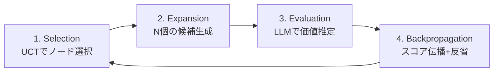

本記事は [Language Agent Tree Search Unifies Reasoning Acting and Planning in Language Models](https://arxiv.org/abs/2310.04406)（Zhou et al., ICML 2024）の解説記事です。

## 論文概要（Abstract）

LATS（Language Agent Tree Search）は、モンテカルロ木探索（MCTS）をLLMエージェントに統合することで、推論（Reasoning）・行動（Acting）・計画（Planning）を統一的なフレームワークで実現する手法である。LLM自身をエージェント・価値関数・最適化器として活用し、複数の行動候補を木構造で探索する。著者らは、HumanEvalでpass@1精度94.4%（GPT-4使用時）、WebShopでReAct比+10.3%の改善を報告している。

この記事は [Zenn記事: ReAct+CoT推論の5大実装パターン：Reflexion・LATS・ReWOOをLangGraphで構築する](https://zenn.dev/0h_n0/articles/7a4b0b4ff37caa) の深掘りです。

## 情報源

- **会議名**: ICML 2024（International Conference on Machine Learning）
- **arXiv ID**: 2310.04406
- **URL**: [https://arxiv.org/abs/2310.04406](https://arxiv.org/abs/2310.04406)
- **著者**: Andy Zhou, Kai Yan, Michal Shlapentokh-Rothman, Haohan Wang, Yu-Xiong Wang（University of Illinois at Urbana-Champaign）
- **発表年**: 2024
- **コードリポジトリ**: [https://github.com/lapisrocks/LanguageAgentTreeSearch](https://github.com/lapisrocks/LanguageAgentTreeSearch)

## カンファレンス情報

ICML（International Conference on Machine Learning）は機械学習分野の最高峰会議の1つであり、2024年の採択率は約27.5%であった。LATSはReActとReflexionを木探索で拡張するアプローチとして採択された。

## 背景と動機（Background & Motivation）

ReActは「思考→行動→観察」の逐次的ループでタスクを解くが、一度選択した行動経路から逸脱できないという制約がある。Reflexionはエピソード単位の反省により改善するが、同一エピソード内での方向転換は不可能である。

著者らは「MCTSがAlphaGoで大規模な探索空間を効率的に探索できたのと同様に、LLMエージェントの行動空間においても木探索が有効ではないか」という仮説を検証している。MCTSの4フェーズ（Selection → Expansion → Simulation → Backpropagation）をLLMエージェントに適用し、LLM自身が価値推定と反省生成の両方を担うことで、外部の報酬モデルなしに探索を実現している。

## 主要な貢献（Key Contributions）

- **LLMの3つの役割統合**: LLMをエージェント（行動生成）、価値関数（状態評価）、最適化器（反省・改善）として同時活用するフレームワークを提案
- **MCTSのLLMエージェントへの適用**: Selection（UCT）、Expansion（複数候補生成）、Simulation（LLM価値推定）、Backpropagation（スコア伝播+反省）の4フェーズを定義
- **ReAct・Reflexionの一般化**: ReActを深さ1・幅1のLATS、Reflexionを深さ1・幅Nの探索として位置づけ、既存手法を特殊ケースとして包含
- **6つのベンチマークでの検証**: プログラミング（HumanEval, MBPP）、Web操作（WebShop）、数学（Game of 24, CrossWords）、QA（HotpotQA）で有効性を実証

## 技術的詳細（Technical Details）

### MCTSの4フェーズ



### Selection: UCTによるノード選択

著者らはUCT（Upper Confidence bounds applied to Trees）アルゴリズムを使用している。論文Section 3.1より、ノード $s$ の選択スコアは以下で計算される。

$$
UCT(s) = \frac{V(s)}{N(s)} + c \sqrt{\frac{\ln N(\text{parent}(s))}{N(s)}}
$$

ここで、
- $V(s)$: ノード $s$ の累積報酬
- $N(s)$: ノード $s$ の訪問回数
- $N(\text{parent}(s))$: 親ノードの訪問回数
- $c$: 探索定数（著者らの実験では $c = \sqrt{2}$ を使用）

第1項 $V(s)/N(s)$ が「活用」（高報酬ノード優先）、第2項が「探索」（未訪問ノード優先）を表す。$c$ の値が大きいほど探索的になる。

### Expansion: LLMによる複数候補生成

選択されたリーフノードから、LLMが $n$ 個の異なるアクション候補を生成する。論文ではデフォルト $n = 5$ が使用されている。各候補は独立に生成され、多様性を確保するためにtemperatureパラメータを調整する。

$$
\{a_1, a_2, ..., a_n\} = \text{LLM}_{\text{agent}}(s, \text{temperature}=0.7)
$$

### Evaluation: LLMによる価値推定

著者らは外部の報酬モデルを使用せず、LLM自身に状態の価値を推定させる。論文Section 3.2より、LLMに対して以下のプロンプトで0.0〜1.0のスコアを生成させる。

$$
v(s) = \text{LLM}_{\text{value}}(s, \text{task})
$$

価値推定の精度がMCTSの探索品質を左右するため、著者らはプロンプトに「正解に到達できる確率を0.0〜1.0で回答せよ」という明示的な指示を含めている。

### Backpropagation: スコア伝播と反省

評価スコアをリーフノードからルートノードまで伝播する。標準的なMCTSのバックプロパゲーションに加え、失敗したノードに対してLLMが反省テキストを生成する。

$$
V(s) \leftarrow V(s) + v(\text{child}(s))
$$

$$
N(s) \leftarrow N(s) + 1
$$

反省テキスト $r$ は Reflexion と同様に生成され、同一サブツリー内の将来の展開で再利用される。

### アルゴリズム全体

```python
import math
from dataclasses import dataclass, field

@dataclass
class LATSNode:
    """LATS木探索のノード

    Args:
        state: 現在のエージェント状態
        action: このノードに至ったアクション
        value: 累積報酬
        visits: 訪問回数
        reflection: 失敗時の反省テキスト
    """
    state: str
    action: str = ""
    value: float = 0.0
    visits: int = 0
    reflection: str = ""
    children: list["LATSNode"] = field(default_factory=list)
    parent: "LATSNode | None" = None

    def uct(self, c: float = 1.41) -> float:
        """UCTスコアを計算

        Args:
            c: 探索定数（default: sqrt(2)）

        Returns:
            UCTスコア
        """
        if self.visits == 0:
            return float("inf")
        exploitation = self.value / self.visits
        exploration = c * math.sqrt(
            math.log(self.parent.visits) / self.visits
        )
        return exploitation + exploration


def lats_search(
    task: str,
    agent_llm,
    value_llm,
    reflect_llm,
    max_iterations: int = 10,
    expansion_width: int = 5,
    success_threshold: float = 0.95,
) -> str:
    """LATS木探索を実行

    Args:
        task: 解くべきタスク
        agent_llm: アクション生成用LLM
        value_llm: 価値推定用LLM
        reflect_llm: 反省生成用LLM
        max_iterations: 最大探索反復回数
        expansion_width: 各ノードの展開幅
        success_threshold: 成功と判定する閾値

    Returns:
        最善のアクション系列
    """
    root = LATSNode(state="initial")

    for iteration in range(max_iterations):
        # 1. Selection: UCTで最有望ノードを選択
        node = root
        while node.children:
            node = max(node.children, key=lambda c: c.uct())

        # 2. Expansion: N個の候補アクションを生成
        actions = agent_llm.generate_actions(
            task, node.state, n=expansion_width
        )

        for action in actions:
            child = LATSNode(
                state=f"{node.state} -> {action}",
                action=action,
                parent=node,
            )

            # 3. Evaluation: LLMで価値推定
            child.value = value_llm.estimate_value(task, child.state)
            child.visits = 1
            node.children.append(child)

            # 成功判定
            if child.value >= success_threshold:
                return child.state

        # 4. Backpropagation: スコア伝播
        best_child = max(node.children, key=lambda c: c.value)
        current = node
        while current is not None:
            current.visits += 1
            current.value += best_child.value
            current = current.parent

        # 反省生成（最低評価の子ノードに対して）
        worst_child = min(node.children, key=lambda c: c.value)
        if worst_child.value < 0.5:
            worst_child.reflection = reflect_llm.reflect(
                task, worst_child.state
            )

    # 最善経路を返す
    best_leaf = _find_best_leaf(root)
    return best_leaf.state
```

## 実験結果（Results）

### コード生成（HumanEval）

論文Table 1より、HumanEvalベンチマークにおけるpass@1精度を以下に示す。

| 手法 | GPT-3.5 pass@1 (%) | GPT-4 pass@1 (%) |
|------|---------------------|-------------------|
| 直接生成 | 48.1 | 67.0 |
| CoT | 51.4 | 71.0 |
| ReAct | 52.0 | 74.0 |
| Reflexion | 68.1 | 91.0 |
| ToT (Tree of Thoughts) | 54.4 | 72.0 |
| **LATS** | **71.8** | **94.4** |

著者らは、LATSがGPT-4でpass@1 94.4%を達成し、Reflexion（91.0%）を3.4ポイント上回ったと報告している。GPT-3.5でもReflexion比+3.7ポイントの改善が見られる。

### Web操作（WebShop）

論文Table 3より、WebShopの平均スコアを以下に示す。

| 手法 | 平均スコア |
|------|-----------|
| ReAct | 50.3 |
| Reflexion | 56.2 |
| **LATS** | **60.6** |

LATSはReAct比+10.3ポイント、Reflexion比+4.4ポイントの改善を達成したと報告されている。

### 数学パズル（Game of 24）

論文Table 2より、Game of 24の成功率を以下に示す。

| 手法 | 成功率 (%) |
|------|-----------|
| CoT | 4.0 |
| ToT (b=5) | 74.0 |
| **LATS** | **81.0** |

著者らは、探索的な問題でLATSが特に有効であると分析している。ToTとの違いは、LATSが反省メカニズムを統合している点と、UCTによる効率的なノード選択を行う点である。

### API呼び出しコストの分析

著者らは論文Section 5で、LATSのAPI呼び出しコストについても分析している。

| 手法 | HumanEval API呼び出し数（平均） |
|------|-------------------------------|
| ReAct | 1.0x |
| Reflexion | 2.8x |
| LATS (n=5, d=3) | 8.2x |

LATSはReActの約8倍のAPI呼び出しが必要であると報告されている。探索幅 $n$ と深さ $d$ の設定が直接的にコストに影響するため、プロダクション環境では $n=3$, $d=3\sim5$ 程度の設定が推奨される。

## 実装のポイント（Implementation）

### 探索パラメータの調整

- **探索幅（n）**: 著者らの実験では $n=5$ がデフォルトであるが、コスト制約がある場合は $n=3$ でも十分な性能が得られると報告されている
- **最大深さ（d）**: 深さが増すとコンテキスト長が爆発するため、$d=5$ 以下を推奨
- **探索定数（c）**: $c=\sqrt{2}$ がデフォルトであるが、タスクに応じて調整が必要。探索的タスクでは大きめ（$c=2.0$）、明確なゴールがあるタスクでは小さめ（$c=1.0$）

### LLMの価値推定の精度

LATSの探索品質はLLMの価値推定精度に強く依存する。著者らは「キャリブレーション」の問題を指摘しており、LLMが過度に楽観的（常に高スコア）または悲観的（常に低スコア）な推定を行うと探索効率が低下する。Few-shotプロンプトで価値推定の例を提供することが推奨されている。

### 並列化の可能性

Expansionフェーズでは $n$ 個の候補を独立に評価するため、API呼び出しの並列化が可能である。LangGraphのParallel Node機能を活用することで、レイテンシを $n$ 分の1に削減できる。

```python
from langgraph.graph import StateGraph, END

def build_lats_graph(expansion_width: int = 5) -> StateGraph:
    """LATS探索のLangGraphグラフを構築

    Args:
        expansion_width: 各ノードの展開幅

    Returns:
        コンパイル済みLangGraphグラフ
    """
    graph = StateGraph(LATSState)
    graph.add_node("select", select_node)
    graph.add_node("expand", expand_and_evaluate)
    graph.add_node("backpropagate", backpropagate_scores)
    graph.add_node("output", output_best)
    graph.set_entry_point("select")
    graph.add_edge("select", "expand")
    graph.add_edge("expand", "backpropagate")
    graph.add_conditional_edges(
        "backpropagate",
        should_continue,
        {"select": "select", "output": "output"},
    )
    graph.add_edge("output", END)
    return graph.compile()
```

## Production Deployment Guide

### AWS実装パターン（コスト最適化重視）

LATSはAPI呼び出し数がReActの約8倍になるため、コスト管理が特に重要である。

| 規模 | 月間リクエスト | 推奨構成 | 月額コスト | 主要サービス |
|------|--------------|---------|-----------|------------|
| **Small** | ~3,000 (100/日) | Serverless | $300-800 | Lambda + Step Functions + Bedrock |
| **Medium** | ~30,000 (1,000/日) | Hybrid | $2,000-5,000 | ECS Fargate + Bedrock Batch |
| **Large** | 300,000+ (10,000/日) | Container | $10,000-30,000 | EKS + Karpenter + Spot |

**Small構成の詳細**（月額$300-800）:
- **Step Functions**: 木探索のオーケストレーション（Parallel State活用で候補並列評価）（$30/月）
- **Lambda**: 各ノードの評価・展開（$50/月）
- **Bedrock**: Haiku（価値推定）+ Sonnet（行動生成）、Prompt Caching有効（$600/月）
- **DynamoDB**: 木構造とノード状態の永続化（$20/月）

**コスト削減テクニック**:
- Expansion候補の並列API呼び出しでBedrock Batch APIを活用（50%割引）
- 価値推定にHaikuモデル（$0.25/MTok）を使用し、行動生成のみSonnet（$3/MTok）を使用
- Early termination: 高スコア（0.95以上）のノード発見時に探索を打ち切る
- キャッシュ: 同一状態パターンの価値推定結果をDynamoDBにキャッシュ

**コスト試算の注意事項**: 上記は2026年2月時点のAWS ap-northeast-1（東京）リージョン料金に基づく概算値です。LATSの展開幅（n）と最大深さ（d）により呼び出し数が $O(n \times d \times \text{iterations})$ で増加するため、パラメータ設定がコストに直結します。最新料金は [AWS料金計算ツール](https://calculator.aws/) で確認してください。

### Terraformインフラコード

**Small構成: Step Functions + Lambda + Bedrock**

```hcl
# --- Step Functions（木探索オーケストレーション） ---
resource "aws_sfn_state_machine" "lats_search" {
  name     = "lats-tree-search"
  role_arn = aws_iam_role.step_functions.arn

  definition = jsonencode({
    StartAt = "SelectNode"
    States = {
      SelectNode = {
        Type     = "Task"
        Resource = aws_lambda_function.lats_select.arn
        Next     = "ExpandParallel"
      }
      ExpandParallel = {
        Type = "Parallel"
        Branches = [for i in range(5) : {
          StartAt = "Expand_${i}"
          States = {
            "Expand_${i}" = {
              Type     = "Task"
              Resource = aws_lambda_function.lats_expand.arn
              End      = true
            }
          }
        }]
        Next = "Backpropagate"
      }
      Backpropagate = {
        Type     = "Task"
        Resource = aws_lambda_function.lats_backprop.arn
        Next     = "CheckTermination"
      }
      CheckTermination = {
        Type = "Choice"
        Choices = [{
          Variable          = "$.best_score"
          NumericGreaterThan = 0.95
          Next              = "OutputResult"
        }]
        Default = "SelectNode"
      }
      OutputResult = {
        Type = "Pass"
        End  = true
      }
    }
  })
}

# --- Lambda関数 ---
resource "aws_lambda_function" "lats_expand" {
  filename      = "lats_expand.zip"
  function_name = "lats-expand-evaluate"
  role          = aws_iam_role.lats_lambda.arn
  handler       = "index.handler"
  runtime       = "python3.12"
  timeout       = 60
  memory_size   = 512

  environment {
    variables = {
      VALUE_MODEL_ID = "anthropic.claude-3-5-haiku-20241022-v1:0"
      AGENT_MODEL_ID = "anthropic.claude-3-5-sonnet-20241022-v2:0"
      DYNAMODB_TABLE = aws_dynamodb_table.lats_tree.name
    }
  }
}

# --- DynamoDB（木構造永続化） ---
resource "aws_dynamodb_table" "lats_tree" {
  name         = "lats-tree-nodes"
  billing_mode = "PAY_PER_REQUEST"
  hash_key     = "search_id"
  range_key    = "node_id"

  attribute {
    name = "search_id"
    type = "S"
  }
  attribute {
    name = "node_id"
    type = "S"
  }

  ttl {
    attribute_name = "expire_at"
    enabled        = true
  }
}
```

### 運用・監視設定

**CloudWatch Logs Insights — 探索効率分析**:
```sql
fields @timestamp, search_id, iterations, best_score, total_api_calls
| stats avg(iterations) as avg_iters, avg(total_api_calls) as avg_calls by bin(1h)
| filter total_api_calls > 50
```

**コスト監視**:
```python
import boto3

cloudwatch = boto3.client('cloudwatch')
cloudwatch.put_metric_alarm(
    AlarmName='lats-api-call-spike',
    ComparisonOperator='GreaterThanThreshold',
    EvaluationPeriods=1,
    MetricName='Invocations',
    Namespace='AWS/Lambda',
    Period=3600,
    Statistic='Sum',
    Threshold=1000,
    AlarmDescription='LATS API呼び出し数異常（コスト急増の可能性）'
)
```

### コスト最適化チェックリスト

- [ ] 価値推定にHaikuモデルを使用しているか
- [ ] Expansion候補をBatch APIで並列評価しているか
- [ ] Early termination閾値を設定しているか（推奨: 0.95）
- [ ] 探索幅nを3以下に制限しているか（コスト重視時）
- [ ] DynamoDBキャッシュで同一パターンの再評価を回避しているか
- [ ] Step Functions Expressモードで短時間実行のコストを削減しているか

## 実運用への応用（Practical Applications）

LATSは以下のユースケースで特に有効である。

- **探索的コード生成**: 複数のアプローチを並列に試し、テストケースで最善解を選択する。HumanEvalでの94.4%が示すように、コード生成タスクとの親和性が高い
- **複雑な意思決定**: 制約充足問題、計画問題など、単純なReActでは探索しきれない問題空間に有効
- **品質最適化タスク**: 文書生成やデザイン提案など、複数の候補を比較評価して最善を選ぶタスク

ただし、APIコストがReActの約8倍になるため、コスト制約が厳しい環境では探索パラメータの厳密な調整か、より軽量な手法（Reflexion）の検討が必要である。

## 関連研究（Related Work）

- **ReAct**（Yao et al., 2022, [arXiv:2210.03629](https://arxiv.org/abs/2210.03629)）: LATSの基盤となる推論+行動フレームワーク。LATSにおいてはReActが各ノードの行動生成に使用される
- **Reflexion**（Shinn et al., NeurIPS 2023, [arXiv:2303.11366](https://arxiv.org/abs/2303.11366)）: 言語フィードバックによる自己改善。LATSのBackpropagationフェーズでReflexionの反省生成機構が統合されている
- **Tree of Thoughts**（Yao et al., 2023, [arXiv:2305.10601](https://arxiv.org/abs/2305.10601)）: LLMの推論を木構造で管理する手法。LATSとの違いは、ToTが環境とのインタラクションを含まない点と、MCTSの理論的保証がない点
- **RAP**（Hao et al., 2023, [arXiv:2305.14992](https://arxiv.org/abs/2305.14992)）: LLMをworld modelとして使用するMCTSベースの推論手法。LATSはRAPを拡張し、実環境とのインタラクションを統合している

## まとめと今後の展望

LATSはMCTSの「探索と活用のバランス」という理論的保証をLLMエージェントに持ち込み、ReActとReflexionを統一的フレームワークで一般化した。GPT-4でHumanEval pass@1 94.4%を達成し、探索的タスクにおいて既存手法を上回る性能を報告している。一方で、API呼び出しコストがReActの約8倍になる点が最大の制約である。

今後の研究方向として、著者らはLLMの価値推定精度の向上（Process Reward Modelとの統合）、探索の効率化（プルーニング戦略の改善）、非同期並列探索によるレイテンシ削減を示唆している。

## 参考文献

- **Conference URL**: [https://arxiv.org/abs/2310.04406](https://arxiv.org/abs/2310.04406)
- **Code**: [https://github.com/lapisrocks/LanguageAgentTreeSearch](https://github.com/lapisrocks/LanguageAgentTreeSearch)
- **Related Zenn article**: [https://zenn.dev/0h_n0/articles/7a4b0b4ff37caa](https://zenn.dev/0h_n0/articles/7a4b0b4ff37caa)
