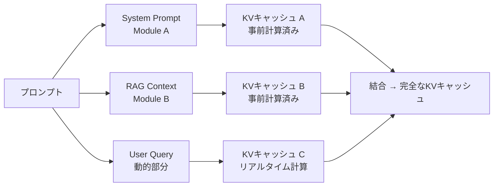

## 論文概要（Abstract）

Prompt Cacheは、LLMの推論リクエスト間でAttention States（KVキャッシュ）を再利用するための手法である。著者らは頻出するテキストセグメントを「Prompt Module」と定義し、そのKVキャッシュを事前計算してストレージに保存する。推論時にはキャッシュストレージからAttention Statesを取得し、新しいプロンプトのKVキャッシュを高速に構築する。位置エンコーディングの依存性を解決するために「Positional Invariance」という新しいスキーマを導入し、ALiBiおよびRoPE（LLaMAで使用）と互換性を持つ。GPT、OPT、LLaMAを含む複数のLLMで評価され、GPUベースの推論でTTFT（Time-To-First-Token）を平均8倍、CPUベースの推論で最大60倍削減すると報告されている。

この記事は [Zenn記事: Claude Sonnet 4.6の1Mコンテキストで構築するエージェント型RAGとレイテンシ最適化](https://zenn.dev/0h_n0/articles/47425e25dcdf30) の深掘りです。

## 情報源

- **arXiv ID**: 2311.04934
- **URL**: [https://arxiv.org/abs/2311.04934](https://arxiv.org/abs/2311.04934)
- **著者**: In Gim, Guojun Chen, Seung-seob Lee, Nikhil Sarda, Anurag Khandelwal, Lin Zhong
- **発表年**: 2023（MLSys 2024に採択）
- **分野**: cs.CL, cs.AI

## 背景と動機（Background & Motivation）

LLMの推論において、Prefillフェーズ（ユーザープロンプトのエンコーディングとKVキャッシュの構築）は計算オーバーヘッドの主要因である。特に以下のシナリオでは、複数のリクエスト間でプロンプトの一部が共有されるケースが頻出する。

- **システムプロンプト**: 同一のシステム指示が毎リクエストで繰り返される
- **RAGコンテキスト**: 同一ドキュメントチャンクが異なるユーザーの質問で再利用される
- **Few-shot例文**: 同じ例示テンプレートが複数リクエストで使われる

従来のLLM推論では、これらの共有セグメントのAttention Statesを毎回再計算していた。この冗長な計算を排除することが、Prompt Cacheの研究動機である。

既存のキャッシュ手法（vLLMのPrefix Caching等）はプレフィックスの連続的な一致に依存しており、プロンプト内の非連続的なテキストセグメントの再利用には対応できない。著者らはこの制約を克服し、モジュール型のキャッシュ再利用を実現するPrompt Cacheを提案している。

## 主要な貢献（Key Contributions）

- **Prompt Module概念の導入**: 頻出テキストセグメントをモジュールとして定義し、KVキャッシュの事前計算・再利用を可能にする
- **Positional Invarianceスキーマ**: 位置エンコーディングの依存性を解決し、事前計算時と異なる位置でもキャッシュを再利用可能にする新しい位置エンコーディング手法
- **幅広いモデル互換性**: ALiBiおよびRoPEの両方の位置エンコーディングに対応し、GPT、OPT、LLaMAの各モデルファミリで動作することを実証
- **大幅なレイテンシ削減**: GPUベースの推論でTTFTを平均8倍、CPUベースの推論で最大60倍削減

## 技術的詳細（Technical Details）

### Prefillフェーズの計算コスト

LLMの推論は2つのフェーズで構成される。

1. **Prefillフェーズ**: 入力プロンプト全体のAttention計算とKVキャッシュ構築
2. **Decodeフェーズ**: トークンを1つずつ生成

Prefillフェーズの計算量は入力トークン数$n$に対して$O(n^2 \cdot d)$（$d$はモデル次元数）であり、長いプロンプトほどTTFTが増大する。

Self-Attentionの計算は以下の通りである。

$$
\text{Attention}(Q, K, V) = \text{softmax}\left(\frac{QK^T}{\sqrt{d_k}}\right)V
$$

ここで、
- $Q \in \mathbb{R}^{n \times d_k}$: Query行列（各トークンの「問い合わせ」）
- $K \in \mathbb{R}^{n \times d_k}$: Key行列（各トークンの「索引」）
- $V \in \mathbb{R}^{n \times d_v}$: Value行列（各トークンの「値」）
- $d_k$: Key/Queryの次元数

KVキャッシュは、このPrefillで計算された$K$と$V$の値をレイヤーごとに保存したものである。Decodeフェーズでは新しいトークンのQueryに対して保存済みのK, Vを使ってAttentionを計算する。

### Prompt Module

著者らは、プロンプトを複数の再利用可能なテキストセグメント（Prompt Module）に分割する概念を導入している。



各Prompt Moduleは独立してKVキャッシュを事前計算でき、推論時には必要なモジュールのキャッシュを組み合わせてプロンプト全体のKVキャッシュを構築する。この「モジュール型」アプローチが、連続プレフィックスに限定される従来手法との根本的な差異である。

### Positional Invariance（位置不変性）

Transformerの位置エンコーディングは、キャッシュ再利用における最大の技術的課題である。KVキャッシュは特定の位置情報を含んで計算されるため、異なる位置で再利用すると不整合が生じる。

#### RoPEにおける課題

RoPE（Rotary Position Embedding）は、位置$m$でのQueryとKeyベクトルに回転行列を適用する。

$$
q_m = R_m q, \quad k_n = R_n k
$$

$$
R_m = \begin{pmatrix} \cos m\theta_1 & -\sin m\theta_1 \\ \sin m\theta_1 & \cos m\theta_1 \\ & & \ddots \\ & & & \cos m\theta_{d/2} & -\sin m\theta_{d/2} \\ & & & \sin m\theta_{d/2} & \cos m\theta_{d/2} \end{pmatrix}
$$

ここで $\theta_i = 10000^{-2i/d}$ であり、$m$は絶対位置を表す。

Attention Scoreは相対位置$(m-n)$に依存する。

$$
q_m^T k_n = q^T R_{m-n} k
$$

KVキャッシュには$k_n = R_n k$が保存されるため、位置$n$の情報がキャッシュに焼き込まれている。異なる位置$n'$で再利用するには、回転行列の補正が必要になる。

#### Positional Invarianceスキーマ

著者らのPositional Invarianceスキーマは、この問題をPrompt Module単位で解決する。各モジュール内では相対位置を保持しつつ、モジュール間の位置関係はキャッシュ結合時に調整する設計である。

概念的には以下のアプローチを取る。

1. **事前計算時**: 各Prompt Moduleを位置0から始まるとして独立にKVキャッシュを計算
2. **結合時**: 各モジュールのKVキャッシュに対して、最終的な配置位置に合わせたRoPE回転補正を適用

RoPEの場合、位置$p_{old}$で計算されたKeyを位置$p_{new}$で使うには以下の補正を適用する。

$$
k_{p_{new}} = R_{p_{new} - p_{old}} \cdot k_{p_{old}}
$$

この補正は回転行列の乗算のみで済むため、計算コストは$O(n \cdot d)$と非常に軽量である。Full Prefillの$O(n^2 \cdot d)$と比較して、キャッシュが大きいほど高速化の恩恵が大きい。

#### ALiBiにおける対応

ALiBi（Attention with Linear Biases）は、Attention Scoreに線形バイアスを加算する手法である。

$$
\text{Attention}(Q, K, V) = \text{softmax}\left(\frac{QK^T}{\sqrt{d_k}} + m \cdot [-(i-j)]_{i,j}\right)V
$$

ALiBiの場合、位置情報はQ/Kベクトル自体には埋め込まれず、Attention Score計算時に加算されるため、KVキャッシュ自体は位置に依存しない。著者らによると、ALiBiベースのモデルではPositional Invarianceの適用がRoPEより直接的に行えると報告されている。

### アルゴリズム

Prompt Cacheの推論時フローを擬似コードで示す。

```python
from dataclasses import dataclass

import torch


@dataclass
class PromptModule:
    """事前計算済みKVキャッシュを持つPrompt Module"""
    name: str
    tokens: list[int]
    kv_cache: tuple[torch.Tensor, torch.Tensor]  # (K, V) per layer
    original_positions: torch.Tensor  # 事前計算時の位置


def prompt_cache_inference(
    prompt: list[int],
    modules: list[PromptModule],
    model: "TransformerModel",
) -> torch.Tensor:
    """Prompt Cacheを使用した推論

    Args:
        prompt: 入力プロンプトのトークン列
        modules: 事前計算済みPrompt Moduleのリスト
        model: Transformerモデル

    Returns:
        生成されたトークンの確率分布
    """
    # Step 1: プロンプト内のモジュール一致を検出
    matched_modules, remaining_tokens = match_modules(prompt, modules)

    # Step 2: 一致モジュールのKVキャッシュを位置補正して結合
    combined_kv = []
    current_pos = 0
    for mod in matched_modules:
        corrected_kv = apply_position_correction(
            mod.kv_cache,
            old_positions=mod.original_positions,
            new_start_position=current_pos,
        )
        combined_kv.append(corrected_kv)
        current_pos += len(mod.tokens)

    # Step 3: 残りのトークンのみPrefill計算
    if remaining_tokens:
        new_kv = model.prefill(remaining_tokens, start_position=current_pos)
        combined_kv.append(new_kv)

    # Step 4: 結合されたKVキャッシュでDecode開始
    full_kv = concatenate_kv_caches(combined_kv)
    return model.decode(full_kv)


def apply_position_correction(
    kv_cache: tuple[torch.Tensor, torch.Tensor],
    old_positions: torch.Tensor,
    new_start_position: int,
) -> tuple[torch.Tensor, torch.Tensor]:
    """RoPE位置補正を適用

    Args:
        kv_cache: (K, V)テンソルのタプル
        old_positions: 事前計算時の位置
        new_start_position: 新しい配置開始位置

    Returns:
        位置補正されたKVキャッシュ
    """
    K, V = kv_cache
    seq_len = K.shape[1]
    new_positions = torch.arange(
        new_start_position,
        new_start_position + seq_len,
    )
    # RoPE回転補正: R(new - old) を適用
    position_diff = new_positions - old_positions
    K_corrected = apply_rope_rotation(K, position_diff)
    # Vは位置に依存しないため補正不要
    return K_corrected, V
```

## 実装のポイント（Implementation）

### キャッシュストレージの設計

Prompt Cacheの実装では、KVキャッシュのストレージ設計が重要である。

- **メモリ使用量**: 各Prompt Moduleのキャッシュサイズは$2 \times L \times n \times d$（$L$: レイヤー数、$n$: トークン数、$d$: モデル次元数、2はK/Vの2つ分）。例えばLLaMA-7Bの場合、1000トークンのモジュールで約250MBのキャッシュが必要
- **キャッシュ管理戦略**: LRU（Least Recently Used）またはLFU（Least Frequently Used）による自動退避。ホットなモジュール（システムプロンプト等）はピン留めしてメモリに常駐させる
- **階層ストレージ**: GPU VRAM → CPU RAM → SSDの3階層でキャッシュを管理し、アクセス頻度に応じて自動昇格/降格

### モジュール一致の検出

プロンプト内のテキストセグメントとキャッシュ済みモジュールの一致検出には、トークン列のハッシュマッチングが効率的である。正確なトークン列一致が必要であり、部分一致やファジーマッチングは位置情報の整合性を保てないため使用できない。

### Anthropicのプロンプトキャッシュとの関連

Zenn記事で活用されているAnthropicのプロンプトキャッシュは、本論文のPrompt Cache手法と技術的基盤を共有するアプローチである。

**共通点**:
- プロンプトの先頭部分（プレフィックス）のKVキャッシュを保存・再利用する基本原理
- Prefillフェーズの計算を削減してTTFTを短縮する目的

**差異**:
- Anthropicの実装はプレフィックス一致ベース（連続的な先頭部分の一致が必要）
- Prompt Cacheはモジュール型で非連続セグメントの再利用も可能
- Anthropicの実装はTTL（5分/1時間）によるキャッシュ寿命管理を採用

## 実験結果（Results）

著者らはGPT、OPT、LLaMAの各モデルファミリでPrompt Cacheを評価している。

**主要なベンチマーク結果**:

| 指標 | GPU推論 | CPU推論 |
|:--|:--|:--|
| TTFT削減倍率（平均） | 8x | 60x |

著者らによると、CPU推論での改善幅がGPU推論より大きい理由は、CPUではPrefillの計算コストがDecodeに比して相対的に大きいためである。GPUはPrefillの並列処理に優れるが、それでも8倍の削減は大幅な改善である。

**MLSys 2024での評価**: 本論文はMLSys 2024に採択されており、システムレベルの実装品質と実用性が査読で評価されている。

**高速化の前提条件**:
- キャッシュヒット率が高いほど効果が大きい（同一モジュールが繰り返し使用される場面）
- プロンプト中のキャッシュ対象割合が大きいほど効果的
- キャッシュの位置補正コストは$O(n \cdot d)$であり、Prefillの$O(n^2 \cdot d)$に比して十分に小さい

## 実運用への応用（Practical Applications）

### Zenn記事との関連

Zenn記事「Claude Sonnet 4.6の1Mコンテキストで構築するエージェント型RAGとレイテンシ最適化」で提案されているアーキテクチャにおいて、Prompt Cacheの技術は以下の場面で直接的に関連する。

1. **CAG（Context-Augmented Generation）のTTFT削減**: Zenn記事のCAGアプローチでは、ドキュメント全体をプロンプトに含める。Prompt Cacheの技術を適用すれば、ドキュメント部分のKVキャッシュを事前計算し、2回目以降のアクセスでPrefillをスキップできる

2. **プロンプトキャッシュのTTL設計**: Anthropicの5分/1時間キャッシュは、Prompt CacheのLRU/LFU管理戦略の商用実装と位置づけられる。Zenn記事で議論されている「ウォームアップリクエスト」による定期的なキャッシュ更新は、TTL切れ防止の実用的テクニックである

3. **RAGチャンクのキャッシュ**: 頻繁にヒットするドキュメントチャンクのKVキャッシュをPrompt Moduleとして事前計算することで、RAGパイプラインのレイテンシを削減できる

4. **ハイブリッドCAG/RAGルーティング**: キャッシュヒットが見込める場合はCAG（キャッシュ済みコンテキスト全体を使用）、そうでない場合はRAG（検索チャンクを使用）というルーティング判断において、Prompt Cacheの技術がCAG側のレイテンシ優位性を支える

### レイテンシ削減の実務的インパクト

著者らが報告したGPUでの8倍のTTFT削減は、1Mコンテキストを扱うZenn記事のアーキテクチャにおいて特に大きな意味を持つ。

- **1Mトークンの全文Prefill**: キャッシュなしでは数十秒のTTFTが発生しうる
- **キャッシュ適用後**: 初回は通常のPrefillが必要だが、2回目以降は8倍高速化。1Mコンテキストの場合、数秒レベルまで短縮される可能性がある
- **ストリーミング体験**: TTFTの大幅な短縮により、ユーザーが応答を待つ時間が激減し、体感レイテンシが改善される

### 関連手法との比較

| 手法 | アプローチ | 対象 | Prompt Cacheとの違い |
|:--|:--|:--|:--|
| PagedAttention (vLLM) | KVキャッシュの非連続メモリ管理 | 単一リクエスト内メモリ効率化 | Prompt Cacheはクロスリクエスト再利用に特化 |
| CacheGen | KVキャッシュの圧縮ビットストリーム化 | 転送・保存効率化 | 圧縮に特化。Prompt Cacheの位置不変性とは相補的 |
| Hydragen | 共有プレフィックスのAttention分解 | バッチ処理効率化 | 連続プレフィックス前提。Prompt Cacheはモジュール型 |
| RAGCache | RAG取得テキストのKVキャッシュ | RAGシナリオ特化 | Prompt Cacheの応用例。知識対応のキャッシュ管理を追加 |

## 関連研究（Related Work）

- **PagedAttention / vLLM (Kwon et al., 2023, arXiv:2309.06180)**: OSの仮想メモリとページング方式にインスパイアされたKVキャッシュ管理。メモリ効率の向上が目的で、キャッシュ再利用ではなくメモリ断片化の解消に焦点を当てている
- **CacheGen (Liu et al., 2023, arXiv:2312.07104)**: KVキャッシュをカスタムテンソルエンコーダで圧縮し、ストリーミング転送を可能にする手法。End-to-endで3.5-8倍の高速化を報告
- **PromptCache++ (Toshniwal et al., 2024, arXiv:2405.14564)**: Prompt Cacheを拡張し、より細粒度な分解プレフィックスキャッシュを実現した後継研究
- **CAG (2501.00353)**: KVキャッシュの事前計算でRAGの検索レイテンシを完全に排除するアプローチ。Prompt Cacheの思想をRAGアーキテクチャに直接適用した研究と位置づけられる

## まとめと今後の展望

Prompt Cacheは、LLM推論のPrefillフェーズにおける冗長な計算を排除し、TTFTをGPUで8倍・CPUで60倍削減する実用的な手法である。著者らの主要な技術的貢献は以下の2点に集約される。

1. **Prompt Module概念**: プロンプトを再利用可能なモジュールに分割し、非連続セグメントのKVキャッシュを独立に事前計算・再利用する
2. **Positional Invariance**: RoPEやALiBiの位置エンコーディングとの互換性を保ちながら、キャッシュを任意の位置で再利用可能にする

この技術は、Anthropicのプロンプトキャッシュ、vLLMのPrefix Caching、CAG（Context-Augmented Generation）など、現在のLLM推論最適化のエコシステムにおける基盤技術の一つとなっている。MLSys 2024での採択は、この技術のシステムレベルでの実用性を裏付けている。

今後の展望として、キャッシュヒット率の自動最適化、異なるモデル間でのキャッシュ共有、およびSpeculative Decodingとの組み合わせによるさらなるレイテンシ削減が期待される。

## 参考文献

- **arXiv**: [https://arxiv.org/abs/2311.04934](https://arxiv.org/abs/2311.04934)
- **Conference**: MLSys 2024
- **PagedAttention**: [https://arxiv.org/abs/2309.06180](https://arxiv.org/abs/2309.06180)
- **CacheGen**: [https://arxiv.org/abs/2312.07104](https://arxiv.org/abs/2312.07104)
- **Related Zenn article**: [https://zenn.dev/0h_n0/articles/47425e25dcdf30](https://zenn.dev/0h_n0/articles/47425e25dcdf30)
