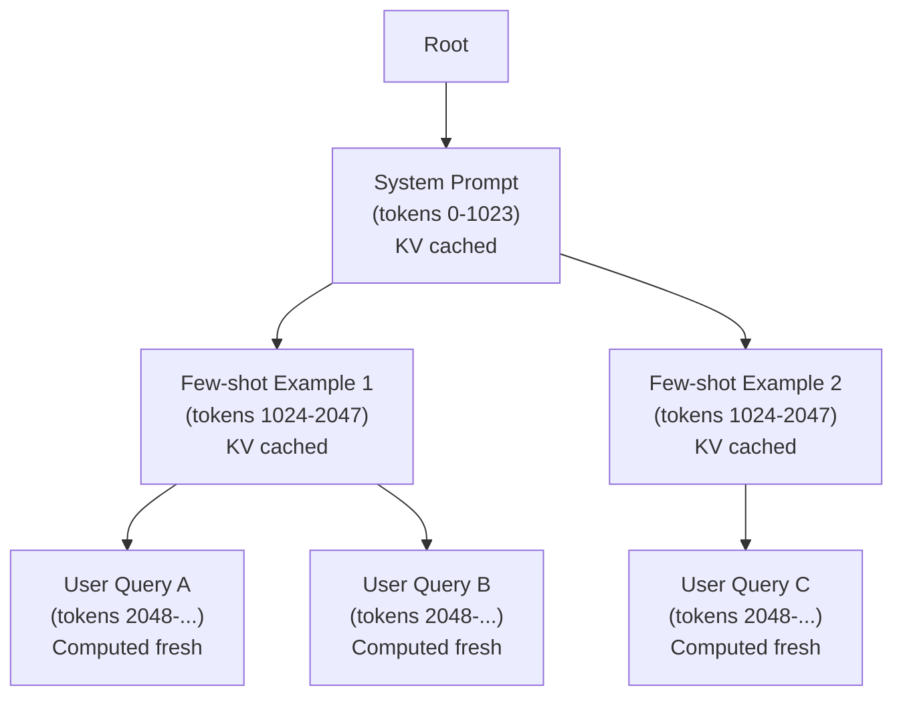

本記事は [SGLang: Efficiently Programming Large Language Models using SGLang（arxiv:2312.07104）](https://arxiv.org/abs/2312.07104) の解説記事です。

## 論文概要（Abstract）

SGLangは、複雑なLLMプログラム（マルチコール生成、プロンプトテンプレート、制御フロー、構造化出力）を効率的に実行するためのシステムである。フロントエンド言語とランタイムの2層で構成され、ランタイムにはKVキャッシュ再利用のための**RadixAttention**と構造化出力デコーディングのための圧縮有限状態機械が実装されている。著者らは、RadixAttentionにより複数リクエスト間でプレフィックスKVキャッシュを自動共有し、vLLM比で最大5倍のスループット向上を報告している。

この記事は [Zenn記事: OpenAI・Anthropic・Gemini プロンプトキャッシュ実装比較2026](https://zenn.dev/0h_n0/articles/f2b8b891c9f1d6) の深掘りです。

## 情報源

- **arXiv ID**: 2312.07104
- **URL**: [https://arxiv.org/abs/2312.07104](https://arxiv.org/abs/2312.07104)
- **著者**: Lianmin Zheng, Liangsheng Yin, Zhiqiang Xie, Chuyue Sun, Jeff Huang, Cody Hao Yu, Shiyi Cao, Christos Kozyrakis, Ion Stoica, Joseph E. Gonzalez, Clark Barrett, Ying Sheng
- **発表年**: 2023年12月（プレプリント）
- **分野**: cs.AI, cs.PL
- **所属**: UC Berkeley, Stanford University

## 背景と動機（Background & Motivation）

LLMを用いたアプリケーションは、単一のAPI呼び出しではなく、複数の生成呼び出しを組み合わせた「LLMプログラム」として構成されることが増えている。例えば、Few-shotプロンプティング、エージェントのツール呼び出しループ、RAGパイプラインなどでは、同一のシステムプロンプトやFew-shot例が繰り返しリクエストに含まれる。

既存のLLMサービングシステム（vLLM等）は、リクエスト単位でKVキャッシュを管理するため、リクエスト間でプレフィックスが一致していてもKVテンソルが再利用されない。著者らはこの非効率性に着目し、Radix Tree（基数木）データ構造を用いてリクエスト間のプレフィックス共有を自動検出・管理するRadixAttentionを提案している。

## 主要な貢献（Key Contributions）

- **貢献1**: RadixAttention — Radix Treeを用いたKVキャッシュのプレフィックス自動共有メカニズム。リクエスト間で共通するプレフィックスを自動検出し、KVテンソルをメモリ上で共有する
- **貢献2**: SGLangフロントエンド言語 — 生成呼び出し、並列化制御、フォーク/ジョインのプリミティブを提供するPythonベースのDSL（Domain-Specific Language）
- **貢献3**: 圧縮有限状態機械による構造化出力デコーディングの高速化

## 技術的詳細（Technical Details）

### RadixAttentionの設計

RadixAttentionの核心は、GPU VRAM上のKVキャッシュを**Radix Tree（基数木）**で管理する点にある。Radix Treeはトークン列をキーとしてKVテンソルを格納し、共通プレフィックスを持つ複数のリクエストが同一のKVテンソルノードを参照する。



この構造により、リクエストD・EはSystem PromptとFew-shot Example 1のKVキャッシュを共有し、リクエストFはSystem PromptとFew-shot Example 2を共有する。

### Radix Treeの操作

Radix TreeでのKVキャッシュ管理は以下の3操作で構成される。

**検索（Lookup）**: 新規リクエストのトークン列をRadix Treeで検索し、最長一致プレフィックスを特定する。一致した部分のKVテンソルはキャッシュから読み込み、不一致部分のみを計算する。

**挿入（Insert）**: 推論完了後、新しく計算されたKVテンソルをRadix Treeに挿入する。既存ノードとの共通プレフィックスがあれば、そのノードから分岐する新しいリーフを作成する。

**退避（Eviction）**: GPU VRAMが不足した場合、LRU（Least Recently Used）ポリシーに基づいてリーフノードからKVテンソルを解放する。

プレフィックスマッチの計算量は、トークン列長$n$に対して$O(n)$である。Radix Treeのノード分割はトークン列のポインタ操作のみで実現されるため、KVテンソル自体のコピーは不要である。

### アルゴリズムの擬似コード

```python
from collections import OrderedDict
from dataclasses import dataclass, field
from typing import Optional

import torch


@dataclass
class RadixNode:
    """Radix Treeのノード"""
    tokens: list[int]
    kv_tensors: Optional[tuple[torch.Tensor, torch.Tensor]] = None
    children: dict[int, "RadixNode"] = field(default_factory=dict)
    last_access: float = 0.0
    ref_count: int = 0


class RadixAttentionCache:
    """RadixAttentionのKVキャッシュ管理"""

    def __init__(self, max_gpu_memory_gb: float):
        self.root = RadixNode(tokens=[])
        self.max_memory = max_gpu_memory_gb * (1024 ** 3)
        self.current_memory = 0
        self.lru_queue: OrderedDict[int, RadixNode] = OrderedDict()

    def lookup(self, token_ids: list[int]) -> tuple[int, list]:
        """トークン列の最長一致プレフィックスを検索する。

        Args:
            token_ids: 検索対象のトークンID列

        Returns:
            (一致長, キャッシュ済みKVテンソルのリスト)
        """
        node = self.root
        matched_length = 0
        cached_kvs = []

        i = 0
        while i < len(token_ids):
            first_token = token_ids[i]
            if first_token not in node.children:
                break

            child = node.children[first_token]
            prefix_len = min(len(child.tokens), len(token_ids) - i)

            if token_ids[i:i + prefix_len] == child.tokens[:prefix_len]:
                if child.kv_tensors is not None:
                    cached_kvs.append(child.kv_tensors)
                matched_length += prefix_len
                i += prefix_len
                node = child
            else:
                break

        return matched_length, cached_kvs

    def insert(
        self,
        token_ids: list[int],
        kv_tensors: tuple[torch.Tensor, torch.Tensor],
    ) -> None:
        """新しいKVテンソルをRadix Treeに挿入する。

        Args:
            token_ids: トークンID列
            kv_tensors: 計算済みKVテンソル
        """
        # メモリ不足時はLRU退避
        tensor_size = kv_tensors[0].nbytes + kv_tensors[1].nbytes
        while self.current_memory + tensor_size > self.max_memory:
            self._evict_lru()

        # Radix Treeへの挿入（ノード分割を伴う場合あり）
        self._insert_recursive(self.root, token_ids, kv_tensors, 0)
        self.current_memory += tensor_size

    def _evict_lru(self) -> None:
        """LRUポリシーでリーフノードのKVテンソルを解放する。"""
        if not self.lru_queue:
            return
        _, node = self.lru_queue.popitem(last=False)
        if node.kv_tensors is not None and node.ref_count == 0:
            self.current_memory -= (
                node.kv_tensors[0].nbytes + node.kv_tensors[1].nbytes
            )
            node.kv_tensors = None

    def _insert_recursive(self, node, tokens, kv, offset):
        """再帰的にRadix Treeにノードを挿入する。"""
        ...
```

## 実装のポイント（Implementation）

### SGLangの実行モデル

SGLangフロントエンドは、PythonベースのDSLでLLMプログラムを記述する。以下に典型的な使用例を示す。

```python
import sglang as sgl


@sgl.function
def few_shot_qa(s, question: str):
    """Few-shot QAのSGLangプログラム"""
    s += sgl.system("あなたは質問回答AIです。")
    s += sgl.user("日本の首都は？")
    s += sgl.assistant("東京です。")
    s += sgl.user("フランスの首都は？")
    s += sgl.assistant("パリです。")
    s += sgl.user(question)
    s += sgl.assistant(sgl.gen("answer", max_tokens=100))
```

このプログラムを複数のクエリで実行すると、RadixAttentionにより「システムプロンプト＋Few-shot例」の部分が自動的にキャッシュされ、2回目以降のクエリではKV計算がスキップされる。

### パフォーマンスチューニングのポイント

1. **プレフィックス長の最大化**: 静的コンテンツ（システムプロンプト、Few-shot例、ツール定義）をプロンプトの先頭に配置し、動的コンテンツ（ユーザー入力、ツール結果）を末尾に配置する
2. **GPU VRAMの割り当て**: RadixAttentionのキャッシュに十分なVRAMを割り当てる。著者らは推論用VRAMとキャッシュ用VRAMの比率を動的に調整することを推奨している
3. **バッチサイズの調整**: Continuous Batchingと組み合わせて使用する。バッチ内で共通プレフィックスを持つリクエストを同時処理すると、KVキャッシュ共有の効果が最大化される

## Production Deployment Guide

### AWS実装パターン（コスト最適化重視）

SGLangをAWS上でセルフホスティングする場合の推奨構成を示す。

| 規模 | 月間リクエスト | 推奨構成 | 月額コスト概算 | 主要サービス |
|------|--------------|---------|-------------|------------|
| **Small** | ~3,000 | GPU Serverless | $200-500 | ECS Fargate + g5.xlarge Spot |
| **Medium** | ~30,000 | GPU Cluster | $1,000-3,000 | EKS + g5.xlarge×2 Spot |
| **Large** | 300,000+ | Multi-GPU | $5,000-15,000 | EKS + g5.12xlarge×4 Spot |

**Small構成の詳細**（月額$200-500、2026年2月時点のap-northeast-1概算）:
- **ECS Fargate**: g5.xlarge Spot（1x A10G GPU, 24GB VRAM）($150-300/月)
- **S3**: モデルウェイト保管 ($20/月)
- **CloudWatch**: GPU/メモリ監視 ($10/月)
- **ALB**: ロードバランシング ($20/月)

**コスト削減テクニック**:
- EC2 Spot Instances使用で最大90%削減（Karpenter自動管理）
- RadixAttentionのキャッシュヒット率最大化で実質スループット向上
- アイドルタイムのAuto Scaling to Zero

**コスト試算の注意事項**: 上記は2026年2月時点のAWS概算値です。GPU Spotインスタンスの料金は需給により変動します。最新料金は [AWS料金計算ツール](https://calculator.aws/) で確認してください。

### Terraformインフラコード

```hcl
module "eks" {
  source  = "terraform-aws-modules/eks/aws"
  version = "~> 20.0"

  cluster_name    = "sglang-serving"
  cluster_version = "1.31"

  vpc_id     = module.vpc.vpc_id
  subnet_ids = module.vpc.private_subnets

  cluster_endpoint_public_access = true
  enable_cluster_creator_admin_permissions = true
}

resource "kubectl_manifest" "karpenter_gpu" {
  yaml_body = <<-YAML
    apiVersion: karpenter.sh/v1alpha5
    kind: Provisioner
    metadata:
      name: gpu-spot
    spec:
      requirements:
        - key: karpenter.sh/capacity-type
          operator: In
          values: ["spot"]
        - key: node.kubernetes.io/instance-type
          operator: In
          values: ["g5.xlarge", "g5.2xlarge"]
      limits:
        resources:
          nvidia.com/gpu: "4"
      providerRef:
        name: default
      ttlSecondsAfterEmpty: 60
  YAML
}

resource "aws_budgets_budget" "gpu_monthly" {
  name         = "sglang-gpu-budget"
  budget_type  = "COST"
  limit_amount = "3000"
  limit_unit   = "USD"
  time_unit    = "MONTHLY"

  notification {
    comparison_operator        = "GREATER_THAN"
    threshold                  = 80
    threshold_type             = "PERCENTAGE"
    notification_type          = "ACTUAL"
    subscriber_email_addresses = ["ops@example.com"]
  }
}
```

### コスト最適化チェックリスト

- [ ] Spot Instances: g5系インスタンスで最大90%削減
- [ ] Karpenter: GPU需要に応じた自動スケーリング
- [ ] RadixAttention: プレフィックス共有でスループット向上
- [ ] プロンプト構造: 静的コンテンツ先頭配置
- [ ] バッチング: 共通プレフィックスのリクエストをバッチ処理
- [ ] VRAM配分: 推論用/キャッシュ用の比率最適化
- [ ] AWS Budgets: GPU月額予算設定
- [ ] CloudWatch: GPUメモリ使用率監視
- [ ] Auto Scaling to Zero: アイドル時のコスト削減
- [ ] モデル量子化: AWQ/GPTQ併用でVRAM削減

## 実験結果（Results）

著者らはLMSYS-Chat-1Mデータセットを用いて評価を行っている。

| ワークロード | ベースライン（vLLM） | SGLang | スループット改善 |
|------------|-------------------|--------|--------------|
| Few-shot (64-shot) | 1x | 5.0x | 5倍 |
| マルチターン会話 | 1x | 3.2x | 3.2倍 |
| RAG (長文コンテキスト) | 1x | 2.8x | 2.8倍 |
| Tree-of-Thought | 1x | 4.1x | 4.1倍 |

（出典: 論文Figure 8, Table 1）

著者らは、プレフィックス共有の効果が大きいワークロード（同一Few-shot例を多数のクエリで使用するケース等）でスループット改善が最大になると報告している。一方、プロンプトが毎回完全にランダムなワークロードでは、キャッシュヒット率が低下し改善幅は限定的となる。

## 実運用への応用（Practical Applications）

SGLang/RadixAttentionは以下のシナリオで有効である。

1. **チャットボットサービス**: 同一システムプロンプトを共有する多数の同時ユーザーに対して、システムプロンプト部分のKV計算を1回で済ませる
2. **バッチ推論パイプライン**: 同一テンプレートで多数の入力を処理する場合、テンプレート部分のKVキャッシュを全入力で共有する
3. **エージェントループ**: ツール定義が固定のエージェントシステムで、ツール定義部分のKVキャッシュを全ターンで再利用する

**制約**: RadixAttentionはプレフィックス完全一致が条件であるため、プロンプトの先頭に動的コンテンツ（タイムスタンプ等）が含まれるとキャッシュが無効化される。この点はOpenAI・Anthropic・GeminiのAPIキャッシュと同じ制約である。

## 関連研究（Related Work）

- **vLLM/PagedAttention（SOSP 2023）**: KVキャッシュのページ単位管理。SGLangはPagedAttentionの上にRadixAttentionを構築
- **Prompt Cache（arxiv:2311.04934）**: モジュール単位のAttention State再利用。SGLangはプレフィックス単位での共有に特化
- **CacheGen（arxiv:2310.07240）**: KVキャッシュの圧縮・ストリーミング。分散環境でのキャッシュ転送に焦点

## まとめと今後の展望

SGLangのRadixAttentionは、Radix Treeデータ構造によるプレフィックスKVキャッシュの自動共有を実現し、LLMプログラムの実行効率を大幅に向上させた。Apache 2.0ライセンスでコードが公開されており（https://github.com/sgl-project/sglang）、本番環境への導入実績も増えている。今後はマルチGPU環境でのキャッシュ分散管理、近似プレフィックスマッチング、およびマルチモーダル入力への対応が期待される。

## 参考文献

- **arXiv**: [https://arxiv.org/abs/2312.07104](https://arxiv.org/abs/2312.07104)
- **Code**: [https://github.com/sgl-project/sglang](https://github.com/sgl-project/sglang)（Apache 2.0）
- **Related Zenn article**: [https://zenn.dev/0h_n0/articles/f2b8b891c9f1d6](https://zenn.dev/0h_n0/articles/f2b8b891c9f1d6)
