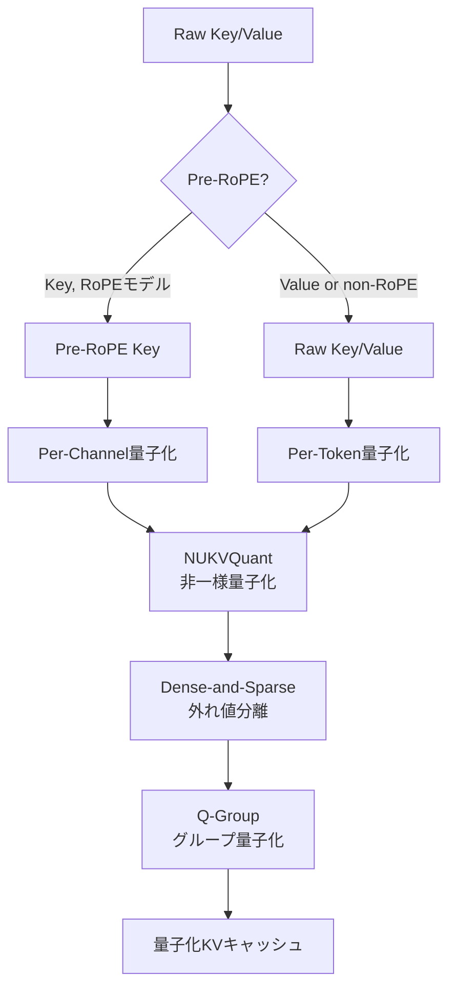

本記事は [arXiv:2401.18079](https://arxiv.org/abs/2401.18079) の解説記事です。

## 論文概要（Abstract）

LLMの長コンテキスト推論では、KVキャッシュのメモリ消費が主要なボトルネックとなる。著者らはKVキャッシュを低ビット数値形式に量子化する手法**KVQuant**を提案している。Per-Channel Key量子化、Pre-RoPE Key量子化、非一様量子化（NUKVQuant）、Dense-and-Sparse量子化、グループ量子化の5つの技術を組み合わせることで、4bitではFP16比で**0.1未満のperplexity劣化**、sub-2bitでは**A100 80GB単体でLLaMA-7Bの1000万トークンコンテキスト推論**を実現している（FP16比で**6.7倍**の改善）。

この記事は [Zenn記事: Ollama 0.17でオンプレLLM推論環境を構築する実践ガイド](https://zenn.dev/0h_n0/articles/96b758789bcc95) の深掘りです。Zenn記事ではOllama 0.17の`OLLAMA_KV_CACHE_TYPE=q8_0`（8bit KVキャッシュ量子化）が紹介されていますが、本記事ではKVキャッシュ量子化の学術的基盤となる手法を数式レベルで解説します。

## 情報源

- **会議名**: NeurIPS 2024
- **年**: 2024
- **URL**: [https://arxiv.org/abs/2401.18079](https://arxiv.org/abs/2401.18079)
- **著者**: Coleman Hooper, Sehoon Kim, Hasan Genc, et al.（UC Berkeley, Meta AI / FAIR, NYU）
- **コード**: [https://github.com/SqueezeAILab/KVQuant](https://github.com/SqueezeAILab/KVQuant)

## カンファレンス情報

**NeurIPSについて**: NeurIPSは機械学習分野の最高峰会議の1つであり、採択率は約25%程度である。KVキャッシュ量子化という実用的なシステム最適化テーマがNeurIPSに採択された点は、LLM推論効率化の学術的重要性を示している。

## 背景と動機（Background & Motivation）

### KVキャッシュのメモリボトルネック

LLMの自己回帰生成では、Attention計算に必要なKey・Valueベクトルをメモリに保持する（KVキャッシュ）。このメモリ消費はシーケンス長に線形に比例する：

$$
\text{Memory}_{\text{KV}} = 2 \times B \times S \times L \times H \times d \times \text{sizeof}(\text{dtype})
$$

ここで、
- $B$: バッチサイズ
- $S$: シーケンス長
- $L$: レイヤー数
- $H$: ヘッド数
- $d$: ヘッド次元数

LLaMA-7B（$L=32, H=32, d=128$）でFP16の場合、100万トークンのKVキャッシュだけで約32GBに達する。A100 80GBでモデル重みに14GBを使うと、残り66GBでは約150万トークンが上限となる。

### 既存手法の課題

著者らは既存のKVキャッシュ圧縮手法の限界を指摘している：

- **Sparse Attention（H2O, ScissorHands）**: トークンを間引くため情報が失われる
- **重み量子化（GPTQ, AWQ）**: モデル重みのみ対象でKVキャッシュには効果がない
- **既存KV量子化（KIVI）**: トークン次元での量子化が主流だが、Key活性化の統計的特性を十分に活用していない

## 主要な貢献（Key Contributions）

- **貢献1**: Key活性化のチャネル次元での量子化（Per-Channel Key Quantization）の提案
- **貢献2**: RoPE適用前のKey量子化（Pre-RoPE Key Quantization）によるチャネル分布の一貫性維持
- **貢献3**: レイヤー・ヘッドごとの非一様量子化（NUKVQuant）による分布適応
- **貢献4**: 外れ値を個別に処理するDense-and-Sparse量子化
- **貢献5**: 5技術の組み合わせによるsub-2bit KVキャッシュの実現

## 技術的詳細（Technical Details）

### 手法1: Per-Channel Key量子化

標準的なKVキャッシュ量子化は**トークン次元**（各トークンのKeyベクトル全体を1つのスケールで量子化）で行われる。しかし著者らは、Key活性化がチャネル間で大きく異なる分布を持つことを観察した。

一様量子化の基本式：

$$
x_q = \text{round}\left(\frac{x}{\text{scale}} + \text{zero\_point}\right), \quad \text{scale} = \frac{x_{\max} - x_{\min}}{2^b - 1}
$$

**Per-Channel量子化**では、ヘッド次元の各要素$d_i$に対して独立したスケール・ゼロポイントを持つ：

$$
\text{scale}_i = \frac{K_{:, i, \max} - K_{:, i, \min}}{2^b - 1}, \quad i = 1, \ldots, d
$$

これにより、チャネル間のスケール差が量子化誤差に及ぼす影響を大幅に低減できる。

### 手法2: Pre-RoPE Key量子化

LLaMAやMistralで使われるRotary Position Embedding（RoPE）は、Keyベクトルに位置情報を回転変換で埋め込む：

$$
\text{RoPE}(k, m)_i = k_i \cos(m \theta_i) - k_{i+d/2} \sin(m \theta_i)
$$

ここで$m$は位置、$\theta_i = 10000^{-2i/d}$である。

RoPE適用後のKeyベクトルは元の2チャネルの線形結合となるため、チャネルごとの分布の一貫性が崩れる。著者らはKVキャッシュに**RoPE適用前**のKeyを保存し、Attention計算時にデ量子化してからRoPEを適用する方式を提案している。

### 手法3: 非一様量子化（NUKVQuant）

一様量子化は等間隔にレベルを配置するが、KV活性化の分布はラプラス分布に近く、中心付近にデータが集中する。著者らはLloyd-Maxアルゴリズムで最適な量子化レベルを計算する：

$$
\{q_1^*, \ldots, q_{2^b}^*\} = \arg\min_{\{q_j\}} \sum_j \int_{d_{j-1}}^{d_j} (x - q_j)^2 \cdot p(x) \, dx
$$

ここで$p(x)$はラプラス分布$p(x) = \frac{1}{2b'} \exp\left(-\frac{|x - \mu|}{b'}\right)$、$b' = \sigma / \sqrt{2}$である。

各レイヤー・ヘッドの組み合わせに対してキャリブレーションデータ（C4データセット、512シーケンス）から最適コードブックを事前計算する。

### 手法4: Dense-and-Sparse量子化

KV活性化には、通常値の10-100倍の大きさを持つ外れ値（全体の0.5-1%）が存在する。これらは量子化スケールを大きくし、非外れ値の量子化精度を悪化させる。

著者らの手法：
1. 各ベクトル内で上位$k$%の大きさの値を「スパース外れ値」として分離
2. 外れ値はFP16でビットマップ＋値の形式で個別保存
3. 残りの「デンス値」をNUKVQuantまたは一様量子化で処理
4. デ量子化時に両者を合成

### 手法5: グループ量子化

ベクトル全体に1つのスケールではなく、グループサイズ$g$（推奨値: 64）ごとに独立した量子化パラメータを持つ。これにより局所的な分布差に対応できる。

### 5つの手法の統合



## 実験結果（Results）

### Perplexity評価（WikiText-2）

著者らはLLaMA-7Bでの各手法の累積効果を報告している（論文Table 5, ablation study）：

| 構成 | Perplexity（3bit） |
|------|-------------------|
| FP16ベースライン | 5.68 |
| トークン方向量子化（ベースライン） | 6.12 |
| + Per-Channel量子化 | 5.95 |
| + Pre-RoPE量子化 | 5.91 |
| + NUKVQuant | 5.82 |
| + Dense-and-Sparse | 5.78 |
| + Q-groups (g=64) | 5.74 |
| Full KVQuant | 5.71 |

各技術が段階的にperplexityを改善しており、最大の改善はPer-Channel量子化（0.17ポイント削減）によるものである。

### モデルサイズ別の結果

論文Table 1-3より：

| モデル | FP16 | KVQuant 4bit | KVQuant 3bit |
|--------|------|-------------|-------------|
| LLaMA-7B | 5.68 | 5.70 (+0.02) | 5.89 (+0.21) |
| LLaMA-13B | 5.09 | 5.11 (+0.02) | -- |
| LLaMA-70B | 3.30 | 3.32 (+0.02) | 3.38 (+0.08) |
| LLaMA-2-7B | 6.97 | 7.02 (+0.05) | 7.22 (+0.25) |
| LLaMA-2-70B | 3.31 | 3.33 (+0.02) | 3.39 (+0.08) |

4bit量子化では全モデルで**0.1未満のperplexity劣化**を達成している。

### 下流タスク精度（LLaMA-2-7B）

論文Table 4より：

| 手法 | Bits | MMLU | HellaSwag | ARC-C | 平均 |
|------|------|------|-----------|-------|------|
| FP16 | 16 | 45.3% | 57.8% | 43.1% | 48.7% |
| KVQuant | 4 | 45.1% | 57.6% | 43.0% | 48.6% |
| KVQuant | 3 | 44.8% | 57.1% | 42.7% | 48.2% |
| KVQuant | ~2 | 43.2% | 55.9% | 41.8% | 47.0% |

4bitでは1%未満の精度低下に留まっている。

### コンテキスト長の拡張

論文Table 6より、A100 80GBでのLLaMA-7B最大コンテキスト長：

| 量子化 | 実効ビット数 | 最大コンテキスト長 |
|--------|------------|------------------|
| FP16 | 16 | 約150万トークン |
| 4bit uniform | 4 | 約600万トークン |
| 3bit KVQuant | 3 | 約800万トークン |
| Sub-2bit KVQuant | ~1.8 | **約1000万トークン** |

### KIVIとの比較

著者らは同時期のKV量子化手法KIVIとの比較も行っている：

| 手法 | 4bit ppl (LLaMA-7B) | 3bit ppl | 2bit対応 |
|------|---------------------|----------|---------|
| KIVI | 5.74 | 6.12 | 非対応 |
| KVQuant | **5.70** | **5.89** | **対応（6.45）** |

### デコード速度

論文Table 7より、長コンテキストでのデコード速度（LLaMA-7B, A100）：

| 手法 | 1Kコンテキスト | 10Kコンテキスト | 100Kコンテキスト |
|------|--------------|---------------|----------------|
| FP16 | 45.2 tok/s | 22.1 tok/s | 3.8 tok/s |
| KVQuant 4bit | 48.7 tok/s | 27.3 tok/s | 6.2 tok/s |

長コンテキストではメモリ帯域の削減効果により**1.5-1.8倍**のスループット向上を達成している。

## 実装のポイント（Implementation）

### CUDAカーネルの設計

KVQuantの実装はFlashAttention-2と統合されている：

1. 量子化されたKVをHBM（High Bandwidth Memory）に保存
2. Attention計算時にSRAM（on-chip高速メモリ）にロードし、デ量子化を実行
3. FP16に戻してからAttention計算を実行
4. FP16のKVテンソルをメモリ上に展開しないため、メモリ節約効果が維持される

```python
# 概念的な推論フロー
def kvquant_attention(
    query: torch.Tensor,      # [batch, heads, 1, head_dim] (current token)
    kv_cache_quantized: QuantizedKVCache,  # 量子化済みKVキャッシュ
    codebooks: dict,          # layer/head別の非一様量子化コードブック
    sparse_outliers: SparseStore,  # FP16外れ値
) -> torch.Tensor:
    """KVQuant + FlashAttentionによるAttention計算"""
    # 1. 量子化KVをSRAMにブロック単位でロード
    # 2. コードブック参照でデ量子化
    # 3. 外れ値をスパース形式から復元して加算
    # 4. RoPEモデルの場合、Pre-RoPE KeyにRoPEを適用
    # 5. 標準Attention計算を実行
    pass
```

### Ollamaの`q8_0`との関係

Zenn記事で紹介されているOllama 0.17の`OLLAMA_KV_CACHE_TYPE=q8_0`は、llama.cppの8bitチャネル量子化に対応する。KVQuantの研究成果はこうした実用的な実装の学術的基盤を提供している：

| 項目 | Ollama q8_0 | KVQuant 4bit | KVQuant sub-2bit |
|------|------------|-------------|-----------------|
| ビット数 | 8 | 4 | ~1.8 |
| メモリ削減 | 約50% | 約75% | 約89% |
| 品質劣化 | 軽微 | <0.1 ppl | <1.0 ppl |
| 実装難易度 | 低（環境変数1つ） | 中（カスタムカーネル） | 高 |

## 関連研究（Related Work）

- **KIVI (2402.02750)**: Per-Channel Key + Per-Token Valueの量子化。KVQuantの直接的な比較対象
- **H2O (Heavy Hitter Oracle)**: Attention scoreベースのトークン間引き。情報が失われる近似手法
- **GPTQ / AWQ**: 重み量子化手法。KVキャッシュには適用されないが、重み量子化と組み合わせることで総メモリ削減が可能
- **FlashAttention-2**: IO-Aware Attentionカーネル。KVQuantはFlashAttention-2と統合して動作する

## 実運用への応用（Practical Applications）

### Ollamaユーザーへの示唆

Zenn記事のVRAM要件表と対応させると、KVキャッシュ量子化の実用的効果は以下の通りである：

| GPU | VRAM | FP16コンテキスト長 | q8_0コンテキスト長 | 4bit（KVQuant相当） |
|-----|------|-------------------|-------------------|-------------------|
| RTX 4060 Ti | 16GB | ~8K | ~16K | ~32K |
| RTX 4090 | 24GB | ~16K | ~32K | ~64K |
| A100 | 80GB | ~150万 | ~300万 | ~600万 |

Ollama 0.17の`OLLAMA_KV_CACHE_TYPE=q8_0`は最も手軽な第一歩であり、さらなるメモリ削減が必要な場合はvLLMのFP8 KVキャッシュや、将来的にはKVQuant相当の4bit量子化が選択肢となる。

## まとめと今後の展望

KVQuantは5つの量子化技術を体系的に組み合わせることで、4bitでは0.1未満のperplexity劣化、sub-2bitでは1000万トークンコンテキストという成果を報告している。Ollama 0.17の`q8_0`オプションはこの研究分野の実用的な成果の1つであり、今後のllama.cppやvLLMへの低ビット量子化統合により、オンプレ環境でのコンテキスト長がさらに拡張されることが期待される。

## 参考文献

- **arXiv**: [https://arxiv.org/abs/2401.18079](https://arxiv.org/abs/2401.18079)
- **Code**: [https://github.com/SqueezeAILab/KVQuant](https://github.com/SqueezeAILab/KVQuant)
- **Related Zenn article**: [https://zenn.dev/0h_n0/articles/96b758789bcc95](https://zenn.dev/0h_n0/articles/96b758789bcc95)
- KIVI: Liu et al., "KIVI: A Tuning-Free Asymmetric 2bit Quantization for KV Cache," arXiv:2402.02750
- FlashAttention-2: Dao, "FlashAttention-2: Faster Attention with Better Parallelism and Work Partitioning," 2023

---

:::message
本記事は [arXiv:2401.18079](https://arxiv.org/abs/2401.18079) の引用・解説記事であり、筆者自身が実験を行ったものではありません。数値・ベンチマーク結果はすべて原論文からの引用です。
:::
