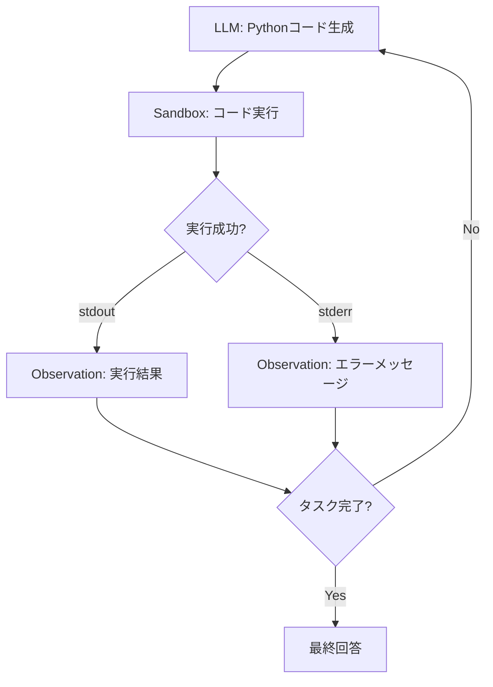
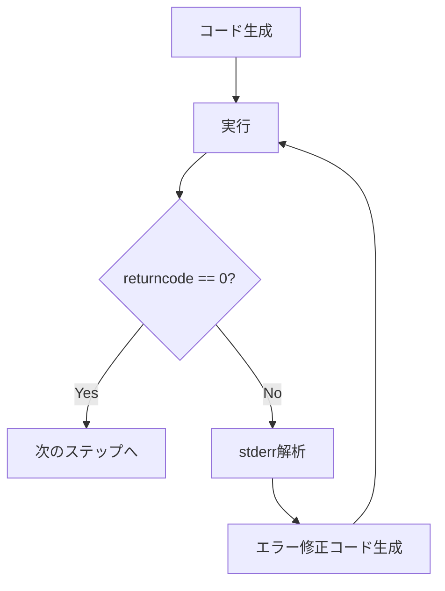

本記事は [Executable Code Actions Elicit Better LLM Agents](https://arxiv.org/abs/2402.01817)（Wang et al., 2024）の解説記事です。

## 論文概要（Abstract）

CodeAct は、LLMエージェントの行動空間（Action Space）を「実行可能なPythonコード」に統一するフレームワークである。従来のJSONベースやテキストベースのアクション定義では、複数ツールの組み合わせや中間データ処理が困難であったが、CodeActではPythonの表現力を活かして1回のアクションで複雑な処理を記述できる。著者らは、M3ToolEval（マルチツール評価）でJSONアクション比+20%の成功率向上を報告している。本フレームワークはOpenHands（旧OpenDevin）プロジェクトに統合されている。

この記事は [Zenn記事: ReAct+CoT推論の5大実装パターン：Reflexion・LATS・ReWOOをLangGraphで構築する](https://zenn.dev/0h_n0/articles/7a4b0b4ff37caa) の深掘りです。

## 情報源

- **arXiv ID**: 2402.01817
- **URL**: [https://arxiv.org/abs/2402.01817](https://arxiv.org/abs/2402.01817)
- **著者**: Xingyao Wang, Yangyi Chen, Lifan Yuan, Yizhe Zhang, Yunzhu Li, Hao Peng, Heng Ji（University of Illinois at Urbana-Champaign, Microsoft Research）
- **発表年**: 2024
- **分野**: cs.CL, cs.AI, cs.SE
- **コードリポジトリ**: [https://github.com/All-Hands-AI/OpenHands](https://github.com/All-Hands-AI/OpenHands)（Apache 2.0ライセンス）

## 背景と動機（Background & Motivation）

LLMエージェントの行動空間は通常、以下のいずれかの形式で定義される。

1. **JSONアクション**: `{"tool": "search", "args": {"query": "..."}}`
2. **テキストアクション**: `Action: search("...")`
3. **プラグイン呼び出し**: OpenAI Function Calling形式

著者らはこれらのアプローチに共通する制約を指摘している（論文Section 1）。

- **単一ツール制約**: 1回のアクションで1つのツールしか呼び出せない。複数ツールの結果を組み合わせるには複数ステップが必要
- **中間処理の欠如**: ツール出力のフィルタリング、変換、集計などの中間処理をアクション内で行えない
- **変数管理の不在**: 前のステップの結果を変数として保持し、後続ステップで再利用する機構がない

CodeActは「Pythonコードそのものをアクションとする」ことで、これらの制約を解消する。Pythonの制御構造（for, if, try-except）、データ操作（pandas, json）、関数定義を活用し、1回のアクションで複雑な処理を実現する。

## 主要な貢献（Key Contributions）

- **コードアクション空間の定式化**: エージェントの行動を実行可能なPythonコードとして統一し、ツール呼び出し・データ処理・状態管理を1つの表現形式で実現
- **CodeActAgent**: Jupyterライクなインタプリタ上でPythonコードを実行し、stdout/stderrをObservationとして返すエージェント実装
- **マルチツール評価**: 既存のシングルツール評価に加え、M3ToolEval（Multi-tool, Multi-step）ベンチマークで複合タスクの評価を実施
- **OpenHandsへの統合**: オープンソースのAIソフトウェアエンジニアリングプラットフォームに統合し、SWE-benchなどの実世界タスクでも適用可能であることを実証

## 技術的詳細（Technical Details）

### 行動空間の比較

論文Section 2より、JSONアクションとCodeActの表現力の違いを以下に示す。

**JSONアクション**（3ステップ必要）:
```json
Step 1: {"tool": "search", "args": {"query": "population of Tokyo"}}
Step 2: {"tool": "search", "args": {"query": "population of New York"}}
Step 3: {"tool": "calculate", "args": {"expr": "13960000 - 8336817"}}
```

**CodeAct**（1ステップで完結）:
```python
tokyo = search("population of Tokyo")
ny = search("population of New York")
diff = int(tokyo.split()[0]) - int(ny.split()[0])
print(f"差: {diff:,}人")
```

CodeActでは変数 `tokyo`, `ny` がインタプリタのセッション内で保持され、後続のアクションでも再利用可能である。

### アーキテクチャ



### 形式化

論文Section 3より、CodeActの行動生成プロセスを以下のように形式化する。

ステップ $t$ でのエージェントの行動（Pythonコード）$c_t$ は以下で生成される。

$$
c_t = \text{LLM}(\text{task}, h_{t-1}, \mathcal{T})
$$

ここで、
- $h_{t-1} = \{(c_1, o_1), (c_2, o_2), ..., (c_{t-1}, o_{t-1})\}$: 過去のコード-実行結果ペアの履歴
- $\mathcal{T}$: 利用可能なツール関数の定義（Pythonの関数シグネチャ）
- $o_t = \text{exec}(c_t)$: サンドボックスでのコード実行結果（stdout + stderr）

### サンドボックス実行環境

著者らは安全なコード実行のためにDockerコンテナベースのサンドボックスを使用している。

```python
import subprocess
import tempfile

def execute_in_sandbox(
    code: str,
    timeout: int = 30,
    working_dir: str = "/tmp/sandbox",
) -> tuple[str, str, int]:
    """サンドボックスでPythonコードを実行

    Args:
        code: 実行するPythonコード
        timeout: タイムアウト（秒）
        working_dir: 作業ディレクトリ

    Returns:
        (stdout, stderr, return_code) のタプル
    """
    with tempfile.NamedTemporaryFile(
        mode="w", suffix=".py", dir=working_dir, delete=False
    ) as f:
        f.write(code)
        f.flush()

        try:
            result = subprocess.run(
                ["python", f.name],
                capture_output=True,
                text=True,
                timeout=timeout,
                cwd=working_dir,
            )
            return result.stdout, result.stderr, result.returncode
        except subprocess.TimeoutExpired:
            return "", "TimeoutError: 実行時間が制限を超過", 1
```

### IPythonベースの状態保持

CodeActの重要な特徴は、Jupyter NotebookのようなIPythonセッションを維持し、変数やimportした状態を次のアクションに引き継ぐことである。

```python
class CodeActSession:
    """IPythonベースのステートフルコード実行セッション

    変数、import、関数定義がセッション内で永続化される
    """
    def __init__(self):
        self.namespace: dict = {}
        self.history: list[tuple[str, str]] = []

    def execute(self, code: str) -> str:
        """コードを実行し、結果をObservationとして返す"""
        import io
        from contextlib import redirect_stdout, redirect_stderr

        stdout_buf = io.StringIO()
        stderr_buf = io.StringIO()

        try:
            with redirect_stdout(stdout_buf), redirect_stderr(stderr_buf):
                exec(code, self.namespace)
            output = stdout_buf.getvalue()
        except Exception as e:
            output = f"Error: {type(e).__name__}: {e}"

        self.history.append((code, output))
        return output
```

### エラーからの自動回復

CodeActはReflexionの自己修正と類似した機構を持つが、エラーメッセージという客観的なフィードバックに基づく点が異なる。



著者らは、Pythonのトレースバック情報が具体的で構造化されているため、LLMがエラー原因を正確に特定しやすいと分析している（論文Section 4.2）。

## 実験結果（Results）

### M3ToolEval（マルチツール評価）

論文Table 1より、M3ToolEvalにおける成功率を以下に示す。

| 手法 | GPT-3.5 成功率 (%) | GPT-4 成功率 (%) |
|------|-------------------|-----------------|
| JSON Action | 45.2 | 62.3 |
| Text Action (ReAct) | 47.8 | 65.1 |
| **CodeAct** | **58.4** | **82.7** |

著者らは、CodeActがGPT-4でJSONアクション比+20.4ポイント、ReAct比+17.6ポイントの改善を達成したと報告している。特にマルチツール・マルチステップのタスクで差が顕著である。

### アクション数の削減

論文Table 2より、タスク完了に必要なアクション数の比較を以下に示す。

| 手法 | 平均アクション数 | 成功時の平均アクション数 |
|------|----------------|---------------------|
| JSON Action | 5.8 | 4.2 |
| Text Action | 5.2 | 3.8 |
| **CodeAct** | **3.1** | **2.4** |

CodeActは1回のアクションで複数のツール呼び出しとデータ処理を行えるため、タスク完了に必要なアクション数が約40%削減されている。

### SWE-bench（ソフトウェアエンジニアリング）

論文Section 5.3より、SWE-benchでの評価結果を以下に示す。

| 手法 | Resolved (%) |
|------|-------------|
| RAG + JSON Action | 8.2 |
| ReAct (Text) | 10.5 |
| **CodeAct (OpenHands)** | **15.3** |

著者らは、CodeActがファイル操作・テスト実行・デバッグをコードで直接行えるため、SWE-benchのような実世界のソフトウェアエンジニアリングタスクでも有効であると報告している。

### エラー回復の分析

論文Figure 5より、エラー発生後の回復率を以下に示す。

| 手法 | エラー後回復率 (%) |
|------|-----------------|
| JSON Action | 12.3 |
| Text Action | 18.7 |
| **CodeAct** | **45.2** |

CodeActはPythonのトレースバックという構造化されたエラー情報を活用できるため、他の手法と比較して回復率が高いと報告されている。

## 実装のポイント（Implementation）

### サンドボックスの選択

CodeActで生成されたコードを安全に実行するためのサンドボックス選択が重要である。

| サンドボックス | 隔離レベル | レイテンシ | 適用場面 |
|--------------|----------|----------|---------|
| Docker | 高 | 中（~100ms） | 本番環境 |
| gVisor | 高 | 低（~50ms） | 高セキュリティ要件 |
| Firecracker | 高 | 低（~30ms） | AWS Lambda互換 |
| subprocess | 低 | 極低（~5ms） | 開発・テスト環境のみ |

著者らは本番環境ではDocker + ネットワーク隔離を推奨している。

### ツール関数の設計

ツールはPython関数として定義し、LLMが利用しやすいよう型ヒントとDocstringを必ず付与する。

```python
def search_web(query: str, max_results: int = 5) -> list[dict[str, str]]:
    """Web検索を実行して結果を返す

    Args:
        query: 検索クエリ文字列
        max_results: 返す結果の最大数

    Returns:
        [{"title": "...", "url": "...", "snippet": "..."}] 形式のリスト
    """
    ...

def read_file(path: str, encoding: str = "utf-8") -> str:
    """ファイルの内容を読み取る

    Args:
        path: ファイルパス
        encoding: 文字エンコーディング

    Returns:
        ファイルの内容文字列
    """
    ...
```

### セキュリティ上の注意

- **ネットワークアクセス制限**: サンドボックスからの外部通信は許可リスト方式で制御する
- **ファイルシステム制限**: 書き込み可能なディレクトリを `/tmp/sandbox` のみに制限する
- **リソース制限**: CPU時間（30秒）、メモリ（512MB）、ディスク（100MB）の上限を設定する
- **コードスキャン**: `os.system`, `subprocess.call`, `eval` などの危険な関数呼び出しをブロックする

## Production Deployment Guide

### AWS実装パターン（コスト最適化重視）

CodeActはサンドボックス環境の運用コストが追加で発生するが、アクション数の削減によりLLM呼び出しコストは抑えられる。

| 規模 | 月間リクエスト | 推奨構成 | 月額コスト | 主要サービス |
|------|--------------|---------|-----------|------------|
| **Small** | ~3,000 (100/日) | Serverless | $80-200 | Lambda + Bedrock + EFS |
| **Medium** | ~30,000 (1,000/日) | Hybrid | $400-1,000 | ECS Fargate + Bedrock + EFS |
| **Large** | 300,000+ (10,000/日) | Container | $2,000-5,000 | EKS + Firecracker + Spot |

**Small構成の詳細**（月額$80-200）:
- **Lambda**: コード実行（Lambdaコンテナイメージ使用）（$30/月）
- **Bedrock**: Claude Sonnet（コード生成）、Prompt Caching有効（$120/月）
- **EFS**: セッション状態の永続化（$10/月）
- **ECR**: サンドボックスコンテナイメージ管理（$5/月）

**コスト削減テクニック**:
- アクション数がJSON/Text比で40%削減されるため、LLM呼び出しコストが相対的に低い
- Lambda Layerでよく使うPythonパッケージをプリインストールし、コールドスタートを短縮
- セッション状態をEFSに保存し、同一ユーザーの連続リクエストで変数を再利用

**コスト試算の注意事項**: 上記は2026年2月時点のAWS ap-northeast-1（東京）リージョン料金に基づく概算値です。サンドボックス実行のオーバーヘッドとLLM呼び出し削減のバランスが実コストを決定します。最新料金は [AWS料金計算ツール](https://calculator.aws/) で確認してください。

### Terraformインフラコード

**Small構成: Lambda Container + EFS**

```hcl
# --- ECR（サンドボックスイメージ） ---
resource "aws_ecr_repository" "codeact_sandbox" {
  name                 = "codeact-sandbox"
  image_tag_mutability = "IMMUTABLE"
  image_scanning_configuration {
    scan_on_push = true
  }
}

# --- Lambda（コンテナイメージ実行） ---
resource "aws_lambda_function" "codeact_executor" {
  function_name = "codeact-executor"
  role          = aws_iam_role.codeact_lambda.arn
  package_type  = "Image"
  image_uri     = "${aws_ecr_repository.codeact_sandbox.repository_url}:latest"
  timeout       = 60
  memory_size   = 1024

  file_system_config {
    arn              = aws_efs_access_point.codeact.arn
    local_mount_path = "/mnt/session"
  }

  environment {
    variables = {
      MODEL_ID       = "anthropic.claude-3-5-sonnet-20241022-v2:0"
      SANDBOX_DIR    = "/tmp/sandbox"
      SESSION_DIR    = "/mnt/session"
      MAX_EXEC_TIME  = "30"
      MAX_MEMORY_MB  = "512"
    }
  }

  vpc_config {
    subnet_ids         = var.private_subnet_ids
    security_group_ids = [aws_security_group.codeact.id]
  }
}

# --- EFS（セッション永続化） ---
resource "aws_efs_file_system" "codeact" {
  creation_token = "codeact-sessions"
  encrypted      = true
}

resource "aws_efs_access_point" "codeact" {
  file_system_id = aws_efs_file_system.codeact.id
  posix_user {
    uid = 1000
    gid = 1000
  }
  root_directory {
    path = "/sessions"
    creation_info {
      owner_uid   = 1000
      owner_gid   = 1000
      permissions = "755"
    }
  }
}

# --- Security Group ---
resource "aws_security_group" "codeact" {
  name   = "codeact-sandbox-sg"
  vpc_id = var.vpc_id

  egress {
    from_port   = 443
    to_port     = 443
    protocol    = "tcp"
    cidr_blocks = ["0.0.0.0/0"]
    description = "HTTPS outbound only"
  }
}
```

### セキュリティベストプラクティス

- **コンテナイメージスキャン**: ECRのイメージスキャンを有効化し、脆弱性を検出
- **ネットワーク隔離**: Security Groupで443ポート（HTTPS）のみ許可、他のアウトバウンド通信をブロック
- **ファイルシステム隔離**: EFSアクセスポイントでユーザーごとのディレクトリを分離
- **実行時間制限**: Lambda + サンドボックスの二重タイムアウトで無限ループを防止

### コスト最適化チェックリスト

- [ ] Lambdaコンテナイメージにツールパッケージをプリインストールしているか
- [ ] EFSのバーストクレジットを監視しているか
- [ ] セッションTTLを設定してEFSの肥大化を防いでいるか
- [ ] ECRイメージのライフサイクルポリシーで古いイメージを削除しているか
- [ ] Prompt Cachingでコード生成プロンプトのコストを削減しているか
- [ ] AWS Budgetsで月額予算アラートを設定しているか

## 実運用への応用（Practical Applications）

CodeActは以下のユースケースで特に有効である。

- **データ分析エージェント**: pandasやmatplotlibを使ったデータ処理・可視化をコードで直接実行。中間結果の変数保持により、対話的な分析が可能
- **ソフトウェアエンジニアリング**: ファイル操作、テスト実行、デバッグをコードで行うSWE-agent。OpenHandsプラットフォームとして実用化されている
- **数値計算**: numpy/scipyを使った科学計算。JSONアクションでは表現困難な行列演算やシミュレーションが可能

ただし、セキュリティリスクの管理が不可欠であり、サンドボックス環境の構築・運用コストが追加で発生する点に注意が必要である。

## 関連研究（Related Work）

- **ReAct**（Yao et al., 2022, [arXiv:2210.03629](https://arxiv.org/abs/2210.03629)）: テキストベースのThought-Action-Observationループ。CodeActはReActの行動空間をPythonコードに拡張した位置づけ
- **Toolformer**（Schick et al., 2023, [arXiv:2302.04761](https://arxiv.org/abs/2302.04761)）: LLMが自律的にツール使用を学習する手法。CodeActとは異なり事前のファインチューニングが必要
- **Program-aided Language Models（PAL）**（Gao et al., 2023, [arXiv:2211.10435](https://arxiv.org/abs/2211.10435)）: 推論をプログラムに委譲する手法。CodeActとの違いは、PALが推論のみにコードを使うのに対し、CodeActはエージェントの行動全体をコードで統一する点
- **SWE-agent**（Yang et al., 2024, [arXiv:2402.09171](https://arxiv.org/abs/2402.09171)）: Agent-Computer Interface（ACI）を定義してソフトウェアエンジニアリングタスクを解くエージェント。CodeActのOpenHands実装はSWE-agentと同じ問題領域で競合・補完関係にある

## まとめと今後の展望

CodeActは「Pythonコードをエージェントの行動空間とする」というシンプルな設計で、JSONアクション比+20%の成功率向上とアクション数40%削減を達成した。Pythonのエラーメッセージによる客観的フィードバックがReflexionの言語的反省と類似した自己修正効果を生んでいる。OpenHandsプラットフォームへの統合により、SWE-benchなどの実世界タスクでも適用可能であることが実証されている。

今後の研究方向として、コード生成の安全性保証（形式検証の統合）、マルチ言語対応（Python以外の言語サポート）、長期セッションでの状態管理最適化などが期待される。

## 参考文献

- **arXiv**: [https://arxiv.org/abs/2402.01817](https://arxiv.org/abs/2402.01817)
- **Code**: [https://github.com/All-Hands-AI/OpenHands](https://github.com/All-Hands-AI/OpenHands)
- **Related Zenn article**: [https://zenn.dev/0h_n0/articles/7a4b0b4ff37caa](https://zenn.dev/0h_n0/articles/7a4b0b4ff37caa)
