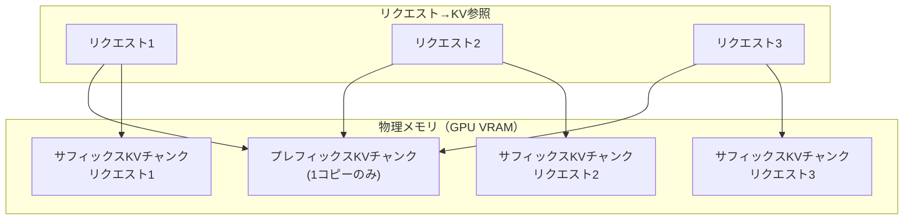

本記事は [ChunkAttention: Efficient Self-Attention with Prefix-Aware KV Cache and Two-Phase Partition（arxiv:2402.15220）](https://arxiv.org/abs/2402.15220) の解説記事です。

## 論文概要（Abstract）

ChunkAttentionは、LLMサービングにおいて複数リクエストが共通のシステムプロンプト（プレフィックス）を持つ場合に、そのプレフィックス部分のKVテンソルをメモリ上で物理的に共有し、2フェーズ分割アルゴリズムでAttention計算を高速化する手法である。著者らは、プレフィックス長1024〜4096トークンの設定で、既存実装（FlashAttention等）に対して3.2〜4.8倍のスピードアップを報告している。

この記事は [Zenn記事: OpenAI・Anthropic・Gemini プロンプトキャッシュ実装比較2026](https://zenn.dev/0h_n0/articles/f2b8b891c9f1d6) の深掘りです。

## 情報源

- **arXiv ID**: 2402.15220
- **URL**: [https://arxiv.org/abs/2402.15220](https://arxiv.org/abs/2402.15220)
- **著者**: Lu Ye, Ze Tao, Yong Huang, Yang Li
- **発表年**: 2024年2月（ACL 2024採択）
- **分野**: cs.CL
- **所属**: Microsoft

## 背景と動機（Background & Motivation）

マルチテナントのLLM APIサービスでは、多数のユーザーが同一のシステムプロンプト（例: 「あなたは〇〇のアシスタントです」という長大な指示）を共有するケースが一般的である。しかし既存のAttention実装（FlashAttention等）は、各リクエストのKVテンソルを独立にメモリに保持するため、N個の同時リクエストがあると同一プレフィックスのKVテンソルがN回メモリに複製される。

この冗長なメモリ使用は2つの問題を引き起こす。第一に、GPU VRAMの浪費により同時処理可能なリクエスト数（バッチサイズ）が制限される。第二に、各リクエストが独立にKVテンソルを読み込むため、メモリ帯域の利用効率が低下する。

著者らはこの課題に対して、プレフィックスツリー（Trie）構造でKVテンソルを管理し、共通プレフィックスを物理的に1コピーだけ保持する手法を提案している。

## 主要な貢献（Key Contributions）

- **貢献1**: Prefix-Aware KV Cache — プレフィックスツリーを使って、複数リクエスト間で共通するプレフィックスのKVテンソルを物理メモリ上で共有する仕組み
- **貢献2**: Two-Phase Partition — Attention計算を「プレフィックスフェーズ」（共有部分）と「サフィックスフェーズ」（個別部分）に分割し、それぞれの計算特性に最適化したGPUカーネルを適用
- **貢献3**: プレフィックス長1024〜4096トークンで3.2〜4.8倍のスピードアップを実現。Microsoftが公開したGitHubリポジトリ（microsoft/chunk-attention）で実装を提供

## 技術的詳細（Technical Details）

### Prefix-Aware KV Cache

ChunkAttentionはKVテンソルを「チャンク」単位で管理する。チャンクはトークン列の部分列に対応するKVテンソルのブロックである。

共通プレフィックスを持つリクエスト群に対して、プレフィックスのKVチャンクは物理メモリ上に1つだけ保持され、各リクエストはポインタでそのチャンクを参照する。



N個のリクエストが長さ$L_p$のプレフィックスを共有する場合、従来の独立KV保持では$N \times L_p$トークン分のKVメモリが必要だが、ChunkAttentionでは$L_p + N \times L_s$（$L_s$: サフィックス長）で済む。プレフィックスが長く、同時リクエスト数が多いほどメモリ削減効果が大きくなる。

### Two-Phase Partition

Attention計算を2つのフェーズに分割する。

**Phase 1: プレフィックスAttention**

全リクエストが共有するプレフィックスKVチャンクに対するAttention計算。この計算はバッチ内の全クエリに対して同一のKVテンソルを使用するため、GPU上でのデータ局所性が高い。

$$
\mathbf{O}_{\text{prefix}} = \text{softmax}\left(\frac{\mathbf{Q} \mathbf{K}_{\text{prefix}}^T}{\sqrt{d_k}}\right) \mathbf{V}_{\text{prefix}}
$$

**Phase 2: サフィックスAttention**

各リクエスト固有のサフィックスKVチャンクに対するAttention計算。リクエストごとに異なるKVテンソルを使用する。

$$
\mathbf{O}_{\text{suffix}_i} = \text{softmax}\left(\frac{\mathbf{Q}_i \mathbf{K}_{\text{suffix}_i}^T}{\sqrt{d_k}}\right) \mathbf{V}_{\text{suffix}_i}
$$

**出力の結合**: 2つのフェーズの出力を、Attention重みの正規化を考慮して結合する。

$$
\mathbf{O}_i = \frac{e^{m_{\text{prefix}}} \mathbf{O}_{\text{prefix}} + e^{m_{\text{suffix}_i}} \mathbf{O}_{\text{suffix}_i}}{e^{m_{\text{prefix}}} + e^{m_{\text{suffix}_i}}}
$$

ここで$m_{\text{prefix}}$と$m_{\text{suffix}_i}$はそれぞれのフェーズでのlog-sum-expスケーリング項である。この分割によりOnline Softmax（FlashAttentionで使用）との互換性が保たれる。

### アルゴリズム

```python
import torch
import torch.nn.functional as F


def chunk_attention(
    queries: torch.Tensor,
    prefix_keys: torch.Tensor,
    prefix_values: torch.Tensor,
    suffix_keys: list[torch.Tensor],
    suffix_values: list[torch.Tensor],
    scale: float,
) -> torch.Tensor:
    """ChunkAttentionの2フェーズAttention計算。

    Args:
        queries: クエリテンソル (batch, heads, seq_len, d_k)
        prefix_keys: 共有プレフィックスのKey (1, heads, prefix_len, d_k)
        prefix_values: 共有プレフィックスのValue (1, heads, prefix_len, d_v)
        suffix_keys: 各リクエストのサフィックスKey
        suffix_values: 各リクエストのサフィックスValue
        scale: スケーリング係数 (1/sqrt(d_k))

    Returns:
        Attention出力 (batch, heads, seq_len, d_v)
    """
    batch_size = queries.shape[0]

    # Phase 1: プレフィックスAttention（バッチ全体で共有KV使用）
    prefix_scores = torch.matmul(queries, prefix_keys.transpose(-2, -1)) * scale
    prefix_max = prefix_scores.amax(dim=-1, keepdim=True)
    prefix_exp = torch.exp(prefix_scores - prefix_max)
    prefix_sum = prefix_exp.sum(dim=-1, keepdim=True)
    prefix_out = torch.matmul(prefix_exp, prefix_values)

    outputs = []
    for i in range(batch_size):
        # Phase 2: サフィックスAttention（リクエスト固有KV使用）
        q_i = queries[i:i+1]
        suffix_scores = torch.matmul(
            q_i, suffix_keys[i].transpose(-2, -1)
        ) * scale
        suffix_max = suffix_scores.amax(dim=-1, keepdim=True)
        suffix_exp = torch.exp(suffix_scores - suffix_max)
        suffix_sum = suffix_exp.sum(dim=-1, keepdim=True)
        suffix_out = torch.matmul(suffix_exp, suffix_values[i])

        # 出力結合（log-sum-exp正規化）
        p_max = prefix_max[i:i+1]
        s_max = suffix_max
        max_val = torch.maximum(p_max, s_max)

        p_rescale = torch.exp(p_max - max_val)
        s_rescale = torch.exp(s_max - max_val)

        combined = (
            p_rescale * prefix_out[i:i+1] + s_rescale * suffix_out
        ) / (p_rescale * prefix_sum[i:i+1] + s_rescale * suffix_sum)

        outputs.append(combined)

    return torch.cat(outputs, dim=0)
```

## 実装のポイント（Implementation）

### CUDAカーネルの最適化

著者らは、2フェーズ分割をCUDAカーネルレベルで最適化している。主なポイントは以下の通りである。

1. **Shared Memoryの活用**: Phase 1ではプレフィックスKVテンソルをGPU Shared Memoryにロードし、バッチ内全クエリで共有する。これによりGlobal Memoryアクセスを削減
2. **Warp-level Reduction**: Softmax正規化をWarp内で完結させ、Block間の同期オーバーヘッドを削減
3. **FlashAttention互換**: Online Softmax手法を採用し、FlashAttentionと同等のメモリ効率を維持しながらプレフィックス共有を追加

### 動的プレフィックス検出

ランタイムで新しいリクエストが到着した際、プレフィックスツリーを走査して既存リクエストとの共通プレフィックスを検出する。検出されたプレフィックスに対応するKVチャンクへの参照カウントをインクリメントし、リクエスト完了時にデクリメントする。参照カウントが0になったチャンクはGCの対象となる。

### Continuous Batchingとの統合

ChunkAttentionはContinuous Batchingと組み合わせて使用できるが、バッチ内で共通プレフィックスを持つリクエストをグルーピングするスケジューリングが必要となる。著者らはPrefix-Aware Schedulerを提案し、共通プレフィックスを最大化するバッチ構成を動的に決定する。

## Production Deployment Guide

### AWS実装パターン（コスト最適化重視）

ChunkAttentionによるマルチテナントLLM APIサービスのAWS構成を示す。

| 規模 | 月間リクエスト | 推奨構成 | 月額コスト概算 | 主要サービス |
|------|--------------|---------|-------------|------------|
| **Small** | ~3,000 | Single GPU | $200-400 | ECS + g5.xlarge Spot |
| **Medium** | ~30,000 | Multi-GPU | $1,000-2,500 | EKS + g5.2xlarge×2 Spot |
| **Large** | 300,000+ | GPU Cluster | $5,000-12,000 | EKS + g5.12xlarge×4 Spot |

**コスト削減のポイント**: ChunkAttentionによるメモリ効率化で、同一GPUインスタンスで処理可能なリクエスト数が増加する。プレフィックス共有率が高いマルチテナント環境では、GPUインスタンス数を30-50%削減できる可能性がある。

**コスト試算の注意事項**: 上記は2026年2月時点のAWS ap-northeast-1概算値です。最新料金は [AWS料金計算ツール](https://calculator.aws/) で確認してください。

### Terraformインフラコード

```hcl
module "eks" {
  source  = "terraform-aws-modules/eks/aws"
  version = "~> 20.0"

  cluster_name    = "chunk-attention-serving"
  cluster_version = "1.31"
  vpc_id          = module.vpc.vpc_id
  subnet_ids      = module.vpc.private_subnets

  cluster_endpoint_public_access = true
  enable_cluster_creator_admin_permissions = true
}

resource "kubectl_manifest" "gpu_nodepool" {
  yaml_body = <<-YAML
    apiVersion: karpenter.sh/v1alpha5
    kind: Provisioner
    metadata:
      name: gpu-multi-tenant
    spec:
      requirements:
        - key: karpenter.sh/capacity-type
          operator: In
          values: ["spot"]
        - key: node.kubernetes.io/instance-type
          operator: In
          values: ["g5.xlarge", "g5.2xlarge"]
      limits:
        resources:
          nvidia.com/gpu: "8"
      providerRef:
        name: default
      ttlSecondsAfterEmpty: 60
  YAML
}

resource "aws_budgets_budget" "serving_budget" {
  name         = "chunk-attention-budget"
  budget_type  = "COST"
  limit_amount = "5000"
  limit_unit   = "USD"
  time_unit    = "MONTHLY"

  notification {
    comparison_operator        = "GREATER_THAN"
    threshold                  = 80
    threshold_type             = "PERCENTAGE"
    notification_type          = "ACTUAL"
    subscriber_email_addresses = ["ops@example.com"]
  }
}
```

### コスト最適化チェックリスト

- [ ] Spot Instances: g5系で最大90%削減
- [ ] プレフィックス共有: 同一プロンプトのテナントをグルーピング
- [ ] バッチサイズ最大化: メモリ効率化で同時処理数増加
- [ ] Karpenter: GPU需要に応じた自動スケーリング
- [ ] AWS Budgets: GPU月額予算設定
- [ ] CloudWatch: VRAM使用率・スループット監視
- [ ] Auto Scaling to Zero: アイドル時のコスト削減
- [ ] NVIDIA MPS: 小バッチ時のGPU共有

## 実験結果（Results）

著者らの実験結果を以下に示す（論文Table 1, Figure 4より）。

| プレフィックス長 | バッチサイズ | FlashAttention | ChunkAttention | スピードアップ |
|--------------|-----------|---------------|---------------|-------------|
| 1024 | 16 | 1x | 3.2x | 3.2倍 |
| 2048 | 16 | 1x | 3.8x | 3.8倍 |
| 4096 | 16 | 1x | 4.5x | 4.5倍 |
| 4096 | 32 | 1x | 4.8x | 4.8倍 |

著者らは、プレフィックス長とバッチサイズの両方が大きいほどスピードアップが向上すると報告している。プレフィックス長が長いほどPhase 1で共有されるKVテンソル量が増加し、バッチサイズが大きいほどメモリアクセスの効率化効果が増大するためである。

一方、プレフィックス長が256トークン以下ではスピードアップが1.5倍程度に留まり、ChunkAttentionの2フェーズ分割のオーバーヘッドが改善を一部相殺すると報告されている。

## 実運用への応用（Practical Applications）

1. **マルチテナントチャットAPI**: 全ユーザーが同一の長大なシステムプロンプト（企業固有の指示、コンプライアンスルール等）を共有するサービスで、メモリ効率とスループットを向上
2. **APIゲートウェイ**: 複数のアプリケーションが共通のツール定義やFew-shot例を使用するLLMゲートウェイで、リクエストをプレフィックス単位でグルーピングして処理
3. **バッチ推論**: 同一テンプレートで大量の入力を処理するバッチジョブで、テンプレート部分のKVメモリを共有

**制約**: プレフィックスが全リクエストで完全一致しない場合（テナントごとに異なるシステムプロンプトを持つ場合等）、ChunkAttentionの効果は限定的となる。この場合はSGLang/RadixAttentionのように部分的なプレフィックス共有を扱える手法が適している。

## 関連研究（Related Work）

- **FlashAttention（NeurIPS 2022）**: IO-aware Attention計算。ChunkAttentionはFlashAttentionの上にプレフィックス共有を追加
- **SGLang/RadixAttention（arxiv:2312.07104）**: Radix Treeでプレフィックスを管理。ChunkAttentionはAttention計算カーネルレベルでの最適化に特化
- **Prompt Cache（arxiv:2311.04934）**: モジュール単位のAttention State再利用。ChunkAttentionはマルチリクエストの同時処理に焦点

## まとめと今後の展望

ChunkAttentionは、プレフィックスKVキャッシュの物理共有と2フェーズ分割により、マルチテナントLLMサービングの効率を向上させた。MicrosoftのGitHubリポジトリ（[microsoft/chunk-attention](https://github.com/microsoft/chunk-attention)）で実装が公開されており、ACL 2024での採択は自然言語処理コミュニティにおけるLLMサービング効率化の重要性を示している。今後はContinuous Batchingとのより緊密な統合、マルチGPU環境でのプレフィックス共有、および動的プレフィックスパターンへの適応が期待される。

## 参考文献

- **arXiv**: [https://arxiv.org/abs/2402.15220](https://arxiv.org/abs/2402.15220)
- **会議**: ACL 2024
- **Code**: [https://github.com/microsoft/chunk-attention](https://github.com/microsoft/chunk-attention)
- **ACL Anthology**: [https://aclanthology.org/2024.acl-long.623/](https://aclanthology.org/2024.acl-long.623/)
- **Related Zenn article**: [https://zenn.dev/0h_n0/articles/f2b8b891c9f1d6](https://zenn.dev/0h_n0/articles/f2b8b891c9f1d6)
