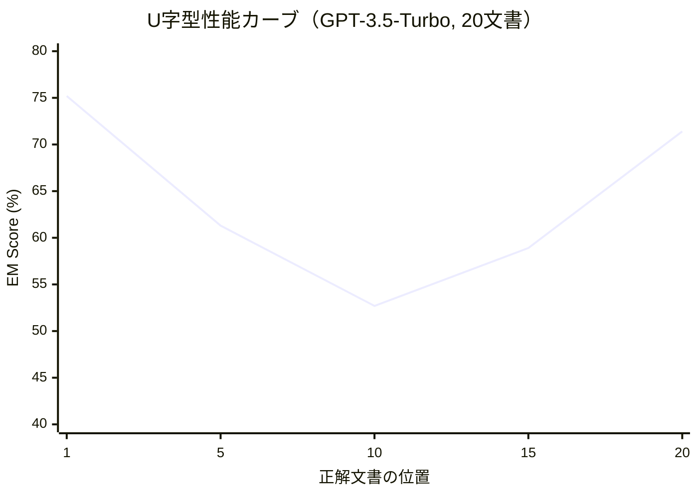

本記事は [Lost in the Middle: How Language Models Use Long Contexts](https://arxiv.org/abs/2407.01178) の解説記事です。

## 論文概要（Abstract）

Liu, Lin, Hewitt, Paranjape, Bevilacqua, Petroni, Liang（Stanford University / Meta AI, 2023）は、ロングコンテキストを入力可能なLLMが実際にはそのコンテキストを均一に活用できていないことを実証した。マルチドキュメントQAとキー値検索の2タスクで評価した結果、**関連情報がコンテキストの先頭か末尾にある場合に性能が最も高く、中間にある場合に大幅に劣化する**というU字型の性能パターンが、オープンソース・クローズドソースを問わず全モデルで一貫して観測された。

この記事は [Zenn記事: CLAUDE.md最適化の最前線：開発者が実践する5つのプロンプト設計戦略](https://zenn.dev/0h_n0/articles/c06ff696c6d2b5) の深掘りです。

## 情報源

- **arXiv ID**: 2407.01178
- **URL**: [https://arxiv.org/abs/2407.01178](https://arxiv.org/abs/2407.01178)
- **著者**: Nelson F. Liu, Kevin Lin, John Hewitt, Ashwin Paranjape, Michele Bevilacqua, Fabio Petroni, Percy Liang（Stanford University, Meta AI）
- **発表年**: 2023
- **分野**: cs.CL
- **コード**: [https://github.com/nelson-liu/lost-in-the-middle](https://github.com/nelson-liu/lost-in-the-middle)（MIT License）

## 背景と動機（Background & Motivation）

LLMのコンテキストウィンドウは急速に拡大してきた。GPT-3の2Kトークンから、GPT-3.5の4K/16K、GPT-4の8K/32K、Claude 1.3の100K、そして現在のClaude 3.5/4世代では200Kに達している。しかし、「長いコンテキストを入力できること」と「入力した情報を効果的に活用できること」は別の問題である。

この論文は「LLMは入力コンテキスト内の異なる位置にある情報をどの程度効果的に使えるか？」という根本的な問いに取り組んでいる。CLAUDE.mdのような設定ファイルの設計において、「重要な指示をどこに配置すべきか」という実用的な問いに対する実験的根拠を提供する研究である。

## 主要な貢献（Key Contributions）

- **貢献1**: ロングコンテキストLLMがコンテキスト中間の情報を活用しにくいU字型性能パターンを、複数モデル・複数タスクで実証した
- **貢献2**: この現象がロングコンテキスト専用設計のモデル（Claude 100K、LongChat等）でも解消されないことを示した
- **貢献3**: RAGシステムにおける文書配置順序の最適化で約8%の性能改善が可能であることを示した

## 技術的詳細（Technical Details）

### 実験設計

#### タスク1: マルチドキュメントQA

NaturalQuestions-Openデータセットを使用し、$k$個の文書（$k = 10, 20, 30$）のうち1個に正解を含め、残りはdistractorとして配置する。

$$
\text{Accuracy}(p) = \frac{|\{q_i : \text{model correctly answers } q_i \text{ when answer at position } p\}|}{|Q|}
$$

ここで、
- $p$: 正解文書の位置（$1 \leq p \leq k$）
- $Q$: 評価質問セット
- $q_i$: 個別の質問

正解文書の位置$p$を$1$（先頭）から$k$（末尾）まで変化させ、各位置でのExact Match（EM）スコアを測定する。

#### タスク2: キー値検索

合成データとして$k$個（$k = 75, 140$）のキー値ペアを持つJSONオブジェクトを作成し、指定されたキーに対応する値を検索させる。このタスクはdistractorが存在せず、純粋に位置依存の性能劣化を測定するものである。

### 中核的発見: U字型性能カーブ

著者らの実験結果（論文Figure 2、Table 2より）:

**GPT-3.5-Turbo（20文書設定）でのEM スコア**:

| 正解文書の位置 | EMスコア |
|--------------|---------|
| 1番目（先頭） | 75.2% |
| 5番目 | 61.3% |
| 10番目（中間） | 52.7% |
| 15番目 | 58.9% |
| 20番目（末尾） | 71.4% |

先頭の75.2%から中間の52.7%まで、**22.5パーセントポイントの性能劣化**が観測される。



### 文書数による影響

コンテキストに含める文書数が増えるほど、先頭/末尾と中間の性能ギャップが拡大する。

著者らの実験結果（論文Table 2より）:

| 文書数 | 最良位置（EM） | 中間位置（EM） | ギャップ |
|-------|-------------|-------------|--------|
| 10 | 80.1% | 65.3% | 14.8pp |
| 20 | 75.2% | 52.7% | 22.5pp |
| 30 | 70.3% | 43.8% | 26.5pp |

30文書設定では中間位置の性能が43.8%まで低下し、先頭との差は26.5ppに達する。

### モデル間の比較

著者らの実験結果（論文Table 3より）:

| モデル | 最良EM | 中間EM | ギャップ |
|--------|-------|--------|--------|
| GPT-3.5-Turbo (16K) | 75.2% | 52.7% | 22.5pp |
| GPT-4 (8K) | 81.3% | 60.8% | 20.5pp |
| Claude 1.3 (100K) | 77.4% | 55.1% | 22.3pp |
| LongChat-13B (16K) | 65.1% | 38.2% | 26.9pp |
| MPT-30B-Instruct (8K) | 58.3% | 31.4% | 26.9pp |

**注目すべき点**: ロングコンテキスト専用設計のモデル（Claude 1.3の100K、LongChat-13Bの16K）でも、U字型パターンは解消されていない。

### キー値検索でも同様のパターン

distractorが存在しないキー値検索でも同様のU字型パターンが観測される。

著者らの実験結果（論文Figure 3より）:

| KVペア数 | 先頭EM | 中間EM | 末尾EM |
|---------|--------|--------|--------|
| 75 | 97.1% | 73.2% | 95.8% |
| 140 | 93.6% | 61.4% | 91.3% |

### Primacy BiasとRecency Bias

著者らの分析（論文Section 4.1）によると、モデルの訓練方法によってバイアスの方向が異なる。

- **Instruction-tunedモデル**: Recency bias（末尾寄り）が強い
- **ベースモデル**: Primacy bias（先頭寄り）が強い
- **両方に共通**: 中間位置での性能劣化

### Oracle上限

正解文書のみを提示した場合（distractorなし）、性能は93〜95% EMに達する。これは、モデル自体は質問に回答する能力を持っており、コンテキスト内の情報過多が性能劣化の原因であることを示している。

## 実装のポイント（Implementation）

### CLAUDE.md設計への直接的含意

この論文の知見は、CLAUDE.mdの構造設計に以下の具体的な指針を与える。

```markdown
# CLAUDE.md構造設計の最適化（Lost in the Middle準拠）

# === 先頭ゾーン（Primacy Zone: 最高優先度） ===
# 最重要ルール、プロジェクトの制約条件

# コードスタイル
- ES Modules使用（CommonJS禁止）
- strictモード有効

# テスト
- `pnpm test` で実行
- コード変更後は必ずtypecheck

# === 中間ゾーン（参照情報） ===
# ファイルパスへのポインタ、詳細はリンク先を参照
# この領域の情報はClaudeが見落としやすい

API設計規約: @docs/api-conventions.md
Gitワークフロー: @docs/git-instructions.md

# === 末尾ゾーン（Recency Zone: 高優先度） ===
# 先頭の重要ルールを再掲（Principle 6: 重要指示の繰り返し）

# ⚠️ 重要（再掲）: コード変更後は必ずtypecheckを実行
# ⚠️ 重要（再掲）: テストは全体スイートではなく単体テストを優先
```

### RAGシステムへの応用

著者らの分析によると、RAGパイプラインにおける文書の配置順序を最適化するだけで約8%の性能改善が得られる。

```python
def optimize_document_order(
    documents: list[dict],
    scores: list[float]
) -> list[dict]:
    """Lost in the Middleの知見に基づくRAG文書並べ替え

    Args:
        documents: 検索結果文書のリスト
        scores: 各文書の関連度スコア

    Returns:
        U字型パターンを考慮した並べ替え済み文書リスト
    """
    # スコアで降順ソート
    sorted_pairs = sorted(
        zip(documents, scores),
        key=lambda x: x[1],
        reverse=True
    )

    n = len(sorted_pairs)
    result = [None] * n

    # 最高スコア → 先頭
    # 2位スコア → 末尾
    # 残り → 中間に配置（見落としリスクが高い領域）
    for i, (doc, score) in enumerate(sorted_pairs):
        if i == 0:
            result[0] = doc          # 先頭
        elif i == 1:
            result[n - 1] = doc      # 末尾
        else:
            # 中間を外側から埋める
            if i % 2 == 0:
                result[i // 2] = doc
            else:
                result[n - 1 - i // 2] = doc

    return [doc for doc in result if doc is not None]
```

## 実験結果の追加分析（Results）

### シリアライズ順序の影響

著者らの分析（論文Section 4.2）によると、キー値検索タスクでは、意味的に同一のデータであってもシリアライズ順序が性能に影響する。これはLLMの位置依存的な注意パターンが、内容の意味とは独立に存在することを示唆している。

### CLAUDE.md設計との接続

Arize AIの分析で報告されている「300行のCLAUDE.mdを60行に圧縮してコンテキスト60%節約」という知見は、この論文の発見と整合する。CLAUDE.mdが長くなるほど、中間部分に配置された指示が見落とされるリスクが高まるため、ファイルを短くすること自体が性能改善につながる。

HumanLayer社の分析で指摘される「フロンティアLLMが確実に従える命令数は約150〜200個」という制約も、この論文のU字型劣化と関連する。命令数が増えるほど中間命令の見落としリスクが増大するため、CLAUDE.mdの命令数を最小化することが推奨される。

## 実運用への応用（Practical Applications）

### コンテキストウィンドウ管理戦略

1. **CLAUDE.md**: 60行以下に保ち、最重要ルールを先頭と末尾に配置する
2. **RAG文書**: 最高関連度の文書を先頭、2位を末尾に配置する（約8%改善）
3. **文書数の制限**: 20文書（22.5ppギャップ）より10文書（14.8ppギャップ）のほうが中間劣化が小さい
4. **サブエージェント**: メインコンテキストの肥大化を防ぐため、調査タスクをサブエージェントに委譲する

### 制約事項

- 評価は2023年時点のモデルに基づいており、Claude 3.5/4やGPT-4o以降のモデルではU字型パターンが軽減されている可能性がある
- 評価タスクは事実型QAとキー値検索に限定されており、コード生成や長文要約といったタスクへの汎化は未検証
- 位置依存の性能劣化がアーキテクチャの本質的制約なのか、訓練データのバイアスに起因するのかは未決着

## 関連研究（Related Work）

- **Izacard and Grave（2021）**: Fusion-in-Decoder（FiD）によるマルチドキュメントQA。本論文はFiDの入力順序が性能に影響することを示した
- **Lewis et al.（2020）**: RAG（Retrieval-Augmented Generation）の原論文。本論文はRAGにおける文書配置の重要性を実証した
- **Su et al.（2022）**: RoPE位置エンコーディング。本論文はRoPEベースのモデルでもU字型パターンが存在することを確認した

## まとめと今後の展望

Liu et al.（2023）は、LLMがロングコンテキストの中間情報を効果的に活用できないU字型性能パターンを、複数のモデルとタスクで実証した。この知見はCLAUDE.mdの構造設計（先頭と末尾に重要情報を配置する戦略）やRAGパイプラインの文書順序最適化に直接的な示唆を与える。

最新モデルではこの問題が部分的に軽減されている可能性があるが、「重要な情報はコンテキストの先頭か末尾に配置すべきである」という設計原則は、現在のLLM利用においても有効なベストプラクティスである。

## 参考文献

- **arXiv**: [https://arxiv.org/abs/2407.01178](https://arxiv.org/abs/2407.01178)
- **Code**: [https://github.com/nelson-liu/lost-in-the-middle](https://github.com/nelson-liu/lost-in-the-middle)
- **Related Zenn article**: [https://zenn.dev/0h_n0/articles/c06ff696c6d2b5](https://zenn.dev/0h_n0/articles/c06ff696c6d2b5)
- Izacard and Grave, 2021 - Fusion-in-Decoder
- Lewis et al., 2020 - Retrieval-Augmented Generation
- Su et al., 2022 - RoPE Positional Encodings

---

:::message
この記事はAI（Claude Code）により自動生成されました。本記事は論文の引用・解説であり、筆者自身が実験を行ったものではありません。内容の正確性については原論文をご確認ください。
:::
